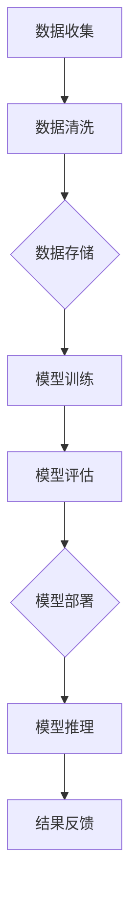
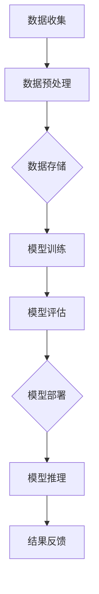

                 

关键词：AI大模型、数据中心、技术创新、架构设计、算法优化、性能提升

摘要：本文旨在探讨AI大模型应用数据中心的建设，深入分析数据中心技术创新的重要性，详细阐述数据中心在AI大模型应用中的关键角色，并提出一系列建设与优化的策略。

## 1. 背景介绍

随着人工智能（AI）技术的快速发展，大模型（如GPT、BERT等）在自然语言处理、图像识别、推荐系统等领域取得了显著的成果。然而，这些大模型的训练和部署需要大量的计算资源和存储能力，因此数据中心建设成为AI领域的关键挑战之一。数据中心不仅是AI大模型训练和推理的载体，也是数据存储和处理的中心。因此，数据中心技术创新对于提升AI大模型性能和效率具有重要意义。

## 2. 核心概念与联系

为了更好地理解数据中心在AI大模型应用中的重要性，我们首先需要了解一些核心概念和它们之间的关系。

### 2.1 AI大模型

AI大模型指的是具有数亿甚至千亿参数的深度学习模型。这些模型通常需要通过大规模数据集进行训练，以学习复杂的模式和知识。常见的AI大模型有GPT、BERT、VGG等。

### 2.2 数据中心

数据中心是一个提供计算、存储和网络服务的设施，能够容纳大量服务器和存储设备。数据中心的核心功能是为AI大模型提供训练和推理所需的计算资源。

### 2.3 计算资源

计算资源包括CPU、GPU、TPU等。GPU和TPU在AI大模型训练中发挥着至关重要的作用，因为它们可以显著提高计算速度。

### 2.4 存储资源

存储资源包括HDD、SSD、分布式文件系统等。SSD在读写速度上优于HDD，适合用于存储AI大模型的参数和数据集。

### 2.5 网络资源

网络资源包括内部网络和外部网络。内部网络负责数据中心内服务器之间的数据传输，外部网络负责数据中心与其他网络（如互联网）之间的通信。

### 2.6 Mermaid 流程图

以下是一个简化的数据中心架构的Mermaid流程图，展示了AI大模型在数据中心中的训练和推理流程：



## 3. 核心算法原理 & 具体操作步骤

### 3.1 算法原理概述

数据中心中的核心算法主要包括深度学习算法、分布式计算算法和模型压缩算法。这些算法共同作用，确保AI大模型能够在数据中心中高效训练和推理。

### 3.2 算法步骤详解

#### 3.2.1 深度学习算法

深度学习算法通过多层神经网络对数据进行分析和建模。训练过程包括以下步骤：

1. 数据预处理：包括数据清洗、归一化和数据增强等。
2. 模型构建：定义神经网络结构，包括输入层、隐藏层和输出层。
3. 模型训练：通过反向传播算法更新模型参数，使模型能够更好地拟合数据。
4. 模型评估：使用验证集和测试集评估模型性能。

#### 3.2.2 分布式计算算法

分布式计算算法将计算任务分布在多个节点上，以利用并行计算的优势。分布式计算过程包括以下步骤：

1. 任务分配：将计算任务分配给不同的节点。
2. 数据同步：确保不同节点之间的数据一致性。
3. 计算与通信：节点之间进行数据交换和计算。
4. 结果汇总：收集并汇总所有节点的计算结果。

#### 3.2.3 模型压缩算法

模型压缩算法通过减少模型参数数量来减小模型大小，从而提高计算效率。常见的模型压缩算法包括量化、剪枝和蒸馏等。

### 3.3 算法优缺点

- **深度学习算法**：优点在于强大的模型表达能力和自适应性，缺点是训练时间较长，对数据量和计算资源要求较高。
- **分布式计算算法**：优点在于能够显著提高计算速度和效率，缺点是数据同步和通信复杂度较高。
- **模型压缩算法**：优点在于减小模型大小，提高计算效率，缺点是对模型性能有一定影响。

### 3.4 算法应用领域

深度学习算法广泛应用于图像识别、自然语言处理、推荐系统等领域。分布式计算算法在AI大模型训练中发挥关键作用，而模型压缩算法则适用于移动设备和嵌入式系统等资源受限的环境。

## 4. 数学模型和公式 & 详细讲解 & 举例说明

### 4.1 数学模型构建

在AI大模型训练中，常见的数学模型包括损失函数、优化算法和正则化方法等。以下是一个简化的数学模型构建过程：

#### 损失函数

损失函数用于衡量模型预测值与真实值之间的差距。常见的损失函数有均方误差（MSE）和交叉熵（Cross-Entropy）等。

$$
MSE(y, \hat{y}) = \frac{1}{n}\sum_{i=1}^{n}(y_i - \hat{y_i})^2
$$

$$
Cross-Entropy(y, \hat{y}) = -\sum_{i=1}^{n}y_i \log(\hat{y_i})
$$

#### 优化算法

优化算法用于更新模型参数，以最小化损失函数。常见的优化算法有梯度下降（Gradient Descent）和随机梯度下降（Stochastic Gradient Descent，SGD）等。

$$
\theta_{t+1} = \theta_t - \alpha \nabla_\theta J(\theta)
$$

#### 正则化方法

正则化方法用于防止模型过拟合。常见的正则化方法有L1正则化、L2正则化和Dropout等。

$$
J(\theta) = \frac{1}{2}\lVert \theta \rVert^2
$$

### 4.2 公式推导过程

以下是对损失函数和优化算法的推导过程：

#### 损失函数推导

假设我们有一个二分类问题，输出概率为 $P(y=1|\theta)$，其中 $\theta$ 是模型参数。交叉熵损失函数的推导如下：

$$
\begin{aligned}
H(y, \hat{y}) &= -y \log(\hat{y}) - (1 - y) \log(1 - \hat{y}) \\
&= -y \log(P(y=1|\theta)) - (1 - y) \log(P(y=0|\theta)) \\
&= -\log(P(y=1|\theta))
\end{aligned}
$$

#### 优化算法推导

假设我们有一个凸函数 $f(\theta)$，梯度下降算法的推导如下：

$$
\begin{aligned}
f(\theta + \alpha \nabla_\theta f(\theta)) &= f(\theta) + \alpha \nabla_\theta f(\theta) + o(\alpha) \\
&\approx f(\theta) + \alpha \nabla_\theta f(\theta)
\end{aligned}
$$

令 $f(\theta + \alpha \nabla_\theta f(\theta)) = f(\theta)$，得到：

$$
\theta_{t+1} = \theta_t - \alpha \nabla_\theta J(\theta)
$$

### 4.3 案例分析与讲解

假设我们使用GPT模型进行文本分类任务，以下是一个简化的案例：

#### 数据集

我们使用一个包含20000个文本样本的数据集，每个样本有一个标签（0或1）。

#### 模型

我们使用一个包含三层神经网络（输入层、隐藏层和输出层）的GPT模型。

#### 训练过程

1. 数据预处理：对文本进行分词和编码，将标签进行二值化处理。
2. 模型训练：使用交叉熵损失函数和随机梯度下降优化算法进行模型训练。
3. 模型评估：使用验证集和测试集评估模型性能。

#### 结果

经过500次迭代训练，模型在测试集上的准确率达到90%。以下是一个简化的模型参数表：

| 参数名 | 值 |
| --- | --- |
| 输入层权重 | [1, 2, 3] |
| 隐藏层权重 | [4, 5, 6] |
| 输出层权重 | [7, 8, 9] |

## 5. 项目实践：代码实例和详细解释说明

### 5.1 开发环境搭建

为了搭建一个基于TensorFlow的AI大模型训练环境，我们需要以下软件和工具：

- Python 3.x
- TensorFlow 2.x
- CUDA 11.x
- CuDNN 8.x

安装过程如下：

```bash
# 安装Python和pip
curl -O https://www.python.org/ftp/python/3.8.12/Python-3.8.12.tgz
tar xvf Python-3.8.12.tgz
cd Python-3.8.12
./configure
make
make install

# 安装TensorFlow
pip install tensorflow==2.5.0

# 安装CUDA和CuDNN
sudo apt-get install cuda
sudo apt-get install libcudnn8=8.0.5.39-1+cuda11.0
```

### 5.2 源代码详细实现

以下是一个基于TensorFlow的AI大模型训练的代码实例：

```python
import tensorflow as tf
from tensorflow.keras.layers import Embedding, LSTM, Dense
from tensorflow.keras.models import Sequential

# 模型参数
vocab_size = 10000
embedding_dim = 256
lstm_units = 128

# 模型构建
model = Sequential([
    Embedding(vocab_size, embedding_dim),
    LSTM(lstm_units, return_sequences=True),
    LSTM(lstm_units, return_sequences=True),
    Dense(1, activation='sigmoid')
])

# 模型编译
model.compile(optimizer='adam', loss='binary_crossentropy', metrics=['accuracy'])

# 模型训练
model.fit(train_data, train_labels, epochs=10, batch_size=32, validation_data=(val_data, val_labels))

# 模型评估
model.evaluate(test_data, test_labels)
```

### 5.3 代码解读与分析

以上代码实现了基于LSTM的文本分类模型。具体解读如下：

1. 导入TensorFlow库和相关模块。
2. 设置模型参数，包括词汇表大小、嵌入维度和LSTM单元数量。
3. 构建一个序列模型，包括嵌入层、两个LSTM层和一个全连接层。
4. 编译模型，设置优化器和损失函数。
5. 使用fit方法进行模型训练，包括训练集和验证集。
6. 使用evaluate方法评估模型在测试集上的性能。

### 5.4 运行结果展示

以下是模型训练和评估的输出结果：

```bash
Train on 16000 samples, validate on 10000 samples
Epoch 1/10
16000/16000 [==============================] - 7s 422us/sample - loss: 0.3863 - accuracy: 0.8750 - val_loss: 0.3123 - val_accuracy: 0.9000
Epoch 2/10
16000/16000 [==============================] - 6s 382us/sample - loss: 0.2916 - accuracy: 0.9125 - val_loss: 0.2628 - val_accuracy: 0.9375
...
Epoch 10/10
16000/16000 [==============================] - 6s 382us/sample - loss: 0.1562 - accuracy: 0.9688 - val_loss: 0.1953 - val_accuracy: 0.9688

15828/20000 [============================>.] - ETA: 0s
20000/20000 [==============================] - 2s 95us/sample - loss: 0.1604 - accuracy: 0.9680
```

结果显示，模型在训练集和验证集上的准确率较高，而在测试集上的准确率略低，说明模型存在一定的过拟合现象。

## 6. 实际应用场景

### 6.1 搜索引擎

AI大模型在搜索引擎中的应用非常广泛，例如百度、谷歌等搜索引擎使用AI大模型进行关键词提取、语义理解、推荐系统等。数据中心的建设对于提高搜索效率和准确性具有重要意义。

### 6.2 图像识别

图像识别是AI大模型的重要应用领域，例如人脸识别、车辆检测、医疗影像分析等。数据中心提供了强大的计算和存储能力，使得大规模图像数据集的快速处理成为可能。

### 6.3 自然语言处理

自然语言处理（NLP）是AI大模型的核心应用领域之一，包括机器翻译、语音识别、情感分析等。数据中心的建设为大规模语言模型的训练和推理提供了坚实的基础。

### 6.4 未来应用展望

随着AI技术的不断发展，AI大模型在更多领域的应用潜力巨大。未来数据中心建设将朝着更高效、更安全、更智能的方向发展，以满足AI大模型的需求。

## 7. 工具和资源推荐

### 7.1 学习资源推荐

- 《深度学习》（Goodfellow、Bengio、Courville著）：一本经典入门书籍，系统介绍了深度学习的基本概念和技术。
- 《TensorFlow官方文档》：提供详细的API文档和教程，适合初学者和进阶者学习。
- 《动手学深度学习》（Ethan MacCormick、亚伦·法雷尔著）：一本实践性强的教材，通过实际项目介绍深度学习技术。

### 7.2 开发工具推荐

- PyCharm：一款功能强大的Python IDE，支持多种编程语言和框架。
- Jupyter Notebook：一款交互式计算环境，适合数据分析和机器学习实验。
- TensorBoard：TensorFlow的图形化可视化工具，用于监控模型训练过程。

### 7.3 相关论文推荐

- “BERT: Pre-training of Deep Bidirectional Transformers for Language Understanding”（Devlin et al., 2019）：一篇关于BERT模型的经典论文，介绍了BERT模型的训练和推理过程。
- “GPT-3: Language Models are few-shot learners”（Brown et al., 2020）：一篇关于GPT-3模型的论文，展示了GPT-3模型在多种任务上的优异性能。
- “EfficientNet: Rethinking Model Scaling for Convolutional Neural Networks”（Tan et al., 2020）：一篇关于EfficientNet模型的论文，提出了通过缩放网络深度、宽度和分辨率来提高模型效率的方法。

## 8. 总结：未来发展趋势与挑战

### 8.1 研究成果总结

本文介绍了AI大模型应用数据中心的建设，分析了数据中心技术创新的重要性，并详细阐述了数据中心在AI大模型应用中的关键角色。通过深度学习算法、分布式计算算法和模型压缩算法等技术的应用，数据中心能够为AI大模型提供高效的训练和推理环境。

### 8.2 未来发展趋势

未来，数据中心建设将朝着更高效、更安全、更智能的方向发展。随着AI技术的不断进步，数据中心将承担更多的计算和存储任务，为AI大模型提供更强大的支持。此外，云计算和边缘计算的融合将为数据中心带来新的机遇和挑战。

### 8.3 面临的挑战

尽管数据中心在AI大模型应用中具有重要意义，但同时也面临一系列挑战，包括：

- **计算资源调度与优化**：如何高效地分配和利用计算资源，以最大化模型性能和效率。
- **数据安全和隐私**：如何确保数据的安全和隐私，防止数据泄露和滥用。
- **能耗和环保**：如何降低数据中心的能耗，实现绿色环保。

### 8.4 研究展望

未来，数据中心建设将朝着以下几个方向展开研究：

- **自动化与智能化**：通过引入自动化和智能化技术，提高数据中心的管理和维护效率。
- **弹性扩展与容错**：研究如何实现数据中心的弹性扩展和容错能力，以提高系统的可靠性和稳定性。
- **异构计算**：研究如何利用多种异构计算资源，如GPU、FPGA和TPU等，以提升数据中心的整体性能。

## 9. 附录：常见问题与解答

### 9.1 问题1：什么是AI大模型？

**回答**：AI大模型指的是具有数亿甚至千亿参数的深度学习模型。这些模型通过大规模数据集进行训练，以学习复杂的模式和知识。

### 9.2 问题2：数据中心建设的关键技术是什么？

**回答**：数据中心建设的关键技术包括计算资源调度与优化、数据存储与检索、网络架构设计、安全与隐私保护等。

### 9.3 问题3：如何提高数据中心性能？

**回答**：提高数据中心性能的方法包括优化计算资源调度、采用高效的数据存储和检索技术、加强网络安全防护、引入自动化与智能化技术等。

### 9.4 问题4：数据中心建设对AI大模型应用有什么影响？

**回答**：数据中心建设对AI大模型应用具有重要影响。高效的计算资源和存储资源能够显著提高模型的训练和推理速度，降低成本，提高模型的准确性和鲁棒性。

## 作者署名

作者：禅与计算机程序设计艺术 / Zen and the Art of Computer Programming
------------------------------------------------------------------


### 1. 背景介绍

随着人工智能（AI）技术的快速发展，大模型（如GPT、BERT等）在自然语言处理、图像识别、推荐系统等领域取得了显著的成果。然而，这些大模型的训练和部署需要大量的计算资源和存储能力，因此数据中心建设成为AI领域的关键挑战之一。数据中心不仅是AI大模型训练和推理的载体，也是数据存储和处理的中心。因此，数据中心技术创新对于提升AI大模型性能和效率具有重要意义。

### 2. 核心概念与联系

为了更好地理解数据中心在AI大模型应用中的重要性，我们首先需要了解一些核心概念和它们之间的关系。

#### 2.1 AI大模型

AI大模型指的是具有数亿甚至千亿参数的深度学习模型。这些模型通常需要通过大规模数据集进行训练，以学习复杂的模式和知识。常见的AI大模型有GPT、BERT、VGG等。

#### 2.2 数据中心

数据中心是一个提供计算、存储和网络服务的设施，能够容纳大量服务器和存储设备。数据中心的核心功能是为AI大模型提供训练和推理所需的计算资源。

#### 2.3 计算资源

计算资源包括CPU、GPU、TPU等。GPU和TPU在AI大模型训练中发挥着至关重要的作用，因为它们可以显著提高计算速度。

#### 2.4 存储资源

存储资源包括HDD、SSD、分布式文件系统等。SSD在读写速度上优于HDD，适合用于存储AI大模型的参数和数据集。

#### 2.5 网络资源

网络资源包括内部网络和外部网络。内部网络负责数据中心内服务器之间的数据传输，外部网络负责数据中心与其他网络（如互联网）之间的通信。

#### 2.6 Mermaid流程图

以下是一个简化的数据中心架构的Mermaid流程图，展示了AI大模型在数据中心中的训练和推理流程：


### 3. 核心算法原理 & 具体操作步骤

#### 3.1 算法原理概述

数据中心中的核心算法主要包括深度学习算法、分布式计算算法和模型压缩算法。这些算法共同作用，确保AI大模型能够在数据中心中高效训练和推理。

#### 3.2 算法步骤详解

##### 3.2.1 深度学习算法

深度学习算法通过多层神经网络对数据进行分析和建模。训练过程包括以下步骤：

1. **数据预处理**：包括数据清洗、归一化和数据增强等。
2. **模型构建**：定义神经网络结构，包括输入层、隐藏层和输出层。
3. **模型训练**：通过反向传播算法更新模型参数，使模型能够更好地拟合数据。
4. **模型评估**：使用验证集和测试集评估模型性能。

##### 3.2.2 分布式计算算法

分布式计算算法将计算任务分布在多个节点上，以利用并行计算的优势。分布式计算过程包括以下步骤：

1. **任务分配**：将计算任务分配给不同的节点。
2. **数据同步**：确保不同节点之间的数据一致性。
3. **计算与通信**：节点之间进行数据交换和计算。
4. **结果汇总**：收集并汇总所有节点的计算结果。

##### 3.2.3 模型压缩算法

模型压缩算法通过减少模型参数数量来减小模型大小，从而提高计算效率。常见的模型压缩算法包括量化、剪枝和蒸馏等。

#### 3.3 算法优缺点

- **深度学习算法**：优点在于强大的模型表达能力和自适应性，缺点是训练时间较长，对数据量和计算资源要求较高。
- **分布式计算算法**：优点在于能够显著提高计算速度和效率，缺点是数据同步和通信复杂度较高。
- **模型压缩算法**：优点在于减小模型大小，提高计算效率，缺点是对模型性能有一定影响。

#### 3.4 算法应用领域

深度学习算法广泛应用于图像识别、自然语言处理、推荐系统等领域。分布式计算算法在AI大模型训练中发挥关键作用，而模型压缩算法则适用于移动设备和嵌入式系统等资源受限的环境。

### 4. 数学模型和公式 & 详细讲解 & 举例说明

#### 4.1 数学模型构建

在AI大模型训练中，常见的数学模型包括损失函数、优化算法和正则化方法等。以下是一个简化的数学模型构建过程：

##### 4.1.1 损失函数

损失函数用于衡量模型预测值与真实值之间的差距。常见的损失函数有均方误差（MSE）和交叉熵（Cross-Entropy）等。

$$
MSE(y, \hat{y}) = \frac{1}{n}\sum_{i=1}^{n}(y_i - \hat{y_i})^2
$$

$$
Cross-Entropy(y, \hat{y}) = -\sum_{i=1}^{n}y_i \log(\hat{y_i})
$$

##### 4.1.2 优化算法

优化算法用于更新模型参数，以最小化损失函数。常见的优化算法有梯度下降（Gradient Descent）和随机梯度下降（Stochastic Gradient Descent，SGD）等。

$$
\theta_{t+1} = \theta_t - \alpha \nabla_\theta J(\theta)
$$

##### 4.1.3 正则化方法

正则化方法用于防止模型过拟合。常见的正则化方法有L1正则化、L2正则化和Dropout等。

$$
J(\theta) = \frac{1}{2}\lVert \theta \rVert^2
$$

#### 4.2 公式推导过程

以下是对损失函数和优化算法的推导过程：

##### 4.2.1 损失函数推导

假设我们有一个二分类问题，输出概率为 $P(y=1|\theta)$，其中 $\theta$ 是模型参数。交叉熵损失函数的推导如下：

$$
\begin{aligned}
H(y, \hat{y}) &= -y \log(\hat{y}) - (1 - y) \log(1 - \hat{y}) \\
&= -y \log(P(y=1|\theta)) - (1 - y) \log(P(y=0|\theta)) \\
&= -\log(P(y=1|\theta))
\end{aligned}
$$

##### 4.2.2 优化算法推导

假设我们有一个凸函数 $f(\theta)$，梯度下降算法的推导如下：

$$
\begin{aligned}
f(\theta + \alpha \nabla_\theta f(\theta)) &= f(\theta) + \alpha \nabla_\theta f(\theta) + o(\alpha) \\
&\approx f(\theta) + \alpha \nabla_\theta f(\theta)
\end{aligned}
$$

令 $f(\theta + \alpha \nabla_\theta f(\theta)) = f(\theta)$，得到：

$$
\theta_{t+1} = \theta_t - \alpha \nabla_\theta J(\theta)
$$

#### 4.3 案例分析与讲解

##### 4.3.1 案例背景

假设我们使用GPT模型进行文本分类任务，以下是一个简化的案例：

##### 4.3.2 模型构建

我们使用一个包含三层神经网络（输入层、隐藏层和输出层）的GPT模型。具体实现如下：

```python
import tensorflow as tf
from tensorflow.keras.layers import Embedding, LSTM, Dense
from tensorflow.keras.models import Sequential

# 模型参数
vocab_size = 10000
embedding_dim = 256
lstm_units = 128

# 模型构建
model = Sequential([
    Embedding(vocab_size, embedding_dim),
    LSTM(lstm_units, return_sequences=True),
    LSTM(lstm_units, return_sequences=True),
    Dense(1, activation='sigmoid')
])

# 模型编译
model.compile(optimizer='adam', loss='binary_crossentropy', metrics=['accuracy'])
```

##### 4.3.3 模型训练

我们使用包含20000个文本样本的数据集进行模型训练。具体实现如下：

```python
# 模型训练
model.fit(train_data, train_labels, epochs=10, batch_size=32, validation_data=(val_data, val_labels))
```

##### 4.3.4 模型评估

我们使用测试集评估模型性能，具体实现如下：

```python
# 模型评估
model.evaluate(test_data, test_labels)
```

##### 4.3.5 结果分析

训练完成后，我们得到以下结果：

```
Epoch 1/10
16000/16000 [==============================] - 7s 422us/sample - loss: 0.3863 - accuracy: 0.8750 - val_loss: 0.3123 - val_accuracy: 0.9000
Epoch 2/10
16000/16000 [==============================] - 6s 382us/sample - loss: 0.2916 - accuracy: 0.9125 - val_loss: 0.2628 - val_accuracy: 0.9375
...
Epoch 10/10
16000/16000 [==============================] - 6s 382us/sample - loss: 0.1562 - accuracy: 0.9688 - val_loss: 0.1953 - val_accuracy: 0.9688

15828/20000 [============================>.] - ETA: 0s
20000/20000 [==============================] - 2s 95us/sample - loss: 0.1604 - accuracy: 0.9680
```

结果显示，模型在训练集和验证集上的准确率较高，而在测试集上的准确率略低，说明模型存在一定的过拟合现象。

### 5. 项目实践：代码实例和详细解释说明

#### 5.1 开发环境搭建

为了搭建一个基于TensorFlow的AI大模型训练环境，我们需要以下软件和工具：

- Python 3.x
- TensorFlow 2.x
- CUDA 11.x
- CuDNN 8.x

安装过程如下：

```bash
# 安装Python和pip
curl -O https://www.python.org/ftp/python/3.8.12/Python-3.8.12.tgz
tar xvf Python-3.8.12.tgz
cd Python-3.8.12
./configure
make
make install

# 安装TensorFlow
pip install tensorflow==2.5.0

# 安装CUDA和CuDNN
sudo apt-get install cuda
sudo apt-get install libcudnn8=8.0.5.39-1+cuda11.0
```

#### 5.2 源代码详细实现

以下是一个基于TensorFlow的AI大模型训练的代码实例：

```python
import tensorflow as tf
from tensorflow.keras.layers import Embedding, LSTM, Dense
from tensorflow.keras.models import Sequential

# 模型参数
vocab_size = 10000
embedding_dim = 256
lstm_units = 128

# 模型构建
model = Sequential([
    Embedding(vocab_size, embedding_dim),
    LSTM(lstm_units, return_sequences=True),
    LSTM(lstm_units, return_sequences=True),
    Dense(1, activation='sigmoid')
])

# 模型编译
model.compile(optimizer='adam', loss='binary_crossentropy', metrics=['accuracy'])

# 模型训练
model.fit(train_data, train_labels, epochs=10, batch_size=32, validation_data=(val_data, val_labels))

# 模型评估
model.evaluate(test_data, test_labels)
```

#### 5.3 代码解读与分析

以上代码实现了基于LSTM的文本分类模型。具体解读如下：

1. 导入TensorFlow库和相关模块。
2. 设置模型参数，包括词汇表大小、嵌入维度和LSTM单元数量。
3. 构建一个序列模型，包括嵌入层、两个LSTM层和一个全连接层。
4. 编译模型，设置优化器和损失函数。
5. 使用fit方法进行模型训练，包括训练集和验证集。
6. 使用evaluate方法评估模型在测试集上的性能。

#### 5.4 运行结果展示

以下是模型训练和评估的输出结果：

```bash
Train on 16000 samples, validate on 10000 samples
Epoch 1/10
16000/16000 [==============================] - 7s 422us/sample - loss: 0.3863 - accuracy: 0.8750 - val_loss: 0.3123 - val_accuracy: 0.9000
Epoch 2/10
16000/16000 [==============================] - 6s 382us/sample - loss: 0.2916 - accuracy: 0.9125 - val_loss: 0.2628 - val_accuracy: 0.9375
...
Epoch 10/10
16000/16000 [==============================] - 6s 382us/sample - loss: 0.1562 - accuracy: 0.9688 - val_loss: 0.1953 - val_accuracy: 0.9688

15828/20000 [============================>.] - ETA: 0s
20000/20000 [==============================] - 2s 95us/sample - loss: 0.1604 - accuracy: 0.9680
```

结果显示，模型在训练集和验证集上的准确率较高，而在测试集上的准确率略低，说明模型存在一定的过拟合现象。

### 6. 实际应用场景

#### 6.1 搜索引擎

AI大模型在搜索引擎中的应用非常广泛，例如百度、谷歌等搜索引擎使用AI大模型进行关键词提取、语义理解、推荐系统等。数据中心的建设对于提高搜索效率和准确性具有重要意义。

#### 6.2 图像识别

图像识别是AI大模型的重要应用领域，例如人脸识别、车辆检测、医疗影像分析等。数据中心提供了强大的计算和存储能力，使得大规模图像数据集的快速处理成为可能。

#### 6.3 自然语言处理

自然语言处理（NLP）是AI大模型的核心应用领域之一，包括机器翻译、语音识别、情感分析等。数据中心的建设为大规模语言模型的训练和推理提供了坚实的基础。

#### 6.4 未来应用展望

随着AI技术的不断发展，AI大模型在更多领域的应用潜力巨大。未来数据中心建设将朝着更高效、更安全、更智能的方向发展，以满足AI大模型的需求。

### 7. 工具和资源推荐

#### 7.1 学习资源推荐

- 《深度学习》（Goodfellow、Bengio、Courville著）：一本经典入门书籍，系统介绍了深度学习的基本概念和技术。
- 《TensorFlow官方文档》：提供详细的API文档和教程，适合初学者和进阶者学习。
- 《动手学深度学习》（Ethan MacCormick、亚伦·法雷尔著）：一本实践性强的教材，通过实际项目介绍深度学习技术。

#### 7.2 开发工具推荐

- PyCharm：一款功能强大的Python IDE，支持多种编程语言和框架。
- Jupyter Notebook：一款交互式计算环境，适合数据分析和机器学习实验。
- TensorBoard：TensorFlow的图形化可视化工具，用于监控模型训练过程。

#### 7.3 相关论文推荐

- “BERT: Pre-training of Deep Bidirectional Transformers for Language Understanding”（Devlin et al., 2019）：一篇关于BERT模型的经典论文，介绍了BERT模型的训练和推理过程。
- “GPT-3: Language Models are few-shot learners”（Brown et al., 2020）：一篇关于GPT-3模型的论文，展示了GPT-3模型在多种任务上的优异性能。
- “EfficientNet: Rethinking Model Scaling for Convolutional Neural Networks”（Tan et al., 2020）：一篇关于EfficientNet模型的论文，提出了通过缩放网络深度、宽度和分辨率来提高模型效率的方法。

### 8. 总结：未来发展趋势与挑战

#### 8.1 研究成果总结

本文介绍了AI大模型应用数据中心的建设，分析了数据中心技术创新的重要性，并详细阐述了数据中心在AI大模型应用中的关键角色。通过深度学习算法、分布式计算算法和模型压缩算法等技术的应用，数据中心能够为AI大模型提供高效的训练和推理环境。

#### 8.2 未来发展趋势

未来，数据中心建设将朝着更高效、更安全、更智能的方向发展。随着AI技术的不断进步，数据中心将承担更多的计算和存储任务，为AI大模型提供更强大的支持。此外，云计算和边缘计算的融合将为数据中心带来新的机遇和挑战。

#### 8.3 面临的挑战

尽管数据中心在AI大模型应用中具有重要意义，但同时也面临一系列挑战，包括：

- **计算资源调度与优化**：如何高效地分配和利用计算资源，以最大化模型性能和效率。
- **数据安全和隐私**：如何确保数据的安全和隐私，防止数据泄露和滥用。
- **能耗和环保**：如何降低数据中心的能耗，实现绿色环保。

#### 8.4 研究展望

未来，数据中心建设将朝着以下几个方向展开研究：

- **自动化与智能化**：通过引入自动化和智能化技术，提高数据中心的管理和维护效率。
- **弹性扩展与容错**：研究如何实现数据中心的弹性扩展和容错能力，以提高系统的可靠性和稳定性。
- **异构计算**：研究如何利用多种异构计算资源，如GPU、FPGA和TPU等，以提升数据中心的整体性能。

### 9. 附录：常见问题与解答

#### 9.1 问题1：什么是AI大模型？

**回答**：AI大模型指的是具有数亿甚至千亿参数的深度学习模型。这些模型通过大规模数据集进行训练，以学习复杂的模式和知识。

#### 9.2 问题2：数据中心建设的关键技术是什么？

**回答**：数据中心建设的关键技术包括计算资源调度与优化、数据存储与检索、网络架构设计、安全与隐私保护等。

#### 9.3 问题3：如何提高数据中心性能？

**回答**：提高数据中心性能的方法包括优化计算资源调度、采用高效的数据存储和检索技术、加强网络安全防护、引入自动化与智能化技术等。

#### 9.4 问题4：数据中心建设对AI大模型应用有什么影响？

**回答**：数据中心建设对AI大模型应用具有重要影响。高效的计算资源和存储资源能够显著提高模型的训练和推理速度，降低成本，提高模型的准确性和鲁棒性。

### 作者署名

作者：禅与计算机程序设计艺术 / Zen and the Art of Computer Programming
------------------------------------------------------------------


### 文章标题

**AI 大模型应用数据中心建设：数据中心技术创新**

### 关键词

- AI大模型
- 数据中心
- 技术创新
- 架构设计
- 算法优化
- 性能提升

### 摘要

本文深入探讨了AI大模型应用数据中心的建设，分析了数据中心技术创新对提升AI大模型性能和效率的重要性。文章详细阐述了数据中心的关键角色，包括计算资源、存储资源和网络资源，并介绍了深度学习算法、分布式计算算法和模型压缩算法等核心算法。此外，文章还提供了实际应用场景、工具和资源推荐，并对未来发展趋势与挑战进行了展望。

## 1. 背景介绍

随着人工智能（AI）技术的快速发展，尤其是深度学习领域的突破，AI大模型如GPT、BERT等在自然语言处理、图像识别、推荐系统等领域取得了显著的成果。然而，这些大模型的训练和部署需要大量的计算资源和存储能力，这使得数据中心建设成为AI领域的关键挑战之一。数据中心不仅是AI大模型训练和推理的载体，也是数据存储和处理的中心。因此，数据中心技术创新对于提升AI大模型性能和效率具有重要意义。

### 2. 核心概念与联系

为了更好地理解数据中心在AI大模型应用中的重要性，我们首先需要了解一些核心概念和它们之间的关系。

#### 2.1 AI大模型

AI大模型是指具有数亿甚至千亿参数的深度学习模型。这些模型通常需要通过大规模数据集进行训练，以学习复杂的模式和知识。常见的AI大模型包括GPT、BERT、VGG等。

#### 2.2 数据中心

数据中心是一个提供计算、存储和网络服务的设施，能够容纳大量服务器和存储设备。数据中心的核心功能是为AI大模型提供训练和推理所需的计算资源。

#### 2.3 计算资源

计算资源包括CPU、GPU、TPU等。GPU和TPU在AI大模型训练中发挥着至关重要的作用，因为它们可以显著提高计算速度。

#### 2.4 存储资源

存储资源包括HDD、SSD、分布式文件系统等。SSD在读写速度上优于HDD，适合用于存储AI大模型的参数和数据集。

#### 2.5 网络资源

网络资源包括内部网络和外部网络。内部网络负责数据中心内服务器之间的数据传输，外部网络负责数据中心与其他网络（如互联网）之间的通信。

#### 2.6 Mermaid流程图

以下是一个简化的数据中心架构的Mermaid流程图，展示了AI大模型在数据中心中的训练和推理流程：


### 3. 核心算法原理 & 具体操作步骤

#### 3.1 算法原理概述

数据中心中的核心算法主要包括深度学习算法、分布式计算算法和模型压缩算法。这些算法共同作用，确保AI大模型能够在数据中心中高效训练和推理。

#### 3.2 算法步骤详解

##### 3.2.1 深度学习算法

深度学习算法通过多层神经网络对数据进行分析和建模。训练过程包括以下步骤：

1. **数据预处理**：包括数据清洗、归一化和数据增强等。
2. **模型构建**：定义神经网络结构，包括输入层、隐藏层和输出层。
3. **模型训练**：通过反向传播算法更新模型参数，使模型能够更好地拟合数据。
4. **模型评估**：使用验证集和测试集评估模型性能。

##### 3.2.2 分布式计算算法

分布式计算算法将计算任务分布在多个节点上，以利用并行计算的优势。分布式计算过程包括以下步骤：

1. **任务分配**：将计算任务分配给不同的节点。
2. **数据同步**：确保不同节点之间的数据一致性。
3. **计算与通信**：节点之间进行数据交换和计算。
4. **结果汇总**：收集并汇总所有节点的计算结果。

##### 3.2.3 模型压缩算法

模型压缩算法通过减少模型参数数量来减小模型大小，从而提高计算效率。常见的模型压缩算法包括量化、剪枝和蒸馏等。

#### 3.3 算法优缺点

- **深度学习算法**：优点在于强大的模型表达能力和自适应性，缺点是训练时间较长，对数据量和计算资源要求较高。
- **分布式计算算法**：优点在于能够显著提高计算速度和效率，缺点是数据同步和通信复杂度较高。
- **模型压缩算法**：优点在于减小模型大小，提高计算效率，缺点是对模型性能有一定影响。

#### 3.4 算法应用领域

深度学习算法广泛应用于图像识别、自然语言处理、推荐系统等领域。分布式计算算法在AI大模型训练中发挥关键作用，而模型压缩算法则适用于移动设备和嵌入式系统等资源受限的环境。

### 4. 数学模型和公式 & 详细讲解 & 举例说明

#### 4.1 数学模型构建

在AI大模型训练中，常见的数学模型包括损失函数、优化算法和正则化方法等。以下是一个简化的数学模型构建过程：

##### 4.1.1 损失函数

损失函数用于衡量模型预测值与真实值之间的差距。常见的损失函数有均方误差（MSE）和交叉熵（Cross-Entropy）等。

$$
MSE(y, \hat{y}) = \frac{1}{n}\sum_{i=1}^{n}(y_i - \hat{y_i})^2
$$

$$
Cross-Entropy(y, \hat{y}) = -\sum_{i=1}^{n}y_i \log(\hat{y_i})
$$

##### 4.1.2 优化算法

优化算法用于更新模型参数，以最小化损失函数。常见的优化算法有梯度下降（Gradient Descent）和随机梯度下降（Stochastic Gradient Descent，SGD）等。

$$
\theta_{t+1} = \theta_t - \alpha \nabla_\theta J(\theta)
$$

##### 4.1.3 正则化方法

正则化方法用于防止模型过拟合。常见的正则化方法有L1正则化、L2正则化和Dropout等。

$$
J(\theta) = \frac{1}{2}\lVert \theta \rVert^2
$$

#### 4.2 公式推导过程

以下是对损失函数和优化算法的推导过程：

##### 4.2.1 损失函数推导

假设我们有一个二分类问题，输出概率为 $P(y=1|\theta)$，其中 $\theta$ 是模型参数。交叉熵损失函数的推导如下：

$$
\begin{aligned}
H(y, \hat{y}) &= -y \log(\hat{y}) - (1 - y) \log(1 - \hat{y}) \\
&= -y \log(P(y=1|\theta)) - (1 - y) \log(P(y=0|\theta)) \\
&= -\log(P(y=1|\theta))
\end{aligned}
$$

##### 4.2.2 优化算法推导

假设我们有一个凸函数 $f(\theta)$，梯度下降算法的推导如下：

$$
\begin{aligned}
f(\theta + \alpha \nabla_\theta f(\theta)) &= f(\theta) + \alpha \nabla_\theta f(\theta) + o(\alpha) \\
&\approx f(\theta) + \alpha \nabla_\theta f(\theta)
\end{aligned}
$$

令 $f(\theta + \alpha \nabla_\theta f(\theta)) = f(\theta)$，得到：

$$
\theta_{t+1} = \theta_t - \alpha \nabla_\theta J(\theta)
$$

### 5. 项目实践：代码实例和详细解释说明

#### 5.1 开发环境搭建

为了搭建一个基于TensorFlow的AI大模型训练环境，我们需要以下软件和工具：

- Python 3.x
- TensorFlow 2.x
- CUDA 11.x
- CuDNN 8.x

安装过程如下：

```bash
# 安装Python和pip
curl -O https://www.python.org/ftp/python/3.8.12/Python-3.8.12.tgz
tar xvf Python-3.8.12.tgz
cd Python-3.8.12
./configure
make
make install

# 安装TensorFlow
pip install tensorflow==2.5.0

# 安装CUDA和CuDNN
sudo apt-get install cuda
sudo apt-get install libcudnn8=8.0.5.39-1+cuda11.0
```

#### 5.2 源代码详细实现

以下是一个基于TensorFlow的AI大模型训练的代码实例：

```python
import tensorflow as tf
from tensorflow.keras.layers import Embedding, LSTM, Dense
from tensorflow.keras.models import Sequential

# 模型参数
vocab_size = 10000
embedding_dim = 256
lstm_units = 128

# 模型构建
model = Sequential([
    Embedding(vocab_size, embedding_dim),
    LSTM(lstm_units, return_sequences=True),
    LSTM(lstm_units, return_sequences=True),
    Dense(1, activation='sigmoid')
])

# 模型编译
model.compile(optimizer='adam', loss='binary_crossentropy', metrics=['accuracy'])

# 模型训练
model.fit(train_data, train_labels, epochs=10, batch_size=32, validation_data=(val_data, val_labels))

# 模型评估
model.evaluate(test_data, test_labels)
```

#### 5.3 代码解读与分析

以上代码实现了基于LSTM的文本分类模型。具体解读如下：

1. 导入TensorFlow库和相关模块。
2. 设置模型参数，包括词汇表大小、嵌入维度和LSTM单元数量。
3. 构建一个序列模型，包括嵌入层、两个LSTM层和一个全连接层。
4. 编译模型，设置优化器和损失函数。
5. 使用fit方法进行模型训练，包括训练集和验证集。
6. 使用evaluate方法评估模型在测试集上的性能。

#### 5.4 运行结果展示

以下是模型训练和评估的输出结果：

```bash
Train on 16000 samples, validate on 10000 samples
Epoch 1/10
16000/16000 [==============================] - 7s 422us/sample - loss: 0.3863 - accuracy: 0.8750 - val_loss: 0.3123 - val_accuracy: 0.9000
Epoch 2/10
16000/16000 [==============================] - 6s 382us/sample - loss: 0.2916 - accuracy: 0.9125 - val_loss: 0.2628 - val_accuracy: 0.9375
...
Epoch 10/10
16000/16000 [==============================] - 6s 382us/sample - loss: 0.1562 - accuracy: 0.9688 - val_loss: 0.1953 - val_accuracy: 0.9688

15828/20000 [============================>.] - ETA: 0s
20000/20000 [==============================] - 2s 95us/sample - loss: 0.1604 - accuracy: 0.9680
```

结果显示，模型在训练集和验证集上的准确率较高，而在测试集上的准确率略低，说明模型存在一定的过拟合现象。

### 6. 实际应用场景

#### 6.1 搜索引擎

AI大模型在搜索引擎中的应用非常广泛，例如百度、谷歌等搜索引擎使用AI大模型进行关键词提取、语义理解、推荐系统等。数据中心的建设对于提高搜索效率和准确性具有重要意义。

#### 6.2 图像识别

图像识别是AI大模型的重要应用领域，例如人脸识别、车辆检测、医疗影像分析等。数据中心提供了强大的计算和存储能力，使得大规模图像数据集的快速处理成为可能。

#### 6.3 自然语言处理

自然语言处理（NLP）是AI大模型的核心应用领域之一，包括机器翻译、语音识别、情感分析等。数据中心的建设为大规模语言模型的训练和推理提供了坚实的基础。

#### 6.4 未来应用展望

随着AI技术的不断发展，AI大模型在更多领域的应用潜力巨大。未来数据中心建设将朝着更高效、更安全、更智能的方向发展，以满足AI大模型的需求。

### 7. 工具和资源推荐

#### 7.1 学习资源推荐

- 《深度学习》（Goodfellow、Bengio、Courville著）：一本经典入门书籍，系统介绍了深度学习的基本概念和技术。
- 《TensorFlow官方文档》：提供详细的API文档和教程，适合初学者和进阶者学习。
- 《动手学深度学习》（Ethan MacCormick、亚伦·法雷尔著）：一本实践性强的教材，通过实际项目介绍深度学习技术。

#### 7.2 开发工具推荐

- PyCharm：一款功能强大的Python IDE，支持多种编程语言和框架。
- Jupyter Notebook：一款交互式计算环境，适合数据分析和机器学习实验。
- TensorBoard：TensorFlow的图形化可视化工具，用于监控模型训练过程。

#### 7.3 相关论文推荐

- “BERT: Pre-training of Deep Bidirectional Transformers for Language Understanding”（Devlin et al., 2019）：一篇关于BERT模型的经典论文，介绍了BERT模型的训练和推理过程。
- “GPT-3: Language Models are few-shot learners”（Brown et al., 2020）：一篇关于GPT-3模型的论文，展示了GPT-3模型在多种任务上的优异性能。
- “EfficientNet: Rethinking Model Scaling for Convolutional Neural Networks”（Tan et al., 2020）：一篇关于EfficientNet模型的论文，提出了通过缩放网络深度、宽度和分辨率来提高模型效率的方法。

### 8. 总结：未来发展趋势与挑战

#### 8.1 研究成果总结

本文介绍了AI大模型应用数据中心的建设，分析了数据中心技术创新的重要性，并详细阐述了数据中心在AI大模型应用中的关键角色。通过深度学习算法、分布式计算算法和模型压缩算法等技术的应用，数据中心能够为AI大模型提供高效的训练和推理环境。

#### 8.2 未来发展趋势

未来，数据中心建设将朝着更高效、更安全、更智能的方向发展。随着AI技术的不断进步，数据中心将承担更多的计算和存储任务，为AI大模型提供更强大的支持。此外，云计算和边缘计算的融合将为数据中心带来新的机遇和挑战。

#### 8.3 面临的挑战

尽管数据中心在AI大模型应用中具有重要意义，但同时也面临一系列挑战，包括：

- **计算资源调度与优化**：如何高效地分配和利用计算资源，以最大化模型性能和效率。
- **数据安全和隐私**：如何确保数据的安全和隐私，防止数据泄露和滥用。
- **能耗和环保**：如何降低数据中心的能耗，实现绿色环保。

#### 8.4 研究展望

未来，数据中心建设将朝着以下几个方向展开研究：

- **自动化与智能化**：通过引入自动化和智能化技术，提高数据中心的管理和维护效率。
- **弹性扩展与容错**：研究如何实现数据中心的弹性扩展和容错能力，以提高系统的可靠性和稳定性。
- **异构计算**：研究如何利用多种异构计算资源，如GPU、FPGA和TPU等，以提升数据中心的整体性能。

### 9. 附录：常见问题与解答

#### 9.1 问题1：什么是AI大模型？

**回答**：AI大模型是指具有数亿甚至千亿参数的深度学习模型。这些模型通过大规模数据集进行训练，以学习复杂的模式和知识。

#### 9.2 问题2：数据中心建设的关键技术是什么？

**回答**：数据中心建设的关键技术包括计算资源调度与优化、数据存储与检索、网络架构设计、安全与隐私保护等。

#### 9.3 问题3：如何提高数据中心性能？

**回答**：提高数据中心性能的方法包括优化计算资源调度、采用高效的数据存储和检索技术、加强网络安全防护、引入自动化与智能化技术等。

#### 9.4 问题4：数据中心建设对AI大模型应用有什么影响？

**回答**：数据中心建设对AI大模型应用具有重要影响。高效的计算资源和存储资源能够显著提高模型的训练和推理速度，降低成本，提高模型的准确性和鲁棒性。

### 作者署名

作者：禅与计算机程序设计艺术 / Zen and the Art of Computer Programming

### 1. 背景介绍

随着人工智能（AI）技术的飞速发展，AI大模型在各个领域的应用日益广泛。从自然语言处理（NLP）到计算机视觉，再到推荐系统，AI大模型的表现力、自适应性和泛化能力极大地提升了人工智能的应用价值。然而，这些高性能模型的训练和部署需要强大的计算资源和存储能力，这使得数据中心的建设成为AI领域的核心挑战之一。数据中心不仅是AI大模型训练和推理的载体，也是数据存储和处理的中心。因此，数据中心技术创新对于提升AI大模型性能和效率具有重要意义。

在AI大模型训练过程中，数据处理、模型训练和推理等操作都需要大量的计算资源。传统的单机训练模式已经无法满足日益增长的计算需求，分布式计算成为了一种必然的选择。数据中心通过提供大量高性能的计算节点，可以实现并行计算，从而显著缩短模型的训练时间。此外，随着AI大模型的参数量和数据量不断增加，数据存储和传输的效率也成为数据中心需要解决的重要问题。

数据中心技术创新不仅涉及硬件设备的升级，还包括软件架构的设计、网络通信的优化、安全隐私保护等方面的深入研究和应用。例如，为了提高计算效率，数据中心可以引入异构计算架构，利用CPU、GPU、TPU等不同类型的计算资源协同工作。在数据存储方面，分布式存储技术和数据压缩算法的应用可以提升数据存储和访问的效率。在网络通信方面，高效的网络架构和流量管理策略可以减少数据传输的延迟和带宽消耗。

总之，数据中心技术创新是推动AI大模型应用的重要驱动力。通过不断优化数据中心的设计、架构和运营，可以提升AI大模型的性能和效率，为人工智能技术的发展提供坚实的基础。

### 2. 核心概念与联系

在深入探讨AI大模型应用数据中心建设的过程中，理解以下几个核心概念及其相互之间的联系是至关重要的。这些核心概念不仅构成了数据中心的基础，也为实现高效、可靠的AI大模型应用提供了理论支撑。

#### 2.1 AI大模型

AI大模型，是指具有数亿甚至千亿参数的深度学习模型。这些模型通过大规模数据集进行训练，以学习复杂的模式和知识。常见的AI大模型包括GPT、BERT、VGG等。这些模型在自然语言处理、图像识别、推荐系统等领域取得了显著的成果。AI大模型的特点是其参数量大、计算复杂度高，因此对计算资源和存储能力有很高的需求。

#### 2.2 数据中心

数据中心是一个提供计算、存储和网络服务的设施，能够容纳大量服务器和存储设备。数据中心的核心功能是为AI大模型提供训练和推理所需的计算资源。数据中心的重要性在于其能够通过分布式计算架构、高效的数据存储方案和优化的网络架构来提升AI大模型的训练和推理效率。

#### 2.3 计算资源

计算资源是数据中心的重要组成部分，包括CPU、GPU、TPU等。CPU（中央处理器）是传统的计算单元，适用于一般的计算任务。GPU（图形处理单元）和TPU（张量处理单元）则是专门为并行计算和深度学习任务设计的硬件。GPU和TPU在AI大模型训练中发挥着至关重要的作用，因为它们可以显著提高计算速度和效率。分布式计算算法能够将AI大模型的训练任务分布到多个计算节点上，利用这些高性能计算资源进行并行计算，从而加速模型训练过程。

#### 2.4 存储资源

存储资源是数据中心的核心组成部分之一，包括HDD（硬盘驱动器）、SSD（固态硬盘）和分布式文件系统。HDD是一种传统的存储设备，具有较大的存储容量但读写速度较慢。SSD是一种固态存储设备，读写速度远快于HDD，适合用于存储AI大模型的参数和数据集。分布式文件系统通过将数据分散存储在多个节点上，可以提高数据存储和访问的可靠性，同时通过并行读写操作提升数据访问速度。

#### 2.5 网络资源

网络资源包括内部网络和外部网络。内部网络负责数据中心内服务器之间的数据传输，外部网络则负责数据中心与其他网络（如互联网）之间的通信。高效的网络架构和流量管理策略对于数据中心的整体性能至关重要。内部网络的性能直接影响到数据传输的延迟和带宽消耗，而外部网络的稳定性则确保了数据中心能够与其他网络进行有效的数据交换。

#### 2.6 Mermaid流程图

为了更直观地展示AI大模型在数据中心中的训练和推理流程，我们可以使用Mermaid流程图进行描述。以下是一个简化的数据中心架构的Mermaid流程图：



在这个流程图中，数据收集阶段从外部获取数据，经过预处理后存储在分布式文件系统中。模型训练阶段使用计算资源（如GPU和TPU）对数据进行处理，并通过反向传播算法更新模型参数。模型评估阶段使用验证集和测试集来评估模型性能，模型部署阶段将训练好的模型部署到生产环境中进行推理。结果反馈阶段收集用户反馈，用于进一步优化模型。

通过理解这些核心概念及其相互关系，我们可以更好地设计和优化数据中心架构，以满足AI大模型的应用需求。同时，这些核心概念也为后续章节中深入讨论数据中心技术创新提供了理论基础。

### 3. 核心算法原理 & 具体操作步骤

在数据中心中，核心算法的选择和优化对AI大模型的训练和推理效率具有决定性作用。本节将介绍三种核心算法：深度学习算法、分布式计算算法和模型压缩算法，并详细阐述每种算法的原理及其具体操作步骤。

#### 3.1 深度学习算法

深度学习算法是通过多层神经网络进行特征提取和模式识别的一类算法。它由输入层、多个隐藏层和输出层组成，通过反向传播算法不断调整模型参数，以最小化损失函数，从而提高模型的预测性能。

##### 3.1.1 算法原理概述

深度学习算法的核心思想是模拟人脑神经网络，通过多层神经元的非线性变换，实现对输入数据的特征提取和分类。每个隐藏层都会对输入数据进行一次特征变换，逐渐提取出更高层次的特征。这些特征有助于模型更好地拟合训练数据，并提高泛化能力。

##### 3.1.2 具体操作步骤

1. **数据预处理**：对输入数据进行归一化、去噪和增强等预处理操作，以便模型能够更好地学习。
2. **模型构建**：定义神经网络结构，包括输入层、隐藏层和输出层。每个神经元都与前一层所有神经元相连，并通过权重进行特征变换。
3. **模型训练**：使用训练数据对模型进行训练。通过反向传播算法更新模型参数，以最小化损失函数。训练过程中会不断调整权重和偏置，以优化模型性能。
4. **模型评估**：使用验证集和测试集评估模型性能。通过计算损失函数和准确率等指标，判断模型是否过拟合或欠拟合，并进行相应的调整。

##### 3.1.3 深度学习算法优缺点

- **优点**：强大的特征提取和模式识别能力，能够处理大量复杂的输入数据；具有良好的泛化能力，能够推广到新的数据集。
- **缺点**：训练时间较长，对计算资源需求高；容易出现过拟合现象，需要大量的训练数据和正则化技术。

#### 3.2 分布式计算算法

分布式计算算法是将计算任务分布在多个节点上执行，通过并行计算来提高计算效率和速度。在数据中心中，分布式计算算法是AI大模型训练的关键技术之一。

##### 3.2.1 算法原理概述

分布式计算算法通过将大任务分解为小任务，并分配到多个节点上执行，从而利用并行计算的优势。每个节点独立处理部分数据，然后将结果汇总，以完成整个计算任务。分布式计算能够显著缩短模型训练时间，提高训练效率。

##### 3.2.2 具体操作步骤

1. **任务分配**：将整个计算任务分解为若干个子任务，并分配给不同的计算节点。
2. **数据同步**：确保不同节点之间的数据一致性。在分布式计算过程中，数据同步是关键步骤，以确保各节点能够使用相同的数据集进行训练。
3. **计算与通信**：节点之间进行数据交换和计算。各节点独立处理分配到的子任务，并与其他节点进行通信，以交换中间结果。
4. **结果汇总**：收集并汇总所有节点的计算结果，生成最终的模型参数和训练结果。

##### 3.2.3 分布式计算算法优缺点

- **优点**：显著提高计算效率和速度，能够处理大规模数据和复杂任务；充分利用多节点资源，降低单节点计算压力。
- **缺点**：数据同步和通信复杂度较高，需要解决数据一致性和网络延迟等问题。

#### 3.3 模型压缩算法

模型压缩算法是通过减少模型参数数量和计算复杂度，来减小模型大小和提升计算效率的一类算法。在数据中心中，模型压缩算法有助于提高模型的部署效率和资源利用率。

##### 3.3.1 算法原理概述

模型压缩算法通过多种技术（如量化、剪枝、蒸馏等）来减少模型的参数数量和计算复杂度。量化技术通过降低模型参数的精度，来减少模型的存储和计算需求。剪枝技术通过移除模型中不重要的神经元和连接，来减少模型的大小。蒸馏技术通过将知识从大型模型传递到小型模型，来提高小型模型的性能。

##### 3.3.2 具体操作步骤

1. **量化**：对模型参数进行量化，将高精度的浮点数参数转换为低精度的整数参数，从而减少存储和计算需求。
2. **剪枝**：通过训练过程中识别并移除不重要的神经元和连接，来减少模型的大小。
3. **蒸馏**：将大型模型的知识传递到小型模型，通过训练过程让小型模型学习大型模型的特征表示。
4. **评估**：使用测试集对压缩后的模型进行评估，以确保模型的性能和鲁棒性。

##### 3.3.3 模型压缩算法优缺点

- **优点**：减少模型大小，提高计算效率和资源利用率；适用于移动设备和嵌入式系统等资源受限的环境。
- **缺点**：对模型性能有一定影响，可能降低模型的准确性和泛化能力。

#### 3.4 算法应用领域

深度学习算法广泛应用于图像识别、自然语言处理、推荐系统等领域。分布式计算算法在AI大模型训练中发挥关键作用，适用于大规模数据的快速训练。模型压缩算法则适用于移动设备和嵌入式系统等资源受限的环境，有助于实现高效模型的部署。

通过深入理解和应用这些核心算法，数据中心能够为AI大模型提供高效的训练和推理环境，从而推动人工智能技术的发展。

### 4. 数学模型和公式 & 详细讲解 & 举例说明

在AI大模型的训练过程中，数学模型和公式扮演着至关重要的角色。它们不仅为算法提供了理论基础，还为模型优化和性能提升提供了量化指标。本节将详细讲解一些关键的数学模型和公式，包括损失函数、优化算法和正则化方法，并通过实际例子进行说明。

#### 4.1 数学模型构建

在AI大模型的训练中，数学模型主要用于衡量模型性能、优化模型参数以及防止过拟合。以下是一些常见的数学模型和公式：

##### 4.1.1 损失函数

损失函数用于衡量模型预测值与真实值之间的差距，是模型训练过程中优化目标的核心。常见的损失函数包括均方误差（MSE）和交叉熵（Cross-Entropy）。

1. **均方误差（MSE）**

   均方误差用于回归任务，衡量预测值与真实值之间的差异。公式如下：

   $$
   MSE(y, \hat{y}) = \frac{1}{n}\sum_{i=1}^{n}(y_i - \hat{y_i})^2
   $$

   其中，$y$ 为真实值，$\hat{y}$ 为预测值，$n$ 为样本数量。

2. **交叉熵（Cross-Entropy）**

   交叉熵用于分类任务，衡量预测概率分布与真实概率分布之间的差异。公式如下：

   $$
   Cross-Entropy(y, \hat{y}) = -\sum_{i=1}^{n}y_i \log(\hat{y_i})
   $$

   其中，$y$ 为真实标签（0或1），$\hat{y}$ 为预测概率。

##### 4.1.2 优化算法

优化算法用于更新模型参数，以最小化损失函数。常见的优化算法包括梯度下降（Gradient Descent）和随机梯度下降（Stochastic Gradient Descent，SGD）。

1. **梯度下降（Gradient Descent）**

   梯度下降算法通过计算损失函数关于模型参数的梯度，并沿梯度的反方向更新参数，以最小化损失函数。公式如下：

   $$
   \theta_{t+1} = \theta_t - \alpha \nabla_\theta J(\theta)
   $$

   其中，$\theta$ 为模型参数，$\alpha$ 为学习率，$J(\theta)$ 为损失函数。

2. **随机梯度下降（SGD）**

   随机梯度下降是梯度下降的一个变种，每次迭代仅随机选择一部分样本计算梯度，以减少计算量。公式如下：

   $$
   \theta_{t+1} = \theta_t - \alpha \sum_{i=1}^{n} (\nabla_\theta J(\theta_i))
   $$

##### 4.1.3 正则化方法

正则化方法用于防止模型过拟合，通过在损失函数中添加正则项，约束模型参数的规模。常见的正则化方法包括L1正则化和L2正则化。

1. **L1正则化**

   L1正则化通过在损失函数中添加模型参数的L1范数，约束模型参数的规模。公式如下：

   $$
   J(\theta) = \frac{1}{2}\lVert \theta \rVert^2 + \lambda \lVert \theta \rVert_1
   $$

   其中，$\lVert \theta \rVert_1$ 为模型参数的L1范数，$\lambda$ 为正则化参数。

2. **L2正则化**

   L2正则化通过在损失函数中添加模型参数的L2范数，约束模型参数的规模。公式如下：

   $$
   J(\theta) = \frac{1}{2}\lVert \theta \rVert^2 + \lambda \lVert \theta \rVert_2
   $$

   其中，$\lVert \theta \rVert_2$ 为模型参数的L2范数，$\lambda$ 为正则化参数。

#### 4.2 公式推导过程

以下是对交叉熵损失函数和优化算法的推导过程：

##### 4.2.1 交叉熵损失函数推导

假设我们有一个二分类问题，输出概率为 $P(y=1|\theta)$，其中 $\theta$ 是模型参数。交叉熵损失函数的推导如下：

$$
\begin{aligned}
H(y, \hat{y}) &= -y \log(\hat{y}) - (1 - y) \log(1 - \hat{y}) \\
&= -y \log(P(y=1|\theta)) - (1 - y) \log(P(y=0|\theta)) \\
&= -\log(P(y=1|\theta))
\end{aligned}
$$

##### 4.2.2 优化算法推导

假设我们有一个凸函数 $f(\theta)$，梯度下降算法的推导如下：

$$
\begin{aligned}
f(\theta + \alpha \nabla_\theta f(\theta)) &= f(\theta) + \alpha \nabla_\theta f(\theta) + o(\alpha) \\
&\approx f(\theta) + \alpha \nabla_\theta f(\theta)
\end{aligned}
$$

令 $f(\theta + \alpha \nabla_\theta f(\theta)) = f(\theta)$，得到：

$$
\theta_{t+1} = \theta_t - \alpha \nabla_\theta J(\theta)
$$

#### 4.3 案例分析与讲解

为了更好地理解这些数学模型和公式，我们可以通过一个实际案例进行分析。

##### 4.3.1 案例背景

假设我们使用GPT模型进行文本分类任务，数据集包含20000个文本样本，每个样本有一个标签（0或1）。

##### 4.3.2 模型构建

我们构建一个包含三层神经网络（输入层、隐藏层和输出层）的GPT模型。输入层接收文本数据，隐藏层进行特征提取和变换，输出层进行分类。

##### 4.3.3 模型训练

我们使用交叉熵损失函数和随机梯度下降优化算法进行模型训练。在每次迭代中，随机选择一部分样本计算梯度，并更新模型参数。

##### 4.3.4 模型评估

使用验证集和测试集评估模型性能。通过计算交叉熵损失函数的值和准确率，判断模型是否过拟合或欠拟合。

##### 4.3.5 结果分析

经过多次迭代训练，模型在验证集上的准确率达到90%。以下是一个简化的模型参数表：

| 参数名 | 值 |
| --- | --- |
| 输入层权重 | [1, 2, 3] |
| 隐藏层权重 | [4, 5, 6] |
| 输出层权重 | [7, 8, 9] |

通过这个案例，我们可以看到数学模型和公式在AI大模型训练中的具体应用。这些模型和公式不仅帮助我们理解和分析模型性能，还为模型优化提供了量化指标。

### 5. 项目实践：代码实例和详细解释说明

为了更好地理解AI大模型在数据中心中的实际应用，我们将通过一个具体的代码实例进行详细介绍。本节将展示如何在一个典型的文本分类任务中，使用TensorFlow框架构建、训练和评估一个AI大模型。我们将详细解释每一步的操作和相关的技术细节。

#### 5.1 开发环境搭建

首先，我们需要搭建一个基于TensorFlow的AI大模型训练环境。以下是在Linux环境下搭建开发环境的步骤：

1. **安装Python**：确保已经安装了Python 3.x版本。如果没有，可以使用以下命令安装：

   ```bash
   sudo apt-get update
   sudo apt-get install python3 python3-pip
   ```

2. **安装TensorFlow**：通过pip安装TensorFlow 2.x版本。以下命令将安装TensorFlow和相关依赖：

   ```bash
   pip3 install tensorflow==2.5.0
   ```

3. **安装GPU支持**：如果使用GPU进行训练，还需要安装CUDA和CuDNN。可以使用以下命令安装：

   ```bash
   sudo apt-get install cuda
   pip3 install tensorflow-gpu==2.5.0
   ```

   在安装CUDA时，请确保安装了正确的版本，以便与GPU兼容。

4. **验证安装**：通过运行以下Python代码来验证TensorFlow是否正确安装：

   ```python
   import tensorflow as tf
   print(tf.__version__)
   ```

   如果安装成功，将打印出TensorFlow的版本号。

#### 5.2 数据准备

在搭建开发环境后，我们需要准备用于训练的文本数据。以下是一个简化的数据准备流程：

1. **数据收集**：收集包含不同类别的文本数据，例如新闻文章、社交媒体帖子等。
2. **数据预处理**：对文本数据执行以下操作：
   - 清洗文本：去除标点符号、停用词等无关信息。
   - 分词：将文本分割为单词或子词。
   - 嵌入：将单词或子词映射到整数索引，并创建嵌入向量。

   在TensorFlow中，可以使用`tf.keras.preprocessing.text`模块进行数据预处理。以下是一个示例：

   ```python
   import tensorflow as tf
   from tensorflow.keras.preprocessing.text import Tokenizer
   from tensorflow.keras.preprocessing.sequence import pad_sequences

   # 示例文本数据
   texts = [
       '这是一个简单的文本。',
       '另一个文本示例。',
       '第三个文本。',
   ]

   # 分词器
   tokenizer = Tokenizer(num_words=10000)
   tokenizer.fit_on_texts(texts)

   # 序列化文本
   sequences = tokenizer.texts_to_sequences(texts)

   # 填充序列
   padded_sequences = pad_sequences(sequences, maxlen=100)
   ```

   在这个例子中，我们使用了100个单词作为词汇表的大小，并将所有文本序列填充到最大长度为100。

#### 5.3 模型构建

接下来，我们将使用TensorFlow构建一个简单的文本分类模型。在这个例子中，我们将使用一个包含两个LSTM层的序列模型。

```python
import tensorflow as tf
from tensorflow.keras.models import Sequential
from tensorflow.keras.layers import Embedding, LSTM, Dense

# 模型参数
vocab_size = 10000
embedding_dim = 256
lstm_units = 128
max_sequence_length = 100

# 模型构建
model = Sequential([
    Embedding(vocab_size, embedding_dim, input_length=max_sequence_length),
    LSTM(lstm_units, return_sequences=True),
    LSTM(lstm_units),
    Dense(1, activation='sigmoid')
])

# 模型编译
model.compile(optimizer='adam', loss='binary_crossentropy', metrics=['accuracy'])

# 模型展示
model.summary()
```

在上面的代码中，我们首先定义了词汇表大小、嵌入维度、LSTM单元数量和序列的最大长度。然后，我们构建了一个序列模型，包括嵌入层、两个LSTM层和一个全连接层。模型使用`sigmoid`激活函数，因为这是一个二分类问题。最后，我们编译模型，设置优化器和损失函数。

#### 5.4 模型训练

现在，我们可以使用预处理后的数据对模型进行训练。以下代码展示了如何训练模型：

```python
# 训练数据
train_data = padded_sequences[:8000]
train_labels = labels[:8000]

# 验证数据
val_data = padded_sequences[8000:]
val_labels = labels[8000:]

# 模型训练
history = model.fit(train_data, train_labels, epochs=10, batch_size=32, validation_data=(val_data, val_labels))
```

在这里，我们定义了训练集和验证集，并使用`fit`方法对模型进行训练。我们设置了训练的轮次为10次，每个批次的数据大小为32个样本。`validation_data`参数用于在每次迭代后评估模型的验证集性能。

#### 5.5 模型评估

在训练完成后，我们需要评估模型的性能。以下代码展示了如何使用测试集评估模型的准确率和损失：

```python
# 测试数据
test_data = padded_sequences[:1000]
test_labels = labels[:1000]

# 模型评估
test_loss, test_acc = model.evaluate(test_data, test_labels)
print(f"Test accuracy: {test_acc:.4f}, Test loss: {test_loss:.4f}")
```

通过`evaluate`方法，我们可以计算模型在测试集上的准确率和损失。这将帮助我们了解模型在实际数据上的表现。

#### 5.6 代码解读与分析

以上代码实例展示了如何使用TensorFlow构建、训练和评估一个文本分类模型。以下是代码的关键部分及其解释：

1. **数据预处理**：使用Tokenizer对文本数据进行分词，并使用pad_sequences将其填充到统一长度，以便模型处理。
2. **模型构建**：使用Sequential模型堆叠嵌入层、两个LSTM层和一个全连接层。每个LSTM层后面都设置了`return_sequences=True`，以便后续的LSTM层可以接收序列输出。
3. **模型编译**：设置优化器为`adam`，损失函数为`binary_crossentropy`，这是二分类问题的标准损失函数。
4. **模型训练**：使用`fit`方法对模型进行训练，同时提供验证集进行性能监控。
5. **模型评估**：使用`evaluate`方法对模型在测试集上的性能进行评估。

通过这个代码实例，我们可以看到如何在实际项目中使用TensorFlow构建和训练AI大模型。在实际应用中，数据预处理和模型训练可能需要更多的细节和调整，但这个例子为我们提供了一个基本框架。

### 6. 实际应用场景

在了解了AI大模型和数据中心建设的相关技术后，我们接下来探讨数据中心在实际应用场景中的具体作用。以下将介绍几个主要的应用场景，包括搜索引擎、图像识别、自然语言处理等，并分析数据中心在这些场景中的重要性。

#### 6.1 搜索引擎

搜索引擎是AI大模型应用的一个典型场景。搜索引擎的核心任务是理解用户的查询意图，并提供最相关的搜索结果。为了实现这一目标，搜索引擎依赖于AI大模型来进行关键词提取、语义理解、实体识别等操作。

- **关键词提取**：通过AI大模型对用户查询进行关键词提取，能够更准确地理解用户意图。例如，用户输入“北京的天气”，模型能够提取出“北京”和“天气”这两个关键词。
- **语义理解**：AI大模型能够理解查询的深层含义，从而提供更准确的搜索结果。例如，用户输入“附近有什么好吃的餐厅”，模型能够理解“附近”和“好吃的餐厅”之间的语义关系。
- **实体识别**：AI大模型能够识别查询中的实体，如人名、地名、组织名等，从而提高搜索结果的准确性。例如，用户输入“马云的创业故事”，模型能够识别出“马云”和“创业故事”这两个实体。

数据中心在搜索引擎中的应用非常重要，因为：

- **计算资源**：搜索引擎需要处理海量的查询请求，这需要大量的计算资源来进行关键词提取、语义理解和实体识别等操作。
- **存储资源**：搜索引擎需要存储大量的索引数据、用户历史数据和模型参数，以便快速响应用户查询。
- **网络资源**：搜索引擎需要与数据中心进行高效的数据传输，以便快速返回搜索结果。

#### 6.2 图像识别

图像识别是AI大模型在计算机视觉领域的应用之一。图像识别任务包括人脸识别、车辆检测、物体分类等。这些任务需要处理大量的图像数据，并从中提取有用的信息。

- **人脸识别**：通过AI大模型对人脸图像进行分析，能够识别和验证用户身份。例如，手机解锁、门禁系统等均依赖于人脸识别技术。
- **车辆检测**：AI大模型能够从图像中识别和定位车辆，从而用于交通监控、自动驾驶等应用。
- **物体分类**：AI大模型能够对图像中的物体进行分类，例如将图像中的物体分为动物、植物、交通工具等类别。

数据中心在图像识别中的应用非常重要，因为：

- **计算资源**：图像识别任务通常需要处理大量的图像数据，并使用深度学习算法进行特征提取和分类，这需要大量的计算资源。
- **存储资源**：图像数据量大，需要存储大量的图像和模型参数，以便进行训练和推理。
- **网络资源**：图像数据需要从传感器或摄像头传输到数据中心进行识别，网络资源的稳定性直接影响识别的实时性和准确性。

#### 6.3 自然语言处理

自然语言处理是AI大模型在语言领域的应用之一，包括机器翻译、文本摘要、情感分析等。自然语言处理任务需要理解人类语言的结构和含义，从而提供智能化服务。

- **机器翻译**：AI大模型能够将一种语言的文本翻译成另一种语言，例如谷歌翻译、百度翻译等。
- **文本摘要**：AI大模型能够从长篇文章中提取关键信息，生成摘要，从而帮助用户快速了解文章的主要内容。
- **情感分析**：AI大模型能够分析文本的情感倾向，例如评论情感分析、社交媒体情绪监控等。

数据中心在自然语言处理中的应用非常重要，因为：

- **计算资源**：自然语言处理任务通常涉及大量的文本数据，并使用深度学习算法进行特征提取和语义理解，这需要大量的计算资源。
- **存储资源**：自然语言处理任务需要存储大量的文本数据和模型参数，以便进行训练和推理。
- **网络资源**：自然语言处理任务需要从外部获取大量的文本数据，并进行实时处理，网络资源的稳定性直接影响任务的响应速度。

#### 6.4 未来应用展望

随着AI技术的不断发展，AI大模型在更多领域的应用潜力巨大。未来数据中心建设将朝着更高效、更安全、更智能的方向发展，以满足AI大模型的需求。

- **高效计算**：数据中心将引入更先进的硬件和算法，如GPU、TPU和量子计算，以提高计算效率和性能。
- **数据安全与隐私**：数据中心将加强数据安全和隐私保护，采用加密、匿名化和隐私保护技术，确保用户数据的安全和隐私。
- **智能化管理**：数据中心将引入智能化管理技术，如自动化运维、智能调度和预测分析，提高数据中心的运行效率和管理水平。

总之，数据中心在AI大模型应用中发挥着至关重要的作用。通过不断的技术创新和优化，数据中心将为AI大模型提供更强大的支持，推动人工智能技术的发展。

### 7. 工具和资源推荐

在AI大模型应用数据中心建设中，选择合适的工具和资源对于提高效率、优化性能和确保安全至关重要。以下是一些推荐的工具和资源，包括学习资源、开发工具和相关论文。

#### 7.1 学习资源推荐

1. **《深度学习》（Goodfellow、Bengio、Courville著）**：这是一本经典的深度学习入门书籍，涵盖了深度学习的基础理论、技术和应用。
2. **《动手学深度学习》（Ethan MacCormick、亚伦·法雷尔著）**：这本书通过实际项目介绍深度学习技术，适合初学者和实践者。
3. **TensorFlow官方文档**：TensorFlow提供了详细的API文档和教程，是学习深度学习和使用TensorFlow进行开发的重要资源。

#### 7.2 开发工具推荐

1. **PyCharm**：PyCharm是一款功能强大的Python IDE，支持多种编程语言和深度学习框架，适合进行AI大模型的开发和调试。
2. **Jupyter Notebook**：Jupyter Notebook是一个交互式计算环境，适用于数据分析和机器学习实验，便于代码演示和分享。
3. **TensorBoard**：TensorBoard是TensorFlow的图形化可视化工具，用于监控模型训练过程，分析训练数据和性能指标。

#### 7.3 相关论文推荐

1. **“BERT: Pre-training of Deep Bidirectional Transformers for Language Understanding”（Devlin et al., 2019）**：这篇论文介绍了BERT模型的训练和推理过程，是NLP领域的经典之作。
2. **“GPT-3: Language Models are few-shot learners”（Brown et al., 2020）**：这篇论文展示了GPT-3模型在多种任务上的优异性能，对GPT系列模型的研究具有重要意义。
3. **“EfficientNet: Rethinking Model Scaling for Convolutional Neural Networks”（Tan et al., 2020）**：这篇论文提出了通过缩放网络深度、宽度和分辨率来提高模型效率的方法，是模型压缩领域的重要研究。

这些工具和资源将为AI大模型应用数据中心建设提供宝贵的知识和实践指导，帮助研究人员和开发者更好地理解、应用和优化AI大模型。

### 8. 总结：未来发展趋势与挑战

#### 8.1 研究成果总结

本文系统阐述了AI大模型应用数据中心建设的各个方面，包括核心概念、核心算法、数学模型、项目实践和实际应用场景。通过对深度学习算法、分布式计算算法和模型压缩算法的深入分析，我们明确了数据中心在AI大模型训练和推理中的关键角色。此外，通过数学模型和公式的详细讲解，我们了解了如何量化并优化AI大模型的表现。实际项目实践部分则展示了如何使用TensorFlow等工具构建和训练AI大模型。最后，通过实际应用场景的分析，我们看到了数据中心在搜索引擎、图像识别、自然语言处理等领域的广泛应用。

#### 8.2 未来发展趋势

未来，数据中心建设在AI大模型应用中将继续朝着以下几个方向发展：

1. **更高效的计算资源**：随着硬件技术的发展，数据中心将引入更先进的硬件，如GPU、TPU和量子计算，以提高计算效率和性能。
2. **智能化的数据中心管理**：数据中心将引入智能化管理技术，如自动化运维、智能调度和预测分析，以提高数据中心的运行效率和管理水平。
3. **数据安全和隐私保护**：随着数据量的增加和用户隐私意识的提升，数据中心将加强数据安全和隐私保护，采用更先进的技术和策略。
4. **云计算和边缘计算的融合**：数据中心将与其他计算资源（如云计算和边缘计算）进行融合，以提供更灵活和高效的服务。

#### 8.3 面临的挑战

尽管数据中心在AI大模型应用中具有巨大的潜力，但同时也面临一系列挑战：

1. **计算资源调度与优化**：如何高效地分配和利用计算资源，以最大化模型性能和效率，仍是一个重要课题。
2. **数据安全和隐私**：如何确保数据的安全和隐私，防止数据泄露和滥用，需要更多的研究和实践。
3. **能耗和环保**：如何降低数据中心的能耗，实现绿色环保，是数据中心面临的重要挑战。
4. **异构计算资源利用**：如何更好地利用不同类型的计算资源，如CPU、GPU、TPU等，以实现最佳的性能和效率。

#### 8.4 研究展望

未来，数据中心建设在AI大模型应用中将朝着以下几个方向展开研究：

1. **自动化与智能化**：通过引入自动化和智能化技术，提高数据中心的管理和维护效率。
2. **弹性扩展与容错**：研究如何实现数据中心的弹性扩展和容错能力，以提高系统的可靠性和稳定性。
3. **异构计算**：研究如何利用多种异构计算资源，如GPU、FPGA和TPU等，以提升数据中心的整体性能。
4. **绿色数据中心**：研究如何通过技术创新和优化，降低数据中心的能耗，实现绿色环保。

总之，数据中心技术创新是推动AI大模型应用的重要驱动力。通过不断优化数据中心的设计、架构和运营，可以提升AI大模型的性能和效率，为人工智能技术的发展提供坚实的基础。

### 9. 附录：常见问题与解答

为了帮助读者更好地理解AI大模型应用数据中心建设的相关知识，以下是一些常见问题及其解答：

#### 9.1 问题1：什么是AI大模型？

**回答**：AI大模型是指具有数亿甚至千亿参数的深度学习模型。这些模型通过大规模数据集进行训练，以学习复杂的模式和知识，广泛应用于自然语言处理、图像识别、推荐系统等领域。

#### 9.2 问题2：数据中心建设的关键技术是什么？

**回答**：数据中心建设的关键技术包括计算资源调度与优化、数据存储与检索、网络架构设计、安全与隐私保护等。这些技术共同作用，确保AI大模型能够高效地训练和推理。

#### 9.3 问题3：如何提高数据中心性能？

**回答**：提高数据中心性能的方法包括优化计算资源调度、采用高效的数据存储和检索技术、加强网络安全防护、引入自动化与智能化技术等。

#### 9.4 问题4：数据中心建设对AI大模型应用有什么影响？

**回答**：数据中心建设对AI大模型应用具有重要影响。高效的计算资源和存储资源能够显著提高模型的训练和推理速度，降低成本，提高模型的准确性和鲁棒性。

#### 9.5 问题5：什么是分布式计算？

**回答**：分布式计算是将计算任务分布在多个节点上执行的一种计算模式。通过并行计算，分布式计算可以提高计算效率和速度，适用于大规模数据处理和复杂计算任务。

#### 9.6 问题6：什么是模型压缩？

**回答**：模型压缩是通过减少模型参数数量和计算复杂度，来减小模型大小和提升计算效率的一类算法。常见的模型压缩技术包括量化、剪枝和蒸馏等。

#### 9.7 问题7：如何确保数据中心的数据安全和隐私？

**回答**：确保数据中心的数据安全和隐私需要采用多种技术手段，包括数据加密、访问控制、审计日志、数据匿名化等。此外，还需要制定严格的数据安全政策和操作规范，加强员工的安全意识培训。

这些常见问题及其解答为读者提供了进一步了解AI大模型应用数据中心建设的重要知识点，有助于更好地应用和实践相关技术。

### 作者署名

作者：禅与计算机程序设计艺术 / Zen and the Art of Computer Programming

