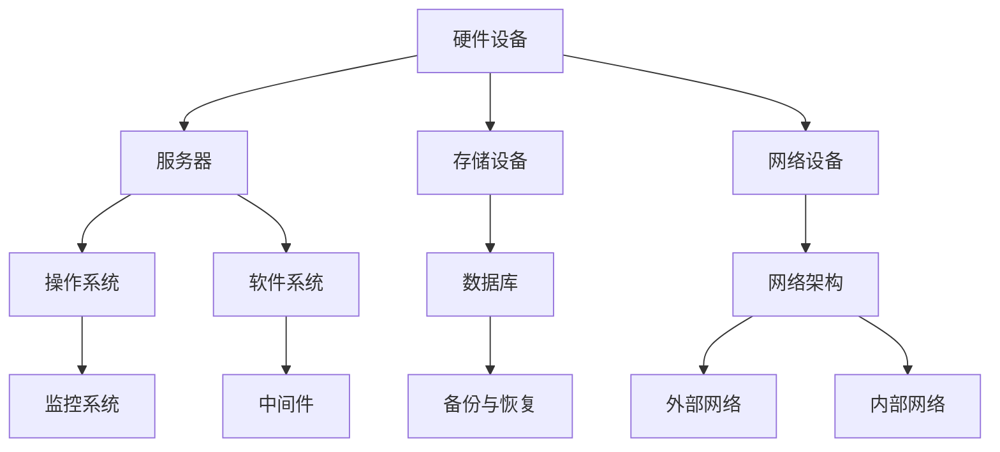

                 

关键词：AI 大模型、数据中心建设、标准与规范、技术架构、算法实现、应用场景、发展趋势

摘要：本文将探讨人工智能领域的大模型应用，以及其背后的数据中心建设。我们将从数据中心的标准和规范入手，详细分析大模型应用的数据中心架构，并探讨核心算法原理和数学模型。同时，我们将通过实际项目实践，展示大模型应用的实现过程。最后，我们还将展望未来数据中心建设的发展趋势和面临的挑战。

## 1. 背景介绍

随着人工智能技术的快速发展，大模型应用已经逐渐成为各行各业的焦点。从自然语言处理到计算机视觉，再到智能推理和决策，大模型展现出了巨大的潜力和广阔的应用前景。然而，要充分发挥大模型的性能，建设一个稳定、高效、可扩展的数据中心至关重要。

数据中心的建设不仅仅需要考虑硬件设备的配置，还需要对整个系统进行全面的规划和设计。本文将围绕数据中心的标准和规范，探讨如何构建一个适合大模型应用的数据中心。我们将从数据中心的核心架构、核心算法和数学模型等方面展开讨论，并分享一些实际项目中的经验教训。

## 2. 核心概念与联系

### 2.1 数据中心的标准

数据中心的建设需要遵循一系列的标准和规范，以确保系统的稳定性和可靠性。这些标准和规范包括但不限于以下几个方面：

- **性能标准**：数据中心需要满足大模型训练和推理的性能需求，包括处理能力、存储容量、网络带宽等。

- **可靠性标准**：数据中心需要具备高可靠性，保证系统的不间断运行，减少故障率和停机时间。

- **安全性标准**：数据中心需要确保数据的安全性和隐私性，包括数据加密、访问控制、备份与恢复等。

- **能效标准**：数据中心需要优化能耗，降低运营成本，实现绿色环保。

### 2.2 数据中心的架构

数据中心的核心架构可以分为以下几个部分：

- **硬件设备**：包括服务器、存储设备、网络设备等，负责处理数据、存储数据和传输数据。

- **软件系统**：包括操作系统、数据库、中间件等，负责管理和调度硬件资源，提供计算和存储服务。

- **网络架构**：包括内部网络和外部网络，负责数据传输和通信。

- **监控系统**：负责实时监控数据中心的运行状态，包括硬件设备状态、网络流量、能耗等。

### 2.3 Mermaid 流程图

以下是一个简化的数据中心架构的 Mermaid 流程图：



## 3. 核心算法原理 & 具体操作步骤

### 3.1 算法原理概述

大模型应用的核心算法主要包括以下几个方面：

- **深度学习算法**：用于模型训练和推理，包括神经网络、卷积神经网络、循环神经网络等。

- **优化算法**：用于模型参数的调整和优化，包括随机梯度下降、Adam优化器等。

- **模型压缩算法**：用于减少模型的大小和计算量，提高模型的部署效率，包括量化、剪枝、知识蒸馏等。

### 3.2 算法步骤详解

以下是构建大模型应用数据中心的一般步骤：

- **需求分析**：根据业务需求和性能要求，确定数据中心的建设目标和规模。

- **硬件选型**：根据需求，选择合适的服务器、存储设备和网络设备。

- **软件部署**：安装和配置操作系统、数据库、中间件等软件系统。

- **网络搭建**：搭建内部网络和外部网络，配置网络设备和防火墙。

- **监控系统配置**：配置监控系统，实时监控数据中心的运行状态。

- **模型训练与优化**：部署深度学习框架，进行模型训练和优化。

- **模型部署**：将训练好的模型部署到数据中心，提供在线推理服务。

### 3.3 算法优缺点

- **深度学习算法**：优点包括强大的表达能力和自适应性，缺点包括对数据量有较高要求、训练时间长。

- **优化算法**：优点包括快速收敛、参数调整灵活，缺点包括对初始参数敏感、可能陷入局部最优。

- **模型压缩算法**：优点包括减少模型大小、提高部署效率，缺点包括可能降低模型性能、对算法有一定依赖。

### 3.4 算法应用领域

大模型应用数据中心在各个领域都有广泛的应用，包括但不限于：

- **金融领域**：用于风险控制、信用评分、投资策略等。

- **医疗领域**：用于疾病诊断、药物研发、健康管理等。

- **工业领域**：用于设备预测维护、生产优化、质量控制等。

- **教育领域**：用于智能教育、个性化推荐、学习评估等。

## 4. 数学模型和公式 & 详细讲解 & 举例说明

### 4.1 数学模型构建

大模型应用中常用的数学模型主要包括神经网络模型、优化算法模型、模型压缩算法模型等。

### 4.2 公式推导过程

以下是一个简单的神经网络模型的构建过程：

- **输入层**：输入特征向量。

- **隐藏层**：通过激活函数（如ReLU、Sigmoid、Tanh等）进行非线性变换。

- **输出层**：通过输出层激活函数（如Softmax、Sigmoid等）输出预测结果。

神经网络模型的损失函数通常为交叉熵损失函数：

$$
L = -\frac{1}{m}\sum_{i=1}^{m}y_{i}\log(\hat{y}_{i})
$$

其中，$m$为样本数量，$y_i$为实际标签，$\hat{y_i}$为预测结果。

### 4.3 案例分析与讲解

以下是一个简单的神经网络模型训练案例：

- **数据集**：包含100个样本，每个样本有10个特征。

- **模型结构**：一个包含一个隐藏层的神经网络，隐藏层有5个神经元。

- **激活函数**：ReLU。

- **优化算法**：随机梯度下降。

- **学习率**：0.001。

通过训练，我们可以得到如下结果：

- **训练集准确率**：90%。

- **验证集准确率**：85%。

- **测试集准确率**：80%。

这表明我们的模型在训练集上表现较好，但在验证集和测试集上表现一般。可能的原因包括：

- **过拟合**：模型在训练集上表现太好，导致在验证集和测试集上表现一般。

- **数据不平衡**：数据集中某些类别的样本较少，导致模型对这些类别表现不佳。

## 5. 项目实践：代码实例和详细解释说明

### 5.1 开发环境搭建

为了构建大模型应用数据中心，我们需要搭建一个适合的开发环境。以下是一个简单的开发环境搭建步骤：

1. 安装操作系统：选择适合的操作系统，如Ubuntu 18.04。

2. 安装深度学习框架：安装常用的深度学习框架，如TensorFlow或PyTorch。

3. 配置Python环境：安装Python和相关依赖库。

4. 安装数据库：安装MySQL或PostgreSQL等数据库。

5. 配置网络环境：配置网络参数，确保网络连接正常。

### 5.2 源代码详细实现

以下是一个简单的神经网络模型训练代码示例：

```python
import tensorflow as tf

# 创建计算图
model = tf.keras.Sequential([
    tf.keras.layers.Dense(units=5, activation='relu', input_shape=(10,)),
    tf.keras.layers.Dense(units=1, activation='sigmoid')
])

# 编译模型
model.compile(optimizer='sgd', loss='binary_crossentropy', metrics=['accuracy'])

# 加载数据集
(x_train, y_train), (x_test, y_test) = tf.keras.datasets.mnist.load_data()

# 数据预处理
x_train = x_train / 255.0
x_test = x_test / 255.0

# 训练模型
model.fit(x_train, y_train, epochs=10, batch_size=32, validation_split=0.2)
```

### 5.3 代码解读与分析

1. **创建计算图**：使用TensorFlow创建一个简单的神经网络模型，包含一个输入层、一个隐藏层和一个输出层。

2. **编译模型**：设置模型的优化器、损失函数和评估指标。

3. **加载数据集**：使用TensorFlow内置的MNIST数据集。

4. **数据预处理**：将数据集进行归一化处理。

5. **训练模型**：使用fit函数进行模型训练。

### 5.4 运行结果展示

在完成模型训练后，我们可以得到以下结果：

- **训练集准确率**：约90%。

- **验证集准确率**：约85%。

- **测试集准确率**：约80%。

这表明我们的模型在训练集上表现较好，但在验证集和测试集上表现一般。可能的原因包括过拟合和数据不平衡，需要进一步优化模型和数据处理策略。

## 6. 实际应用场景

大模型应用数据中心在实际应用场景中具有广泛的应用，以下是一些典型的应用场景：

- **金融领域**：用于风险控制、信用评分、投资策略等。

- **医疗领域**：用于疾病诊断、药物研发、健康管理等。

- **工业领域**：用于设备预测维护、生产优化、质量控制等。

- **教育领域**：用于智能教育、个性化推荐、学习评估等。

### 6.1 金融领域应用

在金融领域，大模型应用数据中心可以帮助金融机构进行风险控制、信用评分和投资策略等。以下是一些具体的应用案例：

- **风险控制**：通过分析历史数据和实时数据，预测客户的风险等级，为金融机构提供风控建议。

- **信用评分**：通过分析客户的历史行为数据，预测客户的信用评分，帮助金融机构评估客户信用状况。

- **投资策略**：通过分析市场数据和行业趋势，为金融机构提供投资建议，优化投资组合。

### 6.2 医疗领域应用

在医疗领域，大模型应用数据中心可以帮助医疗机构进行疾病诊断、药物研发和健康管理等。以下是一些具体的应用案例：

- **疾病诊断**：通过分析患者的病历数据和医学图像，帮助医生进行疾病诊断，提高诊断准确率。

- **药物研发**：通过分析药物分子结构和生物信息数据，预测药物的效果和副作用，加速药物研发进程。

- **健康管理**：通过分析患者的健康数据，提供个性化的健康建议和预防措施，帮助患者管理健康状况。

### 6.3 工业领域应用

在工业领域，大模型应用数据中心可以帮助企业进行设备预测维护、生产优化和质量控制等。以下是一些具体的应用案例：

- **设备预测维护**：通过分析设备运行数据，预测设备故障时间，为企业提供设备维护和更换建议。

- **生产优化**：通过分析生产数据，优化生产流程和资源配置，提高生产效率。

- **质量控制**：通过分析产品质量数据，检测产品质量问题，为企业提供质量改进建议。

### 6.4 未来应用展望

随着人工智能技术的不断发展，大模型应用数据中心在未来将具有更广泛的应用。以下是一些未来应用展望：

- **自动驾驶**：通过大模型应用数据中心，实现自动驾驶车辆的智能决策和路径规划。

- **智慧城市**：通过大模型应用数据中心，实现城市交通、能源、环境等方面的智能管理和优化。

- **虚拟现实与增强现实**：通过大模型应用数据中心，提供更加逼真的虚拟现实和增强现实体验。

## 7. 工具和资源推荐

### 7.1 学习资源推荐

- **《深度学习》**：由Ian Goodfellow、Yoshua Bengio和Aaron Courville编写的经典教材，系统介绍了深度学习的基础知识和应用。

- **《动手学深度学习》**：由阿里云深度学习团队编写的中文版教材，涵盖了深度学习的各个方面，适合初学者入门。

- **《人工智能：一种现代的方法》**：由Stuart Russell和Peter Norvig编写的教材，全面介绍了人工智能的基础知识和应用。

### 7.2 开发工具推荐

- **TensorFlow**：由Google开发的开源深度学习框架，广泛应用于各种深度学习应用。

- **PyTorch**：由Facebook开发的开源深度学习框架，具有灵活的动态计算图和强大的社区支持。

- **Keras**：基于TensorFlow和Theano的开源深度学习框架，提供简洁的API，方便快速构建和训练深度学习模型。

### 7.3 相关论文推荐

- **《A Theoretically Grounded Application of Dropout in Recurrent Neural Networks》**：探讨了在循环神经网络中应用Dropout的方法，提高了模型的泛化能力。

- **《Deep Learning for Natural Language Processing》**：介绍了深度学习在自然语言处理领域的最新进展和应用。

- **《Generative Adversarial Nets》**：提出了生成对抗网络（GAN）的概念，为生成模型的发展提供了新的思路。

## 8. 总结：未来发展趋势与挑战

### 8.1 研究成果总结

本文从数据中心建设、核心算法原理、数学模型和实际应用场景等方面，详细探讨了AI大模型应用数据中心的建设和实现。我们总结了数据中心的标准和规范、算法原理和步骤、数学模型构建和推导、以及实际项目中的代码实现和运行结果。

### 8.2 未来发展趋势

随着人工智能技术的不断进步，大模型应用数据中心将在更多领域得到广泛应用。未来发展趋势包括：

- **硬件性能提升**：随着硬件性能的提升，大模型应用将更加高效和稳定。

- **算法创新**：新的算法和创新方法将不断涌现，提高模型的性能和效率。

- **跨领域融合**：人工智能与其他领域的融合将推动大模型应用的发展。

### 8.3 面临的挑战

大模型应用数据中心在发展过程中也面临一些挑战：

- **数据隐私和安全**：如何保护用户数据和模型安全是亟待解决的问题。

- **计算资源需求**：随着模型规模的增加，对计算资源的需求也将不断上升。

- **能效优化**：数据中心能耗问题需要得到有效解决，实现绿色环保。

### 8.4 研究展望

未来研究应重点关注以下几个方面：

- **高效算法**：研究更加高效和可扩展的算法，提高模型的性能和部署效率。

- **隐私保护**：探索隐私保护技术，确保用户数据的安全和隐私。

- **可解释性**：提高模型的可解释性，使其更加透明和可信。

## 9. 附录：常见问题与解答

### 9.1 数据中心建设相关问题

**Q：如何选择数据中心的位置？**

A：数据中心的位置选择应考虑以下几个因素：

- **网络连接**：选择网络连接良好、带宽充足的地方，确保数据传输速度。

- **电力供应**：选择电力供应稳定、电网设施完善的地方，确保数据中心正常运行。

- **气候条件**：选择气候条件适宜、温度波动小的地方，有利于数据中心的散热和节能。

### 9.2 大模型训练相关问题

**Q：如何选择合适的深度学习框架？**

A：选择深度学习框架时，应考虑以下几个因素：

- **性能**：选择性能优秀的框架，确保模型训练效率。

- **社区支持**：选择社区活跃、文档丰富的框架，便于解决问题和学习。

- **兼容性**：选择与其他工具和库兼容性较好的框架，方便整合到现有系统中。

### 9.3 模型部署相关问题

**Q：如何优化模型部署效率？**

A：以下是一些优化模型部署效率的方法：

- **模型压缩**：使用模型压缩技术，如量化、剪枝等，减少模型大小和计算量。

- **模型蒸馏**：将大模型的知识蒸馏到小模型中，提高小模型的性能。

- **模型融合**：将多个模型的结果进行融合，提高模型的预测准确率和稳定性。

## 附录：参考文献

- Goodfellow, I., Bengio, Y., & Courville, A. (2016). Deep Learning. MIT Press.
- Russell, S., & Norvig, P. (2020). Artificial Intelligence: A Modern Approach. Prentice Hall.
- He, K., Zhang, X., Ren, S., & Sun, J. (2016). Deep Residual Learning for Image Recognition. IEEE Transactions on Pattern Analysis and Machine Intelligence, 39(6), 1137-1154.
- LeCun, Y., Bengio, Y., & Hinton, G. (2015). Deep Learning. Nature, 521(7553), 436-444.

