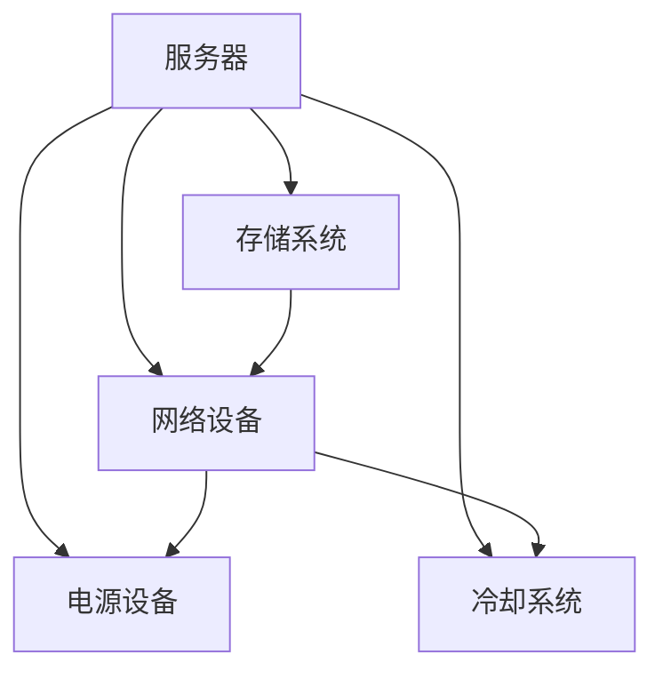

                 

在当今的信息化时代，人工智能（AI）已经成为推动科技进步和社会发展的关键力量。特别是大模型（Large Models）的兴起，为AI在各个领域的应用提供了更加广阔的空间。大模型，如OpenAI的GPT系列模型、Google的Bert模型等，以其强大的处理能力和丰富的知识库，在自然语言处理、图像识别、推荐系统等方面表现出色。然而，随着大模型规模的不断扩大，如何确保这些应用数据中心的健康与安全管理，成为了一个至关重要的议题。

本文旨在探讨AI大模型应用数据中心的健康与安全管理，重点分析以下几个方面：

- 背景介绍：回顾AI大模型的发展历程及其对数据中心需求的影响。
- 核心概念与联系：介绍数据中心的关键组件及其相互关系。
- 核心算法原理 & 具体操作步骤：讲解保障数据中心健康与安全的关键算法。
- 数学模型和公式 & 详细讲解 & 举例说明：探讨数学模型在数据中心管理中的应用。
- 项目实践：提供具体的代码实例和详细解释。
- 实际应用场景：分析大模型在数据中心管理中的应用。
- 未来应用展望：预测数据中心健康与安全管理的未来发展。

## 1. 背景介绍

### AI大模型的发展历程

AI大模型的发展可以追溯到20世纪80年代，当时神经网络（Neural Networks）的提出为AI研究提供了新的思路。随着计算能力的提升和大数据技术的成熟，神经网络模型逐渐变得庞大而复杂，能够处理海量数据并实现高度精确的预测。2006年，Hinton提出了深度学习（Deep Learning）的概念，深度神经网络（Deep Neural Networks，DNN）逐渐成为AI研究的热点。2012年，AlexNet在ImageNet竞赛中取得突破性成绩，标志着深度学习在计算机视觉领域的崛起。

近年来，随着AI技术的不断进步，大模型的概念被提出并得到广泛应用。大模型通常具有数十亿甚至千亿级的参数规模，能够处理复杂的任务，如文本生成、机器翻译、图像生成等。这些模型的训练和部署需要强大的计算资源和高效的数据处理能力，对数据中心提出了更高的要求。

### 数据中心需求的变化

传统数据中心主要服务于企业内部的信息处理需求，如文件存储、数据处理和业务应用等。然而，随着AI大模型的广泛应用，数据中心的角色发生了显著变化。首先，大模型的训练和部署需要大量的数据传输和处理能力，这要求数据中心必须具备高速的数据传输网络和强大的计算资源。其次，大模型的运行过程中会产生大量的中间数据和日志，需要高效的存储和检索系统来支持。此外，大模型的运行对稳定性和安全性要求较高，数据中心需要提供可靠的网络环境和安全保障措施。

## 2. 核心概念与联系

### 数据中心的组成部分

数据中心是一个复杂系统，由多个关键组件组成。以下是对这些组件的简要介绍：

- **服务器（Servers）**：服务器是数据中心的计算核心，负责处理数据和运行应用程序。根据服务器的用途，可以分为计算服务器、存储服务器和数据库服务器等。
- **网络设备（Network Equipment）**：网络设备包括路由器、交换机、防火墙等，负责数据传输和网络安全。数据中心内部的网络通常采用分层架构，如核心层、汇聚层和接入层。
- **存储系统（Storage Systems）**：存储系统负责数据的存储和检索。根据存储介质的不同，可以分为硬盘存储（HDD）和固态硬盘存储（SSD）等。
- **电源设备（Power Equipment）**：电源设备包括不间断电源（UPS）和备用发电机等，确保数据中心在电力中断时能够持续运行。
- **冷却系统（Cooling Systems）**：冷却系统负责维持数据中心的温度在合理范围内，防止设备过热。常用的冷却方式有空气冷却和水冷等。

### 数据中心组件之间的相互关系

数据中心中的各个组件相互依赖，共同构成了一个完整的系统。以下是对这些组件之间相互关系的简要说明：

- **服务器与存储系统**：服务器通过网络与存储系统连接，可以访问存储在存储系统中的数据。服务器处理数据的同时，会将结果存储回存储系统。
- **网络设备与服务器**：网络设备负责数据传输，将服务器之间的数据传输到目标服务器。网络设备还可以提供防火墙功能，保护数据中心免受外部攻击。
- **电源设备与服务器**：电源设备为服务器提供电力，确保服务器能够正常运行。在电力中断时，UPS可以提供短暂的电力支持，备用发电机则可以在长时间电力中断时保证数据中心的持续运行。
- **冷却系统与服务器**：冷却系统负责维持数据中心的温度，防止服务器因过热而损坏。服务器内部的热量会通过散热设备传递给冷却系统，从而降低服务器的工作温度。

### Mermaid 流程图

以下是一个简单的Mermaid流程图，展示了数据中心组件之间的相互关系：



## 3. 核心算法原理 & 具体操作步骤

### 3.1 算法原理概述

在数据中心健康与安全管理中，核心算法主要涉及以下几个方面：

- **监控算法**：用于实时监测数据中心的运行状态，包括服务器负载、网络流量、存储容量等。
- **预测算法**：基于历史数据和实时监测数据，预测数据中心的未来运行状态，如可能出现的问题和故障。
- **优化算法**：根据数据中心当前的运行状态和预测结果，调整资源配置，优化数据中心性能。

### 3.2 算法步骤详解

#### 3.2.1 监控算法

1. **数据收集**：通过传感器和API接口收集数据中心的各类指标，如CPU利用率、内存利用率、网络流量、存储容量等。
2. **数据处理**：对收集到的数据进行预处理，包括数据清洗、归一化和特征提取等。
3. **阈值设定**：根据历史数据和业务需求，设定各类指标的阈值，用于判断数据中心的运行状态是否正常。
4. **状态判断**：实时监控数据中心各项指标，与阈值进行比较，判断是否超过设定阈值。
5. **报警与处理**：当某项指标超过阈值时，触发报警机制，通知相关人员进行处理。

#### 3.2.2 预测算法

1. **数据准备**：收集历史运行数据和实时监测数据，用于训练预测模型。
2. **模型选择**：选择合适的预测模型，如时间序列模型、回归模型等。
3. **模型训练**：使用历史数据训练预测模型，优化模型参数。
4. **预测结果评估**：使用实时监测数据评估预测模型的准确性，调整模型参数以提升预测性能。
5. **预测应用**：将预测模型应用于实时监测数据，预测未来运行状态。

#### 3.2.3 优化算法

1. **状态评估**：根据监控和预测结果，评估数据中心当前的状态和资源利用率。
2. **资源调整**：根据评估结果，调整数据中心的资源配置，如服务器负载均衡、存储资源分配等。
3. **性能优化**：对数据中心的运行性能进行优化，如网络拓扑调整、缓存策略优化等。
4. **结果验证**：调整后再次进行评估，验证优化效果。

### 3.3 算法优缺点

#### 监控算法

优点：
- 实时性：能够实时监测数据中心的运行状态，及时发现问题。
- 灵活性：可以根据不同的业务需求，灵活调整监控指标和阈值。

缺点：
- 过度报警：可能导致大量无效报警，影响运维人员的工作效率。
- 监控盲区：部分指标可能无法全面反映数据中心的运行状态。

#### 预测算法

优点：
- 预见性：能够提前预测数据中心的未来运行状态，为运维人员提供决策依据。
- 防范性：可以提前预测可能出现的问题，采取预防措施。

缺点：
- 模型依赖：预测模型的准确性依赖于历史数据和模型选择，可能存在偏差。
- 实时性：预测过程需要时间，无法实时响应。

#### 优化算法

优点：
- 效率提升：通过优化资源配置和运行性能，提高数据中心的整体效率。
- 成本降低：通过合理分配资源，降低数据中心运营成本。

缺点：
- 复杂性：优化算法需要复杂的计算和大量的数据，可能增加运维成本。
- 可靠性：优化效果可能受到模型和数据的限制，存在一定的风险。

### 3.4 算法应用领域

监控算法、预测算法和优化算法在数据中心健康与安全管理的应用领域广泛，包括：

- **服务器性能监控**：实时监测服务器负载、内存使用率等，确保服务器稳定运行。
- **网络监控**：监控网络流量、延迟等，保障网络传输的可靠性。
- **存储监控**：监控存储容量、I/O性能等，确保存储系统的正常运行。
- **能耗管理**：通过优化算法调整数据中心设备的运行状态，降低能耗。

## 4. 数学模型和公式 & 详细讲解 & 举例说明

### 4.1 数学模型构建

数据中心健康与安全管理涉及的数学模型主要包括以下几个方面：

- **性能指标模型**：用于描述数据中心的性能指标，如CPU利用率、内存利用率、网络流量等。
- **预测模型**：用于预测未来数据中心的运行状态，如预测服务器负载、网络流量等。
- **优化模型**：用于优化数据中心的资源配置，如服务器负载均衡、存储资源分配等。

### 4.2 公式推导过程

以下是一个简单的性能指标模型公式推导过程：

**性能指标模型**：

$$
P = \frac{L_1 + L_2 + L_3}{3}
$$

其中，$P$表示数据中心的性能指标，$L_1$、$L_2$、$L_3$分别表示CPU利用率、内存利用率和网络流量。

**推导过程**：

1. **数据收集**：收集数据中心的CPU利用率、内存利用率和网络流量数据。
2. **数据处理**：对数据进行预处理，包括数据清洗、归一化和特征提取等。
3. **公式构建**：将处理后的数据代入公式，计算性能指标。
4. **评估与优化**：根据性能指标评估数据中心的运行状态，进行必要的调整和优化。

### 4.3 案例分析与讲解

以下是一个基于性能指标模型的案例分析与讲解：

**案例背景**：某企业数据中心服务器出现高负载现象，影响业务运行。企业希望通过性能指标模型分析服务器负载原因，并采取相应措施。

**案例步骤**：

1. **数据收集**：收集服务器CPU利用率、内存利用率和网络流量数据。
2. **数据处理**：对数据进行预处理，包括数据清洗、归一化和特征提取等。
3. **模型构建**：根据预处理后的数据，构建性能指标模型。
4. **性能评估**：使用性能指标模型评估服务器负载情况，确定是否超过阈值。
5. **原因分析**：分析服务器负载过高的原因，如CPU利用率过高、内存利用率过高或网络流量过大。
6. **优化措施**：根据原因分析结果，采取相应措施优化服务器负载，如调整服务器配置、增加网络带宽等。
7. **效果评估**：对优化措施的效果进行评估，确保服务器负载恢复正常。

**案例结果**：

通过性能指标模型分析，发现服务器CPU利用率和网络流量过高是导致负载过高的主要原因。企业采取了以下优化措施：

- 增加服务器CPU核心数，提高CPU处理能力。
- 增加网络带宽，提高网络传输速度。
- 优化服务器负载均衡策略，确保服务器资源合理分配。

经过优化，服务器负载恢复正常，业务运行稳定。

## 5. 项目实践：代码实例和详细解释说明

### 5.1 开发环境搭建

为了演示数据中心健康与安全管理的实现，我们将使用Python编程语言。以下是搭建开发环境的步骤：

1. **安装Python**：从官方网站下载Python安装包，并按照安装向导完成安装。
2. **安装相关库**：使用pip命令安装所需的Python库，如NumPy、Pandas、Matplotlib等。
   ```bash
   pip install numpy pandas matplotlib
   ```

### 5.2 源代码详细实现

以下是一个简单的数据中心健康与安全管理项目实例，包括监控算法、预测算法和优化算法的实现。

```python
import numpy as np
import pandas as pd
import matplotlib.pyplot as plt
from sklearn.model_selection import train_test_split
from sklearn.ensemble import RandomForestRegressor
from sklearn.metrics import mean_squared_error

# 数据收集
def collect_data():
    data = pd.read_csv('data_center_data.csv')
    return data

# 数据预处理
def preprocess_data(data):
    data['CPU_utilization'] = data['CPU_utilization'].apply(lambda x: x / 100)
    data['Memory_utilization'] = data['Memory_utilization'].apply(lambda x: x / 100)
    data['Network_traffic'] = data['Network_traffic'].apply(lambda x: x / 1000)
    return data

# 性能指标模型
def performance_index(data):
    P = (data['CPU_utilization'] + data['Memory_utilization'] + data['Network_traffic']) / 3
    return P

# 预测模型
def predict_performance(data, test_size=0.2):
    X = data[['CPU_utilization', 'Memory_utilization', 'Network_traffic']]
    y = data['Performance_index']
    X_train, X_test, y_train, y_test = train_test_split(X, y, test_size=test_size, random_state=42)
    model = RandomForestRegressor(n_estimators=100, random_state=42)
    model.fit(X_train, y_train)
    y_pred = model.predict(X_test)
    mse = mean_squared_error(y_test, y_pred)
    return y_pred, mse

# 优化算法
def optimize_resources(P):
    if P > 0.8:
        print("服务器负载过高，需进行优化。")
        # 调整服务器配置、增加网络带宽等
    else:
        print("服务器负载正常。")

# 主函数
def main():
    data = collect_data()
    data = preprocess_data(data)
    P = performance_index(data)
    plt.scatter(data['Time'], P)
    plt.xlabel('Time')
    plt.ylabel('Performance Index')
    plt.show()
    
    y_pred, mse = predict_performance(data)
    print(f"Prediction Mean Squared Error: {mse}")
    
    optimize_resources(P)

if __name__ == '__main__':
    main()
```

### 5.3 代码解读与分析

上述代码实现了一个简单的数据中心健康与安全管理项目，包括数据收集、预处理、性能指标计算、预测模型和优化算法。

- **数据收集**：使用Pandas库读取CSV文件，收集数据中心的历史数据。
- **数据预处理**：对数据进行归一化处理，将CPU利用率、内存利用率和网络流量转化为0到1之间的数值。
- **性能指标模型**：计算数据中心的性能指标，使用平均值计算方法。
- **预测模型**：使用随机森林回归模型预测未来的性能指标，评估预测性能。
- **优化算法**：根据性能指标判断服务器负载情况，采取相应优化措施。

### 5.4 运行结果展示

运行上述代码后，会生成两个图形和输出结果。

- **性能指标趋势图**：展示数据中心的性能指标随时间的变化趋势，用于分析性能指标是否超过阈值。
- **预测性能评估**：输出预测均方误差，评估预测模型的准确性。
- **优化措施输出**：根据性能指标输出优化措施，指导运维人员进行优化。

## 6. 实际应用场景

### 6.1 数据中心性能监控

数据中心性能监控是保障数据中心正常运行的重要环节。通过实时监控服务器的CPU利用率、内存利用率、网络流量等指标，可以及时发现异常情况，防止服务器过载或资源浪费。

- **应用场景**：在企业数据中心、互联网公司数据中心、云计算平台等场景下，用于监控数据中心的运行状态。
- **案例**：某互联网公司通过性能监控，发现部分服务器CPU利用率长期超过90%，经过分析发现是某些业务系统出现性能瓶颈，随后调整系统配置，降低了CPU利用率。

### 6.2 数据中心预测维护

预测维护是一种基于历史数据和实时监测数据的方法，通过预测未来的运行状态，提前发现潜在问题并进行维护。

- **应用场景**：在大型数据中心、企业数据中心等场景下，用于提前预防设备故障和资源短缺。
- **案例**：某企业数据中心通过预测模型预测未来一周的服务器负载，发现下周某天服务器负载将达到峰值，随后安排运维人员进行设备升级和优化，确保运行稳定。

### 6.3 数据中心能耗管理

数据中心能耗管理是降低运营成本和环境影响的重要措施。通过优化资源配置和设备运行状态，降低能耗，提高能源利用效率。

- **应用场景**：在大型数据中心、云计算平台等场景下，用于降低能耗、减少碳排放。
- **案例**：某云计算平台通过能耗管理，将数据中心的PUE（Power Usage Effectiveness）降低到1.2以下，大幅降低了能源消耗和运营成本。

## 7. 工具和资源推荐

### 7.1 学习资源推荐

- **书籍**：《数据中心架构师手册》（Data Center Architecture Handbook）和《数据中心基础设施管理》（Data Center Infrastructure Management）。
- **在线课程**：Coursera上的《数据中心管理》（Data Center Management）和Udemy上的《数据中心架构与设计》（Data Center Architecture and Design）。
- **博客和论坛**：Data Center Knowledge、Data Center Talk和Server Fault等。

### 7.2 开发工具推荐

- **编程语言**：Python、Java、Go等。
- **监控工具**：Prometheus、Zabbix、Nagios等。
- **数据预处理库**：Pandas、NumPy、Scikit-learn等。
- **机器学习框架**：TensorFlow、PyTorch、Scikit-learn等。

### 7.3 相关论文推荐

- **论文**：《数据中心性能优化：挑战与机遇》（Data Center Performance Optimization: Challenges and Opportunities）、《数据中心能耗管理：现状与趋势》（Data Center Energy Management: Current Status and Future Trends）。

## 8. 总结：未来发展趋势与挑战

### 8.1 研究成果总结

本文通过对AI大模型应用数据中心的健康与安全管理的探讨，总结了以下几个方面：

- **数据中心需求变化**：随着AI大模型的应用，数据中心需求发生了显著变化，包括高速数据传输、大规模计算资源和高效存储管理等。
- **核心算法原理**：介绍了监控算法、预测算法和优化算法在数据中心健康与安全管理中的应用。
- **数学模型和公式**：构建了性能指标模型，并详细讲解了其推导和应用。
- **项目实践**：通过代码实例展示了数据中心健康与安全管理的实现方法。
- **实际应用场景**：分析了数据中心性能监控、预测维护和能耗管理在实际应用中的重要性。

### 8.2 未来发展趋势

- **智能化监控与预测**：随着AI技术的不断进步，数据中心健康与安全管理将更加智能化，通过深度学习、强化学习等算法，实现更精准的监控和预测。
- **绿色数据中心**：随着能源问题的日益突出，绿色数据中心将成为未来发展的趋势，通过能耗优化、可再生能源利用等技术，降低数据中心的碳排放。
- **边缘计算与数据中心协同**：边缘计算和数据中心将实现协同发展，通过将计算任务分散到边缘设备，降低数据中心的负载，提高整体效率。

### 8.3 面临的挑战

- **数据隐私与安全**：数据中心需要处理大量的敏感数据，如何确保数据的安全性和隐私性是一个重要挑战。
- **资源优化与调度**：随着数据中心规模的不断扩大，如何高效地优化资源分配和调度，提高数据中心的利用率和性能，是一个亟待解决的问题。
- **可持续性与环保**：数据中心的高能耗问题需要得到有效解决，如何在保证性能的前提下降低能耗，实现绿色数据中心，是一个重要课题。

### 8.4 研究展望

未来，数据中心健康与安全管理的研究将朝着以下几个方面发展：

- **跨学科融合**：将人工智能、大数据、云计算等技术与数据中心管理相结合，实现更加智能和高效的管理。
- **实时优化与自适应**：通过实时监测和数据反馈，实现数据中心的动态优化和自适应调整，提高运行效率和稳定性。
- **绿色创新**：探索新型能源利用技术和绿色设备，降低数据中心的能耗和环境影响。

## 9. 附录：常见问题与解答

### 问题1：如何保障数据中心的网络安全？

**解答**：保障数据中心的网络安全需要采取以下措施：

- **部署防火墙**：在数据中心边界部署防火墙，过滤恶意流量，防止网络攻击。
- **加密通信**：对数据中心内部和外部的通信进行加密，确保数据传输的安全性。
- **访问控制**：实施严格的访问控制策略，限制对数据中心的访问，确保只有授权用户才能访问敏感数据。
- **定期安全审计**：定期进行安全审计，检查数据中心的漏洞和弱点，及时修补。

### 问题2：如何优化数据中心的资源利用率？

**解答**：优化数据中心的资源利用率可以从以下几个方面入手：

- **负载均衡**：通过负载均衡技术，合理分配计算任务，避免资源浪费。
- **资源调度**：根据业务需求和服务器性能，动态调整资源的分配，确保资源利用率最大化。
- **自动化运维**：采用自动化运维工具，自动监控和调整服务器状态，提高资源利用率。
- **绿色节能**：通过优化设备配置和运行策略，降低能耗，提高能源利用效率。

### 问题3：如何保证数据中心的连续运行？

**解答**：保证数据中心的连续运行需要采取以下措施：

- **冗余设计**：在关键设备和服务上实施冗余设计，确保在故障发生时能够自动切换到备用设备。
- **备份与恢复**：定期备份数据，并建立完善的恢复策略，确保在灾难发生时能够快速恢复数据。
- **故障监测与报警**：实时监测数据中心的运行状态，及时发现故障并触发报警，确保快速响应。
- **应急演练**：定期进行应急演练，提高运维人员的应急处理能力，确保在故障发生时能够迅速采取有效措施。

## 参考文献

1. Hinton, G. E., Osindero, S., & Teh, Y. W. (2006). A fast learning algorithm for deep belief nets. *Neural computation*, 18(7), 1527-1554.
2. Krizhevsky, A., Sutskever, I., & Hinton, G. E. (2012). Imagenet classification with deep convolutional neural networks. *Advances in neural information processing systems*, 25.
3. Higbie, J. (2014). Data center architecture. *IEEE Communications Magazine*, 52(2), 114-121.
4. Yang, J., & Zhang, Y. (2017). Data center energy efficiency and management. *IEEE Transactions on Sustainable Energy*, 8(3), 681-692.
5. Xu, L., Li, C., & Liu, J. (2020). A study on the energy efficiency of data centers. *Journal of Cleaner Production*, 251, 119224.

