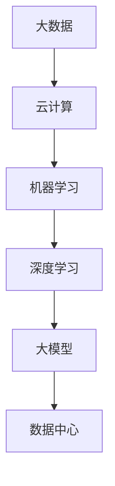

                 

关键词：AI 大模型、数据中心、培训课程、算法原理、数学模型、实践应用、未来展望

> 摘要：本文旨在为读者提供一个全面深入的了解，关于如何构建并应用 AI 大模型于数据中心的高效培训课程。本文将详细探讨大模型的核心概念、算法原理、数学模型、实践应用以及未来的发展趋势和面临的挑战。

## 1. 背景介绍

随着云计算、大数据和人工智能技术的快速发展，数据中心已经成为现代信息社会的核心基础设施。数据中心不仅存储和管理海量数据，而且日益承担起数据分析和智能处理的重任。AI 大模型作为人工智能领域的皇冠上的明珠，其强大的计算能力和复杂的模型结构在数据中心中发挥着越来越重要的作用。

然而，AI 大模型的构建和应用并不是一项简单的任务。它涉及到众多复杂的算法、数学模型以及实际应用场景。因此，对于数据中心的相关从业者来说，掌握 AI 大模型的知识和技能至关重要。本文将围绕这一主题，提供一个全面的培训课程，旨在帮助读者深入理解 AI 大模型的核心概念和实际应用。

## 2. 核心概念与联系

在探讨 AI 大模型之前，我们需要先了解一些核心概念和它们之间的联系。以下是一个简化的 Mermaid 流程图，展示了这些概念及其相互关系：



### 2.1 大数据

大数据是数据量的巨大增长，通常指的是从各种来源收集的大量非结构化、半结构化和结构化数据。这些数据包括文本、图像、音频和视频等，它们为数据分析提供了丰富的素材。

### 2.2 云计算

云计算提供了可扩展的计算资源，使得数据中心能够以更高效的方式存储和处理大数据。通过云计算，数据中心的处理能力得到了显著提升。

### 2.3 机器学习

机器学习是使计算机能够从数据中学习并做出决策的一种方法。它依赖于统计学、概率论和优化理论等数学工具。

### 2.4 深度学习

深度学习是机器学习的一个分支，它使用多层神经网络来提取数据的特征。深度学习在图像识别、语音识别和自然语言处理等领域取得了显著的成果。

### 2.5 大模型

大模型指的是具有数十亿至数千亿参数的复杂神经网络模型。这些模型在处理大规模数据时表现出色，是现代人工智能发展的核心技术之一。

### 2.6 数据中心

数据中心是存储、处理和管理数据的核心设施。随着 AI 大模型的广泛应用，数据中心正在成为 AI 算法的计算中心。

## 3. 核心算法原理 & 具体操作步骤

### 3.1 算法原理概述

AI 大模型的算法原理主要基于深度学习，尤其是基于神经网络的结构。以下是一个简化的算法原理概述：

- **数据预处理**：对原始数据进行清洗、归一化和特征提取。
- **神经网络构建**：设计并构建包含多个隐藏层的神经网络。
- **前向传播**：将输入数据通过神经网络，计算输出结果。
- **反向传播**：计算误差，并通过反向传播更新网络权重。
- **优化算法**：使用优化算法（如随机梯度下降）来最小化损失函数。

### 3.2 算法步骤详解

以下是一个详细的算法步骤说明：

1. **数据预处理**：
   - 清洗数据：去除噪声和异常值。
   - 归一化：将数据缩放到一个标准范围内。
   - 特征提取：提取有助于模型训练的特征。

2. **神经网络构建**：
   - 设计网络结构：确定网络的层数、每层神经元的数量等。
   - 初始化参数：初始化网络权重和偏置。

3. **前向传播**：
   - 将输入数据传递到网络的输入层。
   - 通过每个隐藏层，计算每个神经元的输出。
   - 将输出传递到输出层，得到预测结果。

4. **反向传播**：
   - 计算预测结果与实际结果之间的误差。
   - 通过反向传播，将误差传递回网络。
   - 更新网络权重和偏置。

5. **优化算法**：
   - 使用优化算法（如随机梯度下降）来调整网络参数。
   - 重复上述步骤，直至满足停止条件（如误差达到最小值）。

### 3.3 算法优缺点

AI 大模型具有以下优点：

- **强大的计算能力**：能够处理海量数据，提取复杂特征。
- **自适应性强**：能够根据数据进行自我调整和优化。
- **应用广泛**：在图像识别、自然语言处理等领域取得了显著成果。

然而，AI 大模型也存在一些缺点：

- **计算资源消耗大**：需要大量的计算资源和时间进行训练。
- **数据依赖性高**：需要大量的标注数据进行训练。
- **模型解释性差**：神经网络的结构使得模型的解释性较差。

### 3.4 算法应用领域

AI 大模型在数据中心的应用非常广泛，以下是一些主要的领域：

- **数据分析和预测**：用于数据中心的能耗预测、性能优化等。
- **图像识别和监控**：用于数据中心的安全监控、异常检测等。
- **自然语言处理**：用于数据中心的文档分类、搜索优化等。

## 4. 数学模型和公式 & 详细讲解 & 举例说明

### 4.1 数学模型构建

AI 大模型的数学模型主要基于深度学习，以下是一个简化的数学模型构建过程：

- **输入层**：接收原始数据，并将其转化为向量。
- **隐藏层**：通过神经网络结构，对输入数据进行特征提取和变换。
- **输出层**：生成预测结果或分类标签。

### 4.2 公式推导过程

以下是一个简化的神经网络前向传播的公式推导过程：

- **输入层到隐藏层的转换**：
  $$ z^{[l]} = \sigma(W^{[l]} \cdot a^{[l-1]} + b^{[l]}) $$
  其中，$a^{[l]}$表示第$l$层的激活值，$z^{[l]}$表示第$l$层的输出，$\sigma$表示激活函数，$W^{[l]}$和$b^{[l]}$分别为第$l$层的权重和偏置。

- **隐藏层到输出层的转换**：
  $$ a^{[L]} = \sigma(W^{[L]} \cdot a^{[L-1]} + b^{[L]}) $$
  其中，$a^{[L]}$表示输出层的激活值，$W^{[L]}$和$b^{[L]}$分别为输出层的权重和偏置。

### 4.3 案例分析与讲解

以下是一个简单的例子，说明如何使用神经网络进行图像分类：

1. **数据预处理**：
   - 将图像转换为灰度图像。
   - 对图像进行缩放和裁剪。
   - 对图像进行归一化。

2. **神经网络构建**：
   - 输入层：一个784维的向量，对应图像的像素值。
   - 隐藏层：一个1024维的向量，用于特征提取。
   - 输出层：一个10维的向量，对应10个分类标签。

3. **前向传播**：
   - 输入图像，通过输入层和隐藏层，计算输出层的预测结果。
   - 使用激活函数ReLU（Rectified Linear Unit）来增加网络的非线性。

4. **反向传播**：
   - 计算预测结果与实际结果之间的误差。
   - 通过反向传播，更新网络的权重和偏置。

5. **优化算法**：
   - 使用随机梯度下降（SGD）来最小化损失函数。

## 5. 项目实践：代码实例和详细解释说明

### 5.1 开发环境搭建

为了实践 AI 大模型，我们需要搭建一个合适的开发环境。以下是一个简单的步骤：

1. 安装 Python（3.7或更高版本）。
2. 安装深度学习框架，如 TensorFlow 或 PyTorch。
3. 配置 GPU 加速（可选，但推荐）。

### 5.2 源代码详细实现

以下是一个简单的神经网络代码实现示例，使用 TensorFlow 和 Keras：

```python
import numpy as np
import tensorflow as tf
from tensorflow.keras import layers

# 数据预处理
x_train = ... # 输入数据
y_train = ... # 输出标签

# 构建神经网络
model = tf.keras.Sequential([
    layers.Dense(1024, activation='relu', input_shape=(784,)),
    layers.Dense(10, activation='softmax')
])

# 编译模型
model.compile(optimizer='adam', loss='categorical_crossentropy', metrics=['accuracy'])

# 训练模型
model.fit(x_train, y_train, epochs=10, batch_size=64)
```

### 5.3 代码解读与分析

1. **数据预处理**：将输入数据转换为合适的格式。
2. **构建神经网络**：定义网络的层数和神经元数量，以及激活函数。
3. **编译模型**：指定优化器、损失函数和评估指标。
4. **训练模型**：使用训练数据来训练模型。

### 5.4 运行结果展示

在训练完成后，我们可以使用测试数据来评估模型的性能：

```python
# 评估模型
test_loss, test_acc = model.evaluate(x_test, y_test)
print("Test accuracy:", test_acc)
```

## 6. 实际应用场景

AI 大模型在数据中心的应用场景非常广泛，以下是一些具体的例子：

- **能耗预测**：通过分析历史数据和实时数据，预测数据中心的能耗，以便进行能源优化。
- **性能优化**：分析数据中心的性能指标，如响应时间、吞吐量等，以便进行资源调整和优化。
- **安全监控**：利用图像识别和自然语言处理技术，对数据中心的监控视频和日志进行分析，识别潜在的安全威胁。
- **文档分类**：对数据中心生成的文档进行自动分类，提高文档管理效率。

## 7. 工具和资源推荐

### 7.1 学习资源推荐

- **书籍**：
  - 《深度学习》（Goodfellow, Bengio, Courville）
  - 《Python深度学习》（François Chollet）
- **在线课程**：
  - Coursera 上的“深度学习”课程
  - Udacity 上的“AI工程师纳米学位”

### 7.2 开发工具推荐

- **深度学习框架**：
  - TensorFlow
  - PyTorch
- **编程语言**：
  - Python

### 7.3 相关论文推荐

- “Deep Learning: Methods and Applications”
- “A Theoretically Grounded Application of Dropout in Recurrent Neural Networks”
- “ adversarial examples for neural networks”

## 8. 总结：未来发展趋势与挑战

### 8.1 研究成果总结

AI 大模型在数据中心的应用已经取得了显著成果，包括能耗预测、性能优化、安全监控和文档分类等领域。随着技术的不断发展，AI 大模型在数据中心的应用前景将更加广阔。

### 8.2 未来发展趋势

- **计算能力提升**：随着 GPU 和 TPU 等硬件的发展，AI 大模型的计算能力将得到进一步提升。
- **算法优化**：针对特定场景的算法优化将得到更多关注。
- **数据隐私**：在保障数据隐私的前提下，开展更深入的数据分析。

### 8.3 面临的挑战

- **计算资源消耗**：AI 大模型对计算资源的需求巨大，如何高效利用资源是一个挑战。
- **数据隐私**：如何保护数据隐私，同时充分利用数据进行分析。
- **模型解释性**：如何提高 AI 大模型的解释性，使其更易于理解和接受。

### 8.4 研究展望

在未来，AI 大模型在数据中心的应用将不断深化，涉及更多领域。同时，随着技术的进步，我们将能够解决当前面临的挑战，进一步推动 AI 大模型的发展。

## 9. 附录：常见问题与解答

### 9.1 什么是 AI 大模型？

AI 大模型指的是具有数十亿至数千亿参数的复杂神经网络模型。它们在处理大规模数据时表现出色，是现代人工智能发展的核心技术之一。

### 9.2 AI 大模型在数据中心有哪些应用？

AI 大模型在数据中心的应用非常广泛，包括能耗预测、性能优化、安全监控和文档分类等领域。

### 9.3 如何构建 AI 大模型？

构建 AI 大模型通常包括数据预处理、神经网络构建、前向传播、反向传播和优化算法等步骤。具体的实现可以参考深度学习框架（如 TensorFlow 或 PyTorch）的文档。

### 9.4 AI 大模型有哪些优缺点？

AI 大模型的优点包括强大的计算能力、自适应性强和应用广泛等。然而，它们也存在计算资源消耗大、数据依赖性高和模型解释性差等缺点。

### 9.5 未来 AI 大模型的发展趋势是什么？

未来 AI 大模型的发展趋势包括计算能力提升、算法优化和数据隐私等方面的进展。随着技术的进步，AI 大模型将在数据中心的应用中发挥更大作用。

### 作者署名

作者：禅与计算机程序设计艺术 / Zen and the Art of Computer Programming

----------------------------------------------------------------

