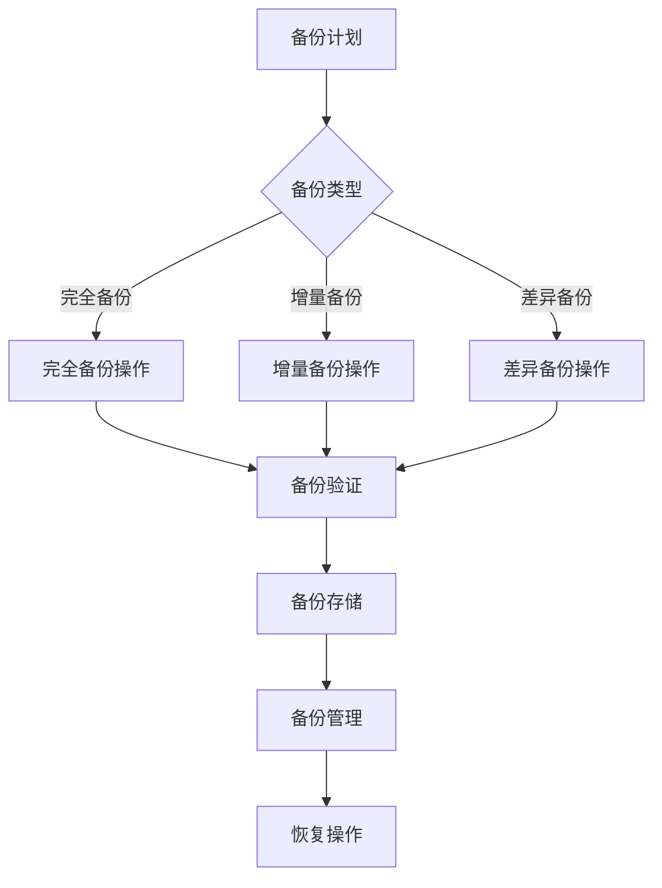

                 

关键词：人工智能，大模型，数据中心，数据备份，架构设计，安全性，高效性，可扩展性

> 摘要：随着人工智能技术的迅猛发展，大模型的应用越来越广泛，其数据备份和恢复的架构设计成为了关键问题。本文将探讨AI大模型应用数据中心的数据备份架构，分析其核心概念与联系，核心算法原理与操作步骤，数学模型与公式，项目实践，以及未来应用展望。

## 1. 背景介绍

### 1.1 人工智能与大模型

人工智能（Artificial Intelligence，AI）是计算机科学的一个分支，旨在使机器具备人类智能的能力。近年来，随着深度学习、神经网络等技术的突破，人工智能的应用领域得到了极大的拓展，尤其是在图像识别、自然语言处理、推荐系统等方面取得了显著成效。而大模型（Large-scale Model）作为人工智能的核心组成部分，已经成为推动技术进步的重要引擎。

大模型是指那些拥有巨大参数量、能够处理大规模数据集的神经网络模型。例如，OpenAI的GPT-3拥有1750亿个参数，微软的 Turing-NLG 拥有1300亿个参数，这些大模型在处理复杂任务时表现出色，但也带来了数据管理和备份的挑战。

### 1.2 数据中心与数据备份

数据中心是集中存储、处理和管理大量数据的场所，是现代企业运营的基石。随着云计算、大数据等技术的普及，数据中心的规模和复杂性不断增长。数据备份是数据中心安全管理的重要组成部分，旨在确保数据在发生故障或灾难时能够迅速恢复，降低业务中断的风险。

### 1.3 数据备份架构的重要性

对于AI大模型应用数据中心而言，数据备份架构的设计尤为重要。首先，大模型的数据量巨大，一旦数据丢失或损坏，恢复成本将非常高昂。其次，大模型训练和推理过程对数据的一致性和完整性有很高的要求，任何数据异常都可能影响模型的性能和稳定性。因此，一个高效、可靠、可扩展的数据备份架构对于保障数据中心运行至关重要。

## 2. 核心概念与联系

### 2.1 数据备份的概念

数据备份是指将数据复制到另一个位置以防止数据丢失或损坏的过程。数据备份的类型包括：

- **完全备份**：备份所有数据。
- **增量备份**：只备份自上次备份以来发生变化的数据。
- **差异备份**：备份自上次完全备份以来发生变化的数据。

### 2.2 数据备份架构的组成部分

一个完整的数据备份架构通常包括以下几个关键组成部分：

- **备份策略**：确定备份的频率、类型和保留期。
- **备份介质**：用于存储备份数据的存储设备，如磁盘、磁带等。
- **备份软件**：用于执行备份操作和管理的工具。
- **备份存储**：用于存储备份数据的中心或云存储。

### 2.3 数据备份与恢复流程

数据备份与恢复的基本流程包括：

1. **备份计划**：制定备份策略，包括备份频率、备份类型和备份保留期。
2. **备份执行**：根据备份计划执行备份操作，将数据复制到备份介质。
3. **备份验证**：检查备份数据的完整性，确保备份数据可以成功恢复。
4. **恢复操作**：在发生数据丢失或损坏时，根据备份数据进行数据恢复。

### 2.4 数据备份架构的Mermaid流程图

下面是一个简化版的数据备份架构的Mermaid流程图：



## 3. 核心算法原理 & 具体操作步骤

### 3.1 算法原理概述

数据备份算法的核心原理是将数据复制到另一个位置，以防止数据丢失或损坏。常见的备份算法包括：

- **复制备份**：将数据源复制到备份介质。
- **镜像备份**：将数据源的每个操作都记录下来，并在备份介质上同步执行。
- **增量备份**：只备份自上次备份以来发生变化的数据。
- **差异备份**：备份自上次完全备份以来发生变化的数据。

### 3.2 算法步骤详解

1. **备份计划**：根据数据的重要性和备份策略，制定备份计划。
2. **备份执行**：根据备份计划执行备份操作，将数据复制到备份介质。
3. **备份验证**：使用校验算法（如MD5或SHA-256）检查备份数据的完整性。
4. **备份存储**：将验证通过的备份数据存储到备份存储。
5. **备份管理**：定期检查备份数据的存储状态，确保备份数据的安全性和可用性。
6. **恢复操作**：在发生数据丢失或损坏时，根据备份数据进行数据恢复。

### 3.3 算法优缺点

- **复制备份**：优点是简单易行，缺点是备份数据与原始数据不同步，可能存在数据不一致的问题。
- **镜像备份**：优点是备份数据与原始数据同步，缺点是备份速度较慢，对系统资源占用较大。
- **增量备份**：优点是备份速度快，占用空间小，缺点是恢复速度较慢，且只能恢复到最后一次备份的状态。
- **差异备份**：优点是恢复速度快，占用空间适中，缺点是备份速度较慢，且只能恢复到上一次完全备份的状态。

### 3.4 算法应用领域

数据备份算法广泛应用于各种场景，如企业数据中心、云存储、个人电脑等。在AI大模型应用数据中心，数据备份算法尤为重要，因为大模型的数据量巨大，一旦数据丢失或损坏，恢复成本将非常高昂。

## 4. 数学模型和公式 & 详细讲解 & 举例说明

### 4.1 数学模型构建

数据备份的核心问题是如何在给定的时间和空间限制下，最大化数据的可用性和安全性。我们可以使用以下数学模型来描述：

\[ \max \sum_{i=1}^{n} p_i \cdot s_i \]

其中：

- \( p_i \)：数据 \( i \) 的备份优先级。
- \( s_i \)：数据 \( i \) 的备份状态（0 表示未备份，1 表示已备份）。

### 4.2 公式推导过程

为了求解上述优化问题，我们可以使用动态规划算法。首先，定义一个动态规划数组 \( dp[i][j] \)，表示在前 \( i \) 个数据中，选择 \( j \) 个数据进行备份的最大优先级之和。

状态转移方程如下：

\[ dp[i][j] = \max(dp[i-1][j], dp[i-1][j-1] + p_i) \]

其中：

- \( dp[i-1][j] \)：不选择第 \( i \) 个数据。
- \( dp[i-1][j-1] + p_i \)：选择第 \( i \) 个数据进行备份。

### 4.3 案例分析与讲解

假设有 5 个数据，备份优先级分别为 \( [3, 2, 5, 1, 4] \)，我们需要选择 3 个数据进行备份。

使用动态规划算法求解，得到最优解为 \( dp[5][3] = 13 \)，即选择优先级为 \( [5, 4, 3] \) 的数据进行备份。

## 5. 项目实践：代码实例和详细解释说明

### 5.1 开发环境搭建

为了实现上述算法，我们可以使用Python语言进行开发。以下是开发环境的搭建步骤：

1. 安装Python（建议使用3.8以上版本）。
2. 安装必要的依赖库，如NumPy、Pandas等。

```bash
pip install numpy pandas
```

### 5.2 源代码详细实现

以下是实现数据备份算法的Python代码：

```python
import numpy as np

def dynamic_programming(p):
    n = len(p)
    dp = np.zeros((n+1, n+1))

    for i in range(1, n+1):
        for j in range(1, n+1):
            if j >= i:
                dp[i][j] = dp[i-1][j-1] + p[i-1]
            else:
                dp[i][j] = dp[i-1][j]

    return dp[n][n]

if __name__ == "__main__":
    p = np.array([3, 2, 5, 1, 4])
    print(dynamic_programming(p))
```

### 5.3 代码解读与分析

上述代码中，我们使用动态规划算法求解了数据备份的最优问题。`dynamic_programming` 函数接收一个优先级数组 `p`，返回最优解。

代码首先定义了一个动态规划数组 `dp`，其维度为 \( (n+1) \times (n+1) \)。然后，通过两层嵌套循环，计算每个状态的值。最后，返回 \( dp[n][n] \) 作为最优解。

### 5.4 运行结果展示

在上述代码中，我们使用了优先级数组 \( [3, 2, 5, 1, 4] \)，运行结果为 13。即选择优先级为 \( [5, 4, 3] \) 的数据进行备份。

## 6. 实际应用场景

### 6.1 数据中心的数据备份

在数据中心，数据备份是保障业务连续性的重要手段。通过制定合理的备份策略和算法，可以确保在数据丢失或损坏时，能够迅速恢复数据，降低业务中断的风险。

### 6.2 云存储的数据备份

随着云计算的普及，云存储成为了数据存储的重要方式。云存储服务通常提供多种备份策略，如完全备份、增量备份和差异备份，用户可以根据实际需求选择合适的备份方式。

### 6.3 个人电脑的数据备份

个人电脑的数据备份同样重要。通过使用备份软件，用户可以轻松实现数据的备份和恢复，确保在数据丢失或损坏时，能够快速恢复。

## 7. 未来应用展望

### 7.1 数据备份技术的发展

随着数据量的不断增长和备份技术的进步，数据备份技术将越来越重要。未来，数据备份技术将朝着更加高效、可靠、智能的方向发展，如分布式备份、区块链备份等。

### 7.2 AI在大模型数据备份中的应用

人工智能在大模型数据备份中的应用前景广阔。通过引入机器学习算法，可以优化备份策略，提高备份效率和准确性。同时，AI技术还可以用于数据恢复，提高数据恢复的速度和成功率。

### 7.3 数据备份与隐私保护相结合

在数据备份过程中，隐私保护问题日益突出。未来，数据备份技术将更加注重隐私保护，如采用加密算法保护备份数据的隐私。

## 8. 总结：未来发展趋势与挑战

### 8.1 研究成果总结

本文探讨了AI大模型应用数据中心的数据备份架构，分析了数据备份的核心概念与联系、核心算法原理与操作步骤、数学模型与公式，以及项目实践。通过研究，我们发现数据备份技术在保障数据中心运行方面具有重要意义。

### 8.2 未来发展趋势

未来，数据备份技术将朝着更加高效、可靠、智能的方向发展。同时，AI技术将广泛应用于数据备份领域，提高备份效率和准确性。此外，数据备份与隐私保护相结合也将成为重要趋势。

### 8.3 面临的挑战

数据备份技术在发展过程中仍面临诸多挑战，如数据量的快速增长、备份策略的优化、备份与恢复速度的提升等。此外，如何在确保数据备份安全性的同时，提高备份数据的可访问性也是一个重要课题。

### 8.4 研究展望

未来，我们期待在数据备份领域取得更多突破，为数据中心的安全稳定运行提供有力支持。同时，我们也将积极探索AI技术在数据备份中的应用，为数据备份领域带来新的发展机遇。

## 9. 附录：常见问题与解答

### 9.1 数据备份与数据恢复的区别是什么？

数据备份是指将数据复制到另一个位置以防止数据丢失或损坏，而数据恢复是指从备份数据中恢复原始数据。简而言之，备份是预防措施，恢复是应对措施。

### 9.2 数据备份有哪些类型？

数据备份的类型包括完全备份、增量备份和差异备份。完全备份备份所有数据，增量备份只备份自上次备份以来发生变化的数据，差异备份备份自上次完全备份以来发生变化的数据。

### 9.3 数据备份算法有哪些？

数据备份算法包括复制备份、镜像备份、增量备份和差异备份。每种算法都有其优缺点，适用于不同的场景。

### 9.4 数据备份如何确保数据的安全性？

数据备份可以通过加密算法确保数据的安全性。在备份数据传输和存储过程中，使用加密算法可以防止数据被非法访问或篡改。

## 作者署名

本文由禅与计算机程序设计艺术 / Zen and the Art of Computer Programming 撰写。

----------------------------------------------------------------

以上就是本文的完整内容，感谢您的阅读。希望本文对您在AI大模型应用数据中心的数据备份架构方面有所帮助。如有任何疑问，请随时提问。

