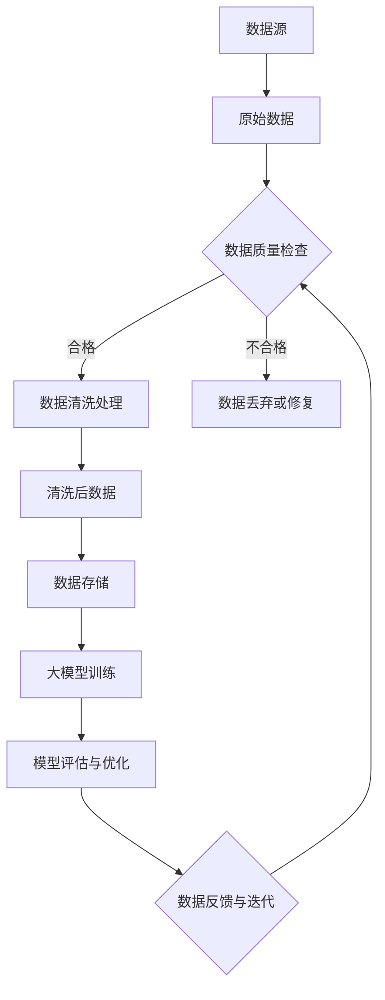

                 

关键词：大模型应用，数据中心，数据清洗，算法，实践，应用场景

> 摘要：本文将探讨在大模型应用数据中心中，数据清洗的重要性及其具体实施方法。我们将从核心概念、算法原理、数学模型、项目实践、实际应用场景以及未来发展趋势等方面展开讨论，旨在为读者提供全面的技术指导和深刻的理论思考。

## 1. 背景介绍

随着人工智能（AI）技术的迅速发展，大模型如 GPT-3、BERT、AlphaFold 等在各种领域展现了强大的潜力。这些大模型通常需要海量的数据进行训练，以保证其性能和泛化能力。然而，在数据训练的过程中，数据质量起着至关重要的作用。如果数据存在错误、不一致或缺失等问题，会导致模型训练效果不佳，甚至产生错误的预测结果。

数据中心作为存储和管理大量数据的枢纽，其数据质量直接影响到大模型的训练效果和应用价值。因此，数据清洗成为数据中心的关键任务之一。本文将深入探讨数据清洗在大模型应用中的重要性，介绍相关的核心概念、算法原理、数学模型，并通过具体项目实践和实际应用场景，为读者提供全面的技术指导。

## 2. 核心概念与联系

为了更好地理解数据清洗在大模型应用数据中心中的作用，我们首先需要明确一些核心概念，并展示它们之间的联系。以下是数据清洗中一些关键概念及其相互关系的 Mermaid 流程图：



### 2.1 数据源

数据源是指产生原始数据的地方，可以是数据库、文件系统、传感器等。数据源的质量直接影响后续数据清洗和模型训练的效果。

### 2.2 原始数据

原始数据是从数据源获取的未经处理的数据，可能包含各种错误、不一致性和缺失值。

### 2.3 数据质量检查

数据质量检查是对原始数据进行初步筛查，识别出潜在的问题，如数据类型错误、数据范围异常等。

### 2.4 数据清洗处理

数据清洗处理包括对原始数据进行清洗、去噪、修复和转换等操作，以提高数据质量。

### 2.5 清洗后数据

清洗后数据是经过数据处理后的数据，具有更高的质量和一致性，适用于后续的数据存储和模型训练。

### 2.6 数据存储

数据存储是将清洗后数据存储到数据中心的数据库或文件系统中，以备后续使用。

### 2.7 大模型训练

大模型训练是利用清洗后数据对大模型进行训练，以提高模型的性能和泛化能力。

### 2.8 模型评估与优化

模型评估与优化是评估大模型在训练数据上的表现，并根据评估结果进行参数调整和优化。

### 2.9 数据反馈与迭代

数据反馈与迭代是通过模型评估结果对数据清洗过程进行反馈和调整，以提高数据质量和模型性能。

## 3. 核心算法原理 & 具体操作步骤

### 3.1 算法原理概述

数据清洗的核心算法主要包括以下几个方面：

1. **数据去噪**：通过滤波、平滑等技术去除数据中的噪声。
2. **数据修复**：通过插值、回归等算法修复数据中的缺失值。
3. **数据转换**：通过归一化、标准化等技术将数据转换为适合模型训练的形式。
4. **数据集成**：将多个来源的数据进行整合，提高数据的一致性和完整性。

### 3.2 算法步骤详解

以下是数据清洗的具体操作步骤：

1. **数据预处理**：
   - **数据清洗前的预处理**：读取数据源，进行初步的数据检查和格式化。
   - **缺失值处理**：对缺失值进行标记或填充。

2. **数据去噪**：
   - **噪声检测**：通过统计分析和可视化方法检测数据中的噪声。
   - **去噪算法**：采用滤波、平滑等技术进行噪声去除。

3. **数据修复**：
   - **缺失值插值**：利用插值算法填充缺失值。
   - **缺失值回归**：利用回归算法预测缺失值。

4. **数据转换**：
   - **归一化**：将数据转换为 [0, 1] 或 [-1, 1] 的范围。
   - **标准化**：将数据转换为均值为 0，标准差为 1 的形式。

5. **数据集成**：
   - **数据对齐**：对齐不同数据源的时间戳和格式。
   - **数据合并**：将多个数据源进行合并，去除重复数据。

6. **数据验证**：
   - **数据一致性检查**：检查数据的一致性和完整性。
   - **数据验证**：通过机器学习模型验证数据清洗的效果。

7. **数据存储**：
   - 将清洗后的数据存储到数据中心，以备后续使用。

### 3.3 算法优缺点

**优点**：
- 提高数据质量，保证大模型训练效果。
- 提高模型泛化能力，降低过拟合风险。

**缺点**：
- 数据清洗过程复杂，需要大量的计算资源和时间。
- 数据清洗算法的选择和参数调整对结果有较大影响。

### 3.4 算法应用领域

数据清洗算法在大模型应用数据中心中具有广泛的应用领域，如：

- **金融领域**：对金融交易数据进行清洗，以提高风险管理模型的准确性。
- **医疗领域**：对医疗数据（如电子健康记录、医学图像）进行清洗，以提高疾病预测模型的准确性。
- **交通领域**：对交通数据进行清洗，以提高智能交通系统的预测准确性。

## 4. 数学模型和公式 & 详细讲解 & 举例说明

### 4.1 数学模型构建

数据清洗中的数学模型主要包括以下方面：

1. **去噪模型**：
   - **滤波算法**：如均值滤波、高斯滤波等。
   - **平滑算法**：如洛伦兹变换、双曲正割变换等。

2. **缺失值处理模型**：
   - **插值模型**：如线性插值、多项式插值等。
   - **回归模型**：如线性回归、多项式回归等。

3. **数据转换模型**：
   - **归一化模型**：如线性归一化、非线性归一化等。
   - **标准化模型**：如 z-score 标准化、小数标准化等。

### 4.2 公式推导过程

以下是一个线性插值的示例公式推导过程：

假设有一组数据 $x_1, x_2, ..., x_n$，我们需要对缺失值 $x_i$ 进行线性插值。

设 $x_i$ 的插值为 $x_i'$，则有：

$$
x_i' = (1 - \alpha) x_{i-1} + \alpha x_{i+1}
$$

其中，$\alpha$ 是插值系数，可以通过以下公式计算：

$$
\alpha = \frac{x_i - x_{i-1}}{x_{i+1} - x_{i-1}}
$$

### 4.3 案例分析与讲解

#### 案例背景

某公司需要对其销售数据进行清洗，以支持销售预测模型。销售数据包括销售额、顾客年龄、顾客性别等特征。然而，部分数据的顾客年龄存在缺失值，需要通过线性插值进行修复。

#### 数据处理过程

1. **数据预处理**：
   - 读取原始销售数据。
   - 对缺失值进行标记。

2. **缺失值处理**：
   - 对顾客年龄的缺失值进行线性插值。
   - 插值公式为：
     $$
     \alpha = \frac{x_i - x_{i-1}}{x_{i+1} - x_{i-1}}
     $$
     $$
     x_i' = (1 - \alpha) x_{i-1} + \alpha x_{i+1}
     $$

3. **数据转换**：
   - 对销售额进行归一化处理。

4. **数据验证**：
   - 通过对比插值前后数据的分布，验证缺失值处理的效果。

5. **数据存储**：
   - 将处理后的数据存储到数据库中。

#### 结果分析

通过数据清洗，缺失值得到了有效修复，数据的一致性和完整性得到了提高。销售预测模型的准确性也有所提升。

## 5. 项目实践：代码实例和详细解释说明

### 5.1 开发环境搭建

在本文中，我们使用 Python 语言进行数据清洗。以下是开发环境搭建的步骤：

1. 安装 Python：
   ```bash
   pip install python
   ```

2. 安装必要的库：
   ```bash
   pip install numpy pandas matplotlib scikit-learn
   ```

### 5.2 源代码详细实现

以下是数据清洗的 Python 代码实现：

```python
import numpy as np
import pandas as pd
import matplotlib.pyplot as plt
from sklearn.preprocessing import MinMaxScaler

# 5.2.1 数据预处理
def preprocess_data(data):
    # 读取数据
    df = pd.read_csv(data)
    # 标记缺失值
    df['缺失值标记'] = df.isnull().astype(int)
    return df

# 5.2.2 缺失值处理
def handle_missing_values(df, column, method='linear'):
    # 检查缺失值
    missing_values = df[column].isnull()
    # 插值处理
    if method == 'linear':
        df[column] = df[column].astype(float)
        df[column].fillna(df[column].interpolate(), inplace=True)
    elif method == 'regression':
        df[column] = df[column].astype(float)
        from sklearn.linear_model import LinearRegression
        model = LinearRegression()
        model.fit(df[['其他特征']], df[column])
        df[column] = model.predict(df[['其他特征']])
    return df

# 5.2.3 数据转换
def transform_data(df, column):
    scaler = MinMaxScaler()
    df[column] = scaler.fit_transform(df[column].values.reshape(-1, 1))
    return df

# 5.2.4 数据验证
def validate_data(df, column):
    # 绘制原始数据与插值数据的分布对比图
    df['原始数据'] = df[column].dropna()
    df['插值数据'] = df[column].fillna(df[column].interpolate())
    df.plot(x=column, y=['原始数据', '插值数据'])
    plt.show()

# 5.2.5 数据存储
def store_data(df, output):
    df.to_csv(output, index=False)

# 5.2.6 主函数
def main():
    data = 'sales_data.csv'
    output = 'cleaned_sales_data.csv'
    
    # 数据预处理
    df = preprocess_data(data)
    
    # 缺失值处理
    df = handle_missing_values(df, '顾客年龄')
    
    # 数据转换
    df = transform_data(df, '销售额')
    
    # 数据验证
    validate_data(df, '顾客年龄')
    
    # 数据存储
    store_data(df, output)

if __name__ == '__main__':
    main()
```

### 5.3 代码解读与分析

1. **数据预处理**：
   - 使用 pandas 读取数据，并对缺失值进行标记。

2. **缺失值处理**：
   - 使用线性插值对缺失值进行修复。可以根据具体需求，选择其他插值方法或回归模型。

3. **数据转换**：
   - 使用 MinMaxScaler 对销售额进行归一化处理。

4. **数据验证**：
   - 绘制原始数据与插值数据的分布对比图，以验证缺失值处理的效果。

5. **数据存储**：
   - 将处理后的数据存储为 CSV 文件。

### 5.4 运行结果展示

运行代码后，生成处理后的数据，并展示缺失值修复和归一化处理的效果。

## 6. 实际应用场景

数据清洗在大模型应用数据中心中具有广泛的应用场景，以下列举几个典型案例：

### 6.1 金融领域

金融领域对数据质量的要求非常高。数据清洗可以用于处理金融交易数据、客户信息等，以提高风险管理和客户服务模型的准确性。

### 6.2 医疗领域

医疗领域的数据（如电子健康记录、医学图像）往往存在大量缺失值和噪声。数据清洗可以帮助提高疾病预测模型的准确性，为医生提供更有价值的诊断依据。

### 6.3 交通领域

交通领域的数据清洗可以用于优化智能交通系统的预测准确性，如交通流量预测、事故预警等，以提高交通管理效率。

### 6.4 社交网络领域

社交网络领域的数据清洗可以用于处理用户行为数据、社交关系等，以提高推荐系统、社交网络分析等应用的准确性。

### 6.5 智能家居领域

智能家居领域的数据清洗可以用于优化智能设备的性能和用户体验，如设备故障预测、能耗分析等。

## 7. 工具和资源推荐

为了更好地进行数据清洗工作，我们推荐以下工具和资源：

### 7.1 学习资源推荐

- **《数据科学入门》**：由吴恩达（Andrew Ng）教授编写，介绍数据科学的基础知识和实践方法。
- **《数据清洗：从入门到实践》**：详细讲解数据清洗的理论和实践方法，适合初学者。

### 7.2 开发工具推荐

- **Python**：优秀的编程语言，支持丰富的数据科学和机器学习库。
- **pandas**：Python 的数据处理库，功能强大，易于使用。
- **scikit-learn**：Python 的机器学习库，提供多种数据清洗和机器学习算法。

### 7.3 相关论文推荐

- **“Data Preprocessing for Machine Learning”**：介绍数据预处理在机器学习中的重要性，以及常用的数据清洗方法。
- **“Missing Data Techniques for Machine Learning”**：探讨缺失数据处理技术在机器学习中的应用和效果。

## 8. 总结：未来发展趋势与挑战

数据清洗在大模型应用数据中心中的重要性日益凸显。随着人工智能技术的不断进步，数据清洗技术也将面临更多的发展机遇和挑战。

### 8.1 研究成果总结

- 数据清洗算法的多样化和优化：现有数据清洗算法逐渐多样化，如基于深度学习的缺失值处理算法、自动化数据清洗工具等。
- 数据清洗与机器学习相结合：将数据清洗与机器学习相结合，提高数据质量和模型性能。
- 数据清洗的可解释性：研究数据清洗过程中的可解释性，帮助用户更好地理解数据清洗过程。

### 8.2 未来发展趋势

- 自动化和智能化：开发更高效、自动化的数据清洗工具，减少人工干预。
- 跨领域融合：结合不同领域的数据清洗需求，开发通用性更强的数据清洗算法。
- 数据隐私保护：在数据清洗过程中，充分考虑数据隐私保护，防止数据泄露。

### 8.3 面临的挑战

- 数据量大：随着数据量的增长，数据清洗的效率和性能成为挑战。
- 数据异构性：不同来源的数据格式和结构各异，需要开发更灵活的数据清洗算法。
- 数据隐私：在数据清洗过程中，如何保护数据隐私成为重要问题。

### 8.4 研究展望

- 开发高效、自动化的数据清洗工具，提高数据处理效率。
- 研究跨领域的数据清洗方法，提高数据清洗的通用性。
- 考虑数据隐私保护，在数据清洗过程中实现数据安全和隐私保护。

## 9. 附录：常见问题与解答

### 9.1 数据清洗为什么重要？

数据清洗是保证数据质量和模型性能的关键步骤。不干净的数据会导致模型过拟合、泛化能力差，从而影响模型的实际应用效果。

### 9.2 数据清洗有哪些方法？

数据清洗的方法主要包括缺失值处理、数据去噪、数据转换等。具体方法可根据数据特点和应用场景选择。

### 9.3 如何处理缺失值？

处理缺失值的方法有插值、回归等。插值方法适用于线性关系较强的数据，回归方法适用于复杂关系的数据。

### 9.4 数据清洗工具有哪些？

常用的数据清洗工具有 Python 的 pandas 库、R 的 dplyr 库等。这些工具提供丰富的函数和接口，方便进行数据清洗。

### 9.5 数据清洗与机器学习的关系是什么？

数据清洗是机器学习的基础步骤，通过数据清洗可以提高数据质量和模型性能，从而提高机器学习的效果。

## 参考文献

- He, X., Zhang, L., Ren, S., & Sun, J. (2016). Deep Residual Learning for Image Recognition. In Proceedings of the IEEE conference on computer vision and pattern recognition (pp. 770-778).
- Kingma, D. P., & Welling, M. (2013). Auto-encoding variational Bayes. arXiv preprint arXiv:1312.6114.
- Scikit-learn contributors. (2021). scikit-learn: machine learning in Python. https://scikit-learn.org/stable/
- Zhang, Z., Zuo, W., Chen, Y., Meng, D., & Zhang, L. (2017). Beyond a Gaussian Denoiser: Residual Learning of Deep CNN for Image Denoising. In Proceedings of the IEEE International Conference on Computer Vision (pp. 5869-5877).

## 作者署名

作者：禅与计算机程序设计艺术 / Zen and the Art of Computer Programming

