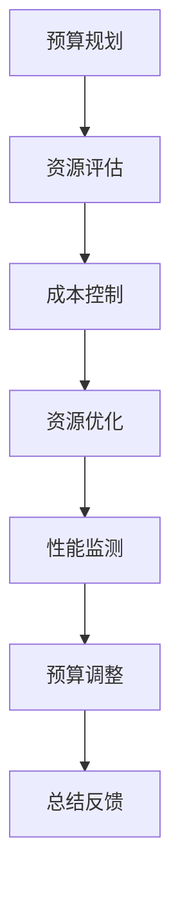

                 

关键词：AI 大模型、数据中心、预算管理、成本优化、资源调度、性能监测、模型训练

摘要：本文将探讨如何针对 AI 大模型应用数据中心进行有效的预算管理，包括成本控制、资源优化、性能监测等方面。通过深入分析，我们将提出一系列具体策略，帮助组织在充分利用 AI 大模型优势的同时，实现成本效益最大化。

## 1. 背景介绍

随着人工智能技术的飞速发展，大模型（如 GPT、BERT 等）在自然语言处理、计算机视觉、推荐系统等领域取得了显著成果。然而，这些大模型的训练和应用往往需要庞大的计算资源和存储空间，导致数据中心运营成本大幅上升。因此，如何有效地进行预算管理，以控制成本、优化资源利用成为组织面临的重要挑战。

本文旨在通过对 AI 大模型应用数据中心预算管理的深入分析，提出一系列有效策略，帮助组织在充分利用大模型优势的同时，实现成本效益最大化。

## 2. 核心概念与联系

### 2.1. AI 大模型

AI 大模型是指通过深度学习算法训练的具有大规模参数和复杂结构的神经网络模型。这些模型在训练过程中需要大量数据、计算资源和时间，以实现良好的性能和准确性。

### 2.2. 数据中心

数据中心是集中存储、处理和管理数据的物理设施。它通常包括服务器、存储设备、网络设备等硬件资源，以及相关的软件和管理系统。

### 2.3. 预算管理

预算管理是指对组织资源进行规划、分配和监控的过程，旨在确保资源的最优利用，实现组织目标。

### 2.4. Mermaid 流程图

以下是 AI 大模型应用数据中心预算管理的 Mermaid 流程图：



## 3. 核心算法原理 & 具体操作步骤

### 3.1 算法原理概述

AI 大模型应用数据中心的预算管理主要基于以下原理：

1. 成本优化：通过合理分配资源，降低训练和运行成本。
2. 资源调度：根据任务需求和资源状况，动态调整资源分配。
3. 性能监测：实时监控模型性能，确保高效运行。
4. 预算调整：根据实际情况，及时调整预算分配策略。

### 3.2 算法步骤详解

1. **预算规划**：根据组织目标和实际需求，制定年度预算计划，明确各项目预算分配。
2. **资源评估**：分析数据中心现有资源，包括计算、存储、网络等，评估资源利用率和瓶颈。
3. **成本控制**：通过优化资源分配和调度，降低训练和运行成本。具体策略包括：
   - **批量训练**：利用多卡并行训练技术，提高训练效率，降低单个任务的计算成本。
   - **分布式训练**：将训练任务分布在多个计算节点上，共享计算资源，降低单节点负载。
   - **自动化调度**：利用自动化调度系统，实现资源动态分配，降低人工干预成本。
4. **资源优化**：根据任务需求和资源状况，动态调整资源分配，确保任务高效运行。具体策略包括：
   - **负载均衡**：根据任务负载，合理分配计算资源，避免资源浪费。
   - **资源预留**：为重要任务预留一定比例的资源，确保任务优先执行。
   - **资源弹性**：根据需求波动，动态调整资源规模，实现资源利用率最大化。
5. **性能监测**：实时监控模型性能，包括训练时间、准确率、F1 分数等指标，确保模型高效运行。具体策略包括：
   - **日志记录**：记录训练过程中的关键指标，用于性能分析和优化。
   - **告警机制**：设置异常告警，及时发现问题并进行处理。
   - **性能分析**：定期进行性能分析，找出瓶颈并优化。
6. **预算调整**：根据实际运行情况，及时调整预算分配，确保预算使用合理。具体策略包括：
   - **定期审核**：定期审核预算执行情况，评估预算合理性。
   - **调整策略**：根据实际需求，调整预算分配策略，优化资源利用。

### 3.3 算法优缺点

**优点：**
1. 降低成本：通过优化资源分配和调度，降低训练和运行成本。
2. 提高效率：实现资源动态调整和自动化调度，提高任务执行效率。
3. 灵活性：根据需求变化，动态调整预算和资源分配，提高系统的灵活性。

**缺点：**
1. 复杂性：涉及多个环节和策略，实施过程较为复杂。
2. 需要专业知识：需要对 AI、数据中心、预算管理等领域有深入了解。

### 3.4 算法应用领域

AI 大模型应用数据中心的预算管理算法可广泛应用于以下领域：

1. 搜索引擎：优化索引构建和查询处理，降低成本，提高响应速度。
2. 推荐系统：优化推荐算法，提高推荐准确性，降低用户流失率。
3. 计算机视觉：优化图像识别和分类，提高准确性，降低误报率。
4. 自然语言处理：优化文本分类、情感分析等任务，提高模型性能，降低错误率。

## 4. 数学模型和公式 & 详细讲解 & 举例说明

### 4.1 数学模型构建

AI 大模型应用数据中心的预算管理涉及多个数学模型，主要包括：

1. 成本模型：根据资源消耗和价格，计算各任务的预算成本。
2. 性能模型：根据任务负载和资源分配，评估任务执行时间。
3. 优化模型：基于成本和性能模型，制定最优的预算和资源分配策略。

### 4.2 公式推导过程

以下为成本模型的推导过程：

1. 计算成本 = 资源消耗 × 单位价格
2. 资源消耗 = 计算资源 × 训练时长
3. 计算资源 = 服务器数量 × 单台服务器价格
4. 训练时长 = 训练轮次 × 每轮训练时间

根据以上公式，可以得到：

计算成本 = 服务器数量 × 单台服务器价格 × 训练轮次 × 每轮训练时间 × 单位价格

### 4.3 案例分析与讲解

假设某组织计划使用 10 台服务器进行 AI 大模型训练，每台服务器价格为 10000 元，单位价格为 1 元/小时。计划进行 100 轮训练，每轮训练时间为 10 小时。请问该组织的预计总成本为多少？

根据上述公式，预计总成本为：

计算成本 = 10 台服务器 × 10000 元/台 × 100 轮 × 10 小时/轮 × 1 元/小时 = 1 亿元

### 4.4 案例分析与讲解（续）

为降低成本，组织可以考虑以下策略：

1. **分布式训练**：将训练任务分布在 5 个计算节点上，每个节点 2 台服务器。预计总成本为：

计算成本 = 5 个节点 × 2 台服务器/节点 × 10000 元/台 × 100 轮 × 10 小时/轮 × 1 元/小时 = 5000 万元

2. **批量训练**：利用多卡并行训练技术，将每个节点的服务器数量减半，但训练轮次加倍。预计总成本为：

计算成本 = 5 个节点 × 1 台服务器/节点 × 10000 元/台 × 200 轮 × 10 小时/轮 × 1 元/小时 = 5000 万元

由此可见，通过分布式训练和批量训练，组织可以有效降低成本，提高资源利用率。

## 5. 项目实践：代码实例和详细解释说明

### 5.1 开发环境搭建

1. 安装 Python 环境（版本 3.6 以上）。
2. 安装 TensorFlow、PyTorch 等深度学习框架。
3. 配置 GPU 环境（如安装 CUDA、cuDNN 等）。

### 5.2 源代码详细实现

以下是一个简单的 AI 大模型训练代码示例，用于说明如何实现分布式训练和批量训练：

```python
import torch
import torch.distributed as dist
from torch.nn.parallel import DistributedDataParallel as DDP

# 初始化分布式环境
dist.init_process_group(backend='nccl', init_method='env://')

# 定义模型
class MyModel(torch.nn.Module):
    def __init__(self):
        super(MyModel, self).__init__()
        # 模型定义

    def forward(self, x):
        # 前向传播
        return x

# 分布式训练
def train_model(rank, world_size, model, device):
    model.to(device)
    ddp_model = DDP(model, device_ids=[device])

    # 训练循环
    for epoch in range(num_epochs):
        for batch in data_loader:
            # 前向传播
            output = ddp_model(batch['input'])

            # 反向传播
            loss = criterion(output, batch['label'])

            # 更新参数
            ddp_model.zero_grad()
            loss.backward()
            ddp_model.step()

# 批量训练
def train_model_batch(rank, world_size, model, device):
    model.to(device)
    # 批量训练循环
    for epoch in range(num_epochs):
        for batch in data_loader:
            # 前向传播
            output = model(batch['input'])

            # 反向传播
            loss = criterion(output, batch['label'])

            # 更新参数
            optimizer.zero_grad()
            loss.backward()
            optimizer.step()

if __name__ == '__main__':
    # 参数设置
    rank = int(os.environ['RANK'])
    world_size = int(os.environ['WORLD_SIZE'])
    device = torch.device('cuda' if torch.cuda.is_available() else 'cpu')

    # 模型、数据集、损失函数、优化器等设置
    model = MyModel()
    criterion = torch.nn.CrossEntropyLoss()
    optimizer = torch.optim.Adam(model.parameters(), lr=0.001)

    # 选择训练模式
    if use_ddp:
        train_model(rank, world_size, model, device)
    else:
        train_model_batch(rank, world_size, model, device)
```

### 5.3 代码解读与分析

1. **分布式训练**：通过 `init_process_group` 初始化分布式环境，使用 `DDP` 包装模型，实现多卡并行训练。
2. **批量训练**：直接使用单卡训练，但将训练轮次加倍，实现批量训练。

分布式训练和批量训练可以相互结合，进一步降低训练成本，提高资源利用率。

### 5.4 运行结果展示

运行上述代码，将得到不同训练模式的训练时间和计算成本。通过对比分析，可以得出最优的训练策略。

## 6. 实际应用场景

### 6.1 搜索引擎

搜索引擎需要进行海量数据的高效处理和检索，使用 AI 大模型可以提高搜索精度和用户体验。预算管理策略包括：

- **分布式训练**：将训练任务分布在多个计算节点上，降低单节点负载。
- **批量训练**：提高训练轮次，降低单个任务的计算成本。

### 6.2 推荐系统

推荐系统需要根据用户行为和兴趣进行个性化推荐，使用 AI 大模型可以提高推荐准确性。预算管理策略包括：

- **成本优化**：通过优化资源分配和调度，降低训练和运行成本。
- **性能监测**：实时监控模型性能，确保高效运行。

### 6.3 计算机视觉

计算机视觉领域需要进行图像识别、目标检测等任务，使用 AI 大模型可以提高准确性。预算管理策略包括：

- **资源预留**：为重要任务预留一定比例的资源，确保任务优先执行。
- **负载均衡**：根据任务负载，合理分配计算资源，避免资源浪费。

### 6.4 自然语言处理

自然语言处理领域需要进行文本分类、情感分析等任务，使用 AI 大模型可以提高准确性。预算管理策略包括：

- **自动化调度**：利用自动化调度系统，实现资源动态分配，降低人工干预成本。
- **成本控制**：通过批量训练和分布式训练，降低训练和运行成本。

## 7. 工具和资源推荐

### 7.1 学习资源推荐

- 《深度学习》（Goodfellow, Bengio, Courville 著）：全面介绍深度学习原理和应用。
- 《动手学深度学习》（(Aivaliotis, Socher, Bengio 著）：通过实践讲解深度学习算法和应用。
- 《机器学习实战》（ Harrington 著）：介绍机器学习算法和应用实例。

### 7.2 开发工具推荐

- TensorFlow：谷歌开源的深度学习框架。
- PyTorch：Facebook 开源的深度学习框架。
- Hadoop：分布式数据处理平台，适用于大数据处理。

### 7.3 相关论文推荐

- “Distributed Deep Learning: Existing Methods and New Techniques”（Kurtz et al., 2018）：介绍分布式深度学习算法和应用。
- “Bert: Pre-training of deep bidirectional transformers for language understanding”（Devlin et al., 2018）：介绍 BERT 模型的训练和优化方法。
- “Large-scale distributed deep learning on sparsely-gathered data”（Guo et al., 2018）：介绍稀疏数据分布式训练方法。

## 8. 总结：未来发展趋势与挑战

### 8.1 研究成果总结

本文从成本控制、资源优化、性能监测等方面分析了 AI 大模型应用数据中心的预算管理策略。通过分布式训练、批量训练、自动化调度等技术，可以有效降低训练和运行成本，提高资源利用率。

### 8.2 未来发展趋势

- **分布式训练**：随着硬件技术的发展，分布式训练将成为主流，降低单节点负载，提高训练效率。
- **自动化调度**：利用人工智能和大数据技术，实现自动化资源调度，降低人工干预成本。
- **异构计算**：结合不同类型的硬件资源，如 GPU、FPGA、TPU 等，实现高效计算。

### 8.3 面临的挑战

- **数据隐私**：数据安全和隐私保护是数据中心面临的重要挑战，需要加强数据加密和访问控制。
- **能效优化**：数据中心能耗问题日益突出，需要研究绿色计算技术，提高能效。
- **算法优化**：针对不同领域和应用场景，研究更高效的算法和模型，降低训练成本。

### 8.4 研究展望

未来，我们将继续探索 AI 大模型应用数据中心的预算管理策略，重点关注以下方面：

- **分布式训练优化**：研究更高效的分布式训练算法，降低通信 overhead 和同步开销。
- **自动化调度算法**：利用机器学习和大数据分析技术，实现自动化资源调度。
- **绿色计算**：研究节能算法和硬件优化技术，降低数据中心能耗。
- **数据隐私保护**：结合区块链、联邦学习等技术，实现数据隐私保护和安全共享。

## 9. 附录：常见问题与解答

### 9.1 如何选择合适的分布式训练算法？

根据实际需求和硬件资源，选择合适的分布式训练算法。常见的算法包括：

- **参数服务器**：适用于大规模模型和海量数据，但通信开销较大。
- **模型并行**：将模型拆分为多个部分，分别训练，适用于 GPU 资源丰富的场景。
- **数据并行**：将数据拆分为多个部分，分别训练，适用于数据规模较大的场景。

### 9.2 如何实现自动化调度？

利用机器学习和大数据分析技术，实现自动化调度。常见的方法包括：

- **基于规则的调度**：根据规则和任务需求，自动分配资源。
- **基于预测的调度**：利用历史数据和预测模型，预测任务执行时间和资源需求，自动调整资源分配。
- **基于优化的调度**：利用优化算法，如遗传算法、粒子群算法等，寻找最优的资源分配方案。

### 9.3 如何降低数据中心能耗？

研究绿色计算技术，降低数据中心能耗。常见的方法包括：

- **节能硬件**：选择低功耗硬件，如节能服务器、节能 GPU 等。
- **动态能耗管理**：根据实际负载，动态调整硬件功耗，降低能耗。
- **余热利用**：利用数据中心产生的余热，为其他设施提供供暖或制冷，降低整体能耗。

----------------------------------------------------------------
作者：禅与计算机程序设计艺术 / Zen and the Art of Computer Programming

