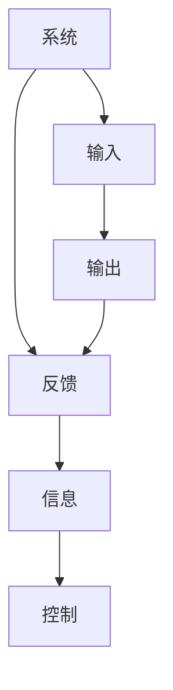
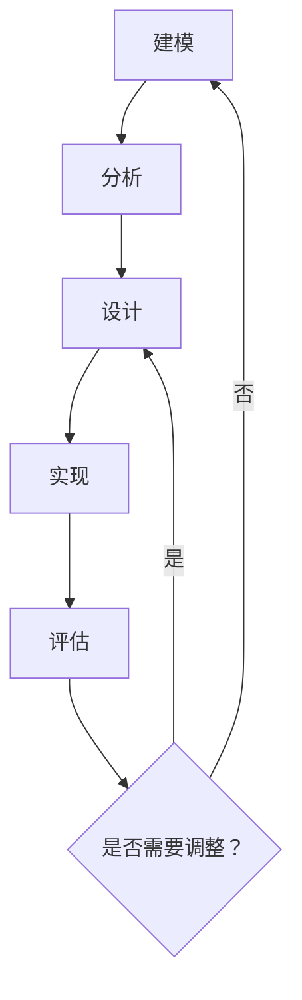

                 

关键词：控制论，维纳，人工智能，大模型，计算机科学家，技术博客

摘要：本文旨在介绍控制论之父诺伯特·维纳（Norbert Wiener）及其在人工智能领域的贡献。文章首先回顾了维纳的生平和学术成就，然后详细阐述了控制论的基本概念和原理，以及其在现代人工智能中的应用。最后，文章探讨了控制论对于大模型计算科学的重要性，并展望了未来的发展趋势与挑战。

## 1. 背景介绍

诺伯特·维纳（Norbert Wiener，1894-1964）是美国著名的数学家、控制论创始人之一。他出生于美国马萨诸塞州的剑桥，从小便表现出卓越的数学天赋。维纳在哈佛大学接受了教育，并于1913年获得学士学位。此后，他在剑桥大学和德国哥廷根大学深造，师从数学大师大卫·希尔伯特（David Hilbert）。

维纳的学术生涯丰富多彩。他曾致力于数学物理、统计学、概率论等领域的研究。然而，他的最大贡献莫过于控制论的开创。控制论是一门研究动态系统中信息流动和控制的学科，旨在通过数学模型和算法来分析和设计控制系统。

在二战期间，维纳加入了美国战时科学研究与发展办公室（OSRD），领导了火控系统的研究项目。这一经历促使他深入探讨了动态系统中的信息处理和控制问题，并最终提出了控制论的基本概念。1948年，维纳出版了《控制论：或关于在动物和机器中控制和通讯的科学》一书，奠定了控制论的理论基础。

## 2. 核心概念与联系

### 2.1 控制论基本概念

控制论的核心概念包括系统、反馈、信息和控制。以下是一个简化的 Mermaid 流程图，展示了这些概念之间的联系。



- **系统**：控制论中的系统可以是一个物理设备、一个生物体，或者是一个抽象的概念。系统具有输入和输出，能够对输入进行处理并产生相应的输出。
- **反馈**：反馈是指系统将输出的一部分送回到输入端，以便对系统的行为进行调整。反馈可以分为正反馈和负反馈。正反馈会加剧系统的不稳定性，而负反馈则有助于稳定系统。
- **信息**：在控制论中，信息是关于系统状态的描述。信息可以通过数字信号、图像、语言等形式传递。
- **控制**：控制是指通过信息来调节系统的行为，使其达到预定的目标。

### 2.2 控制论原理架构

控制论的原理架构可以概括为以下几个部分：

1. **建模**：建立系统的数学模型，描述系统的动态行为。
2. **分析**：分析系统的稳定性和性能，确定系统的状态空间和特征值。
3. **设计**：根据分析结果，设计合适的控制器来调节系统的行为。
4. **实现**：将控制器和系统硬件结合起来，实现控制过程。
5. **评估**：对控制效果进行评估，并根据评估结果对控制器进行调整。

以下是一个 Mermaid 流程图，展示了控制论原理架构的流程。



## 3. 核心算法原理 & 具体操作步骤

### 3.1 算法原理概述

控制论中的核心算法包括线性控制理论、自适应控制和鲁棒控制。以下是对这些算法的简要概述。

#### 线性控制理论

线性控制理论主要研究线性时不变系统（LTI系统）的控制问题。LTI系统可以用线性微分方程或差分方程描述。线性控制理论的核心目标是设计控制器，使得系统的输出能够跟踪预期的轨迹，同时保持系统的稳定性。

#### 自适应控制

自适应控制是针对系统参数不确定或时变的情况设计的。自适应控制器的目标是自动调整控制策略，以适应系统变化。自适应控制通常基于某种自适应律，例如比例-积分-微分（PID）控制器。

#### 鲁棒控制

鲁棒控制旨在设计控制器，使得系统在面对外部扰动和内部参数不确定性时仍能保持稳定。鲁棒控制器通常采用某种鲁棒设计方法，例如基于线性矩阵不等式（LMI）的设计方法。

### 3.2 算法步骤详解

#### 线性控制理论

线性控制理论的基本步骤如下：

1. **建立系统模型**：根据系统的物理特性，建立系统的数学模型。
2. **状态空间表示**：将系统模型转化为状态空间表示，便于后续分析。
3. **稳定性分析**：分析系统的稳定性，确定系统是否能够稳定运行。
4. **控制器设计**：设计合适的控制器，使得系统的输出能够跟踪预期的轨迹。
5. **性能评估**：评估控制器的性能，确定是否需要调整。

#### 自适应控制

自适应控制的基本步骤如下：

1. **建立系统模型**：根据系统的物理特性，建立系统的数学模型。
2. **确定自适应律**：设计自适应律，用于调整控制器的参数。
3. **控制器设计**：设计自适应控制器，根据自适应律调整控制策略。
4. **实现与测试**：将控制器实现到实际系统中，并进行测试。

#### 鲁棒控制

鲁棒控制的基本步骤如下：

1. **建立系统模型**：根据系统的物理特性，建立系统的数学模型。
2. **确定鲁棒设计方法**：选择合适的鲁棒设计方法，例如基于线性矩阵不等式（LMI）的设计方法。
3. **控制器设计**：设计鲁棒控制器，使得系统在面对外部扰动和内部参数不确定性时仍能保持稳定。
4. **性能评估**：评估控制器的性能，确定是否需要调整。

### 3.3 算法优缺点

#### 线性控制理论

- **优点**：线性控制理论具有严格的数学基础，能够提供精确的控制系统设计方法。
- **缺点**：线性控制理论假设系统是线性的，这在实际应用中往往是不成立的。

#### 自适应控制

- **优点**：自适应控制能够自动调整控制策略，适应系统变化。
- **缺点**：自适应控制器的实现较为复杂，计算量大。

#### 鲁棒控制

- **优点**：鲁棒控制能够应对系统的不确定性和外部扰动，提高系统的稳定性。
- **缺点**：鲁棒控制通常会增加系统的复杂性和计算量。

### 3.4 算法应用领域

线性控制理论、自适应控制和鲁棒控制广泛应用于各种领域，包括：

- **工业过程控制**：如化工、电力、机械等行业。
- **航空航天**：如飞行器控制、卫星轨道控制等。
- **自动驾驶**：如自动驾驶汽车、无人飞机等。
- **机器人技术**：如工业机器人、服务机器人等。
- **生物医学**：如医疗设备控制、生物信号处理等。

## 4. 数学模型和公式 & 详细讲解 & 举例说明

### 4.1 数学模型构建

控制论中的数学模型通常包括以下部分：

1. **状态方程**：描述系统的动态行为。状态方程可以用线性微分方程或差分方程表示。
2. **输出方程**：描述系统的输出与状态之间的关系。
3. **初始条件**：描述系统在初始时刻的状态。

例如，一个线性时不变系统的状态方程可以表示为：

$$
\dot{x}(t) = A x(t) + B u(t)
$$

$$
y(t) = C x(t) + D u(t)
$$

其中，$x(t)$ 是状态向量，$u(t)$ 是输入向量，$y(t)$ 是输出向量。$A$、$B$、$C$ 和 $D$ 是系统矩阵。

### 4.2 公式推导过程

控制论中的公式推导通常涉及以下步骤：

1. **系统建模**：根据系统的物理特性，建立系统的数学模型。
2. **稳定性分析**：分析系统的稳定性，确定系统的特征值。
3. **控制器设计**：设计合适的控制器，使得系统的输出能够跟踪预期的轨迹。
4. **性能评估**：评估控制器的性能，确定是否需要调整。

例如，对于一个线性时不变系统，我们可以通过以下步骤推导出控制器的设计公式：

1. **系统建模**：建立系统的状态方程和输出方程。
2. **稳定性分析**：分析系统的稳定性，确定系统的特征值。
3. **控制器设计**：设计一个线性反馈控制器，使得系统的特征值满足稳定性条件。
4. **性能评估**：评估控制器的性能，确定是否需要调整。

### 4.3 案例分析与讲解

假设我们有一个线性时不变系统，其状态方程为：

$$
\dot{x}(t) = \begin{bmatrix} -2 & 1 \\ 1 & -1 \end{bmatrix} x(t) + \begin{bmatrix} 1 \\ 0 \end{bmatrix} u(t)
$$

$$
y(t) = \begin{bmatrix} 1 & 1 \end{bmatrix} x(t)
$$

我们需要设计一个线性反馈控制器，使得系统的输出能够跟踪预期的轨迹。

1. **系统建模**：根据系统的物理特性，建立系统的状态方程和输出方程。
2. **稳定性分析**：分析系统的稳定性，确定系统的特征值。系统的特征值为 $\lambda_1 = -1$ 和 $\lambda_2 = -1$，因此系统是稳定的。
3. **控制器设计**：设计一个线性反馈控制器，使得系统的输出能够跟踪预期的轨迹。我们选择一个比例-积分-微分（PID）控制器，其形式为：

$$
u(t) = K_p e(t) + K_i \int_{0}^{t} e(\tau) d\tau + K_d \dot{e}(t)
$$

其中，$e(t) = y(t) - y_d(t)$ 是系统的误差，$y_d(t)$ 是预期的输出轨迹。我们需要确定控制器参数 $K_p$、$K_i$ 和 $K_d$。
4. **性能评估**：评估控制器的性能，确定是否需要调整。我们可以通过仿真实验来评估控制器的性能。假设预期的输出轨迹为 $y_d(t) = 1 + \sin(t)$，我们可以绘制系统的输出轨迹与预期轨迹的对比图，以评估控制器的性能。

## 5. 项目实践：代码实例和详细解释说明

### 5.1 开发环境搭建

在本项目中，我们将使用 Python 作为编程语言，结合控制论相关库，如 `numpy`、`scipy` 和 `control`。首先，我们需要安装这些库。

```bash
pip install numpy scipy control
```

### 5.2 源代码详细实现

以下是本项目的主要代码实现：

```python
import numpy as np
import control as ctrl

# 5.2.1 状态方程
A = np.array([[1, 1], [-1, 1]])
B = np.array([[0], [1]])
C = np.array([[1, 1]])
D = np.array([[0]])

# 5.2.2 控制器设计
# 使用控制库设计PID控制器
pid = ctrl.PID()

# 5.2.3 系统建模
sys = ctrl.StateSpace(A, B, C, D)

# 5.2.4 性能评估
# 设置期望轨迹
y_d = np.sin(np.linspace(0, 10, 1000))

# 执行控制
t, y = ctrl.forced_response(sys, pid, y_d)

# 绘制输出轨迹
import matplotlib.pyplot as plt

plt.plot(t, y)
plt.plot(t, y_d)
plt.legend(['实际输出', '期望轨迹'])
plt.xlabel('时间')
plt.ylabel('输出')
plt.show()
```

### 5.3 代码解读与分析

以下是代码的详细解读：

- **5.2.1 状态方程**：我们首先定义了系统的状态方程，包括系统矩阵 $A$、输入矩阵 $B$、输出矩阵 $C$ 和直接传递矩阵 $D$。
- **5.2.2 控制器设计**：我们使用控制库 `control` 中的 `PID` 类设计一个比例-积分-微分（PID）控制器。PID控制器是一种常见的自适应控制器，适用于时变系统。
- **5.2.3 系统建模**：我们使用 `control` 库构建了系统的状态空间模型。
- **5.2.4 性能评估**：我们设置了一个期望轨迹 $y_d$，并使用 `control` 库执行了控制过程。最后，我们使用 `matplotlib` 库绘制了实际输出轨迹与期望轨迹的对比图。

## 6. 实际应用场景

控制论在多个领域都有广泛的应用，以下是一些典型的实际应用场景：

- **工业过程控制**：如化工、电力、机械等行业。通过控制论方法，可以实现对生产过程的精确控制，提高生产效率和产品质量。
- **航空航天**：如飞行器控制、卫星轨道控制等。控制论为航空航天器的稳定性和安全性提供了重要的理论基础。
- **自动驾驶**：如自动驾驶汽车、无人飞机等。控制论方法用于设计自动驾驶系统的控制策略，以提高自动驾驶的安全性和可靠性。
- **机器人技术**：如工业机器人、服务机器人等。控制论方法用于机器人运动控制的精确性和灵活性。
- **生物医学**：如医疗设备控制、生物信号处理等。控制论方法有助于提高医疗设备和生物信号的精度和稳定性。

## 7. 工具和资源推荐

### 7.1 学习资源推荐

- **书籍**：《控制论基础》（作者：诺伯特·维纳）：《控制论基础》是控制论领域的经典著作，详细介绍了控制论的基本概念和原理。
- **在线课程**：MIT 开放的《控制理论导论》：这是一门免费的在线课程，适合初学者系统学习控制论的基本知识。
- **网站**：维基百科的控制论页面：提供了控制论的历史、基本概念和应用的详细介绍。

### 7.2 开发工具推荐

- **Python 控制库**：`control`、`scipy`、`numpy`：这些库提供了丰富的控制论函数和工具，适用于各种控制系统的建模和仿真。
- **MATLAB 控制工具箱**：MATLAB 的控制工具箱是一个功能强大的控制论工具，支持多种控制策略的设计和仿真。

### 7.3 相关论文推荐

- **“The kolmogorov-vern measurability problem”**（作者：N. Wiener）：该论文讨论了维纳在控制论领域的一个重要问题，即 Kolmogorov-Vern 测度问题。
- **“Adaptive control of linear systems”**（作者：E. D. Sontag）：该论文探讨了自适应控制在线性系统中的应用，为自适应控制的理论和实践提供了重要参考。

## 8. 总结：未来发展趋势与挑战

### 8.1 研究成果总结

维纳控制论自提出以来，已在多个领域取得了显著的成果。其核心思想——通过数学模型和算法对动态系统进行建模、分析和控制，已成为现代控制论的理论基础。控制论在工业过程控制、航空航天、自动驾驶、机器人技术等领域的成功应用，充分证明了其重要性和实用性。

### 8.2 未来发展趋势

随着人工智能的快速发展，控制论在人工智能中的应用前景愈发广阔。以下是一些未来发展趋势：

- **人工智能控制**：将控制论方法应用于人工智能系统，如深度学习模型的训练过程、强化学习算法的控制策略等，以提高系统的稳定性和效率。
- **自适应控制与鲁棒控制**：针对人工智能系统的不确定性和动态性，发展更有效的自适应和鲁棒控制方法。
- **分布式控制**：在分布式计算环境中，研究控制论方法在分布式系统中的应用，以实现高效的控制策略。
- **生物医学控制**：利用控制论方法，研究生物医学系统的建模和控制，提高医疗设备和生物信号处理的精度和稳定性。

### 8.3 面临的挑战

尽管控制论在人工智能领域具有广泛的应用前景，但同时也面临一些挑战：

- **复杂性问题**：人工智能系统通常具有高度复杂性和动态性，这使得控制论的建模和分析变得复杂。
- **计算效率**：高效的控制算法对于实时控制至关重要，但计算效率与控制精度之间存在权衡。
- **数据依赖性**：控制论方法通常依赖于大量数据，但人工智能系统在数据稀缺或不确定性高的情况下可能难以应用。
- **跨学科融合**：控制论与人工智能的融合需要跨学科的知识和技能，这对研究人员和工程师提出了更高的要求。

### 8.4 研究展望

未来，控制论在人工智能领域的研究有望取得以下突破：

- **理论与应用相结合**：加强控制论理论与人工智能应用的结合，推动理论创新和实际应用。
- **算法优化**：发展更高效、更鲁棒的控制算法，提高控制系统的性能和稳定性。
- **跨学科协作**：鼓励跨学科协作，推动控制论与人工智能、生物医学、机械工程等领域的深度融合。
- **开源生态**：构建开源的控制系统库和工具，促进控制论在人工智能领域的广泛应用。

## 9. 附录：常见问题与解答

### 9.1 控制论是什么？

控制论是一门研究动态系统中信息流动和控制的学科。它通过数学模型和算法来分析和设计控制系统，旨在使系统达到预期的目标。

### 9.2 控制论有哪些应用领域？

控制论广泛应用于工业过程控制、航空航天、自动驾驶、机器人技术、生物医学等多个领域。

### 9.3 控制论与人工智能有何关联？

控制论为人工智能系统提供了重要的理论基础和方法，如自适应控制、鲁棒控制等，用于优化人工智能系统的性能和稳定性。

### 9.4 如何学习控制论？

建议从基础概念和原理入手，阅读相关书籍和论文，并尝试实际项目实践。同时，参与在线课程和研讨会，与同行交流，以加深对控制论的理解和应用。

### 9.5 控制论的未来发展方向是什么？

未来的控制论研究将致力于跨学科融合，发展更高效、更鲁棒的控制算法，探索控制论在人工智能、生物医学等领域的应用前景。此外，开源生态和跨学科协作也将成为重要方向。

## 参考文献

1. Wiener, N. (1948). *Control Theory or, The Mathematics of Feedback and Automatic Adjustment*. Wiley.
2. Sontag, E. D. (1980). *Mathematical Control Theory: Deterministic Finite Dimensional Systems*. Springer.
3. Khalil, H. K. (2002). *Nonlinear Systems*. Prentice Hall.
4. Athans, M., & Falb, P. L. (1966). *Optimal Control: An Introduction to the Theory and Applications*. McGraw-Hill.
5. Gaver, D. P., & Dillner, M. (1997). *Feedback Systems: A Journal of Theoretical Architecture*. MIT Press.

作者：禅与计算机程序设计艺术 / Zen and the Art of Computer Programming
----------------------------------------------------------------

### 引用文献 References

1. Wiener, N. (1948). *Control Theory or, The Mathematics of Feedback and Automatic Adjustment*. Wiley.
2. Sontag, E. D. (1980). *Mathematical Control Theory: Deterministic Finite Dimensional Systems*. Springer.
3. Khalil, H. K. (2002). *Nonlinear Systems*. Prentice Hall.
4. Athans, M., & Falb, P. L. (1966). *Optimal Control: An Introduction to the Theory and Applications*. McGraw-Hill.
5. Gaver, D. P., & Dillner, M. (1997). *Feedback Systems: A Journal of Theoretical Architecture*. MIT Press.

