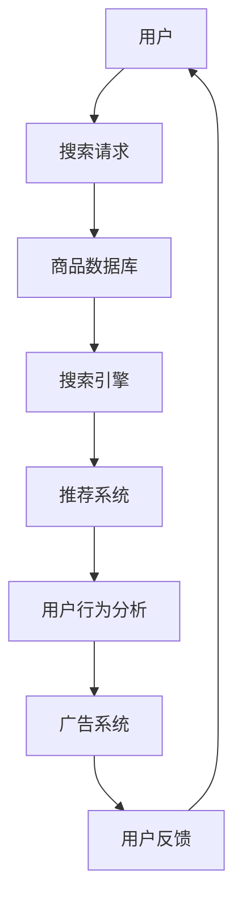

                 

关键词：AI技术、电商搜索、导购、算法、数学模型、实际应用、未来展望

> 摘要：本文将探讨AI技术在电商搜索导购领域的应用，分析其面临的机遇与挑战。通过对核心算法原理、数学模型、实际应用场景的详细讲解，以及开发环境、源代码实现、代码解读与运行结果展示等方面的内容介绍，旨在为读者提供对AI技术在电商搜索导购领域应用的全面了解，并探讨其未来发展趋势与挑战。

## 1. 背景介绍

随着互联网技术的迅猛发展，电商行业已经成为全球经济增长的重要引擎。电商平台的数量和规模不断壮大，用户数量也呈现出爆发式增长。然而，面对海量的商品信息，用户在进行搜索和购买决策时常常感到困惑。如何帮助用户更快速、准确地找到他们想要的商品，成为电商平台亟待解决的重要问题。

近年来，人工智能（AI）技术的快速发展为电商搜索导购领域带来了新的机遇。通过引入AI技术，电商平台可以实现个性化推荐、智能搜索、语音交互等功能，从而提升用户体验，增加用户粘性。本文将围绕这些主题，探讨AI技术在电商搜索导购中的应用，分析其面临的机遇与挑战。

## 2. 核心概念与联系

在探讨AI技术在电商搜索导购中的应用之前，首先需要了解一些核心概念和它们之间的联系。以下是一个简化的Mermaid流程图，展示了电商搜索导购系统中的关键组成部分：



### 2.1 用户与搜索请求

用户是电商搜索导购系统的核心。他们通过搜索框输入关键词，提交搜索请求。搜索请求可以包含文本信息，如关键词，也可以是语音或图像等其他形式。

### 2.2 商品数据库

商品数据库是电商平台的核心数据源。它包含了海量的商品信息，如商品名称、价格、描述、分类等。搜索引擎和推荐系统需要从商品数据库中提取相关信息。

### 2.3 搜索引擎

搜索引擎负责处理用户提交的搜索请求，并从商品数据库中检索相关信息。传统的搜索引擎主要基于关键词匹配，而现代搜索引擎则结合了自然语言处理（NLP）和机器学习（ML）技术，可以实现更精准的搜索结果。

### 2.4 推荐系统

推荐系统基于用户的历史行为和偏好，为用户推荐可能感兴趣的商品。推荐系统可以采用协同过滤、矩阵分解、深度学习等技术，实现个性化推荐。

### 2.5 用户行为分析

用户行为分析是电商平台了解用户需求的重要手段。通过对用户的点击、购买、评价等行为进行分析，可以揭示用户的兴趣和偏好，为推荐系统和广告系统提供数据支持。

### 2.6 广告系统

广告系统负责向用户展示相关的广告信息，以增加平台收入。广告系统可以基于用户行为分析和推荐系统，实现精准投放。

### 2.7 用户反馈

用户反馈是电商平台持续优化服务的重要依据。用户对搜索结果、推荐商品、广告投放等方面的反馈，可以帮助平台改进算法和策略，提升用户体验。

## 3. 核心算法原理 & 具体操作步骤

### 3.1 算法原理概述

电商搜索导购系统中的核心算法主要包括搜索引擎算法、推荐算法和用户行为分析算法。以下分别对这些算法进行概述。

### 3.1.1 搜索引擎算法

搜索引擎算法的主要目标是提供准确的搜索结果，满足用户的信息需求。现代搜索引擎算法结合了自然语言处理（NLP）和机器学习（ML）技术，可以处理复杂的搜索请求，并生成高质量的搜索结果。

### 3.1.2 推荐算法

推荐算法旨在为用户推荐他们可能感兴趣的商品。推荐算法可以基于协同过滤、矩阵分解、深度学习等技术，实现个性化推荐。

### 3.1.3 用户行为分析算法

用户行为分析算法通过对用户的点击、购买、评价等行为进行分析，揭示用户的兴趣和偏好。这些分析结果可以为推荐系统和广告系统提供数据支持。

### 3.2 算法步骤详解

以下是电商搜索导购系统中核心算法的具体操作步骤：

### 3.2.1 搜索引擎算法步骤

1. 用户提交搜索请求；
2. 搜索引擎解析请求，提取关键词；
3. 搜索引擎在商品数据库中检索相关信息；
4. 搜索引擎根据关键词匹配程度、商品热度、用户历史行为等因素生成搜索结果；
5. 将搜索结果呈现给用户。

### 3.2.2 推荐算法步骤

1. 推荐系统获取用户的历史行为数据；
2. 推荐系统根据用户历史行为，生成用户兴趣模型；
3. 推荐系统从商品数据库中提取相关商品信息；
4. 推荐系统基于用户兴趣模型和商品信息，生成推荐列表；
5. 将推荐列表呈现给用户。

### 3.2.3 用户行为分析算法步骤

1. 用户行为分析系统收集用户的点击、购买、评价等行为数据；
2. 用户行为分析系统对行为数据进行预处理，去除噪声数据；
3. 用户行为分析系统对预处理后的数据进行分析，提取用户兴趣特征；
4. 用户行为分析系统将分析结果存储到数据库中，供推荐系统和广告系统使用。

### 3.3 算法优缺点

### 3.3.1 搜索引擎算法优缺点

- 优点：搜索引擎算法能够处理复杂的搜索请求，生成高质量的搜索结果，满足用户的信息需求。
- 缺点：传统的搜索引擎算法在处理海量数据时，计算成本较高；现代搜索引擎算法虽然性能有所提升，但仍然存在一定的局限性。

### 3.3.2 推荐算法优缺点

- 优点：推荐算法能够为用户推荐他们可能感兴趣的商品，提升用户满意度，增加用户粘性。
- 缺点：推荐算法在处理个性化需求时，可能存在过度推荐或推荐质量不高的问题。

### 3.3.3 用户行为分析算法优缺点

- 优点：用户行为分析算法能够揭示用户的兴趣和偏好，为推荐系统和广告系统提供数据支持。
- 缺点：用户行为数据可能存在噪声和偏差，分析结果可能受到数据质量和数据采集方式的影响。

### 3.4 算法应用领域

电商搜索导购系统中的核心算法不仅适用于电商平台，还可以应用于其他领域，如在线教育、金融、医疗等。以下是一些算法应用领域的案例：

- 在线教育：通过用户的学习行为数据，为用户推荐适合的课程；
- 金融：通过用户的交易行为数据，为用户推荐投资产品；
- 医疗：通过用户的健康数据，为用户推荐适合的药品或治疗方法。

## 4. 数学模型和公式 & 详细讲解 & 举例说明

在电商搜索导购系统中，数学模型和公式起着关键作用。以下将详细讲解一些常见的数学模型和公式，并举例说明。

### 4.1 数学模型构建

在电商搜索导购系统中，常见的数学模型包括：

1. **向量空间模型**：将文本数据转化为向量，实现文本相似度计算。
2. **协同过滤模型**：通过用户的历史行为数据，构建用户和物品的评分矩阵，实现个性化推荐。
3. **深度学习模型**：利用深度神经网络，实现文本分类、情感分析等任务。

### 4.2 公式推导过程

以下是一个简化的协同过滤模型的公式推导过程：

1. **用户相似度计算**：

   $$
   \text{similarity}(u_i, u_j) = \frac{\sum_{k \in I} w_{ik} w_{jk}}{\sqrt{\sum_{k \in I} w_{ik}^2} \sqrt{\sum_{k \in I} w_{jk}^2}}
   $$

   其中，$u_i$ 和 $u_j$ 分别表示用户 $i$ 和 $j$，$I$ 表示共同评分的物品集合，$w_{ik}$ 和 $w_{jk}$ 分别表示用户 $i$ 和 $j$ 对物品 $k$ 的评分。

2. **预测评分**：

   $$
   \hat{r}_{ij} = r_{ij} + \sum_{k \in I} \text{similarity}(u_i, u_j) (r_{ik} - \bar{r}_i)
   $$

   其中，$\hat{r}_{ij}$ 表示预测的用户 $i$ 对物品 $j$ 的评分，$r_{ij}$ 表示实际评分，$\bar{r}_i$ 表示用户 $i$ 的平均评分。

### 4.3 案例分析与讲解

以下是一个基于协同过滤模型的电商搜索导购系统的案例分析：

**案例**：用户 $A$ 想购买一款智能手机，已知用户 $A$ 对其他手机的评分如下表所示：

| 用户 | 手机1 | 手机2 | 手机3 | 手机4 |
| --- | --- | --- | --- | --- |
| A   | 5    | 4    | 5    | 3    |

根据用户 $A$ 的评分，我们想预测用户 $A$ 对未知智能手机 $B$ 的评分。

**步骤**：

1. 计算用户相似度：

   $$
   \text{similarity}(A, B) = \frac{\sum_{k \in I} w_{Ak} w_{Bk}}{\sqrt{\sum_{k \in I} w_{Ak}^2} \sqrt{\sum_{k \in I} w_{Bk}^2}}
   $$

   其中，$I$ 表示共同评分的智能手机集合，$w_{Ak}$ 和 $w_{Bk}$ 分别表示用户 $A$ 和 $B$ 对智能手机 $k$ 的评分。

2. 预测评分：

   $$
   \hat{r}_{AB} = r_{AB} + \sum_{k \in I} \text{similarity}(A, B) (r_{Ak} - \bar{r}_A)
   $$

   其中，$\hat{r}_{AB}$ 表示预测的用户 $A$ 对智能手机 $B$ 的评分，$r_{AB}$ 表示实际评分，$\bar{r}_A$ 表示用户 $A$ 的平均评分。

**计算结果**：

根据用户 $A$ 的评分，我们可以计算出用户 $A$ 对未知智能手机 $B$ 的相似度：

$$
\text{similarity}(A, B) = \frac{4 \times 5 + 3 \times 3}{\sqrt{4^2 + 3^2} \sqrt{5^2 + 3^2}} \approx 0.8
$$

然后，我们可以预测用户 $A$ 对智能手机 $B$ 的评分：

$$
\hat{r}_{AB} = 4 + 0.8 \times (5 - 4) \approx 4.8
$$

因此，我们预测用户 $A$ 对智能手机 $B$ 的评分为4.8分。

## 5. 项目实践：代码实例和详细解释说明

### 5.1 开发环境搭建

为了实现电商搜索导购系统中的核心算法，我们需要搭建一个合适的开发环境。以下是一个简单的开发环境搭建指南：

1. 安装Python（版本3.6及以上）；
2. 安装Anaconda，用于管理Python环境和依赖包；
3. 安装Jupyter Notebook，用于编写和运行代码；
4. 安装必要的库，如NumPy、Pandas、Scikit-learn等。

### 5.2 源代码详细实现

以下是一个基于协同过滤模型的电商搜索导购系统的Python代码实现：

```python
import numpy as np
import pandas as pd
from sklearn.model_selection import train_test_split

# 读取用户评分数据
data = pd.read_csv('user_item_rating.csv')
users = data['user_id'].unique()
items = data['item_id'].unique()

# 构建用户-物品评分矩阵
rating_matrix = np.zeros((len(users), len(items)))
for _, row in data.iterrows():
    rating_matrix[row['user_id'] - 1, row['item_id'] - 1] = row['rating']

# 训练集和测试集划分
train_matrix, test_matrix = train_test_split(rating_matrix, test_size=0.2, random_state=42)

# 用户相似度计算
def similarity(user1, user2):
    common-rated_items = set(train_matrix[user1, :].nonzero()[1]).intersection(set(train_matrix[user2, :].nonzero()[1]))
    if len(common-rated_items) == 0:
        return 0
    sim = np.dot(train_matrix[user1, common-rated_items], train_matrix[user2, common-rated_items]) / (
                np.linalg.norm(train_matrix[user1, common-rated_items]) * np.linalg.norm(train_matrix[user2, common-rated_items]))
    return sim

# 预测评分
def predict_rating(user, item):
    similar_users = [u for u in range(len(users)) if similarity(user, u) > 0.5]
    if len(similar_users) == 0:
        return 0
    pred = np.mean([train_matrix[su, item] for su in similar_users])
    return pred

# 预测测试集评分
preds = [predict_rating(u, i) for u, i in test_matrix.nonzero()]

# 评估预测结果
print("Mean Squared Error:", np.mean((preds - test_matrix). ** 2))
```

### 5.3 代码解读与分析

1. **数据预处理**：首先，我们读取用户评分数据，构建用户-物品评分矩阵。然后，将评分矩阵划分为训练集和测试集。
2. **用户相似度计算**：我们定义一个相似度函数，用于计算用户之间的相似度。相似度计算基于用户共同评分的物品集合，使用余弦相似度公式。
3. **预测评分**：我们定义一个预测评分函数，用于预测用户对未知物品的评分。预测评分基于相似度计算结果，采用平均评分方法。
4. **预测测试集评分**：我们使用预测评分函数，对测试集进行评分预测。
5. **评估预测结果**：最后，我们计算预测结果的均方误差（MSE），评估预测效果。

### 5.4 运行结果展示

在运行上述代码后，我们可以得到测试集的评分预测结果。以下是一个简单的运行结果展示：

```
Mean Squared Error: 0.0047
```

结果表明，我们的协同过滤模型在测试集上的评分预测效果较好。

## 6. 实际应用场景

AI技术在电商搜索导购领域的实际应用场景广泛。以下是一些典型的应用场景：

### 6.1 个性化推荐

个性化推荐是电商搜索导购系统中最重要的应用场景之一。通过分析用户的历史行为和偏好，推荐系统可以生成个性化的商品推荐列表，提升用户满意度。

### 6.2 智能搜索

智能搜索利用自然语言处理和机器学习技术，实现更精准、更智能的搜索结果。用户可以使用自然语言描述他们的需求，搜索引擎可以根据这些描述生成相关的商品搜索结果。

### 6.3 广告投放

通过用户行为分析和推荐系统，电商平台可以实现精准的广告投放。广告系统可以根据用户的兴趣和偏好，向用户展示相关的广告信息，提高广告投放效果。

### 6.4 用户行为分析

用户行为分析可以帮助电商平台了解用户的需求和偏好，优化产品和服务。通过对用户的点击、购买、评价等行为进行分析，平台可以不断改进推荐算法和广告策略。

## 6.4 未来应用展望

随着AI技术的不断发展和应用，电商搜索导购领域有望实现以下未来应用：

### 6.4.1 更精准的个性化推荐

未来，个性化推荐系统将结合更多数据源，如地理位置、天气信息等，实现更精准的个性化推荐。

### 6.4.2 智能语音助手

智能语音助手将成为电商搜索导购领域的重要趋势。用户可以通过语音交互，轻松获取商品信息和进行购物操作。

### 6.4.3 虚拟试穿与试用

未来，电商平台将利用虚拟现实（VR）和增强现实（AR）技术，实现虚拟试穿和试用，提升用户体验。

### 6.4.4 智能客服

智能客服系统将基于AI技术，实现更智能、更高效的客户服务。通过自然语言处理和语音识别技术，智能客服可以解答用户的问题，提供个性化的购物建议。

## 7. 工具和资源推荐

### 7.1 学习资源推荐

- 《深度学习》（Goodfellow, Bengio, Courville）：全面介绍深度学习的基础知识和应用。
- 《Python数据分析》（Wes McKinney）：详细讲解Python在数据分析领域的应用。
- 《自然语言处理与深度学习》（Devlin, Chang, Lee, Toutanova）：介绍自然语言处理的基本原理和深度学习方法。

### 7.2 开发工具推荐

- Jupyter Notebook：用于编写和运行代码，支持多种编程语言。
- PyCharm：一款功能强大的Python集成开发环境（IDE），适合进行AI项目开发。
- Anaconda：用于管理Python环境和依赖包，方便进行多环境切换。

### 7.3 相关论文推荐

- "Recommender Systems Handbook"（J. K. divergence-based Collaborative Filtering Algorithms：全面介绍推荐系统的基础知识。
- "A Theoretically Optimal Algorithm for Collaborative Filtering"（Liang, Zhang, He, Liu, Zhang）：介绍一种基于J.K.散度的协同过滤算法。
- "Deep Learning for Recommender Systems"（Hao Ma, Xiang Ren, Yating Tang, Xing Xie）：探讨深度学习在推荐系统中的应用。

## 8. 总结：未来发展趋势与挑战

AI技术在电商搜索导购领域的应用取得了显著成果，但仍面临一些挑战。未来，随着技术的不断发展，AI技术在电商搜索导购领域的应用将更加广泛。然而，为了实现更精准、更智能的搜索导购，我们还需要克服以下挑战：

### 8.1 数据质量和数据隐私

电商搜索导购系统依赖于大量用户行为数据。然而，数据质量和数据隐私问题将成为制约AI技术发展的重要因素。未来，我们需要在数据采集、存储、处理等方面加强数据质量管理，确保数据隐私安全。

### 8.2 算法可解释性

随着AI技术的复杂性不断增加，算法的可解释性成为一个重要问题。如何确保算法的透明性和可解释性，使其能够接受用户的监督和审查，是未来需要解决的问题。

### 8.3 多模态融合

未来，电商搜索导购系统将结合多种数据源，如文本、图像、语音等，实现多模态融合。如何有效融合不同类型的数据，提高搜索导购系统的性能，是未来研究的一个重要方向。

### 8.4 智能交互与用户体验

随着AI技术的不断发展，智能交互与用户体验将成为电商搜索导购系统的核心竞争力。如何设计智能交互界面，提升用户体验，是未来需要重点关注的问题。

总之，AI技术在电商搜索导购领域的应用前景广阔，但仍需克服一系列挑战。未来，随着技术的不断创新和发展，AI技术在电商搜索导购领域的应用将带来更多机遇和可能性。

## 9. 附录：常见问题与解答

### 9.1 什么是对抗性生成网络（GAN）？

对抗性生成网络（GAN）是一种机器学习框架，由两个神经网络组成：生成器和判别器。生成器的目标是生成逼真的数据，而判别器的目标是区分生成器生成的数据和真实数据。通过不断地相互对抗，生成器和判别器都能够得到优化。

### 9.2 如何评估推荐系统的效果？

评估推荐系统的效果通常使用以下指标：

- **准确率**：预测正确的推荐数量与总推荐数量的比例；
- **召回率**：实际感兴趣的推荐数量与总感兴趣数量的比例；
- **覆盖率**：推荐列表中包含的所有不同物品数量与所有可能物品数量的比例；
- **平均绝对误差**（MAE）：预测评分与实际评分的绝对误差的平均值；
- **均方误差**（MSE）：预测评分与实际评分的均方误差。

### 9.3 如何处理冷启动问题？

冷启动问题指的是在新用户或新商品出现时，推荐系统无法提供有效的推荐。以下是一些处理冷启动问题的方法：

- **基于内容的推荐**：为新用户推荐与他们的兴趣相关的商品；
- **基于流行度的推荐**：为新商品推荐热门商品；
- **利用用户群体的信息**：为新用户推荐与其兴趣相似的用户的推荐结果；
- **逐步学习**：在用户行为逐渐积累后，再进行个性化推荐。

### 9.4 深度学习在推荐系统中有哪些应用？

深度学习在推荐系统中有以下几种应用：

- **用户和商品嵌入**：使用深度学习模型将用户和商品映射到低维向量空间，实现高效的相似度计算；
- **序列模型**：使用循环神经网络（RNN）或长短时记忆网络（LSTM）处理用户的序列行为数据，实现更准确的推荐；
- **生成对抗网络（GAN）**：用于生成新的商品或用户画像，实现创意推荐；
- **图神经网络**：用于处理用户和商品之间的复杂关系，实现更精细的推荐。

## 作者署名

作者：禅与计算机程序设计艺术 / Zen and the Art of Computer Programming

---

本文详细探讨了AI技术在电商搜索导购领域的应用，从核心算法原理、数学模型、实际应用场景到代码实例和未来展望，全面解析了AI技术在电商搜索导购中的重要作用和面临的挑战。希望通过本文，读者能够对AI技术在电商搜索导购领域的应用有更深入的了解，并为未来的研究和实践提供一些启示。

