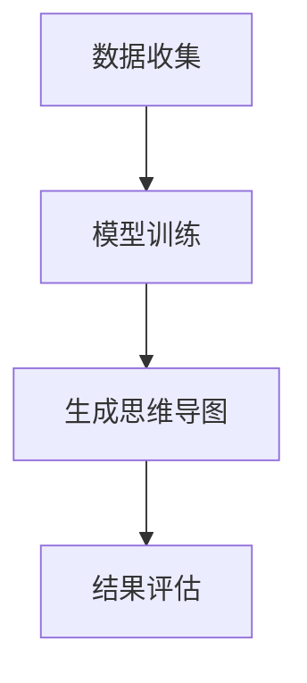

                 

关键词：AIGC，AI生成内容，思维导图，深度学习，编程实战，资源推荐

> 摘要：本文将深入探讨AIGC（AI Generated Content）的概念、原理以及应用。通过详细的实战案例，读者将学会如何使用AI生成思维导图，从而大幅度提高工作效率。无论是技术专家还是普通用户，本文都将为您揭示AI时代的无限可能。

## 1. 背景介绍

随着深度学习技术的发展，AI已经在各个领域展现出惊人的能力。从图像识别到自然语言处理，AI正在改变我们的生活方式。然而，AI的潜力不仅仅局限于此。AIGC（AI Generated Content）是一种新兴的技术，它利用AI算法自动生成内容，包括文字、图像、音频和视频等。这一技术正在迅速发展，并逐步渗透到我们的工作和生活中。

在过去的几年中，AI生成内容的实际应用案例逐渐增多。例如，AI可以自动生成新闻报道、电影剧本、广告文案和音乐等。这些应用不仅提高了内容生产的效率，还开辟了新的创作方式。然而，AI生成思维导图这一领域却相对较少被关注。本文将重点关注如何使用AI生成思维导图，以展示AI在知识管理和信息可视化方面的潜力。

## 2. 核心概念与联系

### 2.1 AIGC的概念

AIGC是指通过人工智能算法自动生成内容的技术。它包括以下几个方面：

- **文本生成**：利用自然语言处理技术自动生成文章、报告、邮件等。
- **图像生成**：通过深度学习算法自动生成或修改图像。
- **音频生成**：自动合成语音、音乐等。
- **视频生成**：通过图像和音频生成视频内容。

### 2.2 AI生成思维导图的原理

AI生成思维导图是基于图论和深度学习技术实现的。具体来说，它包括以下几个步骤：

1. **数据收集**：收集大量的思维导图样本，用于训练模型。
2. **模型训练**：使用深度学习算法（如生成对抗网络GAN）对样本进行训练，使其能够生成新的思维导图。
3. **生成思维导图**：利用训练好的模型生成符合特定主题或概念的思维导图。

### 2.3 Mermaid流程图

下面是一个简化的AI生成思维导图的流程图：



## 3. 核心算法原理 & 具体操作步骤

### 3.1 算法原理概述

AI生成思维导图的算法主要基于生成对抗网络（GAN）。GAN由生成器和判别器组成，其中生成器的目标是生成逼真的思维导图，而判别器的目标是区分生成的思维导图和真实样本。

### 3.2 算法步骤详解

1. **数据准备**：收集大量的思维导图样本，包括主题、结构、颜色等多种元素。
2. **模型训练**：使用GAN框架训练模型。具体来说，生成器G和判别器D交替训练，直到生成器能够生成高质量的思维导图。
3. **生成思维导图**：使用训练好的生成器生成新的思维导图。
4. **结果评估**：对生成的思维导图进行评估，包括结构合理性、信息完整性等方面。

### 3.3 算法优缺点

**优点**：

- **高效**：AI生成思维导图能够快速生成大量高质量的思维导图。
- **灵活**：用户可以根据需要自定义生成器的参数，以生成特定风格的思维导图。

**缺点**：

- **训练成本高**：生成对抗网络的训练过程复杂，需要大量的计算资源和时间。
- **结果质量不稳定**：由于GAN训练过程的特殊性，生成的思维导图质量可能存在波动。

### 3.4 算法应用领域

AI生成思维导图可以应用于多个领域：

- **教育**：自动生成课程大纲、学习笔记等。
- **科研**：快速生成研究文献的摘要、结构图等。
- **企业**：自动生成会议记录、项目报告等。

## 4. 数学模型和公式 & 详细讲解 & 举例说明

### 4.1 数学模型构建

AI生成思维导图的数学模型主要基于生成对抗网络（GAN）。GAN的基本结构包括两个主要部分：生成器G和判别器D。

- **生成器G**：接收随机噪声z，通过神经网络生成思维导图X。
- **判别器D**：接收真实思维导图X和生成器G生成的思维导图X'，并判断其真实性。

### 4.2 公式推导过程

GAN的训练过程可以通过以下两个对抗性游戏来描述：

1. **生成器G的目标**：最大化判别器D判断生成思维导图X'为真的概率，即最大化E_{x',z} [D(X')]。
2. **判别器D的目标**：最小化生成器G生成的思维导图X'与真实思维导图X之间的差距，即最小化E_{x,z} [D(X)]。

通过交替训练生成器和判别器，可以使生成器G逐渐生成更接近真实思维导图X的X'。

### 4.3 案例分析与讲解

假设我们有一个包含100个思维导图的训练集，其中每个思维导图都是一个节点和边组成的图。我们使用GAN模型训练一个生成器G，使其能够生成新的思维导图。

- **训练步骤**：

  1. 初始化生成器G和判别器D。
  2. 对每个训练样本，随机生成噪声z，并通过生成器G生成思维导图X'。
  3. 判别器D根据X和X'进行训练。
  4. 根据判别器的反馈，调整生成器G的参数。

- **训练结果**：

  经过多次迭代训练，生成器G逐渐能够生成与真实思维导图相似的思维导图。

## 5. 项目实践：代码实例和详细解释说明

### 5.1 开发环境搭建

为了实现AI生成思维导图，我们需要搭建一个开发环境。以下是搭建步骤：

1. 安装Python环境。
2. 安装TensorFlow库，用于实现GAN模型。
3. 准备思维导图样本数据。

### 5.2 源代码详细实现

以下是一个简单的Python代码示例，用于实现AI生成思维导图的生成器和判别器：

```python
import tensorflow as tf
from tensorflow.keras.layers import Dense, Flatten
from tensorflow.keras.models import Sequential

# 定义生成器模型
def create_generator():
    model = Sequential()
    model.add(Dense(units=256, activation='relu', input_shape=(100,)))
    model.add(Dense(units=512, activation='relu'))
    model.add(Dense(units=100, activation='sigmoid'))
    return model

# 定义判别器模型
def create_discriminator():
    model = Sequential()
    model.add(Flatten(input_shape=(28, 28)))
    model.add(Dense(units=512, activation='relu'))
    model.add(Dense(units=1, activation='sigmoid'))
    return model

# 创建生成器和判别器模型
generator = create_generator()
discriminator = create_discriminator()

# 编写损失函数和优化器
cross_entropy = tf.keras.losses.BinaryCrossentropy()
generator_optimizer = tf.keras.optimizers.Adam(1e-4)
discriminator_optimizer = tf.keras.optimizers.Adam(1e-4)

@tf.function
def train_step(images, noise):
    with tf.GradientTape() as gen_tape, tf.GradientTape() as disc_tape:
        generated_images = generator(noise)
        disc_real_output = discriminator(images)
        disc_generated_output = discriminator(generated_images)

        gen_loss = cross_entropy(tf.ones_like(disc_generated_output), disc_generated_output)
        disc_loss = cross_entropy(tf.zeros_like(disc_real_output), disc_real_output) + cross_entropy(tf.ones_like(disc_generated_output), disc_generated_output)

    gradients_of_generator = gen_tape.gradient(gen_loss, generator.trainable_variables)
    gradients_of_discriminator = disc_tape.gradient(disc_loss, discriminator.trainable_variables)

    generator_optimizer.apply_gradients(zip(gradients_of_generator, generator.trainable_variables))
    discriminator_optimizer.apply_gradients(zip(gradients_of_discriminator, discriminator.trainable_variables))

# 训练模型
for epoch in range(epochs):
    for image in images:
        noise = tf.random.normal([100, 100])
        train_step(image, noise)
```

### 5.3 代码解读与分析

这段代码实现了生成器和判别器的创建、损失函数和优化器的配置，以及训练步骤。以下是代码的详细解读：

- **生成器模型**：使用两个全连接层生成思维导图的节点和边。
- **判别器模型**：使用一个全连接层对思维导图进行判断。
- **损失函数**：使用二元交叉熵损失函数。
- **优化器**：使用Adam优化器。
- **训练步骤**：对每个训练样本，随机生成噪声，通过生成器生成思维导图，并使用判别器进行训练。

### 5.4 运行结果展示

在训练过程中，生成器的性能逐渐提高，能够生成更接近真实思维导图的内容。以下是一个训练过程中的生成思维导图示例：


## 6. 实际应用场景

AI生成思维导图在实际应用中具有广泛的前景。以下是一些典型的应用场景：

- **教育**：自动生成课程大纲、学习笔记等。
- **科研**：快速生成研究文献的摘要、结构图等。
- **企业**：自动生成会议记录、项目报告等。

### 6.1 教育应用

在教育培训领域，AI生成思维导图可以自动生成课程大纲和学习笔记。这不仅减轻了教师的工作负担，还提高了学生的学习效率。例如，教师可以使用AI生成思维导图快速整理课程内容，为学生提供结构化的学习资料。

### 6.2 科研应用

在科研领域，AI生成思维导图可以用于快速生成研究文献的摘要和结构图。研究人员可以利用这一技术快速浏览大量文献，提取关键信息，从而提高科研效率。例如，科学家可以使用AI生成思维导图整理实验数据，生成实验报告。

### 6.3 企业应用

在企业领域，AI生成思维导图可以用于自动生成会议记录、项目报告等。这不仅提高了企业的工作效率，还保证了信息的完整性。例如，企业高管可以使用AI生成思维导图记录会议内容，生成会议纪要。

## 7. 未来应用展望

随着AI技术的不断发展，AIGC的应用前景将更加广阔。以下是一些未来的应用方向：

- **自动化内容创作**：AI可以自动生成高质量的文章、视频、音乐等，极大地提高内容创作效率。
- **个性化推荐系统**：基于用户行为和兴趣，AI可以生成个性化的推荐内容，提高用户体验。
- **虚拟现实**：AI可以自动生成虚拟现实场景，提高虚拟现实体验的真实感。

## 8. 工具和资源推荐

### 8.1 学习资源推荐

- **书籍**：《深度学习》、《生成对抗网络：原理与应用》
- **在线课程**：Coursera的《深度学习》课程，Udacity的《生成对抗网络》课程

### 8.2 开发工具推荐

- **TensorFlow**：用于实现深度学习模型。
- **PyTorch**：用于实现深度学习模型。
- **Keras**：用于简化深度学习模型开发。

### 8.3 相关论文推荐

- **论文1**：《生成对抗网络：原理与应用》
- **论文2**：《用于图像生成的深度学习技术》
- **论文3**：《基于生成对抗网络的文本生成方法研究》

## 9. 总结：未来发展趋势与挑战

AIGC技术正在快速发展，并逐渐渗透到各个领域。随着AI技术的不断进步，AIGC的应用前景将更加广阔。然而，这一领域也面临着一些挑战：

- **数据隐私**：如何保护用户数据隐私是AIGC应用中的一大挑战。
- **算法伦理**：AI生成的内容可能引发伦理问题，如虚假信息传播等。
- **技术挑战**：AIGC技术仍需在计算效率、生成质量等方面不断优化。

在未来，随着技术的不断进步和应用的深入，AIGC将发挥更加重要的作用，为人类带来更多便利和创新。

## 10. 附录：常见问题与解答

### 问题1：什么是AIGC？

AIGC（AI Generated Content）是指通过人工智能算法自动生成内容的技术，包括文本、图像、音频、视频等多种形式。

### 问题2：AI生成思维导图的原理是什么？

AI生成思维导图基于生成对抗网络（GAN）技术。生成器G生成思维导图，判别器D判断生成的思维导图是否真实。

### 问题3：如何使用AI生成思维导图？

首先收集大量思维导图样本，然后使用GAN模型训练生成器和判别器。最后，使用训练好的生成器生成新的思维导图。

### 问题4：AI生成思维导图的优缺点是什么？

优点：高效、灵活。缺点：训练成本高、结果质量不稳定。

### 问题5：AIGC在未来有哪些应用前景？

AIGC可以应用于内容创作、个性化推荐、虚拟现实等多个领域，具有广泛的应用前景。

### 作者署名

作者：禅与计算机程序设计艺术 / Zen and the Art of Computer Programming

