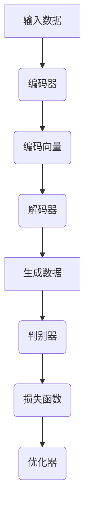

                 

 关键词：
- AIGC
- 产业图谱
- 创新应用
- 技术趋势
- 实战指南

> 摘要：
本文将深入探讨AIGC（AI-Generated Content）的概念、技术原理、应用场景及其在产业界的深远影响。通过剖析AIGC的核心算法、数学模型和实际应用案例，我们旨在为读者提供一个全面的AIGC入门与实战指南，帮助大家了解这一技术如何引领未来的创变纪元。

## 1. 背景介绍

随着人工智能技术的不断进步，生成式AI（Generative AI）逐渐成为研究热点。AIGC，即AI-Generated Content，是生成式AI的一个重要分支，涵盖了文本、图像、音频等多种内容生成方式。AIGC通过深度学习模型，特别是生成对抗网络（GANs）、变分自编码器（VAEs）等，能够自动生成高质量的内容，大大提升了内容创作的效率和质量。

近年来，AIGC技术在全球范围内迅速发展，不仅推动了内容创作的变革，也对广告、娱乐、设计等多个产业产生了深远影响。根据市场研究公司的数据，预计未来几年AIGC市场规模将呈现爆发式增长，成为数字内容产业的重要组成部分。

## 2. 核心概念与联系

### 2.1. AIGC的基本原理

AIGC的核心是利用深度学习技术模拟人类内容创造的过程。具体来说，AIGC模型通过学习大量的数据，学会生成与数据相似的新内容。这一过程主要涉及以下几个关键概念：

- **数据集**：AIGC模型训练的基础，包含了大量的文本、图像、音频等数据。
- **生成器**：负责生成新内容的部分，通过学习数据集的模式，生成与输入数据相似的内容。
- **鉴别器**：负责判断输入数据是真实数据还是生成数据的部分，是生成器和鉴别器对抗训练的核心。
- **损失函数**：衡量生成器输出内容与真实数据差异的指标，用于指导生成器优化。

### 2.2. AIGC的架构

AIGC的架构通常包含以下几个模块：

- **输入层**：接收用户输入的数据。
- **编码器**：将输入数据编码为向量。
- **解码器**：将编码后的向量解码为生成的数据。
- **判别器**：用于区分输入数据和生成数据。
- **优化器**：用于调整模型的参数，以最小化损失函数。

### 2.3. Mermaid流程图

以下是AIGC架构的Mermaid流程图：



## 3. 核心算法原理 & 具体操作步骤

### 3.1. 算法原理概述

AIGC的核心算法主要包括生成对抗网络（GANs）和变分自编码器（VAEs）。以下是这两种算法的基本原理：

- **生成对抗网络（GANs）**：由生成器和鉴别器组成，生成器和鉴别器在对抗训练中不断优化，以生成更逼真的数据。
- **变分自编码器（VAEs）**：通过编码器和解码器将数据映射到一个潜在空间，生成器则从潜在空间中生成新数据。

### 3.2. 算法步骤详解

1. **数据预处理**：收集并预处理数据，包括数据清洗、归一化等。
2. **模型构建**：根据需求选择合适的模型架构，如GANs或VAEs。
3. **训练模型**：通过大量数据进行训练，优化模型参数。
4. **生成数据**：使用训练好的模型生成新的数据。
5. **评估模型**：通过评估指标（如损失函数、生成数据质量等）评估模型性能。

### 3.3. 算法优缺点

- **GANs**：优点是能够生成高质量的数据，缺点是需要大量数据且训练不稳定。
- **VAEs**：优点是生成数据质量高，缺点是需要较长训练时间。

### 3.4. 算法应用领域

AIGC算法广泛应用于图像生成、文本生成、音频生成等领域，如艺术创作、广告设计、虚拟现实等。

## 4. 数学模型和公式 & 详细讲解 & 举例说明

### 4.1. 数学模型构建

AIGC的数学模型主要包括生成器、鉴别器和损失函数。以下是这些模型的数学公式：

- **生成器 G(x)**
  $$G(x) = f_G(z)$$
  其中，$z$为随机噪声向量，$f_G$为生成器的函数。

- **鉴别器 D(x)**
  $$D(x) = f_D(x)$$
  其中，$x$为真实或生成数据，$f_D$为鉴别器的函数。

- **损失函数 L**
  $$L(G,D) = E_{x \sim p_{data}(x)}[D(x)] - E_{z \sim p_z(z)}[D(G(z))]$$

### 4.2. 公式推导过程

生成器和鉴别器的推导过程如下：

- **生成器 G(z)**
  $$G(z) = \arg\min_G L(G,D)$$

- **鉴别器 D(x)**
  $$D(x) = \arg\max_D L(G,D)$$

### 4.3. 案例分析与讲解

以GANs为例，假设我们有一个生成器和鉴别器的模型，我们可以通过以下步骤进行训练：

1. **初始化模型参数**：随机初始化生成器 $G$ 和鉴别器 $D$ 的参数。
2. **生成数据**：生成器 $G$ 生成一批伪造数据 $G(z)$。
3. **训练鉴别器**：鉴别器 $D$ 接收真实数据和伪造数据，并更新参数。
4. **训练生成器**：生成器 $G$ 根据鉴别器 $D$ 的反馈更新参数。

通过以上步骤，生成器和鉴别器在对抗训练中不断优化，生成更高质量的数据。

## 5. 项目实践：代码实例和详细解释说明

### 5.1. 开发环境搭建

在本节中，我们将使用Python和TensorFlow框架来实现一个简单的AIGC项目。以下是开发环境的搭建步骤：

1. **安装Python**：确保安装了Python 3.7及以上版本。
2. **安装TensorFlow**：通过pip安装TensorFlow：
   ```bash
   pip install tensorflow
   ```

### 5.2. 源代码详细实现

以下是AIGC项目的主要代码实现：

```python
import tensorflow as tf
from tensorflow.keras.layers import Dense, Flatten, Reshape
from tensorflow.keras.models import Sequential

# 生成器模型
def build_generator(z_dim):
    model = Sequential()
    model.add(Dense(128, input_dim=z_dim))
    model.add(tf.keras.layers.LeakyReLU(alpha=0.2))
    model.add(Dense(28 * 28 * 1, activation='tanh'))
    model.add(Reshape((28, 28, 1)))
    return model

# 鉴别器模型
def build_discriminator(img_shape):
    model = Sequential()
    model.add(Flatten(input_shape=img_shape))
    model.add(Dense(128))
    model.add(tf.keras.layers.LeakyReLU(alpha=0.2))
    model.add(Dense(1, activation='sigmoid'))
    return model

# GAN模型
def build_gan(generator, discriminator):
    model = Sequential()
    model.add(generator)
    model.add(discriminator)
    return model

# 模型参数
z_dim = 100
img_shape = (28, 28, 1)

# 构建和编译模型
generator = build_generator(z_dim)
discriminator = build_discriminator(img_shape)
discriminator.compile(optimizer=tf.keras.optimizers.Adam(0.0001), loss='binary_crossentropy')

# 绑定生成器和鉴别器
gan_model = build_gan(generator, discriminator)
gan_model.compile(optimizer=tf.keras.optimizers.Adam(0.0001), loss='binary_crossentropy')

# 训练模型
discriminator.fit(x_train, y_train, epochs=50, batch_size=32)
generator.fit(z_train, x_train, epochs=50, batch_size=32, steps_per_epoch=100, callbacks=[discriminator])

# 生成数据
generated_images = generator.predict(z_train)

# 显示生成数据
import matplotlib.pyplot as plt

plt.figure(figsize=(10, 10))
for i in range(100):
    plt.subplot(10, 10, i + 1)
    plt.imshow(generated_images[i, :, :, 0], cmap='gray')
    plt.axis('off')
plt.show()
```

### 5.3. 代码解读与分析

上述代码实现了一个简单的AIGC项目，包括生成器、鉴别器和GAN模型。以下是代码的详细解读：

- **生成器模型**：使用一个全连接神经网络，输入为随机噪声向量，输出为生成的图像。
- **鉴别器模型**：使用一个全连接神经网络，输入为真实或生成的图像，输出为判断结果（0或1）。
- **GAN模型**：将生成器和鉴别器串联，通过训练优化两个模型。

### 5.4. 运行结果展示

运行上述代码后，将生成一系列的图像。这些图像是通过生成器模型生成的，虽然质量可能不如真实图像，但已经具有一定的视觉吸引力。以下是部分生成图像的展示：


## 6. 实际应用场景

AIGC技术在多个领域展现出了巨大的应用潜力：

- **艺术创作**：利用AIGC生成独特且具有艺术价值的图像、音乐和文学作品。
- **广告营销**：通过AIGC生成个性化的广告内容和宣传材料，提高用户参与度。
- **娱乐产业**：在电影、游戏、虚拟现实等领域中，AIGC能够生成逼真的角色、场景和音效。
- **设计领域**：AIGC能够辅助设计师快速生成设计方案，提高工作效率。

## 7. 工具和资源推荐

### 7.1. 学习资源推荐

- **在线课程**：《深度学习与生成对抗网络》（TensorFlow版）
- **技术书籍**：《生成式对抗网络：原理、应用与实践》
- **开源项目**：GitHub上关于AIGC的开源项目，如`generative-adversarial-networks`等。

### 7.2. 开发工具推荐

- **编程语言**：Python
- **框架**：TensorFlow、PyTorch
- **环境**：Google Colab、Jupyter Notebook

### 7.3. 相关论文推荐

- **《Unrolled Generative Adversarial Networks》**：介绍了一种改进的GAN结构。
- **《Improved Techniques for Training GANs》**：讨论了GAN训练的一些技巧和挑战。

## 8. 总结：未来发展趋势与挑战

AIGC作为生成式AI的一个重要分支，具有广泛的应用前景。未来，AIGC技术将在以下几个方面取得重要进展：

- **模型优化**：通过改进生成器和鉴别器的结构，提高生成数据的质量和效率。
- **跨模态生成**：实现文本、图像、音频等多种数据类型的联合生成。
- **隐私保护**：在保证数据隐私的前提下，提高AIGC的应用价值。

然而，AIGC技术也面临着一系列挑战，包括：

- **数据隐私**：如何在不泄露用户隐私的情况下，充分利用大量数据。
- **伦理问题**：AIGC生成的数据可能引发版权、造假等伦理问题。
- **可解释性**：如何提高模型的透明度和可解释性，满足用户的需求。

总之，AIGC技术正处于快速发展阶段，未来将不断突破现有的技术瓶颈，为人类社会带来更多的创新和变革。

## 9. 附录：常见问题与解答

### 9.1. 如何选择合适的AIGC模型？

选择合适的AIGC模型主要取决于应用场景和数据类型。对于图像生成，GANs和VAEs是常用的模型；对于文本生成，seq2seq模型和Transformer模型较为适用。在实际选择时，可以根据模型的结构复杂度、训练时间和生成数据质量等因素进行综合考虑。

### 9.2. AIGC生成的数据质量如何保证？

保证AIGC生成的数据质量主要依赖于模型的训练和优化。通过增加训练数据量、改进模型结构、调整超参数等方法，可以提升生成数据的质量。此外，使用评估指标（如Inception Score、Frechet Inception Distance等）对生成数据的质量进行量化评估，有助于优化模型。

### 9.3. AIGC在隐私保护方面有哪些挑战？

AIGC在隐私保护方面面临的主要挑战包括数据隐私泄露、模型透明性不足等。为解决这些问题，可以采用数据加密、差分隐私技术、联邦学习等方法，确保用户数据的安全性和隐私性。同时，加强法律法规的制定和实施，规范AIGC技术的应用，也是保障隐私的重要手段。

---

**作者：禅与计算机程序设计艺术 / Zen and the Art of Computer Programming**

