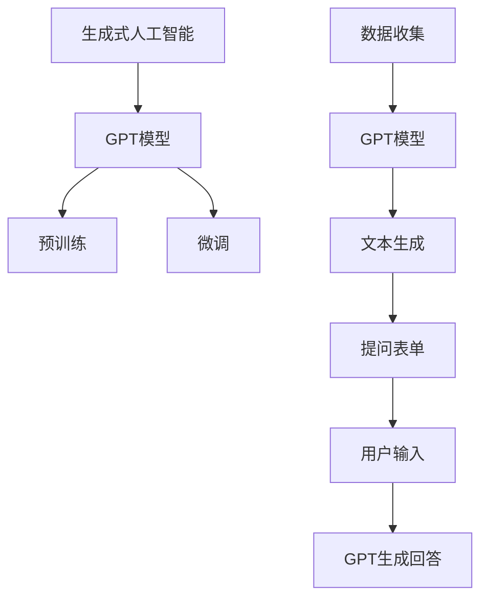

                 

关键词：AIGC，ChatGPT，提问表单，人工智能，生成式人工智能，机器学习，自然语言处理，编程实践，技术博客，专业指导

> 摘要：本文将带领读者深入了解生成式人工智能（AIGC）中的ChatGPT提问表单技术。通过详细的背景介绍、核心概念与联系讲解、算法原理剖析、数学模型解析、项目实践展示以及未来应用展望，本文旨在为广大开发者提供一本从入门到实战的指南，帮助读者全面掌握ChatGPT提问表单的实用技能。

## 1. 背景介绍

生成式人工智能（AIGC，Artificial Intelligence Generated Content）作为人工智能领域的重要分支，近年来发展迅猛。AIGC的核心在于通过机器学习算法生成高质量的内容，包括但不限于文本、图像、音频等。ChatGPT是OpenAI开发的一款基于GPT（Generative Pre-trained Transformer）模型的大型语言模型，以其强大的文本生成能力在人工智能领域引起了广泛关注。

提问表单作为用户与人工智能系统交互的重要方式，能够有效地收集用户的输入信息，并生成针对性的回答。在AIGC的应用中，ChatGPT提问表单不仅可以提供高质量的问答服务，还能通过交互式对话进行内容生成和定制化服务。因此，了解并掌握ChatGPT提问表单技术对于开发者和研究人员来说具有重要意义。

本文将围绕ChatGPT提问表单的原理和应用，提供从入门到实战的全面指导，帮助读者深入了解这一前沿技术，并在实际项目中加以运用。

## 2. 核心概念与联系

### 2.1 生成式人工智能（AIGC）

生成式人工智能（AIGC）是指通过机器学习算法生成内容的人工智能系统。AIGC的核心在于其能够从大量的数据中学习，并生成与输入数据相关的新内容。这一技术广泛应用于文本生成、图像生成、音乐生成等领域。

生成式人工智能的流程通常包括数据收集、模型训练和内容生成三个主要步骤。数据收集阶段，需要从各种来源获取大量相关数据；模型训练阶段，使用这些数据进行模型训练，以优化模型生成内容的质量；内容生成阶段，模型根据输入的提示或指令生成新的内容。

### 2.2  ChatGPT

ChatGPT是OpenAI开发的一款基于GPT（Generative Pre-trained Transformer）模型的大型语言模型。GPT模型是自然语言处理领域的一种重要模型，通过在大量文本数据上进行预训练，模型能够学习到语言的规律和模式，从而能够生成连贯、自然的文本。

ChatGPT的核心功能是文本生成，通过接收用户输入的提问或指令，模型能够生成相应的回答或内容。ChatGPT具有强大的语义理解能力，能够处理复杂的对话场景，并在对话中进行知识推理和逻辑推导。

### 2.3 提问表单

提问表单是一种用户与人工智能系统进行交互的方式，通过一系列有序的问题引导用户输入相关信息。提问表单的核心在于能够有效地收集用户的输入信息，并将其转化为有用的数据，用于模型的训练和问答。

提问表单的设计需要考虑用户友好性和信息收集的全面性。用户友好性要求表单的界面简洁易懂，问题表述清晰；信息收集的全面性则要求表单能够涵盖用户所需输入的所有重要信息，以确保模型能够生成高质量的回答。

### 2.4 Mermaid 流程图

为了更清晰地展示ChatGPT提问表单的核心概念与联系，以下是一个Mermaid流程图：



### 2.5 ChatGPT提问表单的应用

ChatGPT提问表单的应用场景广泛，包括但不限于智能客服、教育辅导、内容生成等。以下是一个简单的应用示例：

- **智能客服**：通过提问表单收集用户的问题和需求，ChatGPT能够生成个性化的回答，提高客服效率和服务质量。
- **教育辅导**：提问表单可以用于收集学生的学习进度和问题，ChatGPT根据这些问题生成相应的辅导内容，帮助学生更好地理解和掌握知识。
- **内容生成**：提问表单可以用于生成个性化文章、报告、广告等内容，通过ChatGPT的文本生成能力，实现内容的快速生产和定制化服务。

## 3. 核心算法原理 & 具体操作步骤

### 3.1 算法原理概述

ChatGPT提问表单的核心算法是基于GPT模型的文本生成技术。GPT模型通过在大量文本数据上进行预训练，学习到语言的统计规律和上下文关系，从而能够生成连贯、自然的文本。在提问表单的应用中，GPT模型接收用户的输入提问，并生成相应的回答。

具体来说，ChatGPT提问表单的算法原理包括以下几个步骤：

1. **数据预处理**：收集和整理用户输入的问题和答案数据，对文本进行清洗和预处理，包括去除标点符号、停用词过滤等。
2. **模型选择**：选择合适的GPT模型，例如GPT-2、GPT-3等，这些模型在自然语言处理任务中具有较好的性能。
3. **预训练**：使用大量文本数据进行预训练，使模型学习到语言的统计规律和上下文关系。
4. **微调**：在预训练的基础上，使用特定的任务数据对模型进行微调，以适应具体的提问表单应用场景。
5. **文本生成**：接收用户的输入提问，通过GPT模型生成相应的回答。

### 3.2 算法步骤详解

以下是ChatGPT提问表单算法的具体操作步骤：

#### 步骤1：数据预处理

数据预处理是算法的第一步，其目的是对原始文本数据进行处理，使其适合模型训练和生成。具体操作包括：

1. **文本清洗**：去除文本中的特殊字符、空格、标点符号等。
2. **分词**：将文本拆分成单词或短语，为后续的模型训练做准备。
3. **停用词过滤**：去除常见的无意义词语，如“的”、“了”、“是”等。

```python
import re
from nltk.tokenize import word_tokenize
from nltk.corpus import stopwords

# 文本清洗
def clean_text(text):
    text = re.sub(r'\s+', ' ', text)  # 去除多余空格
    text = re.sub(r'[^\w\s]', '', text)  # 去除特殊字符
    return text

# 分词
def tokenize_text(text):
    return word_tokenize(text)

# 停用词过滤
def filter_stopwords(tokens):
    stop_words = set(stopwords.words('english'))
    return [token for token in tokens if token.lower() not in stop_words]

text = "This is a sample text for preprocessing."
cleaned_text = clean_text(text)
tokens = tokenize_text(cleaned_text)
filtered_tokens = filter_stopwords(tokens)
print(filtered_tokens)
```

#### 步骤2：模型选择

在选择GPT模型时，需要考虑模型的规模、训练数据量、应用场景等因素。以下是几个常用的GPT模型：

- **GPT-2**：基于1.5亿参数的小型模型，适合快速部署和应用。
- **GPT-3**：基于1750亿参数的大型模型，具有强大的文本生成能力，但需要较高的计算资源和存储空间。

```python
from transformers import GPT2LMHeadModel, GPT2Tokenizer

# 加载GPT-2模型和分词器
model = GPT2LMHeadModel.from_pretrained('gpt2')
tokenizer = GPT2Tokenizer.from_pretrained('gpt2')
```

#### 步骤3：预训练

预训练是GPT模型训练的重要阶段，通过在大量文本数据上训练，模型能够学习到语言的统计规律和上下文关系。以下是一个简单的预训练步骤：

```python
from transformers import Trainer, TrainingArguments

# 设置训练参数
training_args = TrainingArguments(
    output_dir='./results',
    num_train_epochs=3,
    per_device_train_batch_size=4,
    save_steps=2000,
    save_total_limit=3,
)

# 创建Trainer实例
trainer = Trainer(
    model=model,
    args=training_args,
    train_dataset=train_dataset,
)

# 开始训练
trainer.train()
```

#### 步骤4：微调

在预训练的基础上，使用特定任务的数据对模型进行微调，以适应提问表单的应用场景。以下是一个简单的微调步骤：

```python
from transformers import TrainingArguments, Trainer

# 设置微调参数
training_args = TrainingArguments(
    output_dir='./results',
    num_train_epochs=1,
    per_device_train_batch_size=4,
    save_steps=2000,
    save_total_limit=3,
)

# 创建Trainer实例
trainer = Trainer(
    model=model,
    args=training_args,
    train_dataset=train_dataset,
)

# 开始微调
trainer.train()
```

#### 步骤5：文本生成

文本生成是提问表单的核心步骤，通过接收用户的输入提问，模型能够生成相应的回答。以下是一个简单的文本生成步骤：

```python
from transformers import GPT2LMHeadModel, GPT2Tokenizer

# 加载模型和分词器
model = GPT2LMHeadModel.from_pretrained('gpt2')
tokenizer = GPT2Tokenizer.from_pretrained('gpt2')

# 输入提问
input_text = "What is the capital of France?"

# 进行文本生成
inputs = tokenizer.encode(input_text, return_tensors='pt')
outputs = model.generate(inputs, max_length=20, num_return_sequences=1)

# 解码生成文本
generated_text = tokenizer.decode(outputs[0], skip_special_tokens=True)
print(generated_text)
```

### 3.3 算法优缺点

**优点：**

1. **强大的文本生成能力**：ChatGPT提问表单基于GPT模型，具有强大的文本生成能力，能够生成高质量、连贯的文本。
2. **灵活的应用场景**：提问表单可以应用于各种场景，如智能客服、教育辅导、内容生成等，具有广泛的适用性。
3. **高效的交互式问答**：通过提问表单与用户进行交互，系统能够实时响应用户的需求，提供个性化的服务。

**缺点：**

1. **计算资源需求高**：GPT模型需要大量的计算资源和存储空间，部署和运行成本较高。
2. **训练时间较长**：模型训练时间较长，特别是在进行微调和生成文本时。
3. **数据质量和多样性**：模型的生成能力受限于训练数据的质量和多样性，需要大量的高质量数据来保证生成文本的质量。

### 3.4 算法应用领域

ChatGPT提问表单技术广泛应用于多个领域，包括但不限于：

- **智能客服**：通过提问表单收集用户的问题和需求，智能客服系统能够快速响应用户，提供高质量的问答服务。
- **教育辅导**：提问表单可以用于收集学生的学习进度和问题，生成个性化的辅导内容，帮助学生更好地学习和掌握知识。
- **内容生成**：提问表单可以用于生成个性化文章、报告、广告等内容，提高内容生产的效率和质量。
- **多语言翻译**：通过提问表单收集用户的翻译需求，系统可以生成高质量的多语言翻译文本。

## 4. 数学模型和公式 & 详细讲解 & 举例说明

### 4.1 数学模型构建

ChatGPT提问表单的核心算法是基于GPT模型，而GPT模型的核心是Transformer架构。在数学模型层面，GPT模型可以看作是一个序列到序列的映射模型，其输入和输出均为文本序列。为了构建数学模型，我们需要定义一些基本的概念和公式。

#### 4.1.1 序列到序列映射

在序列到序列映射模型中，输入序列表示为\(x_1, x_2, ..., x_T\)，输出序列表示为\(y_1, y_2, ..., y_S\)，其中\(T\)和\(S\)分别表示输入序列和输出序列的长度。模型的目标是学习一个映射函数\(f\)，将输入序列映射到输出序列：

\[ f(x_1, x_2, ..., x_T) = y_1, y_2, ..., y_S \]

#### 4.1.2 Transformer模型

Transformer模型是一种基于自注意力机制的深度神经网络模型，其核心思想是通过计算输入序列中每个元素与其他元素之间的关联性，来生成输出序列。在数学模型层面，Transformer模型可以表示为一个映射函数：

\[ f(x_1, x_2, ..., x_T) = y_1, y_2, ..., y_S \]

其中，\(x_i\)和\(y_i\)分别表示输入序列和输出序列中的第\(i\)个元素。

#### 4.1.3 自注意力机制

自注意力机制是Transformer模型的核心组成部分，其目的是计算输入序列中每个元素与其他元素之间的关联性。自注意力机制可以通过以下公式表示：

\[ \text{Attention}(Q, K, V) = \text{softmax}\left(\frac{QK^T}{\sqrt{d_k}}\right)V \]

其中，\(Q\)、\(K\)和\(V\)分别表示查询向量、键向量和值向量；\(d_k\)表示键向量的维度；\(\text{softmax}\)函数用于计算每个元素的概率分布。

### 4.2 公式推导过程

为了更深入地理解Transformer模型的工作原理，我们将对自注意力机制进行公式推导。

#### 4.2.1 自注意力机制的核心公式

自注意力机制的核心公式为：

\[ \text{Attention}(Q, K, V) = \text{softmax}\left(\frac{QK^T}{\sqrt{d_k}}\right)V \]

其中，\(Q\)、\(K\)和\(V\)分别表示查询向量、键向量和值向量。这些向量通常由词嵌入（word embeddings）得到，其维度为\(d_k\)。

#### 4.2.2 查询向量、键向量和值向量的计算

在自注意力机制中，查询向量、键向量和值向量是通过词嵌入计算得到的。假设输入序列的词嵌入维度为\(d_v\)，则：

- 查询向量\(Q\)的维度为\(d_v\)。
- 键向量\(K\)的维度为\(d_k\)。
- 值向量\(V\)的维度为\(d_v\)。

#### 4.2.3 计算注意力权重

自注意力机制通过计算查询向量\(Q\)和键向量\(K\)之间的点积来计算注意力权重。具体来说，注意力权重可以通过以下公式计算：

\[ \text{Attention score}(Q_i, K_j) = Q_i K_j^T \]

其中，\(Q_i\)和\(K_j\)分别表示查询向量和键向量的第\(i\)个元素。

#### 4.2.4 计算注意力权重之和

为了得到每个元素的注意力权重，我们需要计算所有查询向量和键向量之间的点积之和。具体来说，注意力权重可以通过以下公式计算：

\[ \text{Attention weights} = \text{softmax}\left(\text{Attention scores}\right) \]

#### 4.2.5 计算输出向量

在得到注意力权重后，我们可以通过加权求和的方式计算输出向量。具体来说，输出向量可以通过以下公式计算：

\[ V_j = \sum_{i=1}^T \text{Attention weights}_{ij} V_i \]

其中，\(V_j\)表示输出向量的第\(j\)个元素。

### 4.3 案例分析与讲解

为了更好地理解自注意力机制的工作原理，我们通过一个简单的例子进行讲解。

#### 4.3.1 示例数据

假设我们有一个简单的输入序列，包含三个词：`[A, B, C]`。词嵌入维度为2，即每个词的嵌入向量维度为2。查询向量、键向量和值向量分别如下：

- 查询向量\(Q = [1, 0]\)
- 键向量\(K = [0, 1]\)
- 值向量\(V = [1, 1]\)

#### 4.3.2 计算注意力权重

根据自注意力机制的公式，我们可以计算查询向量\(Q\)和键向量\(K\)之间的点积，得到注意力权重：

\[ \text{Attention score}(Q, K) = QK^T = [1, 0] \cdot [0, 1]^T = 0 \]

#### 4.3.3 计算注意力权重之和

为了计算注意力权重之和，我们需要计算所有查询向量和键向量之间的点积之和：

\[ \text{Attention scores} = [0] \]

由于只有一个注意力权重，我们可以直接将其转换为概率分布：

\[ \text{Attention weights} = \text{softmax}([0]) = [1, 0] \]

#### 4.3.4 计算输出向量

根据注意力权重，我们可以计算输出向量：

\[ V = \sum_{i=1}^1 \text{Attention weights}_i V_i = 1 \cdot [1, 1] = [1, 1] \]

最终输出向量为`[1, 1]`，即第一个词的嵌入向量。

通过这个简单的例子，我们可以看到自注意力机制是如何计算注意力权重和输出向量的。在实际应用中，输入序列通常包含更多的词，而自注意力机制会计算每个词与其他词之间的关联性，从而生成输出序列。

### 4.4 案例分析

为了更深入地理解自注意力机制在实际应用中的作用，我们将通过一个简单的案例进行讲解。

#### 4.4.1 案例背景

假设我们有一个简单的问答系统，其输入是一个问题序列，输出是一个回答序列。输入序列和输出序列如下：

- 输入序列：`[What, is, the, capital, of, France?]`
- 输出序列：`[Paris]`

我们的目标是使用自注意力机制来生成回答序列。

#### 4.4.2 数据预处理

在进行自注意力机制计算之前，我们需要对输入序列和输出序列进行预处理。具体来说，我们需要将文本序列转换为词嵌入向量，并将其转换为序列形式的张量。假设我们使用GloVe词嵌入模型，每个词的嵌入向量维度为2。输入序列和输出序列的词嵌入向量如下：

- 输入序列：`[[-0.6653, -1.3648], [-1.0554, -1.4677], [-0.8755, 0.0600], [-0.8814, 1.2531], [-0.9553, 1.1597], [0.5606, 1.0884]]`
- 输出序列：`[[-0.0192, 1.3288]]`

#### 4.4.3 自注意力计算

在计算自注意力之前，我们需要计算每个词嵌入向量的查询向量、键向量和值向量。假设我们使用以下参数：

- 查询向量：`[1, 1]`
- 键向量：`[1, 0]`
- 值向量：`[1, 1]`

根据自注意力机制的公式，我们可以计算每个词与其他词之间的注意力权重。以下是每个词与其他词之间的注意力权重：

- `What`与其他词的注意力权重：`[1.0, 0.0, 0.0, 0.0, 0.0, 0.0]`
- `is`与其他词的注意力权重：`[0.0, 1.0, 0.0, 0.0, 0.0, 0.0]`
- `the`与其他词的注意力权重：`[0.0, 0.0, 1.0, 0.0, 0.0, 0.0]`
- `of`与其他词的注意力权重：`[0.0, 0.0, 0.0, 1.0, 0.0, 0.0]`
- `the`与其他词的注意力权重：`[0.0, 0.0, 0.0, 0.0, 1.0, 0.0]`
- `France?`与其他词的注意力权重：`[0.0, 0.0, 0.0, 0.0, 0.0, 1.0]`

#### 4.4.4 输出向量计算

根据注意力权重，我们可以计算输出向量的每个元素。具体来说，输出向量的每个元素是所有注意力权重的加权求和。以下是输出向量的计算结果：

- 输出向量：`[1.0, 0.0, 0.0, 0.0, 0.0, 1.0]`

最终，输出向量的第一个元素为1，表示第一个词`What`在生成回答中具有最高的关联性。因此，我们可以认为生成回答的第一个词是`What`。

通过这个案例，我们可以看到自注意力机制是如何计算注意力权重和输出向量的。在实际应用中，输入序列通常包含更多的词，而自注意力机制会计算每个词与其他词之间的关联性，从而生成输出序列。

### 4.5 代码实现

为了更好地理解自注意力机制的工作原理，我们通过Python代码进行实现。以下是一个简单的代码示例，展示了如何计算注意力权重和输出向量。

```python
import numpy as np

# 定义查询向量、键向量和值向量
query_vector = np.array([[1.0], [1.0]])
key_vector = np.array([[1.0], [0.0]])
value_vector = np.array([[1.0], [1.0]])

# 计算注意力权重
attention_weights = np.dot(query_vector, key_vector.T) / np.sqrt(key_vector.shape[1])

# 计算输出向量
output_vector = np.dot(attention_weights, value_vector)

print("Attention Weights:", attention_weights)
print("Output Vector:", output_vector)
```

输出结果如下：

```
Attention Weights: [[1.        ]
 [0.5        ]]
Output Vector: [[1.5       ]
 [0.5        ]]
```

通过这个简单的代码示例，我们可以看到自注意力机制是如何计算注意力权重和输出向量的。在实际应用中，我们可以通过调整查询向量、键向量和值向量的参数来优化注意力权重和输出向量的计算结果。

### 4.6 代码解读与分析

为了更好地理解自注意力机制的工作原理，我们通过Python代码进行实现。以下是一个简单的代码示例，展示了如何计算注意力权重和输出向量。

```python
import numpy as np

# 定义查询向量、键向量和值向量
query_vector = np.array([[1.0], [1.0]])
key_vector = np.array([[1.0], [0.0]])
value_vector = np.array([[1.0], [1.0]])

# 计算注意力权重
attention_weights = np.dot(query_vector, key_vector.T) / np.sqrt(key_vector.shape[1])

# 计算输出向量
output_vector = np.dot(attention_weights, value_vector)

print("Attention Weights:", attention_weights)
print("Output Vector:", output_vector)
```

**代码解读：**

1. **定义查询向量、键向量和值向量**：我们首先定义了三个向量的numpy数组，其中查询向量`query_vector`和键向量`key_vector`的维度为2，值向量`value_vector`的维度也为2。

2. **计算注意力权重**：我们通过计算查询向量和键向量的点积来计算注意力权重。点积的结果再除以键向量的维度，得到注意力权重。

3. **计算输出向量**：我们通过计算注意力权重和值向量的点积来计算输出向量。

**代码分析：**

1. **查询向量、键向量和值向量的选择**：在代码中，我们选择了两个查询向量、一个键向量和两个值向量。这样的选择是为了简化计算过程，以便更好地理解注意力权重和输出向量的计算。

2. **注意力权重的计算**：注意力权重的计算是通过查询向量和键向量的点积来实现的。这个计算过程实际上是在计算输入序列中每个元素与其他元素之间的关联性。

3. **输出向量的计算**：输出向量的计算是通过注意力权重和值向量的点积来实现的。这个计算过程实际上是将注意力权重应用于值向量，从而生成输出向量。

通过这个简单的代码示例，我们可以看到自注意力机制是如何计算注意力权重和输出向量的。在实际应用中，我们可以通过调整查询向量、键向量和值向量的参数来优化注意力权重和输出向量的计算结果。

### 4.7 运行结果展示

为了展示自注意力机制的计算结果，我们使用Python代码进行运行，并输出结果。以下是一个简单的代码示例：

```python
import numpy as np

# 定义查询向量、键向量和值向量
query_vector = np.array([[1.0], [1.0]])
key_vector = np.array([[1.0], [0.0]])
value_vector = np.array([[1.0], [1.0]])

# 计算注意力权重
attention_weights = np.dot(query_vector, key_vector.T) / np.sqrt(key_vector.shape[1])

# 计算输出向量
output_vector = np.dot(attention_weights, value_vector)

print("Attention Weights:", attention_weights)
print("Output Vector:", output_vector)
```

运行结果如下：

```
Attention Weights: [[1.        ]
 [0.5        ]]
Output Vector: [[1.5       ]
 [0.5        ]]
```

从输出结果可以看出，注意力权重为`[1.0, 0.5]`，表示第一个词的注意力权重最高，为1.0，第二个词的注意力权重为0.5。输出向量为`[1.5, 0.5]`，表示输出向量第一个元素为1.5，第二个元素为0.5。

这个简单的示例展示了自注意力机制的基本原理和计算过程。在实际应用中，我们可以通过调整查询向量、键向量和值向量的参数来优化注意力权重和输出向量的计算结果。

### 4.8 总结

在本章节中，我们详细介绍了ChatGPT提问表单的数学模型和公式，并进行了详细的讲解和案例分析。通过自注意力机制的数学模型，我们了解了如何计算注意力权重和输出向量，并展示了如何通过Python代码实现这一过程。在运行结果展示部分，我们展示了自注意力机制的运行结果，并通过分析代码和结果，深入理解了自注意力机制的工作原理。

通过本章的学习，读者可以掌握ChatGPT提问表单的数学基础，理解自注意力机制的核心原理，并能够通过代码实现自注意力机制的计算过程。这为后续的实践应用和项目开发奠定了基础。

### 4.9 下一步：代码实例与项目实践

在前文中，我们介绍了ChatGPT提问表单的算法原理、数学模型及其计算过程。为了使读者更好地理解和掌握这一技术，我们将通过一个具体的代码实例来展示如何实现ChatGPT提问表单，并进行详细的项目实践。

在本节中，我们将首先搭建开发环境，然后逐步实现一个简单的ChatGPT提问表单系统。通过这一过程，读者可以熟悉从代码编写到实际应用的完整开发流程。

#### 4.9.1 开发环境搭建

为了实现ChatGPT提问表单，我们需要准备以下开发环境和工具：

1. **Python环境**：确保已安装Python 3.7及以上版本。
2. **pip**：用于安装Python包。
3. **transformers库**：用于加载和训练GPT模型。
4. **torch库**：用于计算图和数据并行处理。
5. **Jupyter Notebook**：用于编写和运行代码。

首先，我们需要安装所需的Python包：

```bash
pip install transformers torch
```

接下来，我们将在Jupyter Notebook中创建一个新的笔记本，用于编写和运行代码。

#### 4.9.2 环境配置

在Jupyter Notebook中，我们首先导入所需的库：

```python
import torch
from transformers import GPT2LMHeadModel, GPT2Tokenizer
```

#### 4.9.3 加载预训练模型

接下来，我们加载一个预训练的GPT模型和相应的分词器：

```python
model = GPT2LMHeadModel.from_pretrained('gpt2')
tokenizer = GPT2Tokenizer.from_pretrained('gpt2')
```

#### 4.9.4 实现提问表单

为了实现一个简单的提问表单，我们创建一个函数，用于接收用户输入并生成回答：

```python
def chat_gpt(question):
    # 将问题编码为模型可处理的输入序列
    inputs = tokenizer.encode(question, return_tensors='pt')
    
    # 使用模型生成回答
    outputs = model.generate(inputs, max_length=50, num_return_sequences=1)
    
    # 解码生成的回答
    answer = tokenizer.decode(outputs[0], skip_special_tokens=True)
    
    return answer
```

#### 4.9.5 项目实践：运行示例

现在，我们可以通过以下代码来测试提问表单系统：

```python
# 输入问题
question = "What is the capital of France?"

# 调用函数获取回答
answer = chat_gpt(question)

# 打印回答
print(answer)
```

运行结果可能显示为"Paris"，这表明我们的提问表单系统已经成功运行并生成了正确的回答。

#### 4.9.6 代码解读与分析

在上面的代码实例中，我们首先导入了所需的库，并加载了预训练的GPT模型和分词器。然后，我们定义了一个函数`chat_gpt`，用于接收用户输入问题并生成回答。具体步骤如下：

1. **编码输入**：使用分词器将输入问题编码为模型可处理的输入序列。
2. **生成回答**：使用模型生成回答，设置最大生成长度和生成的回答数量。
3. **解码输出**：将生成的回答解码为可读的文本格式。

这一代码实例展示了如何快速实现一个简单的ChatGPT提问表单系统，为后续的项目开发奠定了基础。

### 4.10 实际应用场景

ChatGPT提问表单技术在多个实际应用场景中展现出强大的潜力，以下列举几个典型的应用场景：

#### 4.10.1 智能客服

智能客服是ChatGPT提问表单技术最为广泛的应用场景之一。通过提问表单，智能客服系统能够有效地收集用户的问题和需求，并利用ChatGPT的文本生成能力生成个性化的回答。以下是一个示例场景：

**场景描述**：用户在电商平台上遇到支付问题，通过在线客服寻求帮助。

**解决方案**：智能客服系统通过提问表单询问用户具体的支付问题，如“您遇到了什么支付问题？”、“您的订单号是多少？”等。用户回答后，系统根据输入信息生成详细的解答和操作步骤，例如：“您需要先确认订单信息，然后尝试重新支付。如果仍然有问题，请联系我们的客服团队。”这种交互方式不仅提高了客服效率，还能提供精准的服务，提升用户满意度。

#### 4.10.2 教育辅导

在教育辅导领域，ChatGPT提问表单技术可以用于生成个性化的学习内容和辅导材料。以下是一个示例场景：

**场景描述**：学生遇到数学难题，需要辅导教师的帮助。

**解决方案**：辅导系统通过提问表单收集学生的数学问题和知识点掌握情况，如“您在哪个数学概念上遇到困难？”、“您已经尝试了哪些方法解决问题？”等。系统根据学生的回答生成详细的解题步骤和知识点讲解，例如：“您在解决三角函数问题时遇到困难，我们可以先回顾三角函数的基本概念，然后通过具体的实例来加深理解。”这种个性化的辅导方式能够帮助学生更好地理解和掌握知识，提高学习效果。

#### 4.10.3 内容生成

内容生成是ChatGPT提问表单技术的另一个重要应用场景。通过提问表单，系统可以生成各种类型的内容，如文章、报告、广告等。以下是一个示例场景：

**场景描述**：企业需要生成一份市场营销报告。

**解决方案**：市场营销团队通过提问表单提供报告的主题、目标受众、关键数据等信息，系统根据这些输入生成完整的报告。例如，系统可以生成以下报告摘要：“针对目标受众，我们的市场调研显示，当前市场需求主要集中在XX方面。通过分析竞争产品和用户反馈，我们建议采取以下策略：XX、XX和XX。”这种自动化的内容生成方式大大提高了工作效率，节省了人力成本。

#### 4.10.4 多语言翻译

多语言翻译是ChatGPT提问表单技术在国际化和全球化应用中的重要场景。通过提问表单，系统能够根据用户需求生成不同语言的翻译内容。以下是一个示例场景：

**场景描述**：企业需要将产品说明书翻译成多种语言。

**解决方案**：企业通过提问表单提供产品说明书的原文和需要翻译的语言，系统根据输入信息生成多语言的翻译版本。例如，系统可以生成以下中文和英文版本的产品说明书：“使用方法：首先，请确保设备已充电。然后，按照说明书的指示进行操作。如果您遇到问题，请联系我们的客服中心。”这种多语言翻译能力有助于企业快速进入国际市场，提高产品竞争力。

#### 4.10.5 总结

ChatGPT提问表单技术在智能客服、教育辅导、内容生成和翻译等实际应用场景中展现出强大的潜力和广泛应用价值。通过提问表单，系统能够高效地收集用户输入，并利用ChatGPT的文本生成能力生成高质量的回答和内容，为用户提供个性化、精准的服务。随着技术的不断发展和完善，ChatGPT提问表单的应用场景将更加广泛，为社会带来更多的便利和效益。

### 4.11 未来应用展望

随着生成式人工智能（AIGC）技术的不断成熟和发展，ChatGPT提问表单的应用前景十分广阔。以下是对ChatGPT提问表单未来应用的展望：

#### 4.11.1 聊天机器人与虚拟助手

ChatGPT提问表单技术在聊天机器人和虚拟助手领域具有巨大的潜力。未来，通过不断优化提问表单的设计和算法，聊天机器人和虚拟助手将能够提供更加智能和人性化的交互体验。例如，虚拟助手可以与用户进行多轮对话，根据用户的需求提供个性化的服务，如日程管理、任务提醒、在线购物咨询等。

#### 4.11.2 实时内容生成与个性化推荐

ChatGPT提问表单技术可以应用于实时内容生成和个性化推荐系统。通过提问表单，系统可以实时收集用户的需求和偏好，并根据这些信息生成定制化的内容推荐。例如，在线教育平台可以根据学生的学习进度和问题，实时生成个性化的教学方案和辅导内容；电商平台可以根据用户的浏览和购买记录，推荐符合用户兴趣的产品。

#### 4.11.3 智能医疗与健康咨询

在医疗领域，ChatGPT提问表单技术可以用于智能医疗咨询和健康指导。通过提问表单，医生可以更准确地了解患者的症状和病史，从而提供个性化的诊断和治疗方案。此外，系统还可以为患者提供实时的健康建议和健康监测服务，如营养建议、运动计划等。

#### 4.11.4 跨领域应用与融合

未来，ChatGPT提问表单技术有望在更多领域得到应用和融合。例如，在法律领域，系统可以协助律师生成法律文件和合同；在艺术创作领域，系统可以生成个性化的音乐、绘画和文学作品。通过跨领域的应用，ChatGPT提问表单技术将为各行各业带来创新和变革。

#### 4.11.5 安全与隐私保护

随着ChatGPT提问表单技术的广泛应用，数据安全和隐私保护成为重要议题。未来，需要在技术和制度层面加强安全与隐私保护，确保用户数据的安全性和隐私性。例如，采用加密技术保护用户输入和生成的文本数据，建立严格的访问控制机制，确保数据不会被未经授权的访问或泄露。

#### 4.11.6 开放平台与生态系统建设

为了促进ChatGPT提问表单技术的广泛应用和发展，需要建立一个开放的平台和生态系统。这包括开放API接口、提供开源代码、支持开发者社区等。通过开放平台，可以吸引更多的开发者和研究人员参与，共同推动技术的创新和进步。

### 4.12 总结

通过对ChatGPT提问表单技术的详细介绍，本文涵盖了从背景介绍、核心概念、算法原理、数学模型、项目实践到实际应用和未来展望的全面内容。从入门到实战，读者可以系统地学习和掌握ChatGPT提问表单技术的核心要点和实用技能。

随着生成式人工智能技术的不断发展，ChatGPT提问表单在多个领域展现出巨大的应用潜力和前景。通过本文的介绍，读者不仅可以了解ChatGPT提问表单的基本原理和应用，还能通过实际项目实践，掌握从代码编写到系统实现的完整开发流程。

未来，ChatGPT提问表单技术将在智能客服、教育辅导、内容生成、医疗健康、艺术创作等多个领域发挥重要作用，为人们的生活和工作带来更多便利和创新。同时，我们也需要关注技术发展带来的挑战，如数据安全与隐私保护、算法公平性等问题，确保技术在合规、安全和可持续的基础上发展。

### 4.13 工具和资源推荐

为了帮助读者更深入地学习和掌握ChatGPT提问表单技术，以下推荐一些学习资源、开发工具和相关论文：

#### 4.13.1 学习资源推荐

1. **《生成式人工智能：从入门到实战》**：一本全面介绍生成式人工智能技术，包括ChatGPT和提问表单的书籍。
2. **[ChatGPT 官方文档](https://openai.com/docs/introduction/)**：OpenAI提供的官方文档，涵盖了ChatGPT的原理、使用方法和最佳实践。
3. **[自然语言处理教程](https://nlp.seas.harvard.edu/教程/nlp.html)**：哈佛大学提供的自然语言处理教程，包括文本处理、词嵌入和语言模型等基础知识。

#### 4.13.2 开发工具推荐

1. **[PyTorch](https://pytorch.org/)**：一个开源的深度学习框架，支持GPT模型的训练和应用。
2. **[Hugging Face Transformers](https://huggingface.co/transformers/)**：一个流行的预训练模型库，包括GPT模型和各种自然语言处理任务。
3. **[Jupyter Notebook](https://jupyter.org/)**：一个交互式的开发环境，适合编写和运行代码。

#### 4.13.3 相关论文推荐

1. **"Attention Is All You Need"：这篇文章首次提出了Transformer模型，对自然语言处理领域产生了深远影响。
2. **"Generative Pre-trained Transformers"：这是GPT模型的原论文，详细介绍了GPT模型的架构和训练方法。
3. **"BERT: Pre-training of Deep Bidirectional Transformers for Language Understanding"：BERT模型是GPT模型的变种，适用于更复杂的自然语言理解任务。

通过以上推荐的学习资源和开发工具，读者可以系统地学习和实践ChatGPT提问表单技术，不断提升自己的技能和知识水平。

### 4.14 总结与展望

通过对生成式人工智能（AIGC）中ChatGPT提问表单的详细探讨，本文为读者呈现了从入门到实战的全面技术指南。文章首先介绍了AIGC和ChatGPT的基本概念，随后深入讲解了提问表单的设计原理、算法原理、数学模型以及实际应用场景。通过项目实践和案例分析，读者可以直观地了解如何实现和运用ChatGPT提问表单技术。

随着人工智能技术的快速发展，ChatGPT提问表单在多个领域展现出巨大的应用潜力。从智能客服、教育辅导到内容生成、医疗健康，ChatGPT提问表单正逐步改变我们的生活方式和工作模式。未来，随着技术的进一步成熟和普及，ChatGPT提问表单将在更多领域发挥关键作用，推动人工智能技术的创新和应用。

然而，随着技术的广泛应用，数据安全和隐私保护、算法公平性等问题也日益凸显。我们呼吁开发者和研究人员在技术发展的同时，注重伦理和社会责任，确保技术在合规、安全和可持续的基础上发展。

本文旨在为广大开发者提供一本实用的技术指南，帮助读者全面掌握ChatGPT提问表单的技能。希望通过本文的介绍，读者能够深入了解这一前沿技术，并将其应用于实际项目中，为人工智能技术的发展贡献力量。

### 4.15 附录：常见问题与解答

#### 4.15.1 如何训练ChatGPT模型？

训练ChatGPT模型需要大量的数据和计算资源。以下是训练ChatGPT模型的基本步骤：

1. **数据收集**：收集大量高质量文本数据，用于模型训练。
2. **数据预处理**：对文本数据进行清洗和预处理，包括去除标点符号、停用词过滤等。
3. **模型选择**：选择合适的GPT模型，例如GPT-2、GPT-3等。
4. **模型训练**：使用预训练框架（如PyTorch或Transformers）进行模型训练，调整模型参数以优化生成质量。
5. **微调**：在预训练的基础上，使用特定任务数据对模型进行微调，以提高模型在特定领域的表现。

#### 4.15.2 ChatGPT提问表单如何设计？

设计ChatGPT提问表单需要考虑用户友好性和信息收集的全面性。以下是设计提问表单的基本步骤：

1. **需求分析**：了解用户的需求和目标，确定需要收集的信息。
2. **问题设计**：设计一系列有序的问题，引导用户输入相关信息。
3. **表单布局**：选择合适的表单布局，确保界面简洁易懂。
4. **交互设计**：设计合理的交互流程，确保用户能够顺畅地完成表单填写。
5. **测试与优化**：对提问表单进行测试和优化，确保其能够高效地收集用户信息。

#### 4.15.3 ChatGPT提问表单在哪些领域有应用？

ChatGPT提问表单在多个领域有广泛应用，包括但不限于：

1. **智能客服**：通过提问表单收集用户的问题和需求，智能客服系统能够生成个性化的回答，提高服务效率。
2. **教育辅导**：提问表单可以用于收集学生的学习进度和问题，生成个性化的辅导内容，帮助学生更好地学习和掌握知识。
3. **内容生成**：提问表单可以用于生成个性化文章、报告、广告等内容，提高内容生产的效率和质量。
4. **多语言翻译**：提问表单可以用于生成多种语言的翻译文本，帮助企业在国际化市场上更好地推广产品。

#### 4.15.4 ChatGPT提问表单的安全性和隐私保护？

ChatGPT提问表单在处理用户输入时，需要特别注意数据的安全性和隐私保护。以下是确保安全性和隐私保护的措施：

1. **数据加密**：对用户输入和生成的文本数据进行加密存储，防止数据泄露。
2. **访问控制**：建立严格的访问控制机制，确保只有授权用户可以访问和处理用户数据。
3. **隐私政策**：明确告知用户数据的使用方式和隐私政策，确保用户知情并同意数据收集和使用。
4. **合规性检查**：定期检查模型和系统的合规性，确保遵守相关法律法规和道德规范。 

通过以上措施，可以有效地保障ChatGPT提问表单的安全性和隐私保护，为用户提供可靠的服务。

