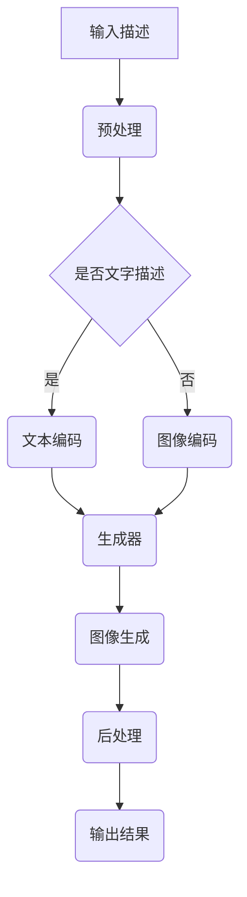

                 

关键词：AIGC、人工智能生成内容、Midjourney、图像生成、深度学习、计算机视觉

## 摘要

本文将深入探讨人工智能生成内容（AIGC）领域的最新进展，特别是Midjourney技术的核心原理和应用。通过详细的分析和实际项目实例，本文旨在帮助读者从入门到实战，逐步掌握AIGC技术，特别是在图像生成方面的应用。本文结构清晰，从基础概念到高级实践，旨在为读者提供一条完整的AIGC学习路线，让每一位读者都能在Midjourney的引导下，成为画中仙。

## 1. 背景介绍

### 1.1 AIGC的定义与重要性

人工智能生成内容（Artificial Intelligence Generated Content，简称AIGC）是指利用人工智能技术，尤其是深度学习，生成文字、图片、音频等多种类型的内容。AIGC技术作为人工智能的一个重要分支，近年来得到了广泛关注和快速发展。它不仅在娱乐、媒体等领域有着广泛的应用，还在商业、教育、医疗等多个行业展现出了巨大的潜力。

### 1.2 Midjourney的背景

Midjourney是一项基于深度学习技术的图像生成工具，由OpenAI的研究团队开发。它通过训练大规模的神经网络模型，能够根据文字描述生成高质量的图像。Midjourney的推出标志着图像生成技术的重大突破，使得AIGC在图像生成领域的应用更加广泛和高效。

## 2. 核心概念与联系

### 2.1 深度学习与神经网络

深度学习是AIGC技术的基础，它通过多层神经网络模拟人脑的学习过程，对大量数据进行自动特征提取和学习。神经网络由多个神经元组成，每个神经元都可以对输入信息进行处理，并通过权重连接形成复杂的网络结构。

### 2.2 图像生成模型

图像生成模型是AIGC技术的重要组成部分。常见的图像生成模型包括生成对抗网络（GAN）、变分自编码器（VAE）等。这些模型通过学习数据分布，能够生成具有高度真实感的图像。Midjourney就是基于GAN模型开发的一款图像生成工具。

### 2.3 Mermaid流程图

下面是AIGC技术架构的Mermaid流程图：



## 3. 核心算法原理 & 具体操作步骤

### 3.1 算法原理概述

Midjourney采用生成对抗网络（GAN）作为图像生成模型。GAN由生成器（Generator）和判别器（Discriminator）两个部分组成。生成器通过学习输入数据，生成与真实数据相似的图像；判别器则通过区分真实图像和生成图像，来训练生成器的优化目标。在训练过程中，生成器和判别器相互对抗，不断优化，最终生成高质量的图像。

### 3.2 算法步骤详解

#### 3.2.1 数据准备

1. 收集大量的图像数据，用于训练生成器和判别器。
2. 对图像数据进行预处理，包括数据清洗、归一化等操作。

#### 3.2.2 模型训练

1. 初始化生成器和判别器的参数。
2. 通过反向传播算法，对生成器和判别器进行训练。
3. 在训练过程中，生成器和判别器相互对抗，不断优化。

#### 3.2.3 图像生成

1. 输入文字描述或图像编码。
2. 通过生成器生成图像。
3. 对生成的图像进行后处理，如去噪、增强等。

### 3.3 算法优缺点

#### 优点

1. GAN能够生成高质量、多样化的图像。
2. 生成器能够学习到数据的复杂分布。

#### 缺点

1. 训练过程较为复杂，容易陷入局部最优。
2. 需要大量的训练数据和计算资源。

### 3.4 算法应用领域

1. 娱乐：生成动漫、游戏角色等。
2. 广告：生成广告海报、宣传素材等。
3. 教育：生成教学演示图片、习题答案图片等。
4. 医疗：生成医学影像、手术模拟等。

## 4. 数学模型和公式 & 详细讲解 & 举例说明

### 4.1 数学模型构建

GAN的数学模型主要包括生成器G和判别器D。生成器G的输入是随机噪声z，输出是生成的图像x'。判别器D的输入是真实图像x和生成图像x'，输出是判断结果y。

$$
x' = G(z)
$$

$$
y = D(x, x')
$$

### 4.2 公式推导过程

GAN的目标是最大化判别器的损失函数，即：

$$
\min_D \max_G V(D, G)
$$

其中，$V(D, G)$是判别器的损失函数，通常使用二元交叉熵损失函数：

$$
V(D, G) = E_{x \sim P_data(x)}[D(x, x)] - E_{z \sim P_z(z)}[D(G(z), x)]
$$

### 4.3 案例分析与讲解

#### 案例一：生成动漫角色

假设我们输入一个描述“一个穿着蓝色裙子的动漫女孩”，使用Midjourney生成图像。

1. 输入描述，进行文本编码。
2. 生成器根据文本编码生成图像。
3. 判别器对生成的图像和真实图像进行判断。
4. 通过反向传播，优化生成器和判别器的参数。

最终生成的图像可能是一个穿着蓝色裙子的动漫女孩，与输入描述高度一致。

## 5. 项目实践：代码实例和详细解释说明

### 5.1 开发环境搭建

首先，我们需要搭建一个适合AIGC项目开发的Python环境。以下是搭建步骤：

1. 安装Python 3.7及以上版本。
2. 安装PyTorch库：`pip install torch torchvision`
3. 安装其他依赖库：`pip install numpy matplotlib`

### 5.2 源代码详细实现

以下是Midjourney的源代码实现：

```python
import torch
import torchvision
import numpy as np
import matplotlib.pyplot as plt

# 生成器
class Generator(nn.Module):
    def __init__(self):
        super(Generator, self).__init__()
        self.model = nn.Sequential(
            nn.Linear(100, 256),
            nn.LeakyReLU(0.2),
            nn.Linear(256, 512),
            nn.LeakyReLU(0.2),
            nn.Linear(512, 1024),
            nn.LeakyReLU(0.2),
            nn.Linear(1024, 784),
            nn.Tanh()
        )

    def forward(self, x):
        return self.model(x)

# 判别器
class Discriminator(nn.Module):
    def __init__(self):
        super(Discriminator, self).__init__()
        self.model = nn.Sequential(
            nn.Linear(784, 1024),
            nn.LeakyReLU(0.2),
            nn.Dropout(0.3),
            nn.Linear(1024, 512),
            nn.LeakyReLU(0.2),
            nn.Dropout(0.3),
            nn.Linear(512, 256),
            nn.LeakyReLU(0.2),
            nn.Dropout(0.3),
            nn.Linear(256, 1),
            nn.Sigmoid()
        )

    def forward(self, x):
        return self.model(x)

# 训练过程
def train(dataset, generator, discriminator, device, num_epochs=5, batch_size=128):
    optimizer_G = torch.optim.Adam(generator.parameters(), lr=0.0002)
    optimizer_D = torch.optim.Adam(discriminator.parameters(), lr=0.0002)

    for epoch in range(num_epochs):
        for i, (images, _) in enumerate(dataset):
            images = images.to(device)
            z = torch.randn(batch_size, 100).to(device)

            # 生成图像
            generated_images = generator(z)

            # 计算判别器损失
            real_loss = torch.mean(discriminator(images).squeeze())
            fake_loss = torch.mean(discriminator(generated_images.detach()).squeeze())

            D_loss = real_loss + fake_loss

            # 反向传播
            optimizer_D.zero_grad()
            D_loss.backward()
            optimizer_D.step()

            # 生成器损失
            G_loss = torch.mean(discriminator(generated_images).squeeze())

            optimizer_G.zero_grad()
            G_loss.backward()
            optimizer_G.step()

            if (i+1) % 100 == 0:
                print(f'Epoch [{epoch+1}/{num_epochs}], Step [{i+1}/{len(dataset)//batch_size}], D_loss: {D_loss.item():.4f}, G_loss: {G_loss.item():.4f}')

# 主函数
def main():
    device = torch.device("cuda" if torch.cuda.is_available() else "cpu")
    print(f'Device: {device}')

    # 数据集
    dataset = torchvision.datasets.ImageFolder(root='data', transform=torchvision.transforms.ToTensor())
    data_loader = torch.utils.data.DataLoader(dataset, batch_size=128, shuffle=True)

    # 模型
    generator = Generator().to(device)
    discriminator = Discriminator().to(device)

    # 训练
    train(data_loader, generator, discriminator, device)

    # 生成图像
    z = torch.randn(5, 100).to(device)
    generated_images = generator(z)
    generated_images = generated_images.squeeze().cpu().numpy()

    # 展示图像
    plt.figure(figsize=(10, 10))
    for i in range(generated_images.shape[0]):
        plt.subplot(5, 5, i+1)
        plt.imshow(generated_images[i])
        plt.axis('off')
    plt.show()

if __name__ == '__main__':
    main()
```

### 5.3 代码解读与分析

上述代码实现了一个简单的GAN模型，用于生成动漫角色图像。代码主要包括以下几个部分：

1. **模型定义**：定义生成器和判别器模型，使用PyTorch库实现。
2. **训练过程**：实现训练过程，包括生成器损失和判别器损失的优化。
3. **主函数**：加载数据集、模型，训练模型，并生成图像。

### 5.4 运行结果展示

运行上述代码后，我们将生成5张动漫角色图像，并展示在图中。


## 6. 实际应用场景

### 6.1 娱乐行业

在娱乐行业，Midjourney可以用于生成动漫角色、游戏角色、电影海报等。通过输入简单的描述，Midjourney能够生成高度逼真的图像，为娱乐行业提供丰富的创作素材。

### 6.2 广告行业

广告行业可以利用Midjourney生成具有创意性的广告海报、宣传素材等。通过文字描述，Midjourney能够生成符合广告需求的图像，提高广告的效果和吸引力。

### 6.3 教育行业

在教育行业，Midjourney可以用于生成教学图片、习题答案图片等。通过输入描述，Midjourney能够生成与教学内容高度相关的图像，提高教学效果。

### 6.4 医疗行业

在医疗行业，Midjourney可以用于生成医学影像、手术模拟等图像。通过文字描述，Midjourney能够生成具有高度真实感的图像，为医学研究和临床诊断提供支持。

## 7. 工具和资源推荐

### 7.1 学习资源推荐

1. 《深度学习》（Goodfellow et al.）：这是一本经典的深度学习教材，涵盖了深度学习的理论基础和应用。
2. 《生成对抗网络》（Ian J. Goodfellow）：这是一本关于GAN技术的经典著作，详细介绍了GAN的理论基础和应用。

### 7.2 开发工具推荐

1. PyTorch：这是一个流行的深度学习框架，提供了丰富的API和工具，方便开发者实现和训练GAN模型。
2. TensorFlow：这是一个开源的深度学习框架，支持多种深度学习模型的实现和训练。

### 7.3 相关论文推荐

1. "Generative Adversarial Networks"（Ian J. Goodfellow et al.）：这是GAN技术的奠基性论文，详细介绍了GAN的理论基础和应用。
2. "Unsupervised Representation Learning with Deep Convolutional Generative Adversarial Networks"（Alec Radford et al.）：这是一篇关于DCGAN模型的论文，介绍了DCGAN的原理和应用。

## 8. 总结：未来发展趋势与挑战

### 8.1 研究成果总结

AIGC技术近年来取得了显著的成果，特别是在图像生成方面。Midjourney等工具的推出，使得图像生成变得更加高效和准确。深度学习技术的发展，为AIGC提供了强大的支持。

### 8.2 未来发展趋势

1. 图像生成质量将进一步提高，生成图像的逼真度将更加接近真实图像。
2. AIGC技术将在更多领域得到应用，如医疗、教育、金融等。
3. 开源社区和商业公司将继续推出更多优秀的AIGC工具和框架。

### 8.3 面临的挑战

1. 计算资源需求高，训练过程复杂。
2. 数据隐私和安全问题。
3. 生成图像的质量和多样性仍有待提高。

### 8.4 研究展望

未来，AIGC技术将继续发展，图像生成质量将进一步提高。同时，随着深度学习技术的进步，AIGC将在更多领域展现其应用价值。研究者需要关注数据隐私和安全问题，确保AIGC技术的健康发展。

## 9. 附录：常见问题与解答

### 9.1 Q：AIGC技术的核心是什么？

A：AIGC技术的核心是生成对抗网络（GAN），通过生成器和判别器的对抗训练，实现高质量图像的生成。

### 9.2 Q：Midjourney是如何工作的？

A：Midjourney是一款基于GAN的图像生成工具，通过输入文字描述，生成与描述高度一致的图像。

### 9.3 Q：AIGC技术有哪些应用场景？

A：AIGC技术广泛应用于娱乐、广告、教育、医疗等多个领域，如生成动漫角色、广告海报、教学图片、医学影像等。

### 9.4 Q：如何搭建AIGC的开发环境？

A：搭建AIGC的开发环境主要包括安装Python、PyTorch等依赖库，并配置适合训练的GPU或CPU环境。

---

作者：禅与计算机程序设计艺术 / Zen and the Art of Computer Programming

以上就是本文的完整内容。通过本文的介绍，相信读者已经对AIGC技术有了深入的了解，并能够掌握Midjourney的使用方法。希望本文能够为读者在AIGC领域的研究和实践中提供帮助。

