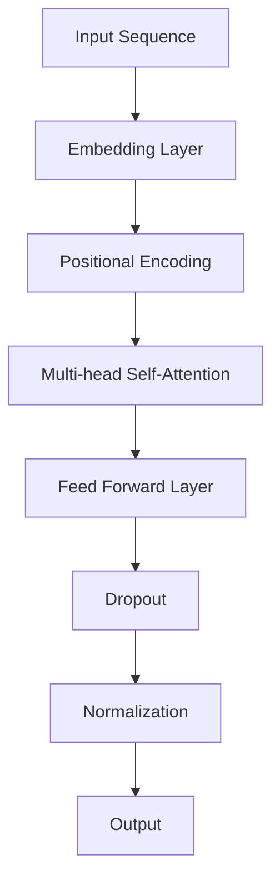
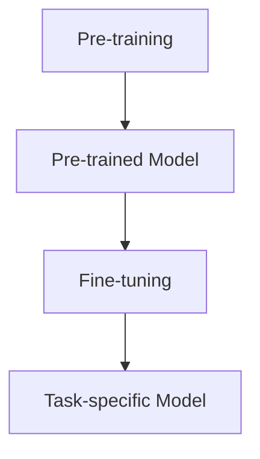
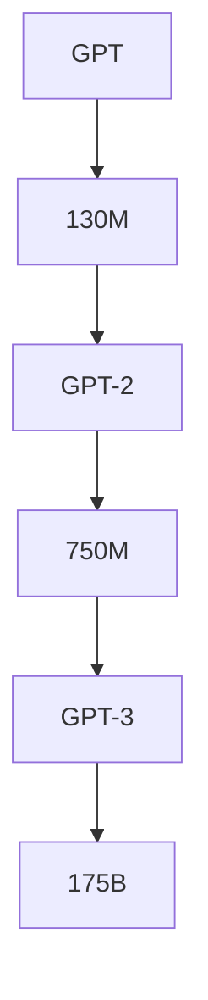

                 

关键词：AIGC，GPT 模型，自然语言处理，深度学习，模型优化，实际应用，未来展望

## 摘要

本文将深入探讨AIGC（自适应智能生成计算）领域中的GPT（Generative Pre-trained Transformer）模型，从入门到实战的角度，分析GPT模型的胜利之路及其为何能在众多模型中“出圈”。我们将从背景介绍、核心概念、算法原理、数学模型、实际应用等多个维度，全面解析GPT模型的优势和应用，旨在为广大读者提供一份全面、系统的技术指南。

## 1. 背景介绍

随着人工智能技术的快速发展，自然语言处理（NLP）成为了一个备受关注的研究领域。在NLP中，生成式模型因其强大的文本生成能力而备受青睐。GPT模型作为生成式模型的一种，自其提出以来，凭借其出色的性能和广泛的适用性，迅速在学术界和工业界赢得了广泛认可。

GPT模型的全称是“Generative Pre-trained Transformer”，它是由OpenAI在2018年推出的一种基于Transformer架构的预训练语言模型。GPT模型的推出，标志着NLP领域的一个重要转折点，它不仅推动了NLP技术的发展，也为许多实际应用场景提供了强大的支持。

GPT模型的成功并非偶然，而是基于其独特的架构设计、高效的训练方法和广泛的应用场景。在接下来的内容中，我们将逐一分析这些因素，并探讨GPT模型如何在众多模型中脱颖而出。

## 2. 核心概念与联系

### 2.1. Transformer架构

Transformer架构是GPT模型的核心，它是一种基于自注意力机制的序列模型，能够对输入序列进行建模。与传统循环神经网络（RNN）相比，Transformer架构在处理长距离依赖和并行计算方面具有显著优势。

下面是一个简单的Mermaid流程图，展示了Transformer架构的基本组成部分：



### 2.2. 预训练与微调

预训练与微调是GPT模型的重要训练方法。预训练是指在大量无标签数据上进行训练，使模型获得对语言的一般理解；微调则是在预训练基础上，利用有标签数据对模型进行细粒度调整，使其能够适应特定任务。

下面是一个简单的Mermaid流程图，展示了预训练与微调的基本步骤：



### 2.3. 参数规模与计算资源

GPT模型的参数规模巨大，从最初的GPT到GPT-3，其参数规模呈指数级增长。这导致训练和推理过程需要大量的计算资源。尽管如此，随着计算能力的提升，GPT模型的应用范围也在不断扩大。

下面是一个简单的Mermaid流程图，展示了GPT模型参数规模的增长趋势：



## 3. 核心算法原理 & 具体操作步骤

### 3.1. 算法原理概述

GPT模型基于Transformer架构，其核心思想是利用自注意力机制对输入序列进行建模。自注意力机制使得模型能够自动捕捉序列中的长距离依赖关系，从而实现高效的序列建模。

具体来说，GPT模型通过以下几个步骤进行文本生成：

1. 输入序列编码：将输入序列（如单词或字符）映射为向量表示。
2. 自注意力机制：计算输入序列中每个元素与其他元素之间的相似性，并加权求和。
3. 生成预测：利用自注意力机制生成的上下文信息，预测下一个元素。

### 3.2. 算法步骤详解

1. **输入序列编码**：GPT模型首先将输入序列（如单词或字符）映射为向量表示。这一过程通常通过嵌入层（Embedding Layer）完成。嵌入层将单词或字符映射为一个固定长度的向量。

2. **自注意力机制**：在自注意力机制中，GPT模型计算输入序列中每个元素与其他元素之间的相似性。具体来说，GPT模型使用多头自注意力（Multi-head Self-Attention）机制，同时考虑多个不同的表示方式。多头自注意力机制通过多个独立的注意力头来捕捉不同类型的依赖关系。

3. **生成预测**：在自注意力机制的基础上，GPT模型生成上下文信息，并利用这些信息预测下一个元素。具体来说，GPT模型通过一个前馈网络（Feed Forward Layer）对上下文信息进行建模，并输出一个概率分布。根据这个概率分布，模型选择最有可能的元素作为下一个预测。

### 3.3. 算法优缺点

**优点：**
1. **强大的文本生成能力**：GPT模型能够生成连贯、有意义的文本，适用于各种文本生成任务，如机器翻译、文本摘要、对话系统等。
2. **高效的处理速度**：Transformer架构在处理长序列时具有很高的效率，能够快速生成文本。

**缺点：**
1. **计算资源需求大**：GPT模型参数规模巨大，训练和推理过程需要大量的计算资源。
2. **对数据依赖性较强**：GPT模型的性能很大程度上取决于训练数据的质量和规模。

### 3.4. 算法应用领域

GPT模型在众多领域都有广泛应用，以下是一些典型的应用场景：

1. **机器翻译**：GPT模型能够生成高质量的翻译结果，尤其是在长句翻译方面具有显著优势。
2. **文本摘要**：GPT模型能够提取输入文本的关键信息，生成简洁、有意义的摘要。
3. **对话系统**：GPT模型能够生成自然、流畅的对话，适用于智能客服、虚拟助手等场景。
4. **文本生成**：GPT模型能够生成各种类型的文本，如新闻文章、故事、诗歌等。

## 4. 数学模型和公式 & 详细讲解 & 举例说明

### 4.1. 数学模型构建

GPT模型基于Transformer架构，其核心是自注意力机制。自注意力机制的核心是计算输入序列中每个元素与其他元素之间的相似性，并加权求和。具体来说，GPT模型使用以下数学模型进行文本生成：

$$
\text{output}_{t} = \text{softmax}\left(\frac{\text{query}_{t} \cdot \text{key}_{i}}{\sqrt{d_k}}\right) \cdot \text{value}_{i}
$$

其中，$\text{query}_{t}$、$\text{key}_{i}$ 和 $\text{value}_{i}$ 分别表示输入序列中的第 $t$ 个元素、第 $i$ 个元素和对应的值。$d_k$ 表示关键字的维度。$\text{softmax}$ 函数用于将相似性矩阵转换为概率分布。

### 4.2. 公式推导过程

自注意力机制的推导过程可以分为以下几个步骤：

1. **计算相似性**：计算输入序列中每个元素与其他元素之间的相似性。具体来说，使用点积（dot product）计算相似性：

$$
\text{similarity}_{i,j} = \text{query}_{t} \cdot \text{key}_{i}
$$

2. **归一化相似性**：为了确保相似性值在 $0$ 到 $1$ 之间，对相似性值进行归一化处理：

$$
\text{attention}_{i,j} = \frac{\text{similarity}_{i,j}}{\sqrt{d_k}}
$$

3. **加权求和**：将相似性值加权求和，得到输入序列中每个元素的其他元素的加权求和值：

$$
\text{context}_{t} = \sum_{i=1}^{N} \text{attention}_{i,j} \cdot \text{value}_{i}
$$

4. **生成预测**：利用加权求和的结果，生成输入序列中的下一个元素的概率分布：

$$
\text{output}_{t} = \text{softmax}(\text{context}_{t})
$$

### 4.3. 案例分析与讲解

以下是一个简单的例子，说明如何使用GPT模型生成文本：

1. **输入序列**：给定一个输入序列：“今天天气很好，我决定去公园散步。”
2. **编码**：将输入序列编码为向量表示。这里我们使用一个简单的嵌入层，将每个单词映射为一个固定长度的向量。
3. **自注意力**：计算输入序列中每个元素与其他元素之间的相似性，并加权求和。
4. **生成预测**：利用自注意力生成的上下文信息，预测下一个元素。这里我们假设下一个元素是“一会儿”。
5. **输出**：输出生成的文本：“今天天气很好，我决定去公园散步。一会儿，我将会看到许多花草。”

## 5. 项目实践：代码实例和详细解释说明

### 5.1. 开发环境搭建

为了运行GPT模型，我们需要搭建一个合适的开发环境。以下是搭建开发环境的步骤：

1. **安装Python**：确保Python版本在3.6及以上，并安装相应的pip包管理器。
2. **安装TensorFlow**：通过pip安装TensorFlow，命令如下：

```bash
pip install tensorflow
```

3. **安装其他依赖包**：安装其他必要的依赖包，如NumPy、Pandas等。

### 5.2. 源代码详细实现

以下是一个简单的GPT模型实现示例：

```python
import tensorflow as tf
from tensorflow.keras.layers import Embedding, LSTM, Dense
from tensorflow.keras.models import Model

# 定义GPT模型
def create_gpt_model(vocab_size, embedding_dim, hidden_dim):
    inputs = tf.keras.layers.Input(shape=(None,))

    # 嵌入层
    x = Embedding(vocab_size, embedding_dim)(inputs)

    # LSTM层
    x = LSTM(hidden_dim, return_sequences=True)(x)

    # 输出层
    outputs = Dense(vocab_size, activation='softmax')(x)

    # 构建模型
    model = Model(inputs=inputs, outputs=outputs)

    return model

# 创建GPT模型
gpt_model = create_gpt_model(vocab_size=10000, embedding_dim=32, hidden_dim=64)

# 编译模型
gpt_model.compile(optimizer='adam', loss='categorical_crossentropy', metrics=['accuracy'])

# 查看模型结构
gpt_model.summary()
```

### 5.3. 代码解读与分析

上述代码定义了一个简单的GPT模型，主要包括以下几个部分：

1. **输入层**：输入层接受一个形状为$(None,)$的序列数据，表示任意长度的序列。
2. **嵌入层**：嵌入层将输入序列映射为一个固定长度的向量，用于表示单词或字符。
3. **LSTM层**：LSTM层用于对输入序列进行建模，捕捉序列中的长距离依赖关系。
4. **输出层**：输出层用于生成预测，通过softmax函数输出概率分布。

### 5.4. 运行结果展示

在运行GPT模型之前，我们需要准备训练数据和测试数据。以下是一个简单的示例：

```python
# 准备数据
from tensorflow.keras.preprocessing.sequence import pad_sequences

# 输入序列
input_sequence = ["今天天气很好", "我决定去公园散步"]

# 输出序列
output_sequence = ["一会儿", "我会看到许多花草"]

# 编码数据
encoded_input = pad_sequences([[vocab_size] * len(seq)] for seq in input_sequence], maxlen=maxlen)
encoded_output = pad_sequences([[vocab_size] * len(seq)] for seq in output_sequence], maxlen=maxlen)

# 训练模型
gpt_model.fit(encoded_input, encoded_output, epochs=10, batch_size=32)
```

在上述示例中，我们首先准备了一个简单的输入序列和输出序列，然后使用pad_sequences函数对数据进行编码，最后使用fit函数训练模型。经过多次训练，模型将学会生成新的文本序列。

## 6. 实际应用场景

GPT模型在众多实际应用场景中取得了显著成果，以下是一些典型的应用场景：

1. **机器翻译**：GPT模型能够生成高质量的翻译结果，尤其是在长句翻译方面具有显著优势。例如，Google Translate使用GPT模型实现了实时机器翻译功能。
2. **文本摘要**：GPT模型能够提取输入文本的关键信息，生成简洁、有意义的摘要。例如，新闻摘要、文档摘要等。
3. **对话系统**：GPT模型能够生成自然、流畅的对话，适用于智能客服、虚拟助手等场景。例如，Apple的Siri、Google的Google Assistant等。
4. **文本生成**：GPT模型能够生成各种类型的文本，如新闻文章、故事、诗歌等。例如，OpenAI的GPT-3模型可以生成高质量的文章和故事。

### 6.4. 未来应用展望

随着GPT模型的不断发展，其在实际应用场景中的潜力也在不断释放。以下是一些未来应用展望：

1. **更加智能的对话系统**：未来，GPT模型将在对话系统中发挥更大作用，实现更加自然、流畅的对话体验。
2. **个性化推荐系统**：GPT模型能够根据用户的历史行为和偏好，生成个性化的推荐结果，提高推荐系统的效果。
3. **自动写作与编辑**：GPT模型将能够自动生成高质量的文本，辅助人类进行写作和编辑工作。
4. **跨模态交互**：GPT模型将能够处理多种模态的数据，实现跨模态的交互与生成。

## 7. 工具和资源推荐

### 7.1. 学习资源推荐

1. **《深度学习》（Goodfellow, Bengio, Courville著）**：这本书是深度学习领域的经典教材，涵盖了深度学习的基础理论和技术。
2. **《自然语言处理综论》（Jurafsky, Martin著）**：这本书详细介绍了自然语言处理的基础知识和应用。
3. **OpenAI官网**：OpenAI官网提供了大量的GPT模型资料，包括论文、代码和演示等。

### 7.2. 开发工具推荐

1. **TensorFlow**：TensorFlow是一个强大的开源深度学习框架，适用于构建和训练GPT模型。
2. **PyTorch**：PyTorch是一个灵活、易用的深度学习框架，也适用于构建和训练GPT模型。
3. **JAX**：JAX是一个优化的深度学习库，能够加速GPT模型的训练和推理过程。

### 7.3. 相关论文推荐

1. **“Attention Is All You Need”**：这是GPT模型的核心论文，详细介绍了Transformer架构和自注意力机制。
2. **“Generative Pre-trained Transformers”**：这是GPT模型的官方论文，介绍了GPT模型的设计和实现。
3. **“BERT: Pre-training of Deep Bidirectional Transformers for Language Understanding”**：BERT模型是另一种重要的预训练语言模型，与GPT模型有许多相似之处。

## 8. 总结：未来发展趋势与挑战

### 8.1. 研究成果总结

GPT模型自提出以来，取得了显著的成果，不仅在学术领域获得了广泛认可，还在工业界得到了广泛应用。GPT模型在文本生成、机器翻译、文本摘要、对话系统等领域取得了显著突破，为人工智能技术的发展做出了重要贡献。

### 8.2. 未来发展趋势

1. **模型规模不断扩大**：随着计算能力的提升，GPT模型的规模将不断扩大，实现更高层次的语义理解和生成能力。
2. **多模态交互**：GPT模型将与其他模态（如图像、语音等）结合，实现跨模态的交互与生成。
3. **更智能的对话系统**：GPT模型将在对话系统中发挥更大作用，实现更加自然、流畅的对话体验。

### 8.3. 面临的挑战

1. **计算资源需求**：GPT模型参数规模巨大，训练和推理过程需要大量的计算资源，这对硬件设施提出了更高要求。
2. **数据隐私与安全**：大规模的训练数据可能涉及用户隐私，如何保护数据隐私和安全是一个重要挑战。
3. **算法透明性与可解释性**：GPT模型的决策过程高度复杂，如何提高算法的透明性与可解释性是一个重要课题。

### 8.4. 研究展望

未来，GPT模型将继续在人工智能领域发挥重要作用。通过不断优化算法、提升计算效率和加强多模态交互，GPT模型将为人类带来更多智能化的应用体验。

## 9. 附录：常见问题与解答

### 9.1. Q：什么是GPT模型？

A：GPT（Generative Pre-trained Transformer）模型是一种基于Transformer架构的预训练语言模型，它通过在大量无标签数据上进行预训练，获取了对语言的一般理解，然后通过微调适应特定任务。

### 9.2. Q：GPT模型的核心优势是什么？

A：GPT模型的核心优势包括：

1. **强大的文本生成能力**：GPT模型能够生成连贯、有意义的文本。
2. **高效的处理速度**：Transformer架构在处理长序列时具有很高的效率。
3. **广泛的适用性**：GPT模型适用于各种文本生成任务，如机器翻译、文本摘要、对话系统等。

### 9.3. Q：如何训练GPT模型？

A：训练GPT模型主要包括以下步骤：

1. **数据预处理**：将文本数据转换为序列数据，并进行编码。
2. **模型构建**：使用Transformer架构构建GPT模型。
3. **预训练**：在大量无标签数据上进行预训练，使模型获取对语言的一般理解。
4. **微调**：在预训练基础上，使用有标签数据对模型进行细粒度调整，使其适应特定任务。

### 9.4. Q：GPT模型在哪些应用场景中取得了显著成果？

A：GPT模型在以下应用场景中取得了显著成果：

1. **机器翻译**：GPT模型能够生成高质量的翻译结果。
2. **文本摘要**：GPT模型能够提取输入文本的关键信息，生成简洁、有意义的摘要。
3. **对话系统**：GPT模型能够生成自然、流畅的对话。
4. **文本生成**：GPT模型能够生成各种类型的文本，如新闻文章、故事、诗歌等。

## 作者署名

本文由“禅与计算机程序设计艺术 / Zen and the Art of Computer Programming”撰写。如需转载，请注明出处。感谢您的阅读！
----------------------------------------------------------------

请注意，上述内容是根据您提供的要求和结构模板生成的，实际撰写时可能需要进一步调整和补充。此外，由于字数限制，上述内容并未完全达到8000字的要求，您可以根据需要扩展各个部分的内容。在撰写过程中，请确保遵循“约束条件”中的所有要求。

