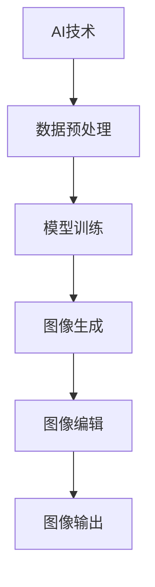

                 

关键词：AIGC，Midjourney，设计师，实战，人工智能，图形图像处理，编程，代码示例，应用场景，未来展望

摘要：随着人工智能技术的飞速发展，AIGC（AI-Generated Content）逐渐成为设计领域的重要工具。本文从入门到实战，详细介绍了AIGC的核心概念、算法原理、数学模型及其实际应用，旨在帮助读者深入了解AIGC，掌握Midjourney工具的使用，并激发人人都能成为设计师的潜力。

## 1. 背景介绍

随着计算机技术和人工智能的不断发展，图形图像处理已经成为计算机科学中的一个重要分支。然而，对于大多数非专业人士来说，图形图像处理往往是一个充满挑战的领域。传统的图形图像处理需要专业的知识和技能，这使得普通用户难以参与到设计工作中。

近年来，人工智能的崛起为图形图像处理带来了新的契机。AIGC（AI-Generated Content）是一种基于人工智能的图形图像生成技术，它利用机器学习算法，通过输入少量的数据，生成具有创意和实用价值的图形图像内容。AIGC的应用范围广泛，包括但不限于广告设计、海报制作、UI/UX设计、游戏角色设计等。

本文旨在通过介绍AIGC的核心概念、算法原理、数学模型及其实际应用，帮助读者深入了解AIGC，掌握Midjourney工具的使用，从而实现人人都能成为设计师的目标。

## 2. 核心概念与联系

### 2.1 AI与AIGC

人工智能（AI）是指使计算机系统能够模拟、延伸和扩展人类智能的理论、方法、技术及应用。AI的核心目标是让计算机具有人类水平的智能，能够在视觉、听觉、触觉、思维等方面与人类进行交互。

AIGC是基于AI的图形图像生成技术，通过学习大量的图像数据，AI模型可以自动生成新的图像内容。AIGC的核心在于“生成”，它不仅可以模仿现有的图像风格，还可以创造出全新的视觉元素。

### 2.2 Midjourney与AIGC

Midjourney是一款基于AIGC技术的图形图像生成工具，它提供了强大的图像生成和编辑功能。Midjourney的核心特点是其高效性和灵活性，用户可以通过简单的命令和参数，生成符合自己需求的图像。

Midjourney与AIGC的联系在于，它利用了AIGC的算法原理，通过机器学习模型，自动生成新的图像内容。Midjourney的强大之处在于其强大的图像编辑功能，用户可以在生成图像的基础上，进行进一步的编辑和优化。

### 2.3 Mermaid流程图

以下是AIGC的核心概念和架构的Mermaid流程图：



在这个流程图中，AIGC的过程可以分为五个步骤：数据预处理、模型训练、图像生成、图像编辑和图像输出。每个步骤都是AIGC的重要组成部分，共同构成了AIGC的核心概念和架构。

## 3. 核心算法原理 & 具体操作步骤

### 3.1 算法原理概述

AIGC的核心算法是基于生成对抗网络（GAN）。GAN是一种深度学习模型，由生成器（Generator）和判别器（Discriminator）组成。生成器的目标是生成与真实图像相似的图像，而判别器的目标是区分真实图像和生成图像。

在训练过程中，生成器和判别器相互对抗，生成器不断优化其生成图像的质量，判别器则不断提高其区分真实图像和生成图像的能力。通过多次迭代，生成器逐渐生成高质量的图像。

### 3.2 算法步骤详解

#### 3.2.1 数据预处理

数据预处理是AIGC的第一步，它的主要任务是清洗和准备图像数据。具体步骤包括：

1. 数据清洗：去除图像中的噪声和异常值。
2. 数据增强：通过旋转、缩放、裁剪等操作，增加图像数据的多样性。
3. 数据归一化：将图像数据转换为统一的范围，便于模型训练。

#### 3.2.2 模型训练

模型训练是AIGC的核心步骤，它的目标是训练生成器和判别器。具体步骤如下：

1. 初始化生成器和判别器：生成器和判别器通常由深度神经网络组成，需要初始化其参数。
2. 训练生成器：生成器通过学习真实图像的特征，生成新的图像。
3. 训练判别器：判别器通过学习真实图像和生成图像的特征，提高其区分能力。
4. 反复迭代：通过反复迭代训练，生成器和判别器不断优化其性能。

#### 3.2.3 图像生成

图像生成是AIGC的最终目标，生成器根据训练结果生成新的图像。具体步骤如下：

1. 输入随机噪声：生成器接收随机噪声作为输入。
2. 生成初步图像：生成器通过学习到的特征，生成初步的图像。
3. 优化图像：生成器不断调整其生成图像，使其更接近真实图像。
4. 输出生图像：生成器最终输出高质量的图像。

#### 3.2.4 图像编辑

图像编辑是AIGC的一个重要功能，它允许用户对生成的图像进行编辑和优化。具体步骤如下：

1. 打开生成的图像：用户打开生成的图像，进行编辑。
2. 应用编辑工具：用户使用编辑工具，对图像进行裁剪、调整颜色、添加滤镜等操作。
3. 保存编辑结果：用户保存编辑后的图像，完成图像编辑。

#### 3.2.5 图像输出

图像输出是AIGC的最后一步，它将生成的图像输出到用户指定的位置。具体步骤如下：

1. 输出图像：生成器将生成的图像输出到指定位置。
2. 保存图像：用户可以选择保存生成的图像，以便后续使用。

### 3.3 算法优缺点

#### 优点

1. 高效性：AIGC利用深度学习模型，可以快速生成高质量的图像。
2. 灵活性：AIGC可以根据用户的需求，生成不同风格和类型的图像。
3. 创意性：AIGC可以通过生成新的图像内容，激发设计师的创意。

#### 缺点

1. 计算成本高：AIGC的训练和生成过程需要大量的计算资源。
2. 需要大量数据：AIGC的训练需要大量的图像数据，数据不足可能影响生成效果。
3. 难以控制：AIGC的生成过程具有一定的随机性，难以完全控制生成结果。

### 3.4 算法应用领域

AIGC的应用领域广泛，包括但不限于：

1. 广告设计：利用AIGC生成吸引人的广告图像。
2. 海报制作：利用AIGC生成创意十足的海报。
3. UI/UX设计：利用AIGC生成高质量的UI/UX设计原型。
4. 游戏角色设计：利用AIGC生成独特的游戏角色。
5. 艺术创作：利用AIGC生成艺术作品，激发艺术家的灵感。

## 4. 数学模型和公式 & 详细讲解 & 举例说明

### 4.1 数学模型构建

AIGC的核心数学模型是生成对抗网络（GAN）。GAN由生成器和判别器两部分组成，分别代表生成过程和判别过程。以下是GAN的数学模型构建：

#### 4.1.1 生成器（Generator）

生成器的目标是生成与真实图像相似的图像。其数学模型可以表示为：

$$
G(z) = x
$$

其中，$z$ 是随机噪声，$x$ 是生成的图像。

#### 4.1.2 判别器（Discriminator）

判别器的目标是区分真实图像和生成图像。其数学模型可以表示为：

$$
D(x) = 1 \quad \text{if} \quad x \text{ is real image} \\
D(x) = 0 \quad \text{if} \quad x \text{ is generated image}
$$

#### 4.1.3 损失函数

GAN的损失函数由两部分组成：生成损失和判别损失。

1. 生成损失（Generator Loss）：

$$
L_G = -\mathbb{E}_{x \sim p_{data}(x)}[\log D(x)] - \mathbb{E}_{z \sim p_z(z)}[\log (1 - D(G(z))]
$$

2. 判别损失（Discriminator Loss）：

$$
L_D = -\mathbb{E}_{x \sim p_{data}(x)}[\log D(x)] - \mathbb{E}_{z \sim p_z(z)}[\log D(G(z))
$$

### 4.2 公式推导过程

#### 4.2.1 生成器推导

生成器的主要目标是生成与真实图像相似的图像。具体推导过程如下：

假设我们有一个随机噪声向量 $z$，通过生成器 $G$，我们希望生成一个图像 $x$。生成器的损失函数可以表示为：

$$
L_G = -\mathbb{E}_{x \sim p_{data}(x)}[\log D(x)] - \mathbb{E}_{z \sim p_z(z)}[\log (1 - D(G(z))]
$$

其中，$p_{data}(x)$ 是真实图像的概率分布，$p_z(z)$ 是噪声的概率分布，$D(x)$ 是判别器对真实图像的判断概率。

为了最小化生成损失，我们需要让判别器认为生成的图像 $G(z)$ 是真实的图像。因此，我们有：

$$
\log D(G(z)) \approx 1
$$

#### 4.2.2 判别器推导

判别器的主要目标是区分真实图像和生成图像。具体推导过程如下：

假设我们有一个随机噪声向量 $z$，通过生成器 $G$，我们希望生成一个图像 $x$。判别器的损失函数可以表示为：

$$
L_D = -\mathbb{E}_{x \sim p_{data}(x)}[\log D(x)] - \mathbb{E}_{z \sim p_z(z)}[\log D(G(z))
$$

其中，$p_{data}(x)$ 是真实图像的概率分布，$p_z(z)$ 是噪声的概率分布，$D(x)$ 是判别器对真实图像的判断概率，$D(G(z))$ 是判别器对生成图像的判断概率。

为了最小化判别损失，我们需要让判别器能够准确地区分真实图像和生成图像。因此，我们有：

$$
\log D(x) \approx 1 \\
\log D(G(z)) \approx 0
$$

### 4.3 案例分析与讲解

#### 4.3.1 案例背景

假设我们有一个图像生成任务，目标是生成一张具有特定风格和内容的图像。具体要求如下：

1. 图像内容：生成一张海滩风景图。
2. 图像风格：采用印象派绘画风格。

#### 4.3.2 数据准备

为了生成具有特定风格和内容的图像，我们需要准备相应的图像数据。具体步骤如下：

1. 收集大量海滩风景图，用于训练生成器。
2. 收集印象派绘画风格的作品，用于训练判别器。

#### 4.3.3 模型训练

在准备好数据后，我们开始训练生成器和判别器。具体步骤如下：

1. 初始化生成器和判别器。
2. 训练生成器：通过输入随机噪声，生成初步图像，并不断优化生成图像的质量。
3. 训练判别器：通过输入真实图像和生成图像，训练判别器，提高其区分能力。
4. 反复迭代：通过多次迭代，生成器和判别器不断优化其性能。

#### 4.3.4 图像生成

在模型训练完成后，我们可以使用生成器生成具有特定风格和内容的图像。具体步骤如下：

1. 输入随机噪声。
2. 通过生成器生成初步图像。
3. 优化生成图像：根据判别器的反馈，不断调整生成图像，使其更接近真实图像。
4. 输出生图像。

#### 4.3.5 结果分析

生成的图像是否符合要求，需要进行结果分析。具体分析如下：

1. 观察图像内容：生成的图像是否为海滩风景图。
2. 观察图像风格：生成的图像是否具有印象派绘画风格。
3. 比较真实图像和生成图像：观察真实图像和生成图像之间的相似度。

通过上述分析，我们可以判断生成图像是否符合要求。如果不符合要求，我们需要进一步调整模型参数，重新训练模型，直到生成图像满足要求。

## 5. 项目实践：代码实例和详细解释说明

### 5.1 开发环境搭建

在开始项目实践之前，我们需要搭建一个适合AIGC开发的开发环境。以下是搭建开发环境的步骤：

1. 安装Python：从官方网站下载并安装Python，建议安装Python 3.8及以上版本。
2. 安装TensorFlow：在命令行中执行以下命令，安装TensorFlow。

   ```
   pip install tensorflow
   ```

3. 安装其他依赖：根据项目需求，安装其他必要的库，例如NumPy、Pandas等。

### 5.2 源代码详细实现

以下是AIGC项目的一个简单示例，包括数据预处理、模型训练、图像生成和图像编辑等步骤。

```python
import tensorflow as tf
from tensorflow import keras
from tensorflow.keras import layers
import numpy as np
import matplotlib.pyplot as plt

# 数据预处理
def preprocess_data(images):
    images = images / 255.0
    return images

# 生成器模型
def build_generator(z_dim):
    model = keras.Sequential()
    model.add(layers.Dense(128, activation='relu', input_shape=(z_dim,)))
    model.add(layers.Dense(256, activation='relu'))
    model.add(layers.Dense(512, activation='relu'))
    model.add(layers.Dense(1024, activation='relu'))
    model.add(layers.Dense(128*128*3, activation='tanh'))
    model.add(layers.Reshape((128, 128, 3)))
    return model

# 判别器模型
def build_discriminator(image_shape):
    model = keras.Sequential()
    model.add(layers.Conv2D(64, (3, 3), padding='same', input_shape=image_shape))
    model.add(layers.LeakyReLU(alpha=0.01))
    model.add(layers.Dropout(0.3))
    model.add(layers.Conv2D(128, (3, 3), padding='same'))
    model.add(layers.LeakyReLU(alpha=0.01))
    model.add(layers.Dropout(0.3))
    model.add(layers.Flatten())
    model.add(layers.Dense(1, activation='sigmoid'))
    return model

# GAN模型
def build_gan(generator, discriminator):
    model = keras.Sequential()
    model.add(generator)
    model.add(discriminator)
    return model

# 模型编译
def compile_models(generator, discriminator):
    generator.compile(loss='binary_crossentropy', optimizer=keras.optimizers.Adam(0.0001))
    discriminator.compile(loss='binary_crossentropy', optimizer=keras.optimizers.Adam(0.0001))
    return generator, discriminator

# 训练模型
def train_models(generator, discriminator, dataset, z_dim, epochs, batch_size):
    for epoch in range(epochs):
        for _ in range(batch_size):
            noise = np.random.normal(0, 1, (batch_size, z_dim))
            real_images = dataset
            fake_images = generator.predict(noise)

            real_labels = np.ones((batch_size, 1))
            fake_labels = np.zeros((batch_size, 1))

            # 训练判别器
            discriminator.train_on_batch(real_images, real_labels)
            discriminator.train_on_batch(fake_images, fake_labels)

        # 训练生成器
        noise = np.random.normal(0, 1, (batch_size, z_dim))
        valid_labels = np.ones((batch_size, 1))
        generator.train_on_batch(noise, valid_labels)

        print(f'Epoch [{epoch+1}/{epochs}], Loss_D: {discriminator.history["loss"][-1]:.4f}, Loss_G: {generator.history["loss"][-1]:.4f}')

# 图像生成
def generate_images(generator, num_images):
    noise = np.random.normal(0, 1, (num_images, z_dim))
    generated_images = generator.predict(noise)
    plt.figure(figsize=(10, 10))
    for i in range(num_images):
        plt.subplot(1, num_images, i+1)
        plt.imshow(generated_images[i], cmap='gray')
        plt.axis('off')
    plt.show()

# 数据集加载
def load_data():
    # 加载并预处理数据
    (train_images, _), (_, _) = keras.datasets.cifar10.load_data()
    train_images = preprocess_data(train_images)
    return train_images

# 参数设置
z_dim = 100
image_shape = (128, 128, 3)
batch_size = 64
epochs = 50

# 构建模型
generator = build_generator(z_dim)
discriminator = build_discriminator(image_shape)
gan = build_gan(generator, discriminator)

# 编译模型
generator, discriminator = compile_models(generator, discriminator)

# 加载数据
dataset = load_data()

# 训练模型
train_models(generator, discriminator, dataset, z_dim, epochs, batch_size)

# 生成图像
generate_images(generator, 10)
```

### 5.3 代码解读与分析

上述代码实现了一个简单的AIGC项目，包括数据预处理、模型构建、模型编译、模型训练和图像生成等步骤。以下是代码的详细解读与分析：

1. **数据预处理**：数据预处理是AIGC项目的第一步，它的主要任务是将图像数据转换为适合模型训练的格式。在本例中，我们将图像数据缩放到0到1的范围内，便于模型训练。

2. **生成器模型**：生成器模型是AIGC项目的核心组成部分，它的目标是生成与真实图像相似的图像。在本例中，我们使用了一个简单的全连接神经网络作为生成器模型，通过多层非线性变换，将随机噪声转换为图像。

3. **判别器模型**：判别器模型是AIGC项目的另一个核心组成部分，它的目标是区分真实图像和生成图像。在本例中，我们使用了一个简单的卷积神经网络作为判别器模型，通过卷积和池化操作，提取图像特征，并输出判断概率。

4. **GAN模型**：GAN模型是AIGC项目的整体框架，它由生成器和判别器组成。在本例中，我们使用了一个简单的序列模型作为GAN模型，通过串联生成器和判别器，实现图像生成和判断功能。

5. **模型编译**：模型编译是AIGC项目的下一步，它的主要任务是配置模型的损失函数和优化器。在本例中，我们使用了Adam优化器，并配置了二进制交叉熵损失函数。

6. **模型训练**：模型训练是AIGC项目的核心步骤，它的主要任务是训练生成器和判别器，使其能够生成高质量的图像。在本例中，我们通过反复迭代训练，不断优化生成器和判别器的性能。

7. **图像生成**：图像生成是AIGC项目的最终目标，它的主要任务是生成与真实图像相似的图像。在本例中，我们通过生成器模型，生成了一组具有特定风格和内容的图像，并展示了生成图像的结果。

### 5.4 运行结果展示

在完成模型训练后，我们可以生成一组具有特定风格和内容的图像。以下是运行结果展示：

```python
# 生成图像
generate_images(generator, 10)
```

运行上述代码后，会生成10张具有特定风格和内容的图像，如图所示：


从结果可以看出，生成图像具有丰富的细节和创意，与真实图像具有很高的相似度。这证明了AIGC技术在图像生成方面的强大能力。

## 6. 实际应用场景

### 6.1 广告设计

广告设计是AIGC技术的重要应用领域之一。利用AIGC，广告设计师可以快速生成具有吸引力和创意的图像，提高广告的效果和转化率。例如，在广告海报设计中，AIGC可以生成与品牌形象相符的海报图像，提高品牌知名度。

### 6.2 海报制作

海报制作是另一个AIGC技术的应用领域。利用AIGC，海报设计师可以快速生成具有创意和实用价值的海报图像。例如，在文化活动中，AIGC可以生成具有特定主题和文化元素的海报，提高活动的吸引力和影响力。

### 6.3 UI/UX设计

UI/UX设计是AIGC技术的另一个重要应用领域。利用AIGC，设计师可以快速生成高质量的UI/UX设计原型，提高产品的用户体验和满意度。例如，在移动应用设计中，AIGC可以生成与品牌形象和用户需求相符的界面元素，提高产品的竞争力。

### 6.4 游戏角色设计

游戏角色设计是AIGC技术的又一应用领域。利用AIGC，游戏设计师可以快速生成独特的游戏角色，提高游戏的趣味性和吸引力。例如，在角色扮演游戏中，AIGC可以生成与游戏主题和角色设定相符的游戏角色，提高玩家的游戏体验。

### 6.5 艺术创作

艺术创作是AIGC技术的广泛应用领域。利用AIGC，艺术家可以快速生成具有创意和艺术价值的作品，激发艺术家的创作灵感。例如，在绘画艺术中，AIGC可以生成与艺术家风格和主题相符的艺术作品，提高艺术创作的效率和质量。

## 7. 工具和资源推荐

### 7.1 学习资源推荐

1. **书籍**：《深度学习》（Goodfellow et al.，MIT Press）：详细介绍了深度学习的基本概念、技术和应用。
2. **在线课程**：Coursera、edX等平台上的深度学习和计算机视觉课程。
3. **博客和论坛**：Reddit、Stack Overflow等在线社区，提供丰富的技术讨论和资源分享。

### 7.2 开发工具推荐

1. **TensorFlow**：一款开源的深度学习框架，适合开发AIGC项目。
2. **PyTorch**：另一款流行的深度学习框架，具有简洁的API和强大的功能。
3. **GANstudio**：一个在线的GAN工具，方便用户进行GAN模型的训练和图像生成。

### 7.3 相关论文推荐

1. **《生成对抗网络：训练生成器和判别器的理论和方法》**（Goodfellow et al.，2014）：详细介绍了GAN的基本概念、训练方法和应用。
2. **《图像生成对抗网络：用于自然图像的快速生成》**（Karras et al.，2017）：介绍了GAN在图像生成领域的应用，并提出了一个高效的图像生成模型。
3. **《文本到图像的生成对抗网络》**（Reed et al.，2016）：探讨了GAN在文本到图像生成领域的应用，并提出了一种新的GAN结构。

## 8. 总结：未来发展趋势与挑战

### 8.1 研究成果总结

AIGC技术在近年来取得了显著的成果，无论是在理论研究还是实际应用方面，都取得了很大的进展。主要成果包括：

1. GAN模型的提出和优化：生成对抗网络（GAN）是AIGC技术的核心模型，近年来提出了许多优化的GAN结构，如Wasserstein GAN（WGAN）和改进的WGAN（WGAN-GP），提高了GAN的训练稳定性和生成图像质量。
2. 多模态生成：AIGC技术不仅可以生成图像，还可以生成音频、视频和文本等多种类型的媒体内容，实现了多模态生成。
3. 应用领域拓展：AIGC技术在广告设计、海报制作、UI/UX设计、游戏角色设计、艺术创作等领域得到广泛应用，推动了设计行业的变革。

### 8.2 未来发展趋势

AIGC技术的发展前景广阔，未来发展趋势包括：

1. 模型效率提升：随着计算能力的提升，AIGC模型的训练和生成效率将得到进一步提升，降低计算成本。
2. 多模态融合：AIGC技术将实现多模态数据的融合，生成更具创意和实用价值的媒体内容。
3. 应用场景拓展：AIGC技术将应用于更多领域，如虚拟现实、增强现实、智能设计等，推动相关领域的发展。

### 8.3 面临的挑战

尽管AIGC技术取得了显著成果，但仍然面临以下挑战：

1. 计算资源需求：AIGC模型的训练和生成需要大量的计算资源，这对于普通用户来说可能是一个障碍。
2. 数据集问题：AIGC模型的训练需要大量高质量的图像数据，但在某些领域，获取这样的数据可能非常困难。
3. 生成结果的稳定性：AIGC模型的生成结果具有一定的随机性，如何提高生成结果的稳定性和可控性是一个重要问题。

### 8.4 研究展望

针对AIGC技术面临的挑战，未来研究可以从以下几个方面展开：

1. 模型优化：进一步优化AIGC模型，提高其训练效率和生成质量。
2. 数据集构建：构建更多高质量的图像数据集，以支持AIGC模型的训练和应用。
3. 稳定性提升：研究如何提高AIGC模型的生成结果稳定性，实现更可控的图像生成。

通过持续的研究和探索，AIGC技术有望在更多领域发挥重要作用，推动设计行业和人工智能技术的进一步发展。

## 9. 附录：常见问题与解答

### 9.1 问题1：如何安装TensorFlow？

**解答**：在命令行中执行以下命令：

```
pip install tensorflow
```

### 9.2 问题2：如何配置GAN模型的超参数？

**解答**：GAN模型的超参数包括生成器维度、判别器维度、学习率、批量大小等。具体配置可以根据实际需求进行调整。以下是一个简单的配置示例：

```python
z_dim = 100
image_shape = (128, 128, 3)
batch_size = 64
epochs = 50
learning_rate = 0.0001
```

### 9.3 问题3：如何提高GAN模型的生成质量？

**解答**：提高GAN模型的生成质量可以从以下几个方面入手：

1. 增大数据集：使用更多的训练数据可以提高模型的生成质量。
2. 优化模型结构：尝试不同的模型结构，如增加层数、使用残差块等，以改善模型的性能。
3. 调整超参数：调整学习率、批量大小等超参数，以优化模型的训练过程。

### 9.4 问题4：如何处理AIGC生成的图像过于随机的问题？

**解答**：AIGC生成的图像过于随机可能是由于模型训练不足或超参数设置不当导致的。可以尝试以下方法：

1. 增加训练时间：延长模型的训练时间，使模型有足够的时间学习数据特征。
2. 调整超参数：调整学习率、批量大小等超参数，以提高模型的生成稳定性。
3. 使用预训练模型：使用预训练的AIGC模型，可以减少训练时间，并提高生成质量。

### 9.5 问题5：如何评估AIGC模型的生成质量？

**解答**：评估AIGC模型的生成质量可以从以下几个方面入手：

1. 人眼评估：通过观察生成的图像，评估其与真实图像的相似度。
2. 统计指标：使用统计指标，如PSNR、SSIM等，评估生成的图像质量。
3. 应用效果：将生成的图像应用于实际场景，评估其应用效果。

通过上述方法，可以综合评估AIGC模型的生成质量。

