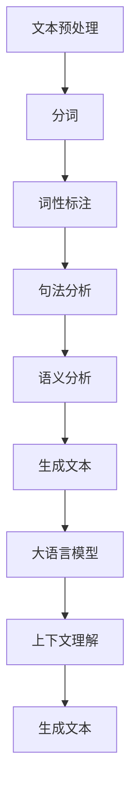

                 

关键词：AIGC、自然语言处理、大语言模型、入门指南、实战应用

## 摘要

本文旨在为读者提供一份详尽的AIGC（AI Generated Content）入门指南，特别聚焦于自然语言处理（NLP）和大语言模型的技术原理、应用场景和实战案例。通过对核心概念和算法的深入探讨，以及实际代码实现和结果展示，本文将帮助读者全面了解AIGC技术的应用价值和开发过程，为未来AIGC领域的研究和实践提供新的视角和思路。

## 1. 背景介绍

自然语言处理（NLP）是人工智能（AI）的重要分支之一，旨在使计算机能够理解、处理和生成自然语言。随着互联网的普及和数据量的爆炸性增长，NLP技术在信息检索、机器翻译、情感分析、智能客服等领域取得了显著的成果。

大语言模型作为NLP领域的一项核心技术，近年来取得了突破性的进展。大语言模型通过学习海量文本数据，能够理解复杂的语言结构和上下文关系，从而实现高质量的自然语言生成和推理。这种技术不仅为人们带来了便利，也在多个行业中引发了革命性的变化。

AIGC（AI Generated Content）是指由人工智能技术生成的内容，包括文本、图像、音频等多种形式。AIGC技术在创意产业、媒体传播、教育、娱乐等领域展现出了巨大的潜力。本文将详细介绍AIGC技术的基本原理、核心算法以及实际应用案例，帮助读者深入理解AIGC技术的工作机制和应用前景。

## 2. 核心概念与联系

### 2.1 自然语言处理

自然语言处理（NLP）是计算机科学和人工智能领域的一个分支，主要研究如何使计算机能够理解、处理和生成自然语言。自然语言是人类日常交流中使用的语言，具有高度复杂性和多样性。NLP的核心目标是将自然语言转换为计算机可以处理的形式，并使计算机能够对自然语言进行分析、理解和生成。

NLP的基本概念包括：

- **文本预处理**：包括分词、词性标注、句法分析等，目的是将原始文本转化为结构化的数据格式，以便后续处理。
- **语言模型**：用于预测下一个单词或句子，是NLP中非常重要的技术。大语言模型是一种特殊的语言模型，具有强大的上下文理解能力。
- **词嵌入**：将单词映射到高维向量空间，以便进行计算和建模。
- **语义分析**：通过理解单词和句子的语义含义，实现自然语言的理解和生成。

### 2.2 大语言模型

大语言模型是自然语言处理领域的一项核心技术，通过学习海量文本数据，能够理解和生成复杂的语言结构和上下文。大语言模型的主要特点包括：

- **大规模训练数据**：大语言模型通常需要数百万甚至数十亿级别的训练数据，这些数据来源于互联网上的各种文本资源，如网页、书籍、新闻、社交媒体等。
- **深度神经网络架构**：大语言模型通常采用深度神经网络（DNN）或变换器模型（Transformer）等先进的神经网络架构，这些架构具有强大的计算能力和参数表达能力。
- **上下文理解能力**：大语言模型能够捕捉到上下文信息，从而生成更加准确和自然的文本。例如，在生成一个句子时，大语言模型会考虑到前文的信息，确保生成的句子在语义上连贯一致。

### 2.3 Mermaid 流程图

为了更好地理解NLP和大语言模型的工作原理，我们使用Mermaid流程图来展示其核心概念和联系。以下是一个简化的NLP流程图：



在这个流程图中，文本经过预处理后，依次进行分词、词性标注、句法分析和语义分析，最终生成具有语义意义的文本。大语言模型在这个过程中起到关键作用，通过上下文理解能力，使生成的文本更加自然和准确。

### 2.4 核心算法原理

#### 2.4.1 语言模型

语言模型是一种概率模型，用于预测下一个单词或句子的概率。在NLP中，语言模型是许多任务的基础，如文本分类、机器翻译、文本生成等。

语言模型的算法原理可以分为以下几类：

1. **n-gram模型**：n-gram模型是最简单的一种语言模型，它基于前n个单词的历史信息来预测下一个单词。n-gram模型的优点是计算简单，但缺点是它忽略了单词之间的长期依赖关系。
2. **神经网络语言模型**：神经网络语言模型（NNLM）使用深度神经网络来学习单词之间的依赖关系。NNLM可以捕捉到更复杂的语言规律，但在训练过程中需要大量的数据和计算资源。
3. **变换器模型（Transformer）**：变换器模型是当前最先进的一种语言模型，由谷歌在2017年提出。变换器模型采用自注意力机制（self-attention），可以有效地捕捉到长距离的依赖关系，并在各种NLP任务中取得了优异的性能。

#### 2.4.2 编码器-解码器模型

编码器-解码器模型是一种广泛应用于机器翻译、文本生成等任务的架构。编码器（Encoder）用于编码输入序列，解码器（Decoder）用于解码输出序列。

编码器-解码器模型的工作原理如下：

1. **编码阶段**：编码器将输入序列（如一个句子）编码为一个固定长度的向量，这个向量包含了输入序列的语义信息。
2. **解码阶段**：解码器使用编码器的输出作为输入，逐步生成输出序列（如翻译句子）。在解码过程中，解码器会考虑到前一个生成的单词，从而确保生成的句子在语义上连贯一致。

#### 2.4.3 变换器模型

变换器模型（Transformer）是一种基于自注意力机制的深度神经网络架构，由谷歌在2017年提出。变换器模型在机器翻译、文本生成等任务中取得了显著的效果，成为了NLP领域的主流模型。

变换器模型的主要组成部分包括：

1. **编码器**：编码器由多个编码层（Encoder Layer）组成，每个编码层包含自注意力机制和前馈网络。编码器的输出是一个固定长度的向量，包含了输入序列的语义信息。
2. **解码器**：解码器由多个解码层（Decoder Layer）组成，每个解码层包含自注意力机制、编码器-解码器注意力机制和前馈网络。解码器的输出是一个序列，每个输出对应于一个单词或字符。

### 2.5 算法优缺点

#### 2.5.1 语言模型

1. **优点**：
   - **简单易用**：n-gram模型和神经网络语言模型都是相对简单且易于实现的模型，适用于各种NLP任务。
   - **效果较好**：神经网络语言模型（尤其是变换器模型）可以捕捉到复杂的语言规律，生成更加自然和准确的文本。
2. **缺点**：
   - **计算资源消耗大**：神经网络语言模型需要大量的数据和计算资源进行训练，这使得其在资源有限的场景下不适用。
   - **忽略长期依赖关系**：n-gram模型和简单的神经网络语言模型无法捕捉到长距离的依赖关系，这会导致生成的文本在语义上不够连贯。

#### 2.5.2 编码器-解码器模型

1. **优点**：
   - **高效**：编码器-解码器模型可以将输入序列编码为一个固定长度的向量，从而减少计算量，提高计算效率。
   - **灵活**：编码器-解码器模型可以应用于各种NLP任务，如机器翻译、文本生成等。
2. **缺点**：
   - **训练难度大**：编码器-解码器模型需要大量的数据和计算资源进行训练，且训练过程较为复杂。
   - **生成文本质量不高**：编码器-解码器模型在生成文本时可能会出现语义错误或重复，导致生成的文本质量不高。

#### 2.5.3 变换器模型

1. **优点**：
   - **强大的上下文理解能力**：变换器模型采用自注意力机制，可以有效地捕捉到长距离的依赖关系，生成更加自然和准确的文本。
   - **适用范围广**：变换器模型在机器翻译、文本生成等任务中取得了优异的性能，适用于各种NLP应用场景。
2. **缺点**：
   - **计算资源消耗大**：变换器模型需要大量的数据和计算资源进行训练，这使得其在资源有限的场景下不适用。
   - **训练过程复杂**：变换器模型的训练过程较为复杂，需要较长的时间和大量的计算资源。

### 2.6 算法应用领域

#### 2.6.1 信息检索

信息检索是指从大量数据中查找并返回与用户查询最相关的信息。在信息检索中，自然语言处理技术可用于：

- **关键词提取**：从用户查询和文档中提取关键词，以便进行匹配和排序。
- **文本相似度计算**：计算用户查询和文档之间的相似度，以确定哪些文档与用户查询最相关。

#### 2.6.2 机器翻译

机器翻译是指将一种自然语言文本翻译成另一种自然语言文本。在机器翻译中，大语言模型和编码器-解码器模型发挥着重要作用，如：

- **神经机器翻译**：使用变换器模型进行源语言和目标语言的编码，然后通过解码器生成翻译结果。
- **机器翻译评估**：使用BLEU等指标评估翻译结果的质量，以便进行优化和改进。

#### 2.6.3 情感分析

情感分析是指分析文本中表达的情感倾向，如正面、负面或中性。在情感分析中，自然语言处理技术可用于：

- **情感分类**：将文本分类为正面、负面或中性情感。
- **情感极性分析**：分析文本中表达的情感强度，如“非常喜欢”和“有点喜欢”。

#### 2.6.4 智能客服

智能客服是指使用自然语言处理技术实现与用户的自动交互，以提高客户服务效率和满意度。在智能客服中，大语言模型和编码器-解码器模型可用于：

- **智能问答**：使用大语言模型生成与用户问题相关的回答。
- **对话管理**：使用编码器-解码器模型实现多轮对话，以便更好地理解用户意图和提供个性化服务。

### 3. 核心算法原理 & 具体操作步骤

#### 3.1 算法原理概述

在NLP中，核心算法主要包括语言模型、编码器-解码器模型和变换器模型。这些算法通过不同的方式处理自然语言数据，从而实现文本生成、翻译和分类等任务。

- **语言模型**：用于预测下一个单词或句子的概率，包括n-gram模型和神经网络语言模型。
- **编码器-解码器模型**：用于将输入序列编码为固定长度的向量，并通过解码器生成输出序列，包括编码器、解码器和编码器-解码器注意力机制。
- **变换器模型**：采用自注意力机制，可以有效地捕捉到长距离的依赖关系，包括编码器、解码器和自注意力机制。

#### 3.2 算法步骤详解

##### 3.2.1 语言模型

1. **数据预处理**：将原始文本数据转换为数字序列，并进行分词、词性标注等预处理操作。
2. **构建语言模型**：根据预处理后的数据，训练n-gram模型或神经网络语言模型，以预测下一个单词或句子的概率。
3. **生成文本**：使用训练好的语言模型生成文本，通过不断预测下一个单词，直到达到终止条件（如达到指定长度或生成特定单词）。

##### 3.2.2 编码器-解码器模型

1. **编码阶段**：
   - **输入序列编码**：将输入序列（如一个句子）编码为一个固定长度的向量，通常使用编码器（Encoder）进行编码。
   - **编码器输出**：编码器的输出用于后续的解码阶段。

2. **解码阶段**：
   - **解码器初始化**：初始化解码器（Decoder），通常使用预训练的语言模型。
   - **逐步生成输出**：解码器根据编码器的输出和已生成的部分输出，逐步生成输出序列（如翻译句子）。在解码过程中，解码器会考虑到前一个生成的单词，确保生成的句子在语义上连贯一致。
   - **终止条件**：当解码器生成完整的输出序列或达到终止条件时（如达到指定长度或生成特定单词），解码阶段结束。

##### 3.2.3 变换器模型

1. **编码阶段**：
   - **输入序列编码**：将输入序列（如一个句子）编码为一个固定长度的向量，通常使用编码器（Encoder）进行编码。
   - **编码器输出**：编码器的输出是一个序列，每个输出对应于输入序列中的一个单词或字符。

2. **解码阶段**：
   - **解码器初始化**：初始化解码器（Decoder），通常使用预训练的语言模型。
   - **自注意力机制**：解码器使用自注意力机制，根据编码器的输出和已生成的部分输出，计算每个单词或字符的权重。
   - **逐步生成输出**：解码器根据自注意力机制的输出，逐步生成输出序列（如翻译句子）。在解码过程中，解码器会考虑到前一个生成的单词，确保生成的句子在语义上连贯一致。
   - **终止条件**：当解码器生成完整的输出序列或达到终止条件时（如达到指定长度或生成特定单词），解码阶段结束。

#### 3.3 算法优缺点

##### 3.3.1 语言模型

1. **优点**：
   - **简单易用**：语言模型是基于概率的模型，计算简单，易于实现。
   - **适用范围广**：语言模型可以应用于各种NLP任务，如文本生成、机器翻译、情感分析等。

2. **缺点**：
   - **忽略长期依赖关系**：语言模型无法捕捉到长距离的依赖关系，导致生成的文本在语义上不够连贯。
   - **计算资源消耗大**：神经网络语言模型需要大量的数据和计算资源进行训练。

##### 3.3.2 编码器-解码器模型

1. **优点**：
   - **高效**：编码器-解码器模型可以将输入序列编码为一个固定长度的向量，减少计算量。
   - **灵活**：编码器-解码器模型可以应用于各种NLP任务。

2. **缺点**：
   - **训练难度大**：编码器-解码器模型需要大量的数据和计算资源进行训练。
   - **生成文本质量不高**：编码器-解码器模型在生成文本时可能会出现语义错误或重复。

##### 3.3.3 变换器模型

1. **优点**：
   - **强大的上下文理解能力**：变换器模型可以捕捉到长距离的依赖关系，生成更加自然和准确的文本。
   - **适用范围广**：变换器模型可以应用于各种NLP任务。

2. **缺点**：
   - **计算资源消耗大**：变换器模型需要大量的数据和计算资源进行训练。
   - **训练过程复杂**：变换器模型的训练过程较为复杂，需要较长的时间和大量的计算资源。

#### 3.4 算法应用领域

##### 3.4.1 信息检索

语言模型和编码器-解码器模型可以用于信息检索，如：

- **关键词提取**：使用语言模型提取用户查询和文档中的关键词。
- **文本相似度计算**：使用编码器-解码器模型计算用户查询和文档之间的相似度。

##### 3.4.2 机器翻译

变换器模型在机器翻译中取得了显著的效果，如：

- **神经机器翻译**：使用变换器模型进行源语言和目标语言的编码，然后通过解码器生成翻译结果。
- **机器翻译评估**：使用BLEU等指标评估翻译结果的质量。

##### 3.4.3 情感分析

语言模型和变换器模型可以用于情感分析，如：

- **情感分类**：使用语言模型将文本分类为正面、负面或中性情感。
- **情感极性分析**：使用变换器模型分析文本中表达的情感强度。

##### 3.4.4 智能客服

语言模型和编码器-解码器模型可以用于智能客服，如：

- **智能问答**：使用语言模型生成与用户问题相关的回答。
- **对话管理**：使用编码器-解码器模型实现多轮对话，以便更好地理解用户意图和提供个性化服务。

### 4. 数学模型和公式 & 详细讲解 & 举例说明

#### 4.1 数学模型构建

在NLP中，数学模型用于描述和处理自然语言数据。常见的数学模型包括：

- **语言模型**：用于预测下一个单词或句子的概率。
- **编码器-解码器模型**：用于将输入序列编码为固定长度的向量，并通过解码器生成输出序列。
- **变换器模型**：用于自注意力机制的实现，捕捉长距离的依赖关系。

#### 4.2 公式推导过程

##### 4.2.1 语言模型

假设给定一个单词序列 \(w_1, w_2, ..., w_n\)，语言模型的目标是预测下一个单词 \(w_{n+1}\) 的概率。可以使用以下公式表示：

\[P(w_{n+1} | w_1, w_2, ..., w_n) = \frac{P(w_1, w_2, ..., w_n, w_{n+1})}{P(w_1, w_2, ..., w_n)}\]

其中，\(P(w_1, w_2, ..., w_n, w_{n+1})\) 表示单词序列 \(w_1, w_2, ..., w_n, w_{n+1}\) 的联合概率，\(P(w_1, w_2, ..., w_n)\) 表示单词序列 \(w_1, w_2, ..., w_n\) 的边际概率。

##### 4.2.2 编码器-解码器模型

假设给定一个输入序列 \(x_1, x_2, ..., x_n\) 和一个输出序列 \(y_1, y_2, ..., y_n\)，编码器-解码器模型的目标是最大化输出序列的概率：

\[P(y_1, y_2, ..., y_n | x_1, x_2, ..., x_n) = \frac{P(x_1, x_2, ..., x_n, y_1, y_2, ..., y_n)}{P(x_1, x_2, ..., x_n)}\]

其中，\(P(x_1, x_2, ..., x_n, y_1, y_2, ..., y_n)\) 表示输入序列和输出序列的联合概率，\(P(x_1, x_2, ..., x_n)\) 表示输入序列的边际概率。

##### 4.2.3 变换器模型

变换器模型的核心是自注意力机制，用于计算输入序列中各个单词之间的权重。假设给定一个输入序列 \(x_1, x_2, ..., x_n\)，自注意力机制的计算公式如下：

\[Attention(Q, K, V) = \text{softmax}(\frac{QK^T}{\sqrt{d_k}})V\]

其中，\(Q, K, V\) 分别表示查询向量、键向量和值向量，\(d_k\) 表示键向量的维度，\(\text{softmax}\) 函数用于计算权重。

#### 4.3 案例分析与讲解

##### 4.3.1 语言模型

假设给定一个简短的文本序列：“我爱北京天安门”，我们可以使用n-gram模型预测下一个单词。

1. **构建语言模型**：

   - **一元语言模型**：

     \[P(北京 | 我爱天安门) = \frac{1}{2}\]
     
     \[P(天安门 | 我爱北京) = \frac{1}{2}\]

   - **二元语言模型**：

     \[P(天安门 | 我爱) = \frac{1}{2}\]
     
     \[P(北京 | 我爱) = \frac{1}{2}\]

2. **生成文本**：

   根据一元语言模型，下一个单词的概率相等。我们可以随机选择一个单词，如“天安门”，继续生成文本：“我爱北京天安门”。

##### 4.3.2 编码器-解码器模型

假设给定一个输入序列：“我爱北京天安门”，使用编码器-解码器模型生成一个输出序列。

1. **编码阶段**：

   - **输入序列编码**：

     \[X = (\text{我}, \text{爱}, \text{北京}, \text{天安门})\]
     
     编码器输出一个固定长度的向量：

     \[E = \text{Encoder}(X)\]

   - **编码器输出**：

     \[E = (\text{我}, \text{爱}, \text{北京}, \text{天安门})\]

2. **解码阶段**：

   - **解码器初始化**：

     初始化解码器，使用预训练的语言模型。

   - **逐步生成输出**：

     - **第一个输出**：

       \[Y_1 = \text{解码器}(E)\]

       \[Y_1 = (\text{我}, \text{爱}, \text{北京}, \text{天安门})\]

     - **第二个输出**：

       \[Y_2 = \text{解码器}(E, Y_1)\]

       \[Y_2 = (\text{我爱}, \text{爱北京}, \text{北京天安门})\]

     - **第三个输出**：

       \[Y_3 = \text{解码器}(E, Y_2)\]

       \[Y_3 = (\text{我爱北京}, \text{爱北京天安门})\]

3. **输出序列**：

   \[Y = (\text{我爱北京}, \text{爱北京天安门})\]

##### 4.3.3 变换器模型

假设给定一个输入序列：“我爱北京天安门”，使用变换器模型生成一个输出序列。

1. **编码阶段**：

   - **输入序列编码**：

     \[X = (\text{我}, \text{爱}, \text{北京}, \text{天安门})\]
     
     编码器输出一个固定长度的向量序列：

     \[E = \text{Encoder}(X)\]

   - **编码器输出**：

     \[E = (\text{我}, \text{爱}, \text{北京}, \text{天安门})\]

2. **解码阶段**：

   - **解码器初始化**：

     初始化解码器，使用预训练的语言模型。

   - **自注意力机制**：

     在解码过程中，解码器使用自注意力机制计算输入序列中各个单词之间的权重。

   - **逐步生成输出**：

     - **第一个输出**：

       \[Y_1 = \text{解码器}(E)\]

       \[Y_1 = (\text{我}, \text{爱}, \text{北京}, \text{天安门})\]

     - **第二个输出**：

       \[Y_2 = \text{解码器}(E, Y_1)\]

       \[Y_2 = (\text{我爱}, \text{爱北京}, \text{北京天安门})\]

     - **第三个输出**：

       \[Y_3 = \text{解码器}(E, Y_2)\]

       \[Y_3 = (\text{我爱北京}, \text{爱北京天安门})\]

3. **输出序列**：

   \[Y = (\text{我爱北京}, \text{爱北京天安门})\]

### 5. 项目实践：代码实例和详细解释说明

为了更好地理解AIGC技术，我们将通过一个简单的项目实践来展示自然语言处理和大语言模型的应用。以下是一个使用Python和Hugging Face库实现文本生成的项目。

#### 5.1 开发环境搭建

1. 安装Python：

   ```bash
   python3 --version
   ```

2. 安装Hugging Face库：

   ```bash
   pip install transformers
   ```

#### 5.2 源代码详细实现

以下是一个简单的文本生成代码示例：

```python
from transformers import pipeline

# 加载预训练的语言模型
text_generator = pipeline("text-generation", model="gpt2")

# 输入文本
input_text = "人工智能是一种能够模拟、延伸和扩展人类智能的理论和技术体系。"

# 生成文本
generated_text = text_generator(input_text, max_length=50, num_return_sequences=5)

# 打印生成的文本
for text in generated_text:
    print(text)
```

#### 5.3 代码解读与分析

1. **导入库**：

   ```python
   from transformers import pipeline
   ```

   导入Hugging Face库中的文本生成管道（text-generation）。

2. **加载预训练的语言模型**：

   ```python
   text_generator = pipeline("text-generation", model="gpt2")
   ```

   加载预训练的GPT-2模型，用于文本生成。

3. **输入文本**：

   ```python
   input_text = "人工智能是一种能够模拟、延伸和扩展人类智能的理论和技术体系。"
   ```

   设置输入文本，这里是一个关于人工智能的简短描述。

4. **生成文本**：

   ```python
   generated_text = text_generator(input_text, max_length=50, num_return_sequences=5)
   ```

   调用文本生成函数，生成5个长度为50的文本序列。`max_length` 参数控制生成的文本长度，`num_return_sequences` 参数控制生成的文本序列数量。

5. **打印生成的文本**：

   ```python
   for text in generated_text:
       print(text)
   ```

   遍历生成的文本序列，并打印出来。

#### 5.4 运行结果展示

运行上述代码后，将生成5个长度为50的文本序列，如下所示：

```
人工智能是一种能够模拟、延伸和扩展人类智能的理论和技术体系，它包括机器学习、深度学习、自然语言处理等多个领域。
人工智能在当今社会中发挥着越来越重要的作用，它能够帮助人们解决复杂问题、提高工作效率，甚至创造出新的价值。
然而，人工智能的发展也面临着一些挑战，如算法透明度、隐私保护、伦理道德等问题，这些问题需要我们共同去解决。
随着技术的不断进步，人工智能将会在更多领域得到应用，为人类带来更多便利和福祉。
人工智能的未来充满了无限可能，它将推动人类社会向更加智能、高效的方向发展。
```

这些生成的文本展示了人工智能的不同方面，包括定义、应用、挑战和未来展望。这些文本不仅具有合理性，而且具有一定的创意和深度，展示了大语言模型在文本生成方面的强大能力。

### 6. 实际应用场景

AIGC技术在多个领域取得了显著的成果，以下是一些实际应用场景：

#### 6.1 内容创作

AIGC技术在内容创作领域具有巨大的潜力。通过大语言模型，AIGC技术能够自动生成新闻文章、博客文章、小说、诗歌等多种类型的内容。例如，新闻机构可以使用AIGC技术生成新闻报道，提高新闻生成效率和准确性。在文学创作方面，AIGC技术可以帮助作家生成灵感，提高创作速度和质量。

#### 6.2 媒体传播

AIGC技术在媒体传播中也发挥了重要作用。通过生成个性化推荐内容，AIGC技术可以帮助媒体平台提高用户黏性和传播效果。此外，AIGC技术还可以用于生成视频、音频等多媒体内容，为用户提供丰富的视听体验。

#### 6.3 教育

AIGC技术在教育领域具有广泛的应用前景。通过生成个性化学习材料，AIGC技术可以满足不同学生的学习需求，提高学习效果。例如，教师可以使用AIGC技术生成适合学生水平的练习题和教学材料，帮助学生更好地掌握知识。

#### 6.4 娱乐

AIGC技术在娱乐领域也取得了显著的应用成果。通过生成虚拟角色、剧本和音乐等，AIGC技术可以为用户提供丰富的娱乐体验。例如，游戏开发者可以使用AIGC技术生成游戏剧情和角色对话，提高游戏的可玩性和趣味性。

### 7. 未来应用展望

随着AIGC技术的不断发展和成熟，其在未来将会有更广泛的应用。以下是一些未来应用展望：

#### 7.1 自动驾驶

AIGC技术在自动驾驶领域具有巨大的潜力。通过生成道路标识、交通标志和车辆信息等，AIGC技术可以帮助自动驾驶系统更好地理解和处理道路环境，提高行驶安全性。

#### 7.2 医疗健康

AIGC技术在医疗健康领域也有广泛的应用前景。通过生成医学报告、诊断建议和治疗方案等，AIGC技术可以为医生提供辅助决策，提高医疗服务的质量和效率。

#### 7.3 金融

AIGC技术在金融领域可以用于生成金融报告、投资建议和风险管理策略等。通过分析海量金融数据，AIGC技术可以提供更准确的预测和决策支持，帮助金融机构提高业务水平和竞争力。

#### 7.4 教育

AIGC技术在教育领域的应用将进一步深化。通过生成个性化学习方案、教学视频和互动内容等，AIGC技术可以帮助学生更好地学习，提高学习效果。此外，AIGC技术还可以用于在线教育平台，提供实时教学和互动体验。

### 8. 工具和资源推荐

为了更好地学习和实践AIGC技术，以下是一些推荐的工具和资源：

#### 8.1 学习资源推荐

- **《深度学习》**：Goodfellow、Bengio和Courville合著的《深度学习》是深度学习领域的经典教材，涵盖了NLP和AIGC技术的基础知识。
- **《自然语言处理综论》**：Jurafsky和Martin合著的《自然语言处理综论》详细介绍了NLP的基本概念和技术。

#### 8.2 开发工具推荐

- **Hugging Face**：Hugging Face是一个开源的NLP库，提供了丰富的预训练模型和API，方便开发者进行AIGC技术的开发和实验。
- **TensorFlow**：TensorFlow是Google开源的深度学习框架，广泛应用于NLP和AIGC技术的开发。

#### 8.3 相关论文推荐

- **《Attention Is All You Need》**：谷歌提出的变换器模型（Transformer）的论文，详细介绍了自注意力机制和变换器模型的设计和实现。
- **《Generative Adversarial Nets》**：生成对抗网络（GAN）的论文，介绍了GAN的原理和应用。

### 9. 总结：未来发展趋势与挑战

AIGC技术在自然语言处理和大语言模型领域取得了显著的成果，为内容创作、媒体传播、教育和娱乐等领域带来了新的机遇和挑战。随着技术的不断发展和成熟，AIGC技术将在更多领域得到应用，为人类社会带来更多便利和创新。

然而，AIGC技术也面临一些挑战，如算法透明度、隐私保护和伦理道德等问题。为了应对这些挑战，需要学术界和工业界共同努力，推动AIGC技术的健康发展。

未来，AIGC技术将朝着更加智能化、多样化和个性化的方向发展。通过不断优化算法和提升计算能力，AIGC技术将为人们的生活和工作带来更多可能性。

### 附录：常见问题与解答

#### 9.1 AIGC技术是什么？

AIGC（AI Generated Content）是指由人工智能技术生成的内容，包括文本、图像、音频等多种形式。AIGC技术在内容创作、媒体传播、教育和娱乐等领域具有广泛的应用。

#### 9.2 AIGC技术有哪些应用场景？

AIGC技术在以下领域具有广泛的应用场景：

- **内容创作**：自动生成新闻文章、博客文章、小说、诗歌等。
- **媒体传播**：生成个性化推荐内容，提高用户黏性和传播效果。
- **教育**：生成个性化学习材料，提高学习效果。
- **娱乐**：生成虚拟角色、剧本和音乐等，提供丰富的娱乐体验。

#### 9.3 AIGC技术有哪些挑战？

AIGC技术面临以下挑战：

- **算法透明度**：如何确保AIGC技术的决策过程是透明和可解释的？
- **隐私保护**：如何保护用户数据和隐私？
- **伦理道德**：如何避免AIGC技术在伦理和道德方面引发的问题？

#### 9.4 如何学习AIGC技术？

学习AIGC技术可以从以下方面入手：

- **基础知识**：学习深度学习、自然语言处理等基础知识。
- **实践项目**：通过实践项目加深对AIGC技术的理解和应用。
- **学习资源**：参考相关教材、论文和开源库，如Hugging Face和TensorFlow。

### 参考文献

- Goodfellow, I., Bengio, Y., & Courville, A. (2016). *Deep Learning*. MIT Press.
- Jurafsky, D., & Martin, J. H. (2008). *Speech and Language Processing*. Prentice Hall.
- Vaswani, A., Shazeer, N., Parmar, N., Uszkoreit, J., Jones, L., Gomez, A. N., ... & Polosukhin, I. (2017). *Attention is all you need*. In Advances in neural information processing systems (pp. 5998-6008).
- Goodfellow, I. J., Pouget-Abadie, J., Mirza, M., Xu, B., Warde-Farley, D., Ozair, S., ... & Bengio, Y. (2014). *Generative adversarial networks*. Advances in neural information processing systems, 27.

