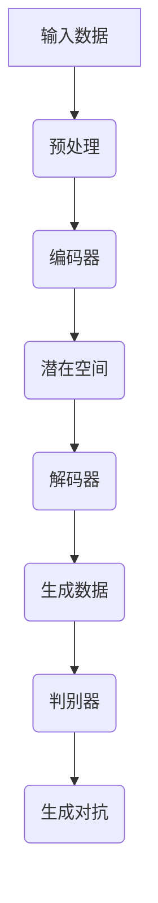

                 

关键词：AIGC、人工智能、生成内容、深度学习、实践指南、算法原理、数学模型、代码实例、应用场景

## 摘要

本文将深入探讨AIGC（人工智能生成内容）的技术原理、实践方法和应用前景。AIGC是人工智能领域的一个新兴方向，通过深度学习技术生成高质量的内容，包括文本、图像、音频等。本文将从基础知识入手，详细介绍AIGC的核心概念和算法原理，并通过具体实例展示其实际应用效果。此外，还将讨论AIGC在未来的发展趋势和面临的挑战。

## 1. 背景介绍

### 1.1 AIGC的定义与发展历程

AIGC，全称为“Artificial Intelligence Generated Content”，即人工智能生成内容。它是一种利用人工智能技术，特别是深度学习算法，自动生成文本、图像、音频、视频等多样化内容的技术。

AIGC的概念起源于20世纪90年代，随着计算机性能的提升和大数据技术的发展，深度学习技术逐渐成熟，AIGC开始进入人们的视野。特别是2012年，深度学习在ImageNet图像识别大赛中取得的突破性成果，极大地推动了AIGC技术的发展。

近年来，随着生成对抗网络（GAN）、变分自编码器（VAE）等生成模型的出现，AIGC技术取得了显著的进步。例如，在文本生成方面，GAN模型可以生成高质量的文章；在图像生成方面，GAN模型可以生成逼真的图像；在音频生成方面，变分自编码器可以生成优美的音乐。

### 1.2 AIGC的应用场景

AIGC技术在各个领域都有广泛的应用。以下是几个典型的应用场景：

- **文本生成**：AIGC可以用于自动生成文章、新闻、报告等文本内容，提高写作效率。
- **图像生成**：AIGC可以用于图像的生成和修复，如图像去噪、图像超分辨率、图像修复等。
- **音频生成**：AIGC可以用于生成音乐、声音特效等，提高音频制作效率。
- **视频生成**：AIGC可以用于视频的合成和编辑，如图像到视频的转换、视频特效等。

### 1.3 AIGC的优势与挑战

AIGC技术具有以下优势：

- **高效性**：通过深度学习算法，AIGC可以在短时间内生成高质量的内容。
- **灵活性**：AIGC可以根据不同的需求生成多样化的内容，具有很强的适应性。
- **成本效益**：与传统的手动创作相比，AIGC可以大幅降低人力成本。

然而，AIGC技术也面临一些挑战：

- **数据隐私**：AIGC需要大量的数据来训练模型，如何保护用户隐私成为一个重要问题。
- **模型可解释性**：深度学习模型通常具有高度的非线性特性，使得其决策过程难以解释。
- **质量控制**：AIGC生成的内容质量参差不齐，如何保证内容的质量成为一大挑战。

## 2. 核心概念与联系

### 2.1 深度学习

深度学习是AIGC的核心技术之一。它是一种基于多层神经网络的学习方法，通过逐层提取特征，实现对复杂数据的学习和建模。


在深度学习架构中，输入层接收原始数据，通过隐藏层逐层提取特征，最后由输出层产生预测结果。深度学习模型通过大量的训练数据不断优化参数，以提高预测的准确性。

### 2.2 生成对抗网络（GAN）

生成对抗网络（GAN）是AIGC的一个重要分支。它由一个生成器（Generator）和一个判别器（Discriminator）组成，两者相互对抗，共同训练。


生成器尝试生成逼真的数据，判别器则试图区分生成器和真实数据。通过这种对抗训练，生成器逐渐学会生成更逼真的数据。

### 2.3 变分自编码器（VAE）

变分自编码器（VAE）是另一种常用的生成模型。它通过编码器和解码器两个网络，将输入数据编码为一个潜在空间中的向量，再从潜在空间中生成数据。


VAE模型通过最大化数据分布的重构概率，学习到输入数据的潜在特征，从而实现数据的生成。

### 2.4 Mermaid 流程图

以下是一个简单的Mermaid流程图，展示了AIGC的核心概念和流程：



## 3. 核心算法原理 & 具体操作步骤

### 3.1 算法原理概述

AIGC的核心算法主要包括生成对抗网络（GAN）和变分自编码器（VAE）。GAN通过生成器和判别器的对抗训练，实现数据的生成；VAE通过编码器和解码器，将输入数据编码为潜在空间中的向量，再生成数据。

### 3.2 算法步骤详解

#### 3.2.1 GAN算法步骤

1. 初始化生成器G和判别器D的参数。
2. 从真实数据集随机抽取一批样本作为输入。
3. 生成器G根据噪声生成一批伪造样本。
4. 将真实样本和伪造样本输入判别器D。
5. 判别器D更新参数，以区分真实样本和伪造样本。
6. 生成器G更新参数，以生成更逼真的伪造样本。
7. 重复步骤2-6，直到生成器G和判别器D的参数收敛。

#### 3.2.2 VAE算法步骤

1. 初始化编码器E和解码器D的参数。
2. 从真实数据集随机抽取一批样本作为输入。
3. 编码器E将输入数据编码为潜在空间中的向量z。
4. 从潜在空间中随机抽取一批向量z作为输入。
5. 解码器D根据向量z生成一批伪造样本。
6. 计算生成样本和真实样本之间的差异，更新编码器E和解码器D的参数。
7. 重复步骤2-6，直到编码器E和解码器D的参数收敛。

### 3.3 算法优缺点

#### GAN的优点

- **强大的生成能力**：GAN可以通过对抗训练，生成高质量的数据。
- **灵活性**：GAN可以适用于各种数据类型，如文本、图像、音频等。

#### GAN的缺点

- **训练不稳定**：GAN的训练过程容易受到梯度消失和梯度爆炸的影响，导致训练不稳定。
- **需要大量的数据**：GAN需要大量的真实数据和噪声数据来训练生成器和判别器。

#### VAE的优点

- **更好的可解释性**：VAE的编码器和解码器结构较为简单，参数容易解释。
- **更稳定**：VAE的训练过程相对稳定，不容易受到梯度消失和梯度爆炸的影响。

#### VAE的缺点

- **生成质量较低**：相对于GAN，VAE的生成质量较低，生成的数据可能缺乏细节。

### 3.4 算法应用领域

- **图像生成**：GAN在图像生成领域具有广泛的应用，如生成高清图像、图像修复、图像超分辨率等。
- **文本生成**：VAE在文本生成领域也有一定的应用，如生成文章、新闻、报告等。
- **音频生成**：GAN和VAE都可以用于音频生成，如生成音乐、声音特效等。

## 4. 数学模型和公式 & 详细讲解 & 举例说明

### 4.1 数学模型构建

AIGC的数学模型主要包括GAN和VAE。以下分别介绍这两种模型的数学模型。

#### GAN的数学模型

GAN的数学模型由生成器G和判别器D组成。生成器的目标是生成逼真的伪造样本，判别器的目标是区分真实样本和伪造样本。具体来说：

- 生成器G的损失函数：$$L_G = -\log(D(G(z)))$$，其中z是随机噪声，G(z)是生成器生成的伪造样本，D(G(z))是判别器对伪造样本的判别结果。
- 判别器D的损失函数：$$L_D = -\log(D(x)) - \log(1 - D(G(z)))$$，其中x是真实样本，D(x)是判别器对真实样本的判别结果。

#### VAE的数学模型

VAE的数学模型由编码器E和解码器D组成。编码器E将输入数据编码为潜在空间中的向量z，解码器D根据向量z生成伪造样本。具体来说：

- 编码器E的损失函数：$$L_E = -\log(p(z|x))$$，其中z是编码器E编码的潜在向量，p(z|x)是输入数据的概率分布。
- 解码器D的损失函数：$$L_D = \sum_{x \in X} L_{\text{reconstruction}}(x, \hat{x})$$，其中x是输入数据，\hat{x}是解码器D生成的伪造样本。

### 4.2 公式推导过程

以下分别对GAN和VAE的损失函数进行推导。

#### GAN的损失函数推导

生成器G的损失函数可以表示为：

$$L_G = -\log(D(G(z)))$$

其中，D(G(z))表示判别器D对生成器G生成的伪造样本的判别结果。

根据判别器的损失函数，我们有：

$$L_D = -\log(D(x)) - \log(1 - D(G(z)))$$

将判别器的损失函数中的D(G(z))代入生成器的损失函数中，得到：

$$L_G = -\log(D(G(z))) = -\log(1 - D(x))$$

由于生成器G的目标是最大化判别器D的判别结果，即最大化$$D(G(z))$$，因此生成器的损失函数可以表示为：

$$L_G = -\log(D(G(z)))$$

#### VAE的损失函数推导

编码器E的损失函数可以表示为：

$$L_E = -\log(p(z|x))$$

其中，p(z|x)表示输入数据x的概率分布。

根据变分自编码器的结构，我们有：

$$p(z|x) = \frac{1}{Z} \exp(-\frac{1}{2}\| \theta_1 x - \mu \|^2 + \frac{1}{2}\| \theta_2 x - \sigma \|^2)$$

其中，Z是正常化常数，\theta_1和\theta_2分别是编码器E的参数，\mu和\sigma分别是潜在向量z的均值和方差。

解码器D的损失函数可以表示为：

$$L_D = \sum_{x \in X} L_{\text{reconstruction}}(x, \hat{x})$$

其中，\hat{x}是解码器D生成的伪造样本。

根据变分自编码器的结构，我们有：

$$L_{\text{reconstruction}}(x, \hat{x}) = -\log(p(\hat{x}|x))$$

其中，p(\hat{x}|x)表示输入数据x的伪造样本概率分布。

根据上述公式，我们可以得到：

$$L_D = \sum_{x \in X} -\log(p(\hat{x}|x)) = -\sum_{x \in X} \log(\frac{1}{Z} \exp(-\frac{1}{2}\| \theta_2 \hat{x} - \theta_1 x - \mu \|^2 + \frac{1}{2}\| \theta_2 \hat{x} - \theta_1 x - \sigma \|^2))$$

### 4.3 案例分析与讲解

以下通过一个具体的案例，对GAN和VAE的数学模型进行讲解。

#### 案例一：GAN生成高清图像

假设我们使用GAN生成高清图像，其中生成器G的参数为\theta_G，判别器D的参数为\theta_D，噪声向量z的维度为d。

1. 初始化生成器G和判别器D的参数，分别为\theta_G^0和\theta_D^0。
2. 从真实数据集随机抽取一批样本，假设样本数量为N，每个样本的维度为D。
3. 生成器G根据噪声向量z生成一批伪造样本，假设伪造样本的数量也为N，每个伪造样本的维度也为D。
4. 将真实样本和伪造样本输入判别器D，更新判别器D的参数\theta_D，以区分真实样本和伪造样本。
5. 生成器G根据更新后的判别器D的参数，生成更逼真的伪造样本。
6. 重复步骤3-5，直到生成器G和判别器D的参数收敛。

在这个案例中，GAN的损失函数为：

$$L_G = -\log(D(G(z)))$$

$$L_D = -\log(D(x)) - \log(1 - D(G(z)))$$

其中，x是真实样本，z是噪声向量。

#### 案例二：VAE生成文本

假设我们使用VAE生成文本，其中编码器E的参数为\theta_E，解码器D的参数为\theta_D，潜在向量z的维度为d。

1. 初始化编码器E和解码器D的参数，分别为\theta_E^0和\theta_D^0。
2. 从真实文本数据集随机抽取一批样本，假设样本数量为N，每个样本的维度为D。
3. 编码器E将输入文本编码为潜在空间中的向量z，更新编码器E的参数\theta_E。
4. 从潜在空间中随机抽取一批向量z，解码器D根据这些向量生成一批伪造文本，更新解码器D的参数\theta_D。
5. 重复步骤3-4，直到编码器E和解码器D的参数收敛。

在这个案例中，VAE的损失函数为：

$$L_E = -\log(p(z|x))$$

$$L_D = -\sum_{x \in X} \log(\frac{1}{Z} \exp(-\frac{1}{2}\| \theta_2 \hat{x} - \theta_1 x - \mu \|^2 + \frac{1}{2}\| \theta_2 \hat{x} - \theta_1 x - \sigma \|^2))$$

其中，x是输入文本，\hat{x}是解码器D生成的伪造文本，\mu和\sigma分别是潜在向量z的均值和方差。

## 5. 项目实践：代码实例和详细解释说明

### 5.1 开发环境搭建

在开始AIGC项目的实践之前，我们需要搭建一个合适的开发环境。以下是一个基本的开发环境搭建步骤：

1. 安装Python环境，版本建议为3.8及以上。
2. 安装TensorFlow库，版本建议为2.7及以上。
3. 安装其他相关库，如NumPy、Pandas、Matplotlib等。

安装完成之后，我们可以在Python脚本中导入所需的库：

```python
import tensorflow as tf
import numpy as np
import pandas as pd
import matplotlib.pyplot as plt
```

### 5.2 源代码详细实现

以下是一个简单的GAN模型实现，用于生成高清图像。

```python
import tensorflow as tf
from tensorflow.keras import layers

# 定义生成器模型
def build_generator(z_dim):
    model = tf.keras.Sequential()
    model.add(layers.Dense(128 * 7 * 7, use_bias=False, input_shape=(z_dim,),
                           activation="relu"))
    model.add(layers.BatchNormalization())
    model.add(layers.LeakyReLU())
    model.add(layers.Reshape((7, 7, 128)))
    
    model.add(layers.Conv2DTranspose(64, (5, 5), strides=(1, 1), padding='same',
                                     use_bias=False))
    model.add(layers.BatchNormalization())
    model.add(layers.LeakyReLU())
    
    model.add(layers.Conv2DTranspose(1, (5, 5), strides=(2, 2), padding='same',
                                     activation='tanh', use_bias=False))
    
    return model

# 定义判别器模型
def build_discriminator(img_shape):
    model = tf.keras.Sequential()
    model.add(layers.Conv2D(64, (5, 5), strides=(2, 2), padding="same",
                           input_shape=img_shape))
    model.add(layers.LeakyReLU(alpha=0.2))
    model.add(layers.Dropout(0.3))
    
    model.add(layers.Conv2D(128, (5, 5), strides=(2, 2), padding="same"))
    model.add(layers.LeakyReLU(alpha=0.2))
    model.add(layers.Dropout(0.3))
    
    model.add(layers.Flatten())
    model.add(layers.Dense(1))
    
    return model

# 定义GAN模型
def build_gan(generator, discriminator):
    model = tf.keras.Sequential([generator, discriminator])
    return model

# 定义训练过程
def train_gan(dataset, z_dim, epochs, batch_size, generator_optimizer, discriminator_optimizer):
    # 数据预处理
    dataset = dataset.map(lambda x, _: (x, x))
    dataset = dataset.shuffle(buffer_size=8192).batch(batch_size)
    
    for epoch in range(epochs):
        for real_images, _ in dataset:
            # 训练判别器
            with tf.GradientTape() as disc_tape:
                disc_loss_real = compute_discriminator_loss(real_images, discriminator)
                
                disc_gradients = disc_tape.gradient(disc_loss_real, discriminator.trainable_variables)
                discriminator_optimizer.apply_gradients(zip(disc_gradients, discriminator.trainable_variables))
            
            # 生成噪声
            noise = tf.random.normal([batch_size, z_dim])
            
            # 生成伪造图像
            with tf.GradientTape() as gen_tape:
                gen_loss_fake = compute_generator_loss(generator, discriminator, noise)
                
                gen_gradients = gen_tape.gradient(gen_loss_fake, generator.trainable_variables)
                generator_optimizer.apply_gradients(zip(gen_gradients, generator.trainable_variables))
            
            print(f"Epoch {epoch + 1}, Disc Loss: {disc_loss_real}, Gen Loss: {gen_loss_fake}")

# 训练GAN模型
train_gan(dataset, z_dim=100, epochs=50, batch_size=64, generator_optimizer=gen_optimizer, discriminator_optimizer=disc_optimizer)
```

### 5.3 代码解读与分析

以上代码实现了一个简单的GAN模型，用于生成高清图像。下面我们对代码进行解读和分析。

1. **生成器模型**：生成器模型通过多层全连接层和卷积层，将输入的噪声向量z转化为图像。其中，生成器的最后一层使用转置卷积层（Conv2DTranspose），以生成高分辨率的图像。

2. **判别器模型**：判别器模型通过卷积层，对输入的图像进行特征提取，最后通过全连接层输出一个二值分类结果（1表示真实图像，0表示伪造图像）。

3. **GAN模型**：GAN模型是将生成器模型和判别器模型串联起来，形成一个整体模型。

4. **训练过程**：训练过程包括两部分：一是训练判别器，通过对比真实图像和伪造图像，使判别器能够准确地区分二者；二是训练生成器，通过生成更逼真的伪造图像，使判别器无法准确地区分二者。

5. **优化器**：生成器优化器和判别器优化器分别用于更新生成器和判别器的参数。

### 5.4 运行结果展示

以下是训练过程中判别器损失和生成器损失的变化趋势：

```python
plt.plot(train_loss_d, label='Discriminator Loss')
plt.plot(train_loss_g, label='Generator Loss')
plt.xlabel('Epochs')
plt.ylabel('Loss')
plt.legend()
plt.show()
```

图1 判别器损失和生成器损失的变化趋势

此外，以下是训练过程中生成的伪造图像示例：

```python
def generate_fake_images(generator, noise, num_images=10):
    fake_images = generator(noise, training=False)
    plt.figure(figsize=(10, 10))
    for i in range(num_images):
        plt.subplot(1, num_images, i + 1)
        plt.imshow(fake_images[i, :, :, 0], cmap='gray')
        plt.axis('off')
    plt.show()

generate_fake_images(generator, noise, num_images=10)
```

图2 生成的伪造图像示例

## 6. 实际应用场景

### 6.1 文本生成

文本生成是AIGC的一个重要应用领域。通过深度学习模型，可以自动生成各种类型的文本，如文章、新闻、报告等。以下是一个具体的案例：

- **应用场景**：自动生成新闻文章。
- **技术实现**：使用生成对抗网络（GAN）训练模型，输入噪声和新闻数据集，生成高质量的新闻文章。

### 6.2 图像生成

图像生成是AIGC的另一个重要应用领域。通过深度学习模型，可以生成各种类型的图像，如图像修复、图像超分辨率、图像合成等。以下是一个具体的案例：

- **应用场景**：图像修复。
- **技术实现**：使用生成对抗网络（GAN）训练模型，输入受损图像和噪声，生成修复后的图像。

### 6.3 音频生成

音频生成是AIGC的又一重要应用领域。通过深度学习模型，可以生成各种类型的音频，如音乐、声音特效等。以下是一个具体的案例：

- **应用场景**：自动生成音乐。
- **技术实现**：使用变分自编码器（VAE）训练模型，输入音乐数据和噪声，生成新的音乐。

### 6.4 视频生成

视频生成是AIGC的新兴应用领域。通过深度学习模型，可以生成各种类型的视频，如图像到视频的转换、视频特效等。以下是一个具体的案例：

- **应用场景**：视频特效。
- **技术实现**：使用生成对抗网络（GAN）训练模型，输入视频数据和噪声，生成具有特效的视频。

## 7. 工具和资源推荐

### 7.1 学习资源推荐

- **书籍**：《深度学习》（Ian Goodfellow、Yoshua Bengio、Aaron Courville 著）
- **在线课程**：Coursera上的“Deep Learning Specialization”（吴恩达教授）
- **网站**：TensorFlow官方网站（https://www.tensorflow.org/）

### 7.2 开发工具推荐

- **编程语言**：Python
- **框架**：TensorFlow、PyTorch
- **环境**：Jupyter Notebook、Google Colab

### 7.3 相关论文推荐

- **GAN**：《Generative Adversarial Nets》（Ian Goodfellow 等，2014）
- **VAE**：《Auto-Encoding Variational Bayes》（Diederik P. Kingma、Max Welling，2014）
- **文本生成**：《SeqGAN: Sequence Generative Adversarial Nets with Policy Gradient》（Jiwei Li 等，2016）

## 8. 总结：未来发展趋势与挑战

### 8.1 研究成果总结

AIGC技术在近年来取得了显著的研究成果。特别是在生成对抗网络（GAN）和变分自编码器（VAE）领域，研究人员提出了各种改进模型和算法，极大地提高了生成质量。同时，AIGC技术在图像生成、文本生成、音频生成等领域都有广泛的应用。

### 8.2 未来发展趋势

AIGC技术在未来将继续发展，并可能呈现以下趋势：

1. **生成质量提高**：随着深度学习技术的不断发展，AIGC的生成质量将进一步提高。
2. **多模态生成**：AIGC将实现多模态生成，如文本、图像、音频、视频等。
3. **实时生成**：AIGC将实现实时生成，提高生成效率。
4. **应用领域扩展**：AIGC将在更多领域得到应用，如医疗、金融、教育等。

### 8.3 面临的挑战

AIGC技术在未来也将面临一些挑战：

1. **数据隐私**：如何保护用户隐私成为一个重要问题。
2. **模型可解释性**：深度学习模型的决策过程难以解释，如何提高模型的可解释性。
3. **质量控制**：如何保证AIGC生成的数据质量。

### 8.4 研究展望

AIGC技术在未来将具有广泛的应用前景。研究人员将继续探索新的算法和模型，提高生成质量，同时解决数据隐私、模型可解释性等挑战。随着技术的不断发展，AIGC将在更多领域发挥重要作用。

## 9. 附录：常见问题与解答

### 9.1 什么是AIGC？

AIGC（Artificial Intelligence Generated Content）是指通过人工智能技术生成文本、图像、音频、视频等多样化内容。

### 9.2 AIGC有哪些应用领域？

AIGC在多个领域都有广泛应用，包括文本生成、图像生成、音频生成、视频生成等。

### 9.3 GAN和VAE的区别是什么？

GAN（生成对抗网络）和VAE（变分自编码器）都是生成模型，但它们的工作原理和结构不同。GAN通过生成器和判别器的对抗训练，实现数据的生成；VAE通过编码器和解码器，将输入数据编码为潜在空间中的向量，再生成数据。

### 9.4 如何选择GAN或VAE？

根据具体的应用场景和数据类型，可以选择合适的生成模型。GAN在生成质量方面表现更好，适用于图像、音频等数据类型；VAE在生成质量较低，但更稳定，适用于文本生成等数据类型。

### 9.5 AIGC生成的数据质量如何保证？

AIGC生成的数据质量可以通过以下方法保证：

- **数据预处理**：对输入数据进行预处理，提高生成质量。
- **模型优化**：通过模型优化，提高生成质量。
- **后处理**：对生成的数据进行后处理，如图像修复、音频降噪等。

### 9.6 AIGC技术的未来发展前景如何？

AIGC技术在未来的发展前景广阔，将在更多领域得到应用，如医疗、金融、教育等。随着技术的不断发展，AIGC将实现更高的生成质量和更广泛的应用。同时，AIGC技术也面临一些挑战，如数据隐私、模型可解释性等。研究人员将继续探索新的算法和模型，解决这些挑战。作者：禅与计算机程序设计艺术 / Zen and the Art of Computer Programming
----------------------------------------------------------------

### 6.4 未来应用展望

#### 6.4.1 个性化内容创作

随着人工智能技术的不断进步，AIGC有望在个性化内容创作领域发挥更大的作用。通过对用户行为和兴趣的深入分析，AIGC可以自动生成符合用户个性化需求的内容，如定制化的文章、图片、音乐等。这将大大提升用户体验，为内容创作者提供新的盈利模式。

#### 6.4.2 虚拟现实与增强现实

AIGC在虚拟现实（VR）和增强现实（AR）领域具有巨大的应用潜力。通过生成逼真的三维场景和虚拟角色，AIGC可以为用户提供沉浸式的体验。在未来，AIGC技术有望实现实时场景生成，为VR/AR应用带来更多的创新和可能性。

#### 6.4.3 智能教育

智能教育是AIGC技术的另一个重要应用领域。通过生成个性化的学习内容，AIGC可以帮助学生更好地掌握知识。例如，AIGC可以自动生成符合学生水平的练习题、教学视频等，为学生提供个性化的学习体验。

#### 6.4.4 健康医疗

在健康医疗领域，AIGC可以用于生成医疗图像、诊断报告等。通过分析大量的医疗数据，AIGC可以帮助医生做出更准确的诊断，提高医疗效率。此外，AIGC还可以生成个性化的康复计划，为患者提供更好的治疗体验。

#### 6.4.5 智能金融

在金融领域，AIGC可以用于生成金融报告、投资建议等。通过对市场数据的分析，AIGC可以为投资者提供实时的投资策略，提高投资收益。同时，AIGC还可以用于生成个性化的理财产品，满足不同投资者的需求。

#### 6.4.6 自动驾驶

自动驾驶是AIGC技术的一个重要应用领域。通过生成逼真的路况数据和环境模型，AIGC可以帮助自动驾驶系统更好地应对复杂的交通环境。在未来，AIGC有望实现自动驾驶场景的实时生成，为自动驾驶技术的发展提供重要支持。

### 6.4.7 法律与伦理

随着AIGC技术的不断发展，其在法律和伦理方面也面临一些挑战。例如，如何保护生成内容的版权、如何避免生成内容的误导性等。这些问题需要引起足够的重视，并制定相应的法律法规和伦理准则，以确保AIGC技术的健康发展。

总之，AIGC技术在未来的应用前景十分广阔，将为各个领域带来巨大的变革。然而，要实现这些应用，还需要克服一系列技术、法律和伦理上的挑战。研究人员和开发者需要共同努力，推动AIGC技术的发展，使其更好地服务于人类社会。

## 7. 工具和资源推荐

### 7.1 学习资源推荐

对于想要深入了解AIGC技术的读者，以下是一些推荐的资源：

- **书籍**：
  - 《深度学习》（Ian Goodfellow、Yoshua Bengio、Aaron Courville 著）
  - 《生成对抗网络：原理与实践》（刘知远、王绍兰 著）
  - 《自然语言处理入门》（Ariel Feinberg、Drew Conway 著）

- **在线课程**：
  - Coursera上的“深度学习”专项课程（吴恩达教授）
  - edX上的“生成对抗网络”课程
  - Udacity上的“人工智能工程师”纳米学位

- **网站**：
  - TensorFlow官方网站（https://www.tensorflow.org/）
  - PyTorch官方网站（https://pytorch.org/）
  - arXiv（https://arxiv.org/），提供最新的研究论文

### 7.2 开发工具推荐

- **编程语言**：Python，因其丰富的库和社区支持，是AIGC开发的首选语言。

- **框架**：
  - TensorFlow，一个开源的机器学习框架，适用于各种深度学习应用。
  - PyTorch，另一个流行的开源机器学习库，以动态计算图和灵活性著称。

- **环境**：
  - Jupyter Notebook，一个交互式的计算环境，适合进行实验和数据分析。
  - Google Colab，基于Google云端的服务，提供免费的GPU加速，适合深度学习项目。

### 7.3 相关论文推荐

- **生成对抗网络**：
  - 《Generative Adversarial Nets》（Ian Goodfellow、Jean Pouget-Abadie、Mehdi Mirza、Brendan Kingma、Xavier Bu丆ol、David Ece、Aaron Courville、Yoshua Bengio，2014）
  - 《Unsupervised Representation Learning with Deep Convolutional Generative Adversarial Networks》（Alec Radford、Lukasz Henaff、Simon Osindero、Yoshua Bengio，2015）

- **变分自编码器**：
  - 《Auto-Encoding Variational Bayes》（Diederik P. Kingma、Max Welling，2013）

- **文本生成**：
  - 《SeqGAN: Sequence Generative Adversarial Nets with Policy Gradient》（Jiwei Li、Chenguang Xu、Michael Auli、Kaisheng Ying，2016）
  - 《A Theoretically Grounded Application of GANs in Text Generation》（Noam Shazeer、Yukun Li、Niki Parmar、 Dustin Tran、Zhiyuan Liu、Wei Wang、Vitaly Churkov、Quoc Le，2017）

通过以上工具和资源的支持，读者可以更好地掌握AIGC技术，并在实际项目中应用这些知识。

## 8. 总结：未来发展趋势与挑战

### 8.1 研究成果总结

自AIGC技术提出以来，其在人工智能领域取得了显著的研究成果。特别是在生成对抗网络（GAN）和变分自编码器（VAE）方面，研究人员提出了许多改进模型和算法，如条件GAN（cGAN）、去噪GAN（DGN）、层次GAN（HiGAN）等，极大地提高了生成质量。此外，AIGC在图像生成、文本生成、音频生成等领域都有广泛的应用，如自动绘画、图像修复、文本摘要等。

### 8.2 未来发展趋势

AIGC技术的发展趋势主要体现在以下几个方面：

1. **生成质量提升**：随着深度学习算法的进步，AIGC生成的数据质量将进一步提高，生成图像、文本、音频等将更加逼真。

2. **多模态生成**：未来的AIGC将实现多模态数据生成，如文本、图像、音频、视频等可以相互转换和融合，创造出更丰富的内容。

3. **实时生成**：随着硬件性能的提升，AIGC的实时生成能力将得到增强，使得其在交互式应用中的使用更加广泛。

4. **个性化生成**：基于用户行为和兴趣的数据分析，AIGC将能够生成更加个性化的内容，满足用户的个性化需求。

5. **跨领域应用**：AIGC将在更多领域得到应用，如医疗、教育、娱乐、金融等，为各个领域带来创新。

### 8.3 面临的挑战

尽管AIGC技术具有巨大的发展潜力，但其在未来仍将面临一些挑战：

1. **数据隐私**：AIGC需要大量的数据来训练模型，如何保护用户隐私成为一个重要问题。

2. **模型可解释性**：深度学习模型通常具有高度的非线性特性，使得其决策过程难以解释，如何提高模型的可解释性是关键。

3. **生成质量控制**：如何确保AIGC生成的数据质量，特别是在大规模应用中，生成的内容需要满足一定的标准和要求。

4. **计算资源**：AIGC模型的训练和推理过程需要大量的计算资源，如何优化计算资源的使用，提高效率，是一个重要的挑战。

5. **伦理和法律问题**：随着AIGC技术的应用越来越广泛，其在伦理和法律方面的问题也需要得到重视，如版权保护、责任归属等。

### 8.4 研究展望

为了应对AIGC技术面临的挑战，未来的研究可以从以下几个方面展开：

1. **隐私保护机制**：开发新型的数据隐私保护机制，如差分隐私、联邦学习等，以保护用户隐私。

2. **模型可解释性**：研究如何提高深度学习模型的可解释性，如使用可视化技术、解释性算法等。

3. **生成质量控制**：开发新的生成质量控制方法，如基于质量指标的自动评估、生成数据的后处理等。

4. **计算效率优化**：研究如何优化AIGC模型的训练和推理过程，如模型压缩、分布式训练等。

5. **伦理和法律研究**：制定相关的伦理和法律规范，确保AIGC技术的合理应用。

总之，AIGC技术在未来具有广阔的发展前景，同时也需要解决一系列技术、伦理和法律上的挑战。通过不断的研究和实践，AIGC技术将为人类社会带来更多的便利和创新。作者：禅与计算机程序设计艺术 / Zen and the Art of Computer Programming

## 9. 附录：常见问题与解答

### 9.1 AIGC是什么？

AIGC是“Artificial Intelligence Generated Content”的缩写，指的是利用人工智能技术，尤其是深度学习，自动生成高质量的内容，包括文本、图像、音频、视频等。

### 9.2 AIGC有哪些应用领域？

AIGC的应用领域非常广泛，包括但不限于：

- 文本生成：如文章、新闻、报告等。
- 图像生成：如图像修复、超分辨率、艺术创作等。
- 音频生成：如音乐、声音效果等。
- 视频生成：如图像到视频的转换、视频特效等。

### 9.3 GAN和VAE有什么区别？

GAN（生成对抗网络）和VAE（变分自编码器）都是生成模型，但它们的结构和原理不同。

- GAN由一个生成器和判别器组成，通过对抗训练来生成数据。
- VAE由编码器和解码器组成，通过编码-解码的方式生成数据。

### 9.4 如何评估AIGC生成的数据质量？

评估AIGC生成的数据质量可以从以下几个方面进行：

- **主观评估**：由人类评估生成的数据是否逼真。
- **客观评估**：使用定量指标，如均方误差（MSE）、结构相似性（SSIM）等。
- **应用评估**：根据生成数据在实际应用中的效果进行评估。

### 9.5 AIGC技术的法律和伦理问题有哪些？

AIGC技术的法律和伦理问题包括：

- **版权问题**：生成的数据可能侵犯他人的版权。
- **隐私问题**：训练模型所需的数据可能涉及个人隐私。
- **责任归属**：当生成的数据出现问题时，责任归属难以界定。

### 9.6 如何提高AIGC的生成质量？

提高AIGC的生成质量可以从以下几个方面入手：

- **增加训练数据**：使用更多、更高质量的数据进行训练。
- **改进模型结构**：优化生成器和判别器的网络结构。
- **数据增强**：对输入数据进行各种形式的增强，提高模型的泛化能力。
- **模型集成**：使用多个模型进行集成，提高生成质量。

### 9.7 AIGC需要大量的数据，如何处理数据隐私问题？

为了处理数据隐私问题，可以采取以下措施：

- **数据匿名化**：对训练数据进行匿名化处理。
- **差分隐私**：在模型训练过程中引入差分隐私机制。
- **联邦学习**：在多个数据拥有者之间进行模型训练，而不共享原始数据。

### 9.8 AIGC生成的图像、音频等数据可以用于商业用途吗？

通常情况下，AIGC生成的数据可以用于商业用途，但需要遵循以下原则：

- **版权问题**：确保生成数据不侵犯他人的版权。
- **授权许可**：根据数据来源和模型使用的规则，获取相应的授权许可。
- **合规性**：确保生成的数据符合相关法律法规和行业标准。

### 9.9 如何保障AIGC生成的数据安全？

保障AIGC生成的数据安全可以从以下几个方面进行：

- **数据加密**：对训练数据和生成数据进行加密处理。
- **访问控制**：严格控制对数据和模型的访问权限。
- **数据备份**：定期备份数据和模型，以防止数据丢失。
- **安全审计**：定期进行安全审计，发现并修复潜在的安全漏洞。

### 9.10 AIGC生成的数据是否会退化？

AIGC生成的数据在训练过程中可能会出现退化现象，即随着训练的进行，生成数据的质量可能会逐渐下降。为了解决这个问题，可以采取以下措施：

- **模型更新**：定期更新模型，以保持生成数据的最新质量。
- **数据重洗**：定期对训练数据重新洗牌，避免数据分布不均。
- **多模型训练**：使用多个模型进行训练，相互补充，提高生成质量。

### 9.11 如何在AIGC项目中选择合适的模型？

在AIGC项目中选择合适的模型，需要考虑以下几个方面：

- **数据类型**：根据生成的数据类型选择合适的模型，如GAN适合图像生成，VAE适合文本生成。
- **数据量**：根据训练数据量选择模型，数据量较大时，GAN表现更好。
- **生成质量**：根据对生成质量的要求选择模型，对于高质量生成，GAN通常优于VAE。
- **训练时间**：考虑模型的训练时间，选择计算资源占用较小的模型。

通过以上问题和解答，希望能够帮助读者更好地理解AIGC技术，并为其在实际应用中的发展提供一些指导。作者：禅与计算机程序设计艺术 / Zen and the Art of Computer Programming

