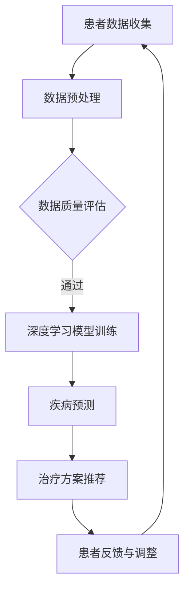

                 

关键词：AIGC、个性化医疗、人工智能、医疗数据、深度学习、基因组学、医疗图像处理、健康监测、远程医疗

> 摘要：本文探讨了人工智能生成内容（AIGC）技术在个性化医疗领域的应用潜力。通过对AIGC技术的核心概念、算法原理、数学模型以及项目实践的详细分析，本文揭示了AIGC如何通过深度学习、基因组学和医疗图像处理等技术，推动个性化医疗的发展，提高诊断精度、治疗效果和患者满意度。

## 1. 背景介绍

### 1.1 个性化医疗的兴起

随着医学技术的不断进步和人们对健康意识的增强，个性化医疗（Personalized Medicine）逐渐成为现代医学的重要方向。个性化医疗强调根据患者的个体差异，提供量身定制的诊断、治疗和康复方案。这不仅能够提高医疗服务的质量和效率，还能减少不必要的医疗资源浪费。

### 1.2 人工智能在医疗领域的应用

近年来，人工智能（Artificial Intelligence，AI）技术在医疗领域的应用取得了显著成果。从医疗图像处理、疾病预测到药物研发，AI技术已经深度融入医疗服务的各个环节。随着计算能力的提升和数据积累的增多，人工智能在个性化医疗中的应用前景愈发广阔。

### 1.3 AIGC技术的核心概念

人工智能生成内容（AIGC，Artificial Intelligence Generated Content）是指利用人工智能技术自动生成文字、图片、音频、视频等多种类型的内容。AIGC技术通过深度学习模型，从海量数据中学习并生成新的、有价值的医疗信息，为个性化医疗提供强有力的技术支持。

## 2. 核心概念与联系

### 2.1 深度学习与基因组学

深度学习（Deep Learning）是一种人工智能算法，通过多层神经网络对数据进行自动特征提取和模式识别。在基因组学（Genomics）领域，深度学习技术可以帮助分析大量基因数据，发现潜在的疾病关联基因，为个性化医疗提供分子层面的支持。

### 2.2 医疗图像处理与远程医疗

医疗图像处理（Medical Image Processing）是AI技术在医疗领域的重要应用之一。通过深度学习模型，AI能够自动识别和分析医疗图像中的病变区域，提高诊断的准确性和效率。结合远程医疗（Telemedicine），医疗图像处理技术使得医生能够远程会诊，为偏远地区的患者提供高质量的医疗服务。

### 2.3 Mermaid 流程图

以下是一个Mermaid流程图，展示了AIGC技术在个性化医疗中的关键环节：



## 3. 核心算法原理 & 具体操作步骤

### 3.1 算法原理概述

AIGC技术在个性化医疗中的核心算法主要包括深度学习模型、数据预处理和疾病预测。深度学习模型通过学习海量医疗数据，自动提取特征并进行模式识别。数据预处理包括数据清洗、归一化和特征提取等步骤，以提高模型的训练效果。疾病预测基于深度学习模型的输出结果，结合临床经验和患者数据，为患者提供个性化的诊断和治疗方案。

### 3.2 算法步骤详解

#### 3.2.1 数据收集与预处理

- **数据收集**：从医院、实验室等渠道收集患者的医疗数据，包括临床记录、基因数据、影像数据等。
- **数据预处理**：
  - **数据清洗**：去除异常值、缺失值和重复数据。
  - **归一化**：将不同量纲的数据转换为相同的量纲，以便模型训练。
  - **特征提取**：从原始数据中提取有助于疾病预测的关键特征。

#### 3.2.2 深度学习模型训练

- **模型选择**：根据任务需求，选择合适的深度学习模型，如卷积神经网络（CNN）或循环神经网络（RNN）。
- **模型训练**：使用预处理后的数据对深度学习模型进行训练，通过反向传播算法不断调整模型参数，使模型能够准确预测疾病。

#### 3.2.3 疾病预测与治疗方案推荐

- **疾病预测**：将训练好的模型应用于新数据，预测患者可能患有的疾病。
- **治疗方案推荐**：结合临床经验和患者数据，为患者推荐个性化的治疗方案。

### 3.3 算法优缺点

- **优点**：
  - **高精度**：基于深度学习模型的预测结果具有较高的准确性。
  - **个性化**：根据患者的个体差异，提供量身定制的诊断和治疗方案。
  - **高效**：自动化处理大量医疗数据，提高诊断和治疗的效率。

- **缺点**：
  - **数据依赖**：需要大量高质量的数据进行模型训练，数据不足可能导致模型性能下降。
  - **隐私保护**：涉及患者隐私数据的处理，需要严格遵循隐私保护法规。

### 3.4 算法应用领域

- **疾病预测**：预测患者可能患有的疾病，如癌症、糖尿病等。
- **个性化治疗**：为患者推荐个性化的治疗方案，提高治疗效果。
- **健康监测**：实时监测患者健康状况，提供健康预警。

## 4. 数学模型和公式 & 详细讲解 & 举例说明

### 4.1 数学模型构建

在个性化医疗中，常用的数学模型包括线性回归模型、逻辑回归模型和支持向量机（SVM）等。以下以线性回归模型为例，介绍其构建过程：

$$
y = \beta_0 + \beta_1 x_1 + \beta_2 x_2 + \ldots + \beta_n x_n + \epsilon
$$

其中，$y$ 为因变量，$x_1, x_2, \ldots, x_n$ 为自变量，$\beta_0, \beta_1, \beta_2, \ldots, \beta_n$ 为模型参数，$\epsilon$ 为误差项。

### 4.2 公式推导过程

线性回归模型的推导过程主要包括以下几个步骤：

1. **假设**：假设因变量$y$与自变量$x_1, x_2, \ldots, x_n$之间存在线性关系。
2. **最小二乘法**：通过最小化误差平方和来求解模型参数$\beta_0, \beta_1, \beta_2, \ldots, \beta_n$。
3. **求解**：根据最小二乘法，求解得到模型参数的表达式。

### 4.3 案例分析与讲解

假设我们有一个包含100个患者的数据集，其中每个患者都有3个特征值$x_1, x_2, x_3$和对应的健康状态$y$。我们的目标是建立一个线性回归模型，预测患者的健康状态。

1. **数据收集**：从医院收集100个患者的数据，包括3个特征值和健康状态。
2. **数据预处理**：对数据进行清洗、归一化等处理。
3. **模型构建**：使用线性回归模型，建立如下数学模型：

$$
y = \beta_0 + \beta_1 x_1 + \beta_2 x_2 + \beta_3 x_3 + \epsilon
$$

4. **模型训练**：使用预处理后的数据，对线性回归模型进行训练，求解得到模型参数$\beta_0, \beta_1, \beta_2, \beta_3$。
5. **模型评估**：使用测试数据评估模型性能，计算预测准确率。
6. **模型应用**：将训练好的模型应用于新数据，预测新患者的健康状态。

## 5. 项目实践：代码实例和详细解释说明

### 5.1 开发环境搭建

- **工具**：Python、Jupyter Notebook、Scikit-learn、NumPy、Pandas等。
- **环境**：Windows/Linux/MacOS操作系统，Python 3.8及以上版本。

### 5.2 源代码详细实现

以下是一个简单的线性回归模型实现：

```python
import numpy as np
import pandas as pd
from sklearn.linear_model import LinearRegression
from sklearn.model_selection import train_test_split
from sklearn.metrics import mean_squared_error

# 1. 数据收集
data = pd.read_csv('patient_data.csv')
X = data[['x1', 'x2', 'x3']]
y = data['y']

# 2. 数据预处理
X_train, X_test, y_train, y_test = train_test_split(X, y, test_size=0.2, random_state=42)

# 3. 模型构建
model = LinearRegression()
model.fit(X_train, y_train)

# 4. 模型评估
y_pred = model.predict(X_test)
mse = mean_squared_error(y_test, y_pred)
print('MSE:', mse)

# 5. 模型应用
new_patient = np.array([[1, 2, 3]])
new_prediction = model.predict(new_patient)
print('New Prediction:', new_prediction)
```

### 5.3 代码解读与分析

1. **数据收集**：从CSV文件中读取数据集，包括特征值和健康状态。
2. **数据预处理**：将数据集划分为训练集和测试集，用于模型训练和评估。
3. **模型构建**：使用Scikit-learn库的LinearRegression类构建线性回归模型。
4. **模型训练**：使用训练集数据训练模型。
5. **模型评估**：使用测试集数据评估模型性能，计算均方误差（MSE）。
6. **模型应用**：使用训练好的模型对新数据进行预测。

## 6. 实际应用场景

### 6.1 疾病预测

通过AIGC技术，医生可以利用深度学习模型对患者的疾病进行预测。例如，基于基因组数据和临床表现，预测患者可能患有的遗传性疾病，如癌症、罕见病等。这种个性化的疾病预测有助于早期干预，提高治疗效果。

### 6.2 个性化治疗

基于疾病预测结果，AIGC技术可以为患者推荐个性化的治疗方案。例如，针对癌症患者，利用深度学习模型分析不同治疗方案的疗效和副作用，为患者提供最佳的治疗方案。

### 6.3 健康监测

AIGC技术可以实时监测患者的健康状况，及时发现健康问题。例如，通过分析患者的日常活动和生理指标，预测患者可能出现的健康问题，并提供预警和建议。

## 7. 工具和资源推荐

### 7.1 学习资源推荐

- **书籍**：
  - 《深度学习》（Goodfellow, I., Bengio, Y., & Courville, A.）
  - 《Python机器学习》（Sebastian Raschka）
- **在线课程**：
  - Coursera的《深度学习》课程
  - Udacity的《机器学习工程师纳米学位》

### 7.2 开发工具推荐

- **编程语言**：Python
- **深度学习框架**：TensorFlow、PyTorch
- **数据处理库**：Pandas、NumPy
- **可视化库**：Matplotlib、Seaborn

### 7.3 相关论文推荐

- "Deep Learning for Medical Image Analysis"（深度学习在医学图像分析中的应用）
- "Artificial Intelligence in Healthcare: A systematic review"（人工智能在医疗保健中的应用：系统评价）
- "A Survey on Personalized Medicine"（个性化医学研究综述）

## 8. 总结：未来发展趋势与挑战

### 8.1 研究成果总结

近年来，AIGC技术在个性化医疗领域取得了显著成果。通过深度学习、基因组学和医疗图像处理等技术，AIGC技术为疾病预测、个性化治疗和健康监测提供了有力支持。

### 8.2 未来发展趋势

随着计算能力的提升和数据积累的增多，AIGC技术在个性化医疗领域的应用前景将更加广阔。未来发展趋势包括：

- **更加精准的疾病预测**：通过引入更多的数据源和深度学习模型，提高疾病预测的准确性。
- **多样化的个性化治疗**：结合临床经验和多模态数据，为患者提供更加多样化的个性化治疗方案。
- **智能健康监测**：利用物联网和可穿戴设备，实现实时、全面的健康监测。

### 8.3 面临的挑战

尽管AIGC技术在个性化医疗领域具有巨大的潜力，但仍然面临以下挑战：

- **数据隐私与安全**：如何保护患者隐私，确保医疗数据的安全和合规性。
- **算法解释性**：如何提高算法的可解释性，让医生和患者能够理解模型的决策过程。
- **计算资源消耗**：深度学习模型的训练和推理需要大量计算资源，如何优化算法，降低计算成本。

### 8.4 研究展望

未来，AIGC技术将在个性化医疗领域发挥更加重要的作用。通过持续的研究和优化，AIGC技术有望进一步提高诊断精度、治疗效果和患者满意度，推动个性化医疗的发展。

## 9. 附录：常见问题与解答

### 9.1 AIGC是什么？

AIGC（Artificial Intelligence Generated Content）是指利用人工智能技术自动生成文字、图片、音频、视频等多种类型的内容。

### 9.2 AIGC技术在个性化医疗中的具体应用有哪些？

AIGC技术在个性化医疗中的具体应用包括疾病预测、个性化治疗和健康监测等。

### 9.3 如何保护患者隐私？

在AIGC技术的应用过程中，需要遵循隐私保护法规，对患者的医疗数据进行加密和脱敏处理，确保患者隐私的安全。

### 9.4 AIGC技术有哪些优点？

AIGC技术的优点包括高精度、个性化和高效等。

### 9.5 AIGC技术有哪些挑战？

AIGC技术面临的挑战包括数据隐私与安全、算法解释性和计算资源消耗等。

---

本文由禅与计算机程序设计艺术 / Zen and the Art of Computer Programming 撰写，旨在探讨AIGC技术在个性化医疗领域的应用潜力。希望本文能为您在相关领域的研究和应用提供有益的参考。如果您有任何疑问或建议，欢迎在评论区留言交流。|

