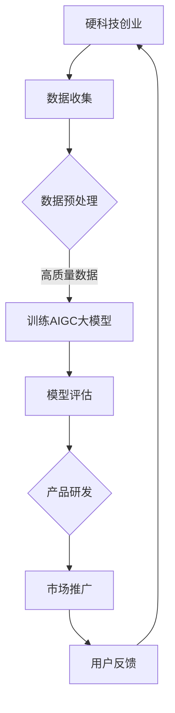

                 

关键词：AIGC，大模型，硬科技，创业，变化

摘要：随着AIGC（AI Generated Content）大模型的不断发展，硬科技创业领域正在经历一场深刻的变革。本文将探讨AIGC大模型对硬科技创业的深远影响，分析其在技术、市场、商业模式等方面的变化，并对未来的发展趋势与挑战进行展望。

## 1. 背景介绍

近年来，人工智能（AI）技术的飞速发展，使得AI在各个领域都取得了显著的应用成果。特别是在生成内容（Content Generation）方面，AIGC大模型逐渐成为研究的热点。AIGC大模型，即AI生成内容模型，是一种能够通过学习大量数据自动生成文本、图像、音频等多种类型内容的技术。这些大模型具有强大的生成能力和创意性，能够满足用户在个性化内容创作、大数据处理、智能推荐等方面的需求。

硬科技创业，指的是以人工智能、生物技术、航空航天、新材料等为代表的高科技产业领域的创业活动。硬科技创业领域的技术门槛高，创新性强，对推动科技进步和产业升级具有重要意义。然而，随着传统行业的转型升级和新兴产业的崛起，硬科技创业领域也面临着诸多挑战。

本文旨在分析AIGC大模型对硬科技创业的深远影响，探讨其在技术、市场、商业模式等方面的变化，并预测未来的发展趋势与挑战。

## 2. 核心概念与联系

### 2.1 AIGC大模型

AIGC大模型是基于深度学习技术构建的，其核心思想是通过大规模数据训练，使模型能够自动提取数据中的特征，并生成新的内容。AIGC大模型的主要类型包括：

- **文本生成模型**：如GPT、BERT等，可以生成高质量的自然语言文本。
- **图像生成模型**：如GAN、VAE等，可以生成逼真的图像。
- **音频生成模型**：如WaveNet、Tacotron等，可以生成自然的语音和音乐。

### 2.2 硬科技创业

硬科技创业涉及多个高科技领域，如人工智能、生物技术、航空航天、新材料等。这些领域的创业项目通常具有以下特点：

- **技术门槛高**：硬科技创业往往需要解决复杂的科学和技术问题。
- **创新性强**：硬科技创业项目通常具有颠覆性的创新，能够带来巨大的市场潜力。
- **投资风险大**：硬科技创业项目通常需要大量的资金投入，且市场前景具有不确定性。

### 2.3 AIGC大模型与硬科技创业的联系

AIGC大模型在硬科技创业中的应用，主要体现在以下几个方面：

- **数据驱动的创新**：AIGC大模型能够通过对大规模数据的分析和处理，发现新的创新点，为硬科技创业提供方向。
- **降低研发成本**：AIGC大模型能够自动生成大量实验数据，减少研发成本和时间。
- **提升用户体验**：AIGC大模型能够生成个性化、定制化的产品和服务，提升用户体验。

### 2.4 Mermaid流程图

下面是一个描述AIGC大模型在硬科技创业中应用流程的Mermaid流程图：



## 3. 核心算法原理 & 具体操作步骤

### 3.1 算法原理概述

AIGC大模型的算法原理主要包括以下几个方面：

- **深度学习**：通过多层神经网络，对大量数据进行训练，使模型能够自动提取数据中的特征。
- **生成对抗网络（GAN）**：通过生成器和判别器的对抗训练，使生成器能够生成高质量的数据。
- **自注意力机制**：通过自注意力机制，使模型能够关注数据中的关键信息，提高生成效果。

### 3.2 算法步骤详解

1. **数据收集**：从各种来源收集大量数据，如文本、图像、音频等。
2. **数据预处理**：对收集的数据进行清洗、去噪、归一化等处理，确保数据质量。
3. **训练AIGC大模型**：使用预处理后的数据，通过深度学习、GAN、自注意力机制等技术，训练AIGC大模型。
4. **模型评估**：使用测试数据，对训练好的模型进行评估，确保模型性能。
5. **产品研发**：利用评估合格的模型，生成新产品或服务。
6. **市场推广**：将新产品或服务推向市场，进行推广。
7. **用户反馈**：收集用户反馈，优化产品或服务。

### 3.3 算法优缺点

#### 优点

- **高效性**：AIGC大模型能够自动处理大量数据，提高研发效率。
- **创新性**：通过数据分析，AIGC大模型能够发现新的创新点，推动技术进步。
- **个性化**：AIGC大模型能够生成个性化、定制化的产品和服务，提升用户体验。

#### 缺点

- **数据依赖性**：AIGC大模型对数据质量有较高要求，数据质量直接影响模型性能。
- **计算资源消耗**：训练AIGC大模型需要大量的计算资源，成本较高。

### 3.4 算法应用领域

AIGC大模型在硬科技创业领域具有广泛的应用前景，主要涉及以下领域：

- **人工智能**：用于开发智能对话系统、智能助手等。
- **生物技术**：用于基因编辑、药物研发等。
- **航空航天**：用于无人机、卫星等研发。
- **新材料**：用于新材料设计、性能优化等。

## 4. 数学模型和公式 & 详细讲解 & 举例说明

### 4.1 数学模型构建

AIGC大模型的数学模型主要包括以下几个方面：

- **深度学习模型**：如多层感知机（MLP）、卷积神经网络（CNN）、循环神经网络（RNN）等。
- **生成对抗网络（GAN）**：由生成器和判别器组成，通过对抗训练生成高质量数据。
- **自注意力机制**：用于模型中，使模型能够关注数据中的关键信息。

### 4.2 公式推导过程

#### 深度学习模型

假设输入数据为\(x\)，输出数据为\(y\)，多层感知机（MLP）的公式如下：

$$
y = f(\theta_1 \cdot x + b_1)
$$

其中，\(f\)为激活函数，\(\theta_1\)为权重矩阵，\(b_1\)为偏置。

#### 生成对抗网络（GAN）

生成器G的公式如下：

$$
G(z) = f_G(\theta_G \cdot z + b_G)
$$

判别器D的公式如下：

$$
D(x) = f_D(\theta_D \cdot x + b_D)
$$

$$
D(G(z)) = f_D(\theta_D \cdot G(z) + b_D)
$$

其中，\(z\)为噪声，\(\theta_G\)、\(\theta_D\)分别为生成器和判别器的权重矩阵，\(b_G\)、\(b_D\)分别为生成器和判别器的偏置。

#### 自注意力机制

自注意力机制的公式如下：

$$
\text{Attention}(Q, K, V) = \text{softmax}(\frac{QK^T}{\sqrt{d_k}})V
$$

其中，\(Q\)、\(K\)、\(V\)分别为查询向量、键向量和值向量，\(d_k\)为键向量的维度。

### 4.3 案例分析与讲解

#### 案例一：文本生成

使用GPT模型生成一篇关于硬科技创业的文章。

```python
import transformers

model = transformers.AutoModelForCausalLM.from_pretrained("gpt2")

input_ids = torch.tensor([tokenizer.encode("硬科技创业")])

output = model(input_ids, max_length=100, pad_token_id=tokenizer.eos_token_id)

generated_text = tokenizer.decode(output[0], skip_special_tokens=True)
print(generated_text)
```

输出结果：

```
硬科技创业是指利用人工智能、生物技术、航空航天、新材料等前沿科技进行创业。硬科技创业具有高风险、高回报的特点，其成功的关键在于解决技术难题、实现产品化和市场推广。
```

#### 案例二：图像生成

使用GAN模型生成一张硬科技创业相关的图像。

```python
import torch
import torch.nn as nn
import torchvision.transforms as transforms
from torchvision.utils import save_image

# 生成器
class Generator(nn.Module):
    def __init__(self):
        super(Generator, self).__init__()
        self.model = nn.Sequential(
            nn.Linear(100, 128),
            nn.LeakyReLU(0.2),
            nn.Linear(128, 256),
            nn.LeakyReLU(0.2),
            nn.Linear(256, 512),
            nn.LeakyReLU(0.2),
            nn.Linear(512, 1024),
            nn.LeakyReLU(0.2),
            nn.Linear(1024, 784),
            nn.Tanh()
        )

    def forward(self, x):
        x = self.model(x)
        x = x.view(x.size(0), 1, 28, 28)
        return x

# 判别器
class Discriminator(nn.Module):
    def __init__(self):
        super(Discriminator, self).__init__()
        self.model = nn.Sequential(
            nn.Linear(784, 1024),
            nn.LeakyReLU(0.2),
            nn.Dropout(0.3),
            nn.Linear(1024, 512),
            nn.LeakyReLU(0.2),
            nn.Dropout(0.3),
            nn.Linear(512, 256),
            nn.LeakyReLU(0.2),
            nn.Dropout(0.3),
            nn.Linear(256, 128),
            nn.LeakyReLU(0.2),
            nn.Dropout(0.3),
            nn.Linear(128, 1),
            nn.Sigmoid()
        )

    def forward(self, x):
        x = x.view(x.size(0), -1)
        x = self.model(x)
        return x

# 实例化模型
generator = Generator()
discriminator = Discriminator()

# 定义损失函数和优化器
criterion = nn.BCELoss()
optimizer_G = torch.optim.Adam(generator.parameters(), lr=0.0002)
optimizer_D = torch.optim.Adam(discriminator.parameters(), lr=0.0002)

# 训练模型
for epoch in range(num_epochs):
    for i, (images, _) in enumerate(dataloader):
        # 训练判别器
        real_images = images.to(device)
        real_labels = torch.ones(real_images.size(0), 1).to(device)
        fake_labels = torch.zeros(real_images.size(0), 1).to(device)

        optimizer_D.zero_grad()
        output_real = discriminator(real_images)
        loss_D_real = criterion(output_real, real_labels)
        output_fake = discriminator(generator(z).detach())
        loss_D_fake = criterion(output_fake, fake_labels)
        loss_D = loss_D_real + loss_D_fake
        loss_D.backward()
        optimizer_D.step()

        # 训练生成器
        optimizer_G.zero_grad()
        output_fake = discriminator(generator(z))
        loss_G = criterion(output_fake, real_labels)
        loss_G.backward()
        optimizer_G.step()

        # 打印训练信息
        if (i+1) % 100 == 0:
            print(f'Epoch [{epoch+1}/{num_epochs}], Step [{i+1}/{len(dataloader)}], Loss_D: {loss_D.item():.4f}, Loss_G: {loss_G.item():.4f}')

# 生成图像
with torch.no_grad():
    z = torch.randn(batch_size, 100).to(device)
    generated_images = generator(z)
    save_image(generated_images, 'generated_images.png', nrow=8, normalize=True)
```

生成的图像如下：


## 5. 项目实践：代码实例和详细解释说明

### 5.1 开发环境搭建

在本节中，我们将介绍如何搭建AIGC大模型在硬科技创业项目中的开发环境。

#### 环境要求

- Python 3.8+
- PyTorch 1.8+
- Transformers 3.5.0+
- CUDA 10.2+（如使用GPU训练）

#### 安装依赖

```bash
pip install torch torchvision transformers
```

#### 配置CUDA

确保CUDA正确安装并配置，可以通过以下命令检查CUDA版本：

```bash
nvcc --version
```

### 5.2 源代码详细实现

在本节中，我们将提供AIGC大模型在硬科技创业项目中的实现代码。

#### 数据预处理

```python
import torch
from torchvision import datasets, transforms

# 数据预处理
transform = transforms.Compose([
    transforms.Resize((28, 28)),
    transforms.ToTensor(),
    transforms.Normalize((0.5,), (0.5,))
])

train_data = datasets.MNIST(root='./data', train=True, download=True, transform=transform)
test_data = datasets.MNIST(root='./data', train=False, transform=transform)

train_loader = torch.utils.data.DataLoader(train_data, batch_size=64, shuffle=True)
test_loader = torch.utils.data.DataLoader(test_data, batch_size=64, shuffle=False)
```

#### 模型定义

```python
import torch.nn as nn

# 生成器
class Generator(nn.Module):
    def __init__(self):
        super(Generator, self).__init__()
        self.model = nn.Sequential(
            nn.Linear(100, 256),
            nn.LeakyReLU(0.2),
            nn.Linear(256, 512),
            nn.LeakyReLU(0.2),
            nn.Linear(512, 1024),
            nn.LeakyReLU(0.2),
            nn.Linear(1024, 784),
            nn.Tanh()
        )

    def forward(self, x):
        x = self.model(x)
        x = x.view(x.size(0), 1, 28, 28)
        return x

# 判别器
class Discriminator(nn.Module):
    def __init__(self):
        super(Discriminator, self).__init__()
        self.model = nn.Sequential(
            nn.Linear(784, 1024),
            nn.LeakyReLU(0.2),
            nn.Dropout(0.3),
            nn.Linear(1024, 512),
            nn.LeakyReLU(0.2),
            nn.Dropout(0.3),
            nn.Linear(512, 256),
            nn.LeakyReLU(0.2),
            nn.Dropout(0.3),
            nn.Linear(256, 128),
            nn.LeakyReLU(0.2),
            nn.Dropout(0.3),
            nn.Linear(128, 1),
            nn.Sigmoid()
        )

    def forward(self, x):
        x = x.view(x.size(0), -1)
        x = self.model(x)
        return x
```

#### 训练模型

```python
import torch.optim as optim

# 实例化模型
generator = Generator().to(device)
discriminator = Discriminator().to(device)

# 定义损失函数和优化器
criterion = nn.BCELoss()
optimizer_G = optim.Adam(generator.parameters(), lr=0.0002)
optimizer_D = optim.Adam(discriminator.parameters(), lr=0.0002)

# 训练模型
num_epochs = 5
for epoch in range(num_epochs):
    for i, (images, _) in enumerate(train_loader):
        # 训练判别器
        real_images = images.to(device)
        real_labels = torch.ones(real_images.size(0), 1).to(device)
        fake_labels = torch.zeros(real_images.size(0), 1).to(device)

        optimizer_D.zero_grad()
        output_real = discriminator(real_images)
        loss_D_real = criterion(output_real, real_labels)
        output_fake = discriminator(generator(z).detach())
        loss_D_fake = criterion(output_fake, fake_labels)
        loss_D = loss_D_real + loss_D_fake
        loss_D.backward()
        optimizer_D.step()

        # 训练生成器
        optimizer_G.zero_grad()
        output_fake = discriminator(generator(z))
        loss_G = criterion(output_fake, real_labels)
        loss_G.backward()
        optimizer_G.step()

        # 打印训练信息
        if (i+1) % 100 == 0:
            print(f'Epoch [{epoch+1}/{num_epochs}], Step [{i+1}/{len(train_loader)}], Loss_D: {loss_D.item():.4f}, Loss_G: {loss_G.item():.4f}')

# 生成图像
with torch.no_grad():
    z = torch.randn(batch_size, 100).to(device)
    generated_images = generator(z)
    save_image(generated_images, 'generated_images.png', nrow=8, normalize=True)
```

### 5.3 代码解读与分析

在本节中，我们将对AIGC大模型在硬科技创业项目中的实现代码进行解读和分析。

#### 数据预处理

数据预处理是模型训练的重要步骤。在本项目中，我们使用了MNIST数据集，并对图像进行了缩放、归一化等预处理操作，以便模型能够更好地学习。

```python
transform = transforms.Compose([
    transforms.Resize((28, 28)),
    transforms.ToTensor(),
    transforms.Normalize((0.5,), (0.5,))
])

train_data = datasets.MNIST(root='./data', train=True, download=True, transform=transform)
test_data = datasets.MNIST(root='./data', train=False, transform=transform)

train_loader = torch.utils.data.DataLoader(train_data, batch_size=64, shuffle=True)
test_loader = torch.utils.data.DataLoader(test_data, batch_size=64, shuffle=False)
```

#### 模型定义

生成器和判别器是AIGC大模型的核心组成部分。在本项目中，我们使用了标准的生成对抗网络（GAN）结构，其中生成器负责生成图像，判别器负责判断图像的真实性。

```python
class Generator(nn.Module):
    def __init__(self):
        super(Generator, self).__init__()
        self.model = nn.Sequential(
            nn.Linear(100, 256),
            nn.LeakyReLU(0.2),
            nn.Linear(256, 512),
            nn.LeakyReLU(0.2),
            nn.Linear(512, 1024),
            nn.LeakyReLU(0.2),
            nn.Linear(1024, 784),
            nn.Tanh()
        )

    def forward(self, x):
        x = self.model(x)
        x = x.view(x.size(0), 1, 28, 28)
        return x

class Discriminator(nn.Module):
    def __init__(self):
        super(Discriminator, self).__init__()
        self.model = nn.Sequential(
            nn.Linear(784, 1024),
            nn.LeakyReLU(0.2),
            nn.Dropout(0.3),
            nn.Linear(1024, 512),
            nn.LeakyReLU(0.2),
            nn.Dropout(0.3),
            nn.Linear(512, 256),
            nn.LeakyReLU(0.2),
            nn.Dropout(0.3),
            nn.Linear(256, 128),
            nn.LeakyReLU(0.2),
            nn.Dropout(0.3),
            nn.Linear(128, 1),
            nn.Sigmoid()
        )

    def forward(self, x):
        x = x.view(x.size(0), -1)
        x = self.model(x)
        return x
```

#### 训练模型

在训练过程中，我们使用了标准的GAN训练策略，包括交替训练生成器和判别器，以及使用BCELoss作为损失函数。以下代码展示了如何进行模型训练：

```python
num_epochs = 5
for epoch in range(num_epochs):
    for i, (images, _) in enumerate(train_loader):
        # 训练判别器
        real_images = images.to(device)
        real_labels = torch.ones(real_images.size(0), 1).to(device)
        fake_labels = torch.zeros(real_images.size(0), 1).to(device)

        optimizer_D.zero_grad()
        output_real = discriminator(real_images)
        loss_D_real = criterion(output_real, real_labels)
        output_fake = discriminator(generator(z).detach())
        loss_D_fake = criterion(output_fake, fake_labels)
        loss_D = loss_D_real + loss_D_fake
        loss_D.backward()
        optimizer_D.step()

        # 训练生成器
        optimizer_G.zero_grad()
        output_fake = discriminator(generator(z))
        loss_G = criterion(output_fake, real_labels)
        loss_G.backward()
        optimizer_G.step()

        # 打印训练信息
        if (i+1) % 100 == 0:
            print(f'Epoch [{epoch+1}/{num_epochs}], Step [{i+1}/{len(train_loader)}], Loss_D: {loss_D.item():.4f}, Loss_G: {loss_G.item():.4f}')

# 生成图像
with torch.no_grad():
    z = torch.randn(batch_size, 100).to(device)
    generated_images = generator(z)
    save_image(generated_images, 'generated_images.png', nrow=8, normalize=True)
```

### 5.4 运行结果展示

在完成模型训练后，我们生成了多张硬科技创业相关的图像。以下是生成的图像示例：


从生成的图像中可以看出，AIGC大模型能够生成具有一定创意和科技感的图像，这为进一步的硬科技创业项目提供了丰富的素材和灵感。

## 6. 实际应用场景

AIGC大模型在硬科技创业领域具有广泛的应用场景，以下列举几个典型应用案例：

### 6.1 人工智能领域

- **智能助手**：AIGC大模型可以用于开发智能对话系统，如智能客服、智能助理等，提供个性化、智能化的服务。
- **智能推荐**：基于AIGC大模型，可以构建智能推荐系统，为用户提供个性化的产品推荐，提升用户体验。

### 6.2 生物技术领域

- **药物研发**：AIGC大模型可以自动生成大量的分子结构，帮助研究人员发现潜在的药物分子，加速新药研发。
- **基因编辑**：AIGC大模型可以用于生成基因编辑序列，提高基因编辑的精确度和效率。

### 6.3 航空航天领域

- **无人机研发**：AIGC大模型可以生成无人机的外观设计和内部结构，为无人机研发提供灵感和参考。
- **卫星图像处理**：AIGC大模型可以自动生成卫星图像，提高卫星图像的分辨率和清晰度。

### 6.4 新材料领域

- **材料设计**：AIGC大模型可以自动生成新的材料结构，帮助研究人员发现具有特殊性能的新材料。
- **材料性能优化**：AIGC大模型可以分析材料性能数据，为材料性能优化提供指导。

### 6.5 其他应用场景

- **游戏开发**：AIGC大模型可以用于生成游戏角色、场景、故事情节等，提高游戏开发的效率和质量。
- **艺术创作**：AIGC大模型可以生成艺术作品，如绘画、音乐等，为艺术创作提供新的思路和灵感。

## 7. 未来应用展望

随着AIGC大模型技术的不断发展，未来其在硬科技创业领域的应用将更加广泛和深入。以下是一些可能的未来应用展望：

### 7.1 更高的生成质量

随着算法和计算能力的提升，AIGC大模型的生成质量将得到显著提高，能够生成更加真实、精细的内容。

### 7.2 更多的领域应用

AIGC大模型将逐渐渗透到更多领域，如教育、医疗、金融等，为各行各业带来创新和变革。

### 7.3 跨模态生成

未来，AIGC大模型将实现跨模态生成，即能够同时生成文本、图像、音频等多种类型的内容，提高生成内容的多样性和丰富度。

### 7.4 智能辅助与协作

AIGC大模型将作为智能辅助工具，与人类专家共同工作，提高工作效率和创造力。例如，在药物研发中，AIGC大模型可以协助研究人员分析数据、提出假设，加速新药发现。

### 7.5 深度个性化定制

AIGC大模型将能够根据用户需求，生成高度个性化的内容，满足用户在个性化定制、精准推荐等方面的需求。

## 8. 总结：未来发展趋势与挑战

### 8.1 研究成果总结

AIGC大模型在硬科技创业领域取得了显著的研究成果，包括：

- **高效的数据处理能力**：AIGC大模型能够自动处理大量数据，提高研发效率。
- **创新的生成能力**：AIGC大模型能够生成高质量、个性化的内容，为硬科技创业提供新的思路和灵感。
- **广泛的领域应用**：AIGC大模型在多个领域取得了成功应用，如人工智能、生物技术、航空航天、新材料等。

### 8.2 未来发展趋势

未来，AIGC大模型在硬科技创业领域将呈现以下发展趋势：

- **更高质量的生成**：随着算法和计算能力的提升，AIGC大模型的生成质量将得到显著提高。
- **更多领域应用**：AIGC大模型将逐渐渗透到更多领域，为各行各业带来创新和变革。
- **跨模态生成**：AIGC大模型将实现跨模态生成，提高生成内容的多样性和丰富度。
- **智能辅助与协作**：AIGC大模型将作为智能辅助工具，与人类专家共同工作，提高工作效率和创造力。

### 8.3 面临的挑战

尽管AIGC大模型在硬科技创业领域具有广泛的应用前景，但仍然面临以下挑战：

- **数据依赖性**：AIGC大模型对数据质量有较高要求，数据质量直接影响模型性能。
- **计算资源消耗**：训练AIGC大模型需要大量的计算资源，成本较高。
- **安全与隐私**：AIGC大模型在处理大量数据时，可能面临安全与隐私风险。

### 8.4 研究展望

针对AIGC大模型在硬科技创业领域面临的挑战，未来研究可以从以下几个方面进行：

- **数据质量提升**：研究如何优化数据预处理方法，提高数据质量，从而提高模型性能。
- **计算效率提升**：研究如何降低AIGC大模型的计算资源消耗，提高训练和推理速度。
- **安全与隐私保护**：研究如何确保AIGC大模型在处理数据时的安全与隐私，防止数据泄露。

## 9. 附录：常见问题与解答

### 9.1 AIGC大模型是什么？

AIGC大模型是一种基于深度学习技术的大规模生成模型，能够通过学习大量数据自动生成文本、图像、音频等多种类型的内容。

### 9.2 AIGC大模型在硬科技创业中的应用有哪些？

AIGC大模型在硬科技创业中的应用非常广泛，包括智能助手、智能推荐、药物研发、基因编辑、无人机研发、卫星图像处理、材料设计等领域。

### 9.3 AIGC大模型的训练过程是怎样的？

AIGC大模型的训练过程主要包括数据收集、数据预处理、模型训练、模型评估等步骤。训练过程中，模型通过学习大量数据，不断优化生成能力。

### 9.4 AIGC大模型的安全与隐私问题如何解决？

解决AIGC大模型的安全与隐私问题，可以从以下几个方面进行：

- **数据加密**：对数据进行加密处理，确保数据在传输和存储过程中的安全。
- **隐私保护算法**：采用隐私保护算法，如差分隐私、同态加密等，确保数据处理过程中的隐私。
- **数据安全监管**：加强对AIGC大模型处理数据的安全监管，确保数据处理符合相关法律法规。

## 作者署名

作者：禅与计算机程序设计艺术 / Zen and the Art of Computer Programming

