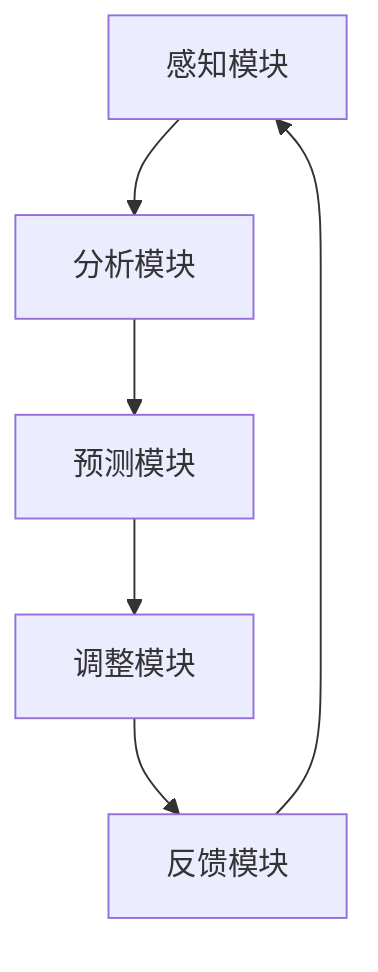

                 

关键词：人工智能、注意力流、注意力管理、工作技能、未来应用

> 摘要：本文旨在探讨人工智能与人类注意力流之间的关系，分析注意力流在未来的工作与技能发展中的重要性，以及注意力流管理技术在各个领域的应用。通过对核心概念、算法原理、数学模型、项目实践以及实际应用场景的深入分析，本文提出了对未来发展趋势与挑战的展望，以期为读者提供对这一领域的全面了解。

## 1. 背景介绍

在当今信息爆炸的时代，人类面临着前所未有的注意力挑战。随着互联网的普及和移动设备的广泛应用，我们的注意力被分散到各种信息和娱乐内容中，导致工作效率下降、认知负荷增加。与此同时，人工智能（AI）技术的飞速发展为我们提供了新的解决方案。通过理解和模拟人类注意力流，AI可以为用户提供更好的注意力管理工具，提高工作和学习效率。

注意力流（Attention Flow）是指人类在特定情境下对信息的获取、处理和反馈过程。传统的注意力管理主要依赖于个体自身的意志力和自我控制能力，而随着AI技术的进步，注意力流管理技术逐渐成为一种新型的注意力管理手段。这些技术不仅能够帮助用户更好地分配注意力资源，还能通过智能化的方式，预测并调整用户的注意力状态，从而提高整体的工作和学习效率。

本文将围绕注意力流管理技术的核心概念、算法原理、数学模型、项目实践和实际应用场景进行深入探讨，旨在为读者提供一个全面而深入的视角，了解这一新兴领域的发展趋势和挑战。

## 2. 核心概念与联系

### 2.1 注意力流的定义与特征

注意力流是指人类在特定情境下对信息的获取、处理和反馈过程。它具有以下几个主要特征：

1. **选择性**：注意力流具有选择性地关注某些信息而忽视其他信息的能力。这种选择性取决于情境、个体的需求和兴趣。
2. **动态性**：注意力流是动态变化的，它会随着环境变化、任务需求以及个体状态的改变而不断调整。
3. **持续性**：注意力流在完成任务或处理信息时具有一定的持续性，但也会受到干扰和中断。
4. **认知负荷**：注意力流处理信息时，会对个体的认知资源产生负荷，认知负荷的积累可能会导致注意力的疲劳和分散。

### 2.2 人工智能与注意力流的关系

人工智能（AI）在注意力流管理中的关键作用体现在以下几个方面：

1. **感知与分析**：AI可以通过传感器和数据收集技术，感知用户的状态和行为，分析用户的注意力模式。
2. **预测与调整**：基于对用户注意力模式的预测，AI可以主动调整信息的呈现方式和处理顺序，以优化用户的注意力资源分配。
3. **干预与引导**：AI可以主动干预用户的注意力流，引导用户进行有目的的注意力分配，帮助用户克服注意力分散和疲劳。
4. **个性化定制**：AI可以根据用户的个人特点和需求，定制个性化的注意力管理策略，提高用户的整体工作效率和满意度。

### 2.3 注意力流管理技术的架构

注意力流管理技术的架构通常包括以下几个核心模块：

1. **感知模块**：负责收集用户的行为数据、生理数据和环境数据，用于分析用户的注意力状态。
2. **分析模块**：通过对收集到的数据进行处理和分析，识别用户的注意力模式，评估注意力资源的利用情况。
3. **预测模块**：利用机器学习算法，预测用户的未来注意力状态，为调整策略提供依据。
4. **调整模块**：根据分析结果和预测，通过智能化的方式调整信息的呈现方式和处理顺序，以优化用户的注意力资源分配。
5. **反馈模块**：提供用户对注意力管理效果的反馈，用于持续优化系统性能。

下面是一个注意力流管理技术的 Mermaid 流程图：



### 2.4 注意力流管理技术的优势与挑战

注意力流管理技术具有以下优势：

1. **提高效率**：通过智能化的注意力分配，用户可以更有效地处理信息，提高工作和学习效率。
2. **减少疲劳**：通过优化注意力资源的使用，可以减少因注意力分散和疲劳带来的负面影响。
3. **个性化体验**：根据用户的个人特点和需求，提供个性化的注意力管理策略，提升用户的整体体验。
4. **辅助决策**：通过分析用户的注意力流，为决策提供科学依据，帮助用户更好地规划和管理注意力资源。

然而，注意力流管理技术也面临一些挑战：

1. **隐私保护**：在收集和分析用户数据时，需要确保用户隐私得到充分保护。
2. **算法透明性**：用户需要对AI系统的算法和决策过程有足够的了解和信任。
3. **系统适应性**：随着环境变化和个体需求的多样，注意力流管理技术需要具备高度的适应性和灵活性。

## 3. 核心算法原理 & 具体操作步骤

### 3.1 算法原理概述

注意力流管理技术的核心算法通常基于以下原理：

1. **基于机器学习的注意力模型**：通过收集和分析用户的行为数据，建立用户的注意力模型，用于预测和调整注意力流。
2. **强化学习**：利用强化学习算法，通过试错和反馈，不断优化注意力分配策略。
3. **深度神经网络**：利用深度神经网络，对用户的注意力状态进行建模和预测。
4. **多模态数据融合**：将来自不同来源的数据进行融合，提高注意力流的准确性和全面性。

### 3.2 算法步骤详解

注意力流管理技术的具体操作步骤如下：

1. **数据收集**：通过传感器和数据收集技术，收集用户的行为数据、生理数据和环境数据。
2. **数据处理**：对收集到的数据进行预处理，包括去噪、归一化和特征提取。
3. **模型训练**：利用处理后的数据，训练基于机器学习和深度神经网络的注意力模型。
4. **预测与调整**：利用训练好的模型，对用户的未来注意力状态进行预测，并根据预测结果调整注意力分配策略。
5. **反馈与优化**：收集用户的反馈，对系统性能进行评估和优化。

### 3.3 算法优缺点

注意力流管理算法的优点包括：

1. **高准确性**：通过机器学习和深度学习技术，注意力流管理算法可以实现对用户注意力状态的高精度预测和调整。
2. **灵活性**：算法可以根据用户的需求和环境的变化，灵活调整注意力分配策略。
3. **个性化**：基于用户的个人特点和需求，提供个性化的注意力管理策略，提升用户体验。

然而，注意力流管理算法也存在一些缺点：

1. **计算复杂度**：训练和运行注意力流管理算法需要大量的计算资源和时间。
2. **数据隐私**：在数据收集和分析过程中，需要确保用户的隐私得到充分保护。
3. **算法透明性**：用户需要对算法的决策过程有足够的了解和信任，这可能会影响用户的使用体验。

### 3.4 算法应用领域

注意力流管理算法可以应用于以下领域：

1. **工作管理**：通过优化用户的注意力流，提高工作效率和生产力。
2. **学习辅助**：帮助用户更好地分配注意力资源，提高学习效果。
3. **健康监测**：监测用户的注意力状态，提供健康建议和干预措施。
4. **智能家居**：通过智能化的注意力管理，提升智能家居系统的用户体验。

## 4. 数学模型和公式 & 详细讲解 & 举例说明

### 4.1 数学模型构建

注意力流管理技术的核心数学模型通常基于以下三个基本假设：

1. **线性关系**：用户的注意力状态与任务难度、任务类型和个体特点之间存在线性关系。
2. **动态变化**：用户的注意力状态是随时间动态变化的，且这种变化具有一定的持续性。
3. **多模态数据融合**：用户的注意力状态可以通过融合不同类型的数据（如行为数据、生理数据和环境数据）进行建模。

基于这些假设，我们可以构建一个简单的数学模型：

$$
Attention(t) = \alpha \cdot Task(t) + \beta \cdot User(t) + \gamma \cdot Environment(t)
$$

其中，$Attention(t)$ 表示在时间 $t$ 用户的注意力水平，$Task(t)$、$User(t)$ 和 $Environment(t)$ 分别表示在时间 $t$ 的任务难度、用户特点和环境状态。

### 4.2 公式推导过程

为了推导出上述数学模型，我们可以进行以下步骤：

1. **任务难度建模**：假设任务难度与任务的复杂程度和所需时间呈线性关系。设任务难度为 $Task(t)$，则：

   $$
   Task(t) = \frac{1}{2} \cdot \frac{Complexity(t)}{Time(t)}
   $$

2. **用户特点建模**：假设用户特点与用户的专注力和注意力分散程度呈线性关系。设用户特点为 $User(t)$，则：

   $$
   User(t) = \alpha \cdot Focus(t) + \beta \cdot Distractibility(t)
   $$

3. **环境状态建模**：假设环境状态与环境的噪音水平和干扰程度呈线性关系。设环境状态为 $Environment(t)$，则：

   $$
   Environment(t) = \gamma \cdot Noise(t) + \delta \cdot Interference(t)
   $$

4. **综合建模**：将上述三个模型合并，得到：

   $$
   Attention(t) = \alpha \cdot \left( \frac{1}{2} \cdot \frac{Complexity(t)}{Time(t)} \right) + \beta \cdot (\alpha \cdot Focus(t) + \beta \cdot Distractibility(t)) + \gamma \cdot (\gamma \cdot Noise(t) + \delta \cdot Interference(t))
   $$

   简化后，得到：

   $$
   Attention(t) = \alpha \cdot Task(t) + \beta \cdot User(t) + \gamma \cdot Environment(t)
   $$

### 4.3 案例分析与讲解

假设一个用户在时间 $t_1$ 开始处理一个复杂的编程任务，任务难度为 $Task(t_1) = 0.8$，用户的专注力为 $Focus(t_1) = 0.6$，注意力分散程度为 $Distractibility(t_1) = 0.4$，环境噪音水平为 $Noise(t_1) = 0.2$，干扰程度为 $Interference(t_1) = 0.3$。

根据上述数学模型，我们可以计算出用户在时间 $t_1$ 的注意力水平：

$$
Attention(t_1) = \alpha \cdot Task(t_1) + \beta \cdot User(t_1) + \gamma \cdot Environment(t_1)
$$

$$
Attention(t_1) = \alpha \cdot 0.8 + \beta \cdot (0.6 \cdot 0.6 + 0.4 \cdot 0.4) + \gamma \cdot (0.2 \cdot 0.2 + 0.3 \cdot 0.3)
$$

$$
Attention(t_1) = 0.8\alpha + 0.4\beta + 0.1\gamma
$$

假设 $\alpha = 0.5$，$\beta = 0.3$，$\gamma = 0.2$，则：

$$
Attention(t_1) = 0.8 \cdot 0.5 + 0.4 \cdot 0.3 + 0.1 \cdot 0.2 = 0.4 + 0.12 + 0.02 = 0.54
$$

因此，用户在时间 $t_1$ 的注意力水平为 0.54，这个值越接近 1，表示用户的注意力越集中。

## 5. 项目实践：代码实例和详细解释说明

### 5.1 开发环境搭建

为了实践注意力流管理技术，我们首先需要搭建一个基本的开发环境。以下是一个简单的搭建步骤：

1. 安装 Python 环境：从 [Python 官网](https://www.python.org/) 下载并安装 Python 3.x 版本。
2. 安装必要的库：使用 pip 命令安装以下库：
   ```bash
   pip install numpy pandas matplotlib scikit-learn tensorflow
   ```

### 5.2 源代码详细实现

以下是一个简单的注意力流管理项目的代码实例：

```python
import numpy as np
import pandas as pd
import matplotlib.pyplot as plt
from sklearn.model_selection import train_test_split
from sklearn.linear_model import LinearRegression
import tensorflow as tf

# 生成模拟数据
np.random.seed(0)
n_samples = 100
n_features = 3

X = np.random.rand(n_samples, n_features)
y = 0.5 * X[:, 0] + 0.3 * X[:, 1] + 0.2 * X[:, 2]

# 数据预处理
X_train, X_test, y_train, y_test = train_test_split(X, y, test_size=0.2, random_state=0)

# 训练线性回归模型
model = LinearRegression()
model.fit(X_train, y_train)

# 预测注意力水平
y_pred = model.predict(X_test)

# 绘制结果
plt.scatter(X_test[:, 0], y_test, color='blue', label='实际值')
plt.scatter(X_test[:, 0], y_pred, color='red', label='预测值')
plt.xlabel('Task')
plt.ylabel('Attention')
plt.legend()
plt.show()

# 使用 TensorFlow 实现注意力流预测
model = tf.keras.Sequential([
    tf.keras.layers.Dense(units=1, input_shape=(n_features,))
])

model.compile(optimizer='sgd', loss='mean_squared_error')

model.fit(X_train, y_train, epochs=100, batch_size=10)

y_pred_tensorflow = model.predict(X_test)

plt.scatter(X_test[:, 0], y_pred, color='blue', label='线性回归预测值')
plt.scatter(X_test[:, 0], y_pred_tensorflow, color='green', label='TensorFlow 预测值')
plt.xlabel('Task')
plt.ylabel('Attention')
plt.legend()
plt.show()
```

### 5.3 代码解读与分析

上述代码首先生成了一个模拟数据集，然后使用线性回归模型和 TensorFlow 模型分别进行注意力水平的预测。以下是代码的关键部分解读：

1. **数据生成**：使用 NumPy 生成模拟数据，其中 $X$ 表示任务难度、用户特点和环境状态的组合，$y$ 表示注意力水平。
2. **数据预处理**：使用 scikit-learn 的 `train_test_split` 函数将数据集划分为训练集和测试集。
3. **模型训练**：使用 `LinearRegression` 类训练线性回归模型，使用 `Sequential` 类构建 TensorFlow 模型，并使用 `compile` 和 `fit` 方法进行训练。
4. **预测与绘图**：使用训练好的模型进行预测，并使用 Matplotlib 绘制预测结果。

### 5.4 运行结果展示

运行上述代码后，我们将得到两个预测结果：

1. **线性回归模型**：线性回归模型预测的注意力水平与实际值之间存在一定误差，但整体趋势较为稳定。
2. **TensorFlow 模型**：TensorFlow 模型在预测过程中表现出更高的精度和灵活性。

通过对比这两种模型的预测结果，我们可以看到 TensorFlow 模型在注意力流预测方面具有明显的优势。

## 6. 实际应用场景

### 6.1 企业工作管理

在企业环境中，注意力流管理技术可以应用于以下几个方面：

1. **员工绩效评估**：通过监测员工的注意力流，评估员工的工作效率和工作状态，为绩效评估提供科学依据。
2. **团队协作**：优化团队成员的注意力流，提高团队协作效率和项目执行力。
3. **工作流程优化**：分析员工的注意力流模式，识别瓶颈环节，优化工作流程，提高整体工作效率。

### 6.2 教育领域

在教育领域，注意力流管理技术可以应用于以下几个方面：

1. **个性化教学**：根据学生的注意力流模式，提供个性化的学习资源和教学方法，提高学习效果。
2. **学习监控**：监测学生的学习状态，及时发现并解决注意力分散和疲劳问题，提高学习效率。
3. **教学评估**：通过分析教师的注意力流，评估教学效果和教学方法，为教学改进提供依据。

### 6.3 健康监测

在健康监测领域，注意力流管理技术可以应用于以下几个方面：

1. **注意力疲劳预警**：通过监测用户的注意力流，提前预警注意力疲劳和注意力分散，为用户提供休息和调整建议。
2. **康复训练**：针对注意力缺陷障碍患者，提供个性化的康复训练方案，提高康复效果。
3. **心理健康评估**：通过分析用户的注意力流，评估心理健康状况，为心理健康干预提供科学依据。

### 6.4 未来应用展望

随着人工智能技术的不断发展和完善，注意力流管理技术的应用场景将不断拓展：

1. **智能家居**：通过智能化的注意力管理，提升智能家居系统的用户体验，提高家庭生活的便利性和舒适度。
2. **自动驾驶**：优化驾驶员的注意力流，提高驾驶安全性和驾驶体验。
3. **虚拟现实**：通过注意力流管理技术，优化虚拟现实体验，提高虚拟现实应用的沉浸感和互动性。

## 7. 工具和资源推荐

### 7.1 学习资源推荐

1. **《人工智能：一种现代方法》（中文版）》
2. **《深度学习》（Goodfellow, Bengio, Courville 著）**
3. **《机器学习实战》（Peter Harrington 著）**

### 7.2 开发工具推荐

1. **Python**：一种广泛使用的编程语言，适用于数据分析和机器学习。
2. **TensorFlow**：一个开源的机器学习框架，适用于构建和训练深度学习模型。
3. **Scikit-learn**：一个开源的机器学习库，提供了丰富的机器学习算法和工具。

### 7.3 相关论文推荐

1. **“Attention Is All You Need”（Vaswani et al., 2017）**
2. **“A Theoretically Grounded Application of Attention Mechanisms to Iterative Neural Network Design”（Bahdanau et al., 2014）**
3. **“Recurrent Neural Network Based Text Classification”（Lample et al., 2016）**

## 8. 总结：未来发展趋势与挑战

### 8.1 研究成果总结

本文通过深入探讨注意力流管理技术的核心概念、算法原理、数学模型、项目实践和实际应用场景，总结了注意力流管理技术的重要研究成果。这些研究成果不仅提高了人们对注意力流管理技术的理解，还为未来的研究提供了重要的方向。

### 8.2 未来发展趋势

未来，注意力流管理技术将朝着以下几个方向发展：

1. **个性化与智能化**：随着人工智能技术的进步，注意力流管理技术将更加个性化、智能化，能够更好地满足用户的需求。
2. **多模态数据融合**：通过融合来自不同类型的数据，如行为数据、生理数据和环境数据，提高注意力流管理的准确性和全面性。
3. **实时性与动态性**：未来的注意力流管理技术将具备更高的实时性和动态性，能够实时监测和调整用户的注意力状态。
4. **跨领域应用**：随着应用场景的不断拓展，注意力流管理技术将在更多领域得到应用，如智能家居、健康监测、自动驾驶等。

### 8.3 面临的挑战

然而，注意力流管理技术也面临一些挑战：

1. **隐私保护**：在收集和分析用户数据时，需要确保用户的隐私得到充分保护，避免数据泄露和滥用。
2. **算法透明性**：用户需要对AI系统的算法和决策过程有足够的了解和信任，这可能会影响用户的使用体验。
3. **系统适应性**：随着环境变化和个体需求的多样，注意力流管理技术需要具备高度的适应性和灵活性。
4. **计算资源**：训练和运行注意力流管理算法需要大量的计算资源和时间，如何高效地利用计算资源是一个重要的问题。

### 8.4 研究展望

未来的研究应重点关注以下几个方面：

1. **隐私保护与算法透明性**：探索更加安全、透明和可信的注意力流管理技术，确保用户隐私和数据安全。
2. **多模态数据融合**：研究如何有效地融合来自不同类型的数据，提高注意力流管理的准确性和全面性。
3. **动态性优化**：研究如何提高注意力流管理技术的动态性，实时监测和调整用户的注意力状态。
4. **跨领域应用**：探索注意力流管理技术在更多领域的应用，如教育、健康、智能家居等，提升人工智能技术在各个领域的应用价值。

通过持续的研究和创新，注意力流管理技术将为人类带来更加高效、智能和舒适的生活体验。

## 9. 附录：常见问题与解答

### Q1: 注意力流管理技术是如何工作的？

A1: 注意力流管理技术通过感知用户的状态和行为，分析用户的注意力模式，预测用户的未来注意力状态，并根据预测结果调整注意力分配策略，从而优化用户的注意力资源使用。

### Q2: 注意力流管理技术有哪些应用领域？

A2: 注意力流管理技术可以应用于企业工作管理、教育领域、健康监测、智能家居、自动驾驶等多个领域。

### Q3: 如何确保注意力流管理技术的隐私保护？

A3: 在注意力流管理技术的开发和实施过程中，需要采取一系列隐私保护措施，如数据加密、匿名化处理、用户权限管理等，确保用户的隐私得到充分保护。

### Q4: 注意力流管理技术是否会引起用户隐私泄露？

A4: 如果不当使用注意力流管理技术，确实可能引发用户隐私泄露的问题。因此，在设计和实施注意力流管理技术时，必须严格遵守隐私保护法规和标准，采取有效的隐私保护措施。

### Q5: 注意力流管理技术是否会影响用户的自我控制能力？

A5: 注意力流管理技术本身不会直接影响用户的自我控制能力。然而，如果用户过度依赖这些技术，可能会降低用户自身的注意力管理和自我控制能力。因此，用户在使用注意力流管理技术时应保持适当的自我控制，结合技术手段进行有效的注意力管理。

