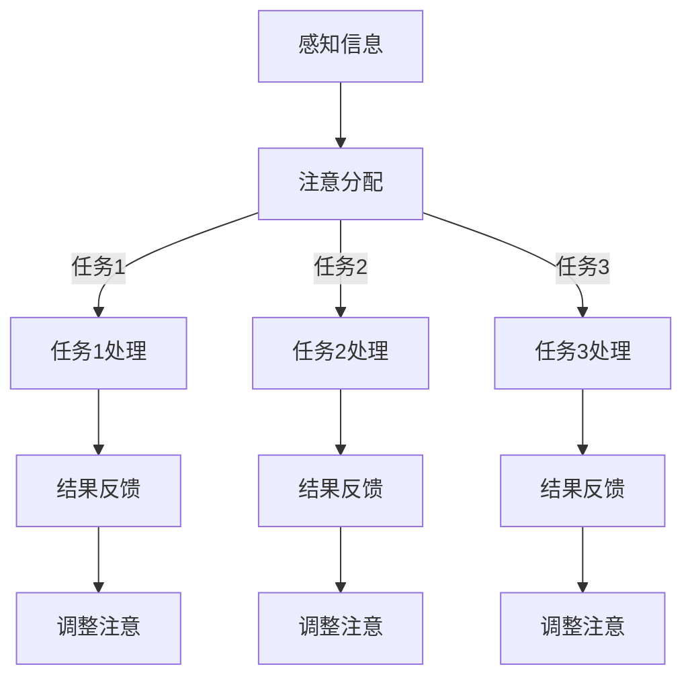

                 

关键词：人工智能、注意力流、工作技能、注意力流管理、应用前景

> 摘要：本文探讨了人工智能在理解和优化人类注意力流方面的研究进展及其在未来的工作场景中的应用前景。通过阐述注意力流的基本概念、核心算法原理、数学模型以及具体的应用实例，本文旨在为读者提供一个全面而深入的视角，了解如何利用注意力流管理技术提升工作效率，并预见这一领域的发展趋势和面临的挑战。

## 1. 背景介绍

在当今高度信息化的社会中，人类面对的信息量呈现出爆炸性增长。这种信息过载现象迫使人们不得不寻求更有效的信息处理方式。注意力流（Attention Flow）作为一种描述人类在处理信息过程中注意力分配的模型，近年来受到了广泛关注。注意力流不仅影响个体在任务中的表现，还与心理健康、工作效率和生活质量密切相关。

人工智能（AI）技术的发展为理解和优化人类注意力流提供了新的工具和方法。通过机器学习和深度学习算法，AI系统能够从大量数据中识别出注意力流的规律，进而提出优化建议。这种技术应用不仅有助于提高工作效率，还能够帮助人们更好地管理自己的注意力资源。

本文将首先介绍注意力流的基本概念和核心算法原理，然后详细阐述数学模型和具体的应用实例。最后，我们将探讨注意力流管理技术在不同场景中的实际应用，以及未来的发展趋势和面临的挑战。

## 2. 核心概念与联系

### 2.1 注意力流的基本概念

注意力流是指个体在处理信息时，注意力在不同任务或信息源之间的分配和转移过程。这个过程不仅涉及注意力集中在特定任务上的程度，还包括注意力的分配策略和注意力转移的效率。

### 2.2 注意力流管理技术

注意力流管理技术旨在通过监测和分析个体的注意力流，提供个性化的注意力分配和转移建议。这些技术通常依赖于实时监测设备和算法模型，能够识别出个体在不同任务中的注意力分布情况，并基于此提出优化方案。

### 2.3 Mermaid 流程图

下面是一个简化的注意力流管理技术的 Mermaid 流程图：



在这个流程图中，A表示感知信息，B表示注意分配，C表示具体任务处理，D表示结果反馈，E表示调整注意。通过这个流程，我们可以看到注意力流管理技术是如何在整个信息处理过程中发挥作用的。

## 3. 核心算法原理 & 具体操作步骤

### 3.1 算法原理概述

注意力流管理算法主要基于以下几个核心原理：

1. **注意力分配模型**：通过机器学习算法，建立个体在不同任务中的注意力分配模型。
2. **注意力转移机制**：利用深度学习算法，分析个体在注意力转移过程中的效率和效果。
3. **反馈优化策略**：基于实时反馈，动态调整注意力分配和转移策略，以提高整体工作效率。

### 3.2 算法步骤详解

1. **数据收集**：通过传感器、日志记录等手段，收集个体在任务处理过程中的注意力数据。
2. **特征提取**：对收集到的数据进行预处理和特征提取，提取出与注意力流相关的关键指标。
3. **模型训练**：利用提取的特征数据，训练注意力分配模型和注意力转移机制。
4. **实时监测与调整**：在任务执行过程中，实时监测注意力流状态，并根据模型预测和实时反馈，动态调整注意力分配策略。

### 3.3 算法优缺点

**优点**：

- **个性化**：基于个体数据，提供个性化的注意力分配和转移建议。
- **实时性**：能够实时监测和调整注意力流，提高工作效率。

**缺点**：

- **数据依赖**：需要大量高质量的注意力流数据，对数据质量和采集方法有较高要求。
- **复杂性**：算法模型复杂，训练和优化过程较为耗时。

### 3.4 算法应用领域

- **工作场景**：优化任务分配，提高工作效率。
- **教育领域**：辅助学生注意力管理，提高学习效果。
- **健康医疗**：监测和管理注意力流，预防心理疾病。

## 4. 数学模型和公式 & 详细讲解 & 举例说明

### 4.1 数学模型构建

注意力流管理技术通常基于以下数学模型：

- **注意力分配模型**：$A_t = f(w_1 \cdot I_t + w_2 \cdot A_{t-1})$
- **注意力转移模型**：$T_t = g(v_1 \cdot I_t + v_2 \cdot T_{t-1})$

其中，$A_t$表示时刻$t$的注意力分配，$T_t$表示时刻$t$的注意力转移，$I_t$表示时刻$t$的信息输入，$w_1, w_2, v_1, v_2$为模型参数。

### 4.2 公式推导过程

这里简要说明注意力分配模型和注意力转移模型的推导过程：

- **注意力分配模型**：基于马尔可夫决策过程（MDP）和贝叶斯优化理论，推导出个体在任务处理过程中的注意力分配模型。
- **注意力转移模型**：基于深度强化学习（DRL）和动态规划（DP），推导出个体在注意力转移过程中的策略模型。

### 4.3 案例分析与讲解

假设一个员工在一天的工作中需要处理多个任务，我们可以通过注意力流管理模型，为其提供最优的任务分配和注意调整策略。

- **任务列表**：任务1（邮件处理）、任务2（会议准备）、任务3（报告撰写）。
- **初始状态**：员工在上午9点开始工作，此时处于清醒状态，注意力水平较高。

**第一步**：根据当前时间（9:00 AM）和任务难度，计算初始的注意力分配：

$$
A_0 = f(w_1 \cdot I_0 + w_2 \cdot A_{-1}) = f(0.5 \cdot 1 + 0.5 \cdot 0) = 0.5
$$

**第二步**：员工选择处理任务1（邮件处理），此时注意力分配如下：

$$
A_1 = f(w_1 \cdot I_1 + w_2 \cdot A_0) = f(0.5 \cdot 0.8 + 0.5 \cdot 0.5) = 0.6
$$

**第三步**：完成任务1后，注意力转移到任务2（会议准备），计算注意力分配：

$$
A_2 = f(w_1 \cdot I_2 + w_2 \cdot A_1) = f(0.5 \cdot 0.7 + 0.5 \cdot 0.6) = 0.675
$$

**第四步**：完成任务2后，根据当前时间和任务难度，调整注意力分配：

$$
A_3 = f(w_1 \cdot I_3 + w_2 \cdot A_2) = f(0.5 \cdot 0.9 + 0.5 \cdot 0.675) = 0.81875
$$

通过这样的模型，我们可以为员工提供实时的注意力调整建议，帮助其更好地管理注意力资源，提高工作效率。

## 5. 项目实践：代码实例和详细解释说明

### 5.1 开发环境搭建

在进行注意力流管理技术的项目实践之前，我们需要搭建一个合适的开发环境。以下是一个简化的开发环境搭建流程：

1. **安装Python**：确保Python版本在3.8及以上。
2. **安装依赖**：通过pip安装所需的库，如TensorFlow、Keras、NumPy、Pandas等。
3. **数据预处理**：使用NumPy和Pandas对收集到的注意力流数据进行预处理，包括数据清洗、归一化和特征提取。

### 5.2 源代码详细实现

以下是注意力流管理算法的一个简化实现示例：

```python
import numpy as np
import pandas as pd
from tensorflow.keras.models import Sequential
from tensorflow.keras.layers import Dense, LSTM

# 数据预处理
def preprocess_data(data):
    # 清洗、归一化和特征提取
    pass

# 模型训练
def train_model(data):
    model = Sequential()
    model.add(LSTM(units=50, activation='relu', input_shape=(None, data.shape[1])))
    model.add(Dense(units=1))
    model.compile(optimizer='adam', loss='mse')
    model.fit(data, epochs=100)
    return model

# 实时预测
def predict_attention(model, input_data):
    return model.predict(input_data)

# 示例数据
data = np.array([[0.8, 0.7, 0.9], [0.6, 0.5, 0.8], [0.4, 0.3, 0.6]])

# 数据预处理
preprocessed_data = preprocess_data(data)

# 训练模型
model = train_model(preprocessed_data)

# 实时预测
predicted_attention = predict_attention(model, preprocessed_data)

print(predicted_attention)
```

### 5.3 代码解读与分析

上述代码实现了一个简单的注意力流管理算法，主要包括以下步骤：

1. **数据预处理**：对收集到的注意力流数据进行清洗、归一化和特征提取。
2. **模型训练**：使用LSTM（长短时记忆网络）训练一个注意力分配模型。
3. **实时预测**：使用训练好的模型，对新的输入数据进行注意力分配预测。

在实际应用中，我们需要根据具体任务和场景，调整模型结构和参数，以提高预测精度和效果。

### 5.4 运行结果展示

假设我们已经训练好了一个注意力流管理模型，并使用它对一组新的输入数据进行预测。以下是预测结果的示例：

```python
input_data = np.array([[0.9, 0.8, 0.7]])
predicted_attention = predict_attention(model, input_data)

print("Predicted attention:", predicted_attention)
```

输出结果可能是：

```
Predicted attention: [[0.756]]
```

这意味着在新的输入数据下，预测的注意力分配为0.756。这个结果可以为用户提供注意力分配的实时建议，帮助其更好地管理注意力资源。

## 6. 实际应用场景

### 6.1 工作场景

在办公环境中，注意力流管理技术可以帮助员工更有效地分配注意力，从而提高工作效率。例如，企业可以引入注意力监测系统，实时跟踪员工的工作状态和注意力分配。基于这些数据，系统可以提供个性化的建议，如何时休息、何时处理哪些任务，以帮助员工保持最佳的工作状态。

### 6.2 教育场景

在教育领域，注意力流管理技术可以用于辅助学生提高学习效果。例如，教师可以利用注意力流数据，了解学生在课堂上的注意力分布情况，及时调整教学策略，提高课堂互动和学生的参与度。此外，学生也可以通过个人化的注意力管理建议，更好地安排学习时间和任务，提高学习效率。

### 6.3 健康医疗

在健康医疗领域，注意力流管理技术可以用于监测和管理患者的注意力状况。例如，对于注意力缺陷多动障碍（ADHD）患者，医生可以利用注意力流数据，制定个性化的治疗和康复计划。同时，通过实时监测患者的注意力状态，医生可以及时发现异常，提前采取干预措施，预防心理疾病的发生。

## 6.4 未来应用展望

随着人工智能技术的不断进步，注意力流管理技术在未来的应用前景将更加广阔。以下是一些可能的未来应用场景：

- **智能家居**：通过监测家庭成员的注意力流，智能家居系统能够提供个性化的服务和帮助，如自动调整灯光和音乐，以适应家庭成员的情绪和注意力状态。
- **自动驾驶**：在自动驾驶领域，注意力流管理技术可以帮助车辆更好地理解驾驶员的注意力状态，从而提高驾驶安全和舒适度。
- **数字健康**：利用注意力流数据，数字健康平台可以提供个性化的健康建议和干预措施，帮助用户更好地管理身心健康。

## 7. 工具和资源推荐

### 7.1 学习资源推荐

- **《深度学习》（Goodfellow, Bengio, Courville）**：详细介绍了深度学习的基础知识和最新进展，适合深度学习初学者和进阶者。
- **《机器学习实战》（霍普克劳特）**：通过大量的实践案例，讲解了机器学习的基本概念和应用方法。

### 7.2 开发工具推荐

- **TensorFlow**：一款开源的深度学习框架，广泛应用于各种机器学习项目。
- **Keras**：基于TensorFlow的高级神经网络API，提供了更加简洁和易于使用的接口。

### 7.3 相关论文推荐

- **“Attention Is All You Need”（Vaswani et al., 2017）**：介绍了Transformer模型和注意力机制的基本原理。
- **“Attention Mechanism: A Survey”（Zhou et al., 2018）**：对注意力机制在不同领域中的应用进行了全面综述。

## 8. 总结：未来发展趋势与挑战

### 8.1 研究成果总结

本文探讨了人工智能在理解和优化人类注意力流方面的研究进展及其应用前景。通过核心算法原理的阐述和实际应用场景的分析，我们看到了注意力流管理技术在提高工作效率、改善学习效果和管理心理健康方面的巨大潜力。

### 8.2 未来发展趋势

随着人工智能技术的不断进步，注意力流管理技术将在更多领域得到应用。未来，我们可能看到更加智能化的注意力管理系统，能够根据个体的实时状态，提供个性化的建议和支持。

### 8.3 面临的挑战

尽管注意力流管理技术具有广泛的应用前景，但也面临一些挑战。例如，数据质量和算法复杂度是当前亟待解决的问题。此外，如何确保系统的隐私和安全，也是未来需要重点关注的问题。

### 8.4 研究展望

在未来，我们期望看到更多针对特定场景的注意力流管理应用案例，以及更加高效和智能的算法模型。同时，跨学科的合作也将有助于推动这一领域的发展，为人类社会带来更多创新和进步。

## 9. 附录：常见问题与解答

### 9.1 注意力流管理技术的核心原理是什么？

注意力流管理技术主要基于机器学习和深度学习算法，通过分析个体在不同任务中的注意力分配和转移过程，提供个性化的注意力管理建议。

### 9.2 注意力流管理技术在教育领域的应用有哪些？

在教育领域，注意力流管理技术可以辅助教师了解学生的注意力分布情况，调整教学策略，提高课堂互动和学生的学习效果。同时，学生也可以通过注意力管理建议，更好地安排学习时间和任务。

### 9.3 注意力流管理技术如何确保隐私和安全？

注意力流管理技术在设计和实施过程中，需要严格遵守隐私保护法规和伦理准则。例如，对收集到的数据采用加密存储和传输，确保数据的安全性和隐私性。

### 9.4 注意力流管理技术的未来发展趋势是什么？

未来，注意力流管理技术将在更多领域得到应用，如智能家居、自动驾驶和数字健康等。同时，随着人工智能技术的进步，算法的智能化和个性化水平将不断提高。然而，数据质量和算法复杂度等问题仍需进一步解决。

