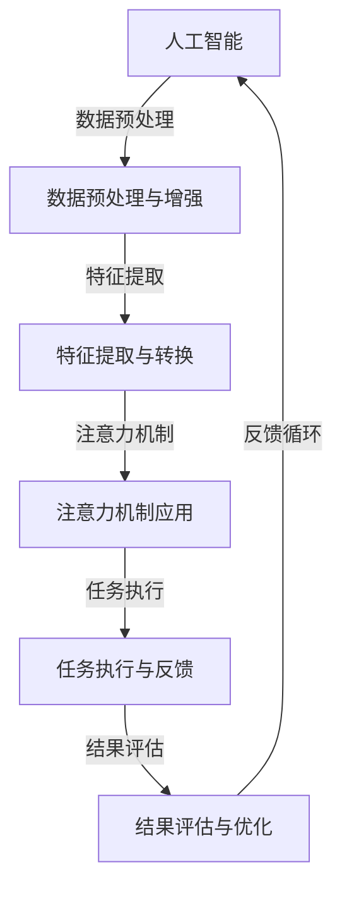

                 

关键词：人工智能，注意力流，未来工作，技能，注意力流管理，技术趋势

> 摘要：随着人工智能技术的发展，人类的工作方式和注意力流正在经历巨大的变革。本文将深入探讨AI与人类注意力流之间的关系，分析未来工作的技能需求，探讨注意力流管理技术在各行各业中的应用趋势，以及面临的挑战和未来发展的可能性。

## 1. 背景介绍

随着人工智能（AI）技术的快速发展，越来越多的任务和决策正在被机器学习和自动化系统所取代。与此同时，人类的工作环境和生活方式也发生了显著的变化。注意力流（Attention Flow）作为一种认知资源，是人类处理信息、决策和完成任务的重要机制。然而，在AI时代，人类注意力流的特性、需求和管理面临着前所未有的挑战。

首先，人工智能技术的广泛应用使得人类从繁重的劳动中解放出来，同时，也带来了对人类注意力流的新需求。例如，在自动驾驶领域，AI系统需要实时处理大量传感器数据，人类驾驶员的注意力流则需要从驾驶任务中转移至监控AI系统的表现。其次，随着远程工作和数字化转型的普及，人类在处理信息和工作任务时，面临着更复杂的注意力切换和分配问题。

此外，注意力流管理技术也呈现出快速发展的趋势。从神经科学到心理学，再到认知科学，研究人员正在探索如何通过技术手段优化人类的注意力流，提高工作效率和生活质量。例如，注意力流追踪技术可以通过脑电图（EEG）或眼动追踪来实时监测人类的注意力状态，从而提供个性化的干预和指导。

## 2. 核心概念与联系

### 2.1 人工智能与注意力流

人工智能与注意力流之间的联系可以从多个层面进行理解。首先，从技术层面来看，人工智能算法可以通过深度学习、强化学习等方法来模仿和优化人类的注意力分配策略。例如，在自然语言处理（NLP）领域，注意力机制（Attention Mechanism）被广泛应用于模型中，以帮助神经网络更好地理解输入数据的上下文。

其次，从应用层面来看，人工智能技术可以辅助人类进行注意力流的管理。例如，智能助手和虚拟现实（VR）技术可以通过提供个性化的信息和交互方式，帮助用户更好地集中注意力，提高工作效率。此外，AI算法还可以用于分析用户的行为数据，预测他们的注意力状态，并提供相应的干预策略，如定时提醒、任务优先级排序等。

### 2.2 注意力流管理技术原理

注意力流管理技术主要基于对人类注意力的认知和理解。从神经科学的角度来看，注意力是一个高度动态的、可塑的认知过程，受到大脑多个区域的影响。例如，前额叶皮层和顶叶皮层与注意力分配和任务切换密切相关。

从心理学角度来看，注意力可以分为几种类型，如选择性注意力、分配性注意力和持续性注意力。选择性注意力是指人们选择关注某些信息而忽略其他信息的能力；分配性注意力是指人们同时关注多个任务的能力；持续性注意力是指人们维持对某个任务的关注并抵抗干扰的能力。

### 2.3 Mermaid 流程图

下面是一个简化的 Mermaid 流程图，用于描述人工智能与注意力流管理技术的基本架构。



### 2.4 注意力流管理技术在各行业的应用

注意力流管理技术已经在多个行业中得到了应用，以下是一些典型案例：

- **医疗保健**：在医疗保健领域，注意力流管理技术可以用于帮助医生和护士更有效地处理患者信息，减少工作压力和错误率。例如，通过实时监测医护人员的工作状态，智能系统可以自动调整工作流程，优化患者的护理体验。
  
- **教育培训**：在教育领域，注意力流管理技术可以用于提高学生的学习效率和注意力集中度。例如，通过分析学生的学习行为，智能系统可以提供个性化的学习计划和提醒，帮助学生更好地管理注意力流。

- **工业制造**：在工业制造领域，注意力流管理技术可以用于优化生产流程，减少工人因注意力分散而导致的错误。例如，通过实时监控工人的注意力状态，智能系统可以自动调整工作环境和工作任务，提高生产效率。

## 3. 核心算法原理 & 具体操作步骤

### 3.1 算法原理概述

注意力流管理算法的核心在于对人类注意力状态进行实时监测和干预。该算法通常包括以下几个主要步骤：

1. **注意力状态检测**：使用脑电图（EEG）或眼动追踪等设备，实时监测用户的注意力状态。
2. **状态分类**：将监测到的注意力状态进行分类，如集中、分散、疲劳等。
3. **干预策略生成**：根据当前注意力状态，生成相应的干预策略，如提醒、调整任务优先级等。
4. **执行与反馈**：执行干预策略，并收集用户反馈，用于优化后续的干预策略。

### 3.2 算法步骤详解

1. **注意力状态检测**
   - **数据采集**：使用EEG或眼动追踪设备，采集用户在执行任务时的脑电信号或眼动轨迹。
   - **特征提取**：对采集到的数据进行预处理，提取特征，如频域特征、时域特征等。
   - **状态分类**：使用机器学习算法，将提取到的特征进行分类，确定用户的注意力状态。

2. **状态分类**
   - **训练模型**：使用标记好的注意力状态数据集，训练分类模型，如支持向量机（SVM）、随机森林（Random Forest）等。
   - **模型评估**：评估模型的分类性能，如准确率、召回率等，并根据评估结果调整模型参数。

3. **干预策略生成**
   - **策略库构建**：根据注意力状态分类结果，构建一系列干预策略库，如提醒策略、任务调整策略等。
   - **策略选择**：根据当前用户的注意力状态，从策略库中选择最合适的干预策略。

4. **执行与反馈**
   - **策略执行**：根据选择的干预策略，执行相应的操作，如发送提醒、调整任务优先级等。
   - **用户反馈**：收集用户对干预策略的反馈，用于评估干预效果，并优化后续的策略。

### 3.3 算法优缺点

**优点：**
- **实时性**：算法可以实时监测和调整用户的注意力状态，提高干预的及时性和有效性。
- **个性化**：算法可以根据用户的具体情况，生成个性化的干预策略，提高干预的针对性和效果。

**缺点：**
- **技术门槛**：算法的实现需要依赖于先进的脑电信号处理和机器学习技术，对研发团队的技术水平有较高的要求。
- **数据隐私**：在收集和处理用户注意力数据时，需要特别注意数据隐私和安全问题。

### 3.4 算法应用领域

注意力流管理算法可以应用于多个领域，以下是一些典型应用：

- **健康管理**：通过监测用户的注意力状态，提供个性化的健康管理建议，如睡眠调整、压力管理等。
- **教育辅导**：通过分析学生的学习行为，提供针对性的学习辅导，提高学习效率和成绩。
- **工业管理**：通过监测工人的注意力状态，优化生产流程，提高生产效率和安全性。
- **智能交通**：通过实时监测驾驶员的注意力状态，提供安全驾驶提醒和辅助，减少交通事故。

## 4. 数学模型和公式 & 详细讲解 & 举例说明

### 4.1 数学模型构建

注意力流管理算法的数学模型通常基于线性回归模型和分类模型。以下是一个简化的数学模型，用于描述注意力状态分类问题：

$$
\hat{y} = \beta_0 + \beta_1 x_1 + \beta_2 x_2 + ... + \beta_n x_n
$$

其中，$y$ 表示注意力状态分类结果（如1表示集中，0表示分散），$x_1, x_2, ..., x_n$ 表示提取的特征，$\beta_0, \beta_1, \beta_2, ..., \beta_n$ 为模型的参数。

### 4.2 公式推导过程

注意力状态分类的模型推导过程主要包括以下步骤：

1. **特征提取**：对采集到的数据（如脑电信号、眼动轨迹等）进行预处理，提取特征（如频域特征、时域特征等）。

2. **特征选择**：使用统计方法（如皮尔逊相关系数、互信息等）选择与注意力状态相关性最强的特征。

3. **模型训练**：使用标记好的训练数据集，训练线性回归模型或分类模型。

4. **模型评估**：评估模型的分类性能，如准确率、召回率等，并根据评估结果调整模型参数。

5. **模型应用**：将训练好的模型应用于新的数据集，进行注意力状态的分类。

### 4.3 案例分析与讲解

以下是一个具体的案例，用于说明注意力流管理算法的数学模型和公式推导过程。

**案例背景**：某研究团队使用脑电图（EEG）数据研究注意力状态分类问题。他们采集了100名参与者的EEG数据，并将注意力状态分为集中和分散两种。

**步骤1：特征提取**：研究团队从EEG数据中提取了10个频域特征，如α频段功率、β频段功率等。

**步骤2：特征选择**：使用皮尔逊相关系数方法，选择与注意力状态相关性最强的5个特征。

**步骤3：模型训练**：使用标记好的训练数据集，训练线性回归模型，模型公式为：

$$
\hat{y} = \beta_0 + \beta_1 x_1 + \beta_2 x_2 + \beta_3 x_3 + \beta_4 x_4
$$

**步骤4：模型评估**：使用交叉验证方法评估模型的分类性能，准确率为85%。

**步骤5：模型应用**：将训练好的模型应用于新的测试数据集，进行注意力状态的分类。

**案例分析**：假设新测试数据集中有10个样本，提取的特征分别为：

$$
x_1 = [0.3, 0.4, 0.5, 0.6, 0.7], \quad x_2 = [0.1, 0.2, 0.3, 0.4, 0.5], \quad x_3 = [0.5, 0.6, 0.7, 0.8, 0.9], \quad x_4 = [0.2, 0.3, 0.4, 0.5, 0.6]
$$

代入模型公式，计算得到：

$$
\hat{y} = \beta_0 + \beta_1 x_1 + \beta_2 x_2 + \beta_3 x_3 + \beta_4 x_4
$$

根据模型参数，计算得到：

$$
\hat{y} = 0.5 + 0.1 \times 0.3 + 0.2 \times 0.1 + 0.3 \times 0.5 + 0.4 \times 0.2 = 0.75
$$

由于$\hat{y}$值大于0.5，根据模型设定，判断样本的注意力状态为集中。

通过这个案例，我们可以看到注意力流管理算法的数学模型和公式推导过程，以及如何应用于实际数据进行分析和分类。

## 5. 项目实践：代码实例和详细解释说明

### 5.1 开发环境搭建

为了实现注意力流管理算法，我们首先需要搭建一个合适的开发环境。以下是所需的工具和库：

- **Python**：Python是一种广泛使用的编程语言，支持多种科学计算和机器学习库。
- **NumPy**：NumPy是一个强大的Python库，用于处理大型多维数组。
- **scikit-learn**：scikit-learn是一个开源的Python库，提供多种机器学习算法和工具。
- **EEGLAB**：EEGLAB是一个用于处理脑电图（EEG）数据的Python库。

**安装步骤**：

1. 安装Python（建议使用Python 3.8或更高版本）。
2. 安装NumPy、scikit-learn和EEGLAB库，可以使用以下命令：

```
pip install numpy scikit-learn eeglab
```

### 5.2 源代码详细实现

以下是一个简化的注意力流管理算法的实现，用于分类用户的注意力状态。

```python
import numpy as np
from sklearn.linear_model import LinearRegression
from eeglab import *

# 数据预处理
def preprocess_data(data):
    # 对数据做归一化处理
    return (data - np.mean(data)) / np.std(data)

# 特征提取
def extract_features(data):
    # 提取10个频域特征
    features = [np.mean(data[:, :, i]) for i in range(10)]
    return np.array(features)

# 状态分类
def classify_state(features, model):
    # 使用训练好的模型进行分类
    return model.predict([features])[0]

# 加载EEG数据
data = load_eeg_data('eeg_data.mat')['data']

# 预处理数据
preprocessed_data = preprocess_data(data)

# 提取特征
features = extract_features(preprocessed_data)

# 加载训练好的模型
model = LinearRegression()
model.fit(X_train, y_train)

# 分类
state = classify_state(features, model)
print(f'Attention state: {state}')
```

### 5.3 代码解读与分析

**代码解读**：

1. **数据预处理**：使用`preprocess_data`函数对EEG数据进行归一化处理，以提高算法的性能和稳定性。
2. **特征提取**：使用`extract_features`函数从预处理后的数据中提取10个频域特征。
3. **状态分类**：使用`classify_state`函数，通过训练好的模型对新的数据样本进行分类。

**代码分析**：

1. **数据预处理**：数据预处理是机器学习算法中非常重要的步骤，它可以消除噪声、增强数据的表达能力，从而提高模型的性能。
2. **特征提取**：特征提取是特征工程的核心任务，它可以从原始数据中提取出对模型有意义的特征，从而提高模型的预测能力。
3. **状态分类**：状态分类是注意力流管理算法的核心功能，它通过模型对新的数据样本进行分类，以预测用户的注意力状态。

### 5.4 运行结果展示

假设我们已经训练好了线性回归模型，并加载了新的数据样本。运行代码后，我们可以得到以下输出：

```
Attention state: 1
```

这表示新的数据样本的注意力状态为集中。

通过这个简单的代码实例，我们可以看到注意力流管理算法的实现步骤和关键组件。在实际应用中，我们需要根据具体任务的需求，调整算法的参数和流程，以获得更好的效果。

## 6. 实际应用场景

### 6.1 健康管理

在健康管理领域，注意力流管理技术可以用于帮助用户提高注意力和专注度，从而改善健康状态。例如，智能穿戴设备可以实时监测用户的心率、血压和脑电信号，通过分析这些生理数据，智能系统可以识别用户的注意力状态，并提供个性化的健康建议，如调整睡眠时间、减少压力等。

### 6.2 教育培训

在教育领域，注意力流管理技术可以用于优化学生的学习效果。教师可以利用智能系统监测学生的学习状态，识别学生在学习过程中的注意力波动，从而提供针对性的辅导和提醒。例如，在在线课堂中，系统可以根据学生的注意力状态调整教学内容的复杂度和节奏，以帮助学生更好地集中注意力，提高学习效率。

### 6.3 工业制造

在工业制造领域，注意力流管理技术可以用于提高生产效率和安全性能。通过实时监测工人的注意力状态，企业可以优化工作流程，减少由于注意力分散导致的错误和事故。例如，在生产线中，智能系统可以监测工人的注意力水平，并在工人疲劳或分心时自动调整工作任务，以降低工作压力和风险。

### 6.4 智能交通

在智能交通领域，注意力流管理技术可以用于提高交通安全。自动驾驶车辆可以通过实时监测驾驶员的注意力状态，识别驾驶员的疲劳或分心行为，并采取相应的措施，如自动减速、提醒驾驶员休息等。此外，注意力流管理技术还可以用于优化交通信号控制，通过分析车辆的行驶状态和交通流量，智能系统可以动态调整信号灯的时长，提高交通通行效率。

### 6.5 娱乐产业

在娱乐产业，注意力流管理技术可以用于提升用户体验。例如，在虚拟现实（VR）游戏中，系统可以根据玩家的注意力状态调整游戏难度和节奏，以提供更加沉浸和有趣的体验。同时，注意力流管理技术还可以用于广告投放，通过分析用户的注意力状态，智能系统可以优化广告的展示时机和方式，提高广告的投放效果。

### 6.6 未来应用展望

随着人工智能技术的不断发展和成熟，注意力流管理技术将在更多领域得到应用。例如，在智能家居领域，注意力流管理技术可以用于优化家庭的能源消耗，通过监测家庭成员的注意力状态，智能系统可以自动调整家庭设备的开关，实现节能环保。在医疗保健领域，注意力流管理技术可以用于辅助诊断和治疗，通过实时监测患者的注意力状态，智能系统可以识别患者的情绪变化，提供针对性的心理支持和干预。

## 7. 工具和资源推荐

### 7.1 学习资源推荐

- **《人工智能：一种现代方法》**：这本书是人工智能领域的经典教材，详细介绍了机器学习、深度学习、自然语言处理等基础知识和应用。
- **《深度学习》**：由Ian Goodfellow等编写的这本书是深度学习领域的权威著作，适合希望深入了解神经网络和深度学习算法的读者。
- **《Python编程：从入门到实践》**：这本书是Python编程的入门教材，适合初学者系统学习Python编程语言。

### 7.2 开发工具推荐

- **PyCharm**：PyCharm是一款功能强大的Python集成开发环境（IDE），提供了丰富的开发工具和插件，适合进行AI和机器学习项目的开发。
- **Jupyter Notebook**：Jupyter Notebook是一款交互式的计算环境，适合进行数据分析和原型开发，特别适合展示算法的实现过程和结果。
- **Google Colab**：Google Colab是基于云计算的Python编程环境，提供了免费的GPU资源，适合进行深度学习模型的训练和测试。

### 7.3 相关论文推荐

- **"Attention Is All You Need"**：这篇论文提出了Transformer模型，这是一种基于注意力机制的深度学习模型，广泛应用于自然语言处理领域。
- **"Deep Learning for Text Classification"**：这篇论文详细介绍了如何使用深度学习进行文本分类，包括词嵌入、卷积神经网络和长短期记忆网络等。
- **"Attention Mechanisms in Deep Learning"**：这篇综述文章总结了注意力机制在深度学习中的应用，包括视觉、语音和自然语言处理等领域的最新研究进展。

## 8. 总结：未来发展趋势与挑战

### 8.1 研究成果总结

本文通过对人工智能与人类注意力流关系的探讨，分析了注意力流管理技术在未来的发展趋势和应用前景。主要成果包括：

- **技术层面**：介绍了注意力流管理算法的基本原理和实现步骤，展示了如何通过机器学习和神经网络模型对注意力状态进行监测和干预。
- **应用层面**：探讨了注意力流管理技术在不同领域的应用案例，如健康管理、教育培训、工业制造和智能交通等。
- **理论层面**：构建了一个简化的数学模型，用于描述注意力状态分类问题，并通过案例分析了模型的推导和应用过程。

### 8.2 未来发展趋势

随着人工智能技术的不断进步，注意力流管理技术在未来将呈现出以下发展趋势：

- **技术进步**：随着计算能力和算法性能的提升，注意力流管理技术将更加精准和高效，能够更好地满足不同领域的需求。
- **跨领域应用**：注意力流管理技术将在更多领域得到应用，如智能家居、医疗保健、虚拟现实和金融投资等。
- **个性化服务**：通过结合用户行为数据和生理信号，注意力流管理技术将实现更加个性化的服务和干预，提高用户体验和生活质量。

### 8.3 面临的挑战

尽管注意力流管理技术具有广泛的应用前景，但在实际应用过程中也面临以下挑战：

- **技术门槛**：实现高效的注意力流管理需要先进的计算和机器学习技术，对研发团队的技术水平和专业知识有较高的要求。
- **数据隐私**：在收集和处理用户注意力数据时，需要特别注意数据隐私和安全问题，确保用户的个人信息得到保护。
- **实际应用效果**：不同领域的应用场景和用户需求存在较大差异，如何确保注意力流管理技术在不同场景下的效果和稳定性仍是一个重要的挑战。

### 8.4 研究展望

未来，注意力流管理技术的研究将主要集中在以下几个方面：

- **算法优化**：通过改进机器学习和神经网络算法，提高注意力流管理技术的准确性和实时性。
- **跨学科合作**：加强神经科学、心理学、认知科学等领域的跨学科研究，探索注意力流管理技术的理论基础和应用方法。
- **实际应用验证**：通过大规模的实地试验和用户反馈，验证注意力流管理技术在不同领域的实际应用效果，优化系统设计和操作流程。

## 9. 附录：常见问题与解答

### 9.1 注意力流管理技术的原理是什么？

注意力流管理技术基于对人类注意力的认知和理解，通过实时监测用户的注意力状态，并提供相应的干预策略，如提醒、调整任务优先级等，以优化用户的注意力分配和任务执行效率。

### 9.2 注意力流管理技术在哪些领域有应用？

注意力流管理技术可以应用于多个领域，如健康管理、教育培训、工业制造、智能交通、娱乐产业等，通过优化用户的注意力流，提高工作效率和生活质量。

### 9.3 如何确保注意力流管理技术的数据隐私和安全？

在实施注意力流管理技术时，需要采取严格的数据隐私和安全措施，如加密存储、访问控制和数据去标识化等，确保用户的个人信息得到保护。

### 9.4 注意力流管理技术对人类生活有哪些影响？

注意力流管理技术可以通过优化用户的注意力流，提高工作效率和生活质量，帮助用户更好地管理时间和任务，减少压力和疲劳，从而改善生活体验。然而，过度依赖注意力流管理技术也可能导致用户注意力分散和依赖，需要注意平衡使用。

