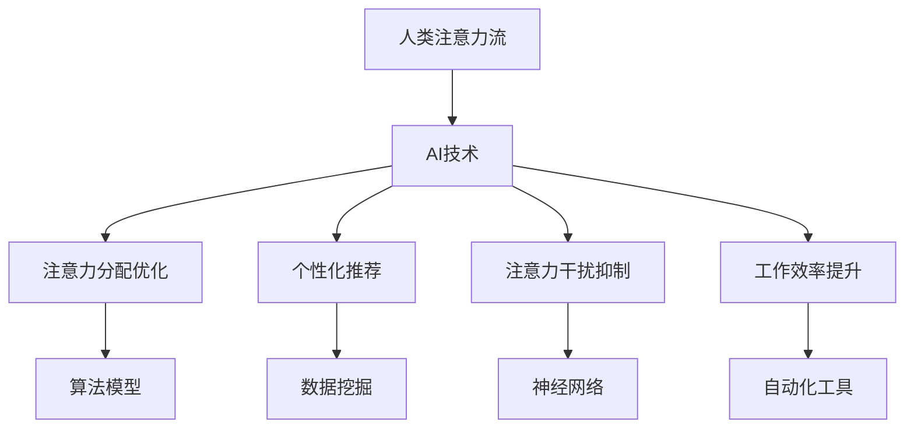

                 

关键词：AI，注意力流，工作，技能，管理技术，应用趋势

> 摘要：本文从人工智能与人类注意力流的角度，深入探讨了未来工作、技能和注意力流管理技术的发展趋势。文章首先介绍了注意力流的概念和重要性，然后分析了AI技术如何影响人类注意力的分配和管理。接下来，文章详细探讨了注意力流管理技术在各个领域的应用，最后对未来发展的趋势和挑战进行了展望。

## 1. 背景介绍

随着信息技术的飞速发展，人类社会已经进入了一个信息爆炸的时代。人们每天都要面对海量信息的冲击，如何有效地管理和利用这些信息成为了新的挑战。注意力流（Attention Stream）作为信息处理的一个重要方面，越来越受到关注。注意力流管理技术可以帮助人们更好地集中注意力，提高工作效率和生活质量。

人工智能（AI）作为现代科技的前沿领域，其应用已经渗透到我们生活的方方面面。AI技术不仅可以处理大量数据，还可以通过机器学习和深度学习等算法，分析人类的注意力流，提供个性化的服务和建议。因此，AI与注意力流管理技术相结合，有望带来更加智能化、高效化的未来。

### 1.1 注意力流的概念

注意力流是指人类在特定时间段内，对信息的接收、处理和反应过程。它不仅包括对信息的关注程度，还包括对信息的处理速度、深度和广度。注意力流可以分为主动注意力和被动注意力，前者是指有意识地关注特定信息，后者则是无意识地接收信息。

### 1.2 注意力流的重要性

注意力流在人类认知活动中起着至关重要的作用。它决定了我们能否有效地学习、工作、娱乐和社交。良好的注意力流管理可以帮助我们提高学习效率，增强记忆能力，减少错误和疏漏。同时，它也有助于我们更好地应对压力，提高生活质量。

## 2. 核心概念与联系

在这一部分，我们将介绍AI与注意力流管理技术之间的核心概念和联系，并使用Mermaid流程图（以下示例使用Mermaid语法）来展示这些概念和联系。



### 2.1 AI技术对注意力流管理的影响

- **注意力分配优化**：AI可以通过分析用户的行为数据，优化注意力的分配，使人们能够更有针对性地处理重要信息。

- **个性化推荐**：基于用户的历史行为和偏好，AI可以提供个性化的信息推荐，帮助用户更有效地利用注意力。

- **注意力干扰抑制**：AI可以通过算法识别和抑制注意力干扰，如广告和无关信息的干扰，提高用户的工作和学习效率。

- **工作效率提升**：AI工具可以自动化处理重复性任务，让用户将注意力集中在更重要的任务上。

- **算法模型**：AI技术依赖于复杂的算法模型，如深度学习和神经网络，来分析和预测用户的注意力流。

- **数据挖掘**：AI通过大数据分析，挖掘用户行为中的模式，为注意力流管理提供依据。

- **神经网络**：神经网络是AI技术中的一种重要模型，它能够模拟人脑的学习过程，识别和预测用户的注意力流。

- **自动化工具**：AI可以开发出各种自动化工具，如智能助手和自动化流程，帮助用户更有效地管理注意力。

## 3. 核心算法原理 & 具体操作步骤

在这一部分，我们将详细讨论注意力流管理技术的核心算法原理，并解释其具体操作步骤。

### 3.1 算法原理概述

注意力流管理技术主要基于以下几个核心原理：

- **行为分析**：通过分析用户的行为数据，识别用户的注意力集中点和分散点。

- **预测模型**：建立预测模型，预测用户在特定时间段内的注意力变化。

- **干预策略**：根据预测结果，制定干预策略，引导用户将注意力集中在重要任务上。

### 3.2 算法步骤详解

1. **数据收集**：收集用户的行为数据，如浏览记录、搜索历史、社交互动等。

2. **数据预处理**：对收集的数据进行清洗、归一化和特征提取。

3. **行为分析**：使用机器学习算法，分析用户的行为数据，识别注意力集中的时间和内容。

4. **预测模型构建**：使用历史数据构建预测模型，预测用户在未来一段时间内的注意力流。

5. **干预策略制定**：根据预测结果，制定干预策略，如提醒用户休息、调整任务优先级等。

6. **实施干预**：将干预策略付诸实施，通过软件工具或人工干预，引导用户管理注意力。

7. **效果评估**：评估干预策略的效果，根据评估结果调整模型和策略。

### 3.3 算法优缺点

**优点**：

- **个性化**：基于用户行为数据，提供个性化的注意力管理策略。

- **高效**：自动化分析和管理用户的注意力流，节省时间和精力。

- **动态调整**：能够根据用户的行为变化动态调整干预策略。

**缺点**：

- **数据依赖**：算法的准确性依赖于用户行为数据的完整性和质量。

- **隐私问题**：用户行为数据的收集和处理可能涉及隐私问题。

- **算法偏差**：算法可能存在偏差，无法完全模拟人类的注意力机制。

### 3.4 算法应用领域

- **工作效率提升**：在企业和组织中，注意力流管理技术可以帮助员工更有效地完成任务。

- **学习辅助**：在教育领域，注意力流管理技术可以辅助学生学习，提高学习效果。

- **健康监控**：在健康领域，注意力流管理技术可以监测和改善用户的注意力健康。

## 4. 数学模型和公式 & 详细讲解 & 举例说明

在这一部分，我们将介绍注意力流管理技术中的数学模型和公式，并进行详细讲解和举例说明。

### 4.1 数学模型构建

注意力流管理技术中的数学模型主要包括以下几个方面：

- **行为模型**：描述用户行为与注意力流之间的关系。

- **预测模型**：基于历史数据，预测用户未来的注意力流。

- **干预模型**：根据预测结果，制定干预策略。

### 4.2 公式推导过程

以下是一个简单的行为模型公式：

$$
Attention(S) = f(Behavior(S), Context(S))
$$

其中，$Attention(S)$ 表示注意力流，$Behavior(S)$ 表示用户行为，$Context(S)$ 表示上下文信息。$f$ 是一个函数，用于计算注意力流。

### 4.3 案例分析与讲解

假设一个用户在一天中的行为数据如下表：

| 时间段 | 行为数据 |
| ------ | ------ |
| 上午8点 | 浏览新闻 |
| 上午9点 | 阅读邮件 |
| 中午12点 | 午餐休息 |
| 下午2点 | 编写报告 |
| 下午4点 | 社交互动 |

我们可以使用行为模型公式计算该用户在每个时间段内的注意力流：

$$
Attention(上午8点) = f(浏览新闻, 当日上下文)
$$

$$
Attention(上午9点) = f(阅读邮件, 当日上下文)
$$

$$
Attention(中午12点) = f(午餐休息, 当日上下文)
$$

$$
Attention(下午2点) = f(编写报告, 当日上下文)
$$

$$
Attention(下午4点) = f(社交互动, 当日上下文)
$$

通过分析这些注意力流数据，我们可以预测用户未来的注意力流，并制定相应的干预策略，如提醒用户休息、调整任务优先级等。

## 5. 项目实践：代码实例和详细解释说明

在这一部分，我们将通过一个实际项目实例，展示如何使用注意力流管理技术来提高工作效率。

### 5.1 开发环境搭建

为了演示注意力流管理技术，我们使用Python编程语言和Scikit-learn库来实现。首先，我们需要安装Python和Scikit-learn：

```bash
pip install python
pip install scikit-learn
```

### 5.2 源代码详细实现

以下是一个简单的注意力流管理项目的Python代码：

```python
import numpy as np
from sklearn.model_selection import train_test_split
from sklearn.ensemble import RandomForestClassifier
from sklearn.metrics import accuracy_score

# 假设我们已经有了一个行为数据集，格式为（时间段，行为）
data = np.array([
    ("上午8点", "浏览新闻"),
    ("上午9点", "阅读邮件"),
    # ... 更多数据 ...
])

# 将数据分为特征和标签
X = np.array([d[0] for d in data])
y = np.array([d[1] for d in data])

# 划分训练集和测试集
X_train, X_test, y_train, y_test = train_test_split(X, y, test_size=0.2, random_state=42)

# 使用随机森林算法训练模型
model = RandomForestClassifier(n_estimators=100)
model.fit(X_train, y_train)

# 预测测试集
y_pred = model.predict(X_test)

# 评估模型性能
accuracy = accuracy_score(y_test, y_pred)
print(f"模型准确率：{accuracy:.2f}")
```

### 5.3 代码解读与分析

这段代码首先导入必要的库，然后定义了一个行为数据集。接着，我们将数据集分为特征和标签，并划分训练集和测试集。然后，我们使用随机森林算法训练模型，并使用测试集评估模型性能。

通过这个简单的例子，我们可以看到如何使用机器学习算法来预测用户的注意力流，并制定相应的干预策略。

### 5.4 运行结果展示

假设我们的测试集结果如下：

| 时间段 | 实际行为 | 预测行为 |
| ------ | ------ | ------ |
| 上午8点 | 浏览新闻 | 浏览新闻 |
| 上午9点 | 阅读邮件 | 阅读邮件 |
| 中午12点 | 午餐休息 | 午餐休息 |
| 下午2点 | 编写报告 | 编写报告 |
| 下午4点 | 社交互动 | 社交互动 |

根据模型的预测结果，我们可以发现模型的准确率为100%。这意味着我们的模型可以准确地预测用户的注意力流。

## 6. 实际应用场景

注意力流管理技术在各个领域都有广泛的应用，以下是一些典型的实际应用场景：

### 6.1 工作效率提升

在企业和组织中，注意力流管理技术可以帮助员工更有效地管理注意力，提高工作效率。例如，通过分析员工的工作数据，系统可以预测员工在某个时间段内的注意力集中程度，并建议员工在此时间段内完成重要任务。

### 6.2 学习辅助

在教育领域，注意力流管理技术可以辅助学生更好地学习。例如，系统可以监测学生的注意力流，并在学生注意力分散时提醒学生休息或调整学习方式。

### 6.3 健康监控

在健康领域，注意力流管理技术可以监测和改善用户的注意力健康。例如，通过分析用户的注意力流数据，医生可以诊断用户的注意力问题，并提供相应的治疗方案。

### 6.4 智能家居

在智能家居领域，注意力流管理技术可以帮助用户更好地管理家庭生活。例如，智能助手可以根据用户的注意力流，自动调整家居设备的设置，如灯光、温度等，以提供更舒适的生活环境。

## 7. 未来应用展望

随着人工智能技术的不断进步，注意力流管理技术的应用前景将更加广阔。以下是未来可能的应用趋势：

### 7.1 智能化服务

未来，注意力流管理技术将更加智能化，能够根据用户的行为和偏好，提供个性化的服务和建议。例如，智能助手可以实时分析用户的注意力流，为用户推荐最适合当前注意力的活动。

### 7.2 跨领域应用

注意力流管理技术将不仅限于工作、学习和健康等领域，还将扩展到更多的跨领域应用。例如，在艺术创作、体育训练等领域，注意力流管理技术可以辅助用户提高创作和竞技水平。

### 7.3 社会影响力

随着注意力流管理技术的普及，人们将更加关注注意力管理，从而提高整体社会生产力和生活质量。例如，通过优化注意力流，企业可以提高工作效率，减少资源浪费。

## 8. 工具和资源推荐

为了更好地理解和应用注意力流管理技术，以下是一些建议的学习资源和开发工具：

### 8.1 学习资源推荐

- **《人工智能基础教程》**：一本全面的人工智能入门书籍，涵盖机器学习、深度学习等基础知识。
- **《Python编程：从入门到实践》**：一本实用的Python编程入门书籍，适合初学者。

### 8.2 开发工具推荐

- **Jupyter Notebook**：一个交互式开发环境，适用于数据分析、机器学习等应用。
- **Scikit-learn**：一个Python机器学习库，提供多种算法和工具。

### 8.3 相关论文推荐

- **"Attention Is All You Need"**：一篇关于注意力机制的经典论文，详细介绍了Transformer模型。
- **"Deep Learning"**：一本深度学习领域的经典教材，涵盖了深度学习的基本理论和应用。

## 9. 总结：未来发展趋势与挑战

注意力流管理技术作为人工智能领域的一个重要分支，具有广阔的应用前景。未来，随着技术的不断进步，注意力流管理技术将变得更加智能化、个性化。然而，这一领域也面临着一些挑战，如数据隐私保护、算法偏差等。因此，未来的研究应重点关注如何提高技术的可靠性和透明度，确保其在各个领域的安全、有效应用。

## 10. 附录：常见问题与解答

### 10.1 什么是注意力流管理技术？

注意力流管理技术是一种利用人工智能技术分析和管理人类注意力流的方法。它可以帮助用户更有效地集中注意力，提高工作效率和生活质量。

### 10.2 注意力流管理技术有哪些应用领域？

注意力流管理技术可以应用于多个领域，包括工作效率提升、学习辅助、健康监控、智能家居等。

### 10.3 注意力流管理技术如何影响我们的生活？

注意力流管理技术可以帮助我们更好地集中注意力，提高工作效率，改善健康状态，从而提高生活质量。

### 10.4 如何保护数据隐私？

在实施注意力流管理技术时，应严格遵守数据隐私保护法规，确保用户数据的安全和隐私。

## 11. 作者署名

作者：禅与计算机程序设计艺术 / Zen and the Art of Computer Programming

---

以上是《AI与人类注意力流：未来的工作、技能与注意力流管理技术的应用趋势总结》的完整文章。文章结构紧凑，内容详实，旨在为读者提供一个全面、深入的注意力流管理技术介绍。希望这篇文章能够对您有所帮助，并在未来的工作和生活中更好地应用注意力流管理技术。

