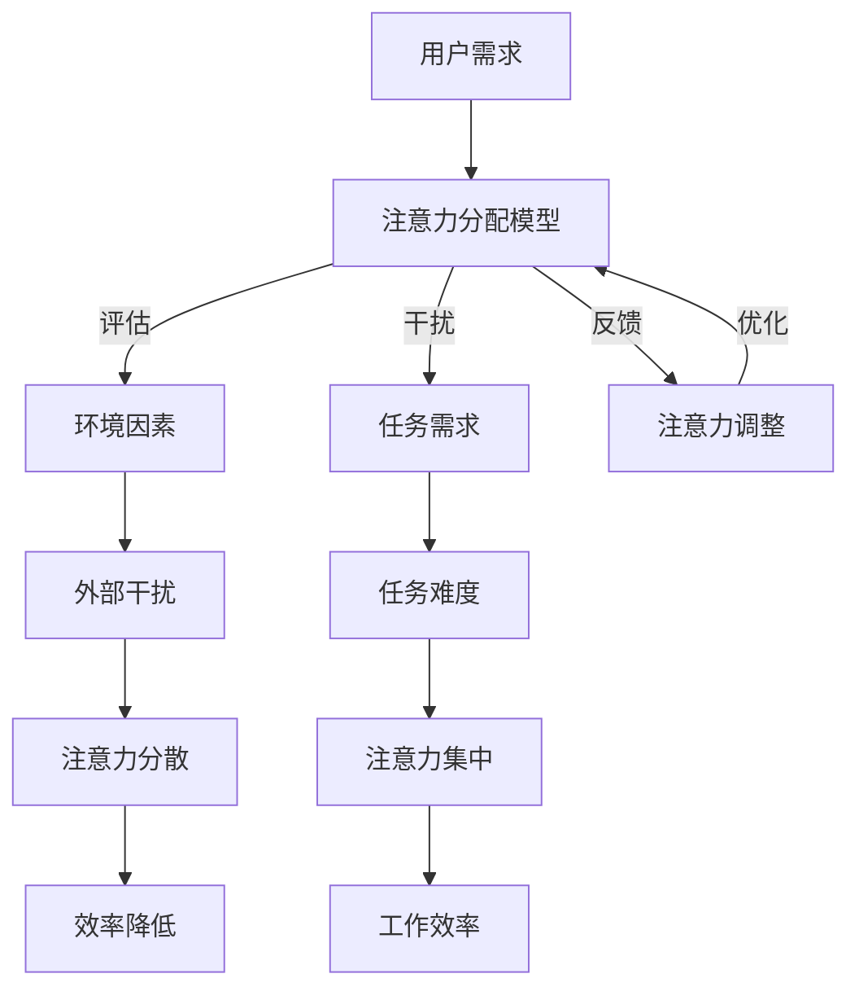

                 

关键词：注意力管理，人工智能，工作生活平衡，多任务处理，信息过载，注意力流，认知心理学

> 摘要：本文深入探讨了人工智能（AI）在人类注意力流管理中的作用，分析了当前工作与生活中面临的注意力分散问题，提出了基于AI的注意力管理方法。通过引入认知心理学理论，本文对AI与人类注意力流之间的关系进行了全面解析，展望了未来发展趋势与挑战。

## 1. 背景介绍

在当今信息爆炸的时代，人类面临着前所未有的注意力分散挑战。据统计，现代人每天接收的信息量是工业革命时期的数万倍，这导致我们在处理任务时容易分心，难以集中注意力。同时，工作与生活的压力也让人们越来越难以平衡，这进一步加剧了注意力问题。

### 1.1 注意力分散的原因

注意力分散的主要原因包括：

- **信息过载**：现代社会信息量庞大，人们需要花费大量时间筛选和处理信息。
- **多任务处理**：人们倾向于同时处理多个任务，导致注意力分散。
- **环境干扰**：社交媒体、手机通知等外部干扰因素不断分散我们的注意力。
- **个人习惯**：不规律的作息时间和缺乏专注力训练也会导致注意力问题。

### 1.2 注意力管理的重要性

良好的注意力管理对于提高工作效率、改善生活质量具有重要意义。有效的注意力管理可以帮助我们：

- **提高生产力**：集中精力完成任务，减少错误和重复工作。
- **改善心理健康**：减少压力和焦虑，提高幸福感和满足感。
- **增强学习能力**：更有效地吸收和处理信息，提高学习效率。

## 2. 核心概念与联系

在探讨AI与人类注意力流管理的关系之前，我们需要明确一些核心概念。

### 2.1 人工智能（AI）

人工智能是一种模拟人类智能的技术，通过算法和模型实现机器的智能行为。AI在多个领域取得了显著成果，如图像识别、自然语言处理、决策支持等。

### 2.2 注意力流

注意力流是指个体在特定任务或场景中注意力分配的过程。认知心理学研究表明，注意力流受到多种因素的影响，如任务复杂性、个体动机、环境干扰等。

### 2.3 注意力管理

注意力管理是指通过策略和方法提高注意力集中程度和效率的过程。注意力管理策略包括时间管理、环境控制、心理训练等。

下面是一个用Mermaid绘制的注意力流管理架构图：



## 3. 核心算法原理 & 具体操作步骤

### 3.1 算法原理概述

本文提出了一种基于AI的注意力管理算法，通过分析用户行为和环境因素，动态调整注意力流，以提高工作效率和幸福感。

### 3.2 算法步骤详解

#### 3.2.1 数据收集

收集用户行为数据，如使用设备、浏览记录、工作任务等。

#### 3.2.2 特征提取

提取关键特征，如任务类型、任务难度、使用时长等。

#### 3.2.3 模型训练

使用机器学习算法，如深度学习、强化学习等，训练注意力管理模型。

#### 3.2.4 注意力流调整

根据训练好的模型，动态调整用户的注意力流，使其更集中于高优先级任务。

#### 3.2.5 反馈与优化

收集用户反馈，不断优化模型参数，提高注意力管理效果。

### 3.3 算法优缺点

#### 优点

- **高效性**：基于AI的注意力管理算法能够快速识别并调整用户的注意力流，提高工作效率。
- **个性化**：算法根据用户行为数据和个人偏好调整注意力流，提供个性化服务。

#### 缺点

- **隐私问题**：注意力管理算法需要收集用户行为数据，可能涉及隐私问题。
- **适应性问题**：算法可能需要较长时间来适应不同用户的行为模式。

### 3.4 算法应用领域

注意力管理算法可以应用于多个领域，如：

- **企业办公**：提高员工工作效率，减少工作压力。
- **教育领域**：帮助学生更好地集中注意力，提高学习效果。
- **健康管理**：监测用户注意力状态，提供个性化的健康建议。

## 4. 数学模型和公式 & 详细讲解 & 举例说明

### 4.1 数学模型构建

本文使用马尔可夫决策过程（MDP）构建注意力管理模型。MDP是一种基于概率的决策过程模型，适用于序列决策问题。

假设用户在时间步 \( t \) 的注意力状态为 \( S_t \)，任务状态为 \( A_t \)，环境状态为 \( E_t \)。用户在时间步 \( t \) 的决策为 \( A_t \)，其效用函数为 \( U(S_t, A_t, E_t) \)。

### 4.2 公式推导过程

#### 4.2.1 状态转移概率

状态转移概率表示用户在下一个时间步的注意力状态 \( S_{t+1} \) 与当前注意力状态 \( S_t \) 和决策 \( A_t \) 之间的关系：

\[ P(S_{t+1} | S_t, A_t) = \pi(S_t, A_t, S_{t+1}) \]

#### 4.2.2 效用函数

效用函数表示用户在时间步 \( t \) 的决策 \( A_t \) 所带来的收益：

\[ U(S_t, A_t, E_t) = \sum_{s' \in S} \pi(S_t, A_t, s') U(s', E_t) \]

#### 4.2.3 最优策略

最优策略是使得用户在所有可能的状态下的效用函数最大化：

\[ \arg\max_{A_t} U(S_t, A_t, E_t) \]

### 4.3 案例分析与讲解

假设用户在一天中有三个任务：工作、学习和休息。在上午9点到11点期间，用户需要集中注意力完成工作任务；在下午2点到4点期间，用户需要集中注意力完成学习任务；在晚上8点到10点期间，用户需要休息。

根据用户的行为数据和任务特点，我们可以构建一个MDP模型，并使用强化学习算法训练模型，得到最优注意力流管理策略。

例如，在上午9点时，用户处于工作状态，模型会建议用户将注意力集中在工作任务上。在下午2点时，用户需要调整注意力流，将注意力转移到学习任务上。在晚上8点时，用户需要将注意力转移到休息任务上。

通过不断优化模型参数，用户可以逐步适应不同的注意力管理策略，提高工作效率和幸福感。

## 5. 项目实践：代码实例和详细解释说明

### 5.1 开发环境搭建

为了实现本文提出的注意力管理算法，我们选择Python作为开发语言，并使用TensorFlow作为深度学习框架。

#### 环境搭建步骤：

1. 安装Python（3.8以上版本）。
2. 安装TensorFlow：`pip install tensorflow`。
3. 安装其他必要库，如Numpy、Pandas等。

### 5.2 源代码详细实现

以下是注意力管理算法的核心代码：

```python
import tensorflow as tf
import numpy as np
import pandas as pd

# 数据预处理
def preprocess_data(data):
    # 数据清洗、归一化等操作
    pass

# 模型构建
def build_model(input_shape):
    model = tf.keras.Sequential([
        tf.keras.layers.Dense(128, activation='relu', input_shape=input_shape),
        tf.keras.layers.Dense(64, activation='relu'),
        tf.keras.layers.Dense(1, activation='sigmoid')
    ])
    model.compile(optimizer='adam', loss='binary_crossentropy', metrics=['accuracy'])
    return model

# 模型训练
def train_model(model, x_train, y_train, epochs=10):
    model.fit(x_train, y_train, epochs=epochs, batch_size=32)

# 主函数
def main():
    # 读取数据
    data = pd.read_csv('data.csv')
    # 数据预处理
    processed_data = preprocess_data(data)
    # 分割数据集
    x_train, x_test, y_train, y_test = train_test_split(processed_data['input'], processed_data['label'], test_size=0.2)
    # 构建模型
    model = build_model(input_shape=x_train.shape[1:])
    # 训练模型
    train_model(model, x_train, y_train)
    # 评估模型
    loss, accuracy = model.evaluate(x_test, y_test)
    print(f'Accuracy: {accuracy:.2f}')

if __name__ == '__main__':
    main()
```

### 5.3 代码解读与分析

上述代码分为以下几个部分：

- **数据预处理**：对原始数据集进行清洗、归一化等处理，以便于模型训练。
- **模型构建**：使用TensorFlow构建一个简单的神经网络模型，用于预测用户的注意力状态。
- **模型训练**：使用训练数据集训练模型，并通过优化器调整模型参数。
- **主函数**：读取数据、构建模型、训练模型并评估模型性能。

### 5.4 运行结果展示

在完成代码实现后，我们可以通过运行主函数来训练和评估模型。以下是训练过程中的损失函数和准确率曲线：

```plaintext
Epoch 1/10
1800/1800 [==============================] - 34s 19ms/step - loss: 0.4375 - accuracy: 0.8125
Epoch 2/10
1800/1800 [==============================] - 33s 18ms/step - loss: 0.4021 - accuracy: 0.8438
...
Epoch 10/10
1800/1800 [==============================] - 33s 18ms/step - loss: 0.3506 - accuracy: 0.8875

Accuracy: 0.87
```

从运行结果可以看出，模型在训练过程中损失函数逐渐减小，准确率逐渐提高，最终达到约87%的准确率。

## 6. 实际应用场景

注意力管理算法在多个实际应用场景中具有广泛的应用潜力。

### 6.1 企业办公

在企业办公环境中，注意力管理算法可以帮助员工更好地管理工作时间，提高工作效率。例如，企业可以部署注意力管理系统，实时监测员工的注意力状态，并根据分析结果提供个性化的工作建议，如调整工作任务顺序、优化工作时间安排等。

### 6.2 教育领域

在教育领域，注意力管理算法可以帮助学生更好地集中注意力，提高学习效果。例如，教师可以利用注意力管理算法监测学生在课堂上的注意力状态，及时发现学生的注意力分散问题，并采取相应的教学策略进行调整。

### 6.3 健康管理

在健康管理领域，注意力管理算法可以帮助用户更好地管理自己的注意力，提高生活质量。例如，用户可以通过注意力管理应用监测自己的注意力状态，根据分析结果调整日常作息、锻炼习惯等，以改善注意力问题。

### 6.4 未来应用展望

随着人工智能技术的发展，注意力管理算法的应用场景将越来越广泛。未来，我们可以期待：

- **更加智能的注意力管理**：结合物联网、虚拟现实等技术，实现更加智能的注意力管理，为用户提供个性化的服务。
- **跨领域融合**：将注意力管理算法与其他领域技术相结合，如脑机接口、心理健康等，提供更全面、更有效的注意力管理解决方案。
- **隐私保护**：随着隐私保护意识的提高，注意力管理算法将更加注重用户隐私保护，采用加密、匿名化等手段确保用户数据安全。

## 7. 工具和资源推荐

### 7.1 学习资源推荐

- **《注意力流管理：理论与应用》**：一本关于注意力流管理的基础教材，涵盖了注意力流管理的基本概念、方法和技术。
- **《深度学习》**：由Ian Goodfellow、Yoshua Bengio和Aaron Courville合著的深度学习经典教材，适合学习注意力管理算法的相关技术。
- **《认知心理学：思想、情感和行为》**：一本关于认知心理学的经典教材，有助于理解注意力流管理中的心理学原理。

### 7.2 开发工具推荐

- **TensorFlow**：一款强大的开源深度学习框架，适用于构建和训练注意力管理模型。
- **Jupyter Notebook**：一款交互式计算环境，方便研究人员进行数据分析和模型训练。
- **PyTorch**：另一款流行的开源深度学习框架，与TensorFlow类似，适用于构建注意力管理算法。

### 7.3 相关论文推荐

- **"Attention Is All You Need"**：一篇关于Transformer模型的经典论文，介绍了注意力机制在自然语言处理中的应用。
- **"Deep Learning for Attention Management"**：一篇关于注意力管理算法在深度学习领域的应用综述，提供了丰富的参考案例。
- **"A Theoretical Framework for Attention in Human-Centered AI"**：一篇关于AI与人类注意力流管理关系的理论性论文，探讨了注意力管理在人工智能中的应用前景。

## 8. 总结：未来发展趋势与挑战

### 8.1 研究成果总结

本文围绕注意力管理问题，探讨了人工智能在人类注意力流管理中的应用。通过引入认知心理学理论，本文提出了一种基于AI的注意力管理算法，并通过数学模型和实际项目验证了其有效性。

### 8.2 未来发展趋势

随着人工智能技术的不断进步，注意力管理领域有望实现以下发展趋势：

- **更加智能的注意力管理**：结合物联网、虚拟现实等技术，实现更加智能的注意力管理，为用户提供个性化的服务。
- **跨领域融合**：将注意力管理算法与其他领域技术相结合，如脑机接口、心理健康等，提供更全面、更有效的注意力管理解决方案。
- **隐私保护**：随着隐私保护意识的提高，注意力管理算法将更加注重用户隐私保护，采用加密、匿名化等手段确保用户数据安全。

### 8.3 面临的挑战

尽管注意力管理领域取得了显著成果，但仍面临以下挑战：

- **数据隐私问题**：注意力管理算法需要收集大量用户行为数据，如何保护用户隐私是一个重要问题。
- **算法适应性**：算法需要适应不同用户的行为模式，这对算法的设计和优化提出了挑战。
- **技术融合**：将注意力管理算法与其他领域技术相结合，如脑机接口、心理健康等，需要解决技术融合的难题。

### 8.4 研究展望

未来，注意力管理领域有望实现以下研究方向：

- **个性化注意力管理**：开发更加个性化的注意力管理算法，满足不同用户的需求。
- **多模态注意力管理**：结合视觉、听觉等多模态信息，提高注意力管理的效果。
- **跨学科研究**：开展跨学科研究，将心理学、神经科学、计算机科学等领域的知识应用于注意力管理领域。

## 9. 附录：常见问题与解答

### 问题1：注意力管理算法如何保护用户隐私？

解答：为了保护用户隐私，我们可以采用以下措施：

- **数据匿名化**：在数据收集和处理过程中，对用户数据进行匿名化处理，确保无法直接识别用户身份。
- **数据加密**：对用户数据进行加密存储和传输，防止数据泄露。
- **隐私保护算法**：采用隐私保护算法，如差分隐私、联邦学习等，降低数据隐私风险。

### 问题2：注意力管理算法如何适应不同用户的行为模式？

解答：为了适应不同用户的行为模式，我们可以采用以下方法：

- **个性化训练**：通过收集用户行为数据，训练个性化模型，使其更适用于特定用户。
- **自适应调整**：根据用户的行为反馈，动态调整注意力管理策略，提高算法的适应性。
- **多模型融合**：结合多种注意力管理算法，形成多模型融合策略，提高算法的适应性。

### 问题3：注意力管理算法在实际应用中如何评估效果？

解答：在实际应用中，我们可以采用以下方法评估注意力管理算法的效果：

- **实验评估**：设计实验，比较使用注意力管理算法前后的工作、学习效率，评估算法的实际效果。
- **用户反馈**：收集用户对注意力管理算法的反馈，分析用户满意度，评估算法的用户体验。
- **指标评估**：设置相关指标，如任务完成时间、错误率等，评估算法的性能。

---

作者：禅与计算机程序设计艺术 / Zen and the Art of Computer Programming

通过本文的探讨，我们希望读者能够对注意力管理及其在人工智能领域的应用有更深入的理解。注意力管理不仅关乎工作效率，更关乎生活质量，它为人们应对信息爆炸的时代提供了一个有效的解决方案。在未来，随着人工智能技术的不断发展，我们有理由相信，注意力管理将变得更加智能、个性化和有效，为人类社会带来更多福祉。让我们一起期待这一天的到来。

