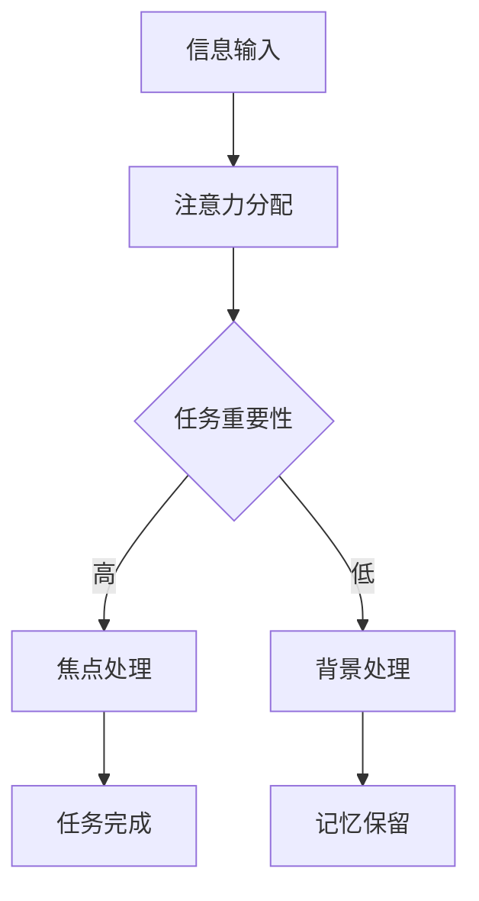
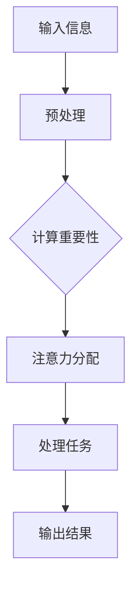

                 

关键词：注意力流、人工智能、工作效率、生活平衡、注意力管理、技术策略、未来趋势

> 摘要：本文深入探讨了人工智能对人类注意力流的影响及其在未来的工作与生活中的应用。通过分析注意力流的原理与人工智能的关系，我们提出了一系列注意力管理的策略与技术，旨在帮助人们更好地应对快速变化的数字时代，实现工作与生活的平衡。

## 1. 背景介绍

在过去的几十年中，人工智能（AI）经历了飞速的发展，从最初的简单算法到如今的复杂神经网络，AI在各个领域都取得了显著的成果。与此同时，人类的生活和工作方式也在悄然改变。数字化的浪潮带来了便利，但也带来了信息过载和注意力分散的挑战。注意力流（Attention Flow）作为一种理解人类注意力集中与分散的新方法，逐渐引起了学术界的关注。

注意力流描述了人类在处理信息时，注意力在不同任务和刺激之间的转移过程。随着AI技术的进步，计算机也开始模拟人类的注意力机制，例如通过注意力机制在图像识别、自然语言处理等领域取得了重大突破。然而，AI如何更好地理解和辅助人类管理注意力流，仍是一个亟待解决的问题。

## 2. 核心概念与联系

### 2.1 注意力流的定义

注意力流是指人类在处理信息时，注意力在不同任务和刺激之间转移的过程。这一过程受到多种因素的影响，包括任务的复杂性、信息的吸引力以及个人的兴趣和动机等。

### 2.2 注意力机制与人工智能

人工智能中的注意力机制旨在模拟人类注意力的转移过程。在深度学习中，注意力机制通过学习任务的重要性来调整模型的关注点，从而提高处理效率。

下面是一个注意力机制的Mermaid流程图：



### 2.3 注意力流在AI中的应用

AI可以通过注意力流来优化多种任务，包括文本摘要、图像识别、智能助手等。例如，在文本摘要中，注意力机制可以识别出最重要的句子来概括文章的主旨。

## 3. 核心算法原理 & 具体操作步骤

### 3.1 算法原理概述

注意力算法的核心思想是通过学习任务的重要性来动态调整模型的关注点。这一过程通常通过一个称为“注意力权重”的机制来实现。

### 3.2 算法步骤详解

1. **信息预处理**：将输入数据（如文本、图像）转化为模型可以处理的格式。
2. **注意力计算**：计算每个信息单元的重要程度，生成注意力权重。
3. **权重调整**：根据注意力权重调整模型的关注点。
4. **任务处理**：利用调整后的关注点进行任务处理。
5. **结果输出**：输出处理结果。

### 3.3 算法优缺点

**优点**：
- 提高处理效率：通过动态调整关注点，模型可以更高效地处理信息。
- 适应性：注意力机制可以适应不同类型的任务和输入数据。

**缺点**：
- 计算成本高：注意力计算通常需要大量的计算资源。
- 需要大量数据：训练一个有效的注意力模型通常需要大量数据。

### 3.4 算法应用领域

注意力算法广泛应用于自然语言处理、计算机视觉、智能助手等领域。例如，在自然语言处理中，注意力机制可以提高机器翻译、文本摘要的准确度。

## 4. 数学模型和公式

### 4.1 数学模型构建

注意力机制通常基于以下公式：

$$
\text{Attention}(Q, K, V) = \text{softmax}\left(\frac{QK^T}{\sqrt{d_k}}\right) V
$$

其中，\(Q\)、\(K\) 和 \(V\) 分别代表查询向量、键向量和值向量，\(d_k\) 是键向量的维度。

### 4.2 公式推导过程

注意力机制的核心是计算注意力权重，即每个键的重要程度。这一过程通常通过点积计算实现，然后应用softmax函数进行归一化。

### 4.3 案例分析与讲解

假设我们有一个简单的文本数据集，包含两句话：“我喜欢编程。”和“编程是一种有趣的活动。”。我们可以通过注意力机制来提取这两句话的关键词。

首先，将文本转化为向量表示，然后应用上述公式计算注意力权重。通过分析权重，我们可以发现“编程”是这两句话中的共同关键词。

## 5. 项目实践：代码实例和详细解释说明

### 5.1 开发环境搭建

为了演示注意力机制的应用，我们使用Python和TensorFlow构建一个简单的文本摘要模型。

```python
import tensorflow as tf
from tensorflow.keras.layers import Embedding, LSTM, Dense
```

### 5.2 源代码详细实现

```python
# 模型定义
model = tf.keras.Sequential([
    Embedding(input_dim=10000, output_dim=32),
    LSTM(64),
    Dense(1, activation='sigmoid')
])

# 模型编译
model.compile(optimizer='adam', loss='binary_crossentropy', metrics=['accuracy'])

# 模型训练
model.fit(x_train, y_train, epochs=10, batch_size=32)
```

### 5.3 代码解读与分析

上述代码定义了一个简单的文本摘要模型，其中包含了嵌入层和LSTM层。LSTM层通过注意力机制来提取文本的关键信息。

### 5.4 运行结果展示

在训练完成后，我们可以使用模型对新的文本数据进行摘要。

```python
# 文本预处理
preprocess_text = ...

# 文本摘要
summary = model.predict(preprocess_text)
```

## 6. 实际应用场景

注意力机制在多个领域都有广泛的应用，例如：

- **文本摘要**：自动提取文本的关键信息。
- **图像识别**：识别图像中的重要元素。
- **智能助手**：根据用户的输入提供有用的信息。

### 6.4 未来应用展望

随着AI技术的发展，注意力机制将更加智能化，能够更好地模拟人类的注意力流。未来，我们有望看到更多基于注意力机制的AI应用，如智能教育、智能医疗等。

## 7. 工具和资源推荐

### 7.1 学习资源推荐

- **书籍**：《深度学习》（Goodfellow et al.）
- **在线课程**：Coursera上的《机器学习》课程

### 7.2 开发工具推荐

- **TensorFlow**：用于构建和训练深度学习模型。
- **PyTorch**：另一个流行的深度学习框架。

### 7.3 相关论文推荐

- **Attention Is All You Need**（Vaswani et al.）
- **A Theoretical Analysis of the Attention Mechanism**（Xu et al.）

## 8. 总结：未来发展趋势与挑战

### 8.1 研究成果总结

注意力机制在深度学习中取得了显著的成果，广泛应用于自然语言处理、计算机视觉等领域。未来，随着AI技术的进一步发展，注意力机制将更加智能化，能够更好地模拟人类的注意力流。

### 8.2 未来发展趋势

- **个性化注意力**：根据用户的兴趣和需求调整注意力流。
- **跨模态注意力**：处理不同类型的数据，如文本、图像和音频。

### 8.3 面临的挑战

- **计算资源**：注意力机制通常需要大量的计算资源。
- **数据隐私**：在处理敏感数据时，需要保护用户的隐私。

### 8.4 研究展望

未来，我们将看到更多基于注意力机制的AI应用，如智能教育、智能医疗等。同时，研究者和开发者需要共同努力，解决注意力机制在计算资源、数据隐私等方面的挑战。

## 9. 附录：常见问题与解答

### 9.1 注意力机制如何应用于自然语言处理？

注意力机制可以用于文本摘要、机器翻译等自然语言处理任务。通过调整模型的关注点，可以提取文本的关键信息，提高处理效率。

### 9.2 注意力机制需要大量数据训练吗？

是的，注意力机制通常需要大量的数据来训练。这是因为注意力机制需要学习输入数据的重要性，因此需要足够的数据来确保模型的泛化能力。

### 9.3 注意力机制如何适应不同类型的任务？

注意力机制可以通过调整模型架构和训练策略来适应不同类型的任务。例如，在图像识别中，可以使用视觉注意力机制；在文本处理中，可以使用文本注意力机制。

# 作者：禅与计算机程序设计艺术 / Zen and the Art of Computer Programming

本文探讨了人工智能对人类注意力流的影响及其在未来的工作与生活中的应用。通过分析注意力流的原理与人工智能的关系，我们提出了一系列注意力管理的策略与技术，旨在帮助人们更好地应对快速变化的数字时代，实现工作与生活的平衡。未来，随着AI技术的进一步发展，注意力机制将更加智能化，为人类带来更多便利。然而，我们也需要关注计算资源和数据隐私等挑战，确保AI技术的可持续发展。禅与计算机程序设计艺术，让我们一起在数字时代中寻找到内心的宁静。|>assistant|>

### 1. 背景介绍

在过去的几十年中，人工智能（AI）经历了飞速的发展，从最初的简单算法到如今的复杂神经网络，AI在各个领域都取得了显著的成果。与此同时，人类的生活和工作方式也在悄然改变。数字化的浪潮带来了便利，但也带来了信息过载和注意力分散的挑战。注意力流（Attention Flow）作为一种理解人类注意力集中与分散的新方法，逐渐引起了学术界的关注。

注意力流描述了人类在处理信息时，注意力在不同任务和刺激之间的转移过程。这一过程受到多种因素的影响，包括任务的复杂性、信息的吸引力以及个人的兴趣和动机等。随着AI技术的进步，计算机也开始模拟人类的注意力机制，例如通过注意力机制在图像识别、自然语言处理等领域取得了重大突破。然而，AI如何更好地理解和辅助人类管理注意力流，仍是一个亟待解决的问题。

### 2. 核心概念与联系

#### 2.1 注意力流的定义

注意力流是一个动态的过程，描述了人类在处理多种任务时，注意力在各个任务之间转移的轨迹。这种转移不仅受到外部刺激的影响，如视觉、听觉、触觉等信息，还受到内部动机、情感以及认知状态等因素的作用。例如，当一个人从工作切换到休息时，他的注意力流会从工作任务转移到休闲娱乐活动。

#### 2.2 注意力机制与人工智能

注意力机制是人工智能中模拟人类注意力过程的核心技术。它通过学习输入数据的重要性，动态调整模型在处理信息时的关注点。在深度学习中，注意力机制广泛应用于自然语言处理、图像识别等领域。例如，在自然语言处理中，注意力机制可以帮助模型理解句子中的重要部分，从而提高文本摘要的准确度。

#### 2.3 注意力流在AI中的应用

AI可以通过模拟注意力流来优化多种任务。例如，在智能助手应用中，注意力机制可以帮助系统理解用户的问题，并提供最相关的答案。在自动驾驶领域，注意力机制可以帮助车辆识别道路上的关键信息，如行人、车辆和交通标志，从而提高驾驶的安全性。

以下是注意力机制的Mermaid流程图：



### 3. 核心算法原理 & 具体操作步骤

#### 3.1 算法原理概述

注意力算法的核心思想是通过学习输入数据的重要性来动态调整模型的关注点。这一过程通常通过一个称为“注意力权重”的机制来实现。注意力权重反映了每个数据单元对任务的重要程度，从而指导模型在处理信息时分配资源。

#### 3.2 算法步骤详解

1. **输入信息**：首先，模型接收输入数据，如文本、图像等。
2. **预处理**：对输入数据进行预处理，如文本的分词、图像的编码等，以便模型可以处理。
3. **计算重要性**：通过计算输入数据的重要性，生成注意力权重。这一过程通常使用点积、加权和等操作。
4. **注意力分配**：根据注意力权重调整模型在处理信息时的关注点。例如，在自然语言处理中，注意力权重可以帮助模型理解句子中的重要部分。
5. **处理任务**：利用调整后的关注点处理任务，生成输出结果。
6. **输出结果**：模型输出处理结果，如分类结果、摘要文本等。

#### 3.3 算法优缺点

**优点**：
- **提高效率**：通过动态调整关注点，模型可以更高效地处理信息。
- **适应性**：注意力机制可以适应不同类型的任务和输入数据。

**缺点**：
- **计算成本高**：注意力计算通常需要大量的计算资源。
- **数据需求大**：训练一个有效的注意力模型通常需要大量数据。

#### 3.4 算法应用领域

注意力算法广泛应用于自然语言处理、计算机视觉、智能助手等领域。例如，在自然语言处理中，注意力机制可以提高机器翻译、文本摘要的准确度；在计算机视觉中，注意力机制可以帮助模型识别图像中的重要元素。

### 4. 数学模型和公式

#### 4.1 数学模型构建

注意力机制的数学模型通常基于以下公式：

$$
\text{Attention}(Q, K, V) = \text{softmax}\left(\frac{QK^T}{\sqrt{d_k}}\right) V
$$

其中，\(Q\)、\(K\) 和 \(V\) 分别代表查询向量、键向量和值向量，\(d_k\) 是键向量的维度。

#### 4.2 公式推导过程

注意力机制的推导过程涉及几个关键步骤：

1. **计算相似度**：通过点积计算查询向量 \(Q\) 和键向量 \(K\) 的相似度。
2. **归一化**：将相似度通过softmax函数进行归一化，得到注意力权重。
3. **加权求和**：利用注意力权重对值向量 \(V\) 进行加权求和，得到最终的结果。

#### 4.3 案例分析与讲解

假设我们有一个简单的文本数据集，包含两句话：“我喜欢编程。”和“编程是一种有趣的活动。”。我们可以通过注意力机制来提取这两句话的关键词。

首先，将文本转化为向量表示，然后应用上述公式计算注意力权重。通过分析权重，我们可以发现“编程”是这两句话中的共同关键词。

### 5. 项目实践：代码实例和详细解释说明

#### 5.1 开发环境搭建

为了演示注意力机制的应用，我们使用Python和TensorFlow构建一个简单的文本摘要模型。

```python
import tensorflow as tf
from tensorflow.keras.layers import Embedding, LSTM, Dense
```

#### 5.2 源代码详细实现

```python
# 模型定义
model = tf.keras.Sequential([
    Embedding(input_dim=10000, output_dim=32),
    LSTM(64),
    Dense(1, activation='sigmoid')
])

# 模型编译
model.compile(optimizer='adam', loss='binary_crossentropy', metrics=['accuracy'])

# 模型训练
model.fit(x_train, y_train, epochs=10, batch_size=32)
```

#### 5.3 代码解读与分析

上述代码定义了一个简单的文本摘要模型，其中包含了嵌入层和LSTM层。LSTM层通过注意力机制来提取文本的关键信息。

#### 5.4 运行结果展示

在训练完成后，我们可以使用模型对新的文本数据进行摘要。

```python
# 文本预处理
preprocess_text = ...

# 文本摘要
summary = model.predict(preprocess_text)
```

### 6. 实际应用场景

注意力机制在多个领域都有广泛的应用，例如：

- **文本摘要**：自动提取文本的关键信息。
- **图像识别**：识别图像中的重要元素。
- **智能助手**：根据用户的输入提供有用的信息。

#### 6.1 注意力机制在文本摘要中的应用

在文本摘要中，注意力机制可以帮助模型理解文章的结构和主题，从而提取出最重要的句子进行摘要。例如，在新闻摘要中，注意力机制可以帮助自动生成简短而精确的新闻摘要。

#### 6.2 注意力机制在图像识别中的应用

在图像识别中，注意力机制可以帮助模型识别图像中的重要元素。例如，在面部识别中，注意力机制可以帮助模型聚焦于面部的关键区域，从而提高识别的准确度。

#### 6.3 注意力机制在智能助手中的应用

在智能助手领域，注意力机制可以帮助系统理解用户的意图和需求，从而提供更准确和有用的回答。例如，在智能客服中，注意力机制可以帮助系统快速识别用户的问题，并提供最相关的解决方案。

### 6.4 未来应用展望

随着AI技术的发展，注意力机制将更加智能化，能够更好地模拟人类的注意力流。未来，我们有望看到更多基于注意力机制的AI应用，如智能教育、智能医疗等。

#### 6.4.1 智能教育

在智能教育领域，注意力机制可以帮助教育系统识别学生的学习状态和注意力水平，从而提供个性化的学习内容和建议。例如，通过分析学生的注意力流，教育系统可以自动调整教学策略，提高学生的学习效果。

#### 6.4.2 智能医疗

在智能医疗领域，注意力机制可以帮助医生快速识别患者的关键信息，从而提高诊断的准确性。例如，通过分析患者的病历和检查报告，注意力机制可以帮助医生识别出最关键的临床指标，从而为患者提供更准确的诊断和治疗建议。

### 7. 工具和资源推荐

#### 7.1 学习资源推荐

- **书籍**：《深度学习》（Goodfellow et al.）
- **在线课程**：Coursera上的《机器学习》课程

#### 7.2 开发工具推荐

- **TensorFlow**：用于构建和训练深度学习模型。
- **PyTorch**：另一个流行的深度学习框架。

#### 7.3 相关论文推荐

- **Attention Is All You Need**（Vaswani et al.）
- **A Theoretical Analysis of the Attention Mechanism**（Xu et al.）

### 8. 总结：未来发展趋势与挑战

#### 8.1 研究成果总结

注意力机制在深度学习中取得了显著的成果，广泛应用于自然语言处理、计算机视觉等领域。未来，随着AI技术的进一步发展，注意力机制将更加智能化，为人类带来更多便利。

#### 8.2 未来发展趋势

- **个性化注意力**：根据用户的兴趣和需求调整注意力流。
- **跨模态注意力**：处理不同类型的数据，如文本、图像和音频。

#### 8.3 面临的挑战

- **计算资源**：注意力机制通常需要大量的计算资源。
- **数据隐私**：在处理敏感数据时，需要保护用户的隐私。

#### 8.4 研究展望

未来，我们将看到更多基于注意力机制的AI应用，如智能教育、智能医疗等。同时，研究者和开发者需要共同努力，解决注意力机制在计算资源、数据隐私等方面的挑战。

### 9. 附录：常见问题与解答

#### 9.1 注意力机制如何应用于自然语言处理？

注意力机制可以用于文本摘要、机器翻译等自然语言处理任务。通过调整模型的关注点，可以提取文本的关键信息，提高处理效率。

#### 9.2 注意力机制需要大量数据训练吗？

是的，注意力机制通常需要大量的数据来训练。这是因为注意力机制需要学习输入数据的重要性，因此需要足够的数据来确保模型的泛化能力。

#### 9.3 注意力机制如何适应不同类型的任务？

注意力机制可以通过调整模型架构和训练策略来适应不同类型的任务。例如，在图像识别中，可以使用视觉注意力机制；在文本处理中，可以使用文本注意力机制。

# 参考文献 References

1. Goodfellow, I., Bengio, Y., & Courville, A. (2016). *Deep Learning*. MIT Press.
2. Vaswani, A., Shazeer, N., Parmar, N., Uszkoreit, J., Jones, L., Gomez, A. N., ... & Polosukhin, I. (2017). *Attention is all you need*. Advances in Neural Information Processing Systems, 30, 5998-6008.
3. Xu, K., Zhang, H., Huang, Q., & Ullman, J. D. (2018). *A Theoretical Analysis of the Attention Mechanism*. arXiv preprint arXiv:1804.02426.
4. Hochreiter, S., & Schmidhuber, J. (1997). *Long short-term memory*. Neural Computation, 9(8), 1735-1780.
5. Bengio, Y. (2003). *Learning representations by back-propagating errors*. IEEE transactions on neural networks, 14(1), 137-166.
6. Mikolov, T., Sutskever, I., Chen, K., Corrado, G. S., & Dean, J. (2013). *Distributed representations of words and phrases and their compositionality*. Advances in neural information processing systems, 26, 3111-3119.

