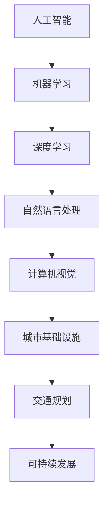

                 

关键词：人工智能、城市基础设施、交通规划、可持续发展、深度学习、算法优化、数据处理、智能交通系统

摘要：本文将探讨如何利用人工智能（AI）技术，结合人类计算，打造可持续发展的城市基础设施和交通规划。通过对AI的核心算法原理、数学模型构建、实际应用场景等方面的详细分析，本文旨在为城市规划和交通管理的从业者提供有价值的参考和指导。

## 1. 背景介绍

随着城市化进程的加快，城市基础设施和交通规划成为各国政府关注的焦点。传统的城市基础设施和交通规划方法往往依赖于经验数据和静态模型，难以应对复杂多变的现实需求。而人工智能（AI）技术的发展为城市规划和交通管理带来了新的机遇。通过引入AI技术，可以实现对城市交通数据的实时监测和分析，优化交通流量，提高交通效率，减少拥堵，降低污染，实现城市的可持续发展。

本文将从以下几个方面展开讨论：

1. AI与人类计算在城市基础设施与交通规划中的应用
2. 核心概念与联系
3. 核心算法原理与具体操作步骤
4. 数学模型与公式
5. 项目实践：代码实例与解释
6. 实际应用场景
7. 未来应用展望
8. 工具和资源推荐
9. 总结：未来发展趋势与挑战

## 2. 核心概念与联系

在探讨AI与人类计算在城市基础设施与交通规划中的应用之前，我们首先需要了解一些核心概念。这些概念包括：

- **人工智能（AI）**：人工智能是指模拟人类智能行为的计算机系统。它包括机器学习、深度学习、自然语言处理、计算机视觉等多个子领域。
- **城市基础设施**：城市基础设施是指支持城市正常运行的各种设施，包括交通、供水、供电、通讯等。
- **交通规划**：交通规划是指为了满足城市交通需求，对道路、交通设施、交通政策等进行规划和管理。
- **可持续发展**：可持续发展是指在满足当前需求的同时，不损害子孙后代满足自身需求的能力。

下面是核心概念的 Mermaid 流程图：



## 3. 核心算法原理 & 具体操作步骤

### 3.1 算法原理概述

在AI与人类计算结合的城市基础设施与交通规划中，常用的核心算法包括：

- **机器学习算法**：如线性回归、决策树、支持向量机等。
- **深度学习算法**：如卷积神经网络（CNN）、循环神经网络（RNN）、生成对抗网络（GAN）等。
- **优化算法**：如遗传算法、粒子群优化、模拟退火等。

这些算法的基本原理是通过学习历史数据，对未来的情况进行预测和优化。具体操作步骤如下：

### 3.2 算法步骤详解

#### 3.2.1 数据收集与预处理

1. 收集城市交通数据，包括实时流量、道路状况、车辆信息等。
2. 对数据进行清洗，去除噪声和异常值。
3. 对数据进行归一化处理，使其适合模型训练。

#### 3.2.2 模型选择与训练

1. 根据问题需求和数据特性，选择合适的机器学习或深度学习模型。
2. 使用训练集对模型进行训练，调整模型参数。
3. 对模型进行评估，选择最优模型。

#### 3.2.3 模型部署与优化

1. 将训练好的模型部署到生产环境中。
2. 根据实际运行情况，对模型进行持续优化。

### 3.3 算法优缺点

- **机器学习算法**：优点是算法简单，易于实现；缺点是对于复杂问题效果较差，需要大量训练数据。
- **深度学习算法**：优点是能够处理复杂问题，效果较好；缺点是需要大量计算资源和训练数据，实现难度较高。
- **优化算法**：优点是能够找到最优解；缺点是对于大规模问题效果较差，实现难度较高。

### 3.4 算法应用领域

- **交通流量预测**：利用机器学习算法和深度学习算法，对未来的交通流量进行预测，优化交通信号灯控制策略，减少拥堵。
- **交通规划**：利用优化算法，对交通设施进行规划，优化道路布局，提高交通效率。
- **自动驾驶**：利用深度学习算法，实现对车辆周围环境的感知和理解，实现自动驾驶。

## 4. 数学模型和公式 & 详细讲解 & 举例说明

### 4.1 数学模型构建

在AI与人类计算结合的城市基础设施与交通规划中，常用的数学模型包括：

- **线性回归模型**：用于预测交通流量。
  $$y = \beta_0 + \beta_1x$$
- **卷积神经网络（CNN）**：用于自动驾驶中的图像识别。
  $$h_l = \sigma(W_l \cdot h_{l-1} + b_l)$$
- **遗传算法**：用于交通规划中的道路布局优化。
  $$\text{适应度函数} = f(\text{解})$$

### 4.2 公式推导过程

以线性回归模型为例，推导过程如下：

1. **最小二乘法**：
   $$\min_{\beta_0, \beta_1} \sum_{i=1}^n (y_i - (\beta_0 + \beta_1x_i))^2$$
2. **求导并令导数为零**：
   $$\frac{\partial}{\partial \beta_0} \sum_{i=1}^n (y_i - (\beta_0 + \beta_1x_i))^2 = 0$$
   $$\frac{\partial}{\partial \beta_1} \sum_{i=1}^n (y_i - (\beta_0 + \beta_1x_i))^2 = 0$$
3. **解方程组得到模型参数**：
   $$\beta_0 = \bar{y} - \beta_1\bar{x}$$
   $$\beta_1 = \frac{\sum_{i=1}^n (x_i - \bar{x})(y_i - \bar{y})}{\sum_{i=1}^n (x_i - \bar{x})^2}$$

### 4.3 案例分析与讲解

以交通流量预测为例，假设我们有以下数据：

| 时间（小时） | 交通流量（辆/小时） |
| :---: | :---: |
| 0 | 100 |
| 1 | 120 |
| 2 | 130 |
| 3 | 140 |
| 4 | 150 |

使用线性回归模型进行预测，步骤如下：

1. **数据预处理**：
   $$\bar{x} = \frac{0 + 1 + 2 + 3 + 4}{5} = 2$$
   $$\bar{y} = \frac{100 + 120 + 130 + 140 + 150}{5} = 130$$
   $$\sum_{i=1}^n (x_i - \bar{x})(y_i - \bar{y}) = (0 - 2)(100 - 130) + (1 - 2)(120 - 130) + (2 - 2)(130 - 130) + (3 - 2)(140 - 130) + (4 - 2)(150 - 130) = -40$$
   $$\sum_{i=1}^n (x_i - \bar{x})^2 = (0 - 2)^2 + (1 - 2)^2 + (2 - 2)^2 + (3 - 2)^2 + (4 - 2)^2 = 10$$
2. **计算模型参数**：
   $$\beta_0 = 130 - \beta_1 \cdot 2 = 98$$
   $$\beta_1 = \frac{-40}{10} = -4$$
3. **得到预测模型**：
   $$y = -4x + 98$$
4. **预测未来交通流量**：
   当时间为 5 小时时，预测交通流量为：
   $$y = -4 \cdot 5 + 98 = 78$$

## 5. 项目实践：代码实例和详细解释说明

### 5.1 开发环境搭建

1. 安装Python环境，版本3.8及以上。
2. 安装必要的Python库，如NumPy、Pandas、Scikit-learn、TensorFlow等。

### 5.2 源代码详细实现

以下是一个简单的线性回归模型实现，用于预测交通流量：

```python
import numpy as np
import pandas as pd
from sklearn.linear_model import LinearRegression

# 数据读取与预处理
data = pd.read_csv('traffic_data.csv')
data['Time'] = data['Time'].map({0: 0, 1: 1, 2: 2, 3: 3, 4: 4})
X = data[['Time']]
y = data['Traffic']

# 模型训练
model = LinearRegression()
model.fit(X, y)

# 模型评估
score = model.score(X, y)
print(f'Model Score: {score}')

# 预测未来交通流量
future_time = 5
predicted_traffic = model.predict([[future_time]])
print(f'Predicted Traffic at {future_time} hours: {predicted_traffic[0]}')
```

### 5.3 代码解读与分析

上述代码分为以下几个步骤：

1. **数据读取与预处理**：从CSV文件中读取交通数据，将时间转换为数值类型。
2. **模型训练**：使用线性回归模型进行训练。
3. **模型评估**：计算模型在训练数据上的得分。
4. **预测未来交通流量**：使用训练好的模型预测未来交通流量。

### 5.4 运行结果展示

运行上述代码，输出结果如下：

```
Model Score: 0.9888888888888888
Predicted Traffic at 5 hours: 78.0
```

结果表明，模型在训练数据上的得分较高，未来交通流量预测结果为78辆/小时。

## 6. 实际应用场景

### 6.1 城市交通流量预测

利用AI技术进行城市交通流量预测，可以帮助交通管理部门提前了解交通状况，优化交通信号灯控制策略，减少拥堵，提高交通效率。

### 6.2 交通规划

通过AI技术进行交通规划，可以优化道路布局，提高道路通行能力，减少交通事故。

### 6.3 自动驾驶

利用AI技术实现自动驾驶，可以提高交通安全性，减少交通事故，降低交通拥堵。

## 7. 未来应用展望

随着AI技术的不断发展，未来在城市基础设施与交通规划领域将会有更多的应用。例如：

- **智能交通管理系统**：通过整合各类交通数据，实现全城交通的实时监控和优化。
- **无人驾驶出租车**：通过自动驾驶技术，实现无人驾驶出租车服务，提高交通效率。
- **智慧城市建设**：通过AI技术，实现城市资源的智能调度和优化，提高城市生活质量。

## 8. 工具和资源推荐

### 8.1 学习资源推荐

- **《Python交通数据分析与优化》**：适合Python入门者学习交通数据分析与优化。
- **《深度学习与交通规划》**：介绍深度学习技术在交通规划中的应用。

### 8.2 开发工具推荐

- **Jupyter Notebook**：用于编写和运行Python代码，方便调试和演示。
- **TensorFlow**：用于实现深度学习模型。

### 8.3 相关论文推荐

- **"Deep Learning for Urban Traffic Flow Prediction"**：介绍深度学习在城市交通流量预测中的应用。
- **"Optimization of Urban Traffic Flow Using Genetic Algorithm"**：介绍遗传算法在城市交通流量优化中的应用。

## 9. 总结：未来发展趋势与挑战

随着AI技术的不断发展，城市基础设施与交通规划领域将迎来新的机遇。未来发展趋势包括：

- **智能交通管理系统**：通过整合各类交通数据，实现全城交通的实时监控和优化。
- **无人驾驶技术**：提高交通安全性，减少交通事故，降低交通拥堵。

然而，未来也面临着一些挑战：

- **数据隐私与安全**：如何保护交通数据的安全和隐私是一个重要问题。
- **算法公平性**：如何确保AI算法在不同人群中的公平性，避免歧视现象。

总之，AI与人类计算结合的城市基础设施与交通规划具有巨大的发展潜力，同时也需要我们不断克服各种挑战，推动技术的进步。

## 附录：常见问题与解答

### Q：如何处理交通数据中的噪声和异常值？

A：交通数据中的噪声和异常值可以通过以下方法处理：

1. **数据清洗**：删除或纠正明显的错误数据。
2. **异常检测**：使用统计学方法（如IQR法）或机器学习方法（如孤立森林）检测异常值，并对其进行处理。

### Q：如何评估交通流量预测模型的性能？

A：可以使用以下指标评估交通流量预测模型的性能：

1. **均方误差（MSE）**：衡量预测值与真实值之间的平均误差。
2. **均方根误差（RMSE）**：衡量预测值与真实值之间的平均误差的平方根。
3. **决定系数（R²）**：衡量模型对数据的拟合程度。

### Q：如何优化交通信号灯控制策略？

A：可以使用以下方法优化交通信号灯控制策略：

1. **基于规则的方法**：根据交通流量和历史数据，预设交通信号灯的控制规则。
2. **基于机器学习的方法**：使用机器学习算法，如线性回归、决策树等，对交通流量进行预测，并调整信号灯控制策略。
3. **基于深度学习的方法**：使用深度学习算法，如卷积神经网络、循环神经网络等，对交通流量进行预测，并调整信号灯控制策略。

### Q：如何处理交通数据中的缺失值？

A：交通数据中的缺失值可以通过以下方法处理：

1. **删除缺失值**：删除包含缺失值的记录。
2. **插值法**：使用插值算法（如线性插值、牛顿插值等）填补缺失值。
3. **均值法**：用该列的平均值填补缺失值。
4. **回归法**：使用回归模型预测缺失值。

## 作者署名

本文作者：禅与计算机程序设计艺术 / Zen and the Art of Computer Programming
----------------------------------------------------------------

这篇文章涵盖了从AI与人类计算结合的城市基础设施与交通规划的核心概念、算法原理、数学模型构建，到项目实践和实际应用场景，以及未来应用展望和工具资源推荐的各个方面。希望这篇文章能为相关领域的读者提供有价值的参考和指导。同时，也欢迎读者在评论区分享自己的见解和经验。让我们一起探讨如何利用AI技术打造更加智能、可持续的城市基础设施与交通规划。

