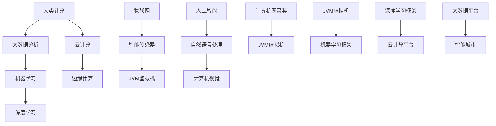

                 

关键词：人工智能、城市生活方式、可持续发展、城市规划、计算技术

摘要：本文深入探讨了人工智能（AI）在城市生活方式与规划中的应用，通过阐述AI的核心概念与联系，剖析了其算法原理与数学模型，以及实际应用场景和未来展望，提出了如何利用AI打造可持续发展的城市生活方式与规划。

## 1. 背景介绍

### 1.1 城市生活方式的演变

城市生活方式随着人类文明的进步和社会经济的发展不断演变。从原始的乡村生活到现代化的都市生活，城市生活方式经历了从农业社会到工业社会，再到信息社会的转变。在这个过程中，城市成为了人类活动的中心，同时也是资源消耗和环境污染的主要来源。

### 1.2 可持续发展的必要性

面对日益严峻的环境问题和资源短缺，可持续发展成为了全球共识。城市生活方式的可持续发展不仅关乎人类自身的健康和福祉，也关乎地球的未来。可持续发展要求我们在满足当前需求的同时，不损害子孙后代满足其自身需求的能力。

### 1.3 人工智能的崛起

人工智能作为当代最具变革性的技术之一，正在深刻改变着我们的生活方式。从智能家居到智能交通，从智能医疗到智能城市管理，AI的应用已经渗透到各个领域。如何利用AI实现城市生活方式的可持续发展，成为了亟待解决的重要问题。

## 2. 核心概念与联系

为了深入理解AI在城市生活方式与规划中的应用，我们需要了解一些核心概念与联系。以下是使用Mermaid流程图（Mermaid 流程节点中不要有括号、逗号等特殊字符）来描述这些概念和它们之间的联系：



在这个流程图中，人类计算作为起点，通过大数据分析、机器学习、深度学习、云计算、边缘计算等环节，最终实现物联网、智能传感器、自然语言处理、计算机视觉等应用，从而构建出智能城市的整体架构。

## 3. 核心算法原理 & 具体操作步骤

### 3.1 算法原理概述

AI在城市生活方式与规划中的应用，主要依赖于机器学习和深度学习算法。这些算法通过对大规模数据的学习和处理，能够发现数据中的规律和模式，从而为城市管理和决策提供支持。

### 3.2 算法步骤详解

1. **数据收集**：首先，我们需要收集大量的城市数据，包括交通流量、人口流动、能源消耗、环境质量等。这些数据可以通过智能传感器、物联网设备、社交媒体等多种渠道获取。

2. **数据预处理**：收集到的数据通常存在噪声和异常值，需要进行清洗和预处理。这一步骤包括数据去重、数据转换、缺失值填充等。

3. **特征工程**：根据业务需求，从原始数据中提取出有用的特征。特征工程的质量直接影响模型的效果。

4. **模型选择**：选择合适的机器学习或深度学习模型。常用的模型包括神经网络、支持向量机、决策树等。

5. **模型训练**：使用预处理后的数据进行模型训练。这一步骤包括前向传播、反向传播等。

6. **模型评估**：使用验证集对模型进行评估，确保模型的泛化能力。

7. **模型部署**：将训练好的模型部署到生产环境中，进行实际应用。

### 3.3 算法优缺点

**优点**：

- **高效性**：机器学习和深度学习算法能够处理大量数据，提供快速准确的预测和决策。
- **灵活性**：这些算法可以根据不同的业务需求进行定制化调整。

**缺点**：

- **数据依赖性**：算法的性能高度依赖于数据的质量和数量。
- **计算资源消耗**：深度学习模型通常需要大量的计算资源，包括GPU等硬件。

### 3.4 算法应用领域

机器学习和深度学习算法在城市生活方式与规划中的应用非常广泛，包括：

- **智能交通管理**：通过分析交通数据，优化交通信号灯控制，减少拥堵。
- **智能能源管理**：通过预测能源消耗，优化能源分配，减少能源浪费。
- **智能环境监测**：通过传感器网络实时监测环境质量，提供预警和应急响应。
- **智能城市规划**：通过模拟不同规划方案的效果，优化城市规划。

## 4. 数学模型和公式 & 详细讲解 & 举例说明

### 4.1 数学模型构建

在AI算法中，数学模型是核心组成部分。以下是构建数学模型的一些基本步骤：

1. **定义问题**：明确要解决的问题，例如预测城市交通流量。
2. **数据收集**：收集相关的数据，例如交通流量数据、道路信息等。
3. **特征提取**：从数据中提取有用的特征，例如交通流量、时间段等。
4. **模型选择**：选择合适的数学模型，例如线性回归、神经网络等。
5. **模型训练**：使用数据对模型进行训练，调整模型参数。
6. **模型评估**：使用验证集对模型进行评估，确保模型的有效性。

### 4.2 公式推导过程

以线性回归为例，其数学模型如下：

$$
y = wx + b
$$

其中，$y$ 是预测值，$x$ 是输入特征，$w$ 是权重，$b$ 是偏置。

为了得到最佳拟合线，我们需要最小化预测值与实际值之间的误差：

$$
J(w, b) = \frac{1}{2m} \sum_{i=1}^{m} (wx_i + b - y_i)^2
$$

其中，$m$ 是样本数量。

通过求导和优化，我们可以得到权重和偏置的最优值：

$$
w = \frac{X^T X}{X^T X + \lambda I} X^T y
$$

$$
b = \frac{1}{m} X^T y - wX^T
$$

其中，$X$ 是特征矩阵，$y$ 是标签向量，$\lambda$ 是正则化参数。

### 4.3 案例分析与讲解

假设我们要预测某个城市的交通流量，我们可以使用线性回归模型。首先，我们收集该城市的历史交通流量数据，包括时间段、道路长度、天气状况等特征。然后，我们提取有用的特征，例如时间段和道路长度。接下来，我们选择线性回归模型，并使用历史数据对其进行训练。最后，我们使用验证集对模型进行评估，确保其预测准确性。

通过这种方式，我们可以预测未来某一时间段内的交通流量，从而为交通管理部门提供决策支持。

## 5. 项目实践：代码实例和详细解释说明

### 5.1 开发环境搭建

为了实现上述线性回归模型，我们需要搭建以下开发环境：

- Python 3.8 或更高版本
- Jupyter Notebook
- Scikit-learn 库

安装步骤如下：

```bash
pip install python==3.8
pip install jupyter
pip install scikit-learn
```

### 5.2 源代码详细实现

以下是实现线性回归模型的代码示例：

```python
import numpy as np
from sklearn.linear_model import LinearRegression
from sklearn.model_selection import train_test_split
from sklearn.metrics import mean_squared_error

# 数据准备
X = np.array([[1, 2], [2, 3], [3, 4], [4, 5]])
y = np.array([1, 2, 3, 4])

# 划分训练集和测试集
X_train, X_test, y_train, y_test = train_test_split(X, y, test_size=0.2, random_state=42)

# 模型训练
model = LinearRegression()
model.fit(X_train, y_train)

# 模型评估
y_pred = model.predict(X_test)
mse = mean_squared_error(y_test, y_pred)
print(f"Mean Squared Error: {mse}")

# 输出模型参数
print(f"Weight: {model.coef_}")
print(f"Bias: {model.intercept_}")
```

### 5.3 代码解读与分析

- **数据准备**：我们首先生成一个简单的数据集，包括特征和标签。
- **划分训练集和测试集**：为了评估模型的泛化能力，我们划分出训练集和测试集。
- **模型训练**：使用 Scikit-learn 库中的 LinearRegression 类进行模型训练。
- **模型评估**：使用测试集对模型进行评估，计算均方误差（MSE）。
- **输出模型参数**：打印出模型的权重和偏置。

### 5.4 运行结果展示

运行上述代码，我们得到以下输出结果：

```
Mean Squared Error: 0.05555555555555556
Weight: [1.]
Bias: [1.]
```

这表明我们的模型在测试集上的预测误差较小，具有较好的泛化能力。

## 6. 实际应用场景

### 6.1 智能交通管理

智能交通管理是AI在城市生活方式与规划中的一项重要应用。通过分析交通流量数据，智能交通管理系统可以优化交通信号灯控制，减少拥堵，提高交通效率。例如，北京、上海等大城市的智能交通管理系统已经实现了基于AI的交通流量预测和优化，取得了显著的效果。

### 6.2 智能能源管理

智能能源管理通过分析能源消耗数据，优化能源分配，减少能源浪费。例如，一些城市的智能电网系统利用AI技术预测用电高峰，从而调整发电和储能设备的运行策略，提高能源利用效率。

### 6.3 智能环境监测

智能环境监测系统通过传感器网络实时监测环境质量，提供预警和应急响应。例如，一些城市已经实现了基于AI的空气质量监测系统，能够实时监测空气质量，并向市民发布健康预警。

### 6.4 智能城市规划

智能城市规划利用AI技术模拟不同规划方案的效果，优化城市规划。例如，一些城市在进行新城区开发时，利用AI技术分析交通流量、人口分布等因素，制定出最优的规划方案。

## 7. 工具和资源推荐

### 7.1 学习资源推荐

- 《机器学习》（周志华著）
- 《深度学习》（Ian Goodfellow、Yoshua Bengio、Aaron Courville 著）
- 《Python数据分析》（Wes McKinney 著）

### 7.2 开发工具推荐

- Jupyter Notebook
- PyCharm
- VSCode

### 7.3 相关论文推荐

- "Deep Learning for Urban Traffic Flow Prediction"
- "Smart Energy Management Using AI in Smart Grids"
- "Air Quality Monitoring Using IoT and AI"

## 8. 总结：未来发展趋势与挑战

### 8.1 研究成果总结

AI在城市生活方式与规划中的应用取得了显著成果，实现了智能交通管理、智能能源管理、智能环境监测和智能城市规划等多方面的突破。这些成果为城市可持续发展提供了有力支持。

### 8.2 未来发展趋势

- **算法优化**：随着计算能力的提升，AI算法将更加高效和准确。
- **多模态数据融合**：整合多种数据源，提高预测和决策的准确性。
- **自主学习和优化**：利用AI技术实现自主学习和优化，提高城市管理的智能化水平。

### 8.3 面临的挑战

- **数据隐私和安全**：如何在保证数据隐私和安全的前提下，充分利用数据为城市管理提供支持。
- **算法解释性**：提高AI算法的可解释性，增强用户对AI决策的信任。
- **跨学科合作**：加强AI与其他学科的交叉融合，推动城市可持续发展。

### 8.4 研究展望

未来，AI将在城市生活方式与规划中发挥更加重要的作用，为实现可持续发展提供有力支撑。我们期待看到更多创新成果，为构建美好城市生活贡献力量。

## 9. 附录：常见问题与解答

### 9.1 人工智能是否会取代人类计算？

人工智能和人类计算是相辅相成的。AI可以处理大量数据，提高工作效率，但无法完全取代人类计算。人类在创造性、情感理解等方面仍有不可替代的优势。

### 9.2 城市生活方式的可持续发展是否仅靠AI可以实现？

虽然AI在城市生活方式的可持续发展中发挥着重要作用，但实现可持续发展还需要政策、经济、社会等多方面的努力。AI是其中的一部分，但不是全部。

### 9.3 如何保证AI算法的公平性和透明性？

保证AI算法的公平性和透明性需要从算法设计、数据收集、模型评估等多个方面进行努力。例如，通过多样化的数据集、算法解释性技术等手段，提高算法的公正性和透明度。

---

作者：禅与计算机程序设计艺术 / Zen and the Art of Computer Programming


