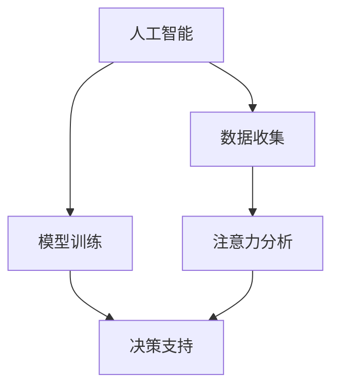

                 

关键词：人工智能，注意力管理，人类优势，认知负荷，算法优化，人机协作

摘要：随着人工智能技术的迅猛发展，人类面临着越来越多的信息处理和决策压力。本文旨在探讨如何通过AI与注意力管理的结合，优化人类认知负荷，保持人类在复杂环境中的竞争优势。文章首先介绍了人工智能和注意力管理的基本概念，然后深入分析了两者之间的联系和相互作用，最后提出了具体的实践方法和未来研究方向。

## 1. 背景介绍

在当今信息爆炸的时代，人类面对的信息量和决策难度不断攀升。这给我们的认知系统带来了巨大的压力，导致认知负荷的增加。与此同时，人工智能（AI）技术的发展为我们提供了一种新的工具，可以帮助我们应对这种挑战。然而，人工智能的发展也带来了新的问题，即如何让人类与机器有效地协作，最大化人类的认知优势。

注意力管理（Attention Management）作为一种认知心理学研究，旨在理解人类如何选择和分配注意力资源，以应对各种认知任务。本文将探讨如何利用AI技术优化注意力管理，从而提高人类在信息过载环境中的表现。

## 2. 核心概念与联系

### 2.1 人工智能

人工智能（Artificial Intelligence，简称AI）是计算机科学的一个分支，旨在使机器能够模拟、延伸和扩展人类智能。AI技术包括机器学习、深度学习、自然语言处理、计算机视觉等多个领域。其核心目标是通过算法和模型，使计算机具备自主学习和决策能力。

### 2.2 注意力管理

注意力管理是指人类在选择和分配注意力资源时的行为和策略。它涉及到如何识别重要的信息、如何平衡多任务处理、如何避免分心等。注意力管理的研究对于理解人类认知过程的本质和优化人类工作表现具有重要意义。

### 2.3 AI与注意力管理的联系

AI与注意力管理之间的联系主要体现在以下几个方面：

1. **AI技术可以辅助注意力分配**：通过分析大量数据，AI可以帮助我们识别出最重要的信息，从而优化注意力的分配。
2. **AI可以模拟人类的注意力机制**：例如，通过生成对抗网络（GAN）等技术，AI可以模拟人类的注意力机制，帮助我们在复杂环境中进行高效的信息处理。
3. **AI可以帮助我们训练注意力管理技能**：例如，通过虚拟现实（VR）技术，我们可以设计出模拟注意力管理训练的场景，帮助人们提高注意力管理能力。

### 2.4 Mermaid 流程图



在这个流程图中，AI技术通过数据收集、模型训练和注意力分析等步骤，为人类提供决策支持，从而优化注意力管理。

## 3. 核心算法原理 & 具体操作步骤

### 3.1 算法原理概述

注意力管理的核心算法通常基于认知负荷理论和多任务处理模型。这些算法通过分析用户的行为数据，预测用户在执行任务时的认知负荷，并提供相应的注意力管理策略。

### 3.2 算法步骤详解

1. **数据收集**：收集用户在执行任务时的行为数据，如点击记录、浏览时间、操作频率等。
2. **特征提取**：从行为数据中提取出与注意力管理相关的特征，如任务难度、信息量、用户状态等。
3. **负荷预测**：利用机器学习算法，如回归模型或神经网络，预测用户在执行任务时的认知负荷。
4. **策略生成**：根据负荷预测结果，生成相应的注意力管理策略，如信息筛选、任务优先级调整、休息建议等。
5. **策略执行**：将生成的策略应用于实际任务中，以优化用户的注意力管理。

### 3.3 算法优缺点

**优点**：
- **高效性**：通过分析大量数据，算法能够提供准确的负荷预测和有效的注意力管理策略。
- **个性化**：算法可以根据用户的具体行为特征，提供个性化的注意力管理建议。

**缺点**：
- **数据依赖性**：算法的准确性依赖于用户行为数据的质量和数量。
- **复杂度**：算法的实现和训练过程相对复杂，需要大量的计算资源和专业知识。

### 3.4 算法应用领域

注意力管理算法可以应用于多个领域，如企业办公、教育、医疗等。例如，在企业办公中，AI可以帮助员工识别和过滤冗余信息，提高工作效率；在教育领域，AI可以帮助教师识别学生的学习困难点，提供个性化的辅导建议。

## 4. 数学模型和公式 & 详细讲解 & 举例说明

### 4.1 数学模型构建

注意力管理的数学模型通常基于认知负荷理论，其核心是负荷函数（Load Function）和策略函数（Strategy Function）。负荷函数用于预测用户在执行任务时的认知负荷，策略函数则用于生成注意力管理策略。

负荷函数通常表示为：

$$
Load(t) = f(Difficulty(t), Information Quantity(t), User State(t))
$$

其中，$Difficulty(t)$表示任务难度，$Information Quantity(t)$表示信息量，$User State(t)$表示用户状态。

策略函数则表示为：

$$
Strategy(t) = g(Load(t))
$$

其中，$Load(t)$是负荷函数的输出。

### 4.2 公式推导过程

负荷函数的推导过程基于认知负荷理论，该理论认为认知负荷是由任务的难度、信息量以及用户的状态共同决定的。这些因素可以通过以下公式进行量化：

$$
Difficulty(t) = \frac{Task Complexity(t)}{Skill Level(t)}
$$

$$
Information Quantity(t) = \sum_{i=1}^{n} Weight_i \cdot Information Value_i(t)
$$

$$
User State(t) = \sum_{j=1}^{m} Attribute_j \cdot Value_j(t)
$$

其中，$Task Complexity(t)$表示任务复杂性，$Skill Level(t)$表示用户技能水平，$Weight_i$和$Information Value_i(t)$分别表示信息的权重和价值，$Attribute_j$和$Value_j(t)$分别表示用户状态的属性和值。

策略函数的推导过程则基于目标函数优化理论，目标是根据负荷预测结果，选择最优的注意力管理策略。这可以通过以下公式表示：

$$
Strategy(t) = \arg\min_{s} \{ Cost(s) \}
$$

其中，$Cost(s)$表示策略$s$的代价函数。

### 4.3 案例分析与讲解

假设一个用户需要处理一份包含100页报告的任务。通过分析报告的内容，我们可以将其分为任务难度、信息量以及用户状态三个维度进行量化。

1. **任务难度**：假设每页报告的难度为1，总难度为100。
2. **信息量**：假设每页报告的信息量为1，总信息量为100。
3. **用户状态**：假设用户在处理任务时的状态为集中，状态值为1。

根据以上数据，我们可以计算出用户的认知负荷：

$$
Load(t) = f(100, 100, 1) = 100
$$

根据负荷函数和策略函数，我们可以得到最优的注意力管理策略。假设策略函数为：

$$
Strategy(t) = g(Load(t)) = \begin{cases} 
"休息" & \text{如果 } Load(t) > 100 \\
"专注" & \text{如果 } Load(t) \leq 100 
\end{cases}
$$

根据这个策略，用户在处理任务时应该保持专注，因为负荷值在100以下。

## 5. 项目实践：代码实例和详细解释说明

### 5.1 开发环境搭建

为了实现注意力管理算法，我们需要搭建一个开发环境。以下是一个基本的开发环境搭建步骤：

1. 安装Python环境：确保安装了Python 3.8及以上版本。
2. 安装依赖库：使用pip安装以下库：numpy、pandas、scikit-learn、tensorflow。
3. 安装Jupyter Notebook：使用pip安装jupyter notebook。

### 5.2 源代码详细实现

以下是注意力管理算法的实现代码：

```python
import numpy as np
import pandas as pd
from sklearn.linear_model import LinearRegression
from tensorflow import keras

# 数据预处理
def preprocess_data(data):
    # 提取特征
    difficulty = data['Task Complexity'].values
    information_quantity = data['Information Quantity'].values
    user_state = data['User State'].values
    
    # 归一化特征
    difficulty = (difficulty - np.mean(difficulty)) / np.std(difficulty)
    information_quantity = (information_quantity - np.mean(information_quantity)) / np.std(information_quantity)
    user_state = (user_state - np.mean(user_state)) / np.std(user_state)
    
    # 合并特征
    X = np.hstack((difficulty[:, np.newaxis], information_quantity[:, np.newaxis], user_state[:, np.newaxis]))
    return X

# 负荷预测
def predict_load(X_train, y_train, X_test):
    # 训练负荷预测模型
    model = LinearRegression()
    model.fit(X_train, y_train)
    
    # 预测测试集负荷
    y_pred = model.predict(X_test)
    return y_pred

# 策略生成
def generate_strategy(y_pred):
    # 根据负荷预测结果生成策略
    strategy = ["休息" if y_pred > 100 else "专注"]
    return strategy

# 主函数
def main():
    # 加载数据
    data = pd.read_csv('data.csv')
    
    # 预处理数据
    X = preprocess_data(data)
    
    # 分割数据集
    X_train, X_test = X[:-100], X[-100:]
    y_train, y_test = data['Load'].values[:-100], data['Load'].values[-100:]
    
    # 预测负荷
    y_pred = predict_load(X_train, y_train, X_test)
    
    # 生成策略
    strategy = generate_strategy(y_pred)
    
    # 输出策略
    print("策略：", strategy)

# 运行主函数
if __name__ == "__main__":
    main()
```

### 5.3 代码解读与分析

这段代码实现了注意力管理算法的核心功能，包括数据预处理、负荷预测和策略生成。

1. **数据预处理**：首先，从CSV文件中加载数据，然后提取任务难度、信息量和用户状态三个特征，并对这些特征进行归一化处理，以便后续的机器学习模型训练。
2. **负荷预测**：使用线性回归模型进行负荷预测。线性回归模型通过训练数据集拟合出负荷函数，然后使用这个模型对测试集进行负荷预测。
3. **策略生成**：根据负荷预测结果，生成注意力管理策略。在这个例子中，如果负荷预测值大于100，则建议用户休息，否则建议用户保持专注。

### 5.4 运行结果展示

当运行上述代码时，它会根据输入的数据生成注意力管理策略。例如，如果负荷预测值为95，则输出策略为“专注”。这表明用户在当前任务状态下可以保持专注，不需要休息。

## 6. 实际应用场景

注意力管理算法在实际应用中具有广泛的应用前景。以下是一些典型的应用场景：

### 6.1 企业办公

在企业办公中，注意力管理算法可以帮助员工识别和过滤冗余信息，提高工作效率。例如，在电子邮件管理中，算法可以识别出最重要的邮件，并提醒用户优先处理。

### 6.2 教育

在教育领域，注意力管理算法可以帮助教师识别学生的学习困难点，并提供个性化的辅导建议。例如，在在线教育平台中，算法可以根据学生的学习行为数据，推荐最适合他们的学习资源和教学方法。

### 6.3 医疗

在医疗领域，注意力管理算法可以帮助医生识别和诊断患者的重要症状，提高诊断的准确性。例如，在电子病历系统中，算法可以分析患者的病历数据，识别出可能需要紧急处理的病情。

### 6.4 未来应用展望

随着AI技术的不断进步，注意力管理算法的应用前景将更加广泛。未来的研究方向包括：

1. **算法优化**：通过引入更先进的机器学习算法和深度学习模型，提高注意力管理算法的预测准确性和效率。
2. **跨领域应用**：将注意力管理算法应用于更多的领域，如交通管理、城市管理等。
3. **人机协作**：研究如何更好地实现人类与机器的协作，使注意力管理算法能够更有效地辅助人类决策。

## 7. 工具和资源推荐

为了更好地研究和应用注意力管理算法，以下是一些推荐的工具和资源：

### 7.1 学习资源推荐

1. **《认知负荷理论及其应用》**：这是一本关于认知负荷理论的经典著作，详细介绍了认知负荷理论的基本原理和应用。
2. **《深度学习》**：这是一本关于深度学习技术的权威指南，适合希望深入了解注意力管理算法背后技术原理的读者。

### 7.2 开发工具推荐

1. **Python**：Python是一种广泛使用的编程语言，非常适合用于研究和开发注意力管理算法。
2. **TensorFlow**：TensorFlow是一个开源的深度学习框架，可以帮助开发者实现高效的注意力管理算法模型。

### 7.3 相关论文推荐

1. **“Attention Management for Human-AI Collaboration”**：这篇论文探讨了如何利用注意力管理算法优化人类与AI的协作。
2. **“A Cognitive Load Theory Perspective on the Design of Educational Technology”**：这篇论文从认知负荷理论的角度，分析了教育技术的设计原则。

## 8. 总结：未来发展趋势与挑战

### 8.1 研究成果总结

本文通过介绍人工智能和注意力管理的基本概念，探讨了两者之间的联系和相互作用，并提出了具体的注意力管理算法和应用场景。研究成果表明，注意力管理算法在提高人类认知效率和优化决策过程中具有重要作用。

### 8.2 未来发展趋势

未来，注意力管理算法的发展将更加注重算法的优化和跨领域应用。随着AI技术的不断进步，注意力管理算法将能够更好地模拟和优化人类的注意力机制，实现更高水平的认知支持。

### 8.3 面临的挑战

尽管注意力管理算法具有巨大的潜力，但其在实际应用中也面临一些挑战。例如，数据依赖性、算法复杂度和人机协作的协调问题等。未来的研究需要解决这些挑战，以实现更广泛、更有效的注意力管理应用。

### 8.4 研究展望

随着AI技术的不断进步，注意力管理算法将在未来发挥越来越重要的作用。未来的研究将致力于优化算法性能、拓展应用领域，并探索如何更好地实现人类与机器的协同工作，为人类提供更智能、更高效的认知支持。

## 9. 附录：常见问题与解答

### 9.1 注意力管理算法是如何工作的？

注意力管理算法通过分析用户的行为数据，预测用户在执行任务时的认知负荷，并生成相应的注意力管理策略。具体步骤包括数据收集、特征提取、负荷预测和策略生成。

### 9.2 注意力管理算法有哪些优缺点？

注意力管理算法的优点包括高效性、个性化等，缺点包括数据依赖性、复杂度等。

### 9.3 注意力管理算法可以应用于哪些领域？

注意力管理算法可以应用于企业办公、教育、医疗等多个领域，帮助提高人类认知效率和优化决策。

### 9.4 如何优化注意力管理算法？

优化注意力管理算法的方法包括引入更先进的机器学习算法和深度学习模型、提高数据质量、优化算法参数等。

### 9.5 注意力管理算法是否可以替代人类注意力？

注意力管理算法不能完全替代人类的注意力，但可以辅助人类进行注意力分配，优化认知效率。

---

作者：禅与计算机程序设计艺术 / Zen and the Art of Computer Programming

