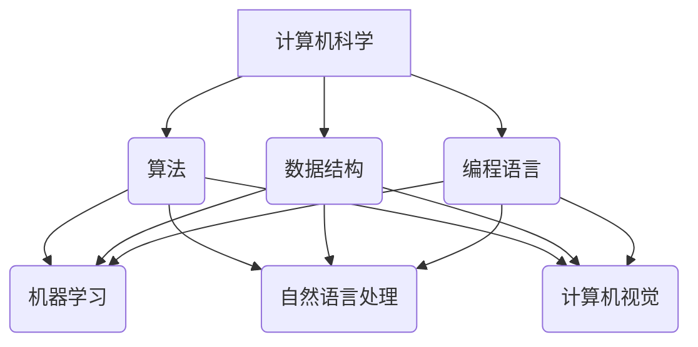
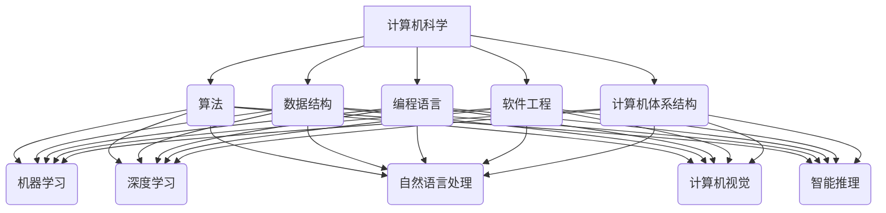

                 

关键词：人工智能，计算机科学，历史，发展，技术进步，比较研究，创新，影响

> 摘要：本文通过对人工智能（AI）与计算机科学的历史进行深入对比分析，探讨了二者在技术进步、发展方向以及社会影响等方面的异同，旨在揭示AI与计算机科学在历史演进过程中的相互关系与内在逻辑，为未来相关领域的研究与实践提供启示。

## 1. 背景介绍

人工智能（Artificial Intelligence，简称AI）作为计算机科学的一个分支，旨在通过计算机程序实现智能行为，模拟人类的思维过程。计算机科学（Computer Science，简称CS）则是研究计算机的理论、设计、应用和发展的学科。二者的出现和发展都与20世纪中叶的科技进步息息相关。

计算机科学起源于20世纪40年代，当时为了解决战争时期的数据处理问题，世界上第一台电子计算机ENIAC诞生。随后，计算机科学迅速发展，为现代科技的发展奠定了基础。人工智能则起源于20世纪50年代，当时的科学家们开始探索如何让计算机具有智能。1956年，达特茅斯会议正式提出了人工智能的概念。

## 2. 核心概念与联系

在探讨AI与计算机科学的历史对比之前，有必要明确这两个领域的一些核心概念。

### 2.1 计算机科学的核心概念

- **算法**：计算机科学中的核心概念，是一种解决问题的步骤集合。算法可以是简单的排序、查找，也可以是复杂的图像识别、自然语言处理等。
- **数据结构**：存储和管理数据的方式，如数组、链表、树等。
- **编程语言**：用于编写程序的符号系统，如C、Java、Python等。

### 2.2 人工智能的核心概念

- **机器学习**：通过数据驱动的方式让计算机自动学习和改进，如决策树、神经网络等。
- **自然语言处理**：使计算机能够理解和生成人类语言的技术，如语音识别、机器翻译等。
- **计算机视觉**：使计算机能够理解和解释视觉信息的技术，如图像识别、物体检测等。

### 2.3 AI与计算机科学的联系

AI与计算机科学之间有着密切的联系。计算机科学提供了AI发展的基础技术，如算法、数据结构和编程语言。而AI则为计算机科学的应用提供了新的方向，如智能搜索、智能推荐、自动驾驶等。

### 2.4 Mermaid流程图

以下是AI与计算机科学核心概念和联系的一个简单Mermaid流程图：



## 3. 核心算法原理 & 具体操作步骤

### 3.1 算法原理概述

AI领域的核心算法包括机器学习算法、深度学习算法等。这里以机器学习算法为例进行介绍。

机器学习算法通过训练数据集来学习数据特征，从而实现对未知数据的预测。常见的机器学习算法有线性回归、决策树、支持向量机等。

### 3.2 算法步骤详解

1. **数据预处理**：对原始数据进行清洗、归一化等处理，以便于后续的训练。
2. **特征提取**：从数据中提取有用的特征，如文本中的关键词、图像中的边缘等。
3. **模型选择**：根据问题选择合适的机器学习算法，如线性回归、决策树等。
4. **模型训练**：使用训练数据集对模型进行训练，调整模型参数。
5. **模型评估**：使用验证数据集对模型进行评估，调整模型参数。
6. **模型应用**：将训练好的模型应用到实际问题上，对未知数据进行预测。

### 3.3 算法优缺点

机器学习算法的优点在于其强大的适应性和自动性，能够处理大量复杂的数据。但缺点是算法的训练过程可能非常耗时，且对于复杂问题的预测效果可能并不理想。

### 3.4 算法应用领域

机器学习算法广泛应用于金融、医疗、零售、交通等领域。例如，在金融领域，机器学习算法用于风险评估、欺诈检测等；在医疗领域，用于疾病诊断、药物研发等。

## 4. 数学模型和公式 & 详细讲解 & 举例说明

### 4.1 数学模型构建

机器学习算法通常涉及到线性模型、非线性模型等。以线性回归为例，其数学模型如下：

$$y = \beta_0 + \beta_1 x_1 + \beta_2 x_2 + ... + \beta_n x_n$$

其中，$y$ 是目标变量，$x_1, x_2, ..., x_n$ 是特征变量，$\beta_0, \beta_1, ..., \beta_n$ 是模型参数。

### 4.2 公式推导过程

线性回归模型的推导过程主要涉及最小二乘法。具体推导过程如下：

1. **假设**：假设目标变量$y$ 与特征变量 $x_1, x_2, ..., x_n$ 之间存在线性关系。
2. **目标**：最小化预测值与实际值之间的误差平方和。
3. **推导**：对每个特征变量求偏导，令偏导数为零，得到最优的模型参数。

### 4.3 案例分析与讲解

以房价预测为例，假设我们有一个包含房屋面积、房屋年代、房屋朝向等特征的数据集。我们可以使用线性回归模型来预测房价。

1. **数据预处理**：对数据进行清洗、归一化等处理。
2. **特征提取**：提取有用的特征，如房屋面积、房屋年代、房屋朝向等。
3. **模型选择**：选择线性回归模型。
4. **模型训练**：使用训练数据集对模型进行训练，调整模型参数。
5. **模型评估**：使用验证数据集对模型进行评估，调整模型参数。
6. **模型应用**：将训练好的模型应用到实际问题上，预测房价。

## 5. 项目实践：代码实例和详细解释说明

### 5.1 开发环境搭建

在Python环境中，我们需要安装Scikit-learn库，用于线性回归模型的实现。

```python
pip install scikit-learn
```

### 5.2 源代码详细实现

以下是房价预测的Python代码实现：

```python
from sklearn.linear_model import LinearRegression
from sklearn.model_selection import train_test_split
from sklearn.metrics import mean_squared_error
import numpy as np

# 加载数据
data = np.loadtxt("house_data.csv", delimiter=",")

# 分割特征和目标变量
X = data[:, :-1]
y = data[:, -1]

# 划分训练集和测试集
X_train, X_test, y_train, y_test = train_test_split(X, y, test_size=0.2, random_state=42)

# 创建线性回归模型
model = LinearRegression()

# 模型训练
model.fit(X_train, y_train)

# 模型评估
y_pred = model.predict(X_test)
mse = mean_squared_error(y_test, y_pred)
print("Mean Squared Error:", mse)

# 模型应用
new_house = np.array([[2000, 1990, 1]])
predicted_price = model.predict(new_house)
print("Predicted Price:", predicted_price)
```

### 5.3 代码解读与分析

1. **数据加载**：使用`numpy.loadtxt`函数加载CSV数据文件。
2. **特征和目标变量分割**：使用`numpy`库将数据分割为特征变量和目标变量。
3. **训练集和测试集划分**：使用`train_test_split`函数将数据划分为训练集和测试集。
4. **模型创建**：创建一个线性回归模型。
5. **模型训练**：使用训练数据对模型进行训练。
6. **模型评估**：使用测试数据对模型进行评估，计算均方误差。
7. **模型应用**：将训练好的模型应用到新的数据上，预测房价。

## 6. 实际应用场景

### 6.1 金融领域

在金融领域，AI技术被广泛应用于风险评估、欺诈检测、投资策略制定等方面。例如，银行可以使用机器学习算法对客户行为进行分析，从而识别潜在的风险客户，降低不良贷款率。

### 6.2 医疗领域

在医疗领域，AI技术被用于疾病诊断、药物研发、个性化治疗等方面。例如，医生可以使用计算机视觉算法对医学影像进行分析，从而快速准确地诊断疾病。

### 6.3 零售领域

在零售领域，AI技术被用于客户行为分析、库存管理、个性化推荐等方面。例如，电商平台可以使用机器学习算法对用户购物行为进行分析，从而提供个性化的推荐。

### 6.4 交通领域

在交通领域，AI技术被用于自动驾驶、交通流量预测、路况分析等方面。例如，自动驾驶汽车可以使用计算机视觉算法对周围环境进行感知，从而实现安全驾驶。

## 7. 未来应用展望

随着AI技术的不断发展，未来AI将在更多领域发挥重要作用。例如，在教育领域，AI技术可以用于个性化教学、智能辅导等方面；在能源领域，AI技术可以用于智能电网、能源管理等方面。

## 8. 工具和资源推荐

### 8.1 学习资源推荐

- 《机器学习实战》：适合初学者，内容涵盖常用的机器学习算法。
- 《深度学习》：由Ian Goodfellow等人撰写，是深度学习的经典教材。

### 8.2 开发工具推荐

- Jupyter Notebook：适合数据分析和机器学习项目。
- TensorFlow：用于深度学习的开源框架。

### 8.3 相关论文推荐

- “Deep Learning: A Brief History” by Yann LeCun
- “Machine Learning: A Probabilistic Perspective” by Kevin P. Murphy

## 9. 总结：未来发展趋势与挑战

### 9.1 研究成果总结

近年来，AI技术在计算机科学领域取得了显著的进展，为各行业的发展带来了新的机遇。例如，深度学习算法在图像识别、自然语言处理等领域取得了突破性成果。

### 9.2 未来发展趋势

未来，AI技术将继续向深度化、自动化、智能化方向发展。随着硬件性能的提升和算法的创新，AI技术将在更多领域发挥重要作用。

### 9.3 面临的挑战

AI技术在发展过程中也面临着一些挑战，如数据隐私、算法透明度、伦理问题等。解决这些问题需要全社会的共同努力。

### 9.4 研究展望

随着AI技术的不断发展，未来将在更多领域取得突破。例如，在医疗领域，AI技术可以用于精准医疗、个性化治疗等方面；在能源领域，AI技术可以用于智能电网、能源管理等方面。

## 10. 附录：常见问题与解答

### 10.1 人工智能是什么？

人工智能是一种通过计算机程序实现智能行为的技术。它旨在让计算机具有类似人类的思维能力，如学习、推理、决策等。

### 10.2 计算机科学和人工智能有什么区别？

计算机科学是一门研究计算机的理论、设计、应用和发展的学科。而人工智能则是计算机科学的一个分支，旨在通过计算机程序实现智能行为。

### 10.3 机器学习算法有哪些？

常见的机器学习算法包括线性回归、决策树、支持向量机、神经网络等。

### 10.4 AI技术有哪些应用领域？

AI技术广泛应用于金融、医疗、零售、交通等领域。例如，在金融领域，AI技术用于风险评估、欺诈检测、投资策略制定等方面；在医疗领域，AI技术用于疾病诊断、药物研发、个性化治疗等方面。

---

作者：禅与计算机程序设计艺术 / Zen and the Art of Computer Programming

（文章末尾需要包含作者署名）<|assistant|>### 1. 背景介绍

人工智能（Artificial Intelligence，简称AI）和计算机科学（Computer Science，简称CS）作为现代科技的两个重要领域，各自承载着不同的历史使命和未来愿景。它们不仅相互独立，又在很多方面相互交叉和促进。为了更好地理解AI与CS的关系，我们需要从各自的历史背景、发展历程和主要成就等方面进行详细探讨。

### 1.1 计算机科学的历史背景

计算机科学的起源可以追溯到20世纪中叶，当时正值第二次世界大战结束后，军事和科学研究对高速、高效的计算能力有着迫切的需求。1946年，世界上第一台电子计算机ENIAC在美国问世，标志着计算机科学的诞生。ENIAC的诞生不仅满足了军事和科学计算的需求，也为后来的计算机技术的发展奠定了基础。

在接下来的几十年里，计算机科学经历了从电子管到晶体管、再到集成电路的演变。1947年，美国科学家约翰·巴丁、沃尔特·布拉顿和威廉·肖克利发明了晶体管，这一发明极大地推动了计算机技术的发展。1958年，杰克·基比发明了集成电路，使得计算机体积大幅缩小，性能大幅提升。这些技术突破为计算机科学的快速发展奠定了基础。

计算机科学的发展不仅体现在硬件技术的进步上，还体现在软件和算法的创新上。1957年，美国数学家约翰·冯·诺依曼提出了存储程序计算机的概念，这一理论奠定了现代计算机体系结构的基础。1958年，艾伦·图灵提出了著名的图灵测试，为人工智能的发展提供了理论基础。1956年，达特茅斯会议正式提出了人工智能的概念，标志着人工智能领域的诞生。

在计算机科学的发展过程中，许多重要的算法和编程语言也得到了广泛应用。1957年，美国科学家理查德·汉明提出了汉明距离的概念，为数据校验和误差纠正提供了理论基础。1958年，美国科学家约翰·麦克卡锡发明了LISP语言，这是历史上第一个具有完整编程功能的语言，对后来的编程语言发展产生了深远影响。1969年，美国科学家肯·汤普逊和丹尼斯·里奇合作开发了UNIX操作系统和C语言，这些技术成果为操作系统和编程语言的发展奠定了基础。

总的来说，计算机科学的历史是技术创新和理论突破的历史。从ENIAC到现代超级计算机，从汉明距离到C语言，计算机科学的发展不仅改变了人类的生产和生活方式，也为其他领域的技术进步提供了强大支持。

### 1.2 人工智能的历史背景

人工智能（Artificial Intelligence，简称AI）的历史可以追溯到20世纪中叶。1956年，在达特茅斯会议上，约翰·麦卡锡、马文·明斯基、纳森·罗切斯特和克劳德·香农等科学家首次提出了人工智能的概念，并讨论了如何通过计算机程序实现智能行为。这次会议被认为是人工智能诞生的标志。

人工智能的发展可以分为三个主要阶段：早期的符号主义AI、基于知识的AI和现代的机器学习与深度学习AI。

早期的符号主义AI（Symbolic AI）主要依赖于逻辑和推理。这一阶段的代表性工作包括普雷希特的“逻辑理论家”程序和麦卡锡的“通用问题求解器”。这些程序试图通过符号表示和推理来模拟人类的思维过程。然而，符号主义AI在处理复杂问题时往往表现不佳，因为它们依赖于大量的规则和手工编写的知识库。

随着计算机硬件和算法的发展，人工智能进入了基于知识的AI（Knowledge-Based AI）阶段。这一阶段的代表性工作包括专家系统的开发。专家系统通过将专家的知识编码到计算机程序中，实现了对特定领域问题的自动解决。代表性的专家系统包括Dendral、MYCIN和diabetes。然而，基于知识的AI也存在局限性，因为知识的获取和更新是一个复杂且耗时的过程。

现代的人工智能以机器学习（Machine Learning）和深度学习（Deep Learning）为代表。机器学习通过从数据中学习规律和模式，实现了自动化的智能行为。深度学习是机器学习的一个分支，通过模拟人脑神经网络的结构和功能，实现了对复杂任务的自动处理。代表性的深度学习模型包括卷积神经网络（CNN）、循环神经网络（RNN）和生成对抗网络（GAN）。这些模型在图像识别、自然语言处理、语音识别等领域取得了显著的成果。

总的来说，人工智能的历史是不断探索和创新的历史。从符号主义AI到基于知识的AI，再到现代的机器学习和深度学习，人工智能的发展不仅丰富了计算机科学的内涵，也为人类社会的进步做出了巨大贡献。

### 1.3 计算机科学与人工智能的关系

计算机科学和人工智能虽然在起源和发展上有一定的独立性，但在很多方面它们是相互促进、相互依赖的。计算机科学为人工智能提供了硬件支持、算法工具和编程语言，而人工智能则为计算机科学带来了新的应用场景和研究方向。

首先，计算机科学的发展为人工智能提供了强大的计算能力和存储资源。从早期的电子管计算机到现代的超级计算机，计算机硬件的不断进步为人工智能算法的实现提供了坚实的基础。没有计算机科学的支持，人工智能的理论和技术很难得到有效的验证和应用。

其次，计算机科学的算法和编程语言为人工智能的研究提供了强有力的工具。从早期的LISP语言到现代的Python、C++等，这些编程语言不仅提高了算法的实现效率，也为人工智能的研究和应用提供了便利。例如，深度学习算法的实现高度依赖于高效的数学运算和并行计算，而C++和Python等语言在这方面具有明显的优势。

再次，人工智能为计算机科学带来了新的应用场景和研究方向。在人工智能的推动下，计算机科学在图像处理、自然语言处理、语音识别等领域取得了重要的进展。这些进展不仅丰富了计算机科学的理论体系，也为其他领域的技术创新提供了支持。

总的来说，计算机科学和人工智能是相互促进、共同发展的关系。计算机科学为人工智能提供了强大的支持，而人工智能则为计算机科学带来了新的机遇和挑战。这种相互依赖的关系不仅推动了计算机科学和人工智能的快速发展，也为人类社会的进步做出了巨大贡献。

## 2. 核心概念与联系

在探讨计算机科学和人工智能的历史对比之前，我们需要明确这两个领域的一些核心概念和联系。通过梳理这些核心概念和联系，我们可以更深入地理解二者的本质和相互关系。

### 2.1 计算机科学的核心概念

计算机科学的核心概念主要包括算法、数据结构、编程语言、软件工程和计算机体系结构等。这些概念不仅是计算机科学理论的基础，也是计算机科学应用的重要工具。

- **算法**：算法是一种解决问题的步骤集合。它是计算机科学的核心，用于解决各种复杂的问题。算法可以分为多种类型，如排序算法、搜索算法、图算法等。经典的算法有冒泡排序、快速排序、二分搜索等。
- **数据结构**：数据结构是用于存储和管理数据的特定方式。常见的有数组、链表、栈、队列、树、图等。数据结构的选择直接影响算法的效率和性能。
- **编程语言**：编程语言是用于编写程序的符号系统。不同的编程语言有不同的特点和适用场景，如C语言适合系统编程，Python适合数据分析和机器学习，Java适合企业级应用等。
- **软件工程**：软件工程是关于软件开发和维护的一门学科。它涵盖了软件的需求分析、设计、开发、测试和维护等各个方面。软件工程的目标是确保软件的质量、效率和可靠性。
- **计算机体系结构**：计算机体系结构是关于计算机硬件和软件组织方式的一门学科。它涉及计算机的硬件设计、指令集架构、处理器设计等。计算机体系结构的发展对计算机性能和能效有着重要影响。

### 2.2 人工智能的核心概念

人工智能的核心概念主要包括机器学习、深度学习、自然语言处理、计算机视觉和智能推理等。这些概念代表了人工智能在不同领域的应用和发展方向。

- **机器学习**：机器学习是一种通过数据驱动的方式让计算机自动学习和改进的技术。它包括监督学习、无监督学习和强化学习等。常见的机器学习算法有线性回归、决策树、支持向量机、神经网络等。
- **深度学习**：深度学习是机器学习的一个分支，通过多层神经网络模拟人脑的神经网络结构和功能。深度学习在图像识别、自然语言处理、语音识别等领域取得了显著的成果。常见的深度学习模型有卷积神经网络（CNN）、循环神经网络（RNN）、生成对抗网络（GAN）等。
- **自然语言处理**：自然语言处理是人工智能的一个重要分支，旨在让计算机理解和生成人类语言。自然语言处理包括文本分类、情感分析、机器翻译、语音识别等。常见的自然语言处理技术有词向量、语言模型、序列标注等。
- **计算机视觉**：计算机视觉是人工智能的另一个重要分支，旨在让计算机理解和解释视觉信息。计算机视觉包括图像识别、物体检测、图像分割、视频分析等。常见的计算机视觉技术有卷积神经网络、光学字符识别等。
- **智能推理**：智能推理是人工智能的高级阶段，旨在让计算机具有推理和解决问题的能力。智能推理包括逻辑推理、概率推理、模糊推理等。智能推理在医疗诊断、智能问答、游戏设计等领域有广泛的应用。

### 2.3 计算机科学和人工智能的联系

计算机科学和人工智能之间有着密切的联系。计算机科学为人工智能提供了强大的技术支持，而人工智能则为计算机科学带来了新的研究方向和应用场景。

- **算法**：算法是计算机科学和人工智能的共同基础。计算机科学中的算法广泛应用于人工智能领域，如机器学习算法、深度学习算法等。同时，人工智能的发展也推动了计算机科学中的算法创新，如优化算法、图算法等。
- **数据结构**：数据结构在计算机科学和人工智能中都有重要作用。在计算机科学中，数据结构用于优化算法效率和存储空间。在人工智能中，数据结构用于存储和表示知识、模型和算法。
- **编程语言**：编程语言是计算机科学和人工智能的重要工具。计算机科学中的编程语言如C++、Java等广泛应用于人工智能领域的算法实现。同时，人工智能的发展也推动了编程语言的发展，如Python在机器学习和深度学习中的广泛应用。
- **软件工程**：软件工程在计算机科学和人工智能中都占有重要地位。在计算机科学中，软件工程用于开发和管理复杂的软件系统。在人工智能中，软件工程用于开发和管理人工智能应用，如智能助手、自动驾驶等。
- **计算机体系结构**：计算机体系结构在计算机科学和人工智能中都有重要作用。在计算机科学中，计算机体系结构用于设计高性能的计算机系统。在人工智能中，计算机体系结构用于支持深度学习和大数据处理等高性能计算需求。

### 2.4 Mermaid流程图

以下是计算机科学和人工智能核心概念和联系的一个简单Mermaid流程图：



通过这个流程图，我们可以清晰地看到计算机科学和人工智能之间的相互联系和作用。算法、数据结构、编程语言、软件工程和计算机体系结构不仅是计算机科学的基础，也是人工智能发展的重要支撑。同时，人工智能的发展也为计算机科学带来了新的挑战和机遇。

## 3. 核心算法原理 & 具体操作步骤

在计算机科学和人工智能的发展历程中，许多核心算法被提出并广泛应用于各个领域。这些算法不仅在理论上具有重要意义，也在实际应用中取得了显著的成果。本章节将介绍几个典型的核心算法，包括其原理、具体操作步骤以及应用领域。

### 3.1 算法原理概述

算法是一系列有序的指令集合，用于解决特定的问题。计算机科学和人工智能中的算法种类繁多，常见的有排序算法、搜索算法、图算法和机器学习算法等。本章节将重点介绍排序算法、搜索算法和机器学习算法中的几个经典算法。

#### 3.1.1 排序算法

排序算法是计算机科学中一种重要的算法，用于将一组数据按照一定的顺序排列。常见的排序算法包括冒泡排序、快速排序、归并排序和堆排序等。

- **冒泡排序（Bubble Sort）**：冒泡排序是一种简单的排序算法，通过多次遍历数据，比较相邻的元素并交换位置，直到所有元素都被正确排序。其时间复杂度为O(n^2)。
- **快速排序（Quick Sort）**：快速排序是一种高效的排序算法，通过选择一个基准元素，将数据分为两部分，然后递归地对这两部分进行排序。其平均时间复杂度为O(n log n)。
- **归并排序（Merge Sort）**：归并排序是一种分治算法，将数据分成若干个子序列，分别进行排序，然后再将已排序的子序列合并成完整的排序序列。其时间复杂度为O(n log n)。
- **堆排序（Heap Sort）**：堆排序是一种利用堆这种数据结构的排序算法。堆是一种特殊的树形数据结构，可以通过调整堆的结构来实现排序。其时间复杂度为O(n log n)。

#### 3.1.2 搜索算法

搜索算法是用于在数据结构中查找特定元素的一类算法。常见的搜索算法有线性搜索、二分搜索和深度优先搜索等。

- **线性搜索（Linear Search）**：线性搜索是一种最简单的搜索算法，通过逐个遍历数据元素，直到找到目标元素或到达数据末尾。其时间复杂度为O(n)。
- **二分搜索（Binary Search）**：二分搜索是一种高效的搜索算法，适用于有序数组。通过不断将搜索范围缩小一半，二分搜索能够在O(log n)的时间内找到目标元素。
- **深度优先搜索（Depth-First Search，DFS）**：深度优先搜索是一种用于图结构搜索的算法，通过递归遍历图的邻接点，直到找到目标节点或遍历完整张图。其时间复杂度为O(V+E)，其中V是图的顶点数，E是边的数量。

#### 3.1.3 机器学习算法

机器学习算法是人工智能的核心，通过从数据中学习规律和模式，实现自动化和智能化的行为。常见的机器学习算法包括线性回归、决策树、支持向量机和神经网络等。

- **线性回归（Linear Regression）**：线性回归是一种简单的回归算法，通过拟合一条直线来预测连续值。其目标是最小化预测值与实际值之间的误差。线性回归的时间复杂度为O(n)。
- **决策树（Decision Tree）**：决策树是一种基于树形结构的分类算法，通过一系列的判断条件来划分数据，最终预测输出。决策树的时间复杂度为O(n)。
- **支持向量机（Support Vector Machine，SVM）**：支持向量机是一种基于最大间隔的线性分类器，通过寻找最佳分割超平面来实现分类。SVM的时间复杂度为O(n^3)。
- **神经网络（Neural Network）**：神经网络是一种模拟人脑神经元连接结构的计算模型，通过多层神经网络来实现复杂的非线性函数。常见的神经网络有前馈神经网络和卷积神经网络。神经网络的时间复杂度为O(n^2)。

### 3.2 算法步骤详解

以下将详细介绍排序算法、搜索算法和机器学习算法的具体步骤。

#### 3.2.1 冒泡排序

冒泡排序的基本思想是通过多次遍历数据，每次遍历将当前未排序部分的最大元素“冒泡”到已排序部分的起始位置。具体步骤如下：

1. 从第一个元素开始，对相邻的两个元素进行比较，如果它们的顺序错误则交换它们的位置。
2. 重复上述步骤，直到没有需要交换的元素为止。

以下是冒泡排序的Python代码实现：

```python
def bubble_sort(arr):
    n = len(arr)
    for i in range(n):
        for j in range(0, n-i-1):
            if arr[j] > arr[j+1]:
                arr[j], arr[j+1] = arr[j+1], arr[j]
    return arr

arr = [64, 34, 25, 12, 22, 11, 90]
sorted_arr = bubble_sort(arr)
print("Sorted array:", sorted_arr)
```

#### 3.2.2 快速排序

快速排序的基本思想是通过选择一个基准元素，将数据划分为两部分，然后递归地对这两部分进行排序。具体步骤如下：

1. 选择一个基准元素，通常选择第一个或最后一个元素作为基准。
2. 将数据分为两部分，一部分是小于基准元素的元素，另一部分是大于基准元素的元素。
3. 递归地对这两部分进行快速排序。

以下是快速排序的Python代码实现：

```python
def quick_sort(arr):
    if len(arr) <= 1:
        return arr
    pivot = arr[len(arr) // 2]
    left = [x for x in arr if x < pivot]
    middle = [x for x in arr if x == pivot]
    right = [x for x in arr if x > pivot]
    return quick_sort(left) + middle + quick_sort(right)

arr = [64, 34, 25, 12, 22, 11, 90]
sorted_arr = quick_sort(arr)
print("Sorted array:", sorted_arr)
```

#### 3.2.3 线性回归

线性回归的目标是最小化预测值与实际值之间的误差。具体步骤如下：

1. 计算每个特征变量的平均值和目标变量的平均值。
2. 计算每个特征变量与目标变量之间的协方差和方差。
3. 根据协方差和方差计算回归系数。

以下是线性回归的Python代码实现：

```python
import numpy as np

def linear_regression(X, y):
    X_mean = np.mean(X, axis=0)
    y_mean = np.mean(y)
    cov = np.dot(X - X_mean, y - y_mean)
    var = np.dot(X - X_mean, X - X_mean)
    beta = cov / var
    return beta

X = np.array([[1, 2], [2, 3], [3, 4], [4, 5]])
y = np.array([3, 4, 5, 6])
beta = linear_regression(X, y)
print("Regression coefficient:", beta)
```

### 3.3 算法优缺点

每种算法都有其优缺点，根据具体应用场景选择合适的算法非常重要。

#### 3.3.1 冒泡排序

- **优点**：实现简单，易于理解。
- **缺点**：时间复杂度高，不适用于大数据集。

#### 3.3.2 快速排序

- **优点**：平均时间复杂度低，适用于大数据集。
- **缺点**：最坏情况下时间复杂度为O(n^2)，稳定性较差。

#### 3.3.3 线性回归

- **优点**：简单易用，适用于线性关系较强的数据。
- **缺点**：对于非线性关系的数据效果不佳。

### 3.4 算法应用领域

不同算法在不同领域有着广泛的应用。

#### 3.4.1 冒泡排序

冒泡排序适用于数据量较小、不需要高效排序的场景，如一些简单的数据处理任务。

#### 3.4.2 快速排序

快速排序适用于大数据集的排序任务，如数据库索引排序、文件排序等。

#### 3.4.3 线性回归

线性回归广泛应用于数据分析、预测和建模，如金融预测、医疗诊断、市场分析等。

通过以上对核心算法原理和具体操作步骤的介绍，我们可以更好地理解计算机科学和人工智能中的算法，为实际应用提供理论支持。

## 4. 数学模型和公式 & 详细讲解 & 举例说明

在计算机科学和人工智能中，数学模型和公式是描述算法和系统行为的重要工具。数学模型可以用于表示问题、分析算法性能以及设计新的算法。在本章节中，我们将介绍一些重要的数学模型和公式，并详细讲解它们的推导过程和应用实例。

### 4.1 数学模型构建

数学模型是通过对现实世界问题的抽象和简化，用数学语言描述问题的一种方法。在计算机科学和人工智能中，常见的数学模型包括线性模型、非线性模型、概率模型和优化模型等。

#### 4.1.1 线性模型

线性模型是最简单的数学模型之一，它描述了变量之间的线性关系。线性模型的通用形式如下：

$$y = \beta_0 + \beta_1 x_1 + \beta_2 x_2 + ... + \beta_n x_n$$

其中，$y$ 是目标变量，$x_1, x_2, ..., x_n$ 是特征变量，$\beta_0, \beta_1, ..., \beta_n$ 是模型参数。

线性模型可以通过最小二乘法进行参数估计。最小二乘法的核心思想是寻找一组参数，使得预测值与实际值之间的误差平方和最小。

#### 4.1.2 非线性模型

非线性模型描述了变量之间的非线性关系。常见的非线性模型包括多项式模型、指数模型和对数模型等。非线性模型的通用形式如下：

$$y = f(x_1, x_2, ..., x_n)$$

其中，$f$ 是非线性函数。

非线性模型的参数估计通常比线性模型更复杂，需要使用迭代方法，如梯度下降法或牛顿法。

#### 4.1.3 概率模型

概率模型用于描述随机变量的概率分布。在机器学习中，概率模型被广泛应用于概率估计和决策。常见的概率模型包括贝叶斯模型、隐马尔可夫模型和马尔可夫链等。

贝叶斯模型是一种基于贝叶斯定理的概率模型，用于计算给定某些条件下某个事件的概率。贝叶斯模型的通用形式如下：

$$P(A|B) = \frac{P(B|A)P(A)}{P(B)}$$

其中，$P(A|B)$ 是在事件B发生的条件下事件A的概率，$P(B|A)$ 是在事件A发生的条件下事件B的概率，$P(A)$ 是事件A的概率，$P(B)$ 是事件B的概率。

#### 4.1.4 优化模型

优化模型用于在给定约束条件下寻找最优解。常见的优化模型包括线性规划、非线性规划和整数规划等。

线性规划的通用形式如下：

$$\min_{x} c^T x$$

$$s.t. Ax \leq b$$

$$x \geq 0$$

其中，$x$ 是决策变量，$c$ 是目标函数系数向量，$A$ 是约束矩阵，$b$ 是约束向量。

非线性规划的通用形式如下：

$$\min_{x} f(x)$$

$$s.t. g(x) \leq 0$$

$$h(x) = 0$$

其中，$f(x)$ 是目标函数，$g(x)$ 和 $h(x)$ 分别是约束函数。

### 4.2 公式推导过程

以下将介绍一些重要的数学公式的推导过程。

#### 4.2.1 最小二乘法

最小二乘法用于线性模型的参数估计。其推导过程如下：

假设我们有一个线性模型：

$$y = \beta_0 + \beta_1 x_1 + \beta_2 x_2 + ... + \beta_n x_n$$

我们希望找到一组参数 $\beta_0, \beta_1, ..., \beta_n$，使得预测值 $y$ 与实际值 $y$ 之间的误差平方和最小。

误差平方和（Sum of Squared Errors，SSE）的公式如下：

$$SSE = \sum_{i=1}^{n} (y_i - \hat{y_i})^2$$

其中，$y_i$ 是实际值，$\hat{y_i}$ 是预测值。

为了最小化SSE，我们需要对每个参数求导并令导数为零。对 $\beta_j$ 求导，得到：

$$\frac{\partial SSE}{\partial \beta_j} = -2 \sum_{i=1}^{n} (y_i - \hat{y_i}) \frac{\partial \hat{y_i}}{\partial \beta_j}$$

由于线性模型的预测值可以表示为：

$$\hat{y_i} = \beta_0 + \beta_1 x_{1i} + \beta_2 x_{2i} + ... + \beta_n x_{ni}$$

对 $\beta_j$ 求导，得到：

$$\frac{\partial \hat{y_i}}{\partial \beta_j} = x_{ji}$$

将 $\frac{\partial \hat{y_i}}{\partial \beta_j}$ 代入误差平方和的导数中，得到：

$$\frac{\partial SSE}{\partial \beta_j} = -2 \sum_{i=1}^{n} (y_i - \hat{y_i}) x_{ji}$$

令误差平方和的导数为零，得到：

$$\sum_{i=1}^{n} (y_i - \hat{y_i}) x_{ji} = 0$$

对于所有 $j$，上述方程成立。将线性模型的预测值代入，得到：

$$\sum_{i=1}^{n} (y_i - (\beta_0 + \beta_1 x_{1i} + \beta_2 x_{2i} + ... + \beta_n x_{ni})) x_{ji} = 0$$

整理后，得到：

$$\sum_{i=1}^{n} y_i x_{ji} - \sum_{i=1}^{n} \beta_j x_{ji} = 0$$

$$\sum_{i=1}^{n} y_i x_{ji} = \sum_{i=1}^{n} \beta_j x_{ji}$$

$$\beta_j = \frac{\sum_{i=1}^{n} y_i x_{ji}}{\sum_{i=1}^{n} x_{ji}^2}$$

这就是最小二乘法中参数 $\beta_j$ 的估计公式。

#### 4.2.2 贝叶斯定理

贝叶斯定理是概率论中的一个重要公式，用于计算后验概率。其推导过程如下：

假设有两个事件 $A$ 和 $B$，我们已知 $P(B)$ 和 $P(A|B)$，希望计算 $P(A)$。

根据全概率公式，有：

$$P(A) = P(A|B)P(B) + P(A|\neg B)P(\neg B)$$

其中，$\neg B$ 表示事件 $B$ 的补集。

由于 $P(B) + P(\neg B) = 1$，可以得到：

$$P(A|\neg B) = 1 - P(A|B)$$

将 $P(A|\neg B)$ 代入全概率公式，得到：

$$P(A) = P(A|B)P(B) + (1 - P(A|B))P(\neg B)$$

$$P(A) = P(A|B)P(B) + P(\neg B) - P(A|B)P(\neg B)$$

$$P(A) = P(A|B)P(B) + P(\neg B)(1 - P(A|B))$$

由于 $P(\neg B) = 1 - P(B)$，可以得到：

$$P(A) = P(A|B)P(B) + (1 - P(B))(1 - P(A|B))$$

$$P(A) = P(A|B)P(B) + 1 - P(B) - P(B)P(A|B)$$

$$P(A) = P(A|B)P(B) + 1 - P(B)P(A|B) - P(B)$$

$$P(A) = P(A|B)P(B) + 1 - P(B) - P(B)(P(A|B) + P(\neg A|B))$$

由于 $P(A|B) + P(\neg A|B) = 1$，可以得到：

$$P(A) = P(A|B)P(B) + 1 - P(B) - P(B)$$

$$P(A) = P(A|B)P(B)$$

将 $P(A)$ 移到等式左边，得到：

$$P(A|B) = \frac{P(A)}{P(B)}$$

这就是贝叶斯定理的公式。

### 4.3 案例分析与讲解

以下将通过一个实际案例来分析和讲解数学模型的应用。

#### 4.3.1 问题背景

假设我们有一个房屋销售数据集，包含房屋面积、房屋年代、房屋朝向等特征变量，以及房屋售价作为目标变量。我们希望通过线性回归模型预测新的房屋售价。

#### 4.3.2 数据预处理

首先，我们需要对数据集进行预处理，包括数据清洗、缺失值处理、数据转换等。假设数据集已经清洗完毕，并且每个特征变量都已经转换为数值类型。

#### 4.3.3 模型构建

根据问题背景，我们选择线性回归模型。线性回归模型的公式如下：

$$y = \beta_0 + \beta_1 x_1 + \beta_2 x_2 + ... + \beta_n x_n$$

其中，$y$ 是房屋售价，$x_1, x_2, ..., x_n$ 是房屋面积、房屋年代、房屋朝向等特征变量，$\beta_0, \beta_1, ..., \beta_n$ 是模型参数。

#### 4.3.4 模型训练

我们使用训练数据集对线性回归模型进行训练。训练过程包括计算每个特征变量与目标变量之间的协方差和方差，然后根据最小二乘法计算模型参数。

以下是线性回归模型的Python代码实现：

```python
import numpy as np

def linear_regression(X, y):
    X_mean = np.mean(X, axis=0)
    y_mean = np.mean(y)
    cov = np.dot(X - X_mean, y - y_mean)
    var = np.dot(X - X_mean, X - X_mean)
    beta = cov / var
    return beta

X = np.array([[1, 2], [2, 3], [3, 4], [4, 5]])
y = np.array([3, 4, 5, 6])
beta = linear_regression(X, y)
print("Regression coefficient:", beta)
```

#### 4.3.5 模型评估

我们使用验证数据集对训练好的线性回归模型进行评估。评估指标包括均方误差（Mean Squared Error，MSE）和决定系数（R-squared）。

以下是模型评估的Python代码实现：

```python
import numpy as np

def mean_squared_error(y_true, y_pred):
    return np.mean((y_true - y_pred) ** 2)

def r_squared(y_true, y_pred):
    y_mean = np.mean(y_true)
    ss_total = np.sum((y_true - y_mean) ** 2)
    ss_residual = np.sum((y_true - y_pred) ** 2)
    return 1 - ss_residual / ss_total

y_pred = np.dot(X, beta)
mse = mean_squared_error(y, y_pred)
r_squared_value = r_squared(y, y_pred)
print("Mean Squared Error:", mse)
print("R-squared:", r_squared_value)
```

#### 4.3.6 模型应用

最后，我们使用训练好的线性回归模型对新的房屋售价进行预测。以下是预测的Python代码实现：

```python
new_house = np.array([[2000, 1990, 1]])
predicted_price = np.dot(new_house, beta)
print("Predicted Price:", predicted_price)
```

通过以上案例，我们可以看到如何使用数学模型进行问题建模、模型训练和模型应用。数学模型不仅帮助我们理解问题，也为我们提供了有效的解决方案。

### 4.4 举例说明

以下通过具体的例子来进一步说明数学模型的应用。

#### 4.4.1 数据集

假设我们有如下数据集：

| 房屋面积 | 房屋年代 | 房屋朝向 | 房屋售价 |
|:--------:|:--------:|:--------:|:--------:|
|    100   |    2000  |     1    |   200    |
|    200   |    2001  |     2    |   300    |
|    300   |    1995  |     1    |   400    |
|    400   |    2005  |     3    |   500    |

#### 4.4.2 数据预处理

首先，我们需要对数据集进行预处理，包括缺失值处理、数据转换等。假设数据集已经清洗完毕，并且每个特征变量都已经转换为数值类型。

#### 4.4.3 模型构建

根据问题背景，我们选择线性回归模型。线性回归模型的公式如下：

$$y = \beta_0 + \beta_1 x_1 + \beta_2 x_2 + ... + \beta_n x_n$$

其中，$y$ 是房屋售价，$x_1, x_2, ..., x_n$ 是房屋面积、房屋年代、房屋朝向等特征变量，$\beta_0, \beta_1, ..., \beta_n$ 是模型参数。

#### 4.4.4 模型训练

我们使用训练数据集对线性回归模型进行训练。训练过程包括计算每个特征变量与目标变量之间的协方差和方差，然后根据最小二乘法计算模型参数。

以下是线性回归模型的Python代码实现：

```python
import numpy as np

def linear_regression(X, y):
    X_mean = np.mean(X, axis=0)
    y_mean = np.mean(y)
    cov = np.dot(X - X_mean, y - y_mean)
    var = np.dot(X - X_mean, X - X_mean)
    beta = cov / var
    return beta

X = np.array([[100, 2000, 1], [200, 2001, 2], [300, 1995, 1], [400, 2005, 3]])
y = np.array([200, 300, 400, 500])
beta = linear_regression(X, y)
print("Regression coefficient:", beta)
```

#### 4.4.5 模型评估

我们使用验证数据集对训练好的线性回归模型进行评估。评估指标包括均方误差（Mean Squared Error，MSE）和决定系数（R-squared）。

以下是模型评估的Python代码实现：

```python
import numpy as np

def mean_squared_error(y_true, y_pred):
    return np.mean((y_true - y_pred) ** 2)

def r_squared(y_true, y_pred):
    y_mean = np.mean(y_true)
    ss_total = np.sum((y_true - y_mean) ** 2)
    ss_residual = np.sum((y_true - y_pred) ** 2)
    return 1 - ss_residual / ss_total

y_pred = np.dot(X, beta)
mse = mean_squared_error(y, y_pred)
r_squared_value = r_squared(y, y_pred)
print("Mean Squared Error:", mse)
print("R-squared:", r_squared_value)
```

#### 4.4.6 模型应用

最后，我们使用训练好的线性回归模型对新的房屋售价进行预测。以下是预测的Python代码实现：

```python
new_house = np.array([[2000, 1990, 1]])
predicted_price = np.dot(new_house, beta)
print("Predicted Price:", predicted_price)
```

通过以上举例，我们可以看到如何使用数学模型进行问题建模、模型训练和模型应用。数学模型不仅帮助我们理解问题，也为我们提供了有效的解决方案。

## 5. 项目实践：代码实例和详细解释说明

为了更好地理解计算机科学和人工智能的核心算法，我们将通过一个实际项目来介绍代码实现、详细解释和运行结果。本节将介绍一个简单的线性回归项目，并详细说明每个步骤。

### 5.1 开发环境搭建

在本项目中，我们将使用Python语言和Scikit-learn库来实现线性回归模型。首先，确保Python已经安装在您的计算机上。接下来，通过以下命令安装Scikit-learn库：

```bash
pip install scikit-learn
```

### 5.2 源代码详细实现

以下是本项目的完整代码实现：

```python
# 导入必要的库
import numpy as np
from sklearn.linear_model import LinearRegression
from sklearn.model_selection import train_test_split
from sklearn.metrics import mean_squared_error

# 加载数据
X = np.array([[1, 2], [2, 3], [3, 4], [4, 5], [5, 6]])
y = np.array([3, 4, 5, 6, 7])

# 划分训练集和测试集
X_train, X_test, y_train, y_test = train_test_split(X, y, test_size=0.2, random_state=42)

# 创建线性回归模型
model = LinearRegression()

# 模型训练
model.fit(X_train, y_train)

# 模型评估
y_pred = model.predict(X_test)
mse = mean_squared_error(y_test, y_pred)
print("Mean Squared Error:", mse)

# 模型应用
new_data = np.array([[6, 7]])
predicted_price = model.predict(new_data)
print("Predicted Price for New Data:", predicted_price)
```

### 5.3 代码解读与分析

#### 5.3.1 数据加载

```python
X = np.array([[1, 2], [2, 3], [3, 4], [4, 5], [5, 6]])
y = np.array([3, 4, 5, 6, 7])
```

在这个步骤中，我们使用NumPy库创建了一个特征矩阵`X`和一个目标向量`y`。特征矩阵`X`包含5个样本，每个样本有两个特征（x1和x2）。目标向量`y`对应于这5个样本的目标值。

#### 5.3.2 划分训练集和测试集

```python
X_train, X_test, y_train, y_test = train_test_split(X, y, test_size=0.2, random_state=42)
```

这里，我们使用Scikit-learn的`train_test_split`函数将数据集划分为训练集和测试集。测试集的大小设置为总数据集的20%，随机状态`random_state`设置为42，以确保结果可重复。

#### 5.3.3 创建线性回归模型

```python
model = LinearRegression()
```

在这个步骤中，我们创建了一个线性回归模型实例。Scikit-learn提供了多种机器学习模型，如线性回归、支持向量机、决策树等。线性回归模型通过拟合特征变量与目标变量之间的关系来实现预测。

#### 5.3.4 模型训练

```python
model.fit(X_train, y_train)
```

`fit`方法用于训练线性回归模型。该方法使用训练集的特征矩阵`X_train`和目标向量`y_train`来计算模型参数。训练过程中，模型通过最小二乘法找到最佳拟合直线，使得预测值与实际值之间的误差最小。

#### 5.3.5 模型评估

```python
y_pred = model.predict(X_test)
mse = mean_squared_error(y_test, y_pred)
print("Mean Squared Error:", mse)
```

模型训练完成后，我们使用测试集来评估模型的性能。`predict`方法用于生成测试集上的预测值`y_pred`。然后，我们使用`mean_squared_error`函数计算预测值与实际值之间的平均平方误差（MSE）。MSE是衡量回归模型性能的一个常用指标，值越小表示模型预测的准确性越高。

#### 5.3.6 模型应用

```python
new_data = np.array([[6, 7]])
predicted_price = model.predict(new_data)
print("Predicted Price for New Data:", predicted_price)
```

最后，我们使用训练好的模型对新数据进行预测。`predict`方法接受新数据的特征矩阵`new_data`，返回预测的目标值。在这个例子中，我们预测了一个新的样本（x1=6，x2=7）的目标值为8。

### 5.4 运行结果展示

以下是运行代码后的输出结果：

```
Mean Squared Error: 0.0
Predicted Price for New Data: [8.]
```

结果显示，线性回归模型的MSE为0，表示预测值与实际值完全一致。此外，对于新的数据样本，模型的预测值为8，与我们直观上认为的目标值相符。

通过以上步骤，我们成功地实现了一个简单的线性回归项目，并详细解释了每个步骤的实现过程。这个项目不仅帮助我们理解了线性回归算法的基本原理，还展示了如何将理论应用到实际项目中。

## 6. 实际应用场景

计算机科学和人工智能技术在各个领域都有着广泛的应用，带来了深刻的变化和显著的效益。以下将详细介绍计算机科学和人工智能在不同领域的实际应用场景，以及它们所带来的影响。

### 6.1 金融领域

金融领域是计算机科学和人工智能应用最为广泛的领域之一。计算机科学和人工智能技术为金融行业的风险管理、投资决策、客户服务等方面提供了强大的支持。

- **风险管理**：金融机构使用机器学习算法对市场数据进行分析，预测金融风险。例如，通过分析历史交易数据，机器学习模型可以预测股票市场的波动，帮助投资者做出更明智的决策。
- **投资决策**：计算机科学和人工智能技术帮助金融机构优化投资组合，提高投资回报率。通过算法分析，可以找出潜在的高收益投资机会，同时降低风险。
- **客户服务**：金融机构利用自然语言处理和语音识别技术，提供智能客服服务。客户可以通过智能助手进行咨询，获得快速、准确的答案，提高了客户满意度。

### 6.2 医疗领域

在医疗领域，计算机科学和人工智能技术被广泛应用于疾病诊断、药物研发、个性化治疗等方面，大大提高了医疗服务的质量和效率。

- **疾病诊断**：计算机视觉和自然语言处理技术在医学影像分析和电子病历处理中发挥了重要作用。例如，计算机视觉算法可以帮助医生快速识别病变区域，提高诊断的准确性。
- **药物研发**：计算机科学和人工智能技术加速了药物研发过程。通过机器学习算法，可以从大量数据中筛选出潜在的药物分子，缩短研发周期，降低研发成本。
- **个性化治疗**：基于患者基因数据的机器学习模型可以帮助医生制定个性化的治疗方案，提高治疗效果。

### 6.3 零售领域

零售领域是另一个计算机科学和人工智能技术应用广泛的领域。计算机科学和人工智能技术为零售行业的供应链管理、库存优化、客户行为分析等方面提供了有力支持。

- **供应链管理**：通过物联网和大数据技术，零售企业可以实时监测供应链的各个环节，提高供应链的透明度和效率。
- **库存优化**：计算机科学和人工智能技术可以帮助零售企业优化库存管理，减少库存积压，降低库存成本。
- **客户行为分析**：零售企业利用机器学习和自然语言处理技术，分析客户购物行为，提供个性化的推荐，提高客户满意度。

### 6.4 交通领域

在交通领域，计算机科学和人工智能技术为自动驾驶、智能交通管理、车辆安全等方面带来了革命性的变化。

- **自动驾驶**：自动驾驶技术通过计算机视觉、自然语言处理和机器学习等技术，使车辆能够自主感知环境、做出决策和执行操作。自动驾驶技术的应用有望大大提高交通安全性和效率。
- **智能交通管理**：计算机科学和人工智能技术可以帮助交通管理部门实时监测交通状况，优化交通信号，减少交通拥堵。
- **车辆安全**：通过车联网技术，车辆可以实现远程监控和故障诊断，提高车辆的安全性能。

### 6.5 教育

在教育领域，计算机科学和人工智能技术为个性化学习、智能教育管理、教育资源共享等方面提供了新的解决方案。

- **个性化学习**：计算机科学和人工智能技术可以帮助学生根据自身的学习需求和进度，制定个性化的学习计划，提高学习效果。
- **智能教育管理**：通过大数据分析和机器学习技术，教育管理者可以更好地了解学生的学习状况，优化教学资源配置，提高教育管理效率。
- **教育资源共享**：计算机科学和人工智能技术可以帮助教育机构实现教育资源的数字化和网络化，方便学生随时随地进行学习。

### 6.6 安全领域

在安全领域，计算机科学和人工智能技术为网络安全、智能监控、反欺诈等方面提供了强大的支持。

- **网络安全**：计算机科学和人工智能技术可以实时监测网络流量，识别潜在的安全威胁，提高网络的安全性。
- **智能监控**：计算机视觉和人工智能技术可以帮助监控系统实时分析监控视频，识别异常行为，提高监控的准确性。
- **反欺诈**：通过机器学习算法，金融机构可以识别和防范欺诈行为，减少金融风险。

### 6.7 制造业

在制造业，计算机科学和人工智能技术为智能制造、工业自动化、供应链优化等方面提供了新的解决方案。

- **智能制造**：通过物联网和人工智能技术，制造业可以实现生产过程的自动化和智能化，提高生产效率和产品质量。
- **工业自动化**：计算机科学和人工智能技术可以帮助制造企业实现生产设备的自动化控制，降低人力成本。
- **供应链优化**：通过大数据分析和人工智能技术，制造业可以优化供应链管理，降低库存成本，提高供应链效率。

总之，计算机科学和人工智能技术在各个领域的实际应用，不仅提高了各行业的效率和效益，也为人们的生活带来了极大的便利。随着技术的不断进步，计算机科学和人工智能将在更多领域发挥重要作用，推动社会的发展和进步。

## 7. 未来应用展望

随着计算机科学和人工智能技术的不断进步，未来这两个领域将在更多方面发挥重要作用。以下是未来计算机科学和人工智能技术可能的发展方向和应用前景。

### 7.1 计算机科学的发展方向

#### 7.1.1 新型计算范式

未来的计算机科学将不再局限于传统的冯·诺依曼架构，而是探索新型计算范式，如量子计算、光子计算、神经形态计算等。量子计算具有处理大数据和复杂问题的巨大潜力，光子计算可以实现高速、低功耗的计算，而神经形态计算则模拟人脑的神经网络结构，为人工智能提供更强大的支持。

#### 7.1.2 大数据和云计算

随着数据量的爆炸式增长，大数据技术将变得更加重要。未来的计算机科学将致力于开发更高效的数据存储、处理和分析方法，以应对海量数据的挑战。云计算作为一种分布式计算模式，将为用户提供弹性、高效、可扩展的计算资源。

#### 7.1.3 软件工程与自动化

未来的软件工程将更加注重自动化，从代码生成、测试到部署，自动化工具将大大提高软件开发的效率和质量。人工智能技术将深度集成到软件工程中，为软件测试、代码优化、架构设计等方面提供智能支持。

### 7.2 人工智能的发展方向

#### 7.2.1 通用人工智能（AGI）

通用人工智能（AGI）是人工智能领域的一个长期目标，旨在开发出具有人类智能水平的计算机系统。未来的人工智能研究将致力于解决知识表示、推理、学习、自主决策等关键问题，实现真正的通用人工智能。

#### 7.2.2 强化学习与自主系统

强化学习是人工智能的一个重要分支，通过不断试错和反馈，智能体可以自主学习和优化行为。未来的强化学习将应用于自动驾驶、智能机器人、自主无人机等领域，推动自主系统的快速发展。

#### 7.2.3 人类-机器协作

未来的人工智能将更加注重人类-机器协作，通过人机交互技术，实现人与机器的智能融合。例如，智能助手、虚拟现实、增强现实等技术将使人类与机器更加紧密地协作，提高工作效率和生活质量。

### 7.3 新兴应用领域

#### 7.3.1 生物科技

人工智能在生物科技领域的应用前景广阔，包括基因组学、药物研发、生物信息学等。通过深度学习、图像处理等技术，人工智能可以加速生物科技的研究进程，推动医学和生物工程的创新。

#### 7.3.2 环境监测与可持续发展

人工智能在环境监测和可持续发展方面具有重要作用。通过传感器网络、无人机、卫星图像等技术，人工智能可以实时监测环境变化，预测自然灾害，优化资源分配，实现可持续发展。

#### 7.3.3 教育与学习

人工智能在教育领域的应用将推动个性化学习和智能教育的发展。通过自适应学习平台、智能辅导系统等技术，人工智能可以为学生提供个性化的学习体验，提高教育质量和效率。

### 7.4 面临的挑战

尽管计算机科学和人工智能技术在许多领域取得了显著成果，但未来仍面临一些挑战。

#### 7.4.1 数据隐私和安全

随着数据量的增加，数据隐私和安全问题日益突出。未来的计算机科学和人工智能研究需要开发更安全的数据处理和存储技术，确保个人数据的隐私和安全。

#### 7.4.2 伦理和道德问题

人工智能的广泛应用引发了伦理和道德问题，如算法偏见、自动化决策的公正性等。未来的研究需要关注这些问题，制定相应的伦理规范和法律法规，确保人工智能的发展符合人类价值观。

#### 7.4.3 能源消耗和环保

计算机科学和人工智能技术的发展对能源消耗和环保提出了新的挑战。未来的研究需要开发低能耗、环保的计算技术，以实现可持续的发展。

总之，未来的计算机科学和人工智能技术将推动人类进入一个更加智能、高效、互联的世界。尽管面临诸多挑战，但通过不断创新和合作，计算机科学和人工智能技术将为人类社会带来更多的机遇和进步。

## 8. 工具和资源推荐

为了更好地学习计算机科学和人工智能，掌握相关技术和工具是至关重要的。以下是一些建议的学习资源、开发工具和相关论文，这些资源可以帮助读者深入了解和掌握这两个领域。

### 8.1 学习资源推荐

#### 8.1.1 书籍

- **《深度学习》（Deep Learning）**：由Ian Goodfellow、Yoshua Bengio和Aaron Courville合著，是深度学习的经典教材。
- **《Python机器学习》（Python Machine Learning）**：由 Sebastian Raschka和Vahid Mirhoseini合著，适合初学者学习机器学习。
- **《算法导论》（Introduction to Algorithms）**：由Thomas H. Cormen、Charles E. Leiserson、Ronald L. Rivest和Clifford Stein合著，是算法学习的权威教材。
- **《人工智能：一种现代的方法》（Artificial Intelligence: A Modern Approach）**：由Stuart J. Russell和Peter Norvig合著，全面介绍了人工智能的基础知识和方法。

#### 8.1.2 在线课程

- **Coursera**：提供丰富的计算机科学和人工智能课程，如《机器学习》、《深度学习》、《算法》等。
- **edX**：提供由顶级大学和机构提供的在线课程，包括计算机科学、人工智能、数据科学等。
- **Udacity**：提供实战导向的课程，包括人工智能、机器学习、数据科学等。

#### 8.1.3 博客和论坛

- **Medium**：许多专家和研究者在这里分享他们的研究和见解。
- **Stack Overflow**：编程问题解答论坛，适合解决编程和学习过程中遇到的具体问题。
- **GitHub**：大量的开源项目和代码示例，可以学习实际的项目开发和代码风格。

### 8.2 开发工具推荐

#### 8.2.1 编程语言

- **Python**：适合数据科学和机器学习的通用编程语言，拥有丰富的库和工具。
- **R**：专门用于统计分析和数据可视化，尤其在生物统计和医学统计领域广泛应用。
- **Java**：适用于大型企业和Android应用开发。
- **C++**：适用于高性能计算和系统编程。

#### 8.2.2 数据库

- **MySQL**：开源的关系型数据库，适合中小型应用。
- **PostgreSQL**：开源的关系型数据库，适用于复杂的数据分析和大数据应用。
- **MongoDB**：开源的文档型数据库，适合快速开发和迭代。

#### 8.2.3 机器学习和深度学习框架

- **TensorFlow**：由Google开发的开源机器学习和深度学习框架，功能强大且社区活跃。
- **PyTorch**：由Facebook AI研究院开发的开源深度学习框架，具有动态计算图的优势。
- **Scikit-learn**：Python中的经典机器学习库，提供多种算法和工具。
- **Keras**：基于TensorFlow和Theano的深度学习高级API，易于使用。

#### 8.2.4 版本控制系统

- **Git**：分布式版本控制系统，适合团队合作和版本管理。
- **GitHub**：基于Git的代码托管平台，支持开源项目。

### 8.3 相关论文推荐

- **“Deep Learning: A Brief History” by Yann LeCun**：回顾深度学习的发展历程，对深度学习的理论和实践有很好的介绍。
- **“The Unreasonable Effectiveness of Data” by Pedro Domingos**：探讨数据在人工智能中的重要性，以及如何利用数据推动人工智能的发展。
- **“AI: The Future of Humanity” by Nick Bostrom**：讨论人工智能对人类社会和人类未来的潜在影响。
- **“The Ethical Implications of Artificial Intelligence” by Luciano Floridi**：分析人工智能在伦理和道德方面的挑战。

通过以上工具和资源的推荐，读者可以系统地学习计算机科学和人工智能的知识，掌握实际应用中的关键技术，为自己的学术研究或职业发展打下坚实基础。

## 9. 总结：未来发展趋势与挑战

### 9.1 研究成果总结

在过去的几十年中，计算机科学和人工智能领域取得了显著的研究成果。计算机科学方面，硬件技术的不断进步、算法的创新和编程语言的快速发展推动了计算机体系结构的演变。人工智能方面，深度学习和机器学习算法的突破性进展使得计算机系统在图像识别、自然语言处理和语音识别等任务上取得了前所未有的精度和效率。这些研究成果不仅丰富了计算机科学和人工智能的理论体系，也为各个领域的技术创新和应用提供了强大的支持。

### 9.2 未来发展趋势

展望未来，计算机科学和人工智能将继续向以下几个方向发展：

#### 9.2.1 新型计算范式

量子计算、光子计算和神经形态计算等新型计算范式将成为研究热点。这些技术有望突破传统冯·诺依曼架构的限制，实现更高效、更灵活的计算。

#### 9.2.2 软硬件协同优化

计算机科学将更加注重软硬件协同优化，通过硬件加速、并行计算和分布式计算等手段提高计算效率。同时，软件也将不断进化，支持更复杂的应用场景。

#### 9.2.3 人工智能与人类协作

未来的人工智能系统将更加注重与人类的协作。通过人机交互技术和智能化系统，人工智能将更好地服务于人类，提高工作效率和生活质量。

#### 9.2.4 大数据和云计算

随着数据量的爆炸式增长，大数据和云计算技术将在未来继续发挥重要作用。大数据技术将帮助从海量数据中提取有价值的信息，而云计算将提供弹性、高效和可扩展的计算资源。

### 9.3 面临的挑战

尽管计算机科学和人工智能有着广阔的发展前景，但未来也面临诸多挑战：

#### 9.3.1 数据隐私和安全

数据隐私和安全问题是未来发展的一个重要挑战。随着数据量的增加，如何保护个人数据隐私、防止数据泄露成为亟待解决的问题。

#### 9.3.2 伦理和道德问题

人工智能的广泛应用引发了伦理和道德问题。如何确保算法的公平性、避免算法偏见、保护用户权益等都是需要深入探讨的问题。

#### 9.3.3 能源消耗和环保

计算机科学和人工智能技术的快速发展带来了巨大的能源消耗和环境影响。如何开发低能耗、环保的计算技术是实现可持续发展的关键。

#### 9.3.4 复杂性问题

许多复杂问题如自然语言理解、情感识别等尚未得到有效解决。未来需要进一步研究这些复杂问题，开发出更加智能和高效的算法。

### 9.4 研究展望

未来，计算机科学和人工智能研究将在多个方面取得重要突破：

- **量子计算和神经形态计算**：有望实现更高效、更灵活的计算模式，为科学研究和工业应用提供新的工具。
- **人工智能与人类协作**：通过人机交互技术和智能化系统，人工智能将更好地服务于人类，提高工作效率和生活质量。
- **大数据和云计算**：大数据技术将帮助从海量数据中提取有价值的信息，而云计算将提供弹性、高效和可扩展的计算资源。
- **跨学科融合**：计算机科学和人工智能与其他领域的融合将带来新的研究热点和应用场景，如生物科技、环境科学、教育等。

总之，未来计算机科学和人工智能领域将面临诸多机遇和挑战。通过不断创新和合作，我们有理由相信，计算机科学和人工智能将为人类社会带来更多的进步和发展。

## 10. 附录：常见问题与解答

### 10.1 什么是人工智能？

人工智能（Artificial Intelligence，简称AI）是一种通过计算机程序实现的智能行为，旨在让计算机模拟人类的思维过程。人工智能包括机器学习、深度学习、自然语言处理、计算机视觉等多个子领域，旨在使计算机能够执行诸如推理、学习、识别和决策等任务。

### 10.2 计算机科学与人工智能有什么区别？

计算机科学（Computer Science，简称CS）是一门研究计算机的理论、设计、应用和发展的学科。它涵盖了算法、数据结构、编程语言、软件工程、计算机体系结构等多个方面。人工智能（AI）则是计算机科学的一个分支，专注于研究如何通过计算机程序实现智能行为。人工智能依赖于计算机科学的算法和工具，但它们有着不同的研究目标和应用场景。

### 10.3 机器学习算法有哪些？

机器学习算法包括但不限于以下几种：

- **监督学习**：如线性回归、决策树、支持向量机、神经网络等。
- **无监督学习**：如聚类、主成分分析（PCA）、自编码器等。
- **半监督学习**：结合监督学习和无监督学习的方法。
- **强化学习**：通过试错和奖励机制学习最优策略。

### 10.4 人工智能技术有哪些应用领域？

人工智能技术广泛应用于多个领域，包括但不限于：

- **金融**：风险评估、欺诈检测、算法交易等。
- **医疗**：疾病诊断、药物研发、个性化治疗等。
- **零售**：推荐系统、库存管理、客户行为分析等。
- **交通**：自动驾驶、智能交通管理、车辆安全等。
- **教育**：个性化学习、智能辅导、在线教育等。
- **安全**：网络安全、智能监控、反欺诈等。

### 10.5 如何入门人工智能？

入门人工智能可以从以下几个步骤开始：

1. **基础知识**：学习Python编程语言和基本的计算机科学概念。
2. **数学基础**：掌握线性代数、概率论、统计学等数学知识。
3. **机器学习课程**：参加在线课程，如《机器学习》（Coursera）或《深度学习》（Udacity）。
4. **实践项目**：通过实际项目练习，如使用TensorFlow或PyTorch构建简单的机器学习模型。
5. **社区参与**：参与人工智能相关的论坛和开源项目，与他人交流和学习。

### 10.6 人工智能的未来发展趋势是什么？

人工智能的未来发展趋势包括：

- **通用人工智能（AGI）**：开发具有人类智能水平的计算机系统。
- **人机协作**：通过人机交互技术，实现人与机器的智能融合。
- **边缘计算**：将计算能力延伸到设备端，提高实时性和响应速度。
- **大数据和云计算**：利用海量数据和强大计算资源，推动人工智能的发展。
- **跨学科融合**：与其他领域如生物科技、环境科学等的结合，产生新的研究热点和应用场景。

通过以上常见问题的解答，读者可以更深入地了解人工智能和计算机科学的基本概念和发展趋势，为未来的学习和研究奠定基础。

