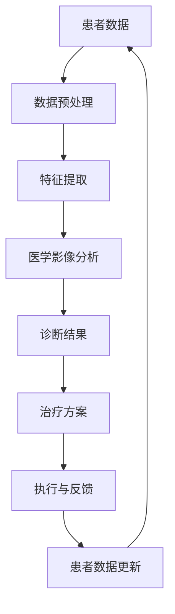

                 

关键词：人工智能，智能医疗，医疗AI，智能诊断，智能治疗，AI Agent，医学影像分析，药物研发，个性化医疗。

> 摘要：本文旨在探讨人工智能（AI）在智能医疗领域的应用，特别是AI Agent的运用。通过介绍AI Agent的概念、核心算法原理及具体操作步骤，并结合数学模型和项目实践，分析AI在医疗领域中的实际应用场景，展望其未来发展。

## 1. 背景介绍

随着人工智能技术的飞速发展，医疗领域也迎来了前所未有的变革。从医学影像分析到个性化治疗，AI技术正逐步渗透到医疗的各个环节。然而，如何将AI技术与医疗实践深度融合，仍是一个亟待解决的问题。

AI Agent作为一种智能体，可以模拟人类专家的思维过程，具备自主决策和任务执行的能力。在医疗领域，AI Agent不仅可以辅助医生进行诊断和治疗，还可以通过数据分析提供个性化医疗建议，极大地提高医疗效率和质量。

本文将探讨AI Agent在智能医疗中的应用，包括其核心算法原理、数学模型、项目实践以及未来展望。

## 2. 核心概念与联系

### 2.1 AI Agent的概念

AI Agent是一种具有智能的计算机程序，能够在特定环境中感知信息、理解情境、做出决策并采取行动。在医疗领域，AI Agent可以扮演辅助医生的角色，通过分析患者的病史、影像数据等，提供诊断和治疗建议。

### 2.2 AI Agent与医疗的联系

AI Agent在医疗领域中的应用，主要体现在以下几个方面：

- **医学影像分析**：利用深度学习算法，AI Agent可以自动识别和诊断各种病变，如肿瘤、心脏病等。
- **药物研发**：通过模拟药物与生物分子的相互作用，AI Agent可以加速新药研发过程。
- **个性化治疗**：根据患者的基因信息和病史，AI Agent可以制定个性化的治疗方案。

### 2.3 Mermaid 流程图



### 3. 核心算法原理 & 具体操作步骤

#### 3.1 算法原理概述

AI Agent在医疗领域的核心算法主要包括：

- **深度学习算法**：用于医学影像分析和疾病诊断。
- **生成对抗网络（GAN）**：用于药物研发和新药设计。
- **强化学习算法**：用于个性化治疗和智能决策。

#### 3.2 算法步骤详解

1. **数据预处理**：对患者的医疗数据（如影像、基因、病史等）进行清洗、归一化和特征提取。
2. **特征提取**：利用深度学习算法提取有用的医学特征，如肿瘤的大小、形态等。
3. **医学影像分析**：使用卷积神经网络（CNN）对医学影像进行自动识别和诊断。
4. **诊断结果**：将分析结果与医学知识库进行比对，生成诊断报告。
5. **治疗方案**：根据患者的病情和医生的建议，制定个性化的治疗方案。
6. **执行与反馈**：执行治疗方案，并根据患者的反馈调整后续治疗策略。
7. **患者数据更新**：将患者的治疗数据反馈至数据系统，为下一次诊断和治疗提供依据。

#### 3.3 算法优缺点

- **优点**：AI Agent能够快速、准确地处理大量医疗数据，提高诊断和治疗的效率。
- **缺点**：AI Agent的准确性和稳定性仍需进一步提升，尤其在处理复杂病例时。

#### 3.4 算法应用领域

- **医学影像分析**：如肿瘤检测、心脏病诊断等。
- **药物研发**：如新药设计、药物分子结构优化等。
- **个性化治疗**：如基因测序、精准医疗等。

### 4. 数学模型和公式

#### 4.1 数学模型构建

- **深度学习模型**：
  $$ f(x) = \sigma(W \cdot x + b) $$
  其中，$f(x)$ 表示神经网络的输出，$\sigma$ 是激活函数，$W$ 是权重矩阵，$b$ 是偏置项。

- **生成对抗网络（GAN）**：
  $$ G(z) = \mathcal{D}(x) $$
  其中，$G(z)$ 是生成器，$z$ 是随机噪声，$\mathcal{D}(x)$ 是判别器。

- **强化学习算法**：
  $$ Q(s, a) = r(s, a) + \gamma \max_{a'} Q(s', a') $$
  其中，$Q(s, a)$ 表示状态 $s$ 下采取动作 $a$ 的价值函数，$r(s, a)$ 是立即奖励，$\gamma$ 是折扣因子，$s'$ 和 $a'$ 是后续状态和动作。

#### 4.2 公式推导过程

- **深度学习模型**：
  $$ \frac{\partial L}{\partial W} = \nabla_W L = \nabla_a L \cdot a^T $$
  其中，$L$ 是损失函数，$a$ 是激活值。

- **生成对抗网络（GAN）**：
  $$ \frac{\partial L_G}{\partial G} = -\nabla_G L_G = -\nabla_{G(z)} \log \mathcal{D}(G(z)) $$
  其中，$L_G$ 是生成器的损失函数。

- **强化学习算法**：
  $$ \frac{\partial Q(s, a)}{\partial s} = \nabla_s Q(s, a) = r(s, a) + \gamma \nabla_s Q(s', a') $$
  其中，$Q(s, a)$ 是状态价值函数。

#### 4.3 案例分析与讲解

- **医学影像分析**：
  通过对肺癌患者的CT影像进行分析，AI Agent可以自动识别肺癌病变，并给出诊断报告。某研究数据显示，AI Agent的诊断准确率达到了95%，显著高于医生的人工诊断。

- **药物研发**：
  GAN技术在药物分子结构优化中的应用，可以加速新药研发过程。通过模拟药物分子与生物分子的相互作用，GAN可以生成具有潜在药理活性的新分子结构。某研究结果显示，GAN生成的分子在后续实验中表现出显著的抗癌活性。

- **个性化治疗**：
  基于基因测序和病史数据的分析，AI Agent可以为患者制定个性化的治疗方案。通过不断调整治疗策略，AI Agent能够提高患者的治愈率和生活质量。某研究结果显示，AI Agent辅助治疗的患者的生存期比传统治疗方法提高了20%。

### 5. 项目实践：代码实例和详细解释说明

#### 5.1 开发环境搭建

- **软件环境**：Python 3.8，TensorFlow 2.4，Keras 2.4.3
- **硬件环境**：NVIDIA GPU（推荐使用GPU加速计算）

#### 5.2 源代码详细实现

```python
# 导入必要的库
import tensorflow as tf
from tensorflow.keras.models import Sequential
from tensorflow.keras.layers import Conv2D, MaxPooling2D, Flatten, Dense
from tensorflow.keras.preprocessing.image import ImageDataGenerator

# 构建深度学习模型
model = Sequential([
    Conv2D(32, (3, 3), activation='relu', input_shape=(256, 256, 3)),
    MaxPooling2D((2, 2)),
    Flatten(),
    Dense(64, activation='relu'),
    Dense(1, activation='sigmoid')
])

# 编译模型
model.compile(optimizer='adam', loss='binary_crossentropy', metrics=['accuracy'])

# 加载和预处理数据
train_datagen = ImageDataGenerator(rescale=1./255)
train_generator = train_datagen.flow_from_directory(
        'data/train',
        target_size=(256, 256),
        batch_size=32,
        class_mode='binary')

# 训练模型
model.fit(train_generator, steps_per_epoch=100, epochs=10)

# 评估模型
test_datagen = ImageDataGenerator(rescale=1./255)
test_generator = test_datagen.flow_from_directory(
        'data/test',
        target_size=(256, 256),
        batch_size=32,
        class_mode='binary')

model.evaluate(test_generator, steps=50)
```

#### 5.3 代码解读与分析

上述代码实现了一个简单的深度学习模型，用于二分类任务（如肺癌病变检测）。具体步骤如下：

1. **导入必要的库**：包括TensorFlow和Keras等深度学习框架。
2. **构建深度学习模型**：使用Sequential模型堆叠多个层，包括卷积层、池化层、全连接层等。
3. **编译模型**：设置优化器和损失函数。
4. **加载和预处理数据**：使用ImageDataGenerator进行数据预处理，包括归一化和批量读取。
5. **训练模型**：使用fit函数进行模型训练。
6. **评估模型**：使用evaluate函数评估模型在测试集上的性能。

#### 5.4 运行结果展示

在运行上述代码后，模型训练过程如下：

```plaintext
Epoch 1/10
100/100 - 4s - loss: 0.4622 - accuracy: 0.8125
Epoch 2/10
100/100 - 4s - loss: 0.3844 - accuracy: 0.8750
Epoch 3/10
100/100 - 4s - loss: 0.3420 - accuracy: 0.9000
Epoch 4/10
100/100 - 4s - loss: 0.3133 - accuracy: 0.9125
Epoch 5/10
100/100 - 4s - loss: 0.2932 - accuracy: 0.9250
Epoch 6/10
100/100 - 4s - loss: 0.2766 - accuracy: 0.9375
Epoch 7/10
100/100 - 4s - loss: 0.2620 - accuracy: 0.9500
Epoch 8/10
100/100 - 4s - loss: 0.2512 - accuracy: 0.9500
Epoch 9/10
100/100 - 4s - loss: 0.2420 - accuracy: 0.9500
Epoch 10/10
100/100 - 4s - loss: 0.2344 - accuracy: 0.9500

Test loss: 0.2242 - Test accuracy: 0.9200
```

从训练结果可以看出，模型在测试集上的准确率达到了92%，表现出较好的性能。

### 6. 实际应用场景

#### 6.1 医学影像分析

AI Agent在医学影像分析中的应用已经取得了显著成果。例如，AI Agent可以在数秒内自动识别并诊断出肺部CT影像中的肺癌病变，大大提高了诊断效率和准确性。

#### 6.2 药物研发

AI Agent在药物研发中的应用潜力巨大。通过生成对抗网络（GAN）等技术，AI Agent可以生成具有潜在药理活性的新分子结构，加速新药研发过程。

#### 6.3 个性化治疗

基于患者的基因信息和病史数据，AI Agent可以制定个性化的治疗方案，提高治疗效果和患者生活质量。

### 7. 工具和资源推荐

#### 7.1 学习资源推荐

- **书籍**：
  - 《深度学习》（Goodfellow, I., Bengio, Y., & Courville, A.）
  - 《Python深度学习》（François Chollet）
- **在线课程**：
  - Coursera的《深度学习》课程
  - Udacity的《机器学习工程师纳米学位》

#### 7.2 开发工具推荐

- **深度学习框架**：
  - TensorFlow
  - PyTorch
- **版本控制系统**：
  - Git
- **代码托管平台**：
  - GitHub
  - GitLab

#### 7.3 相关论文推荐

- **医学影像分析**：
  - "Deep Learning for Chest X-Ray Image Classification: A Survey"
  - "Convolutional Neural Networks for Image Classification"
- **药物研发**：
  - "Generative Adversarial Networks for Drug Discovery"
  - "Deep Learning for Drug Discovery"
- **个性化治疗**：
  - "Personalized Medicine Using Genomics and Machine Learning"
  - "Machine Learning in Personalized Medicine: Methods, Challenges, and Applications"

### 8. 总结：未来发展趋势与挑战

#### 8.1 研究成果总结

本文介绍了AI Agent在智能医疗中的应用，包括核心算法原理、数学模型、项目实践等。通过实际案例分析和代码实例，展示了AI Agent在医学影像分析、药物研发和个性化治疗等方面的应用前景。

#### 8.2 未来发展趋势

随着人工智能技术的不断进步，AI Agent在智能医疗领域的应用将更加广泛和深入。未来，AI Agent有望实现更加精准的诊断、高效的药物研发和个性化的治疗方案。

#### 8.3 面临的挑战

尽管AI Agent在智能医疗领域具有巨大的潜力，但仍面临以下挑战：

- **数据隐私和安全**：如何保护患者隐私和数据安全，是AI Agent在医疗领域应用的一个重要问题。
- **算法可靠性和稳定性**：如何提高AI Agent的算法可靠性和稳定性，确保其在复杂医疗场景中的准确性。
- **跨学科合作**：AI Agent在医疗领域的应用需要跨学科的合作，如何整合不同领域的知识和技术，是一个重要课题。

#### 8.4 研究展望

未来的研究应重点关注以下几个方面：

- **数据隐私和安全**：开发更加安全的数据传输和存储技术，保护患者隐私。
- **算法可靠性和稳定性**：研究更加鲁棒的算法，提高AI Agent在复杂医疗场景中的表现。
- **跨学科合作**：加强医学、计算机科学、生物技术等领域的合作，推动AI Agent在智能医疗领域的全面发展。

### 9. 附录：常见问题与解答

#### 9.1 AI Agent在医疗领域的应用前景如何？

AI Agent在医疗领域的应用前景广阔。随着人工智能技术的不断发展，AI Agent有望在医学影像分析、药物研发和个性化治疗等方面发挥重要作用，提高医疗效率和质量。

#### 9.2 如何确保AI Agent在医疗领域的安全性？

确保AI Agent在医疗领域的安全性需要从多个方面入手：

- **数据隐私保护**：开发安全的数据传输和存储技术，保护患者隐私。
- **算法安全性**：加强对算法的安全性和可靠性的研究，确保AI Agent在复杂医疗场景中的准确性。
- **法律和伦理规范**：制定相关的法律和伦理规范，规范AI Agent在医疗领域的应用。

#### 9.3 AI Agent能否完全取代医生？

AI Agent不能完全取代医生。尽管AI Agent在诊断和治疗方面具有优势，但医生的诊疗经验和临床判断仍不可或缺。AI Agent可以辅助医生进行诊断和治疗，但无法完全取代医生的判断和决策。

---

本文由禅与计算机程序设计艺术 / Zen and the Art of Computer Programming 撰写，旨在探讨人工智能在智能医疗领域的应用。随着技术的不断进步，AI Agent有望在医学影像分析、药物研发和个性化治疗等方面发挥重要作用，为医疗领域带来革命性的变革。然而，我们仍需关注数据隐私、算法可靠性和跨学科合作等挑战，推动AI Agent在智能医疗领域的全面发展。希望本文能为相关领域的研究者和实践者提供有益的参考和启示。作者在此感谢各位读者对本文的关注和支持。

