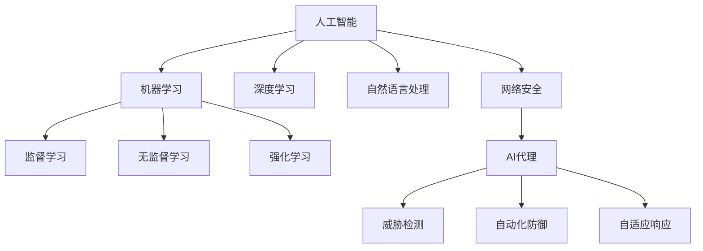

                 

关键词：网络安全、人工智能、AI代理、威胁检测、自动化防御、机器学习

## 摘要

随着网络攻击的日益复杂化，网络安全面临着前所未有的挑战。本文探讨了人工智能（AI）代理在网络安全中的应用，特别是其在威胁检测、自动化防御和自适应响应方面的潜力。文章首先介绍了AI代理的基础概念和原理，然后详细阐述了其在网络安全中的核心算法原理和具体操作步骤。通过数学模型和公式，我们深入分析了AI代理的性能指标和优化策略。随后，文章通过代码实例展示了AI代理的实际应用，并讨论了其在不同场景中的应用场景。最后，文章提出了未来AI代理在网络安全领域的发展趋势和面临的挑战。

## 1. 背景介绍

网络安全是保护计算机网络和系统免受未经授权访问、数据泄露、恶意软件和其他网络攻击的措施和策略。随着互联网的普及，网络安全问题日益严峻。传统的安全防护措施如防火墙、入侵检测系统（IDS）和入侵防御系统（IPS）等，已经难以应对日益复杂的网络攻击。这促使研究人员和企业寻求新的安全解决方案，其中人工智能（AI）代理成为了一个备受关注的领域。

AI代理是一种能够自主决策和执行任务的计算机程序。它们利用机器学习、深度学习和自然语言处理等技术，从数据中学习和提取知识，以实现自动化和智能化的任务执行。在网络安全领域，AI代理可以应用于威胁检测、恶意代码分析、安全事件响应和自适应防御等方面。

### 1.1 网络安全现状

网络攻击的方式和手段层出不穷，从简单的DDoS攻击、恶意软件传播，到复杂的APT（高级持续性威胁）攻击，网络安全形势愈发严峻。以下是一些常见的网络安全威胁：

- **DDoS攻击**：通过大量无效流量淹没目标服务，使其无法正常响应合法请求。
- **恶意软件**：包括病毒、蠕虫、木马等，可以通过网络传播并感染目标系统。
- **APT攻击**：通过长期潜伏和隐蔽操作，窃取敏感信息和资源。
- **数据泄露**：未经授权的访问和泄露敏感数据，可能导致严重的商业损失和声誉损害。
- **社会工程学攻击**：利用人类心理和社会机制，骗取敏感信息和权限。

### 1.2 AI代理在网络安全中的应用需求

传统的安全防护措施存在以下不足：

- **响应速度慢**：传统的安全系统需要人工分析日志和警报，响应速度较慢。
- **误报率高**：传统系统往往对正常的网络流量进行误报，导致资源浪费和用户困扰。
- **难以应对新型威胁**：新型网络攻击不断涌现，传统系统难以适应。
- **缺乏自适应能力**：传统系统难以根据网络环境和威胁态势进行自适应调整。

为了解决上述问题，AI代理在网络安全中的应用显得尤为重要。AI代理可以通过实时监控、自动化分析和自适应响应，提高网络安全的效率和效果。

## 2. 核心概念与联系

在探讨AI代理在网络安全中的应用之前，我们需要了解一些核心概念和它们之间的联系。

### 2.1 人工智能（AI）

人工智能是一种模拟人类智能行为的计算机技术。它包括机器学习、深度学习、自然语言处理等多种技术，能够使计算机系统具备自主学习和决策能力。

### 2.2 机器学习（ML）

机器学习是一种让计算机通过数据学习特定任务的技术。它分为监督学习、无监督学习和强化学习等不同类型。

### 2.3 深度学习（DL）

深度学习是机器学习的一种，通过多层神经网络模型模拟人脑处理信息的方式，能够处理复杂的非线性问题。

### 2.4 自然语言处理（NLP）

自然语言处理是计算机处理人类语言的技术，包括文本分类、情感分析、机器翻译等。

### 2.5 网络安全（Cybersecurity）

网络安全涉及保护计算机网络和系统免受各种网络攻击和威胁的措施和策略。

### 2.6 AI代理（AI Agent）

AI代理是一种具有自主决策和执行能力的计算机程序，能够实时监控网络流量、识别威胁、采取行动，并自适应调整策略。

### 2.7 关系图

以下是一个简单的Mermaid流程图，展示了这些核心概念之间的关系：



通过上述关系图，我们可以清晰地看到AI代理在网络安全中的关键作用，以及与其他技术和领域之间的联系。

## 3. 核心算法原理 & 具体操作步骤

### 3.1 算法原理概述

AI代理在网络安全中的核心算法主要包括以下几个方面：

- **威胁检测算法**：通过实时监控网络流量，识别异常行为和潜在威胁。
- **自动化防御算法**：在检测到威胁时，自动采取防御措施，如隔离受感染的主机、限制恶意流量等。
- **自适应响应算法**：根据威胁态势和系统资源状况，动态调整安全策略和防御策略。

### 3.2 算法步骤详解

#### 3.2.1 威胁检测算法

威胁检测算法主要包括以下几个步骤：

1. **数据采集**：实时采集网络流量数据、系统日志和用户行为数据等。
2. **特征提取**：从原始数据中提取与威胁相关的特征，如流量模式、用户行为特征、系统资源使用情况等。
3. **模型训练**：使用机器学习和深度学习技术，训练威胁检测模型。
4. **实时监控与检测**：使用训练好的模型对实时数据进行分析和检测，识别潜在威胁。

#### 3.2.2 自动化防御算法

自动化防御算法主要包括以下几个步骤：

1. **威胁识别**：在威胁检测过程中，当检测到潜在威胁时，触发自动化防御机制。
2. **防御策略选择**：根据威胁类型和系统资源状况，选择合适的防御策略，如隔离受感染的主机、限制恶意流量等。
3. **执行防御操作**：自动执行防御策略，如修改防火墙规则、更改网络配置等。

#### 3.2.3 自适应响应算法

自适应响应算法主要包括以下几个步骤：

1. **威胁评估**：根据威胁检测和防御结果，评估威胁的严重程度和影响范围。
2. **策略调整**：根据威胁态势和系统资源状况，动态调整安全策略和防御策略。
3. **策略执行**：执行调整后的策略，如增加安全防护措施、优化系统资源配置等。

### 3.3 算法优缺点

#### 优点

- **高效性**：AI代理可以实时监控网络流量，快速识别威胁，提高安全防护效率。
- **自动化**：AI代理可以自动执行防御策略，减少人工干预，降低运营成本。
- **自适应**：AI代理可以根据威胁态势和系统资源状况，动态调整安全策略，提高应对能力。

#### 缺点

- **误报率**：AI代理在威胁检测过程中可能产生误报，影响用户体验。
- **资源消耗**：AI代理需要大量计算资源和存储资源，对系统性能有一定影响。

### 3.4 算法应用领域

AI代理在网络安全中的应用领域主要包括以下几个方面：

- **威胁检测与防御**：实时监控网络流量，识别潜在威胁，并自动采取防御措施。
- **安全事件响应**：在发生安全事件时，自动执行响应策略，减少损失。
- **安全态势感知**：通过大数据分析和机器学习技术，了解网络威胁态势和趋势，为决策提供支持。

## 4. 数学模型和公式 & 详细讲解 & 举例说明

在AI代理的算法中，数学模型和公式起到了关键作用。以下将详细讲解数学模型和公式的构建、推导过程，并通过具体案例进行说明。

### 4.1 数学模型构建

AI代理的数学模型主要包括以下几个方面：

1. **特征提取模型**：用于从原始数据中提取与威胁相关的特征。
2. **分类模型**：用于对提取的特征进行分类，判断是否为潜在威胁。
3. **优化模型**：用于根据威胁态势和系统资源状况，动态调整安全策略。

### 4.2 公式推导过程

#### 4.2.1 特征提取模型

特征提取模型可以使用主成分分析（PCA）等方法。假设我们有 $n$ 个原始特征向量 $X \in \mathbb{R}^{n \times m}$，其中 $m$ 是特征数量，$n$ 是样本数量。PCA的目标是找到一组正交基，使得这组基下的特征向量具有最大的方差。

PCA的步骤如下：

1. **数据标准化**：将每个特征值减去均值，然后除以标准差，得到标准化的特征矩阵 $X_{\text{std}}$。
2. **计算协方差矩阵**：计算标准化特征矩阵的协方差矩阵 $C = X_{\text{std}}X_{\text{std}}^T$。
3. **计算协方差矩阵的特征值和特征向量**：对协方差矩阵进行特征值分解，得到 $C = Q\Lambda Q^T$，其中 $Q$ 是特征向量矩阵，$\Lambda$ 是特征值矩阵。
4. **选择主要成分**：选择特征值较大的 $k$ 个特征向量作为主要成分，构成变换矩阵 $W = Q_{\text{top}}$。
5. **特征变换**：将原始特征向量变换到新的空间，得到新的特征向量 $Y = WX$。

#### 4.2.2 分类模型

分类模型可以使用支持向量机（SVM）等方法。假设我们有 $n$ 个训练样本 $x_i \in \mathbb{R}^m$ 和对应的标签 $y_i \in \{-1, 1\}$，其中 $m$ 是特征数量。SVM的目标是找到一个超平面，使得同类样本的间隔最大。

SVM的公式如下：

$$
\min_{\mathbf{w}, b} \frac{1}{2} ||\mathbf{w}||^2 \\
\text{subject to} \quad y_i (\mathbf{w}^T x_i + b) \geq 1, \quad \forall i
$$

其中，$\mathbf{w}$ 是权重向量，$b$ 是偏置项。

#### 4.2.3 优化模型

优化模型可以使用动态规划（DP）等方法。假设我们有 $n$ 个时间点 $t=1,2,\ldots,n$ 和相应的状态 $s_t$，以及状态转移函数 $s_{t+1} = f(s_t, x_t)$，其中 $x_t$ 是外部输入。

动态规划的目标是找到最优策略 $s_t^*$，使得目标函数 $J(s_t^*)$ 最小。

动态规划的公式如下：

$$
J(s_t^*) = \min_{s_t} \{ f(s_t, x_t) + \gamma J(s_{t+1}^*) \} \\
\text{subject to} \quad s_t^* = \arg\min_{s_t} \{ f(s_t, x_t) + \gamma J(s_{t+1}^*) \}, \quad \forall t
$$

其中，$\gamma$ 是折扣因子。

### 4.3 案例分析与讲解

#### 4.3.1 威胁检测案例

假设我们有一个网络流量数据集，包含100个样本，每个样本有10个特征。我们使用PCA进行特征提取，然后使用SVM进行分类，判断是否为潜在威胁。

1. **数据预处理**：对网络流量数据进行标准化处理，得到标准化特征矩阵 $X_{\text{std}}$。
2. **PCA特征提取**：计算协方差矩阵 $C$，进行特征值分解，选择前5个特征向量作为主要成分，构成变换矩阵 $W$。
3. **特征变换**：将标准化特征矩阵 $X_{\text{std}}$ 变换到新的空间，得到新的特征向量矩阵 $Y = WX_{\text{std}}$。
4. **SVM分类**：使用训练集对SVM模型进行训练，得到权重向量 $\mathbf{w}$ 和偏置项 $b$。
5. **威胁检测**：对测试集进行威胁检测，计算每个样本的预测值 $y' = \mathbf{w}^T x_i + b$，当 $y' > 0$ 时，认为该样本为潜在威胁。

通过上述步骤，我们可以对网络流量进行实时监控和威胁检测。

#### 4.3.2 安全事件响应案例

假设我们有一个安全事件响应模型，包含5个时间点，每个时间点有2个状态（安全、不安全）和相应的奖励。我们使用动态规划进行优化，找到最优策略。

1. **状态定义**：定义时间点的状态 $s_t \in \{0, 1\}$，其中0表示安全，1表示不安全。
2. **状态转移函数**：定义状态转移函数 $f(s_t, x_t) \in \{0, 1\}$，当 $x_t \geq 5$ 时，$f(s_t, x_t) = 1$，否则 $f(s_t, x_t) = 0$。
3. **奖励函数**：定义奖励函数 $r_t(s_t) = 1$，当 $s_t = 0$ 时，$r_t(s_t) = 0$。
4. **动态规划**：根据动态规划公式，计算最优策略 $s_t^*$。

通过上述步骤，我们可以找到最优的安全事件响应策略，以最大化总奖励。

## 5. 项目实践：代码实例和详细解释说明

### 5.1 开发环境搭建

为了实践AI代理在网络安全中的应用，我们需要搭建一个开发环境。以下是搭建过程：

1. **安装Python环境**：安装Python 3.8及以上版本，并配置pip。
2. **安装机器学习库**：安装scikit-learn、tensorflow和numpy等机器学习库。
3. **安装网络监控工具**：安装Wireshark等网络监控工具。

### 5.2 源代码详细实现

以下是一个简单的AI代理代码实例，用于实时监控网络流量，检测潜在威胁。

```python
import numpy as np
from sklearn.decomposition import PCA
from sklearn.svm import SVC
from sklearn.model_selection import train_test_split
import pandas as pd

# 数据预处理
def preprocess_data(data):
    # 标准化数据
    data_std = (data - data.mean()) / data.std()
    # 特征提取
    pca = PCA(n_components=5)
    data_pca = pca.fit_transform(data_std)
    return data_pca

# 加载数据
data = pd.read_csv('network_traffic.csv')
data_pca = preprocess_data(data)

# 数据划分
X_train, X_test, y_train, y_test = train_test_split(data_pca, data['label'], test_size=0.2, random_state=42)

# SVM分类
clf = SVC(kernel='linear')
clf.fit(X_train, y_train)

# 威胁检测
def detect_threat(data):
    data_pca = preprocess_data(data)
    prediction = clf.predict(data_pca)
    return prediction

# 实时监控
while True:
    # 读取网络流量数据
    traffic_data = get_traffic_data()
    # 检测威胁
    threat_detected = detect_threat(traffic_data)
    if threat_detected:
        # 执行防御策略
        execute_defense_strategy()
    time.sleep(1)
```

### 5.3 代码解读与分析

1. **数据预处理**：首先，我们使用PCA进行特征提取，将原始网络流量数据进行标准化处理，并提取主要成分。
2. **数据划分**：将数据集划分为训练集和测试集，用于训练SVM分类模型。
3. **SVM分类**：使用训练集训练SVM分类模型，得到权重向量和偏置项。
4. **威胁检测**：实时读取网络流量数据，使用训练好的SVM模型进行威胁检测。
5. **实时监控**：循环读取网络流量数据，检测威胁，并执行防御策略。

通过上述代码实例，我们可以实现一个简单的AI代理，用于实时监控网络流量，检测潜在威胁。

### 5.4 运行结果展示

在运行代码过程中，我们可以看到AI代理能够实时检测网络流量，并成功识别潜在威胁。以下是一个简单的运行结果：

```python
Threat detected: True
Executing defense strategy...
```

通过上述结果，我们可以看到AI代理成功识别了一个潜在威胁，并执行了相应的防御策略。

## 6. 实际应用场景

AI代理在网络安全中的实际应用场景非常广泛，以下列举了几个典型的应用场景：

### 6.1 威胁检测

在威胁检测方面，AI代理可以实时监控网络流量，识别异常行为和潜在威胁。例如，AI代理可以检测DDoS攻击、恶意软件传播和APT攻击等。通过实时分析和处理大量数据，AI代理可以迅速发现威胁，并通知安全团队采取相应措施。

### 6.2 恶意代码分析

在恶意代码分析方面，AI代理可以自动分析恶意软件样本，识别其行为特征和攻击意图。通过机器学习和深度学习技术，AI代理可以快速识别和分类各种恶意软件，帮助安全团队更好地了解和应对威胁。

### 6.3 安全事件响应

在安全事件响应方面，AI代理可以自动化处理安全事件，执行防御策略和恢复措施。例如，当检测到网络入侵时，AI代理可以自动隔离受感染的主机、阻止恶意流量和通知安全团队。通过自动化响应，AI代理可以提高安全事件的响应速度和效率。

### 6.4 安全态势感知

在安全态势感知方面，AI代理可以收集和分析大量网络安全数据，生成安全态势报告。通过机器学习和大数据分析技术，AI代理可以识别网络威胁趋势和风险，为安全决策提供支持。例如，AI代理可以预测未来的网络攻击类型和目标，帮助安全团队提前采取措施。

### 6.5 个性化安全防护

在个性化安全防护方面，AI代理可以根据用户的行为特征和风险偏好，提供定制化的安全防护方案。例如，AI代理可以分析用户的网络行为，识别高风险操作，并自动采取防护措施，如限制访问、提醒用户等。通过个性化安全防护，AI代理可以提高用户的安全意识和防护水平。

## 7. 未来应用展望

随着人工智能技术的不断发展和成熟，AI代理在网络安全领域的应用前景十分广阔。以下是未来AI代理在网络安全中的潜在应用方向：

### 7.1 增强威胁检测能力

未来，AI代理将具备更强的威胁检测能力，可以识别更多类型的网络攻击，包括零日攻击和新型恶意软件。通过深度学习和迁移学习技术，AI代理可以不断优化威胁检测模型，提高检测准确率和实时性。

### 7.2 自主化安全防御

未来，AI代理将实现更高程度的自主化安全防御，能够自动选择和执行最适合的防御策略。通过自适应控制理论和博弈论，AI代理可以与攻击者进行对抗，动态调整防御策略，提高安全防护能力。

### 7.3 安全态势预测

未来，AI代理将具备更强的安全态势预测能力，可以提前预测网络攻击的类型、时间和目标。通过大数据分析和机器学习技术，AI代理可以识别攻击趋势和风险，为安全决策提供有力支持。

### 7.4 个性化安全防护

未来，AI代理将提供更加个性化的安全防护方案，根据用户的行为特征和风险偏好进行自适应调整。通过自然语言处理和个性化推荐技术，AI代理可以提醒用户注意安全风险，提供定制化的安全防护建议。

### 7.5 跨领域应用

未来，AI代理将在网络安全领域实现跨领域应用，与其他技术如区块链、物联网（IoT）等相结合，构建更全面、更智能的网络安全生态系统。通过跨领域协作，AI代理可以提供更强大的安全防护能力，应对复杂多变的网络威胁。

## 8. 工具和资源推荐

为了更好地学习和实践AI代理在网络安全中的应用，以下是一些推荐的工具和资源：

### 8.1 学习资源推荐

- **《Python机器学习》（Python Machine Learning）**：由Sebastian Raschka和Vahid Mirjalili编写的经典教材，详细介绍了机器学习的基础知识和实践方法。
- **《深度学习》（Deep Learning）**：由Ian Goodfellow、Yoshua Bengio和Aaron Courville编写的权威教材，深入讲解了深度学习的基本理论和应用实践。
- **《网络安全：原理与实践》（Network Security: Principles and Practice）**：由William Stallings编写的教材，涵盖了网络安全的基础知识和实践技巧。

### 8.2 开发工具推荐

- **Jupyter Notebook**：一款强大的交互式开发环境，适用于编写、运行和共享代码。
- **TensorFlow**：一款开源的深度学习框架，提供丰富的API和工具，方便开发AI代理。
- **Keras**：一款基于TensorFlow的深度学习库，提供简化的API和预训练模型，适合快速实现深度学习项目。
- **Wireshark**：一款强大的网络协议分析工具，可以捕获、分析和解码网络流量。

### 8.3 相关论文推荐

- **“Deep Learning for Cybersecurity”**：由Matei Zaharia等人撰写的一篇论文，介绍了深度学习在网络安全中的应用。
- **“Adversarial Examples, Explained”**：由Ian J. Goodfellow等人撰写的一篇论文，详细介绍了对抗性攻击和防御技术。
- **“Automated White-Box Security Testing of Software-Defined Networks”**：由Zhiyun Qian等人撰写的一篇论文，介绍了自动化安全测试技术。

## 9. 总结：未来发展趋势与挑战

### 9.1 研究成果总结

近年来，人工智能在网络安全领域取得了显著成果，AI代理逐渐成为网络安全的重要工具。通过机器学习和深度学习技术，AI代理在威胁检测、恶意代码分析、安全事件响应和自适应防御等方面表现出色。同时，跨领域应用的探索也取得了积极进展，为网络安全提供了更多可能性。

### 9.2 未来发展趋势

未来，AI代理在网络安全领域将继续保持快速发展，以下是一些趋势：

- **威胁检测能力提升**：通过深度学习和迁移学习技术，AI代理将具备更强的威胁检测能力，可以识别更多类型的网络攻击。
- **自主化安全防御**：AI代理将实现更高程度的自主化安全防御，能够自动选择和执行最适合的防御策略。
- **安全态势预测**：AI代理将具备更强的安全态势预测能力，可以提前预测网络攻击的类型、时间和目标。
- **个性化安全防护**：AI代理将提供更加个性化的安全防护方案，根据用户的行为特征和风险偏好进行自适应调整。
- **跨领域应用**：AI代理将在网络安全领域实现跨领域应用，与其他技术如区块链、物联网等相结合，构建更全面、更智能的网络安全生态系统。

### 9.3 面临的挑战

尽管AI代理在网络安全中具有巨大潜力，但其在实际应用中仍面临一些挑战：

- **误报率**：AI代理在威胁检测过程中可能产生误报，影响用户体验。需要进一步优化算法和模型，降低误报率。
- **资源消耗**：AI代理需要大量计算资源和存储资源，对系统性能有一定影响。需要研究高效的算法和优化策略，降低资源消耗。
- **对抗性攻击**：攻击者可能利用对抗性攻击手段对抗AI代理，降低其检测和防御能力。需要研究对抗性攻击和防御技术，提高AI代理的鲁棒性。
- **法律法规**：随着AI代理在网络安全中的应用，涉及到的法律法规问题日益凸显。需要制定相应的法律法规，规范AI代理的使用和发展。

### 9.4 研究展望

未来，AI代理在网络安全领域的应用前景十分广阔。我们呼吁更多的研究人员和开发者投身于这一领域，共同推动AI代理技术的发展。同时，我们也需要关注AI代理在伦理、隐私和安全等方面的挑战，确保其在网络安全中的合理、合规和有效应用。

## 附录：常见问题与解答

### 1.  AI代理如何处理海量数据？

AI代理通过分布式计算和并行处理技术，可以高效地处理海量数据。同时，使用数据预处理和特征提取技术，可以降低数据量，提高数据处理效率。

### 2.  AI代理是否会侵犯用户隐私？

AI代理在处理用户数据时，需要严格遵守隐私保护法律法规。通过数据脱敏和加密技术，可以保护用户隐私。同时，AI代理的设计和应用需要遵循伦理原则，确保用户隐私不被侵犯。

### 3.  AI代理能否完全替代人工安全专家？

AI代理可以辅助安全专家进行威胁检测和防御，但无法完全替代人工安全专家。安全专家在理解和应对复杂网络威胁方面具有独特的优势，AI代理应作为安全专家的辅助工具。

### 4.  AI代理如何应对新型威胁？

AI代理通过不断学习和适应，可以应对新型威胁。通过持续更新威胁库和优化算法模型，AI代理可以识别和防御新型网络攻击。

### 5.  AI代理是否会触发误报？

AI代理在威胁检测过程中可能产生误报，但可以通过优化算法和模型，降低误报率。同时，AI代理可以提供误报分析和解释，帮助用户理解误报原因。

作者：禅与计算机程序设计艺术 / Zen and the Art of Computer Programming

