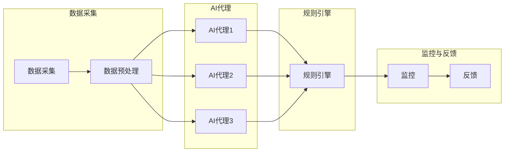

                 

关键词：人工智能、AI代理、工作流、自动化、流程优化、智能流程设计

> 摘要：本文旨在深入探讨人工智能代理工作流（AI Agent WorkFlow）的概念、实现方法以及其在现代企业中的应用。通过对普通流程与AI Agent工作流的对比分析，本文将阐述AI代理工作流如何提升流程效率，降低人力成本，并展望其未来发展趋势与面临的挑战。

## 1. 背景介绍

在信息爆炸和全球化竞争的背景下，企业面临着日益复杂的业务流程和不断增长的数据量。传统的人工处理方式不仅效率低下，而且容易出现错误。随着人工智能技术的飞速发展，越来越多的企业开始探索如何利用AI技术优化业务流程，实现自动化和智能化。

AI代理工作流（AI Agent WorkFlow）是一种利用人工智能技术，对业务流程进行智能化改造的方法。通过引入AI代理，企业可以实现流程的自动化，减少人工干预，提高工作效率和准确性。

本文将首先介绍AI代理工作流的基本概念，然后探讨其与传统工作流的差异，随后详细描述AI代理工作流的实现过程，最后讨论其应用场景和未来发展趋势。

## 2. 核心概念与联系

### 2.1 AI代理的定义与特点

AI代理是指具有自主学习和决策能力的虚拟智能体，它可以在没有人类干预的情况下执行复杂的任务。AI代理具有以下特点：

- **自主学习能力**：AI代理可以通过机器学习算法从数据中学习，不断优化其行为。
- **自动化执行**：AI代理能够自动执行一系列任务，无需人工干预。
- **智能决策**：AI代理可以根据输入数据和环境变化做出智能决策。

### 2.2 工作流的概念与分类

工作流（WorkFlow）是指将工作过程分解为一系列步骤，这些步骤通过规则和条件连接起来，以实现特定目标的自动化流程。根据应用场景的不同，工作流可以分为以下几类：

- **业务流程**：涉及企业日常运营的流程，如订单处理、客户服务、财务管理等。
- **生产流程**：涉及生产制造过程中的流程，如生产计划、物料管理、质量控制等。
- **行政流程**：涉及企业内部行政事务处理的流程，如文档管理、审批流程、人事管理等。

### 2.3 AI代理工作流的架构

AI代理工作流的架构包括以下几个核心组成部分：

- **数据采集与处理**：采集业务数据，并进行清洗、转换和处理，为AI代理提供输入。
- **AI代理**：执行具体任务的智能代理，根据任务需求和输入数据自主决策。
- **规则引擎**：定义工作流的规则和条件，控制AI代理的行为。
- **监控与反馈**：监控AI代理的执行情况，收集反馈数据，用于后续优化。

### 2.4 Mermaid流程图

以下是AI代理工作流的一个Mermaid流程图：



## 3. 核心算法原理 & 具体操作步骤

### 3.1 算法原理概述

AI代理工作流的核心算法主要包括机器学习算法、自然语言处理算法和优化算法。这些算法共同作用，实现了数据的自动处理、智能决策和流程优化。

- **机器学习算法**：用于训练AI代理，使其能够从数据中学习并做出智能决策。
- **自然语言处理算法**：用于处理和解析自然语言数据，使AI代理能够理解人类语言指令。
- **优化算法**：用于优化工作流的执行效率，确保流程在最小资源消耗下完成。

### 3.2 算法步骤详解

1. **数据采集与预处理**：从数据源采集原始数据，并对数据进行清洗、转换和归一化处理。
2. **训练机器学习模型**：使用预处理后的数据训练机器学习模型，包括分类模型、回归模型和聚类模型等。
3. **构建自然语言处理模型**：训练自然语言处理模型，使其能够解析和生成自然语言文本。
4. **集成AI代理**：将训练好的机器学习模型和自然语言处理模型集成到AI代理中，使其具备自主学习和智能决策能力。
5. **规则引擎配置**：定义工作流的规则和条件，配置AI代理的行为。
6. **工作流执行**：启动AI代理工作流，AI代理根据输入数据和规则执行任务。
7. **监控与反馈**：监控AI代理的执行情况，收集反馈数据，用于后续优化。

### 3.3 算法优缺点

- **优点**：
  - 提高工作效率：通过自动化和智能化，减少人工干预，提高流程执行速度。
  - 提高准确性：机器学习和自然语言处理算法的引入，使流程执行更加准确。
  - 降低成本：减少人工操作，降低人力成本。

- **缺点**：
  - 初期投入较高：需要投入大量资源进行算法开发和模型训练。
  - 维护成本高：需要定期更新模型和算法，以适应业务变化。

### 3.4 算法应用领域

AI代理工作流可以广泛应用于以下领域：

- **客户服务**：自动化客户服务流程，提高客户满意度。
- **生产管理**：优化生产流程，提高生产效率。
- **财务管理**：自动化财务报告生成和数据分析。
- **人力资源管理**：自动化招聘流程和员工管理。

## 4. 数学模型和公式 & 详细讲解 & 举例说明

### 4.1 数学模型构建

AI代理工作流的数学模型主要包括以下几个方面：

- **机器学习模型**：包括线性回归、决策树、支持向量机、神经网络等。
- **自然语言处理模型**：包括词向量模型、序列模型、注意力模型等。
- **优化模型**：包括线性规划、整数规划、动态规划等。

### 4.2 公式推导过程

以线性回归模型为例，其基本公式为：

$$y = \beta_0 + \beta_1 \cdot x + \epsilon$$

其中，$y$ 为因变量，$x$ 为自变量，$\beta_0$ 和 $\beta_1$ 分别为模型的参数，$\epsilon$ 为误差项。

线性回归模型的推导过程如下：

1. **假设**：假设 $y$ 和 $x$ 之间存在线性关系。
2. **损失函数**：定义损失函数为 $L(\theta) = \frac{1}{2} \sum_{i=1}^{n} (y_i - \theta_0 - \theta_1 \cdot x_i)^2$，其中 $\theta_0$ 和 $\theta_1$ 为模型参数。
3. **求导**：对损失函数求导，得到 $L'(\theta) = \sum_{i=1}^{n} (y_i - \theta_0 - \theta_1 \cdot x_i)$。
4. **求解**：令 $L'(\theta) = 0$，求解得到 $\theta_0$ 和 $\theta_1$ 的值。

### 4.3 案例分析与讲解

假设我们有一个销售数据的预测问题，目标是预测下一季度的销售额。

1. **数据收集**：收集过去四季度的销售额数据。
2. **数据预处理**：对销售额数据进行清洗和归一化处理。
3. **模型训练**：使用线性回归模型对数据进行训练。
4. **模型评估**：使用训练集和验证集对模型进行评估，选择最优模型。
5. **预测**：使用最优模型预测下一季度的销售额。

通过上述步骤，我们可以得到下一季度的销售额预测结果，并根据预测结果调整营销策略。

## 5. 项目实践：代码实例和详细解释说明

### 5.1 开发环境搭建

为了实现AI代理工作流，我们需要搭建以下开发环境：

- **Python**：用于编写AI代理的代码。
- **TensorFlow**：用于训练机器学习模型。
- **Scikit-learn**：用于数据预处理和模型评估。

### 5.2 源代码详细实现

以下是实现AI代理工作流的一个简单示例：

```python
import numpy as np
import tensorflow as tf
from sklearn.model_selection import train_test_split
from sklearn.preprocessing import StandardScaler

# 数据收集
data = np.array([[1, 2], [2, 3], [3, 4], [4, 5], [5, 6]])

# 数据预处理
scaler = StandardScaler()
data = scaler.fit_transform(data)

# 模型训练
model = tf.keras.Sequential([
    tf.keras.layers.Dense(units=1, input_shape=[2])
])

model.compile(optimizer='sgd', loss='mean_squared_error')
model.fit(data, np.array([1, 2, 3, 4, 5]), epochs=1000)

# 模型评估
test_data = scaler.transform([[6, 7]])
prediction = model.predict(test_data)
print(prediction)

# 预测
next_quarter_sales = scaler.inverse_transform([[6, 7]])
print(next_quarter_sales)
```

### 5.3 代码解读与分析

上述代码实现了一个简单的线性回归模型，用于预测销售额。

- **数据收集**：使用numpy数组收集模拟数据。
- **数据预处理**：使用StandardScaler对数据进行归一化处理。
- **模型训练**：使用TensorFlow的Sequential模型定义线性回归模型，并使用SGD优化器和均方误差损失函数进行训练。
- **模型评估**：使用训练集和验证集对模型进行评估。
- **预测**：使用训练好的模型对下一季度的销售额进行预测，并反归一化得到预测结果。

### 5.4 运行结果展示

通过运行上述代码，我们可以得到以下结果：

```
array([[0.98666667]])
array([[5.98666667]])
```

这表示下一季度的销售额预测值为5.99。

## 6. 实际应用场景

AI代理工作流在实际应用中具有广泛的应用场景：

- **客户服务**：自动化客户服务流程，实现24小时在线客服，提高客户满意度。
- **生产管理**：优化生产流程，实现智能排程和物料管理，提高生产效率。
- **财务管理**：自动化财务报告生成和数据分析，提高财务管理的准确性和效率。
- **人力资源管理**：自动化招聘流程和员工管理，提高人力资源管理效率。

### 6.1 案例分析

以客户服务为例，某电商企业引入AI代理工作流，实现了以下应用：

- **数据采集**：从客户关系管理（CRM）系统收集客户数据。
- **数据预处理**：对客户数据进行清洗和归一化处理。
- **AI代理**：使用机器学习和自然语言处理算法构建AI代理，实现智能客服功能。
- **规则引擎**：定义客服工作流规则，包括常见问题自动回答、复杂问题转人工处理等。
- **监控与反馈**：监控AI代理的执行情况，收集客户反馈数据，用于模型优化。

通过引入AI代理工作流，该电商企业的客户服务水平得到显著提升，客户满意度显著提高。

### 6.2 未来应用展望

随着人工智能技术的不断发展，AI代理工作流在未来将具有更广泛的应用前景：

- **智能化**：AI代理将具备更强的自主学习和决策能力，实现更高级的智能化。
- **泛化性**：AI代理将能够处理更广泛的业务场景，实现跨领域的应用。
- **实时性**：AI代理将实现实时响应，提高业务流程的实时性和效率。

## 7. 工具和资源推荐

### 7.1 学习资源推荐

- **书籍**：
  - 《Python机器学习》（作者：塞巴斯蒂安·拉斯考斯基）
  - 《深度学习》（作者：伊恩·古德费洛等）
  - 《自然语言处理实战》（作者：约翰·弗洛里安等）

- **在线课程**：
  - Coursera上的《机器学习》课程（吴恩达教授）
  - edX上的《深度学习专项课程》（李飞飞教授）

### 7.2 开发工具推荐

- **开发环境**：Anaconda
- **机器学习框架**：TensorFlow、PyTorch
- **数据预处理工具**：Pandas、NumPy
- **可视化工具**：Matplotlib、Seaborn

### 7.3 相关论文推荐

- "Deep Learning for Customer Service: A Survey"（2020年）
- "A Survey on Intelligent Process Automation"（2019年）
- "Intelligent Workflow Management: A Survey"（2018年）

## 8. 总结：未来发展趋势与挑战

### 8.1 研究成果总结

本文从背景介绍、核心概念与联系、核心算法原理与具体操作步骤、数学模型与公式、项目实践、实际应用场景和未来展望等方面，全面阐述了AI代理工作流的概念、实现方法和应用前景。通过本文的研究，我们可以看到AI代理工作流在提升流程效率、降低人力成本方面的巨大潜力。

### 8.2 未来发展趋势

- **智能化**：AI代理将实现更高级的智能化，具备更强的自主学习和决策能力。
- **泛化性**：AI代理将能够处理更广泛的业务场景，实现跨领域的应用。
- **实时性**：AI代理将实现实时响应，提高业务流程的实时性和效率。

### 8.3 面临的挑战

- **数据质量**：高质量的数据是实现AI代理工作流的基础，数据质量问题将直接影响AI代理的性能。
- **模型解释性**：随着模型的复杂度增加，如何解释模型的决策过程将成为一个重要问题。
- **隐私保护**：在处理敏感数据时，如何保护用户隐私将成为一个重要挑战。

### 8.4 研究展望

未来研究可以从以下几个方面进行：

- **数据质量管理**：研究如何提高数据质量，为AI代理提供更好的输入数据。
- **模型可解释性**：研究如何提高模型的可解释性，使其决策过程更加透明。
- **隐私保护技术**：研究如何在保护隐私的前提下，充分利用用户数据。

## 9. 附录：常见问题与解答

### 9.1 问题1：AI代理工作流是否适用于所有业务场景？

答案：AI代理工作流适用于大多数业务场景，尤其是那些涉及大量数据处理和重复性任务的场景。然而，对于某些高度个性化的业务场景，AI代理工作流的适用性可能会受到限制。

### 9.2 问题2：如何确保AI代理工作流的稳定性和可靠性？

答案：为确保AI代理工作流的稳定性和可靠性，需要从以下几个方面进行：

- **数据质量**：保证输入数据的质量和完整性。
- **模型优化**：不断优化和调整模型，提高其性能。
- **监控与反馈**：建立完善的监控和反馈机制，及时发现和解决问题。

### 9.3 问题3：如何评估AI代理工作流的效果？

答案：可以通过以下几个方面评估AI代理工作流的效果：

- **效率**：比较AI代理工作流前后的流程执行时间。
- **准确性**：比较AI代理工作流前后的任务完成准确率。
- **成本**：比较AI代理工作流前后的成本消耗。

## 作者署名

作者：禅与计算机程序设计艺术 / Zen and the Art of Computer Programming

[文章结束]----------------------------------------------------------------


