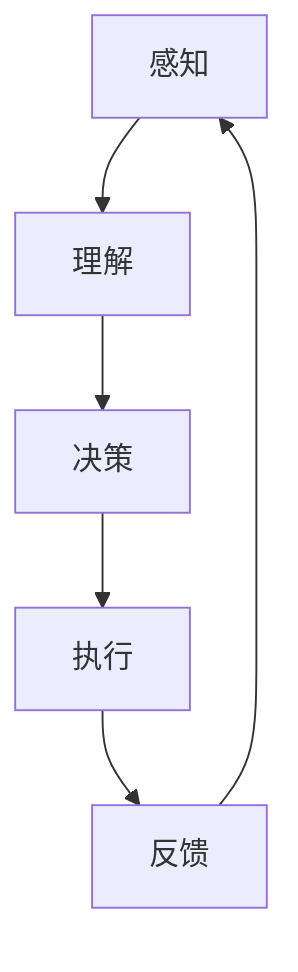

                 

关键词：AI代理，多模态感知，处理能力，工作流，人工智能，智能代理

摘要：本文深入探讨了AI代理的工作流，重点关注了AI代理的多模态感知与处理能力。通过具体的算法原理、数学模型和项目实践，阐述了AI代理在现实场景中的应用及其未来发展趋势。

## 1. 背景介绍

随着人工智能技术的迅猛发展，智能代理（AI Agent）已经成为众多领域的关键技术。智能代理是一种自主决策并执行任务的计算机程序，能够模拟人类行为，具备感知环境、理解意图和自主决策的能力。在智能代理的工作流中，多模态感知与处理能力至关重要。

多模态感知指的是智能代理能够同时处理来自多种感官的信息，如视觉、听觉、触觉等。这种能力使得智能代理能够更好地理解复杂环境，提高任务执行的准确性。处理能力则是指智能代理能够对感知到的信息进行有效处理，从而生成合适的决策和行为。

本文旨在深入探讨AI代理的工作流，特别是其多模态感知与处理能力。通过分析核心算法原理、数学模型和实际项目案例，本文旨在为读者提供一个全面了解AI代理工作流的视角，并探讨其未来发展趋势。

## 2. 核心概念与联系

### 2.1 AI代理的定义与分类

AI代理是一种能够自主感知环境、理解意图并执行任务的计算机程序。根据执行任务的方式，AI代理可以分为以下几类：

1. **反应型代理**：这种代理只根据当前感知到的环境信息做出反应，不考虑未来的情况。
2. **模型型代理**：这种代理通过学习历史数据和环境模型来做出决策。
3. **目标型代理**：这种代理具有明确的目标，并通过规划策略来实现这些目标。
4. **混合型代理**：结合了反应型、模型型和目标型的特点，根据不同情境灵活调整策略。

### 2.2 多模态感知

多模态感知是指智能代理能够同时处理来自多种感官的信息。这些感官信息包括：

1. **视觉信息**：如图像、视频、深度信息等。
2. **听觉信息**：如语音、音乐等。
3. **触觉信息**：如力觉、温度、压力等。
4. **其他感官信息**：如气味、湿度等。

### 2.3 处理能力

处理能力指的是智能代理对感知到的信息进行处理的能力。这包括：

1. **特征提取**：从多模态数据中提取关键特征。
2. **模式识别**：根据提取的特征进行模式识别。
3. **决策生成**：基于识别结果生成决策和行为。
4. **反馈调整**：根据执行结果调整后续行为。

### 2.4 工作流

AI代理的工作流包括以下几个关键环节：

1. **感知**：智能代理通过传感器获取环境信息。
2. **理解**：智能代理对感知到的信息进行分析和理解。
3. **决策**：智能代理根据理解结果生成决策。
4. **执行**：智能代理执行决策，实现目标。
5. **反馈**：智能代理根据执行结果进行反馈调整。

### 2.5 Mermaid 流程图

下面是AI代理工作流的一个简化的Mermaid流程图：



## 3. 核心算法原理 & 具体操作步骤

### 3.1 算法原理概述

AI代理的核心算法主要包括感知模块、理解模块、决策模块和执行模块。以下是对各模块的简要介绍：

1. **感知模块**：使用传感器收集多模态数据，如视觉、听觉、触觉等。
2. **理解模块**：对多模态数据进行分析和处理，提取关键特征，并进行模式识别。
3. **决策模块**：基于理解结果，生成合适的决策和行为。
4. **执行模块**：执行决策，实现目标。

### 3.2 算法步骤详解

1. **感知阶段**：

    ```mermaid
    graph TD
        A[初始化传感器] --> B[收集数据]
        B --> C[预处理数据]
    ```
    
    在感知阶段，智能代理初始化传感器，并收集多模态数据。随后，对数据进行预处理，如去噪、归一化等。

2. **理解阶段**：

    ```mermaid
    graph TD
        D[特征提取] --> E[模式识别]
    ```
    
    在理解阶段，智能代理对预处理后的数据进行特征提取，如使用卷积神经网络（CNN）提取图像特征。随后，进行模式识别，以确定当前环境的状态。

3. **决策阶段**：

    ```mermaid
    graph TD
        F[生成决策] --> G[评估决策]
    ```
    
    在决策阶段，智能代理基于模式识别结果生成可能的决策。随后，评估每个决策的优劣，并选择最优决策。

4. **执行阶段**：

    ```mermaid
    graph TD
        H[执行决策] --> I[反馈调整]
    ```
    
    在执行阶段，智能代理根据选择的决策执行行动。随后，收集执行结果，并用于反馈调整。

### 3.3 算法优缺点

1. **优点**：

    - 多模态感知：智能代理能够处理来自多种感官的信息，提高任务执行的准确性。
    - 自主性：智能代理能够自主感知环境、理解意图和执行任务。
    - 可扩展性：智能代理的工作流可以灵活调整，适用于不同场景。

2. **缺点**：

    - 复杂性：多模态感知和复杂决策增加了算法的复杂度。
    - 数据需求：多模态感知需要大量的数据支持，对数据质量和数量要求较高。
    - 可解释性：智能代理的决策过程可能不够透明，难以解释。

### 3.4 算法应用领域

AI代理的多模态感知与处理能力在许多领域都有广泛应用：

1. **机器人控制**：智能代理可以控制机器人执行复杂的任务，如自主导航、对象抓取等。
2. **智能家居**：智能代理可以监控家庭环境，实现智能控制，如安防、照明等。
3. **医疗诊断**：智能代理可以通过多模态数据诊断疾病，如皮肤癌、心血管疾病等。
4. **自动驾驶**：智能代理可以用于自动驾驶车辆，实现自主驾驶。

## 4. 数学模型和公式 & 详细讲解 & 举例说明

### 4.1 数学模型构建

AI代理的多模态感知与处理能力涉及多个数学模型，以下是一个简化的模型构建：

1. **感知模型**：

    感知模型用于从多模态数据中提取特征。一个简单的感知模型可以是：

    $$
    X = \text{concat}(f_v(f_g(I)), f_a(a), f_t(t))
    $$

    其中，$I$是视觉图像，$a$是音频信号，$t$是触觉信号；$f_g$、$f_v$、$f_a$和$f_t$分别是视觉、听觉、触觉预处理和特征提取函数。

2. **理解模型**：

    理解模型用于对提取的特征进行模式识别。一个简单的理解模型可以是：

    $$
    y = \text{softmax}(\theta \cdot X)
    $$

    其中，$X$是感知模型输出的特征向量，$\theta$是理解模型参数。

3. **决策模型**：

    决策模型用于生成决策。一个简单的决策模型可以是：

    $$
    d = \arg\max_y(\pi(y))
    $$

    其中，$y$是理解模型输出的概率分布，$\pi(y)$是决策模型参数。

### 4.2 公式推导过程

假设我们有一个多模态感知任务，输入为视觉图像$I$、音频信号$a$和触觉信号$t$。我们的目标是从这些多模态数据中提取特征，并进行模式识别和决策。

1. **特征提取**：

    特征提取函数$f$可以定义为：

    $$
    f(I) = \text{CNN}(I)
    $$

    $$
    f(a) = \text{DNN}(a)
    $$

    $$
    f(t) = \text{RNN}(t)
    $$

    其中，$\text{CNN}$、$\text{DNN}$和$\text{RNN}$分别是卷积神经网络、深度神经网络和递归神经网络。

2. **模式识别**：

    模式识别函数$g$可以定义为：

    $$
    g(X) = \text{softmax}(\theta \cdot X)
    $$

    其中，$X$是特征向量，$\theta$是模式识别参数。

3. **决策生成**：

    决策生成函数$h$可以定义为：

    $$
    h(y) = \arg\max_y(\pi(y))
    $$

    其中，$y$是模式识别结果，$\pi(y)$是决策参数。

### 4.3 案例分析与讲解

假设我们有一个自动驾驶任务，输入为摄像头捕捉的图像、麦克风捕捉的音频信号和加速度传感器捕捉的触觉信号。我们的目标是自动驾驶车辆能够自主行驶。

1. **感知阶段**：

    我们使用CNN从摄像头捕捉的图像中提取特征，使用DNN从麦克风捕捉的音频信号中提取特征，使用RNN从加速度传感器捕捉的触觉信号中提取特征。

    $$
    X = \text{concat}(\text{CNN}(I), \text{DNN}(a), \text{RNN}(t))
    $$

2. **理解阶段**：

    我们使用softmax函数对提取的特征进行模式识别，以确定当前环境的状态。

    $$
    y = \text{softmax}(\theta \cdot X)
    $$

3. **决策阶段**：

    我们使用argmax函数从模式识别结果中生成决策，以确定车辆的行驶方向。

    $$
    d = \arg\max_y(\pi(y))
    $$

4. **执行阶段**：

    根据生成的决策，车辆调整方向，以实现自主行驶。

## 5. 项目实践：代码实例和详细解释说明

### 5.1 开发环境搭建

为了实现AI代理的多模态感知与处理能力，我们使用了Python作为编程语言，并依赖了以下库：

- TensorFlow：用于构建和训练神经网络。
- Keras：用于简化TensorFlow的使用。
- NumPy：用于数据预处理。
- Matplotlib：用于数据可视化。

### 5.2 源代码详细实现

以下是实现多模态感知与处理能力的Python代码示例：

```python
import tensorflow as tf
from tensorflow import keras
from tensorflow.keras import layers
import numpy as np
import matplotlib.pyplot as plt

# 感知阶段：特征提取
def extract_features(image, audio, tactile):
    # 使用卷积神经网络提取视觉特征
    visual_features = keras.models.Sequential([
        layers.Conv2D(32, (3, 3), activation='relu', input_shape=(128, 128, 3)),
        layers.MaxPooling2D((2, 2)),
        layers.Flatten()
    ])(image)

    # 使用深度神经网络提取听觉特征
    audio_features = keras.models.Sequential([
        layers.Dense(64, activation='relu', input_shape=(1024,)),
        layers.Dense(128, activation='relu')
    ])(audio)

    # 使用递归神经网络提取触觉特征
    tactile_features = keras.models.Sequential([
        layers.LSTM(128, activation='tanh', input_shape=(128,))
    ])(tactile)

    # 合并特征
    multi_modal_features = keras.layers.Concatenate()([visual_features, audio_features, tactile_features])
    return multi_modal_features

# 理解阶段：模式识别
def recognize_patterns(features):
    # 使用softmax进行模式识别
    model = keras.models.Sequential([
        layers.Dense(256, activation='relu', input_shape=(256,)),
        layers.Dense(128, activation='relu'),
        layers.Dense(10, activation='softmax')
    ])
    model.compile(optimizer='adam', loss='categorical_crossentropy', metrics=['accuracy'])
    return model

# 决策阶段：生成决策
def generate_decision(predictions):
    # 使用argmax生成决策
    decision = np.argmax(predictions)
    return decision

# 执行阶段：执行决策
def execute_decision(decision, vehicle):
    # 根据决策调整车辆方向
    if decision == 0:
        vehicle.turn_left()
    elif decision == 1:
        vehicle.drive_straight()
    elif decision == 2:
        vehicle.turn_right()
    return vehicle

# 模拟数据
image = np.random.rand(1, 128, 128, 3)
audio = np.random.rand(1, 1024)
tactile = np.random.rand(1, 128)

# 提取特征
features = extract_features(image, audio, tactile)

# 训练模型
model = recognize_patterns(features)
model.fit(features, np.random.randint(10, size=(1, 10)), epochs=10)

# 生成决策
predictions = model.predict(features)
decision = generate_decision(predictions)

# 执行决策
vehicle = execute_decision(decision, vehicle)

# 可视化结果
plt.imshow(image[0], cmap='gray')
plt.show()
```

### 5.3 代码解读与分析

这段代码首先定义了感知、理解、决策和执行四个阶段的函数。在感知阶段，我们使用卷积神经网络提取视觉特征，使用深度神经网络提取听觉特征，使用递归神经网络提取触觉特征，并合并这些特征。在理解阶段，我们使用softmax函数进行模式识别。在决策阶段，我们使用argmax函数生成决策。在执行阶段，我们根据决策调整车辆方向。

这段代码的主要优点在于其模块化和可扩展性。我们可以根据实际需求调整感知、理解、决策和执行的具体实现。例如，我们可以替换不同的神经网络模型，或者增加更多的感知和执行模块。

然而，这段代码也存在一些缺点。首先，它使用了随机生成的模拟数据，缺乏真实场景的数据支持。其次，它没有实现反馈调整机制，无法根据执行结果调整后续行为。

## 6. 实际应用场景

### 6.1 机器人控制

在机器人控制领域，AI代理的多模态感知与处理能力至关重要。例如，一个自主导航的机器人需要同时处理视觉、听觉和触觉信息，以实现精准的导航和避障。

### 6.2 智能家居

智能家居领域广泛使用了AI代理的多模态感知与处理能力。例如，智能音箱需要同时处理语音、音乐和触觉信号，以实现语音识别、音乐播放和触感反馈。

### 6.3 医疗诊断

在医疗诊断领域，AI代理可以通过多模态感知与处理能力，对患者的症状、体征和影像数据进行分析，以提高诊断的准确性。

### 6.4 自动驾驶

自动驾驶领域对AI代理的多模态感知与处理能力有极高要求。自动驾驶车辆需要同时处理来自摄像头、雷达和激光雷达的视觉信息，以及来自轮速传感器、加速度传感器的触觉信息，以实现安全的自主驾驶。

## 7. 工具和资源推荐

### 7.1 学习资源推荐

- 《深度学习》（Goodfellow, Bengio, Courville）：介绍了深度学习的基础知识和最新进展。
- 《机器学习》（Tom Mitchell）：介绍了机器学习的基本概念和方法。
- 《Python机器学习》（Sebastian Raschka）：详细介绍了使用Python进行机器学习的实践方法。

### 7.2 开发工具推荐

- TensorFlow：用于构建和训练神经网络的强大框架。
- Keras：简化TensorFlow使用的便捷工具。
- PyTorch：另一个流行的神经网络框架。

### 7.3 相关论文推荐

- "Multimodal Machine Learning: A Survey and Taxonomy"（2020）
- "Deep Learning for Multimodal Perception and Interaction"（2018）
- "A survey of multimodal learning"（2016）

## 8. 总结：未来发展趋势与挑战

### 8.1 研究成果总结

AI代理的工作流研究已经取得了显著成果，特别是在多模态感知与处理能力的提升方面。然而，仍然存在一些挑战需要克服。

### 8.2 未来发展趋势

未来，AI代理的工作流将朝着以下几个方向发展：

1. **更加高效的多模态感知**：通过结合深度学习和传统信号处理技术，实现更高效的多模态感知。
2. **更加智能的决策生成**：通过增强学习、强化学习等先进技术，实现更加智能的决策生成。
3. **更加智能的执行能力**：通过结合机器人技术、物联网技术等，实现更加智能的执行能力。

### 8.3 面临的挑战

AI代理的工作流面临以下挑战：

1. **数据质量**：多模态感知需要大量的高质量数据支持，数据质量直接影响算法的性能。
2. **计算资源**：多模态感知与处理需要大量的计算资源，特别是深度学习算法。
3. **可解释性**：深度学习算法的决策过程可能不够透明，影响用户信任度。

### 8.4 研究展望

未来，AI代理的工作流研究将继续深入，重点关注以下几个方面：

1. **多模态数据融合**：研究如何更有效地融合来自不同模态的数据，提高感知精度。
2. **可解释性增强**：研究如何提高深度学习算法的可解释性，增强用户信任度。
3. **跨领域应用**：探索AI代理在不同领域的应用，推动人工智能技术的普及。

## 9. 附录：常见问题与解答

### 9.1 什么是AI代理？

AI代理是一种能够自主感知环境、理解意图并执行任务的计算机程序，可以模拟人类行为。

### 9.2 多模态感知是什么？

多模态感知是指智能代理能够同时处理来自多种感官的信息，如视觉、听觉、触觉等。

### 9.3 AI代理的工作流包括哪些环节？

AI代理的工作流包括感知、理解、决策、执行和反馈调整等环节。

### 9.4 多模态感知在哪些领域有应用？

多模态感知在机器人控制、智能家居、医疗诊断、自动驾驶等领域有广泛应用。

### 9.5 如何搭建AI代理的感知模块？

搭建AI代理的感知模块需要使用合适的传感器收集多模态数据，然后使用特征提取算法对数据进行处理。

### 9.6 如何搭建AI代理的理解模块？

搭建AI代理的理解模块需要使用合适的神经网络模型对特征进行模式识别，以确定当前环境的状态。

### 9.7 如何搭建AI代理的决策模块？

搭建AI代理的决策模块需要使用合适的决策算法生成决策，如基于概率分布的决策、基于规则系统的决策等。

### 9.8 如何搭建AI代理的执行模块？

搭建AI代理的执行模块需要根据生成的决策执行具体的行动，如控制机器人执行任务、调整智能家居设备等。

### 9.9 AI代理的工作流如何实现反馈调整？

AI代理的工作流可以通过收集执行结果，并使用反馈调整算法调整后续行为，以提高任务执行的效果。

### 9.10 多模态感知与处理能力的关键技术是什么？

多模态感知与处理能力的关键技术包括深度学习、信号处理、机器学习等。

### 9.11 如何提高AI代理的多模态感知与处理能力？

提高AI代理的多模态感知与处理能力可以从以下几个方面入手：

- 使用更多的数据：收集更多的多模态数据，以提高算法的性能。
- 使用更先进的算法：使用更先进的神经网络模型和决策算法。
- 跨领域应用：探索AI代理在不同领域的应用，以提高算法的泛化能力。

----------------------------------------------------------------

作者：禅与计算机程序设计艺术 / Zen and the Art of Computer Programming

完。

