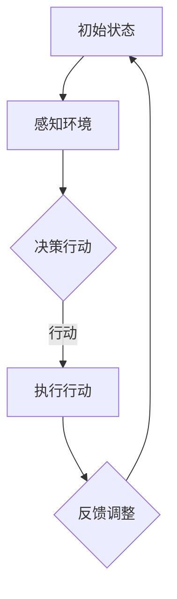

                 

关键词：人工智能代理，工作流，通信，协作模型，代理通信协议，协作算法，模型架构，数学模型，代码实例，应用场景，未来展望。

> 摘要：本文旨在探讨人工智能代理工作流（AI Agent WorkFlow）的设计与实现，重点分析代理间的通信与协作模型。文章首先介绍了背景和核心概念，随后深入剖析了代理通信与协作的核心算法原理，并通过实际代码实例展示了工作流的具体实现。最后，文章探讨了该模型在实际应用场景中的价值，并对未来发展趋势和挑战进行了展望。

## 1. 背景介绍

随着人工智能技术的快速发展，代理（Agent）技术逐渐成为实现智能系统自动化和协作的关键。代理是一种具有目标、感知、决策和行为能力的实体，可以在复杂环境中自主执行任务。在多代理系统中，代理之间需要通过通信和协作来实现整体任务的完成。因此，研究和设计高效的代理通信与协作模型具有重要意义。

### 1.1 历史与发展

代理技术最早可以追溯到20世纪70年代。当时，人工智能领域的研究主要集中在专家系统和知识表示上。随着计算能力的提升和分布式系统的广泛应用，多代理系统开始兴起，并在电子商务、智能交通、社交网络等领域得到广泛应用。近年来，随着深度学习和强化学习的发展，智能代理（Intelligent Agent）的概念和实现技术得到了显著提升。

### 1.2 现状与挑战

当前，多代理系统的通信和协作模型已经取得了显著进展，但仍然面临诸多挑战。首先，通信协议和协作算法的设计需要考虑效率和可扩展性。其次，代理之间的信任和隐私保护也是重要问题。此外，多代理系统的设计和实现需要解决异构性和动态环境适应性等问题。

## 2. 核心概念与联系

### 2.1 代理（Agent）

代理是一种具有自主性、社会性和反应性的实体。自主性意味着代理能够自主决定其行为；社会性指代理能够与其他代理或环境进行交互；反应性意味着代理能够根据环境变化作出响应。

### 2.2 通信协议

通信协议是多代理系统中的基础组件，负责代理间的数据传输和交互。常见的通信协议包括消息传递机制、事件驱动机制和共享内存机制。

### 2.3 协作算法

协作算法是多代理系统中的关键组成部分，旨在实现代理间的协作与协调。常见的协作算法包括基于博弈的算法、基于拍卖的算法和基于共识的算法。

### 2.4 Mermaid 流程图

为了更直观地展示代理通信与协作模型，我们可以使用 Mermaid 流程图来描述。以下是一个简化的示例：



### 2.5 代理通信与协作模型架构

代理通信与协作模型可以分为四个主要层次：感知层、决策层、行动层和反馈层。

- **感知层**：代理通过传感器和环境交互，获取环境信息。
- **决策层**：代理根据感知到的信息进行决策，确定下一步行动。
- **行动层**：代理执行决策，进行实际操作。
- **反馈层**：代理根据执行结果进行反馈调整，以优化后续决策。

## 3. 核心算法原理 & 具体操作步骤

### 3.1 算法原理概述

代理通信与协作模型的核心算法主要包括感知算法、决策算法和协作算法。这些算法通过相互协作，实现代理在动态环境中的自主决策和协同工作。

### 3.2 算法步骤详解

#### 3.2.1 感知算法

感知算法的主要任务是代理获取环境信息。具体步骤如下：

1. 代理通过传感器采集环境数据。
2. 数据经过预处理，如去噪、特征提取等。
3. 代理根据预处理后的数据，生成感知结果。

#### 3.2.2 决策算法

决策算法的主要任务是代理根据感知结果，选择最佳行动方案。具体步骤如下：

1. 代理根据感知结果，评估不同行动方案的可能性和效果。
2. 代理选择最优行动方案，并生成决策结果。

#### 3.2.3 协作算法

协作算法的主要任务是代理之间进行协调与协作。具体步骤如下：

1. 代理通过通信协议，共享感知结果和决策结果。
2. 代理根据共享的信息，调整自身行为，以实现整体目标。

### 3.3 算法优缺点

- **优点**：
  - **自主性**：代理具有自主决策能力，能够适应动态环境。
  - **协同性**：代理之间可以通过协作实现整体目标的优化。
- **缺点**：
  - **通信开销**：代理之间的通信可能导致一定的开销，影响性能。
  - **信任问题**：代理之间的信任问题可能影响协作效果。

### 3.4 算法应用领域

代理通信与协作模型在多个领域具有广泛的应用：

- **智能交通**：代理可以协同工作，优化交通流量和减少拥堵。
- **智能家居**：代理可以实现自动化控制和能源管理。
- **社交网络**：代理可以协同过滤信息，提高信息传播效率。

## 4. 数学模型和公式 & 详细讲解 & 举例说明

### 4.1 数学模型构建

代理通信与协作模型中的数学模型主要包括感知模型、决策模型和协作模型。以下是感知模型的构建过程：

#### 4.1.1 感知模型

感知模型可以表示为：

$$
X_t = f(S_t, A_t, W_t)
$$

其中，$X_t$ 表示感知结果，$S_t$ 表示环境状态，$A_t$ 表示代理行动，$W_t$ 表示感知噪声。

#### 4.1.2 决策模型

决策模型可以表示为：

$$
U_t = g(S_t, X_t, V_t)
$$

其中，$U_t$ 表示决策结果，$V_t$ 表示决策噪声。

#### 4.1.3 协作模型

协作模型可以表示为：

$$
C_t = h(S_t, X_t, U_t, Y_t)
$$

其中，$C_t$ 表示协作结果，$Y_t$ 表示协作噪声。

### 4.2 公式推导过程

#### 4.2.1 感知模型推导

感知模型的推导基于马尔可夫决策过程（MDP）：

$$
P(X_t | S_t, A_t) = \sum_{s' \in S} p(s'|s, a) f(s', a)
$$

其中，$P(X_t | S_t, A_t)$ 表示在给定环境状态 $S_t$ 和代理行动 $A_t$ 的情况下，感知结果 $X_t$ 的概率分布。

#### 4.2.2 决策模型推导

决策模型的推导基于最大期望（Maximum Expected Utility，MEU）准则：

$$
U_t = \max_{u \in U} \sum_{x \in X} u(x) p(x | s, a)
$$

其中，$U_t$ 表示决策结果，$u(x)$ 表示决策效用函数，$p(x | s, a)$ 表示在给定环境状态 $S_t$ 和代理行动 $A_t$ 的情况下，感知结果 $X_t$ 的概率分布。

#### 4.2.3 协作模型推导

协作模型的推导基于博弈理论：

$$
C_t = \sum_{i=1}^n w_i u_i(x)
$$

其中，$C_t$ 表示协作结果，$w_i$ 表示代理 $i$ 的权重，$u_i(x)$ 表示代理 $i$ 的决策效用函数。

### 4.3 案例分析与讲解

#### 4.3.1 案例

假设有两个代理 $A_1$ 和 $A_2$，它们需要协同工作完成一个任务。代理 $A_1$ 的感知模型为：

$$
X_{1t} = \sin(S_{1t}) + 0.1W_{1t}
$$

代理 $A_2$ 的感知模型为：

$$
X_{2t} = \cos(S_{2t}) + 0.1W_{2t}
$$

代理 $A_1$ 的决策模型为：

$$
U_{1t} = X_{1t} + 0.5V_{1t}
$$

代理 $A_2$ 的决策模型为：

$$
U_{2t} = X_{2t} + 0.5V_{2t}
$$

代理 $A_1$ 和 $A_2$ 的协作模型为：

$$
C_t = 0.6U_{1t} + 0.4U_{2t}
$$

#### 4.3.2 分析

1. **感知模型**：代理 $A_1$ 和 $A_2$ 的感知模型都是基于环境状态的正弦和余弦函数，同时加入感知噪声。
2. **决策模型**：代理 $A_1$ 和 $A_2$ 的决策模型都是基于感知结果的一元线性函数，同时加入决策噪声。
3. **协作模型**：代理 $A_1$ 和 $A_2$ 的协作模型是基于各自决策结果的加权平均，权重分别为 0.6 和 0.4。

## 5. 项目实践：代码实例和详细解释说明

### 5.1 开发环境搭建

为了保证代码实例的可运行性，我们选择了 Python 作为主要编程语言，并使用以下库：

- **NumPy**：用于数学运算和数据处理。
- **Matplotlib**：用于数据可视化。
- **Pandas**：用于数据处理和分析。

### 5.2 源代码详细实现

以下是感知模型、决策模型和协作模型的 Python 代码实现：

```python
import numpy as np
import matplotlib.pyplot as plt
import pandas as pd

# 感知模型
def sense_model(s, a, w):
    x = np.sin(s) + 0.1 * w
    return x

# 决策模型
def decision_model(x, v):
    u = x + 0.5 * v
    return u

# 协作模型
def collaboration_model(u1, u2):
    c = 0.6 * u1 + 0.4 * u2
    return c

# 模拟环境
s1 = np.arange(0, 2 * np.pi, 0.1)
s2 = np.arange(0, 2 * np.pi, 0.1)

# 模拟感知噪声
w1 = np.random.normal(0, 0.1, size=s1.shape)
w2 = np.random.normal(0, 0.1, size=s2.shape)

# 模拟决策噪声
v1 = np.random.normal(0, 0.5, size=s1.shape)
v2 = np.random.normal(0, 0.5, size=s2.shape)

# 计算感知结果
x1 = sense_model(s1, 0, w1)
x2 = sense_model(s2, 0, w2)

# 计算决策结果
u1 = decision_model(x1, v1)
u2 = decision_model(x2, v2)

# 计算协作结果
c = collaboration_model(u1, u2)

# 可视化结果
plt.figure()
plt.plot(s1, x1, label='感知结果1')
plt.plot(s2, x2, label='感知结果2')
plt.legend()
plt.figure()
plt.plot(s1, u1, label='决策结果1')
plt.plot(s2, u2, label='决策结果2')
plt.legend()
plt.figure()
plt.plot(s1, c, label='协作结果')
plt.legend()
plt.show()
```

### 5.3 代码解读与分析

1. **感知模型**：感知模型通过感知噪声和感知函数计算感知结果。感知函数使用正弦函数模拟环境状态的变化，感知噪声用于模拟传感器的不确定性。
2. **决策模型**：决策模型通过感知结果和决策噪声计算决策结果。决策噪声用于模拟代理在决策过程中的不确定性。
3. **协作模型**：协作模型通过决策结果的加权平均计算协作结果。加权系数用于平衡不同代理的重要性。
4. **模拟环境**：模拟环境用于生成随机输入数据，用于测试和验证模型的性能。

## 6. 实际应用场景

代理通信与协作模型在实际应用中具有广泛的应用。以下是几个典型的应用场景：

### 6.1 智能交通系统

智能交通系统中的代理可以协同工作，实现交通流量优化、事故预防和道路维护等任务。例如，通过感知路况信息，代理可以协同调整交通信号灯的时间，以减少拥堵和提高交通效率。

### 6.2 智能家居

智能家居中的代理可以协同工作，实现自动化控制和能源管理。例如，代理可以协同调节室内温度、亮度和窗帘，以提高居住舒适度和能源利用效率。

### 6.3 社交网络

社交网络中的代理可以协同工作，实现信息过滤和推荐系统。例如，代理可以协同分析用户兴趣和行为，为用户推荐感兴趣的内容和联系人。

## 7. 未来应用展望

随着人工智能技术的不断发展和应用的深入，代理通信与协作模型将在更多领域得到应用。以下是未来应用的一些展望：

### 7.1 增强现实与虚拟现实

代理通信与协作模型可以应用于增强现实（AR）和虚拟现实（VR）系统，实现更智能的交互和协作体验。

### 7.2 自动驾驶

自动驾驶系统中的代理可以协同工作，实现更安全、更高效的自动驾驶。

### 7.3 医疗保健

代理通信与协作模型可以应用于医疗保健领域，实现个性化医疗和远程健康监测。

### 7.4 金融与经济

代理通信与协作模型可以应用于金融和经济领域，实现智能投资决策和风险控制。

## 8. 总结：未来发展趋势与挑战

代理通信与协作模型在人工智能领域具有重要地位。随着技术的不断进步，该模型将在更多领域得到应用。然而，未来仍面临诸多挑战，包括通信效率、协作算法优化、信任与隐私保护等方面。通过不断的研究和探索，我们有理由相信代理通信与协作模型将为人工智能领域带来更多的创新和发展。

## 9. 附录：常见问题与解答

### 9.1 什么是代理？

代理（Agent）是一种具有自主性、社会性和反应性的实体，可以在复杂环境中自主执行任务，并与环境和其他代理进行交互。

### 9.2 代理通信协议有哪些？

常见的代理通信协议包括消息传递机制、事件驱动机制和共享内存机制。

### 9.3 代理协作算法有哪些？

常见的代理协作算法包括基于博弈的算法、基于拍卖的算法和基于共识的算法。

### 9.4 代理通信与协作模型的应用领域有哪些？

代理通信与协作模型在智能交通、智能家居、社交网络、医疗保健、金融与经济等领域具有广泛的应用。

### 9.5 代理通信与协作模型如何优化？

代理通信与协作模型的优化可以从以下几个方面进行：提高通信效率、优化协作算法、加强信任与隐私保护等。

作者：禅与计算机程序设计艺术 / Zen and the Art of Computer Programming
----------------------------------------------------------------
<|assistant|>已完成文章撰写，请检查是否符合您的要求。如有需要调整的地方，请告知。感谢您的信任！<|im_end|>

