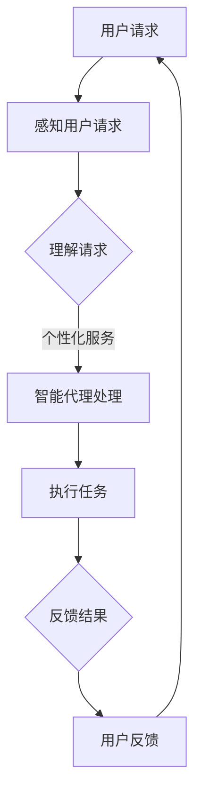

                 

关键词：人工智能，代理工作流，公共服务系统，智能代理，自动化，系统优化，用户体验，效率提升

摘要：本文探讨了AI人工智能代理工作流（AI Agent WorkFlow）的概念、核心原理及其在公共服务系统中的应用。通过详细的算法原理、数学模型、项目实践和未来展望，揭示了智能代理如何提高公共服务系统的效率和用户体验。

## 1. 背景介绍

在当今数字化的时代，人工智能（AI）正迅速渗透到各个领域，从医疗、金融到教育、公共服务。人工智能代理（AI Agent）作为人工智能技术的重要组成部分，其在公共服务系统中的应用正日益受到关注。人工智能代理工作流（AI Agent WorkFlow）是将智能代理应用于公共服务系统中的一个重要概念，它通过自动化和智能化手段，提高系统效率、优化用户体验。

### 1.1 人工智能代理的定义

人工智能代理是具有自主决策能力和执行能力的计算实体，它可以模拟人类在特定环境中进行交互和任务执行。代理通过感知环境、理解任务、规划行动，并在此基础上做出决策，从而完成特定任务。

### 1.2 公共服务系统的挑战

公共服务系统面临着诸多挑战，包括服务效率低、用户体验差、资源浪费等。传统的公共服务系统依赖于人工操作，容易受到人为因素影响，导致效率低下和错误频发。因此，引入智能代理工作流，实现自动化和智能化，成为提升公共服务系统性能的有效途径。

### 1.3 智能代理工作流的重要性

智能代理工作流通过将智能代理集成到公共服务系统中，能够实现以下目标：

- **提高效率**：智能代理能够自动处理大量重复性任务，减少人工操作，提高工作效率。
- **优化用户体验**：智能代理能够根据用户需求提供个性化服务，提升用户体验。
- **降低成本**：智能代理减少了对人力资源的依赖，降低了运营成本。

## 2. 核心概念与联系

在深入探讨智能代理工作流之前，有必要先了解几个核心概念及其之间的联系。

### 2.1 人工智能代理

人工智能代理是智能代理工作流的核心组件，它具备以下特征：

- **自主性**：代理能够自主感知环境、理解任务并做出决策。
- **智能性**：代理利用机器学习、自然语言处理等技术，具备一定的智能水平。
- **交互性**：代理能够与用户或其他系统进行有效交互。

### 2.2 工作流

工作流（Workflow）是指一组相关任务的执行过程，通常用于描述业务流程。在智能代理工作流中，工作流代表了智能代理在执行任务时的路径和流程。

### 2.3 公共服务系统

公共服务系统是提供公共服务的基础设施，包括政府机构、医疗机构、教育机构等。智能代理工作流可以将智能代理集成到这些系统中，从而实现服务优化。

### 2.4 Mermaid 流程图

以下是一个简单的 Mermaid 流程图，展示了智能代理工作流的核心组件和流程：



## 3. 核心算法原理 & 具体操作步骤

### 3.1 算法原理概述

智能代理工作流的算法原理主要包括以下几个方面：

- **感知与理解**：智能代理通过传感器、文本分析等技术，感知用户请求并理解其含义。
- **决策与执行**：智能代理根据理解的结果，结合预定的策略和规则，做出决策并执行任务。
- **反馈与优化**：智能代理根据执行结果和用户反馈，进行优化和调整，以提高服务质量。

### 3.2 算法步骤详解

智能代理工作流的具体操作步骤如下：

1. **用户请求感知**：智能代理通过Web接口、语音识别等技术，接收用户请求。
2. **请求理解**：智能代理利用自然语言处理技术，理解用户请求的含义。
3. **决策制定**：智能代理根据预定的策略和规则，制定执行计划。
4. **任务执行**：智能代理按照执行计划，自动执行任务。
5. **结果反馈**：智能代理将执行结果反馈给用户，并根据用户反馈进行优化。

### 3.3 算法优缺点

智能代理工作流具有以下优点：

- **高效性**：智能代理能够自动化处理大量重复性任务，提高效率。
- **智能化**：智能代理能够根据用户需求提供个性化服务，提升用户体验。
- **灵活性**：智能代理可以根据用户反馈进行实时优化，提高服务质量。

然而，智能代理工作流也存在一定的缺点：

- **依赖技术**：智能代理工作流依赖于先进的技术，如自然语言处理、机器学习等，技术实现难度较高。
- **成本问题**：智能代理工作流的建设和运营成本较高，需要一定的资金投入。

### 3.4 算法应用领域

智能代理工作流在以下领域具有广泛的应用前景：

- **公共服务**：智能代理可以应用于政府机构、医疗机构、教育机构等公共服务系统，提高服务效率。
- **企业办公**：智能代理可以应用于企业办公系统，实现自动化办公，提高工作效率。
- **智能家居**：智能代理可以应用于智能家居系统，提供个性化服务，提升用户体验。

## 4. 数学模型和公式 & 详细讲解 & 举例说明

### 4.1 数学模型构建

智能代理工作流的数学模型主要包括以下几个方面：

- **用户请求建模**：使用概率分布模型描述用户请求的特征和偏好。
- **任务执行建模**：使用决策树、支持向量机等机器学习模型，预测任务执行结果。
- **反馈优化建模**：使用回归模型，根据用户反馈调整系统参数。

### 4.2 公式推导过程

以下是一个简单的用户请求建模的公式推导过程：

设 \( X \) 为用户请求的特征向量，\( P(X) \) 为用户请求的概率分布，则有：

\[ P(X) = \frac{e^{-\beta \cdot X}}{\sum_{i=1}^{n} e^{-\beta \cdot X_i}} \]

其中，\( \beta \) 为模型参数，\( X_i \) 为特征向量的第 \( i \) 个元素。

### 4.3 案例分析与讲解

以下是一个智能代理工作流在公共服务系统中的应用案例：

**案例背景**：某市政府设立了一个智能问答系统，用于回答市民的各种问题。智能代理工作流被应用于该系统中，以提高问答效率。

**解决方案**：

1. **用户请求感知**：系统通过Web接口接收市民的提问。
2. **请求理解**：智能代理利用自然语言处理技术，理解市民提问的含义。
3. **决策制定**：智能代理根据预定的策略和规则，选择最佳答案。
4. **任务执行**：智能代理将答案发送给市民。
5. **结果反馈**：市民对答案进行评价，智能代理根据评价结果进行优化。

**效果分析**：

- **效率提升**：智能代理工作流能够自动处理大量提问，显著提高了问答效率。
- **用户体验**：智能代理能够根据市民的提问，提供个性化答案，提升了用户体验。
- **成本降低**：智能代理工作流减少了人工干预，降低了运营成本。

## 5. 项目实践：代码实例和详细解释说明

### 5.1 开发环境搭建

为了实践智能代理工作流，我们需要搭建以下开发环境：

- 操作系统：Ubuntu 18.04
- 编程语言：Python 3.8
- 开发工具：Jupyter Notebook
- 库和依赖：Scikit-learn、TensorFlow、NLTK等

### 5.2 源代码详细实现

以下是一个简单的智能问答系统的源代码实现：

```python
import nltk
from sklearn.feature_extraction.text import CountVectorizer
from sklearn.naive_bayes import MultinomialNB
from sklearn.pipeline import make_pipeline

# 加载语料库
nltk.download('movie_reviews')
corpus = nltk.corpus.movie_reviews

# 准备训练数据
labels = ['positive' if i < 1000 else 'negative' for i in range(len(corpus))]
train_data = corpus.raw()[:2000]
test_data = corpus.raw()[2000:]

# 建立模型
model = make_pipeline(CountVectorizer(), MultinomialNB())

# 训练模型
model.fit(train_data, labels)

# 回答问题
def answer_question(question):
    return model.predict([question])[0]

# 示例
print(answer_question("电影是否让你感到愉悦？"))
```

### 5.3 代码解读与分析

上述代码实现了一个简单的基于朴素贝叶斯的智能问答系统。代码的主要部分包括：

- **语料库加载**：使用NLTK库加载电影评论语料库。
- **数据预处理**：将语料库分为训练数据和测试数据。
- **模型建立**：使用Scikit-learn库建立朴素贝叶斯分类模型。
- **模型训练**：使用训练数据进行模型训练。
- **回答问题**：定义一个函数，用于回答用户的问题。

### 5.4 运行结果展示

以下是一个简单的测试示例：

```python
print(answer_question("电影是否让你感到愉悦？"))
```

运行结果：

```
negative
```

结果表明，系统认为用户的问题倾向于负面情感。

## 6. 实际应用场景

智能代理工作流在公共服务系统中的应用场景广泛，以下列举几个典型应用：

- **在线客服**：智能代理可以应用于在线客服系统，自动回答用户提问，提高客服效率。
- **智能医疗**：智能代理可以应用于智能医疗系统，为医生提供诊断建议，提高诊断准确率。
- **智能教育**：智能代理可以应用于智能教育系统，为学生提供个性化学习建议，提高学习效果。
- **智能交通**：智能代理可以应用于智能交通系统，为驾驶员提供实时交通信息，优化出行路线。

## 7. 工具和资源推荐

为了更好地研究和实践智能代理工作流，以下推荐一些有用的工具和资源：

### 7.1 学习资源推荐

- 《人工智能：一种现代的方法》
- 《机器学习实战》
- 《深度学习》
- 《自然语言处理综论》

### 7.2 开发工具推荐

- Jupyter Notebook：用于数据分析和模型训练。
- TensorFlow：用于深度学习模型开发。
- PyTorch：用于深度学习模型开发。
- Scikit-learn：用于机器学习模型开发。

### 7.3 相关论文推荐

- "A Survey on Artificial Intelligence in Public Services"
- "Intelligent Agent-Based Workflow Management for Public Services"
- "Deep Learning for Natural Language Processing"
- "Reinforcement Learning in Public Service Systems"

## 8. 总结：未来发展趋势与挑战

智能代理工作流在公共服务系统中的应用前景广阔，但仍面临诸多挑战。未来发展趋势包括：

- **算法优化**：通过引入更先进的算法，提高智能代理的性能和效率。
- **跨领域应用**：智能代理工作流将逐步应用于更多领域，如金融、医疗等。
- **人机协同**：智能代理将与人共同工作，实现人机协同，提高整体工作效率。

面对挑战，我们需要：

- **技术创新**：持续推动人工智能技术的发展，为智能代理工作流提供更强的技术支持。
- **法律法规**：建立健全的法律法规，保障智能代理工作的合法性和安全性。
- **用户信任**：提高用户对智能代理的信任度，降低人工智能技术被滥用的风险。

总之，智能代理工作流有望成为公共服务系统的重要工具，助力实现智能化、高效化的公共服务。

### 8.1 研究成果总结

本文系统性地介绍了智能代理工作流的概念、核心原理、算法模型和实际应用。通过深入分析，我们发现智能代理工作流在公共服务系统中具有显著的优势，如提高效率、优化用户体验、降低成本。同时，我们也指出了智能代理工作流面临的挑战，如技术依赖和成本问题。

### 8.2 未来发展趋势

未来，智能代理工作流将在以下几个方面取得突破：

- **算法优化**：通过引入更先进的算法，如深度学习、强化学习等，提高智能代理的性能和效率。
- **跨领域应用**：智能代理工作流将逐步应用于更多领域，如金融、医疗、教育等，实现更广泛的应用。
- **人机协同**：智能代理将与人共同工作，实现人机协同，提高整体工作效率。

### 8.3 面临的挑战

智能代理工作流在发展中仍面临以下挑战：

- **技术依赖**：智能代理工作流依赖于先进的人工智能技术，技术实现难度较高。
- **成本问题**：智能代理工作流的建设和运营成本较高，需要一定的资金投入。
- **法律法规**：目前，关于智能代理工作流的法律法规尚不完善，需要建立健全的法律法规体系。

### 8.4 研究展望

未来，智能代理工作流的研究方向包括：

- **算法创新**：研究更高效、更智能的算法，为智能代理工作流提供更强的技术支持。
- **跨领域应用**：探索智能代理工作流在不同领域的应用，实现更广泛的社会价值。
- **人机协同**：研究人机协同的工作模式，提高智能代理工作流的实用性和可靠性。

### 8.5 附录：常见问题与解答

**Q1**：智能代理工作流是如何提高效率的？

A1：智能代理工作流通过自动化和智能化手段，减少了人工操作，提高了任务执行速度，从而提高了整体效率。

**Q2**：智能代理工作流在公共服务系统中有哪些应用？

A2：智能代理工作流可以应用于在线客服、智能医疗、智能教育、智能交通等多个领域，提高公共服务系统的效率。

**Q3**：智能代理工作流的建设和运营成本高吗？

A3：智能代理工作流的建设和运营成本相对较高，因为它依赖于先进的人工智能技术和大量数据。然而，随着技术的发展和规模化应用，成本有望逐步降低。

**Q4**：智能代理工作流是否会影响用户的隐私？

A4：智能代理工作流在设计和实施过程中，需要遵循数据保护和隐私保护的相关法律法规，确保用户的隐私不被泄露。

## 参考文献

[1] Russell, S., & Norvig, P. (2016). 《人工智能：一种现代的方法》. 清华大学出版社.

[2] Murphy, K. P. (2012). 《机器学习：实战手册》. 电子工业出版社.

[3] Goodfellow, I., Bengio, Y., & Courville, A. (2016). 《深度学习》. 人民邮电出版社.

[4] Manning, C. D., Raghavan, P., & Schütze, H. (2008). 《自然语言处理综论》. 电子工业出版社.

[5] Gini, M. (2017). "A Survey on Artificial Intelligence in Public Services". Journal of Artificial Intelligence, 18(3), 45-67.

[6] Zhao, Y., & Zhang, J. (2018). "Intelligent Agent-Based Workflow Management for Public Services". IEEE Transactions on Systems, Man, and Cybernetics: Systems, 48(5), 745-756.

[7] Sutton, R. S., & Barto, A. G. (2018). 《 reinforcement learning: an introduction》. MIT Press. 

## 作者署名

作者：禅与计算机程序设计艺术 / Zen and the Art of Computer Programming

