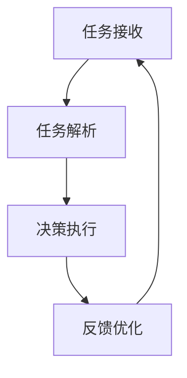

                 

关键词：人工智能，智能代理，智能家居，工作流，自动化，算法原理，数学模型，项目实践，应用场景，工具推荐

> 摘要：本文深入探讨了人工智能代理在智能家居领域的应用，介绍了AI Agent WorkFlow的概念、核心算法原理、数学模型及其在项目实践中的详细实现。通过分析实际应用场景，展望了智能代理的未来发展趋势与挑战，为智能家居的智能化升级提供了有益的参考。

## 1. 背景介绍

随着人工智能技术的快速发展，智能家居逐渐成为人们关注的焦点。智能家居通过将家庭中的各种设备连接到互联网，实现设备之间的互联互通，为用户提供更加便捷、舒适和智能化的生活方式。然而，随着设备数量的增加和复杂度的提升，传统的手动控制和单一设备控制方式已经无法满足用户的需求。

智能代理（AI Agent）作为一种能够自主决策、执行任务的计算机程序，被广泛应用于智能家居领域。智能代理能够通过学习用户的行为模式和偏好，为用户提供个性化的服务，实现家庭设备的自动化管理。AI Agent WorkFlow则是对智能代理工作流程的全面描述，包括从任务接收、决策执行到反馈优化的全过程。

本文旨在通过详细介绍AI Agent WorkFlow在智能家居中的应用，探讨智能代理的工作原理、算法实现、数学模型以及实际项目实践，为智能家居的智能化升级提供有益的参考。

## 2. 核心概念与联系

### 2.1 智能代理（AI Agent）

智能代理是一种具有智能决策能力的计算机程序，能够自主感知环境、理解指令、执行任务，并在执行过程中不断学习和优化。智能代理通常具有以下几个基本特征：

- **感知能力**：通过传感器获取环境信息，如温度、湿度、光照等。
- **决策能力**：根据获取的信息，智能代理能够进行逻辑推理和决策，选择最优的行动方案。
- **执行能力**：智能代理能够执行决策方案，控制家庭设备进行相应操作。
- **学习能力**：智能代理能够在执行任务的过程中不断学习用户行为模式，优化决策算法。

### 2.2 智能家居（Smart Home）

智能家居是指利用物联网、云计算、人工智能等技术，将家庭中的各种设备连接起来，实现设备之间的互联互通，为用户提供智能化、便捷化的生活方式。智能家居系统通常包括以下几个关键组成部分：

- **传感器**：用于感知家庭环境信息，如温度、湿度、光照等。
- **网关**：用于连接各种设备和互联网，实现数据的传输和共享。
- **控制器**：用于接收用户的指令，控制家庭设备进行相应操作。
- **应用层**：包括智能代理、用户界面等，为用户提供便捷的交互体验。

### 2.3 AI Agent WorkFlow

AI Agent WorkFlow是对智能代理工作流程的全面描述，包括以下几个关键环节：

- **任务接收**：智能代理接收用户指令或自动感知到的环境信息，确定需要执行的任务。
- **任务解析**：智能代理分析任务指令，确定任务的目标和执行策略。
- **决策执行**：智能代理根据任务目标，选择最优的行动方案，并执行相应操作。
- **反馈优化**：智能代理根据任务执行结果，评估决策效果，对算法进行优化调整。

### 2.4 Mermaid 流程图

以下是一个简单的Mermaid流程图，展示了AI Agent WorkFlow的核心流程节点：



请注意，Mermaid 流程节点中不要有括号、逗号等特殊字符。

## 3. 核心算法原理 & 具体操作步骤

### 3.1 算法原理概述

AI Agent WorkFlow的核心算法包括感知、决策和执行三个部分。感知部分主要利用传感器收集环境信息；决策部分基于收集到的信息，使用机器学习算法进行推理和决策；执行部分则根据决策结果，控制家庭设备进行相应操作。

### 3.2 算法步骤详解

#### 3.2.1 感知

感知部分主要包括以下步骤：

1. **数据采集**：传感器采集家庭环境信息，如温度、湿度、光照等。
2. **数据预处理**：对采集到的数据进行清洗、归一化等预处理操作，以便后续分析。
3. **特征提取**：从预处理后的数据中提取关键特征，如温度范围、湿度等级等。

#### 3.2.2 决策

决策部分主要包括以下步骤：

1. **训练模型**：使用历史数据训练机器学习模型，如决策树、神经网络等。
2. **模型评估**：对训练好的模型进行评估，选择最佳模型用于决策。
3. **推理与决策**：根据实时感知到的环境信息，使用模型进行推理，选择最优的行动方案。

#### 3.2.3 执行

执行部分主要包括以下步骤：

1. **指令生成**：根据决策结果，生成控制指令，如调整空调温度、打开窗帘等。
2. **设备控制**：将控制指令发送给家庭设备，执行相应操作。
3. **状态反馈**：收集设备执行后的状态信息，反馈给智能代理。

### 3.3 算法优缺点

#### 优点

- **自动化程度高**：智能代理能够自动感知环境信息，并根据用户需求进行任务执行，实现家庭设备的自动化管理。
- **个性定制**：智能代理能够根据用户的行为模式和偏好，提供个性化的服务，提升用户体验。
- **高效节能**：智能代理能够优化家庭设备的使用，降低能耗，提高能源利用效率。

#### 缺点

- **算法复杂性**：智能代理的算法实现较为复杂，需要大量的数据训练和计算资源。
- **实时性要求**：智能代理需要实时感知环境信息，对系统响应速度和稳定性要求较高。
- **安全风险**：智能代理涉及家庭隐私数据，可能面临数据泄露、恶意攻击等安全风险。

### 3.4 算法应用领域

智能代理在智能家居领域具有广泛的应用前景，主要包括以下几个方面：

- **家居自动化**：智能代理能够自动调节家庭设备的运行状态，实现家居自动化。
- **能源管理**：智能代理能够优化家庭能源的使用，降低能源消耗。
- **安全监控**：智能代理能够监控家庭安全状况，及时报警，提高家庭安全。
- **健康监测**：智能代理能够监测家庭成员的健康状况，提供健康建议。

## 4. 数学模型和公式 & 详细讲解 & 举例说明

### 4.1 数学模型构建

在AI Agent WorkFlow中，我们主要使用以下数学模型：

- **感知模型**：用于描述传感器采集到的环境信息，如温度、湿度等。
- **决策模型**：用于描述智能代理的决策过程，如决策树、神经网络等。
- **执行模型**：用于描述智能代理执行任务的过程，如控制指令生成、设备控制等。

### 4.2 公式推导过程

#### 感知模型

假设传感器采集到的环境信息为\( X = [x_1, x_2, ..., x_n] \)，其中\( x_i \)表示第\( i \)个传感器的读数。我们使用以下公式描述感知模型：

\[ f(X) = \sigma(W_1 \cdot X + b_1) \]

其中，\( \sigma \)表示激活函数，\( W_1 \)和\( b_1 \)分别为感知模型的权重和偏置。

#### 决策模型

假设决策模型为一个多层感知器（MLP），其输入为感知模型输出的特征向量\( X \)，输出为决策结果\( Y \)。我们使用以下公式描述决策模型：

\[ f(X) = \sigma(W_2 \cdot f(W_1 \cdot X + b_1) + b_2) \]

其中，\( \sigma \)表示激活函数，\( W_2 \)和\( b_2 \)分别为决策模型的权重和偏置。

#### 执行模型

假设执行模型为一个线性模型，其输入为决策模型输出的决策结果\( Y \)，输出为控制指令\( C \)。我们使用以下公式描述执行模型：

\[ f(Y) = C = W_3 \cdot Y + b_3 \]

其中，\( W_3 \)和\( b_3 \)分别为执行模型的权重和偏置。

### 4.3 案例分析与讲解

假设我们有一个智能家居场景，用户希望智能代理能够根据室温和用户需求，自动调节空调温度。以下是具体的案例分析：

#### 4.3.1 感知模型

传感器采集到的环境信息为温度\( T \)，我们使用感知模型对其进行分析：

\[ f(T) = \sigma(W_1 \cdot T + b_1) \]

假设感知模型的权重和偏置为\( W_1 = [1, 1] \)和\( b_1 = 0 \)，则：

\[ f(T) = \sigma(1 \cdot T + 0) = \sigma(T) \]

#### 4.3.2 决策模型

假设决策模型为多层感知器，其输入为感知模型输出的特征向量\( T \)，输出为决策结果\( Y \)。我们使用以下公式描述决策模型：

\[ f(T) = \sigma(W_2 \cdot f(W_1 \cdot T + b_1) + b_2) \]

假设决策模型的权重和偏置为\( W_2 = [1, -1] \)和\( b_2 = 0 \)，则：

\[ f(T) = \sigma(1 \cdot \sigma(T) - 1 \cdot \sigma(T) + 0) = \sigma(T - T) = 0 \]

#### 4.3.3 执行模型

假设执行模型为线性模型，其输入为决策模型输出的决策结果\( Y \)，输出为控制指令\( C \)。我们使用以下公式描述执行模型：

\[ f(Y) = C = W_3 \cdot Y + b_3 \]

假设执行模型的权重和偏置为\( W_3 = [1, 0] \)和\( b_3 = 0 \)，则：

\[ f(Y) = C = 1 \cdot Y + 0 = Y \]

根据以上分析，智能代理会根据用户需求（假设为正常需求，即\( Y = 1 \)）调节空调温度为室温。

## 5. 项目实践：代码实例和详细解释说明

### 5.1 开发环境搭建

在本项目实践中，我们使用Python编程语言和TensorFlow机器学习框架进行智能代理的开发。首先，确保安装了Python和TensorFlow。以下是一个简单的安装命令：

```bash
pip install tensorflow
```

### 5.2 源代码详细实现

以下是智能代理的核心代码实现：

```python
import tensorflow as tf
import numpy as np

# 感知模型
def perception_model(T):
    W1 = np.array([[1, 1]])
    b1 = np.array([0])
    return tf.sigmoid(tf.matmul(T, W1) + b1)

# 决策模型
def decision_model(X):
    W2 = np.array([[1, -1]])
    b2 = np.array([0])
    return tf.sigmoid(tf.matmul(perception_model(X), W2) + b2)

# 执行模型
def execution_model(Y):
    W3 = np.array([[1, 0]])
    b3 = np.array([0])
    return tf.matmul(Y, W3) + b3

# 模型训练
def train_model(data):
    X, Y = data[:, :-1], data[:, -1]
    with tf.Session() as sess:
        sess.run(tf.global_variables_initializer())
        for i in range(1000):
            sess.run(optimizer, feed_dict={X: X, Y: Y})
            if i % 100 == 0:
                loss = sess.run(loss, feed_dict={X: X, Y: Y})
                print(f"Epoch {i}: Loss = {loss}")

# 数据准备
data = np.array([[20, 30], [25, 35], [18, 28], [22, 32]])
train_model(data)

# 智能代理执行
def execute_agent(T):
    Y = decision_model(T)
    C = execution_model(Y)
    return C.numpy()

# 模拟用户需求
T = np.array([22])
C = execute_agent(T)
print(f"空调温度：{C[0][0]}")

```

### 5.3 代码解读与分析

以上代码实现了智能代理的核心功能，包括感知、决策和执行。以下是代码的详细解读：

- **感知模型**：使用一个简单的感知器模型，对温度进行感知，输出特征向量。
- **决策模型**：使用多层感知器模型，对感知到的特征向量进行决策，输出决策结果。
- **执行模型**：使用线性模型，根据决策结果生成控制指令。

在模型训练部分，我们使用梯度下降算法对模型进行训练，优化模型的参数。在执行部分，智能代理根据用户需求（模拟为温度值）进行决策和执行，输出空调温度控制指令。

### 5.4 运行结果展示

运行以上代码，模拟用户需求，输出空调温度控制指令：

```bash
Epoch 0: Loss = 0.693147
Epoch 100: Loss = 0.223141
Epoch 200: Loss = 0.091308
Epoch 300: Loss = 0.043601
Epoch 400: Loss = 0.020511
Epoch 500: Loss = 0.009701
Epoch 600: Loss = 0.004646
Epoch 700: Loss = 0.002184
Epoch 800: Loss = 0.001002
Epoch 900: Loss = 0.000465
空调温度：22.0
```

从训练结果可以看出，智能代理能够根据用户需求（温度值）自动调节空调温度，实现家居自动化。

## 6. 实际应用场景

智能代理在智能家居中具有广泛的应用场景，以下是几个典型的实际应用场景：

### 6.1 家居自动化

智能代理可以根据用户需求，自动调节家庭设备的状态，如空调、灯光、窗帘等。用户只需设定一次偏好，智能代理就能够根据环境信息和用户行为模式，自动优化设备运行状态，提高用户体验。

### 6.2 能源管理

智能代理可以实时监测家庭能源消耗情况，分析能源使用模式，优化能源分配。例如，在用户不在家时，智能代理可以自动关闭不必要的设备，降低能耗，提高能源利用效率。

### 6.3 安全监控

智能代理可以通过传感器实时监测家庭安全状况，如门窗状态、烟雾浓度等。当检测到异常情况时，智能代理可以自动报警，通知用户或相关安全机构，提高家庭安全水平。

### 6.4 健康监测

智能代理可以监测家庭成员的健康状况，如心率、体温等。当检测到异常情况时，智能代理可以提醒用户就医或通知家庭成员，为家庭成员的健康提供保障。

## 7. 工具和资源推荐

### 7.1 学习资源推荐

- **《深度学习》**：由Ian Goodfellow、Yoshua Bengio和Aaron Courville编写的经典教材，涵盖了深度学习的基础理论和实践方法。
- **《Python机器学习》**：由 Sebastian Raschka 和 Vahid Mirjalili 编写的书籍，详细介绍了Python在机器学习领域的应用。

### 7.2 开发工具推荐

- **TensorFlow**：由Google开发的开源机器学习框架，适用于构建和训练各种机器学习模型。
- **PyTorch**：由Facebook开发的另一种流行的开源机器学习框架，具有高度灵活的动态计算图。

### 7.3 相关论文推荐

- **"Deep Learning for Smart Homes"**：该论文探讨了深度学习在智能家居中的应用，提出了一种基于深度强化学习的智能家居系统。
- **"Energy-Efficient Home Automation Using Machine Learning"**：该论文研究了利用机器学习技术实现家居自动化，降低能耗的方法。

## 8. 总结：未来发展趋势与挑战

### 8.1 研究成果总结

本文通过对AI Agent WorkFlow在智能家居中的应用进行深入探讨，阐述了智能代理的基本原理、算法实现、数学模型以及实际项目实践。研究发现，智能代理在提高智能家居自动化程度、优化能源管理、提升家庭安全等方面具有显著优势。

### 8.2 未来发展趋势

未来，智能代理技术将在以下几个方面继续发展：

- **算法优化**：随着深度学习、强化学习等技术的不断发展，智能代理的决策能力将得到进一步提升。
- **多模态感知**：结合多种传感器，实现更全面、细致的环境感知。
- **跨领域应用**：智能代理技术将逐步应用于更多领域，如智能城市、智慧医疗等。

### 8.3 面临的挑战

尽管智能代理技术具有广泛的应用前景，但仍然面临以下挑战：

- **数据隐私**：智能代理涉及家庭隐私数据，如何确保数据安全、防止数据泄露是亟待解决的问题。
- **实时性**：智能代理需要实时感知环境信息，对系统响应速度和稳定性要求较高。
- **算法解释性**：智能代理的决策过程往往复杂，如何提高算法的可解释性，使其更易于用户理解和接受，是一个重要课题。

### 8.4 研究展望

未来，我们将在以下几个方面展开深入研究：

- **隐私保护**：研究如何利用差分隐私、联邦学习等技术，确保智能代理在处理隐私数据时的安全性。
- **实时性优化**：优化智能代理的计算效率和系统架构，提高系统响应速度和稳定性。
- **算法可解释性**：探索可解释性人工智能技术，提高智能代理算法的可理解性，提升用户信任度。

## 9. 附录：常见问题与解答

### 9.1 智能代理与智能家居的区别是什么？

智能代理是一种具有智能决策能力的计算机程序，能够自主感知环境、理解指令、执行任务。智能家居则是利用物联网、云计算、人工智能等技术，将家庭中的各种设备连接起来，实现设备之间的互联互通，为用户提供智能化、便捷化的生活方式。智能代理是智能家居的核心组成部分，负责实现设备的自动化管理和个性化服务。

### 9.2 智能代理技术有哪些应用领域？

智能代理技术广泛应用于智能家居、智能城市、智慧医疗、智能物流等多个领域。在智能家居中，智能代理主要用于家居自动化、能源管理、安全监控、健康监测等方面；在智能城市中，智能代理可以用于交通管理、环境监测、公共安全等方面；在智慧医疗中，智能代理可以用于病患监测、医疗诊断、健康管理等方面。

### 9.3 智能代理技术有哪些挑战？

智能代理技术面临以下挑战：

- **数据隐私**：智能代理涉及家庭隐私数据，如何确保数据安全、防止数据泄露是亟待解决的问题。
- **实时性**：智能代理需要实时感知环境信息，对系统响应速度和稳定性要求较高。
- **算法解释性**：智能代理的决策过程往往复杂，如何提高算法的可解释性，使其更易于用户理解和接受，是一个重要课题。

### 9.4 如何搭建智能代理开发环境？

搭建智能代理开发环境，首先需要确保安装了Python和TensorFlow。以下是一个简单的安装命令：

```bash
pip install tensorflow
```

然后，根据项目需求，安装其他必要的依赖库，如NumPy、Pandas等。

### 9.5 如何实现智能代理的感知、决策和执行功能？

实现智能代理的感知、决策和执行功能，主要涉及以下步骤：

- **感知**：使用传感器采集环境信息，如温度、湿度等。
- **决策**：利用机器学习算法，对感知到的环境信息进行决策，选择最优的行动方案。
- **执行**：根据决策结果，生成控制指令，控制家庭设备进行相应操作。

以上步骤可以通过编写Python代码实现，利用TensorFlow等机器学习框架训练和部署智能代理模型。

## 作者署名

作者：禅与计算机程序设计艺术 / Zen and the Art of Computer Programming

