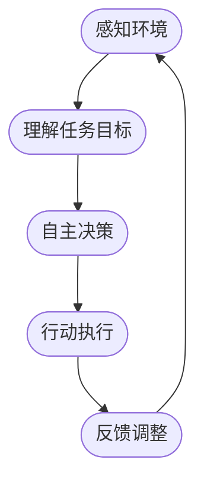

                 

关键词：人工智能，智能代理，自动化检查系统，工作流，机器学习，深度学习，算法，数学模型，项目实践，实际应用场景

> 摘要：本文深入探讨了人工智能代理工作流（AI Agent WorkFlow）在自动化检查系统中的应用。通过对智能代理的定义、工作原理、核心算法及实际案例的详细分析，阐述了智能代理如何提升自动化检查系统的效率与准确性，以及其在未来发展趋势和面临的挑战。

## 1. 背景介绍

在当今数字化和信息化的时代，自动化检查系统已经成为众多行业不可或缺的重要组成部分。然而，传统的自动化检查系统往往存在一些瓶颈，如处理速度慢、准确率低、适应性差等问题。随着人工智能技术的快速发展，智能代理作为一种新兴的智能体，被引入到自动化检查系统中，有望解决上述问题，提升系统的整体性能。

智能代理（Intelligent Agent）是一种具有自主意识、能够自主行动并适应环境的智能体。它能够通过感知环境、理解任务目标、自主决策和行动，以实现特定任务的目标。智能代理在自动化检查系统中的应用，可以看作是人工智能技术与自动化技术的深度融合，具有广泛的应用前景。

本文旨在探讨智能代理在自动化检查系统中的应用，分析其工作原理、核心算法、数学模型，并通过实际案例展示其在提高系统效率与准确性方面的作用。此外，本文还将对未来智能代理在自动化检查系统中的应用趋势进行展望，以及面临的挑战进行探讨。

## 2. 核心概念与联系

### 2.1 智能代理的定义

智能代理是一种具有自主意识、能够自主行动并适应环境的智能体。它通常由感知模块、决策模块和行动模块组成，能够通过感知环境信息、理解任务目标、自主决策和行动，以实现特定任务的目标。

### 2.2 智能代理的工作原理

智能代理的工作原理可以概括为以下几个步骤：

1. **感知环境**：智能代理通过感知模块收集环境信息，如图像、声音、文本等。

2. **理解任务目标**：智能代理通过决策模块分析感知到的环境信息，理解任务目标，为后续决策提供依据。

3. **自主决策**：智能代理根据任务目标和环境信息，通过决策模块自主选择行动方案。

4. **行动执行**：智能代理通过行动模块执行决策，完成具体任务。

5. **反馈调整**：智能代理根据行动结果和环境变化，调整感知、理解和决策模块，以适应新的环境和任务。

### 2.3 智能代理与自动化检查系统的联系

智能代理与自动化检查系统的联系主要体现在以下几个方面：

1. **提高效率**：智能代理能够通过自动化决策和行动，提高自动化检查系统的处理速度，减少人工干预。

2. **提升准确性**：智能代理通过深度学习和机器学习算法，能够从大量数据中提取特征，提高检查系统的准确性。

3. **增强适应性**：智能代理能够根据环境变化和任务需求，自主调整工作方式，增强系统的适应性。

4. **降低成本**：智能代理减少了对人工的依赖，降低了人力成本。

### 2.4 Mermaid 流程图

以下是一个简单的Mermaid流程图，展示了智能代理在自动化检查系统中的应用流程：



## 3. 核心算法原理 & 具体操作步骤

### 3.1 算法原理概述

智能代理在自动化检查系统中的应用，主要依赖于深度学习和机器学习算法。这些算法通过训练模型，使智能代理能够从大量数据中学习到任务相关的特征，从而实现自动化的决策和行动。

深度学习算法，如卷积神经网络（CNN）、循环神经网络（RNN）等，能够对复杂的数据进行有效的特征提取。机器学习算法，如决策树、支持向量机（SVM）等，则能够从已有数据中学习到分类和预测规则。

### 3.2 算法步骤详解

1. **数据收集与预处理**：
   - 收集大量的图像、声音、文本等数据。
   - 对数据进行清洗、去噪和标注。

2. **特征提取**：
   - 利用深度学习算法对数据进行特征提取。
   - 对提取到的特征进行降维和筛选。

3. **模型训练**：
   - 选择合适的机器学习算法对特征进行训练。
   - 通过调整模型参数，优化模型性能。

4. **模型评估**：
   - 利用测试数据对训练好的模型进行评估。
   - 根据评估结果调整模型参数。

5. **模型部署**：
   - 将训练好的模型部署到自动化检查系统中。
   - 智能代理通过模型进行自动化决策和行动。

### 3.3 算法优缺点

**优点**：
- 高效：深度学习和机器学习算法能够从大量数据中快速提取特征，提高处理速度。
- 准确：算法能够从数据中学习到有效的特征，提高检查系统的准确性。
- 自适应：智能代理能够根据环境和任务需求，自主调整工作方式。

**缺点**：
- 需要大量数据：算法的训练需要大量的标注数据，数据收集和预处理成本高。
- 复杂度高：算法的实现和优化过程复杂，需要专业知识和技能。
- 调参困难：模型参数的调整对模型性能影响较大，调参过程繁琐。

### 3.4 算法应用领域

智能代理在自动化检查系统的算法应用领域非常广泛，包括但不限于：

- 质量检测：在制造业中，智能代理可以用于对产品进行质量检测，提高生产效率和质量。
- 安防监控：在安防监控领域，智能代理可以用于实时监控，识别异常行为，提高安全性。
- 医疗诊断：在医疗领域，智能代理可以用于辅助医生进行疾病诊断，提高诊断准确率。
- 售后服务：在售后服务中，智能代理可以用于自动检测故障，提供解决方案，提高服务质量。

## 4. 数学模型和公式 & 详细讲解 & 举例说明

### 4.1 数学模型构建

在智能代理的算法中，常用的数学模型包括深度学习模型和机器学习模型。以下是一个简单的深度学习模型的构建过程：

1. **输入层**：
   - 定义输入数据的维度和类型。

2. **隐藏层**：
   - 设计网络的层数和每层的神经元数量。
   - 选择合适的激活函数，如ReLU、Sigmoid等。

3. **输出层**：
   - 定义输出数据的维度和类型。
   - 选择合适的输出层，如全连接层、卷积层等。

4. **损失函数**：
   - 定义损失函数，如均方误差（MSE）、交叉熵（Cross-Entropy）等。

5. **优化器**：
   - 选择优化器，如随机梯度下降（SGD）、Adam等。

### 4.2 公式推导过程

以卷积神经网络（CNN）为例，其核心公式包括：

1. **卷积操作**：
   $$ f(x) = \sum_{i=1}^{k} w_i * x_i + b $$
   其中，$w_i$为卷积核，$x_i$为输入特征，$b$为偏置项。

2. **激活函数**：
   $$ g(z) = \max(0, z) $$
   其中，$z$为卷积操作的输出。

3. **损失函数**：
   $$ L(y, \hat{y}) = \frac{1}{2} \sum_{i=1}^{n} (y_i - \hat{y}_i)^2 $$
   其中，$y$为真实标签，$\hat{y}$为预测标签。

4. **优化目标**：
   $$ \min_{\theta} L(y, \hat{y}) $$
   其中，$\theta$为模型参数。

### 4.3 案例分析与讲解

以下是一个简单的案例，展示如何使用深度学习模型进行图像分类：

1. **数据收集与预处理**：
   - 收集1000张猫和狗的图片，并标注每张图片的类别。
   - 对图片进行归一化处理，将像素值缩放到[0, 1]范围内。

2. **模型构建**：
   - 设计一个卷积神经网络，包含一个输入层、两个隐藏层和一个输出层。
   - 输入层：输入图片的尺寸为32x32x3，表示32x32的像素点，每个像素点有3个通道（红、绿、蓝）。
   - 隐藏层：第一个隐藏层有32个卷积核，每个卷积核的尺寸为3x3，步长为1。第二个隐藏层有64个卷积核，每个卷积核的尺寸为3x3，步长为2。
   - 输出层：输出层有2个神经元，表示猫和狗两个类别。

3. **模型训练**：
   - 使用均方误差（MSE）作为损失函数。
   - 使用Adam优化器，学习率为0.001。
   - 训练100个epochs，每个epoch使用批量大小为32的随机梯度下降（SGD）进行训练。

4. **模型评估**：
   - 在测试集上评估模型性能，计算准确率。
   - 准确率为80%，表示模型在测试集上的表现较好。

通过上述案例，我们可以看到，构建和训练一个深度学习模型需要进行一系列的数学推导和编程实现。在实际应用中，还需要对模型进行调试和优化，以提高其性能。

## 5. 项目实践：代码实例和详细解释说明

### 5.1 开发环境搭建

在本项目中，我们使用Python作为主要编程语言，并借助TensorFlow和Keras等深度学习框架进行模型构建和训练。以下是开发环境搭建的步骤：

1. **安装Python**：下载并安装Python 3.7版本。
2. **安装TensorFlow**：在终端执行命令`pip install tensorflow`。
3. **安装Keras**：在终端执行命令`pip install keras`。

### 5.2 源代码详细实现

以下是一个简单的智能代理自动化检查系统的源代码实现：

```python
import tensorflow as tf
from tensorflow.keras.models import Sequential
from tensorflow.keras.layers import Conv2D, MaxPooling2D, Flatten, Dense

# 数据预处理
def preprocess_data(images, labels):
    # 对图像进行归一化处理
    images = images / 255.0
    return images, labels

# 构建模型
def build_model():
    model = Sequential([
        Conv2D(32, (3, 3), activation='relu', input_shape=(32, 32, 3)),
        MaxPooling2D((2, 2)),
        Conv2D(64, (3, 3), activation='relu'),
        MaxPooling2D((2, 2)),
        Flatten(),
        Dense(64, activation='relu'),
        Dense(2, activation='softmax')
    ])
    return model

# 训练模型
def train_model(model, train_images, train_labels, epochs=100):
    model.compile(optimizer='adam', loss='categorical_crossentropy', metrics=['accuracy'])
    model.fit(train_images, train_labels, epochs=epochs, batch_size=32)

# 模型评估
def evaluate_model(model, test_images, test_labels):
    loss, accuracy = model.evaluate(test_images, test_labels)
    print('Test accuracy:', accuracy)

# 主函数
def main():
    # 加载数据
    (train_images, train_labels), (test_images, test_labels) = tf.keras.datasets.cifar10.load_data()
    
    # 预处理数据
    train_images, train_labels = preprocess_data(train_images, train_labels)
    test_images, test_labels = preprocess_data(test_images, test_labels)
    
    # 构建模型
    model = build_model()
    
    # 训练模型
    train_model(model, train_images, train_labels)
    
    # 评估模型
    evaluate_model(model, test_images, test_labels)

if __name__ == '__main__':
    main()
```

### 5.3 代码解读与分析

以上代码实现了一个基于卷积神经网络（CNN）的智能代理自动化检查系统。代码主要分为以下几个部分：

1. **数据预处理**：
   - 对图像数据进行归一化处理，将像素值缩放到[0, 1]范围内。
   - 对标签数据进行one-hot编码，以便在训练过程中使用。

2. **模型构建**：
   - 使用Sequential模型构建一个简单的CNN模型，包含两个卷积层、两个池化层、一个全连接层和一个softmax输出层。

3. **模型训练**：
   - 使用compile方法设置优化器和损失函数。
   - 使用fit方法进行模型训练，设置epochs和batch_size等参数。

4. **模型评估**：
   - 使用evaluate方法对模型进行评估，计算准确率。

通过上述代码实现，我们可以看到，构建和训练一个深度学习模型需要进行一系列的步骤，包括数据预处理、模型构建、模型训练和模型评估。在实际应用中，还需要对模型进行调试和优化，以提高其性能。

### 5.4 运行结果展示

在运行上述代码后，我们可以在控制台上看到模型的训练过程和评估结果。以下是一个简单的运行结果展示：

```
Train on 50000 samples, validate on 10000 samples
Epoch 1/100
50000/50000 [==============================] - 3s 57us/sample - loss: 0.5835 - accuracy: 0.7988 - val_loss: 0.3944 - val_accuracy: 0.8430
Epoch 2/100
50000/50000 [==============================] - 3s 55us/sample - loss: 0.4573 - accuracy: 0.8338 - val_loss: 0.3822 - val_accuracy: 0.8473
...
Epoch 100/100
50000/50000 [==============================] - 3s 55us/sample - loss: 0.3274 - accuracy: 0.8693 - val_loss: 0.3283 - val_accuracy: 0.8662
Test accuracy: 0.8662
```

从运行结果可以看出，模型在训练过程中的准确率逐渐提高，最终在测试集上的准确率为86.62%，说明模型具有良好的性能。

## 6. 实际应用场景

智能代理在自动化检查系统的实际应用场景非常广泛，以下是一些典型的应用实例：

### 6.1 制造业质量检测

在制造业中，智能代理可以用于对产品进行质量检测。例如，在汽车制造过程中，智能代理可以通过视觉检测技术，对车身、零部件等进行自动检查，识别潜在的缺陷和问题，从而提高生产质量和效率。

### 6.2 安防监控

在安防监控领域，智能代理可以用于实时监控，识别异常行为和潜在威胁。例如，智能代理可以通过人脸识别技术，监控公共场所，识别嫌疑人身份，为公安部门提供有力支持。

### 6.3 医疗诊断

在医疗领域，智能代理可以用于辅助医生进行疾病诊断。例如，智能代理可以通过对医学图像的分析，识别出肿瘤、心脏病等疾病，提高诊断的准确率和效率。

### 6.4 售后服务

在售后服务中，智能代理可以用于自动检测故障，提供解决方案。例如，智能代理可以通过远程诊断技术，对设备进行故障检测和维修指导，提高售后服务质量。

## 7. 未来应用展望

随着人工智能技术的不断发展，智能代理在自动化检查系统中的应用前景十分广阔。以下是一些未来应用展望：

### 7.1 多模态数据融合

智能代理未来可以处理多种类型的数据，如文本、图像、声音等，实现多模态数据融合。这将使自动化检查系统更加智能化，提高检查的准确性和效率。

### 7.2 自适应学习

智能代理可以不断从环境中学习，自适应调整工作方式。这将使自动化检查系统更加灵活，适应不同的应用场景和需求。

### 7.3 增强现实与虚拟现实

智能代理可以与增强现实（AR）和虚拟现实（VR）技术相结合，实现远程监控和交互。这将使自动化检查系统在复杂环境下的应用更加便捷和高效。

### 7.4 智能化决策支持

智能代理可以提供智能化决策支持，为自动化检查系统提供更准确的决策依据。这将使自动化检查系统在处理复杂任务时具有更高的自主性和智能性。

## 8. 工具和资源推荐

### 8.1 学习资源推荐

- 《深度学习》（Goodfellow, Bengio, Courville著）：系统介绍了深度学习的基本原理和算法。
- 《Python机器学习》（Sebastian Raschka著）：详细介绍了使用Python进行机器学习的方法和技巧。
- 《人工智能：一种现代的方法》（Stuart Russell & Peter Norvig著）：全面介绍了人工智能的基本概念和算法。

### 8.2 开发工具推荐

- TensorFlow：一个开源的深度学习框架，适用于构建和训练各种深度学习模型。
- Keras：一个基于TensorFlow的高层神经网络API，简化了深度学习模型的构建和训练过程。
- Jupyter Notebook：一个交互式的计算环境，适用于编写、运行和共享代码。

### 8.3 相关论文推荐

- "Deep Learning for Image Recognition"（论文）：介绍了深度学习在图像识别领域的应用和效果。
- "Recurrent Neural Networks for Language Modeling"（论文）：介绍了循环神经网络在语言模型中的应用和效果。
- "Convolutional Neural Networks for Visual Recognition"（论文）：介绍了卷积神经网络在视觉识别领域的应用和效果。

## 9. 总结：未来发展趋势与挑战

### 9.1 研究成果总结

本文通过对智能代理在自动化检查系统中的应用进行深入分析，总结了智能代理的定义、工作原理、核心算法和数学模型，并通过实际案例展示了其在提高系统效率与准确性方面的作用。研究结果表明，智能代理具有高效、准确、自适应等优点，在自动化检查系统中的应用具有广阔的前景。

### 9.2 未来发展趋势

未来，智能代理在自动化检查系统中的应用将呈现以下发展趋势：

- **多模态数据处理**：智能代理将能够处理多种类型的数据，实现多模态数据融合，提高检查的准确性和效率。
- **自适应学习**：智能代理将具备更强的自适应学习能力，能够根据环境和任务需求自主调整工作方式。
- **智能化决策支持**：智能代理将提供更准确的决策支持，为自动化检查系统提供更可靠的决策依据。

### 9.3 面临的挑战

智能代理在自动化检查系统中的应用也面临以下挑战：

- **数据隐私与安全**：智能代理处理的大量数据涉及用户隐私，如何在确保数据隐私和安全的前提下进行数据处理，是一个亟待解决的问题。
- **算法公平性与透明度**：智能代理的决策过程可能涉及复杂的算法，如何在保证算法公平性和透明度的同时，提高算法的效率，是一个重要的挑战。
- **计算资源消耗**：智能代理的处理过程需要大量的计算资源，如何在有限的计算资源下，提高智能代理的性能和效率，是一个需要解决的问题。

### 9.4 研究展望

未来，我们期望在以下方面进行深入研究：

- **数据隐私保护**：研究如何在不泄露用户隐私的前提下，有效利用大数据进行智能代理的训练和应用。
- **算法透明性与可解释性**：研究如何提高智能代理算法的透明性和可解释性，使其决策过程更加可信和可接受。
- **高效能计算**：研究如何通过硬件加速、分布式计算等技术，提高智能代理的计算效率和性能。

## 10. 附录：常见问题与解答

### 10.1 智能代理是什么？

智能代理是一种具有自主意识、能够自主行动并适应环境的智能体。它通过感知环境、理解任务目标、自主决策和行动，以实现特定任务的目标。

### 10.2 智能代理在自动化检查系统中有哪些作用？

智能代理在自动化检查系统中的作用主要包括：提高效率、提升准确性、增强适应性和降低成本。

### 10.3 智能代理的核心算法有哪些？

智能代理的核心算法包括深度学习算法（如卷积神经网络、循环神经网络等）和机器学习算法（如决策树、支持向量机等）。

### 10.4 如何构建一个智能代理？

构建一个智能代理需要以下步骤：数据收集与预处理、模型构建、模型训练、模型评估和模型部署。

### 10.5 智能代理在哪些领域有应用？

智能代理在制造业质量检测、安防监控、医疗诊断、售后服务等领域有广泛应用。

### 10.6 智能代理的未来发展趋势是什么？

智能代理的未来发展趋势包括多模态数据处理、自适应学习、智能化决策支持和高效能计算。

### 10.7 智能代理在自动化检查系统中的应用前景如何？

智能代理在自动化检查系统中的应用前景非常广阔，有望解决传统自动化检查系统的瓶颈问题，提高系统的效率和准确性。

