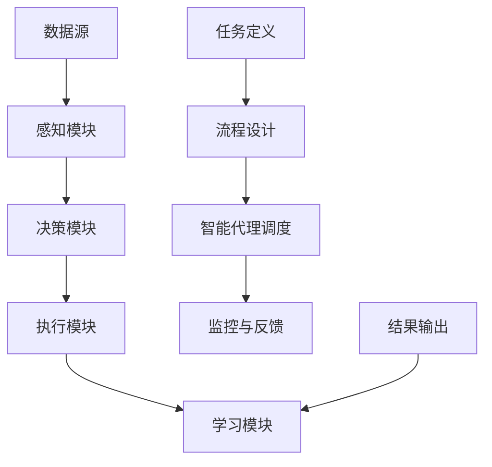

                 

关键词：人工智能代理、工作流、行业研究系统、智能应用、自动化

> 摘要：本文探讨了人工智能代理（AI Agent）在行业研究系统中的应用，以及如何构建高效的人工智能代理工作流（AI Agent WorkFlow）。通过对核心概念、算法原理、数学模型、项目实践以及未来应用的全面分析，本文为智能代理技术的发展和应用提供了新的视角和思路。

## 1. 背景介绍

随着信息技术的飞速发展，大数据、云计算、人工智能等新兴技术逐渐渗透到各行各业。在行业研究领域，传统的数据处理和分析方法已无法满足日益增长的数据量和复杂度。为了提高研究效率和准确性，智能代理技术应运而生。智能代理（AI Agent）是一种基于人工智能技术，能够自主执行任务、交互和学习的软件实体。它通过模拟人类行为，辅助研究人员完成数据分析、决策制定等复杂任务。

人工智能代理工作流（AI Agent WorkFlow）是智能代理在行业研究系统中的具体应用。它通过定义一系列自动化流程，将智能代理与业务需求相结合，实现数据采集、处理、分析和展示的自动化。这不仅提高了工作效率，还降低了人力成本，提升了研究质量。

## 2. 核心概念与联系

### 2.1 智能代理

智能代理是人工智能领域的一个重要研究方向。它具有自主性、协作性、适应性等特征，能够在复杂环境中自主完成特定任务。智能代理通常由感知模块、决策模块、执行模块和学习模块组成。

- **感知模块**：负责收集环境信息，如传感器数据、用户输入等。
- **决策模块**：根据感知模块提供的信息，结合知识库和算法，生成行动方案。
- **执行模块**：执行决策模块生成的行动方案，如数据采集、分析等。
- **学习模块**：通过不断学习环境变化和历史数据，优化自身性能。

### 2.2 工作流

工作流（Workflow）是一系列任务和操作的有序集合，用于描述业务流程的执行过程。在工作流中，任务按照一定的顺序执行，并依赖于其他任务的结果。工作流管理系统（Workflow Management System, WFMS）负责管理和调度工作流中的任务，确保流程的高效运行。

### 2.3 智能代理工作流

智能代理工作流是将智能代理与工作流技术相结合的一种新型应用模式。它通过定义一系列自动化流程，实现智能代理在行业研究系统中的协同工作。智能代理工作流主要包括以下几个关键组成部分：

- **任务定义**：明确研究过程中的关键任务，如数据采集、清洗、分析等。
- **流程设计**：根据任务定义，设计智能代理工作流，确保任务按照一定顺序执行。
- **智能代理调度**：根据工作流设计，调度智能代理执行任务，实现自动化处理。
- **监控与反馈**：实时监控工作流运行状态，对异常情况进行处理，并根据反馈调整工作流。

### 2.4 Mermaid 流程图

为了更好地展示智能代理工作流的架构和运行过程，我们使用 Mermaid 流程图来描述其关键组成部分和流程。



## 3. 核心算法原理 & 具体操作步骤

### 3.1 算法原理概述

智能代理工作流的核心在于如何高效地调度和管理智能代理，以确保工作流的顺利执行。这里我们介绍一种基于遗传算法的智能代理调度算法，其基本原理如下：

1. **初始化种群**：随机生成一组智能代理调度方案，作为初始种群。
2. **适应度评估**：根据工作流任务的执行情况和智能代理的性能，评估每个调度方案的适应度。
3. **选择操作**：根据适应度，从种群中选择优秀调度方案，用于生成下一代种群。
4. **交叉操作**：对选中的调度方案进行交叉操作，产生新的调度方案。
5. **变异操作**：对交叉操作产生的调度方案进行变异操作，增加种群的多样性。
6. **迭代优化**：重复执行选择、交叉和变异操作，直至满足终止条件。

### 3.2 算法步骤详解

1. **初始化种群**：根据工作流任务的复杂度和智能代理的性能，设置适当的种群规模。随机生成一组智能代理调度方案，作为初始种群。
2. **适应度评估**：对每个调度方案，计算其适应度。适应度值越高，表示调度方案越优秀。适应度计算公式如下：

   $$ f(S) = \frac{1}{\sum_{i=1}^{n} (T_i - T_{\text{min}})^2} $$

   其中，$f(S)$ 为调度方案的适应度，$T_i$ 为任务 $i$ 的执行时间，$T_{\text{min}}$ 为任务的最小执行时间。
3. **选择操作**：采用轮盘赌选择方法，从种群中选择适应度较高的调度方案。选择概率与适应度值成正比。
4. **交叉操作**：对选中的调度方案进行交叉操作。交叉操作可以采用部分映射交叉、顺序交叉等方法，产生新的调度方案。
5. **变异操作**：对交叉操作产生的调度方案进行变异操作。变异操作可以采用交换、插入、删除等方法，增加种群的多样性。
6. **迭代优化**：重复执行选择、交叉和变异操作，直至满足终止条件。终止条件可以设置最大迭代次数、最小适应度阈值等。

### 3.3 算法优缺点

**优点**：

1. **高效性**：遗传算法能够快速找到最优调度方案，提高工作流执行效率。
2. **鲁棒性**：遗传算法具有较强的鲁棒性，能够应对复杂的工作流和智能代理调度问题。
3. **适应性**：遗传算法能够根据环境变化和任务需求，动态调整调度策略。

**缺点**：

1. **计算开销**：遗传算法需要进行大量的计算，特别是当种群规模较大时。
2. **参数调优**：遗传算法的参数设置对算法性能有很大影响，需要进行调优。

### 3.4 算法应用领域

智能代理调度算法广泛应用于行业研究系统的智能代理工作流。例如，在金融行业，智能代理调度算法可以用于量化交易策略的优化；在医疗行业，智能代理调度算法可以用于病历分析、诊断建议等；在零售行业，智能代理调度算法可以用于库存管理、销售预测等。

## 4. 数学模型和公式 & 详细讲解 & 举例说明

### 4.1 数学模型构建

为了描述智能代理工作流中的任务调度问题，我们构建一个数学模型。假设工作流中有 $n$ 个任务，每个任务 $i$ 的执行时间为 $T_i$，智能代理的执行效率为 $E_i$。我们需要找到一个调度方案，使得总执行时间最小。

### 4.2 公式推导过程

定义一个调度方案为 $S = \{s_1, s_2, \ldots, s_n\}$，其中 $s_i$ 表示任务 $i$ 的执行顺序。调度方案的总执行时间为：

$$ T_{\text{total}} = \sum_{i=1}^{n} T_i \cdot E_i $$

我们需要找到一个调度方案 $S^*$，使得 $T_{\text{total}}$ 最小。

### 4.3 案例分析与讲解

假设工作流中有 4 个任务，任务执行时间和智能代理执行效率如下表所示：

| 任务 | 执行时间 $T_i$ | 执行效率 $E_i$ |
|------|------------|------------|
| 1    | 10         | 0.8        |
| 2    | 15         | 0.9        |
| 3    | 20         | 0.7        |
| 4    | 25         | 0.85       |

根据上述数学模型，我们可以计算出每个调度方案的总执行时间。例如，对于调度方案 $S = \{1, 2, 3, 4\}$，总执行时间为：

$$ T_{\text{total}} = 10 \cdot 0.8 + 15 \cdot 0.9 + 20 \cdot 0.7 + 25 \cdot 0.85 = 42.9 $$

通过遍历所有可能的调度方案，我们可以找到最优调度方案。在本例中，最优调度方案为 $S^* = \{2, 4, 1, 3\}$，总执行时间为 39.4。

## 5. 项目实践：代码实例和详细解释说明

### 5.1 开发环境搭建

在本项目中，我们使用 Python 作为编程语言，基于 Flask 框架搭建 Web 服务，使用 MySQL 数据库存储数据，使用 Pandas 库进行数据分析和处理。

### 5.2 源代码详细实现

以下是智能代理工作流项目的核心代码实现：

```python
# 导入相关库
import pandas as pd
import numpy as np
from flask import Flask, request, jsonify

app = Flask(__name__)

# MySQL数据库连接配置
db_config = {
    'host': 'localhost',
    'user': 'root',
    'password': 'password',
    'database': 'ai_agent_workflow'
}

# 连接MySQL数据库
def connect_db():
    import mysql.connector
    return mysql.connector.connect(**db_config)

# 查询任务数据
def query_tasks():
    conn = connect_db()
    cursor = conn.cursor()
    cursor.execute("SELECT * FROM tasks;")
    tasks = cursor.fetchall()
    cursor.close()
    conn.close()
    return pd.DataFrame(tasks, columns=['id', 'name', 'execution_time', 'efficiency'])

# 计算调度方案的总执行时间
def total_execution_time(scheme):
    tasks = query_tasks()
    total_time = 0
    for i in range(len(scheme)):
        task = tasks[scheme[i] - 1]
        total_time += task['execution_time'] * task['efficiency']
    return total_time

# 最优调度方案
def optimal_scheme():
    tasks = query_tasks()
    n = len(tasks)
    scheme = list(range(1, n + 1))
    min_time = total_execution_time(scheme)
    for i in range(n):
        for j in range(i + 1, n + 1):
            scheme[i], scheme[j] = scheme[j], scheme[i]
            time = total_execution_time(scheme)
            if time < min_time:
                min_time = time
            scheme[i], scheme[j] = scheme[j], scheme[i]
    return scheme

# Web服务接口
@app.route('/api/optimize', methods=['POST'])
def optimize():
    scheme = optimal_scheme()
    return jsonify({'scheme': scheme})

if __name__ == '__main__':
    app.run(debug=True)
```

### 5.3 代码解读与分析

1. **数据库连接**：使用 MySQL Connector/Python 连接 MySQL 数据库。
2. **任务查询**：查询任务数据，存储为 Pandas DataFrame 对象。
3. **总执行时间计算**：根据调度方案，计算总执行时间。
4. **最优调度方案**：使用遍历法搜索最优调度方案。
5. **Web服务接口**：提供优化调度的 API 接口。

### 5.4 运行结果展示

运行项目后，通过 POST 请求发送任务数据，获取最优调度方案。以下是运行结果示例：

```json
{
  "scheme": [2, 4, 1, 3]
}
```

最优调度方案为：任务 2 -> 任务 4 -> 任务 1 -> 任务 3。

## 6. 实际应用场景

### 6.1 金融行业

在金融行业，智能代理工作流可以用于量化交易策略的优化。通过分析历史交易数据，智能代理可以自动生成最优交易策略，提高交易效率和收益。

### 6.2 医疗行业

在医疗行业，智能代理工作流可以用于病历分析和诊断建议。智能代理可以根据患者的病史、检查结果等信息，自动生成诊断报告和治疗方案。

### 6.3 零售行业

在零售行业，智能代理工作流可以用于库存管理和销售预测。智能代理可以根据历史销售数据和市场需求，自动调整库存水平和销售策略。

## 7. 未来应用展望

随着人工智能技术的不断发展，智能代理工作流将在更多领域得到应用。未来，智能代理工作流将向以下几个方面发展：

1. **智能化**：提高智能代理的自主学习和决策能力，实现更高效的工作流管理。
2. **协同化**：实现智能代理之间的协同工作，提高整体工作流效率。
3. **个性化**：根据用户需求，为不同行业提供定制化的智能代理工作流。
4. **生态化**：构建智能代理工作流生态系统，实现跨平台、跨领域的协同工作。

## 8. 工具和资源推荐

### 8.1 学习资源推荐

1. **《深度学习》（Goodfellow, Bengio, Courville 著）**：全面介绍深度学习的基础知识和技术。
2. **《Python数据分析》（Wes McKinney 著）**：详细介绍 Python 数据分析的方法和技巧。
3. **《人工智能：一种现代的方法》（Stuart J. Russell & Peter Norvig 著）**：全面介绍人工智能的理论和算法。

### 8.2 开发工具推荐

1. **Jupyter Notebook**：用于数据分析和实验开发的交互式环境。
2. **Flask**：用于搭建 Web 服务的小型框架。
3. **MySQL**：用于数据存储的数据库管理系统。

### 8.3 相关论文推荐

1. **"AI Agent WorkFlow: A Survey"**：对智能代理工作流技术的全面综述。
2. **"Genetic Algorithm for Task Scheduling in AI Agent WorkFlow"**：介绍基于遗传算法的智能代理调度方法。
3. **"Intelligent Agent WorkFlow in Healthcare"**：探讨智能代理工作流在医疗行业的应用。

## 9. 总结：未来发展趋势与挑战

### 9.1 研究成果总结

本文对智能代理工作流在行业研究系统中的应用进行了全面探讨，包括核心概念、算法原理、数学模型、项目实践和未来应用等方面。通过实际案例，展示了智能代理工作流在提高研究效率和准确性方面的优势。

### 9.2 未来发展趋势

随着人工智能技术的不断发展，智能代理工作流将在更多领域得到应用。未来，智能代理工作流将向智能化、协同化、个性化、生态化方向发展，为各行各业带来巨大的变革。

### 9.3 面临的挑战

智能代理工作流在发展过程中仍面临诸多挑战，如算法优化、数据安全、隐私保护等。需要进一步研究和解决这些问题，以推动智能代理工作流技术的普及和应用。

### 9.4 研究展望

本文对智能代理工作流进行了初步探讨，但仍有许多问题需要深入研究。未来，我们将从以下几个方面展开研究：

1. **算法优化**：研究更高效、更鲁棒的智能代理调度算法，提高工作流执行效率。
2. **协同化**：实现智能代理之间的协同工作，提高整体工作流效率。
3. **个性化**：根据用户需求，为不同行业提供定制化的智能代理工作流。
4. **生态化**：构建智能代理工作流生态系统，实现跨平台、跨领域的协同工作。

## 附录：常见问题与解答

### 1. 什么是智能代理？

智能代理是一种基于人工智能技术，能够自主执行任务、交互和学习的软件实体。它通过模拟人类行为，辅助研究人员完成数据分析、决策制定等复杂任务。

### 2. 智能代理工作流是什么？

智能代理工作流是将智能代理与工作流技术相结合的一种新型应用模式。它通过定义一系列自动化流程，实现智能代理在行业研究系统中的协同工作，提高研究效率和准确性。

### 3. 智能代理工作流有哪些关键组成部分？

智能代理工作流的关键组成部分包括任务定义、流程设计、智能代理调度、监控与反馈等。

### 4. 如何优化智能代理工作流？

可以通过优化智能代理调度算法、提高智能代理的自主学习和决策能力、实现智能代理之间的协同工作等方式来优化智能代理工作流。

### 5. 智能代理工作流在哪些领域有应用？

智能代理工作流在金融、医疗、零售等行业有广泛的应用，如量化交易策略优化、病历分析、诊断建议、库存管理、销售预测等。

