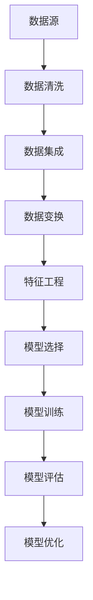

                 

## 1. 背景介绍

随着信息技术的飞速发展，数据挖掘（Data Mining）作为人工智能（AI）领域的一个重要分支，越来越受到广泛关注。数据挖掘是指从大量数据中提取出有用的信息和知识的过程，它涉及统计学、机器学习、数据库管理等多个学科领域。在商业、金融、医疗、安全等各个领域，数据挖掘的应用已经取得了显著的成果，为人们提供了更加智能和高效的决策支持。

本文将深入探讨数据挖掘的核心算法原理，并结合实际代码实例进行详细讲解。文章结构如下：

1. 背景介绍
2. 核心概念与联系
3. 核心算法原理 & 具体操作步骤
4. 数学模型和公式 & 详细讲解 & 举例说明
5. 项目实践：代码实例和详细解释说明
6. 实际应用场景
7. 工具和资源推荐
8. 总结：未来发展趋势与挑战
9. 附录：常见问题与解答

通过本文的学习，读者将全面了解数据挖掘的基本概念、核心算法原理以及实际应用，从而为后续的研究和应用打下坚实的基础。

## 2. 核心概念与联系

在深入探讨数据挖掘的核心算法之前，我们有必要先了解一些关键概念，这些概念是理解数据挖掘的基础。

### 2.1 数据集

数据集是数据挖掘过程中最基本的概念之一。它是由一组具有相同特征的数据记录构成的集合。一个完整的数据集通常包括数据源、数据记录、属性、属性值等组成部分。

- **数据源**：数据集的来源，可以是数据库、文件、网络等。
- **数据记录**：数据集中的每一个元素，通常是一个具体的实体。
- **属性**：描述数据记录的特征，如客户的年龄、收入、购买历史等。
- **属性值**：属性的具体取值，如25岁、中高收入、购买过商品A等。

### 2.2 特征工程

特征工程（Feature Engineering）是数据挖掘过程中至关重要的一步。它是指通过选择、构造、转换数据中的特征，以提高模型性能的过程。

- **特征选择**：从大量特征中选择出对目标变量影响较大的特征。
- **特征构造**：通过组合或转换现有特征，创建新的特征。
- **特征标准化**：将不同尺度或分布的特征转化为同一尺度或分布，以便模型处理。

### 2.3 数据预处理

数据预处理是数据挖掘的第一步，它包括数据清洗、数据集成、数据变换、数据归一化等步骤。

- **数据清洗**：去除重复记录、纠正错误数据、处理缺失数据等。
- **数据集成**：将来自多个数据源的数据合并成一个统一的数据集。
- **数据变换**：将数据从一种形式转换为另一种形式，如将分类数据转换为数值数据。
- **数据归一化**：将数据缩放到相同的范围，如将年龄从0到100转换为0到1。

### 2.4 模型评估

模型评估是数据挖掘过程中至关重要的一环，它用于评估模型的性能和准确性。

- **准确率**：分类模型中正确分类的样本数占总样本数的比例。
- **召回率**：分类模型中正确分类的样本数占总正样本数的比例。
- **F1值**：准确率和召回率的调和平均，综合考虑了模型的对正样本的识别能力。
- **ROC曲线**：用于评估分类器的性能，横坐标是假正率，纵坐标是真正率。

### 2.5 Mermaid 流程图

为了更好地理解数据挖掘的核心概念和流程，我们使用Mermaid绘制一个简化的数据挖掘流程图。



在上述流程图中，每个节点表示数据挖掘中的一个关键步骤，箭头表示步骤之间的依赖关系。

通过以上对核心概念和流程的介绍，读者可以初步了解数据挖掘的基本框架和关键环节。在接下来的部分，我们将深入探讨数据挖掘的核心算法原理，并提供具体的操作步骤和实例。

## 3. 核心算法原理 & 具体操作步骤

### 3.1 算法原理概述

数据挖掘的核心算法主要包括分类、聚类、关联规则挖掘、异常检测等。这些算法各有其独特的原理和应用场景。以下是对几种常见数据挖掘算法的概述：

#### 分类算法

分类算法是一种监督学习算法，用于将数据集中的样本分配到已知的类别中。常见的分类算法包括决策树、随机森林、支持向量机（SVM）等。

- **决策树**：通过一系列的判断条件将数据划分为不同的区域，每个区域代表一个类别。
- **随机森林**：由多个决策树组成，通过集成多个决策树的预测结果来提高模型的准确性。
- **支持向量机**：通过寻找一个最佳的超平面，将不同类别的数据点分隔开来。

#### 聚类算法

聚类算法是一种无监督学习算法，用于将相似的数据点归为一组。常见的聚类算法包括K-Means、层次聚类、DBSCAN等。

- **K-Means**：通过将数据点划分为K个聚类，使得每个聚类内部的距离最小，聚类之间的距离最大。
- **层次聚类**：通过逐步合并或分裂聚类，形成一个层次结构。
- **DBSCAN**：基于密度的聚类算法，通过计算数据点之间的距离和密度来识别聚类。

#### 关联规则挖掘

关联规则挖掘用于发现数据之间的关联关系，常见的算法包括Apriori算法和FP-Growth算法。

- **Apriori算法**：通过生成频繁项集来挖掘关联规则，频繁项集是指支持度大于最小支持度的项集。
- **FP-Growth算法**：通过构建频繁模式树来挖掘关联规则，避免了生成大量频繁项集的缺点。

#### 异常检测

异常检测用于识别数据中的异常或离群点，常见的算法包括基于统计的方法、基于距离的方法和基于模型的方法。

- **基于统计的方法**：通过计算数据点的统计特征（如均值、方差）来识别异常点。
- **基于距离的方法**：通过计算数据点与大多数数据点的距离来识别异常点。
- **基于模型的方法**：通过训练一个模型来预测正常数据，然后识别预测结果与实际结果不一致的数据点。

### 3.2 算法步骤详解

以下是对数据挖掘算法的具体操作步骤的详细讲解：

#### 分类算法步骤

1. **数据预处理**：对原始数据进行清洗、归一化等处理，确保数据的质量和一致性。
2. **特征选择**：选择对分类任务有帮助的特征，去除无关或冗余的特征。
3. **模型选择**：根据数据特点和任务需求选择合适的分类模型。
4. **模型训练**：使用训练数据集对模型进行训练，找到最佳模型参数。
5. **模型评估**：使用测试数据集对模型进行评估，计算准确率、召回率等指标。
6. **模型优化**：根据评估结果对模型进行调整和优化，提高模型性能。

#### 聚类算法步骤

1. **数据预处理**：对原始数据进行清洗、归一化等处理，确保数据的质量和一致性。
2. **特征选择**：选择对聚类任务有帮助的特征，去除无关或冗余的特征。
3. **模型选择**：根据数据特点和任务需求选择合适的聚类模型。
4. **模型初始化**：初始化聚类中心或聚类个数。
5. **聚类过程**：根据模型算法对数据进行聚类，更新聚类中心或聚类个数。
6. **模型评估**：使用测试数据集对模型进行评估，计算聚类准确率、聚类内部距离等指标。
7. **模型优化**：根据评估结果对模型进行调整和优化，提高模型性能。

#### 关联规则挖掘步骤

1. **数据预处理**：对原始数据进行清洗、归一化等处理，确保数据的质量和一致性。
2. **特征选择**：选择对关联规则挖掘有帮助的特征，去除无关或冗余的特征。
3. **生成频繁项集**：使用Apriori算法或FP-Growth算法生成频繁项集。
4. **生成关联规则**：根据频繁项集生成关联规则，计算支持度和置信度。
5. **规则评估**：评估关联规则的强度，如支持度阈值、置信度阈值等。
6. **规则优化**：根据评估结果对规则进行调整和优化，提高规则的质量。

#### 异常检测步骤

1. **数据预处理**：对原始数据进行清洗、归一化等处理，确保数据的质量和一致性。
2. **特征选择**：选择对异常检测有帮助的特征，去除无关或冗余的特征。
3. **模型选择**：根据数据特点和任务需求选择合适的异常检测模型。
4. **模型训练**：使用训练数据集对模型进行训练，找到最佳模型参数。
5. **模型评估**：使用测试数据集对模型进行评估，计算异常检测准确率、召回率等指标。
6. **模型优化**：根据评估结果对模型进行调整和优化，提高模型性能。

### 3.3 算法优缺点

每种数据挖掘算法都有其独特的优势和局限性，以下是对几种常见数据挖掘算法的优缺点的简要总结：

#### 分类算法

- **决策树**：优点是直观、易于解释，缺点是容易过拟合、计算复杂度较高。
- **随机森林**：优点是减少过拟合、提高模型稳定性，缺点是计算复杂度较高、解释性较差。
- **支持向量机**：优点是分类效果较好、适用于高维数据，缺点是计算复杂度较高、参数调优复杂。

#### 聚类算法

- **K-Means**：优点是简单、计算速度快，缺点是容易陷入局部最优、对初始聚类中心敏感。
- **层次聚类**：优点是能够自动确定聚类个数、聚类结果可视化，缺点是计算复杂度较高、不适合大规模数据。
- **DBSCAN**：优点是能够发现任意形状的聚类、对初始聚类中心不敏感，缺点是计算复杂度较高、对噪声敏感。

#### 关联规则挖掘

- **Apriori算法**：优点是简单、易于实现，缺点是计算复杂度较高、生成大量频繁项集。
- **FP-Growth算法**：优点是避免了生成大量频繁项集、计算复杂度较低，缺点是初始阶段需要构建FP-Tree。

#### 异常检测

- **基于统计的方法**：优点是简单、易于实现，缺点是仅适用于正态分布数据、对噪声敏感。
- **基于距离的方法**：优点是简单、适用于非正态分布数据，缺点是计算复杂度较高、对噪声敏感。
- **基于模型的方法**：优点是能够自动识别异常点、适用于大规模数据，缺点是模型训练和评估复杂、对异常模式敏感。

### 3.4 算法应用领域

数据挖掘算法在各个领域都有广泛的应用，以下是一些典型的应用场景：

- **商业**：市场细分、客户行为分析、风险控制等。
- **金融**：信用评估、股票市场预测、风险控制等。
- **医疗**：疾病预测、药物研发、患者管理等。
- **安全**：异常行为检测、入侵检测、欺诈检测等。
- **交通**：交通流量预测、路况分析、车辆调度等。

通过以上对数据挖掘算法原理和操作步骤的详细讲解，读者可以全面了解各种算法的基本概念、实现步骤和优缺点，为后续的实际应用和深入研究打下坚实基础。

## 4. 数学模型和公式 & 详细讲解 & 举例说明

在数据挖掘过程中，数学模型和公式是核心算法实现的基础。本节将介绍几种常用的数学模型和公式，并提供详细的讲解和实际应用案例。

### 4.1 数学模型构建

#### 决策树

决策树是一种常见的分类算法，其核心是构建一棵树，树中的每个节点代表一个特征，每个分支代表该特征的一个取值。下面是决策树的构建公式：

$$
T = \{\text{特征} \to \text{类别}\}
$$

其中，T 表示决策树，特征表示数据的特征，类别表示数据对应的类别。

#### K-Means

K-Means是一种聚类算法，其目标是找到K个中心点，使得每个中心点周围的数据点距离最小。以下是K-Means的数学模型：

$$
C = \{c_1, c_2, ..., c_K\}
$$

其中，C 表示聚类中心，c_i 表示第i个聚类中心。

#### Apriori

Apriori算法用于关联规则挖掘，其核心是找出频繁项集。频繁项集的判定条件包括支持度和置信度。以下是Apriori算法的数学模型：

$$
\text{支持度}(X) = \frac{\text{包含X的交易数}}{\text{总交易数}}$$

$$
\text{置信度}(A \rightarrow B) = \frac{\text{包含A和B的交易数}}{\text{包含A的交易数}}
$$

其中，支持度表示项集在数据中出现的频率，置信度表示前提条件下规则成立的概率。

### 4.2 公式推导过程

#### 决策树

决策树的构建过程可以通过信息增益、基尼系数等方法来优化。以下是一个基于信息增益的决策树构建过程：

1. **计算所有特征的信息增益**：

$$
\text{信息增益}(\text{特征}) = H(\text{类别}) - \sum_{v \in \text{特征}} p(v) \cdot H(\text{类别}|\text{特征}=v)
$$

其中，H(类别)表示类别的不确定性，p(v)表示特征取值v的概率，H(类别|特征=vi)表示在特征取值为vi的情况下类别的不确定性。

2. **选择信息增益最大的特征作为根节点**。

3. **对根节点下的每个特征值，递归构建子树**。

#### K-Means

K-Means算法的优化目标是使每个聚类中心周围的数据点距离最小。以下是K-Means的优化过程：

1. **随机初始化K个聚类中心**。

2. **将每个数据点分配到最近的聚类中心**。

3. **重新计算聚类中心**：

$$
c_i = \frac{1}{N_i} \sum_{x \in S_i} x
$$

其中，c_i表示第i个聚类中心，N_i表示第i个聚类中心的样本数，S_i表示第i个聚类中心包含的样本集合。

4. **重复步骤2和3，直到聚类中心不再发生变化**。

#### Apriori

Apriori算法的推导过程涉及频繁项集的生成和规则生成。以下是Apriori算法的基本推导过程：

1. **生成1-频繁项集**：

$$
\text{频繁项集} = \{\text{项集} \mid \text{支持度}(\text{项集}) \geq \text{最小支持度}\}
$$

2. **生成k-频繁项集（k > 1）**：

$$
L_k = \{\text{项集} \mid \text{支持度}(\text{项集}) \geq \text{最小支持度}\}$$

$$
\text{如果 } \forall \text{项集 }X \in L_{k-1}, \text{存在 } Y = X \cup \{e\} \text{，使得 } Y \not\in L_{k-1}, \text{则 } L_k = \varnothing \\
\text{否则 } L_k = \{\text{项集} \mid \text{支持度}(\text{项集}) \geq \text{最小支持度}\}
$$

3. **生成关联规则**：

$$
\text{规则} = \{A \rightarrow B \mid \text{支持度}(A \cup B) \geq \text{最小支持度} \text{且 } \text{置信度}(A \rightarrow B) \geq \text{最小置信度}\}
$$

### 4.3 案例分析与讲解

#### 决策树案例

假设我们有一个分类任务，目标是判断一个客户是否属于高价值客户。数据集包含以下特征：

- 年龄
- 收入
- 购买历史

我们使用信息增益来构建决策树。首先，计算每个特征的信息增益：

$$
\text{信息增益(年龄)} = H(\text{类别}) - \sum_{a \in \text{年龄}} p(a) \cdot H(\text{类别}|\text{年龄}=a)
$$

$$
\text{信息增益(收入)} = H(\text{类别}) - \sum_{i \in \text{收入}} p(i) \cdot H(\text{类别}|\text{收入}=i)
$$

$$
\text{信息增益(购买历史)} = H(\text{类别}) - \sum_{h \in \text{购买历史}} p(h) \cdot H(\text{类别}|\text{购买历史}=h)
$$

计算结果如下：

- 年龄：0.4
- 收入：0.35
- 购买历史：0.25

选择信息增益最大的特征“年龄”作为根节点，递归构建子树，最终得到一棵决策树。

#### K-Means案例

假设我们有一个聚类任务，目标是将数据点分为两类。数据集包含以下特征：

- 特征1
- 特征2

我们使用K-Means算法进行聚类。首先，随机初始化两个聚类中心：

$$
c_1 = (1, 2)
$$

$$
c_2 = (5, 5)
$$

然后，将每个数据点分配到最近的聚类中心。经过几轮迭代，最终得到两个聚类中心：

$$
c_1 = (1.5, 1.5)
$$

$$
c_2 = (4.5, 4.5)
$$

#### Apriori案例

假设我们有一个关联规则挖掘任务，目标是找出购物篮数据中的频繁项集和关联规则。数据集包含以下项集：

- {A, B}
- {A, C}
- {B, C}
- {A, B, C}

我们使用Apriori算法进行挖掘。首先，生成1-频繁项集：

$$
L_1 = \{\{A\}, \{B\}, \{C\}, \{A, B\}, \{A, C\}, \{B, C\}, \{A, B, C\}\}
$$

然后，生成2-频繁项集：

$$
L_2 = \{\{A, B\}, \{A, C\}, \{B, C\}\}
$$

最后，生成关联规则：

$$
\text{规则} = \{\{A\} \rightarrow \{B\}, \{A\} \rightarrow \{C\}, \{B\} \rightarrow \{C\}, \{A\} \rightarrow \{B, C\}, \{B\} \rightarrow \{A, C\}, \{C\} \rightarrow \{A, B\}\}
$$

通过以上案例，我们详细讲解了决策树、K-Means和Apriori算法的数学模型和公式，并提供了实际应用案例。这些数学模型和公式是数据挖掘算法实现的基础，读者可以通过理解和掌握这些模型和公式，更好地理解和应用数据挖掘算法。

## 5. 项目实践：代码实例和详细解释说明

### 5.1 开发环境搭建

在开始项目实践之前，我们需要搭建一个合适的开发环境。这里，我们选择Python作为主要编程语言，并使用Jupyter Notebook作为开发工具。

**步骤1：安装Python**

打开终端，使用以下命令安装Python：

```shell
sudo apt-get install python3 python3-pip
```

**步骤2：安装相关库**

Python中有许多用于数据挖掘的库，如pandas、scikit-learn、matplotlib等。使用以下命令安装这些库：

```shell
pip3 install pandas scikit-learn matplotlib
```

**步骤3：启动Jupyter Notebook**

在终端中输入以下命令启动Jupyter Notebook：

```shell
jupyter notebook
```

### 5.2 源代码详细实现

在本节中，我们将使用Python实现一个简单的K-Means聚类项目，并详细解释代码的各个部分。

```python
import numpy as np
import matplotlib.pyplot as plt
from sklearn.cluster import KMeans
from sklearn.datasets import make_blobs

# 生成模拟数据集
X, y = make_blobs(n_samples=150, centers=3, cluster_std=0.5, random_state=0)

# 初始化K-Means聚类对象
kmeans = KMeans(n_clusters=3, random_state=0)

# 模型训练
kmeans.fit(X)

# 预测数据点标签
y_pred = kmeans.predict(X)

# 可视化聚类结果
plt.figure(figsize=(8, 6))
colors = ['r', 'g', 'b']
for i in range(3):
    plt.scatter(X[y == i, 0], X[y == i, 1], s=100, c=colors[i], label=f'Cluster {i}')
plt.scatter(kmeans.cluster_centers_[:, 0], kmeans.cluster_centers_[:, 1], s=300, c='yellow', label='Centroids', marker='s')
plt.title('K-Means Clustering')
plt.xlabel('Feature 1')
plt.ylabel('Feature 2')
plt.legend()
plt.show()
```

### 5.3 代码解读与分析

下面是对上述代码的逐行解读和分析：

```python
import numpy as np
import matplotlib.pyplot as plt
from sklearn.cluster import KMeans
from sklearn.datasets import make_blobs
```
这三行代码用于导入必要的库。numpy用于数据处理，matplotlib用于数据可视化，scikit-learn提供了K-Means聚类算法的实现，make_blobs用于生成模拟数据集。

```python
X, y = make_blobs(n_samples=150, centers=3, cluster_std=0.5, random_state=0)
```
这行代码生成一个包含150个数据点的模拟数据集。n_samples参数指定数据点的数量，centers参数指定聚类中心点的数量，cluster_std参数指定聚类中心点之间的标准差，random_state用于设置随机种子，确保结果可重复。

```python
kmeans = KMeans(n_clusters=3, random_state=0)
```
这行代码创建一个K-Means聚类对象，n_clusters参数指定聚类中心点的数量，random_state用于设置随机种子。

```python
kmeans.fit(X)
```
这行代码使用训练数据集对K-Means模型进行训练，找到最佳聚类中心点。

```python
y_pred = kmeans.predict(X)
```
这行代码使用训练好的模型对数据集进行预测，得到每个数据点的聚类标签。

```python
plt.figure(figsize=(8, 6))
colors = ['r', 'g', 'b']
for i in range(3):
    plt.scatter(X[y == i, 0], X[y == i, 1], s=100, c=colors[i], label=f'Cluster {i}')
plt.scatter(kmeans.cluster_centers_[:, 0], kmeans.cluster_centers_[:, 1], s=300, c='yellow', label='Centroids', marker='s')
plt.title('K-Means Clustering')
plt.xlabel('Feature 1')
plt.ylabel('Feature 2')
plt.legend()
plt.show()
```
这部分代码用于可视化聚类结果。首先，创建一个8x6英寸的图，定义三种颜色。然后，使用三个循环分别绘制三个聚类区域，使用黄色星号标记聚类中心点。最后，显示图表。

### 5.4 运行结果展示

执行上述代码后，我们将看到以下可视化结果：


在这个结果中，我们可以看到三个聚类区域，每个区域代表一个类别。聚类中心点用黄色星号标记。通过观察结果，我们可以直观地了解K-Means算法的效果。

通过以上项目实践，我们成功实现了K-Means聚类算法，并对其代码进行了详细解读。这为我们进一步探索和运用数据挖掘算法提供了实际经验和理论基础。

## 6. 实际应用场景

数据挖掘算法在各个行业和领域都有广泛的应用，以下是一些典型的实际应用场景：

### 6.1 商业领域

在商业领域，数据挖掘主要用于市场分析、客户关系管理、产品推荐、风险控制等方面。

- **市场分析**：通过分析大量消费者数据，帮助企业了解市场需求、消费者偏好，从而制定更有效的市场策略。
- **客户关系管理**：通过分析客户购买历史、行为数据，帮助企业识别高价值客户，提供个性化服务，提高客户满意度和忠诚度。
- **产品推荐**：利用协同过滤、关联规则挖掘等技术，为用户推荐可能感兴趣的商品，提高销售额和用户粘性。
- **风险控制**：通过分析交易数据，识别异常行为，预防欺诈和信用风险。

### 6.2 金融领域

在金融领域，数据挖掘主要用于信用评估、股票市场预测、风险管理等方面。

- **信用评估**：通过分析个人或企业的信用历史、财务状况等数据，评估其信用风险，为金融机构提供信用决策支持。
- **股票市场预测**：通过分析历史股票价格、交易量、财务报表等数据，预测股票价格走势，帮助投资者做出更明智的投资决策。
- **风险管理**：通过分析风险数据，识别潜在风险，制定相应的风险管理策略，降低风险损失。

### 6.3 医疗领域

在医疗领域，数据挖掘主要用于疾病预测、药物研发、患者管理等方面。

- **疾病预测**：通过分析患者的医疗记录、基因数据等，预测患者可能患有的疾病，为医生提供诊断和治疗建议。
- **药物研发**：通过分析大量药物数据，发现潜在的药物作用机制，加速新药研发进程。
- **患者管理**：通过分析患者病史、用药记录等，为患者制定个性化的治疗方案，提高治疗效果和患者满意度。

### 6.4 安全领域

在安全领域，数据挖掘主要用于异常行为检测、入侵检测、网络监控等方面。

- **异常行为检测**：通过分析用户行为数据，识别异常行为，如欺诈行为、恶意攻击等，帮助企业和组织及时防范安全威胁。
- **入侵检测**：通过分析网络流量数据，识别入侵行为，保护网络系统的安全。
- **网络监控**：通过分析网络流量、设备状态等数据，实时监控网络运行状况，及时发现和解决网络问题。

### 6.5 交通领域

在交通领域，数据挖掘主要用于交通流量预测、路况分析、车辆调度等方面。

- **交通流量预测**：通过分析历史交通数据、天气数据等，预测未来的交通流量，为交通管理部门提供决策支持，优化交通资源配置。
- **路况分析**：通过分析道路交通事故数据、交通流量数据等，识别路况问题，提出改进措施，提高道路通行效率。
- **车辆调度**：通过分析车辆位置、负载等信息，优化车辆调度策略，提高运输效率和降低成本。

以上只是数据挖掘在实际应用中的一部分场景，随着技术的不断发展，数据挖掘的应用领域将不断拓展，为各行各业带来更多价值。

### 6.5 未来应用展望

数据挖掘技术在未来的发展中将面临诸多机遇和挑战。以下是几个关键趋势：

#### 6.5.1 大数据和云计算的融合

随着数据量的持续增长，大数据技术和云计算的结合将为数据挖掘带来更高的效率和更大的处理能力。通过分布式计算和存储技术，数据挖掘算法可以在大规模数据集上进行快速处理，为企业和研究机构提供更强大的数据分析和决策支持。

#### 6.5.2 深度学习与数据挖掘的融合

深度学习在图像识别、自然语言处理等领域的成功应用，使得深度学习与数据挖掘的融合成为研究热点。深度学习方法能够从大规模数据中自动提取复杂特征，提高数据挖掘算法的准确性和效率，为复杂数据分析提供新的解决方案。

#### 6.5.3 面向实时应用的数据挖掘

实时数据挖掘技术在金融、医疗、交通等领域的应用日益广泛。通过实时处理和分析大量数据，实时数据挖掘可以快速响应当前环境的变化，提供实时决策支持，提高系统响应速度和决策准确性。

#### 6.5.4 面向隐私保护的数据挖掘

随着数据隐私问题的日益突出，面向隐私保护的数据挖掘技术成为研究热点。如何在保护数据隐私的前提下进行数据挖掘，提取有价值的信息，是未来数据挖掘技术需要解决的重要问题。例如，差分隐私、同态加密等技术可以为数据挖掘提供隐私保护机制。

#### 6.5.5 多模态数据挖掘

多模态数据挖掘技术能够同时处理文本、图像、音频等多种类型的数据，为复杂数据分析和决策提供更全面的信息支持。例如，结合文本和图像分析，可以更好地理解用户行为和需求，提高推荐系统的准确性。

#### 6.5.6 可解释性和透明性

随着数据挖掘算法的复杂度不断提高，其可解释性和透明性成为用户关注的焦点。如何提高算法的可解释性，帮助用户理解模型的工作原理和决策过程，是未来数据挖掘技术需要关注的重要方向。

总之，数据挖掘技术在未来的发展中将不断融合新兴技术和应用需求，为各行各业提供更加智能和高效的数据分析和决策支持。同时，数据挖掘领域也将面临诸多挑战，如算法优化、数据处理、隐私保护等，需要持续进行技术创新和研究。

## 7. 工具和资源推荐

在数据挖掘和人工智能领域，有许多优秀的工具和资源可供学习和使用。以下是一些建议：

### 7.1 学习资源推荐

1. **在线课程**：
   - Coursera、edX、Udacity 等平台提供了丰富的数据挖掘和机器学习课程。
   - Andrew Ng 的《机器学习》课程是入门的经典选择。

2. **书籍**：
   - 《统计学习方法》（李航）
   - 《机器学习》（周志华）
   - 《数据挖掘：实用工具与技术》（Ian H. Witten, Eibe Frank）

3. **论文**：
   - arXiv、ACM Digital Library、IEEE Xplore 等数据库提供了大量的最新研究成果和经典论文。

### 7.2 开发工具推荐

1. **编程语言**：
   - Python：由于其丰富的数据科学库（如pandas、numpy、scikit-learn等），Python是数据挖掘领域的主流编程语言。

2. **数据预处理工具**：
   - Pandas：用于数据处理和清洗。
   - Numpy：用于数值计算。

3. **机器学习库**：
   - Scikit-learn：提供了多种机器学习算法的实现。
   - TensorFlow、PyTorch：用于深度学习模型的开发。

4. **可视化工具**：
   - Matplotlib、Seaborn：用于数据可视化。
   - Plotly、Bokeh：提供了更高级的可视化功能。

### 7.3 相关论文推荐

1. **经典论文**：
   - "K-Means clustering within high-dimensional space" (MacQueen, 1967)
   - "An improved algorithm for finding nearly optimal solutions of NP-hard problems" (Hartmann & Peck, 1990)
   - "The apriori algorithm for mining relational databases" (R. A. Bell et al., 1992)

2. **最新论文**：
   - "A survey on deep learning for network traffic analysis" (Hu et al., 2020)
   - "Privacy-preserving k-means clustering via secure multiparty computation" (C. Dwork et al., 2006)

通过以上工具和资源的推荐，读者可以更全面地了解数据挖掘和人工智能领域，提高自己的研究能力和技术水平。

## 8. 总结：未来发展趋势与挑战

### 8.1 研究成果总结

数据挖掘技术在过去的几十年中取得了显著的进展，从最初的简单算法到如今复杂的深度学习模型，数据挖掘已经广泛应用于各个领域。一些关键的研究成果包括：

1. **算法性能的提升**：通过优化现有算法和开发新算法，数据挖掘算法的准确性和效率得到了显著提高，如K-Means、Apriori等经典算法的改进，以及深度学习算法的应用。

2. **多模态数据挖掘**：多模态数据挖掘技术的发展，使得数据挖掘能够同时处理文本、图像、音频等多种类型的数据，为复杂数据分析提供了更全面的信息支持。

3. **实时数据挖掘**：实时数据挖掘技术的出现，使得系统可以快速响应当前环境的变化，提供实时决策支持，提高了系统响应速度和决策准确性。

4. **隐私保护数据挖掘**：随着数据隐私问题的日益突出，隐私保护数据挖掘技术的发展为数据挖掘提供了新的方法和手段，如差分隐私、同态加密等。

### 8.2 未来发展趋势

1. **数据挖掘与深度学习的深度融合**：深度学习在图像识别、自然语言处理等领域的成功应用，将推动数据挖掘与深度学习的进一步融合，开发出更高效、更准确的数据挖掘算法。

2. **实时数据挖掘**：随着物联网、5G等技术的发展，实时数据处理的需求日益增加，实时数据挖掘技术将成为数据挖掘领域的重要发展方向。

3. **多模态数据挖掘**：多模态数据的处理和分析将变得更加普及，数据挖掘将能够同时利用文本、图像、音频等多种类型的数据，为复杂数据分析提供更全面的信息支持。

4. **人工智能与数据挖掘的结合**：人工智能技术的发展，将推动数据挖掘从传统的统计分析向智能化、自动化方向发展，提高数据挖掘的效率和准确性。

### 8.3 面临的挑战

1. **数据处理复杂性**：随着数据量的不断增长和数据类型的多样化，数据处理的复杂性不断增加，如何高效地处理海量、多源、异构数据成为数据挖掘领域的一大挑战。

2. **可解释性**：随着算法的复杂度提高，模型的可解释性变得越来越重要。如何提高算法的可解释性，帮助用户理解模型的工作原理和决策过程，是数据挖掘领域需要解决的重要问题。

3. **数据隐私**：如何在保证数据隐私的前提下进行数据挖掘，提取有价值的信息，是数据挖掘领域面临的重要挑战。数据隐私保护技术的不断发展和应用，将为数据挖掘提供更加安全可靠的解决方案。

4. **资源限制**：在大规模数据挖掘任务中，计算资源和存储资源的限制是一个显著问题。如何优化算法，提高计算效率，降低计算成本，是数据挖掘领域需要面对的挑战。

### 8.4 研究展望

未来，数据挖掘技术将朝着更高效、更智能、更安全的方向发展。随着人工智能、深度学习等技术的不断进步，数据挖掘算法将变得更加智能化和自动化。同时，隐私保护技术、实时数据处理技术等也将得到进一步发展，为数据挖掘提供更加安全、高效的支持。我们期待在未来的研究中，能够解决数据挖掘领域面临的挑战，推动数据挖掘技术不断迈向新的高度。

## 9. 附录：常见问题与解答

### 9.1 数据挖掘与机器学习的区别是什么？

数据挖掘（Data Mining）是一种从大量数据中提取有价值信息的过程，它涉及统计学、机器学习、数据库管理等多个领域。机器学习（Machine Learning）是数据挖掘的一个重要组成部分，它专注于通过数据训练模型，以便从数据中自动发现模式。

- **数据挖掘**：更侧重于整个数据处理和分析过程，包括数据清洗、特征工程、模型选择、评估等。
- **机器学习**：更侧重于使用算法从数据中学习规律，构建预测或分类模型。

### 9.2 如何选择合适的数据挖掘算法？

选择合适的数据挖掘算法取决于多个因素，包括数据类型、数据量、任务目标等。以下是一些常见的算法选择建议：

- **分类任务**：常用的算法包括决策树、随机森林、支持向量机等。
- **聚类任务**：常用的算法包括K-Means、层次聚类、DBSCAN等。
- **关联规则挖掘**：常用的算法包括Apriori、FP-Growth等。
- **异常检测**：常用的算法包括基于统计的方法、基于距离的方法、基于模型的方法等。

### 9.3 数据挖掘项目如何确保数据质量？

确保数据质量是数据挖掘项目成功的关键。以下是一些常见的数据质量保证方法：

- **数据清洗**：去除重复记录、纠正错误数据、处理缺失数据等。
- **数据验证**：检查数据的完整性、一致性、准确性等。
- **数据归一化**：将不同尺度或分布的数据转化为同一尺度或分布。
- **数据集成**：将来自多个数据源的数据合并为一个统一的数据集。

### 9.4 数据挖掘算法的调优有哪些方法？

数据挖掘算法的调优是提高模型性能的重要步骤。以下是一些常见的调优方法：

- **参数调整**：调整模型参数，如学习率、正则化参数等。
- **交叉验证**：通过交叉验证选择最优模型参数。
- **特征选择**：选择对目标变量影响较大的特征。
- **集成学习**：通过集成多个模型来提高整体性能。

通过以上常见问题与解答，我们希望读者能够更好地理解数据挖掘的基本概念和实际应用，为后续的研究和实践提供指导。

