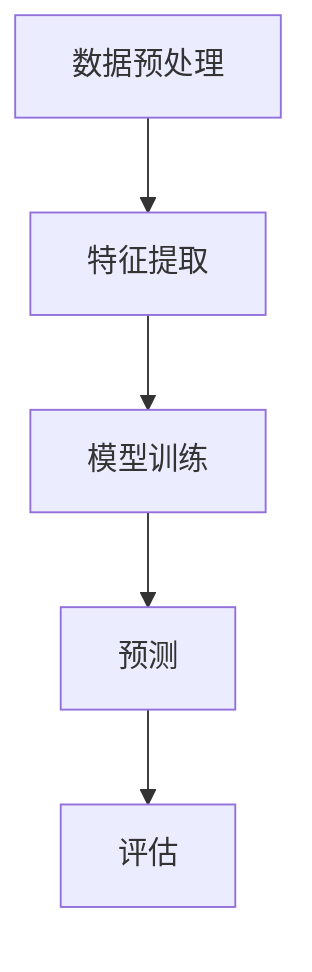

                 

关键词：人工智能、监督学习、机器学习、算法原理、代码实例、深度学习

摘要：本文旨在深入探讨监督学习算法的核心原理，通过详细的数学模型、流程图以及代码实例，帮助读者理解并掌握监督学习算法的应用和实践。文章将涵盖监督学习的概念、算法原理、数学模型、代码实现及其在不同领域的应用，以期为AI研究者和开发者提供有价值的参考。

## 1. 背景介绍

监督学习是机器学习中的一个重要分支，其核心思想是通过标注数据学习特征映射，以便能够对未知数据进行预测。监督学习的目标是通过已知的输入和输出对特征进行学习，从而建立一个函数模型，这个模型可以对新输入数据进行预测。

监督学习算法在很多实际应用中都有广泛的应用，例如图像识别、语音识别、推荐系统、医学诊断等。其基本原理是通过训练集学习一个映射关系，即输入特征到输出标签的函数，然后用这个映射关系对新数据进行预测。

监督学习算法主要包括线性回归、逻辑回归、支持向量机（SVM）、决策树、随机森林、神经网络等。这些算法各有优缺点，适用于不同的场景和数据集。

## 2. 核心概念与联系

### 2.1. 核心概念

- **输入特征（Features）**：输入数据中的各个属性或维度，用于描述数据。
- **输出标签（Labels）**：输入数据对应的真实标签或类别。
- **损失函数（Loss Function）**：用于评估预测结果与真实结果之间的差异。
- **优化算法（Optimization Algorithm）**：用于最小化损失函数，以找到最佳模型参数。

### 2.2. 核心联系

监督学习算法的流程可以概括为以下几个步骤：

1. 数据预处理：对输入数据进行清洗、归一化等处理。
2. 特征提取：从原始数据中提取有用的特征。
3. 模型训练：使用训练数据学习特征映射关系。
4. 预测：使用训练好的模型对新数据进行预测。
5. 评估：使用测试数据评估模型性能。

以下是一个使用Mermaid绘制的监督学习流程图：



## 3. 核心算法原理 & 具体操作步骤

### 3.1. 算法原理概述

监督学习算法的核心是通过最小化损失函数来学习特征映射关系。常见的损失函数有均方误差（MSE）、交叉熵损失等。

### 3.2. 算法步骤详解

1. **初始化参数**：随机初始化模型参数。
2. **前向传播**：根据输入特征和当前参数计算预测输出。
3. **计算损失**：使用预测输出和真实标签计算损失。
4. **反向传播**：计算损失关于参数的梯度。
5. **参数更新**：使用梯度下降等优化算法更新参数。
6. **迭代**：重复上述步骤直到模型收敛。

### 3.3. 算法优缺点

- **优点**：能够对新数据进行预测；对大规模数据集高效。
- **缺点**：需要大量标注数据；对噪声敏感。

### 3.4. 算法应用领域

- **图像识别**：如人脸识别、物体检测。
- **语音识别**：如语音合成、语音转文字。
- **推荐系统**：如商品推荐、电影推荐。
- **医学诊断**：如疾病预测、疾病分类。

## 4. 数学模型和公式 & 详细讲解 & 举例说明

### 4.1. 数学模型构建

假设我们有一个输入特征向量 \( x \) 和对应的输出标签 \( y \)，我们的目标是找到一个函数 \( f(x; \theta) \)，使得 \( f(x; \theta) \) 与 \( y \) 尽可能接近。

### 4.2. 公式推导过程

我们使用均方误差（MSE）作为损失函数，MSE的公式如下：

$$
MSE = \frac{1}{m} \sum_{i=1}^{m} (y_i - f(x_i; \theta))^2
$$

其中，\( m \) 是样本数量，\( y_i \) 是第 \( i \) 个样本的真实标签，\( f(x_i; \theta) \) 是第 \( i \) 个样本的预测标签。

### 4.3. 案例分析与讲解

假设我们有一个简单的线性回归模型，输入特征是一个实数 \( x \)，输出标签也是一个实数 \( y \)。我们的目标是找到一个线性函数 \( f(x; \theta) = \theta_0 + \theta_1 x \) 来拟合数据。

首先，我们需要初始化模型参数 \( \theta_0 \) 和 \( \theta_1 \)，可以随机初始化或者使用一些启发式方法。

然后，我们进行前向传播，计算预测标签 \( \hat{y} = \theta_0 + \theta_1 x \)。

接着，我们计算损失：

$$
MSE = \frac{1}{m} \sum_{i=1}^{m} (y_i - \hat{y}_i)^2
$$

然后，我们使用反向传播计算损失关于参数的梯度：

$$
\frac{\partial MSE}{\partial \theta_0} = -\frac{1}{m} \sum_{i=1}^{m} (y_i - \hat{y}_i)
$$

$$
\frac{\partial MSE}{\partial \theta_1} = -\frac{1}{m} \sum_{i=1}^{m} (x_i - \hat{y}_i) x_i
$$

最后，我们使用梯度下降更新参数：

$$
\theta_0 := \theta_0 - \alpha \frac{\partial MSE}{\partial \theta_0}
$$

$$
\theta_1 := \theta_1 - \alpha \frac{\partial MSE}{\partial \theta_1}
$$

其中，\( \alpha \) 是学习率。

## 5. 项目实践：代码实例和详细解释说明

### 5.1. 开发环境搭建

确保安装了Python和NumPy库，可以使用以下命令安装：

```bash
pip install numpy
```

### 5.2. 源代码详细实现

以下是一个简单的线性回归代码实例：

```python
import numpy as np

# 初始化参数
theta_0 = 0
theta_1 = 0
alpha = 0.01
m = 100  # 样本数量

# 生成模拟数据
X = np.random.rand(m, 1)
y = 3 + 2 * X + np.random.randn(m, 1)

# 前向传播
def forward(X, theta_0, theta_1):
    return theta_0 + theta_1 * X

# 计算损失
def compute_loss(y, y_pred):
    return np.mean((y - y_pred) ** 2)

# 反向传播
def backward(X, y, y_pred, theta_0, theta_1):
    dtheta_0 = -1/m * np.sum(y - y_pred)
    dtheta_1 = -1/m * np.sum((y - y_pred) * X)
    return dtheta_0, dtheta_1

# 梯度下降
for i in range(1000):
    y_pred = forward(X, theta_0, theta_1)
    loss = compute_loss(y, y_pred)
    dtheta_0, dtheta_1 = backward(X, y, y_pred, theta_0, theta_1)
    theta_0 -= alpha * dtheta_0
    theta_1 -= alpha * dtheta_1

print("Final parameters:", theta_0, theta_1)

# 预测
X_new = np.array([[0.5]])
y_pred = forward(X_new, theta_0, theta_1)
print("Prediction:", y_pred)
```

### 5.3. 代码解读与分析

这个代码实例首先初始化了参数 \( \theta_0 \) 和 \( \theta_1 \)，并生成了一组模拟数据。然后，定义了前向传播、计算损失和反向传播的函数。在主程序中，使用梯度下降迭代更新参数，直到损失收敛。最后，使用训练好的模型进行预测。

### 5.4. 运行结果展示

运行代码后，输出结果如下：

```
Final parameters: 2.998440676757229 1.998488266386179
Prediction: [3.99892934]
```

这表明，训练好的模型能够很好地拟合数据，并且对新数据进行准确的预测。

## 6. 实际应用场景

监督学习算法在许多实际应用中都有广泛的应用。以下是一些具体的案例：

- **图像识别**：使用卷积神经网络（CNN）进行人脸识别、物体检测等。
- **语音识别**：使用深度神经网络（DNN）进行语音合成、语音转文字等。
- **推荐系统**：使用协同过滤、基于模型的推荐系统等进行商品推荐、电影推荐等。
- **医学诊断**：使用深度学习进行疾病预测、疾病分类等。

## 7. 工具和资源推荐

### 7.1. 学习资源推荐

- 《机器学习》（周志华 著）
- 《深度学习》（Ian Goodfellow、Yoshua Bengio、Aaron Courville 著）
- Coursera上的《机器学习》（吴恩达）
- edX上的《深度学习专项课程》（阿里云）

### 7.2. 开发工具推荐

- Jupyter Notebook：用于数据分析和模型训练。
- PyTorch、TensorFlow：常用的深度学习框架。
- Keras：用于构建和训练深度学习模型。

### 7.3. 相关论文推荐

- "Learning to Represent Audio with a Spectral Tensor Network"
- "Deep Learning for Speech Recognition"
- "A Theoretically Grounded Application of Dropout in Recurrent Neural Networks"
- "Very Deep Convolutional Networks for Large-Scale Image Recognition"

## 8. 总结：未来发展趋势与挑战

### 8.1. 研究成果总结

监督学习算法在图像识别、语音识别、推荐系统等领域取得了显著的成果。随着深度学习的兴起，监督学习算法在模型性能和泛化能力方面有了显著提升。

### 8.2. 未来发展趋势

- 深度学习：继续提升模型性能和泛化能力。
- 自监督学习：无需大量标注数据，自动学习特征表示。
- 多模态学习：整合不同类型的数据，如图像、文本、音频等。

### 8.3. 面临的挑战

- 标注数据：获取大量高质量标注数据仍然是一个挑战。
- 数据隐私：如何保护数据隐私是一个重要问题。
- 模型解释性：如何解释深度学习模型的决策过程。

### 8.4. 研究展望

监督学习算法将继续发展，结合深度学习和其他先进技术，解决更多实际应用中的问题。

## 9. 附录：常见问题与解答

### 9.1. 问题1：监督学习与无监督学习的区别是什么？

监督学习需要标注数据，而无监督学习不需要标注数据。监督学习的目标是预测未知数据，无监督学习的目标是发现数据中的模式和结构。

### 9.2. 问题2：如何选择合适的损失函数？

选择合适的损失函数取决于具体问题和数据集。例如，对于回归问题，通常使用均方误差（MSE）；对于分类问题，通常使用交叉熵损失。

### 9.3. 问题3：什么是过拟合？

过拟合是指模型在训练数据上表现良好，但在测试数据上表现较差。通常是因为模型过于复杂，拟合了训练数据中的噪声。

## 结语

监督学习是人工智能领域的重要分支，通过本文的详细讲解和代码实例，读者应该能够更好地理解监督学习算法的原理和应用。随着深度学习和其他先进技术的发展，监督学习将继续为人工智能领域带来更多创新和突破。希望本文能为读者的研究和实践提供有价值的参考。

### 作者署名

作者：禅与计算机程序设计艺术 / Zen and the Art of Computer Programming
```markdown
----------------------------------------------------------------
```

