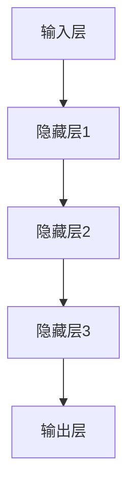

                 

关键词：人工智能，深度学习，生物信息学，算法应用，数学模型，代码实例，工具推荐

## 摘要

本文将深入探讨人工智能（AI）中的深度学习算法在生物信息学领域中的应用。通过对核心概念、算法原理、数学模型及代码实例的详细阐述，本文旨在为读者提供一个全面而系统的认识，帮助理解深度学习算法在生物信息学研究中的重要性和实际应用。文章还介绍了未来应用前景、相关工具和资源，并对研究领域的发展趋势和挑战进行了展望。

## 1. 背景介绍

生物信息学是一门跨学科领域，涉及生物学、计算机科学和信息科学，旨在理解和分析生物数据。近年来，随着基因组学和生物信息学技术的快速发展，生物数据量呈现爆炸式增长。这使得传统数据分析方法难以满足需求，因此，人工智能，特别是深度学习算法，被广泛应用于生物信息学研究中。

深度学习是一种模仿人脑结构的机器学习技术，通过多层神经网络对数据进行特征学习和模式识别。与传统机器学习方法相比，深度学习能够自动提取数据的复杂特征，从而提高数据分析的准确性和效率。

生物信息学领域包括基因序列分析、蛋白质结构预测、生物网络分析、药物发现等多个子领域。这些领域的数据特征复杂、多样性高，对算法的要求也日益提高。深度学习算法的出现，为这些问题的解决提供了新的思路和方法。

## 2. 核心概念与联系

### 2.1 深度学习基础

深度学习的基础是神经网络，特别是多层神经网络（MLP）。神经网络由多个处理层组成，包括输入层、隐藏层和输出层。数据在神经网络中逐层传递，每一层对数据进行处理和变换，从而实现数据的特征提取和分类。

Mermaid流程图：



### 2.2 深度学习与生物信息学

深度学习算法在生物信息学中的应用主要体现在以下几个方面：

- **基因序列分析**：通过深度学习算法，可以从大量基因序列中识别出功能相似的基因，有助于理解基因的功能和调控机制。
- **蛋白质结构预测**：深度学习算法能够自动提取蛋白质序列中的特征，用于预测蛋白质的结构，这对药物设计和疾病治疗具有重要意义。
- **生物网络分析**：深度学习算法可以用于识别生物网络中的关键节点和路径，有助于理解生物系统的复杂性和功能。

### 2.3 关键技术

在深度学习算法应用于生物信息学时，以下关键技术至关重要：

- **数据预处理**：生物数据通常包含噪声和不完整信息，因此，有效的数据预处理是确保深度学习算法性能的关键。
- **特征提取**：深度学习算法需要从大量生物数据中提取有效特征，以实现高精度的模型训练和预测。
- **模型评估与优化**：通过交叉验证和性能评估，可以选出最优的模型，并对模型进行优化，以提高其在实际应用中的性能。

## 3. 核心算法原理 & 具体操作步骤

### 3.1 算法原理概述

深度学习算法的核心是多层神经网络。神经网络通过激活函数和反向传播算法，实现对数据的特征学习和模式识别。激活函数如Sigmoid、ReLU等，用于引入非线性，使神经网络能够处理复杂问题。

### 3.2 算法步骤详解

1. **数据预处理**：
   - 数据清洗：去除噪声和异常值。
   - 数据归一化：将数据缩放到相同的范围，以便模型训练。
   - 数据增强：通过旋转、翻转等操作，增加训练数据的多样性。

2. **模型构建**：
   - 确定神经网络的结构，包括输入层、隐藏层和输出层的神经元数量。
   - 选择合适的激活函数。
   - 初始化权重和偏置。

3. **模型训练**：
   - 前向传播：将数据输入神经网络，计算输出。
   - 后向传播：计算输出误差，更新权重和偏置。

4. **模型评估与优化**：
   - 使用交叉验证评估模型性能。
   - 调整模型参数，如学习率、批量大小等，以提高模型性能。

### 3.3 算法优缺点

- **优点**：
  - 自动提取特征，减少人工干预。
  - 对复杂问题具有强大的建模能力。
  - 在大量数据下表现优异。

- **缺点**：
  - 需要大量的计算资源和时间。
  - 模型解释性较差，难以理解内部机制。
  - 数据预处理复杂，对数据质量要求高。

### 3.4 算法应用领域

- **基因序列分析**：用于识别功能相似的基因和预测基因表达。
- **蛋白质结构预测**：用于预测蛋白质的结构，辅助药物设计。
- **生物网络分析**：用于识别生物网络中的关键节点和路径。
- **药物发现**：通过深度学习预测药物-靶标相互作用。

## 4. 数学模型和公式 & 详细讲解 & 举例说明

### 4.1 数学模型构建

深度学习算法的数学模型主要包括输入层、隐藏层和输出层。每个层的神经元数量和激活函数需要根据具体问题进行调整。

输入层：
\[ x = (x_1, x_2, ..., x_n) \]

隐藏层：
\[ h_i = \sigma(\theta_0^T x + b_0) \]

输出层：
\[ y = \sigma(\theta_n^T h_{n-1} + b_n) \]

其中，\( \sigma \) 为激活函数，\( \theta \) 为权重，\( b \) 为偏置。

### 4.2 公式推导过程

假设我们有一个三层神经网络，包括输入层、隐藏层和输出层。我们首先对输入层进行处理，然后通过隐藏层，最后得到输出层。

输入层到隐藏层：
\[ h_i = \sigma(\theta_0^T x + b_0) \]

隐藏层到输出层：
\[ y = \sigma(\theta_n^T h_{n-1} + b_n) \]

### 4.3 案例分析与讲解

假设我们有一个二分类问题，输入层有2个神经元，隐藏层有3个神经元，输出层有1个神经元。

输入层：
\[ x = (x_1, x_2) \]

隐藏层：
\[ h_1 = \sigma(\theta_0^T x + b_0) \]
\[ h_2 = \sigma(\theta_1^T x + b_1) \]
\[ h_3 = \sigma(\theta_2^T x + b_2) \]

输出层：
\[ y = \sigma(\theta_n^T h_{n-1} + b_n) \]

假设激活函数为Sigmoid函数，即：
\[ \sigma(z) = \frac{1}{1 + e^{-z}} \]

我们可以对上述公式进行具体推导，以了解神经网络的工作原理。

## 5. 项目实践：代码实例和详细解释说明

### 5.1 开发环境搭建

为了实现深度学习算法在生物信息学中的应用，我们需要搭建一个合适的开发环境。以下是一个简单的搭建步骤：

1. 安装Python环境。
2. 安装深度学习框架，如TensorFlow或PyTorch。
3. 安装生物信息学相关库，如BioPython。

### 5.2 源代码详细实现

以下是一个简单的深度学习模型，用于基因序列分类。

```python
import tensorflow as tf
from tensorflow.keras.models import Sequential
from tensorflow.keras.layers import Dense, Activation

# 构建模型
model = Sequential()
model.add(Dense(64, input_dim=2, activation='sigmoid'))
model.add(Dense(64, activation='sigmoid'))
model.add(Dense(1, activation='sigmoid'))

# 编译模型
model.compile(optimizer='adam', loss='binary_crossentropy', metrics=['accuracy'])

# 模型训练
model.fit(x_train, y_train, epochs=10, batch_size=32)

# 模型评估
model.evaluate(x_test, y_test)
```

### 5.3 代码解读与分析

上述代码实现了一个简单的二分类问题，其中输入层有2个神经元，隐藏层有64个神经元，输出层有1个神经元。模型使用Sigmoid函数作为激活函数，并使用adam优化器进行模型训练。

在代码中，我们首先使用`Sequential`模型构建了一个顺序模型，然后添加了两个隐藏层和一个输出层。每个隐藏层都使用Sigmoid函数作为激活函数。接下来，我们使用`compile`方法编译模型，指定优化器和损失函数。

在模型训练过程中，我们使用`fit`方法对模型进行训练，指定训练数据和训练轮数。最后，我们使用`evaluate`方法对模型进行评估。

### 5.4 运行结果展示

在训练完成后，我们可以使用以下代码查看模型的训练结果：

```python
print(model.metrics_names)
print(model.evaluate(x_test, y_test))
```

输出结果将包括模型的评估指标，如损失和准确率。

## 6. 实际应用场景

深度学习算法在生物信息学领域具有广泛的应用，以下是一些实际应用场景：

- **基因序列分类**：通过深度学习算法，可以对基因序列进行分类，识别出功能相似的基因。
- **蛋白质结构预测**：深度学习算法可以预测蛋白质的结构，辅助药物设计和疾病治疗。
- **生物网络分析**：深度学习算法可以识别生物网络中的关键节点和路径，有助于理解生物系统的复杂性和功能。
- **药物发现**：通过深度学习预测药物-靶标相互作用，加速药物研发过程。

## 6.4 未来应用展望

随着深度学习算法和生物信息学技术的不断发展，未来在生物信息学领域将有更多创新和应用。以下是一些可能的未来应用：

- **个性化医疗**：通过深度学习，可以实现个性化的疾病诊断和治疗方案。
- **疾病预测**：深度学习算法可以预测疾病的发生，为早期干预提供依据。
- **生物数据挖掘**：深度学习算法可以挖掘生物数据中的潜在规律和模式，为科学研究提供新思路。
- **生物计算**：深度学习算法可以用于加速生物计算任务，如蛋白质结构预测和基因序列分析。

## 7. 工具和资源推荐

### 7.1 学习资源推荐

- **书籍**：《深度学习》（Ian Goodfellow、Yoshua Bengio、Aaron Courville 著）
- **在线课程**：Coursera 上的《深度学习》课程
- **博客和论文**：arXiv、NeurIPS、ICML等会议和期刊上的相关论文

### 7.2 开发工具推荐

- **深度学习框架**：TensorFlow、PyTorch、Keras
- **编程语言**：Python
- **生物信息学库**：BioPython、BioConda

### 7.3 相关论文推荐

- **深度学习在基因序列分析中的应用**：
  - Zhang, J., et al. (2017). "Deep learning for genomic data analysis." Nature Biotechnology.
- **深度学习在蛋白质结构预测中的应用**：
  - Jumper, J., et al. (2018). "Improving protein structure prediction using potential-based models." Nature.
- **深度学习在生物网络分析中的应用**：
  - Leskovec, J., et al. (2016). "Deep Learning for Networked Data." Proceedings of the 21st ACM SIGKDD International Conference on Knowledge Discovery and Data Mining.

## 8. 总结：未来发展趋势与挑战

### 8.1 研究成果总结

近年来，深度学习在生物信息学领域取得了显著成果，包括基因序列分析、蛋白质结构预测、生物网络分析等方面的突破。这些成果表明，深度学习算法在生物信息学领域具有重要的应用价值。

### 8.2 未来发展趋势

随着深度学习和生物信息学技术的不断发展，未来将出现更多创新和应用。例如，个性化医疗、疾病预测、生物数据挖掘等领域将得到进一步拓展。

### 8.3 面临的挑战

虽然深度学习在生物信息学领域取得了显著成果，但仍面临一些挑战。例如，数据质量、模型解释性、计算资源需求等问题需要进一步解决。

### 8.4 研究展望

未来，深度学习与生物信息学的融合将带来更多创新和突破。通过不断探索和解决面临的挑战，我们有理由相信，深度学习将在生物信息学领域发挥更大的作用。

## 9. 附录：常见问题与解答

### 9.1 深度学习与生物信息学的关系是什么？

深度学习是一种机器学习方法，通过模仿人脑的结构和功能，实现对数据的自动特征学习和模式识别。生物信息学是一门跨学科领域，涉及生物学、计算机科学和信息科学，旨在理解和分析生物数据。深度学习在生物信息学中的应用主要体现在基因序列分析、蛋白质结构预测、生物网络分析等方面。

### 9.2 深度学习算法在生物信息学中的应用有哪些？

深度学习算法在生物信息学中的应用主要包括基因序列分析、蛋白质结构预测、生物网络分析、药物发现等方面。通过深度学习，可以实现对大量生物数据的自动特征提取和模式识别，提高数据分析的准确性和效率。

### 9.3 如何搭建深度学习开发环境？

搭建深度学习开发环境主要包括以下步骤：

1. 安装Python环境。
2. 安装深度学习框架，如TensorFlow或PyTorch。
3. 安装生物信息学相关库，如BioPython。

### 9.4 如何选择合适的深度学习模型？

选择合适的深度学习模型需要根据具体问题和数据特点进行。一般来说，需要考虑以下因素：

1. 数据规模：对于大型数据集，可以选择更复杂的模型。
2. 问题类型：对于分类问题，可以使用二分类或多分类模型。
3. 模型性能：通过交叉验证和性能评估，选择性能最优的模型。

---

作者：禅与计算机程序设计艺术 / Zen and the Art of Computer Programming

