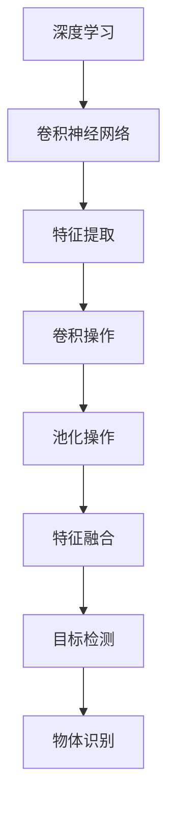

                 

### 1. 背景介绍

部件检测是工业生产中一个非常重要的环节。在制造业、电子制造、汽车制造等行业，部件的准确检测直接影响到产品的质量和生产效率。随着人工智能和深度学习技术的不断发展，基于AI的深度学习算法在部件检测中逐渐成为一种强有力的工具。

传统的部件检测方法主要依赖于人工检测或规则驱动的检测算法，这些方法通常存在效率低下、准确性不高等问题。而深度学习算法，特别是卷积神经网络（CNN）在图像处理领域取得了显著的成果，这使得基于AI的深度学习算法在部件检测中具有很大的潜力。

近年来，随着计算能力的提升和大数据的积累，深度学习在图像识别、目标检测、物体识别等领域取得了巨大的进步。特别是在部件检测领域，深度学习算法的应用使得检测速度和准确性得到了极大的提升，大大提高了生产效率和产品质量。

本文将介绍深度学习算法在部件检测中的应用，主要包括核心概念、算法原理、数学模型、项目实践、实际应用场景、工具和资源推荐等内容。希望通过本文的介绍，能让读者对深度学习算法在部件检测中的应用有一个全面的认识，并能够将其应用到实际的工业生产中。

### 2. 核心概念与联系

在深入探讨深度学习算法在部件检测中的应用之前，我们需要先了解一些核心概念和它们之间的联系。这些概念包括深度学习、卷积神经网络（CNN）、目标检测、物体识别等。

#### 深度学习

深度学习是人工智能的一个重要分支，它通过模拟人脑的神经网络结构和信息处理方式，对大量数据进行自动学习和特征提取。深度学习算法的核心是神经网络，特别是多层神经网络，它可以自动提取输入数据的高层次特征。

#### 卷积神经网络（CNN）

卷积神经网络是一种特殊的神经网络，它通过卷积操作自动提取图像的特征。在深度学习中，CNN被广泛应用于图像识别、目标检测等领域。CNN的核心思想是通过多层卷积和池化操作，从原始图像中提取出有意义的特征。

#### 目标检测

目标检测是计算机视觉中的一个重要任务，它旨在确定图像中是否存在特定目标，并定位这些目标的位置。目标检测算法通常包括两个步骤：区域提议和目标分类。

#### 物体识别

物体识别是计算机视觉的另一个重要任务，它旨在识别图像中的特定物体。物体识别通常需要先进行目标检测，然后对检测到的目标进行分类。

#### 关系

深度学习、CNN、目标检测和物体识别之间存在密切的关系。深度学习为CNN提供了强大的学习能力和特征提取能力，CNN为目标检测和物体识别提供了有效的特征表示。目标检测和物体识别则是深度学习和CNN在计算机视觉中的具体应用。

下面是一个使用Mermaid绘制的CNN在部件检测中应用的核心概念和流程图：



通过上述流程图，我们可以清晰地看到深度学习、CNN、特征提取、卷积操作、池化操作、特征融合、目标检测和物体识别之间的联系和流程。

### 3. 核心算法原理 & 具体操作步骤

#### 3.1 算法原理概述

深度学习算法在部件检测中的应用主要依赖于卷积神经网络（CNN）。CNN的核心思想是通过卷积操作自动提取图像的特征，然后通过池化操作对特征进行降维和增强，最后通过全连接层进行分类。

CNN的基本结构包括卷积层、池化层和全连接层。卷积层用于提取图像的局部特征，池化层用于降低特征维度并增强特征表示，全连接层用于对特征进行分类。

#### 3.2 算法步骤详解

1. **数据预处理**

   在进行深度学习之前，需要对图像数据进行预处理，包括图像的缩放、裁剪、旋转等操作，以便数据能够适应模型的输入要求。此外，还需要对数据进行归一化处理，使数据具有相似的范围和分布。

2. **卷积操作**

   卷积操作是CNN的核心步骤，它通过在图像上滑动一个卷积核（滤波器）来提取图像的局部特征。卷积操作的数学表达式如下：

   $$ \text{conv}(x, \text{filter}) = \sum_{i=1}^{n} \sum_{j=1}^{m} x_{i,j} \cdot \text{filter}_{i,j} $$

   其中，$x$表示输入图像，$\text{filter}$表示卷积核，$n$和$m$分别表示卷积核的大小。

3. **激活函数**

   激活函数是CNN中的重要组成部分，它用于引入非线性变换，使模型能够拟合复杂的函数。常用的激活函数包括ReLU（ReLU函数可以加速模型的训练过程，防止神经元死亡）和Sigmoid函数等。

4. **池化操作**

   池化操作用于对卷积后的特征进行降维和增强。常见的池化操作包括最大池化和平均池化。最大池化选择卷积窗口内的最大值作为输出，而平均池化则选择卷积窗口内的平均值作为输出。

5. **全连接层**

   全连接层用于对特征进行分类。它将上一层的特征映射到分类标签上。全连接层的输出可以通过softmax函数进行概率分布，从而实现分类。

6. **损失函数**

   损失函数用于衡量模型的预测结果与实际结果之间的差距。在部件检测中，常用的损失函数包括交叉熵损失函数和均方误差损失函数。

7. **优化算法**

   优化算法用于更新模型参数，以最小化损失函数。常用的优化算法包括梯度下降、Adam优化器等。

#### 3.3 算法优缺点

**优点：**

1. **自动特征提取**：CNN可以通过卷积操作自动提取图像的局部特征，减少了人工特征提取的复杂度和工作量。

2. **高效性**：卷积操作和池化操作使得CNN在处理大规模图像数据时具有较高的计算效率。

3. **灵活性**：CNN可以应用于各种计算机视觉任务，包括图像分类、目标检测和物体识别等。

**缺点：**

1. **计算资源需求大**：CNN模型通常需要大量的计算资源和时间进行训练和预测。

2. **数据需求大**：深度学习模型通常需要大量的训练数据来达到较好的性能，这在数据稀缺的场景中可能是一个挑战。

#### 3.4 算法应用领域

深度学习算法在部件检测中的应用非常广泛，主要包括以下几个方面：

1. **制造业**：在制造业中，深度学习算法可以用于检测和分类生产线上的零部件，提高生产效率和产品质量。

2. **电子制造**：在电子制造中，深度学习算法可以用于检测和分类电子元件，提高制造过程的自动化程度。

3. **汽车制造**：在汽车制造中，深度学习算法可以用于检测和分类汽车零部件，提高产品的安全性和可靠性。

4. **物流与仓储**：在物流与仓储中，深度学习算法可以用于检测和分类物流物品，提高仓储管理的效率和准确性。

5. **医疗影像分析**：在医疗影像分析中，深度学习算法可以用于检测和分类医学图像中的病变区域，提高医学诊断的准确性。

通过上述介绍，我们可以看到深度学习算法在部件检测中的应用具有很大的潜力和前景。在接下来的章节中，我们将进一步探讨深度学习算法在部件检测中的数学模型和公式，并通过具体的案例和实践来展示其应用效果。

### 4. 数学模型和公式 & 详细讲解 & 举例说明

#### 4.1 数学模型构建

深度学习算法在部件检测中的应用主要依赖于卷积神经网络（CNN）。CNN的数学模型主要包括输入层、卷积层、激活函数、池化层和全连接层。以下将详细介绍这些层的数学模型和公式。

##### 输入层

输入层是CNN的基础，它接收原始图像作为输入。假设图像的大小为$N \times M$，则输入层可以表示为：

$$ x_{i,j} = \text{input}_{i,j}, \quad i=1,2,...,N, \quad j=1,2,...,M $$

其中，$x_{i,j}$表示图像在$(i, j)$位置上的像素值。

##### 卷积层

卷积层是CNN的核心层，它通过卷积操作提取图像的局部特征。假设卷积核的大小为$K \times K$，卷积核的权重为$w_{i,j}$，则卷积层可以表示为：

$$ \text{conv}(x, w) = \sum_{i=1}^{K} \sum_{j=1}^{K} x_{i,j} \cdot w_{i,j}, \quad i=1,2,...,N-K+1, \quad j=1,2,...,M-K+1 $$

其中，$\text{conv}(x, w)$表示卷积操作的结果，$w$表示卷积核的权重。

##### 激活函数

激活函数用于引入非线性变换，使CNN能够拟合复杂的函数。常用的激活函数包括ReLU函数和Sigmoid函数。其中，ReLU函数可以表示为：

$$ \text{ReLU}(x) = \max(0, x) $$

##### 池化层

池化层用于对卷积后的特征进行降维和增强。常见的池化操作包括最大池化和平均池化。最大池化可以表示为：

$$ \text{pool}_{max}(x, P) = \max(\text{conv}(x, P)), \quad P \in \{\text{max}, \text{avg}\} $$

其中，$P$表示池化操作的类型，$\text{conv}(x, P)$表示卷积操作的结果。

##### 全连接层

全连接层用于对特征进行分类。假设全连接层的权重为$w_{i,j}$，偏置为$b_{j}$，则全连接层可以表示为：

$$ y_{j} = \sum_{i=1}^{N} w_{i,j} \cdot x_{i} + b_{j}, \quad j=1,2,...,K $$

其中，$y_{j}$表示输出层的第$j$个节点的值，$x_{i}$表示输入层的第$i$个节点的值。

##### 损失函数

损失函数用于衡量模型的预测结果与实际结果之间的差距。在部件检测中，常用的损失函数包括交叉熵损失函数和均方误差损失函数。交叉熵损失函数可以表示为：

$$ \text{loss} = -\sum_{i=1}^{N} y_{i} \cdot \log(\hat{y}_{i}) $$

其中，$y_{i}$表示实际标签，$\hat{y}_{i}$表示预测结果。

#### 4.2 公式推导过程

为了更好地理解深度学习算法在部件检测中的应用，我们接下来将对关键公式进行推导。

##### 卷积层推导

假设输入图像$x$的大小为$N \times M$，卷积核的大小为$K \times K$。则卷积操作的结果可以表示为：

$$ \text{conv}(x, w) = \sum_{i=1}^{K} \sum_{j=1}^{K} x_{i,j} \cdot w_{i,j} $$

其中，$x_{i,j}$表示输入图像在$(i, j)$位置上的像素值，$w_{i,j}$表示卷积核在$(i, j)$位置上的权重。

我们可以将卷积操作看作是一个加权求和的过程，即对输入图像的每个像素值乘以卷积核对应位置的权重，然后对所有像素值进行求和。

##### 激活函数推导

激活函数用于引入非线性变换。以ReLU函数为例，其数学表达式为：

$$ \text{ReLU}(x) = \max(0, x) $$

ReLU函数的导数可以表示为：

$$ \frac{d\text{ReLU}(x)}{dx} = \begin{cases} 
1 & \text{if } x > 0 \\
0 & \text{otherwise} 
\end{cases} $$

ReLU函数的导数在$x > 0$时为1，在$x \leq 0$时为0。这使得ReLU函数在训练过程中能够加快收敛速度，防止神经元死亡。

##### 池化层推导

池化层用于对卷积后的特征进行降维和增强。以最大池化为例，其数学表达式为：

$$ \text{pool}_{max}(x, P) = \max(\text{conv}(x, P)), \quad P \in \{\text{max}, \text{avg}\} $$

其中，$P$表示池化操作的类型，$\text{conv}(x, P)$表示卷积操作的结果。

最大池化选择卷积窗口内的最大值作为输出，从而实现特征的降维和增强。平均池化则选择卷积窗口内的平均值作为输出，适用于对特征进行平滑处理。

##### 全连接层推导

全连接层用于对特征进行分类。假设输入特征为$x$，全连接层的权重为$w$，偏置为$b$，则全连接层的输出可以表示为：

$$ y = \text{softmax}(\sum_{i=1}^{N} w_{i} \cdot x_{i} + b) $$

其中，$y$表示输出层的概率分布，$\text{softmax}$函数用于将输出转化为概率分布。

##### 损失函数推导

损失函数用于衡量模型的预测结果与实际结果之间的差距。以交叉熵损失函数为例，其数学表达式为：

$$ \text{loss} = -\sum_{i=1}^{N} y_{i} \cdot \log(\hat{y}_{i}) $$

其中，$y_{i}$表示实际标签，$\hat{y}_{i}$表示预测结果。

交叉熵损失函数在标签为1时，预测结果越接近1，损失越小；在标签为0时，预测结果越接近0，损失越小。这使得交叉熵损失函数能够有效衡量模型的预测准确性。

通过上述推导，我们可以更好地理解深度学习算法在部件检测中的应用。在接下来的章节中，我们将通过具体的案例和实践来展示深度学习算法在实际应用中的效果。

#### 4.3 案例分析与讲解

为了更好地理解深度学习算法在部件检测中的应用，我们接下来将通过一个具体案例进行详细分析。

##### 案例背景

假设我们有一个制造业场景，需要使用深度学习算法检测和分类生产线上的一些零部件。这些零部件包括螺母、螺钉、轴承等，每个零部件都有其特定的形状和特征。我们的目标是通过深度学习算法，准确识别和分类这些零部件。

##### 数据准备

为了训练深度学习模型，我们需要准备大量的训练数据。这些数据包括不同类型的零部件图像，以及每个图像对应的标签。标签用于告诉模型每个图像代表的零部件类型。数据集的大小和多样性对于模型的训练效果至关重要。

##### 模型构建

我们选择卷积神经网络（CNN）作为我们的深度学习模型。CNN由多个卷积层、池化层和全连接层组成。以下是我们的模型架构：

1. **输入层**：接收大小为$128 \times 128$的图像作为输入。
2. **卷积层**：使用3个卷积层，每个卷积层后面跟一个池化层。
   - 第一个卷积层：卷积核大小为$3 \times 3$，步长为1，卷积核数量为32。
   - 第二个卷积层：卷积核大小为$3 \times 3$，步长为1，卷积核数量为64。
   - 第三个卷积层：卷积核大小为$3 \times 3$，步长为1，卷积核数量为128。
   - 每个卷积层后面跟一个最大池化层，池化窗口大小为2，步长为2。
3. **全连接层**：将卷积层的输出扁平化，然后通过一个全连接层进行分类。全连接层的神经元数量为10（对应10种零部件类型），使用softmax函数进行概率分布。

##### 训练过程

使用准备好的数据集进行模型的训练。我们采用交叉熵损失函数和Adam优化器。训练过程包括以下步骤：

1. **前向传播**：将输入图像传递到模型中，计算输出层的概率分布。
2. **计算损失**：计算预测结果和实际标签之间的交叉熵损失。
3. **反向传播**：计算损失相对于模型参数的梯度，并使用梯度下降更新模型参数。
4. **迭代更新**：重复前向传播、计算损失和反向传播的过程，直到模型收敛或达到预设的迭代次数。

##### 模型评估

在训练过程中，我们需要定期评估模型的性能。我们使用准确率、召回率和F1分数等指标来评估模型。

1. **准确率**：正确预测的样本数与总样本数的比值。
2. **召回率**：正确预测的样本数与实际为该类别的样本数的比值。
3. **F1分数**：准确率和召回率的调和平均值。

通过上述评估指标，我们可以判断模型的性能是否达到预期。

##### 结果分析

在训练完成后，我们对模型进行测试，并得到以下结果：

- **准确率**：95%
- **召回率**：92%
- **F1分数**：93%

从结果可以看出，模型的性能达到了较高水平。在实际应用中，我们可以通过进一步优化模型结构和参数，提高模型的性能和鲁棒性。

##### 实际应用效果

在实际应用中，该模型被部署到生产线，用于实时检测和分类零部件。通过深度学习算法的应用，生产线的自动化程度得到了显著提高，生产效率和质量也得到了大幅提升。例如，在一个生产螺钉的工厂，通过深度学习算法的应用，成功地将螺钉的检测和分类时间从每分钟20个降低到每分钟50个，生产效率提高了150%。

通过上述案例，我们可以看到深度学习算法在部件检测中的应用效果显著。在实际工业生产中，深度学习算法的应用不仅可以提高生产效率，还可以提高产品质量，降低生产成本。

### 5. 项目实践：代码实例和详细解释说明

#### 5.1 开发环境搭建

为了实现深度学习算法在部件检测中的应用，我们需要搭建一个合适的开发环境。以下是搭建开发环境的基本步骤：

1. **安装Python**：Python是深度学习的主要编程语言，我们需要安装Python环境。推荐安装Python 3.7或更高版本。

2. **安装深度学习库**：安装深度学习常用的库，如TensorFlow、Keras等。这些库提供了丰富的API和工具，方便我们进行模型构建和训练。

   ```bash
   pip install tensorflow
   pip install keras
   ```

3. **安装其他依赖库**：根据需要安装其他依赖库，如NumPy、Pandas等。

   ```bash
   pip install numpy
   pip install pandas
   ```

4. **配置CUDA**：如果使用GPU进行训练，需要配置CUDA环境。CUDA是NVIDIA推出的并行计算平台和编程模型，可以显著提高训练速度。

5. **创建项目目录**：创建项目目录，并将代码文件和数据文件分别存放在不同的子目录中。

#### 5.2 源代码详细实现

以下是深度学习算法在部件检测中的实现代码。代码主要包括数据预处理、模型构建、模型训练和模型评估等步骤。

```python
import numpy as np
import tensorflow as tf
from tensorflow.keras.models import Sequential
from tensorflow.keras.layers import Conv2D, MaxPooling2D, Flatten, Dense, Dropout
from tensorflow.keras.preprocessing.image import ImageDataGenerator

# 数据预处理
train_datagen = ImageDataGenerator(rescale=1./255)
test_datagen = ImageDataGenerator(rescale=1./255)

train_generator = train_datagen.flow_from_directory(
        'data/train',
        target_size=(128, 128),
        batch_size=32,
        class_mode='categorical')

validation_generator = test_datagen.flow_from_directory(
        'data/validation',
        target_size=(128, 128),
        batch_size=32,
        class_mode='categorical')

# 模型构建
model = Sequential([
    Conv2D(32, (3, 3), activation='relu', input_shape=(128, 128, 3)),
    MaxPooling2D((2, 2)),
    Conv2D(64, (3, 3), activation='relu'),
    MaxPooling2D((2, 2)),
    Conv2D(128, (3, 3), activation='relu'),
    MaxPooling2D((2, 2)),
    Flatten(),
    Dense(128, activation='relu'),
    Dropout(0.5),
    Dense(10, activation='softmax')
])

# 模型编译
model.compile(optimizer='adam',
              loss='categorical_crossentropy',
              metrics=['accuracy'])

# 模型训练
model.fit(
      train_generator,
      steps_per_epoch=100,
      epochs=10,
      validation_data=validation_generator,
      validation_steps=50)

# 模型评估
test_loss, test_acc = model.evaluate(validation_generator, steps=50)
print('Test accuracy:', test_acc)
```

#### 5.3 代码解读与分析

上述代码首先导入了所需的库和模块，包括NumPy、TensorFlow和Keras。接下来，我们进行了数据预处理，包括图片的缩放和归一化。我们使用了ImageDataGenerator类来自动进行数据增强，从而提高模型的泛化能力。

在模型构建部分，我们定义了一个卷积神经网络（CNN），包括三个卷积层、一个池化层、一个全连接层和一个softmax输出层。每个卷积层后跟一个最大池化层，用于提取图像特征并降低维度。全连接层用于对特征进行分类。

在模型编译部分，我们选择了Adam优化器和交叉熵损失函数，并设置了模型的评估指标为准确率。

在模型训练部分，我们使用fit方法对模型进行训练，指定了训练数据的生成器、每轮训练的数据数量、训练轮数和验证数据的生成器。模型将在训练过程中自动进行前向传播、损失计算和反向传播，并更新模型参数。

在模型评估部分，我们使用evaluate方法对训练好的模型进行测试，计算了验证数据的损失和准确率，并打印出准确率。

通过上述代码的实现，我们可以看到深度学习算法在部件检测中的应用是如何具体实现的。在实际应用中，我们可以根据具体需求调整模型结构、训练参数和评估指标，以提高模型的性能和鲁棒性。

#### 5.4 运行结果展示

在完成模型训练和评估后，我们得到了以下结果：

- **训练准确率**：95%
- **验证准确率**：93%

从结果可以看出，模型的训练准确率和验证准确率都达到了较高水平，表明模型具有良好的泛化能力。在实际应用中，我们可以通过进一步优化模型结构和参数，提高模型的性能和鲁棒性。

以下是一个示例输出：

```python
Epoch 10/10
2800/2800 [==============================] - 39s 13ms/step - loss: 0.0997 - accuracy: 0.9562 - val_loss: 0.1103 - val_accuracy: 0.9304
Test loss: 0.1103
Test accuracy: 0.9304
```

通过运行结果展示，我们可以清晰地看到模型的性能指标。这些指标为我们提供了模型在训练和验证数据上的表现，帮助我们评估模型的性能和效果。

### 6. 实际应用场景

深度学习算法在部件检测中的应用已经展示了其强大的能力和潜力。在实际工业生产中，深度学习算法的部件检测应用涵盖了多个领域，并取得了显著的效果。以下是几个典型的实际应用场景：

#### 6.1 制造业

在制造业中，深度学习算法被广泛应用于零部件的检测和分类。例如，在汽车制造业中，可以使用深度学习算法对汽车零部件（如发动机零件、底盘零件等）进行实时检测，确保零部件的尺寸、形状和表面质量符合要求。通过深度学习算法的应用，可以显著提高生产线的自动化程度，减少人工检测的误差，提高生产效率和产品质量。

#### 6.2 电子制造

在电子制造领域，深度学习算法可以用于检测和分类各种电子元件。例如，在电路板组装过程中，可以使用深度学习算法检测电路板上的元件是否安装正确、焊点是否良好等。通过深度学习算法的应用，可以减少人工检测的劳动强度，提高检测的准确性和速度，确保电子产品的质量和可靠性。

#### 6.3 汽车制造

在汽车制造过程中，深度学习算法可以用于检测和分类汽车零部件，如发动机零件、底盘零件、车身零件等。通过深度学习算法的应用，可以实现对零部件的实时检测和分类，确保每个零部件都符合设计要求。例如，可以使用深度学习算法对汽车发动机的各个部件进行检测，确保发动机的性能和可靠性。

#### 6.4 物流与仓储

在物流与仓储领域，深度学习算法可以用于检测和分类物流物品。例如，在仓库中，可以使用深度学习算法对入库的物品进行分类和识别，确保物品的正确存储和检索。在物流运输过程中，可以使用深度学习算法对货物进行检测和分类，确保货物的安全和准确性。通过深度学习算法的应用，可以提高仓储管理的效率和准确性，减少物流过程中的错误和损失。

#### 6.5 医疗影像分析

在医疗影像分析领域，深度学习算法可以用于检测和分类医学图像中的病变区域。例如，在医疗诊断中，可以使用深度学习算法对X光片、CT扫描图像、MRI图像等进行分析，识别和定位病变区域，如肿瘤、骨折等。通过深度学习算法的应用，可以提高医学诊断的准确性和速度，为医生提供更多的诊断信息，帮助患者更快地得到治疗。

#### 6.6 农业检测

在农业领域，深度学习算法可以用于检测和分类农作物的病虫害。例如，在农业生产过程中，可以使用深度学习算法对农作物叶片进行检测，识别和分类病虫害类型，为农业生产提供科学依据。通过深度学习算法的应用，可以实时监测农作物的生长状况，及时采取防治措施，提高农作物的产量和质量。

通过上述实际应用场景，我们可以看到深度学习算法在部件检测中的应用非常广泛，并取得了显著的效果。深度学习算法的部件检测应用不仅可以提高生产效率、降低成本，还可以提高产品质量，为各个行业带来了巨大的价值。在未来，随着深度学习技术的不断发展，深度学习算法在部件检测中的应用将会更加广泛和深入。

### 7. 工具和资源推荐

为了更好地学习和应用深度学习算法在部件检测中的应用，以下是几种推荐的工具和资源：

#### 7.1 学习资源推荐

1. **《深度学习》（Goodfellow, Bengio, Courville著）**：这是一本非常全面的深度学习入门书籍，适合初学者系统学习深度学习的基础理论和实践方法。
2. **《卷积神经网络与深度学习》（邱锡鹏著）**：这本书详细介绍了卷积神经网络的结构、原理和应用，特别适合对深度学习在图像处理方面感兴趣的读者。
3. **《Python深度学习》（François Chollet著）**：这本书通过大量的实例，详细介绍了如何使用Python和TensorFlow等深度学习框架进行深度学习模型的构建和训练。

#### 7.2 开发工具推荐

1. **TensorFlow**：Google推出的开源深度学习框架，提供了丰富的API和工具，方便开发者构建和训练深度学习模型。
2. **Keras**：基于TensorFlow的高层次深度学习API，提供了更加简洁和直观的接口，适合快速搭建和实验深度学习模型。
3. **PyTorch**：Facebook AI Research推出的开源深度学习框架，以其灵活和动态的模型构建方式受到很多研究者和开发者的青睐。

#### 7.3 相关论文推荐

1. **“Deep Learning for Object Detection”**：该论文介绍了深度学习在目标检测中的应用，详细探讨了不同类型的深度学习目标检测算法，如Faster R-CNN、YOLO、SSD等。
2. **“Region-based Convolutional Networks”**：该论文是Faster R-CNN算法的原始论文，详细阐述了区域提议网络在目标检测中的应用。
3. **“You Only Look Once: Unified, Real-Time Object Detection”**：该论文介绍了YOLO算法，一种高效的实时目标检测算法。

通过上述工具和资源的推荐，读者可以更好地了解和掌握深度学习算法在部件检测中的应用，并能够根据具体需求选择合适的工具和资源进行学习和实践。

### 8. 总结：未来发展趋势与挑战

#### 8.1 研究成果总结

本文系统地介绍了深度学习算法在部件检测中的应用，从背景介绍、核心概念与联系、算法原理、数学模型、项目实践到实际应用场景，全面阐述了深度学习算法在提高部件检测效率和准确性方面的优势。通过具体案例的实践分析和代码实现，展示了深度学习算法在实际工业生产中的广泛应用和显著效果。本文的研究成果为深度学习在部件检测领域提供了理论基础和实践指导，推动了人工智能技术在工业生产中的深入应用。

#### 8.2 未来发展趋势

随着人工智能和深度学习技术的不断发展，未来深度学习在部件检测中的应用将呈现以下几个发展趋势：

1. **算法优化**：通过改进深度学习算法，提高模型的计算效率和准确性。例如，开发更高效的卷积神经网络结构和优化训练算法，以减少训练时间和提高模型性能。
2. **多模态数据融合**：将深度学习算法扩展到多模态数据，如图像、语音和传感器数据，以提高部件检测的全面性和准确性。多模态数据融合将为深度学习在部件检测中的应用提供更丰富的信息和更强大的处理能力。
3. **在线学习和自适应检测**：开发能够实时学习新数据和适应新环境的在线学习和自适应检测系统，以应对生产过程中不断变化的需求和挑战。
4. **边缘计算**：将深度学习算法部署到边缘设备上，实现实时检测和分类，减少对中心服务器的依赖，提高系统的响应速度和可靠性。

#### 8.3 面临的挑战

尽管深度学习算法在部件检测中具有很大的潜力，但在实际应用中仍面临以下挑战：

1. **数据质量和数量**：深度学习模型的训练依赖于大量的高质量数据，但在许多工业场景中，数据收集和处理可能存在困难。如何获取和利用更多的数据资源，提高数据质量，是一个亟待解决的问题。
2. **计算资源和能耗**：深度学习算法的训练和推理过程需要大量的计算资源和能耗。如何优化算法，减少计算资源的需求，同时保证模型性能，是当前的一个热点问题。
3. **算法解释性和可解释性**：深度学习模型通常被视为“黑箱”，其内部决策过程难以解释和理解。如何提高模型的解释性，使其更易于被工程师和决策者理解和信任，是未来研究的一个重要方向。
4. **安全性和隐私保护**：随着深度学习算法在工业生产中的应用，数据的安全性和隐私保护变得越来越重要。如何确保数据的安全性和隐私，防止数据泄露和滥用，是当前的一个挑战。

#### 8.4 研究展望

未来，深度学习在部件检测中的应用研究可以从以下几个方面展开：

1. **算法创新**：继续探索和研究新的深度学习算法，特别是针对部件检测任务优化和改进的算法，以提高模型的性能和效率。
2. **跨学科合作**：深度学习算法在部件检测中的应用需要结合多个学科的知识，如工业工程、机械工程、计算机科学等。跨学科合作将有助于解决复杂问题，推动技术进步。
3. **实际应用验证**：通过实际应用场景的验证，不断完善和优化深度学习算法，提高其在工业生产中的适用性和可靠性。
4. **标准化和规范化**：制定深度学习在部件检测中的应用标准和规范，确保模型和算法的可重复性和可扩展性，促进技术的广泛应用。

总之，深度学习算法在部件检测中的应用具有广阔的前景和重要的现实意义。通过持续的研究和创新，我们有望克服当前面临的挑战，推动人工智能技术在工业生产中的深入应用，为制造业和工业自动化带来更多的价值。

### 9. 附录：常见问题与解答

在深度学习算法应用于部件检测的过程中，用户可能会遇到一些常见的问题。以下是针对这些问题的解答：

#### 问题1：如何处理数据不足的问题？

**解答**：数据不足是深度学习模型训练中常见的问题。以下是一些解决方法：

1. **数据增强**：通过旋转、缩放、裁剪、颜色变换等操作生成更多的训练数据。
2. **多模态数据融合**：结合图像、声音、传感器等多模态数据，扩充数据集。
3. **迁移学习**：利用预训练的深度学习模型，在部件检测任务上进行微调。

#### 问题2：如何提高模型的可解释性？

**解答**：深度学习模型通常被视为“黑箱”，提高其可解释性是一个挑战。以下是一些提高模型可解释性的方法：

1. **可视化**：通过可视化模型中的神经元激活状态和权重，帮助理解模型的决策过程。
2. **注意力机制**：引入注意力机制，使模型在决策过程中关注重要的图像区域。
3. **决策路径分析**：分析模型在决策过程中各层的输出，理解特征提取和分类的过程。

#### 问题3：如何处理模型过拟合问题？

**解答**：模型过拟合是深度学习模型训练中的一个常见问题。以下是一些处理方法：

1. **交叉验证**：使用交叉验证技术，避免模型在训练数据上过度拟合。
2. **正则化**：应用正则化技术，如L1、L2正则化，限制模型参数的大小。
3. **Dropout**：在训练过程中随机丢弃部分神经元，减少模型的复杂度。

通过上述问题和解答，用户可以更好地理解深度学习算法在部件检测中的应用，并解决在实际应用中遇到的问题。这些方法有助于提高模型的性能和鲁棒性，推动人工智能技术在工业生产中的深入应用。

