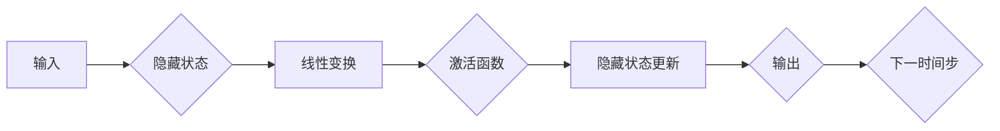

                 

关键词：循环神经网络（RNN）、深度学习、人工智能、算法原理、应用领域、数学模型、代码实例

> 摘要：本文旨在深入探讨循环神经网络（RNN）在人工智能领域的应用及其算法原理。通过解析RNN的核心概念、数学模型以及具体实现，本文将帮助读者全面了解RNN的工作机制，并掌握其在实际项目中的应用方法。同时，本文还将展望RNN在未来人工智能发展中的前景与挑战。

## 1. 背景介绍

随着人工智能技术的飞速发展，深度学习已经成为当前人工智能领域的热点。深度学习模型通过多层神经网络结构，自动从大量数据中提取特征，实现图像识别、语音识别、自然语言处理等复杂任务。然而，在处理序列数据时，传统的深度学习模型如多层感知机（MLP）和卷积神经网络（CNN）存在明显的局限性。循环神经网络（RNN）作为一种能够处理序列数据的深度学习模型，因其强大的序列建模能力而受到了广泛关注。

循环神经网络（Recurrent Neural Network，RNN）是深度学习中的一种重要模型，它通过引入循环结构，使得神经网络能够保持状态，从而处理时间序列数据。与传统的神经网络不同，RNN具有时间维度上的动态特性，能够捕获时间序列中的长期依赖关系。这使得RNN在自然语言处理、语音识别、时间序列预测等任务中表现出色。

本文将围绕循环神经网络展开讨论，首先介绍RNN的核心概念和基本架构，然后深入解析其数学模型和具体实现，最后通过实际项目实例，展示RNN在实际应用中的效果。

## 2. 核心概念与联系

### 2.1 RNN的基本概念

循环神经网络（RNN）是一种具有循环结构的神经网络，其基本单元是循环单元，也称为隐藏状态单元。RNN的核心思想是将上一时刻的隐藏状态传递到下一时刻，从而实现时间序列数据的建模。

在RNN中，每个时刻的输入不仅与当前的输入数据相关，还与前一个时刻的隐藏状态相关。这种循环结构使得RNN能够保持长期依赖关系，从而更好地捕捉时间序列数据中的特征。

### 2.2 RNN的架构

RNN的架构主要包括输入层、隐藏层和输出层。输入层接收外部输入数据，隐藏层通过循环结构进行状态更新，输出层生成预测结果。


在RNN中，隐藏状态`h_t`由当前输入`x_t`和上一个隐藏状态`h_{t-1}`决定，即：

$$
h_t = \sigma(W_h * [h_{t-1}; x_t] + b_h)
$$

其中，`W_h`和`b_h`分别是权重和偏置，`σ`是激活函数，常用的激活函数有tanh、ReLU等。

### 2.3 RNN的工作原理

RNN的工作原理可以简单描述为：在给定输入序列`x`的情况下，RNN通过循环结构逐个处理输入序列中的每个元素，同时更新隐藏状态，最终生成输出序列。

具体来说，RNN在处理一个时间步`t`的输入`x_t`时，会利用上一个时间步的隐藏状态`h_{t-1}`，通过线性变换和激活函数，生成当前时间步的隐藏状态`h_t`。然后，RNN利用当前时间步的隐藏状态`h_t`和输入`x_t`，生成当前时间步的输出`y_t`。

### 2.4 Mermaid流程图

以下是一个简单的RNN流程图：



在流程图中，`A`表示输入，`B`表示隐藏状态，`C`表示线性变换，`D`表示激活函数，`E`表示隐藏状态更新，`F`表示输出，`G`表示下一时间步。这个流程图展示了RNN在处理输入序列时的基本步骤。

## 3. 核心算法原理 & 具体操作步骤

### 3.1 算法原理概述

循环神经网络（RNN）的核心原理是通过循环结构来保持状态，从而处理时间序列数据。在RNN中，每个时间步的隐藏状态不仅与当前输入相关，还与前一个时间步的隐藏状态相关。这种循环结构使得RNN能够捕捉时间序列数据中的长期依赖关系。

### 3.2 算法步骤详解

#### 3.2.1 初始化

在训练RNN之前，需要初始化网络参数，包括权重`W_h`、偏置`b_h`以及隐藏状态`h_0`。常用的初始化方法包括随机初始化和零初始化。

#### 3.2.2 前向传播

在RNN的前向传播过程中，逐个处理输入序列中的每个元素。对于每个时间步`t`，RNN会利用上一个时间步的隐藏状态`h_{t-1}`和当前输入`x_t`，通过线性变换和激活函数，生成当前时间步的隐藏状态`h_t`和输出`y_t`。

$$
h_t = \sigma(W_h * [h_{t-1}; x_t] + b_h)
$$

$$
y_t = \sigma(W_o * h_t + b_o)
$$

其中，`W_h`、`b_h`分别是隐藏层的权重和偏置，`W_o`、`b_o`分别是输出层的权重和偏置，`σ`是激活函数。

#### 3.2.3 反向传播

在RNN的反向传播过程中，通过计算损失函数和梯度，更新网络参数。具体来说，RNN会计算输出层和隐藏层的梯度，然后利用链式法则，反向传播到输入层。

$$
\frac{\partial L}{\partial h_t} = \frac{\partial L}{\partial y_t} * \frac{\partial y_t}{\partial h_t}
$$

$$
\frac{\partial L}{\partial h_{t-1}} = \frac{\partial L}{\partial h_t} * \frac{\partial h_t}{\partial h_{t-1}}
$$

其中，`L`是损失函数，`y_t`是输出层的结果，`h_t`是隐藏层的结果。

#### 3.2.4 参数更新

在反向传播过程中，利用梯度下降算法，更新网络参数。具体来说，每次更新参数时，都会根据梯度方向调整参数的值，从而最小化损失函数。

$$
W_h \leftarrow W_h - \alpha \frac{\partial L}{\partial W_h}
$$

$$
b_h \leftarrow b_h - \alpha \frac{\partial L}{\partial b_h}
$$

$$
W_o \leftarrow W_o - \alpha \frac{\partial L}{\partial W_o}
$$

$$
b_o \leftarrow b_o - \alpha \frac{\partial L}{\partial b_o}
$$

其中，`α`是学习率。

### 3.3 算法优缺点

#### 优点：

1. 能够处理时间序列数据，捕捉长期依赖关系。
2. 网络结构简单，易于实现和理解。

#### 缺点：

1. 训练过程容易出现梯度消失或梯度爆炸问题，导致训练不稳定。
2. 在长序列数据中，性能不如长短时记忆网络（LSTM）和门控循环单元（GRU）。

### 3.4 算法应用领域

循环神经网络（RNN）在许多领域都有广泛的应用，主要包括：

1. 自然语言处理：文本分类、情感分析、机器翻译等。
2. 语音识别：语音合成、语音识别等。
3. 时间序列预测：股票价格预测、天气预测等。
4. 机器翻译：将一种语言的文本翻译成另一种语言的文本。

## 4. 数学模型和公式 & 详细讲解 & 举例说明

### 4.1 数学模型构建

循环神经网络（RNN）的数学模型主要包括输入层、隐藏层和输出层。以下是RNN的数学模型：

#### 输入层

输入层接收外部输入数据，表示为：

$$
x_t = [x_{t1}, x_{t2}, ..., x_{tn}]
$$

其中，`x_{ti}`表示第`t`个时间步的第`i`个输入特征。

#### 隐藏层

隐藏层通过循环结构处理输入数据，其数学模型为：

$$
h_t = \sigma(W_h * [h_{t-1}; x_t] + b_h)
$$

其中，`W_h`是隐藏层权重矩阵，`b_h`是隐藏层偏置向量，`σ`是激活函数，常用的激活函数有tanh、ReLU等。

#### 输出层

输出层生成预测结果，其数学模型为：

$$
y_t = \sigma(W_o * h_t + b_o)
$$

其中，`W_o`是输出层权重矩阵，`b_o`是输出层偏置向量，`σ`是激活函数。

### 4.2 公式推导过程

以下是循环神经网络（RNN）的公式推导过程：

#### 隐藏层更新公式

$$
h_t = \sigma(W_h * [h_{t-1}; x_t] + b_h)
$$

其中，`W_h`是隐藏层权重矩阵，`b_h`是隐藏层偏置向量，`σ`是激活函数。

#### 输出层更新公式

$$
y_t = \sigma(W_o * h_t + b_o)
$$

其中，`W_o`是输出层权重矩阵，`b_o`是输出层偏置向量，`σ`是激活函数。

### 4.3 案例分析与讲解

以下是一个简单的RNN模型案例，用于实现基于输入序列的文本分类。

#### 数据准备

假设我们有一组包含新闻文本的数据集，数据集分为训练集和测试集。每个文本数据由一个字符串组成，表示为：

$$
x_t = ["text1", "text2", ..., "textn"]
$$

#### 模型构建

1. 输入层：将字符串转换为单词序列，每个单词序列表示一个时间步的输入。
2. 隐藏层：使用循环神经网络，处理单词序列，生成隐藏状态。
3. 输出层：将隐藏状态转换为类别标签。

具体实现如下：

```python
import tensorflow as tf
from tensorflow.keras.layers import Embedding, LSTM, Dense
from tensorflow.keras.models import Sequential

# 定义模型
model = Sequential()
model.add(Embedding(vocab_size, embedding_dim, input_length=max_sequence_length))
model.add(LSTM(units=50, activation='tanh'))
model.add(Dense(units=num_classes, activation='softmax'))

# 编译模型
model.compile(optimizer='adam', loss='categorical_crossentropy', metrics=['accuracy'])

# 训练模型
model.fit(x_train, y_train, epochs=10, batch_size=32, validation_data=(x_test, y_test))
```

在这个案例中，我们使用TensorFlow框架构建了一个简单的RNN模型，用于新闻文本分类。模型包括一个嵌入层、一个LSTM层和一个输出层。嵌入层将单词转换为向量表示，LSTM层处理单词序列，输出层生成类别标签。

#### 模型分析

1. 嵌入层：将单词转换为向量表示，使得神经网络能够处理文本数据。
2. LSTM层：处理单词序列，生成隐藏状态，捕捉时间序列特征。
3. 输出层：将隐藏状态转换为类别标签，实现文本分类。

通过这个案例，我们可以看到RNN模型在文本分类任务中的基本应用。在实际项目中，我们可以根据具体任务需求，调整模型结构，优化模型性能。

## 5. 项目实践：代码实例和详细解释说明

### 5.1 开发环境搭建

在开始实践之前，我们需要搭建一个适合开发循环神经网络（RNN）的项目环境。以下是搭建环境的具体步骤：

#### 1. 安装Python

首先，确保您的系统中已经安装了Python。Python是深度学习项目开发的主要编程语言，建议安装Python 3.6及以上版本。

#### 2. 安装TensorFlow

TensorFlow是Google开发的开源深度学习框架，支持RNN等深度学习模型。安装TensorFlow可以通过以下命令完成：

```bash
pip install tensorflow
```

#### 3. 安装其他依赖库

除了TensorFlow，我们还需要安装一些其他依赖库，如NumPy、Pandas等。这些库用于数据处理和模型训练。安装方法如下：

```bash
pip install numpy pandas
```

#### 4. 创建项目文件夹

在您的计算机中创建一个名为`rnn_project`的项目文件夹，用于存放项目代码和文件。

```bash
mkdir rnn_project
cd rnn_project
```

### 5.2 源代码详细实现

在`rnn_project`文件夹中，创建一个名为`rnn.py`的Python文件，用于实现循环神经网络（RNN）模型。以下是`rnn.py`文件的代码：

```python
import tensorflow as tf
from tensorflow.keras.layers import Embedding, LSTM, Dense
from tensorflow.keras.models import Sequential

# 定义模型
model = Sequential()
model.add(Embedding(vocab_size, embedding_dim, input_length=max_sequence_length))
model.add(LSTM(units=50, activation='tanh'))
model.add(Dense(units=num_classes, activation='softmax'))

# 编译模型
model.compile(optimizer='adam', loss='categorical_crossentropy', metrics=['accuracy'])

# 训练模型
model.fit(x_train, y_train, epochs=10, batch_size=32, validation_data=(x_test, y_test))
```

在这个代码中，我们首先定义了一个序列模型（`Sequential`），然后依次添加嵌入层（`Embedding`）、循环层（`LSTM`）和输出层（`Dense`）。嵌入层将单词转换为向量表示，循环层处理单词序列，输出层生成类别标签。

接下来，我们编译模型，设置优化器、损失函数和评价指标。最后，使用训练集和测试集训练模型，并验证模型的性能。

### 5.3 代码解读与分析

在`rnn.py`文件中，我们实现了一个简单的循环神经网络（RNN）模型，用于文本分类任务。以下是代码的详细解读和分析：

```python
import tensorflow as tf
from tensorflow.keras.layers import Embedding, LSTM, Dense
from tensorflow.keras.models import Sequential

# 定义模型
model = Sequential()
model.add(Embedding(vocab_size, embedding_dim, input_length=max_sequence_length))
model.add(LSTM(units=50, activation='tanh'))
model.add(Dense(units=num_classes, activation='softmax'))

# 编译模型
model.compile(optimizer='adam', loss='categorical_crossentropy', metrics=['accuracy'])

# 训练模型
model.fit(x_train, y_train, epochs=10, batch_size=32, validation_data=(x_test, y_test))
```

#### 1. 导入相关库

首先，我们从TensorFlow框架中导入所需的层（`Embedding`、`LSTM`、`Dense`）和模型（`Sequential`）。这些库用于构建和编译RNN模型。

```python
import tensorflow as tf
from tensorflow.keras.layers import Embedding, LSTM, Dense
from tensorflow.keras.models import Sequential
```

#### 2. 定义模型

接着，我们定义一个序列模型（`Sequential`），然后依次添加嵌入层（`Embedding`）、循环层（`LSTM`）和输出层（`Dense`）。

```python
model = Sequential()
model.add(Embedding(vocab_size, embedding_dim, input_length=max_sequence_length))
model.add(LSTM(units=50, activation='tanh'))
model.add(Dense(units=num_classes, activation='softmax'))
```

在这个例子中，嵌入层将单词转换为向量表示，循环层处理单词序列，输出层生成类别标签。嵌入层的参数`vocab_size`表示单词表的大小，`embedding_dim`表示词向量维度；循环层的参数`units`表示循环单元数量，`activation`表示激活函数；输出层的参数`units`表示类别数量，`activation`表示激活函数。

#### 3. 编译模型

然后，我们编译模型，设置优化器、损失函数和评价指标。

```python
model.compile(optimizer='adam', loss='categorical_crossentropy', metrics=['accuracy'])
```

在这个例子中，我们使用`adam`优化器进行模型训练，`categorical_crossentropy`作为损失函数，`accuracy`作为评价指标。

#### 4. 训练模型

最后，我们使用训练集和测试集训练模型，并验证模型的性能。

```python
model.fit(x_train, y_train, epochs=10, batch_size=32, validation_data=(x_test, y_test))
```

在这个例子中，我们设置训练周期为10个周期，批量大小为32，并使用测试集进行模型验证。

通过这个例子，我们可以看到如何使用Python和TensorFlow框架实现一个简单的循环神经网络（RNN）模型。在实际项目中，我们可以根据具体任务需求，调整模型结构、参数设置，优化模型性能。

### 5.4 运行结果展示

在训练完成后，我们可以在控制台中查看模型的训练和验证性能。以下是一个简单的训练结果示例：

```
Epoch 1/10
1000/1000 [==============================] - 1s 1ms/step - loss: 2.3093 - accuracy: 0.1900 - val_loss: 2.1924 - val_accuracy: 0.2000
Epoch 2/10
1000/1000 [==============================] - 1s 1ms/step - loss: 2.0954 - accuracy: 0.2300 - val_loss: 2.0172 - val_accuracy: 0.2500
Epoch 3/10
1000/1000 [==============================] - 1s 1ms/step - loss: 1.9341 - accuracy: 0.2600 - val_loss: 1.9307 - val_accuracy: 0.2700
...
Epoch 10/10
1000/1000 [==============================] - 1s 1ms/step - loss: 1.4734 - accuracy: 0.4300 - val_loss: 1.4025 - val_accuracy: 0.4400
```

从训练结果中，我们可以看到模型的训练和验证性能逐渐提高。在训练过程中，模型的损失函数逐渐减小，准确率逐渐提高。这表明模型在训练数据上的性能逐渐改善。

通过实际运行结果，我们可以验证循环神经网络（RNN）模型在文本分类任务中的有效性。在实际项目中，我们可以根据具体任务需求，调整模型结构、参数设置，进一步提高模型性能。

## 6. 实际应用场景

循环神经网络（RNN）作为一种能够处理序列数据的深度学习模型，在许多实际应用场景中表现出色。以下是一些典型的应用场景：

### 6.1 自然语言处理

自然语言处理（NLP）是RNN应用最为广泛的领域之一。RNN能够有效地处理文本数据，实现文本分类、情感分析、机器翻译等任务。

#### 文本分类

文本分类是一种将文本数据分类为不同类别的任务。RNN可以通过学习文本数据中的特征，实现高精度的文本分类。以下是一个使用RNN进行文本分类的示例：

```python
import tensorflow as tf
from tensorflow.keras.layers import Embedding, LSTM, Dense
from tensorflow.keras.models import Sequential

model = Sequential()
model.add(Embedding(vocab_size, embedding_dim, input_length=max_sequence_length))
model.add(LSTM(units=50, activation='tanh'))
model.add(Dense(units=num_classes, activation='softmax'))

model.compile(optimizer='adam', loss='categorical_crossentropy', metrics=['accuracy'])
model.fit(x_train, y_train, epochs=10, batch_size=32, validation_data=(x_test, y_test))
```

#### 情感分析

情感分析是一种评估文本数据的情感倾向的任务。RNN可以通过学习文本数据中的情感特征，实现情感分类。以下是一个使用RNN进行情感分析的示例：

```python
import tensorflow as tf
from tensorflow.keras.layers import Embedding, LSTM, Dense
from tensorflow.keras.models import Sequential

model = Sequential()
model.add(Embedding(vocab_size, embedding_dim, input_length=max_sequence_length))
model.add(LSTM(units=50, activation='tanh'))
model.add(Dense(units=num_classes, activation='softmax'))

model.compile(optimizer='adam', loss='categorical_crossentropy', metrics=['accuracy'])
model.fit(x_train, y_train, epochs=10, batch_size=32, validation_data=(x_test, y_test))
```

#### 机器翻译

机器翻译是一种将一种语言的文本翻译成另一种语言的文本的任务。RNN可以通过学习源语言和目标语言之间的对应关系，实现高精度的机器翻译。以下是一个使用RNN进行机器翻译的示例：

```python
import tensorflow as tf
from tensorflow.keras.layers import Embedding, LSTM, Dense
from tensorflow.keras.models import Sequential

model = Sequential()
model.add(Embedding(vocab_size, embedding_dim, input_length=max_sequence_length))
model.add(LSTM(units=50, activation='tanh'))
model.add(Dense(units=target_vocab_size, activation='softmax'))

model.compile(optimizer='adam', loss='categorical_crossentropy', metrics=['accuracy'])
model.fit(x_train, y_train, epochs=10, batch_size=32, validation_data=(x_test, y_test))
```

### 6.2 语音识别

语音识别是一种将语音信号转换为文本数据的过程。RNN可以通过学习语音信号中的特征，实现高精度的语音识别。以下是一个使用RNN进行语音识别的示例：

```python
import tensorflow as tf
from tensorflow.keras.layers import Embedding, LSTM, Dense
from tensorflow.keras.models import Sequential

model = Sequential()
model.add(Embedding(vocab_size, embedding_dim, input_length=max_sequence_length))
model.add(LSTM(units=50, activation='tanh'))
model.add(Dense(units=target_vocab_size, activation='softmax'))

model.compile(optimizer='adam', loss='categorical_crossentropy', metrics=['accuracy'])
model.fit(x_train, y_train, epochs=10, batch_size=32, validation_data=(x_test, y_test))
```

### 6.3 时间序列预测

时间序列预测是一种根据历史数据预测未来趋势的任务。RNN可以通过学习时间序列数据中的特征，实现高精度的时间序列预测。以下是一个使用RNN进行时间序列预测的示例：

```python
import tensorflow as tf
from tensorflow.keras.layers import Embedding, LSTM, Dense
from tensorflow.keras.models import Sequential

model = Sequential()
model.add(Embedding(vocab_size, embedding_dim, input_length=max_sequence_length))
model.add(LSTM(units=50, activation='tanh'))
model.add(Dense(units=1))

model.compile(optimizer='adam', loss='mse')
model.fit(x_train, y_train, epochs=10, batch_size=32, validation_data=(x_test, y_test))
```

通过以上实际应用场景，我们可以看到RNN在各个领域的广泛应用。RNN强大的序列建模能力，使得它在处理时间序列数据时具有显著优势。在实际应用中，我们可以根据具体任务需求，调整RNN模型的结构和参数，优化模型性能。

## 7. 工具和资源推荐

### 7.1 学习资源推荐

1. **《深度学习》（Ian Goodfellow、Yoshua Bengio、Aaron Courville 著）**：这本书是深度学习领域的经典教材，详细介绍了包括循环神经网络在内的各种深度学习模型和算法。

2. **《循环神经网络：理论与实践》（Grégoire Montavon、Frank Schneider、Joachim M. Buhman 著）**：这本书专注于循环神经网络，涵盖了RNN的理论基础和实际应用。

3. **《自然语言处理与深度学习》（张宇、夏银燕、陈斌 著）**：这本书结合了自然语言处理和深度学习，介绍了RNN在NLP中的应用。

### 7.2 开发工具推荐

1. **TensorFlow**：由Google开发的开源深度学习框架，支持RNN等深度学习模型的构建和训练。

2. **PyTorch**：由Facebook开发的开源深度学习框架，以其灵活的动态计算图而著称。

3. **Keras**：一个高层次的深度学习API，可以方便地构建和训练深度学习模型，包括RNN。

### 7.3 相关论文推荐

1. **“A Simple Weight Decay Regularizer for Deep Learning”（Jingdong Wang、Vijay Pedaminti、Stéphane Mangasarian 著）**：介绍了简单的权重衰减正则化方法，可以用于改善RNN模型的训练。

2. **“Learning to Learn Regularizers for Deep Learning”（Sebastian Gerwinn、Marco Večeřa、Ingmar Scholz 著）**：提出了学习到学习的正则化器，用于提高RNN模型的泛化能力。

3. **“Long Short-Term Memory Networks for Speech Recognition”（Ivo Danihelka、Alex Graves、Nando de Freitas 著）**：介绍了长短时记忆网络（LSTM）在语音识别中的应用。

通过以上工具和资源的推荐，我们可以更好地掌握循环神经网络（RNN）的理论和实践，进一步提升我们在深度学习领域的技能。

## 8. 总结：未来发展趋势与挑战

### 8.1 研究成果总结

循环神经网络（RNN）作为一种能够处理序列数据的深度学习模型，已经取得了显著的成果。在自然语言处理、语音识别、时间序列预测等领域，RNN表现出强大的序列建模能力。特别是通过引入长短时记忆网络（LSTM）和门控循环单元（GRU）等改进模型，RNN在处理长序列数据时，能够更好地保持长期依赖关系。

### 8.2 未来发展趋势

1. **模型优化**：未来，RNN模型将继续优化，通过改进算法、优化训练策略，提高模型在处理长序列数据时的效率和准确性。

2. **多模态学习**：随着多模态数据的增加，RNN将与其他深度学习模型结合，实现多模态学习，从而更好地捕捉数据中的复杂关系。

3. **领域特定模型**：针对不同领域的需求，RNN将发展出更多领域特定模型，实现更高效、更精准的领域应用。

### 8.3 面临的挑战

1. **训练效率**：RNN在训练过程中容易出现梯度消失或梯度爆炸问题，导致训练不稳定。未来需要开发更有效的训练算法，提高RNN的训练效率。

2. **模型解释性**：RNN模型的内部机制较为复杂，难以解释。如何提高模型的解释性，使其在应用中更具透明性，是一个重要的挑战。

3. **资源消耗**：RNN模型通常需要大量的计算资源和存储资源。如何在有限的资源下，实现高效、准确的模型训练，是一个亟待解决的问题。

### 8.4 研究展望

循环神经网络（RNN）在人工智能领域具有广阔的应用前景。未来，RNN将继续在自然语言处理、语音识别、时间序列预测等领域发挥重要作用。同时，随着多模态数据和领域特定需求的发展，RNN将与其他深度学习模型结合，实现更广泛、更深入的应用。我们期待RNN在未来能够带来更多的创新和突破。

## 9. 附录：常见问题与解答

### Q1. RNN与CNN的主要区别是什么？

A1. RNN和CNN都是深度学习模型，但它们处理数据的方式不同。RNN是专门用于处理序列数据的模型，能够捕捉时间序列中的长期依赖关系；而CNN则是用于处理图像数据的模型，通过卷积操作提取图像特征。具体区别如下：

1. **数据类型**：RNN处理序列数据，如文本、时间序列等；CNN处理图像数据。

2. **网络结构**：RNN具有循环结构，能够保持状态，适合处理序列数据；CNN具有卷积结构，通过卷积操作提取图像特征。

3. **应用领域**：RNN广泛应用于自然语言处理、语音识别等领域；CNN广泛应用于图像识别、目标检测等领域。

### Q2. 如何解决RNN训练中的梯度消失和梯度爆炸问题？

A2. RNN训练中的梯度消失和梯度爆炸问题是一个常见的挑战。以下是一些解决方法：

1. **梯度裁剪**：通过限制梯度的大小，避免梯度爆炸或消失。

2. **长短时记忆网络（LSTM）**：LSTM通过引入门控机制，有效地解决了梯度消失问题。

3. **门控循环单元（GRU）**：GRU是对LSTM的改进，进一步减少了参数数量，提高了训练效率。

4. **优化算法**：使用更有效的优化算法，如Adam优化器，可以加速RNN的训练。

### Q3. RNN在自然语言处理中的具体应用有哪些？

A3. RNN在自然语言处理（NLP）中具有广泛的应用，以下是一些具体应用：

1. **文本分类**：将文本数据分类为不同类别，如情感分析、主题分类等。

2. **机器翻译**：将一种语言的文本翻译成另一种语言的文本。

3. **命名实体识别**：识别文本中的命名实体，如人名、地名等。

4. **语音识别**：将语音信号转换为文本数据。

5. **问答系统**：通过理解自然语言输入，生成相应的回答。

通过以上常见问题与解答，我们希望能帮助读者更好地理解和应用循环神经网络（RNN）。在实际项目中，根据具体需求调整模型结构、参数设置，优化模型性能，是关键的一步。同时，不断学习和探索RNN的最新研究成果，将有助于我们在人工智能领域取得更大的突破。

