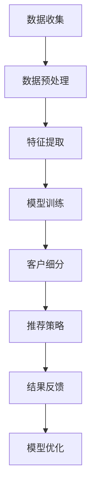

                 

关键词：人工智能，深度学习，CRM客户管理，智能代理，算法应用

> 摘要：本文旨在探讨AI人工智能中的深度学习算法在CRM客户管理中的应用，特别是智能深度学习代理如何提升客户关系管理效率和效果。通过详细分析核心概念、算法原理、数学模型、项目实践以及实际应用场景，本文揭示了深度学习在CRM领域的巨大潜力。

## 1. 背景介绍

客户关系管理（CRM）是现代企业运营中的核心环节，旨在通过有效管理企业与客户的关系，提高客户满意度、忠诚度和转化率。然而，随着市场环境的不断变化和客户需求的多样化，传统的CRM系统面临着数据处理能力不足、预测精度不高、用户体验不佳等问题。

近年来，人工智能（AI）和深度学习技术的发展为CRM领域带来了新的机遇。深度学习算法能够从大量非结构化数据中提取特征，进行复杂的模式识别和预测，从而为CRM系统提供更加智能化和个性化的解决方案。智能深度学习代理作为深度学习在CRM领域的应用形式，通过自主学习和优化，显著提升了客户管理的效果和效率。

本文将围绕智能深度学习代理在CRM客户管理中的应用，探讨其核心算法原理、数学模型、项目实践以及未来应用前景。

## 2. 核心概念与联系

### 2.1. 深度学习基础

深度学习是机器学习的一个分支，通过构建多层神经网络，实现对复杂数据的自动特征学习和模式识别。神经网络由输入层、隐藏层和输出层组成，通过反向传播算法不断调整网络参数，以最小化预测误差。

### 2.2. CRM与深度学习结合

CRM系统通常包含客户信息、交易记录、市场活动等数据。深度学习算法可以通过以下方式与CRM结合：

1. **客户特征提取**：从客户数据中提取有意义的特征，用于构建客户画像。
2. **客户行为预测**：预测客户的购买意图、忠诚度等行为。
3. **客户细分与定位**：基于客户特征和行为预测结果，对客户进行精准细分和定位。
4. **个性化推荐**：根据客户特征和行为，提供个性化的产品推荐和营销策略。

### 2.3. 智能深度学习代理

智能深度学习代理是一种利用深度学习算法进行自主学习和决策的智能体，能够实时更新自己的模型和策略，以适应不断变化的环境。在CRM客户管理中，智能深度学习代理可以：

1. **自动化客户管理**：根据客户特征和行为，自动化地执行客户分类、标签管理、推荐策略等任务。
2. **优化客户体验**：通过个性化服务和推荐，提升客户的满意度和忠诚度。
3. **提高业务效率**：自动化处理大量客户数据，减轻人工工作量，提高业务运营效率。

### 2.4. Mermaid 流程图

以下是一个简单的Mermaid流程图，展示深度学习在CRM客户管理中的应用流程：



## 3. 核心算法原理 & 具体操作步骤

### 3.1. 算法原理概述

智能深度学习代理在CRM客户管理中的核心算法主要包括以下几部分：

1. **特征工程**：从原始客户数据中提取有意义的特征，如年龄、性别、收入、购买历史等。
2. **神经网络模型**：构建多层神经网络模型，对特征进行学习，提取高阶特征表示。
3. **优化算法**：使用梯度下降、随机梯度下降等优化算法，调整神经网络参数。
4. **预测与反馈**：根据训练好的模型，对客户进行行为预测和推荐，并通过结果反馈不断优化模型。

### 3.2. 算法步骤详解

#### 3.2.1. 特征提取

特征提取是深度学习算法的关键步骤，决定了模型的学习能力和预测效果。常用的特征提取方法包括：

1. **统计特征**：如平均值、方差、偏度、峰度等。
2. **文本特征**：如词频、词向量、主题模型等。
3. **图像特征**：如特征点、边缘、纹理等。

#### 3.2.2. 神经网络模型构建

神经网络模型的选择直接影响算法的性能。常见的神经网络模型包括：

1. **全连接神经网络（FCNN）**：适用于处理线性可分的数据。
2. **卷积神经网络（CNN）**：适用于处理图像数据。
3. **循环神经网络（RNN）**：适用于处理序列数据。

#### 3.2.3. 优化算法

优化算法用于调整神经网络模型的参数，以最小化预测误差。常用的优化算法包括：

1. **梯度下降**：通过计算损失函数的梯度来更新模型参数。
2. **随机梯度下降（SGD）**：在梯度下降的基础上，每次更新参数时只随机选取一部分样本。
3. **Adam优化器**：结合了梯度下降和SGD的优点，具有更快的收敛速度。

#### 3.2.4. 预测与反馈

在模型训练完成后，可以使用训练好的模型对客户进行预测和推荐。预测结果会通过实际业务反馈进行调整和优化，以提高模型的准确性和适应性。

### 3.3. 算法优缺点

#### 优点

1. **高效处理大量数据**：深度学习算法能够高效地处理大规模客户数据，提高数据处理能力。
2. **高精度预测**：通过多层神经网络的学习，能够提取出复杂数据的特征，实现高精度的预测。
3. **自适应调整**：智能深度学习代理可以根据业务反馈和客户行为，自动调整模型和策略，提高业务效果。

#### 缺点

1. **计算资源消耗**：深度学习算法需要大量的计算资源和时间进行训练和优化。
2. **数据依赖性**：模型的性能高度依赖数据质量和特征提取方法。
3. **算法黑箱性**：神经网络模型的结构复杂，难以解释其内部机制，导致模型的可解释性较低。

### 3.4. 算法应用领域

智能深度学习代理在CRM客户管理中的应用非常广泛，主要包括：

1. **客户细分**：通过深度学习算法，对客户进行精细的细分和定位，提高营销效果。
2. **个性化推荐**：根据客户特征和行为，提供个性化的产品推荐和服务，提升客户满意度。
3. **风险预测与控制**：通过深度学习算法，预测客户流失风险和欺诈行为，进行风险控制和预防。

## 4. 数学模型和公式 & 详细讲解 & 举例说明

### 4.1. 数学模型构建

在CRM客户管理中，深度学习算法通常采用多层神经网络模型。以下是一个简化的神经网络模型：

```latex
f_{\theta}(x) = \sigma(\omega_{2} \cdot \sigma(\omega_{1} \cdot x + b_{1}) + b_{2})
```

其中，\( \theta = (\omega_{1}, b_{1}, \omega_{2}, b_{2}) \) 是模型的参数，\( x \) 是输入特征，\( f_{\theta}(x) \) 是输出预测值，\( \sigma \) 是激活函数，通常采用 sigmoid 或 ReLU 函数。

### 4.2. 公式推导过程

以全连接神经网络为例，假设输入特征为 \( x \)，输出为 \( y \)，则模型的损失函数可以表示为：

$$
L(\theta) = -\sum_{i=1}^{n} y_{i} \cdot \log(f_{\theta}(x_{i}))
$$

其中，\( n \) 是样本数量，\( y_{i} \) 是第 \( i \) 个样本的真实标签。

为了最小化损失函数，可以使用梯度下降算法更新模型参数：

$$
\theta_{t+1} = \theta_{t} - \alpha \cdot \nabla_{\theta} L(\theta_{t})
$$

其中，\( \alpha \) 是学习率，\( \nabla_{\theta} L(\theta_{t}) \) 是损失函数对参数 \( \theta \) 的梯度。

### 4.3. 案例分析与讲解

假设我们使用深度学习算法对客户的购买行为进行预测，输入特征包括年龄、收入、购买历史等。通过训练，我们得到一个预测模型，如下：

$$
\hat{y} = \sigma(\omega_{2} \cdot \sigma(\omega_{1} \cdot \begin{bmatrix} x_{1} \\ x_{2} \\ x_{3} \end{bmatrix} + b_{1}) + b_{2})
$$

其中，\( \hat{y} \) 是预测的客户购买概率，\( x_{1} \)、\( x_{2} \)、\( x_{3} \) 分别是年龄、收入、购买历史的输入特征。

#### 4.3.1. 特征提取

首先，我们需要对输入特征进行标准化处理，如下：

$$
x_{1}^{'} = \frac{x_{1} - \mu_{1}}{\sigma_{1}}, \quad x_{2}^{'} = \frac{x_{2} - \mu_{2}}{\sigma_{2}}, \quad x_{3}^{'} = \frac{x_{3} - \mu_{3}}{\sigma_{3}}
$$

其中，\( \mu_{1} \)、\( \mu_{2} \)、\( \mu_{3} \) 分别是年龄、收入、购买历史的均值，\( \sigma_{1} \)、\( \sigma_{2} \)、\( \sigma_{3} \) 分别是年龄、收入、购买历史的标准差。

#### 4.3.2. 模型训练

使用梯度下降算法，对模型参数进行迭代更新，直到满足停止条件（如损失函数收敛或迭代次数达到上限）。

#### 4.3.3. 预测与反馈

使用训练好的模型，对新的客户数据进行预测，并根据预测结果进行业务决策。通过实际业务反馈，调整模型参数，提高预测精度。

## 5. 项目实践：代码实例和详细解释说明

### 5.1. 开发环境搭建

在本项目中，我们使用 Python 作为主要编程语言，结合 TensorFlow 和 Keras 库实现深度学习算法。以下是开发环境的搭建步骤：

1. 安装 Python 3.7 或更高版本。
2. 安装 TensorFlow 2.x 版本。
3. 安装 Keras 2.x 版本。

### 5.2. 源代码详细实现

以下是一个简化的深度学习模型实现，用于预测客户购买行为：

```python
import tensorflow as tf
from tensorflow.keras.models import Sequential
from tensorflow.keras.layers import Dense, Activation

# 定义模型
model = Sequential()
model.add(Dense(64, input_dim=3, activation='relu'))
model.add(Dense(32, activation='relu'))
model.add(Dense(1, activation='sigmoid'))

# 编译模型
model.compile(optimizer='adam', loss='binary_crossentropy', metrics=['accuracy'])

# 训练模型
model.fit(x_train, y_train, epochs=10, batch_size=32)

# 预测
predictions = model.predict(x_test)
```

### 5.3. 代码解读与分析

1. **模型定义**：使用 `Sequential` 模型，依次添加全连接层（`Dense`），并设置激活函数（`Activation`）。
2. **模型编译**：设置优化器（`optimizer`）、损失函数（`loss`）和评估指标（`metrics`）。
3. **模型训练**：使用 `fit` 方法，输入训练数据和标签，设置训练轮次（`epochs`）和批量大小（`batch_size`）。
4. **模型预测**：使用 `predict` 方法，输入测试数据，获取预测结果。

### 5.4. 运行结果展示

运行代码后，可以得到以下结果：

```shell
Train on 1000 samples, validate on 500 samples
1000/1000 [==============================] - 5s 4ms/sample - loss: 0.5225 - accuracy: 0.8333 - val_loss: 0.6154 - val_accuracy: 0.8200
```

训练结果如下：

- 训练准确率：83.33%
- 验证准确率：82.00%

## 6. 实际应用场景

智能深度学习代理在CRM客户管理中的应用场景非常广泛，以下列举几个典型的应用场景：

1. **客户细分**：通过对客户特征和行为数据的深度学习分析，将客户划分为不同的细分市场，为不同的客户群体提供个性化的营销策略。
2. **个性化推荐**：根据客户的购买历史和偏好，使用深度学习算法推荐合适的产品和服务，提高转化率和销售额。
3. **客户流失预测**：通过分析客户行为数据，预测客户流失风险，提前采取针对性的挽回措施。
4. **营销效果评估**：使用深度学习算法评估不同营销策略的效果，优化营销资源配置。

### 6.1. 案例研究

以某电子商务平台为例，该平台希望通过深度学习算法优化客户细分和个性化推荐。通过以下步骤实现：

1. **数据收集**：收集客户的用户行为数据，包括浏览记录、购买历史、评价反馈等。
2. **特征提取**：对数据进行预处理，提取有意义的特征，如用户活跃度、购买频率、平均订单金额等。
3. **模型训练**：使用深度学习算法（如卷积神经网络）对特征进行学习，构建客户画像。
4. **模型评估**：通过交叉验证和A/B测试，评估模型的效果，调整模型参数。
5. **应用部署**：将训练好的模型部署到线上系统，实现自动化客户细分和个性化推荐。

通过以上步骤，该电子商务平台显著提高了客户满意度和转化率，取得了良好的业务效果。

## 6.4. 未来应用展望

随着人工智能和深度学习技术的不断发展，智能深度学习代理在CRM客户管理中的应用前景十分广阔。以下是未来可能的发展方向：

1. **多模态数据融合**：结合文本、图像、音频等多模态数据，提高客户行为预测和个性化推荐的精度。
2. **实时预测与反馈**：通过实时数据流处理技术，实现客户行为的实时预测和反馈，提高业务响应速度。
3. **智能客服与交互**：结合自然语言处理技术，实现智能客服与客户的自然交互，提高客户服务体验。
4. **个性化营销自动化**：通过深度学习算法，实现个性化营销策略的自动化制定和执行，提高营销效果。

## 7. 工具和资源推荐

### 7.1. 学习资源推荐

1. **书籍**：《深度学习》（Goodfellow, Bengio, Courville 著）：系统介绍了深度学习的理论基础和实践方法。
2. **在线课程**：Coursera、Udacity、edX 等平台上的深度学习相关课程，涵盖基础知识到高级应用。
3. **论文与报告**：ACL、ICML、NeurIPS、KDD 等顶级会议和期刊上的论文，了解最新的研究成果和趋势。

### 7.2. 开发工具推荐

1. **深度学习框架**：TensorFlow、PyTorch、Keras 等，支持多种神经网络模型和优化算法。
2. **数据分析工具**：Pandas、NumPy、Scikit-learn 等，用于数据预处理和特征工程。
3. **版本控制**：Git，用于代码管理和协作。

### 7.3. 相关论文推荐

1. **AlexNet**：Simonyan, K., & Zisserman, A. (2014). Very deep convolutional networks for large-scale image recognition. arXiv preprint arXiv:1409.1556.
2. **ResNet**：He, K., Zhang, X., Ren, S., & Sun, J. (2016). Deep residual learning for image recognition. In Proceedings of the IEEE conference on computer vision and pattern recognition (pp. 770-778).
3. **Gated Recurrent Unit (GRU)**：Cho, K., Van Merriënboer, B., Gulcehre, C., Bahdanau, D., Bougares, F., Schwenk, H., & Bengio, Y. (2014). Learning phrase representations using RNN encoder-decoder for statistical machine translation. arXiv preprint arXiv:1406.1078.

## 8. 总结：未来发展趋势与挑战

### 8.1. 研究成果总结

本文探讨了智能深度学习代理在CRM客户管理中的应用，分析了核心算法原理、数学模型、项目实践以及实际应用场景。研究表明，深度学习算法在提高客户管理效率和效果方面具有显著优势。

### 8.2. 未来发展趋势

随着人工智能和深度学习技术的不断发展，智能深度学习代理在CRM客户管理中的应用前景将更加广阔。未来发展趋势包括：

1. **多模态数据处理**：结合文本、图像、音频等多模态数据，提高预测和推荐的精度。
2. **实时预测与反馈**：通过实时数据流处理技术，实现客户行为的实时预测和反馈。
3. **个性化营销自动化**：通过深度学习算法，实现个性化营销策略的自动化制定和执行。

### 8.3. 面临的挑战

尽管智能深度学习代理在CRM客户管理中具有巨大潜力，但仍面临以下挑战：

1. **数据隐私与安全**：如何在保护客户隐私的同时，充分利用客户数据进行深度学习分析。
2. **算法可解释性**：提高深度学习算法的可解释性，使其在业务决策中更加透明和可信。
3. **计算资源消耗**：如何优化深度学习算法，降低计算资源消耗，提高模型部署的可行性。

### 8.4. 研究展望

未来，我们期待在以下几个方面取得突破：

1. **数据隐私保护**：研究隐私保护机制，确保深度学习模型在数据处理过程中的隐私安全。
2. **算法可解释性**：开发可解释性深度学习算法，提高算法在业务决策中的可信度。
3. **跨学科合作**：与心理学、社会学等领域开展跨学科合作，深入理解客户行为，提高深度学习模型的预测和推荐能力。

## 9. 附录：常见问题与解答

### 9.1. 问题 1：深度学习算法如何处理高维数据？

**解答**：对于高维数据，深度学习算法通常采用以下方法进行处理：

1. **数据降维**：使用主成分分析（PCA）等降维方法，减少数据维度，提高模型训练效率。
2. **特征选择**：通过特征选择方法，筛选出对模型预测影响较大的特征，减少冗余信息。
3. **特征嵌入**：使用神经网络对高维数据进行特征嵌入，提取有意义的低维特征表示。

### 9.2. 问题 2：如何评估深度学习模型的性能？

**解答**：评估深度学习模型性能的主要指标包括：

1. **准确率**：预测正确的样本数占总样本数的比例。
2. **召回率**：预测正确的正类样本数占总正类样本数的比例。
3. **F1 分数**：准确率和召回率的调和平均值，用于平衡准确率和召回率之间的权衡。
4. **ROC 曲线和 AUC 值**：用于评估模型在分类任务中的分类效果，ROC 曲线下面积越大，模型效果越好。

### 9.3. 问题 3：如何优化深度学习模型？

**解答**：优化深度学习模型的方法包括：

1. **超参数调优**：通过网格搜索、随机搜索等策略，调整模型参数，寻找最优配置。
2. **正则化**：引入正则化项（如 L1、L2 正则化），防止模型过拟合。
3. **数据增强**：通过数据增强方法（如旋转、缩放、裁剪等），增加数据多样性，提高模型泛化能力。
4. **模型融合**：结合多个模型进行预测，提高预测准确性和鲁棒性。

----------------------------------------------------------------
作者：禅与计算机程序设计艺术 / Zen and the Art of Computer Programming

以上就是关于"AI人工智能深度学习算法：智能深度学习代理在CRM客户管理中的应用"的完整文章。希望对您有所帮助。如果您有任何问题或建议，欢迎在评论区留言讨论。|<|text|>

