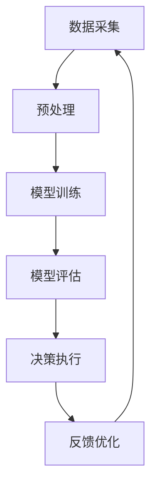
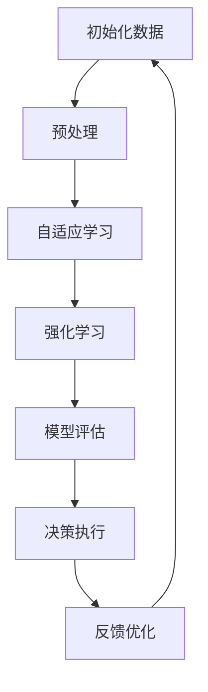

                 

关键词：人工智能，深度学习，公关危机管理，智能代理，算法原理，数学模型，项目实践

> 摘要：本文详细探讨了人工智能在公关危机管理中的应用，特别是在智能深度学习代理方面的研究进展。文章首先介绍了公关危机管理的背景和现状，随后深入分析了智能深度学习代理的核心概念与架构，探讨了其算法原理和数学模型。文章通过具体的案例和项目实践，展示了智能深度学习代理在公关危机管理中的实际应用效果，并对其未来发展方向和挑战进行了展望。

## 1. 背景介绍

### 公关危机管理的挑战与机遇

在信息爆炸的时代，公关危机管理对于企业的生存与发展至关重要。公关危机管理是指企业通过一系列的应对措施，以减轻或消除危机带来的负面影响，维护企业的声誉和形象。然而，随着社交媒体和互联网的普及，公关危机的传播速度和影响力大大增加，给企业带来了前所未有的挑战。

传统的公关危机管理方法往往依赖于人工判断和经验，效率较低，难以应对复杂的危机情境。而人工智能，特别是深度学习技术的兴起，为公关危机管理带来了新的机遇。深度学习代理作为一种智能化的工具，能够实时监测、分析和预测危机，提供个性化的应对策略，从而提高公关危机管理的效率和效果。

### 深度学习代理的概念与优势

深度学习代理是一种基于深度学习技术的人工智能系统，能够在复杂的环境中自主学习和决策。与传统的自动化系统相比，深度学习代理具有以下几个显著优势：

1. **自我学习能力**：深度学习代理可以通过大量的数据训练，不断优化自身的模型和策略，从而适应不断变化的公关危机情境。

2. **实时响应能力**：深度学习代理能够实时监测危机事件的发展，快速响应，提供即时的应对方案。

3. **个性化决策**：深度学习代理可以根据不同企业的特点和危机情境，制定个性化的应对策略，提高决策的准确性和效果。

4. **高效率**：深度学习代理能够处理大量的数据，快速分析危机，减少人工干预，提高工作效率。

## 2. 核心概念与联系

### 深度学习代理的架构与原理

深度学习代理的架构通常包括数据采集、模型训练、决策执行和反馈优化等几个关键环节。以下是一个简化的Mermaid流程图，用于描述深度学习代理的基本架构：



### 核心算法原理

#### 自适应学习算法

深度学习代理的核心算法是自适应学习算法。该算法通过不断调整模型参数，使模型在训练数据上达到最佳效果。具体来说，自适应学习算法包括以下几个步骤：

1. **初始化模型参数**：随机初始化模型参数。
2. **前向传播**：使用输入数据计算模型输出。
3. **反向传播**：根据实际输出与预期输出的差异，计算损失函数。
4. **参数调整**：根据损失函数调整模型参数，使模型输出更接近预期。
5. **重复步骤2-4，直到满足停止条件**。

#### 强化学习算法

除了自适应学习算法，深度学习代理还可能采用强化学习算法。强化学习算法通过奖励机制鼓励模型采取正确的行动。具体来说，强化学习算法包括以下几个步骤：

1. **初始化环境状态**。
2. **选择行动**：根据当前状态和模型策略，选择一个行动。
3. **执行行动，获得奖励**。
4. **更新状态**：根据行动的结果，更新当前状态。
5. **重复步骤2-4，直到达到目标状态或满足停止条件**。

### 核心概念原理与架构的 Mermaid 流程图



## 3. 核心算法原理 & 具体操作步骤

### 3.1 算法原理概述

#### 深度学习代理的基本原理

深度学习代理的基本原理是利用深度神经网络模拟人脑的决策过程，从而实现自动化和智能化的危机管理。深度学习代理通过大量的数据训练，学习到危机事件的特征和模式，从而能够对新的危机情境进行有效的预测和应对。

#### 自适应学习算法

自适应学习算法的核心思想是通过不断调整模型参数，使模型能够适应不同的危机情境。具体来说，自适应学习算法包括以下几个步骤：

1. **数据采集**：从各种渠道获取危机事件的相关数据，包括社交媒体的评论、新闻报道、社交媒体上的热门话题等。
2. **数据预处理**：对采集到的数据进行清洗和归一化处理，使其符合模型的输入要求。
3. **模型训练**：使用预处理后的数据训练深度学习模型，使其能够识别危机事件的特征和模式。
4. **模型评估**：使用测试数据评估模型的性能，包括准确率、召回率等指标。
5. **参数调整**：根据模型评估的结果，调整模型参数，使模型在新的危机情境下能够取得更好的效果。
6. **决策执行**：根据调整后的模型，对新的危机事件进行预测和应对。
7. **反馈优化**：收集危机应对的结果，对模型进行反馈和优化，使其不断适应新的危机情境。

#### 强化学习算法

强化学习算法的核心思想是通过奖励机制鼓励模型采取正确的行动。具体来说，强化学习算法包括以下几个步骤：

1. **初始化环境状态**：设定初始环境状态，包括危机事件的类型、严重程度等。
2. **选择行动**：根据当前状态和模型策略，选择一个行动。
3. **执行行动，获得奖励**：根据行动的结果，获得相应的奖励或惩罚。
4. **更新状态**：根据行动的结果，更新当前状态。
5. **重复步骤2-4，直到达到目标状态或满足停止条件**。

### 3.2 算法步骤详解

#### 自适应学习算法的步骤详解

1. **数据采集**：

   数据采集是深度学习代理的重要环节。采集到的数据包括社交媒体上的评论、新闻报道、危机事件的类型和严重程度等。数据来源可以是公开的社交媒体平台、新闻网站、政府公告等。

2. **数据预处理**：

   数据预处理是确保数据质量的关键步骤。主要包括数据清洗、数据归一化和特征提取等操作。数据清洗旨在去除重复的、无效的或错误的数据；数据归一化旨在将不同特征的数据统一到相同的尺度；特征提取旨在提取数据中的关键特征，为模型训练提供有效的输入。

3. **模型训练**：

   使用预处理后的数据训练深度学习模型。训练过程包括初始化模型参数、前向传播、反向传播和参数调整等步骤。训练过程中，模型会不断学习危机事件的特征和模式，提高预测和应对的能力。

4. **模型评估**：

   使用测试数据评估模型的性能。评估指标包括准确率、召回率、F1值等。通过评估，可以了解模型的性能，发现模型的不足之处，为后续的优化提供依据。

5. **参数调整**：

   根据模型评估的结果，调整模型参数，使其在新的危机情境下能够取得更好的效果。参数调整可以通过手动调整或自动化算法实现。

6. **决策执行**：

   根据调整后的模型，对新的危机事件进行预测和应对。决策执行包括危机预警、危机响应和危机处理等步骤。

7. **反馈优化**：

   收集危机应对的结果，对模型进行反馈和优化，使其不断适应新的危机情境。反馈优化可以通过在线学习或离线学习实现。

#### 强化学习算法的步骤详解

1. **初始化环境状态**：

   初始化环境状态，包括危机事件的类型、严重程度等。环境状态是模型决策的重要依据。

2. **选择行动**：

   根据当前状态和模型策略，选择一个行动。模型策略可以通过学习获得，包括基于规则的策略、基于模型的策略等。

3. **执行行动，获得奖励**：

   根据行动的结果，获得相应的奖励或惩罚。奖励或惩罚是强化学习算法的核心机制，通过奖励机制鼓励模型采取正确的行动。

4. **更新状态**：

   根据行动的结果，更新当前状态。状态更新是强化学习算法的重要步骤，通过不断更新状态，模型能够学习到更复杂的决策规则。

5. **重复步骤2-4，直到达到目标状态或满足停止条件**：

   强化学习算法通过不断重复步骤2-4，使模型在复杂的环境中逐渐学会最优的决策策略。

### 3.3 算法优缺点

#### 自适应学习算法的优点

1. **灵活性**：自适应学习算法能够根据不同的危机情境调整模型参数，具有较好的灵活性。
2. **适应性**：自适应学习算法能够适应新的危机情境，提高模型的鲁棒性和稳定性。
3. **高效性**：自适应学习算法能够处理大量的数据，提高危机管理的效率。

#### 自适应学习算法的缺点

1. **复杂性**：自适应学习算法的模型训练和参数调整过程较为复杂，需要较高的计算资源和专业知识。
2. **数据依赖**：自适应学习算法的性能依赖于数据的质量和数量，如果数据质量较差或数据量不足，可能导致模型效果不佳。

#### 强化学习算法的优点

1. **自我学习能力**：强化学习算法能够通过自我学习不断优化模型策略，提高决策的准确性。
2. **适应性**：强化学习算法能够适应不同的危机情境，具有较好的泛化能力。

#### 强化学习算法的缺点

1. **收敛速度慢**：强化学习算法的收敛速度相对较慢，需要较长的训练时间。
2. **奖励设计复杂**：强化学习算法的奖励设计较为复杂，需要充分考虑危机管理的目标和约束条件。

### 3.4 算法应用领域

#### 公关危机管理

深度学习代理在公关危机管理中具有广泛的应用前景。通过自适应学习和强化学习算法，深度学习代理能够实时监测危机事件的发展，提供个性化的应对策略，提高公关危机管理的效率和效果。

#### 风险管理

深度学习代理能够分析大量的数据，识别潜在的风险，为企业提供有效的风险管理策略。

#### 市场营销

深度学习代理能够分析消费者的行为和偏好，为企业提供个性化的营销策略，提高营销效果。

#### 智能客服

深度学习代理能够自动处理大量的客户咨询，提供高效的客户服务，提高客户满意度。

## 4. 数学模型和公式 & 详细讲解 & 举例说明

### 4.1 数学模型构建

深度学习代理的核心数学模型是深度神经网络。深度神经网络由多个层组成，包括输入层、隐藏层和输出层。每一层都由多个神经元组成，神经元之间通过权重连接。神经元的输出通过激活函数进行处理，最终产生模型的输出。

以下是深度神经网络的数学模型：

$$
\begin{aligned}
    z^{(l)}_i &= \sum_{j=1}^{n} w^{(l)}_{ij} x^{(l-1)}_j + b^{(l)}_i \\
    a^{(l)}_i &= \sigma(z^{(l)}_i)
\end{aligned}
$$

其中，$z^{(l)}_i$表示第$l$层的第$i$个神经元的输入，$w^{(l)}_{ij}$表示第$l$层的第$i$个神经元与第$l-1$层的第$j$个神经元之间的权重，$b^{(l)}_i$表示第$l$层的第$i$个神经元的偏置，$a^{(l)}_i$表示第$l$层的第$i$个神经元的输出，$\sigma$表示激活函数。

### 4.2 公式推导过程

深度学习代理的数学模型基于梯度下降算法进行训练。梯度下降算法的核心思想是通过对模型参数的梯度计算，不断调整参数，使模型损失函数的值最小化。

以下是梯度下降算法的推导过程：

1. **损失函数的推导**：

   深度学习代理的损失函数通常使用均方误差（MSE）：

   $$
   J(\theta) = \frac{1}{2} \sum_{i=1}^{m} (h_\theta(x^{(i)}) - y^{(i)})^2
   $$

   其中，$m$表示样本数量，$h_\theta(x^{(i)})$表示模型对样本$x^{(i)}$的预测输出，$y^{(i)}$表示样本的真实输出。

2. **梯度计算**：

   梯度计算是梯度下降算法的关键步骤。对于每个参数$\theta_j$，其梯度定义为：

   $$
   \frac{\partial J}{\partial \theta_j} = \frac{\partial}{\partial \theta_j} \left( \frac{1}{2} \sum_{i=1}^{m} (h_\theta(x^{(i)}) - y^{(i)})^2 \right)
   $$

   对上式进行求导，得到：

   $$
   \frac{\partial J}{\partial \theta_j} = \sum_{i=1}^{m} (h_\theta(x^{(i)}) - y^{(i)}) \cdot \frac{\partial h_\theta(x^{(i)})}{\partial \theta_j}
   $$

   其中，$\frac{\partial h_\theta(x^{(i)})}{\partial \theta_j}$表示模型对样本$x^{(i)}$的预测输出对参数$\theta_j$的偏导数。

3. **参数更新**：

   参数更新是梯度下降算法的核心步骤。对于每个参数$\theta_j$，其更新公式为：

   $$
   \theta_j := \theta_j - \alpha \cdot \frac{\partial J}{\partial \theta_j}
   $$

   其中，$\alpha$表示学习率，用于控制参数更新的步长。

### 4.3 案例分析与讲解

#### 公关危机管理的案例

以下是一个公关危机管理的案例，用于说明深度学习代理在危机预测和应对中的应用。

假设某企业发布了一款新产品，但在上市后不久，有大量消费者投诉产品存在质量问题。企业希望通过深度学习代理预测危机的发展趋势，并制定应对策略。

1. **数据采集**：

   企业通过社交媒体、新闻报道等渠道收集关于产品质量问题的相关数据，包括投诉数量、投诉内容、投诉时间等。

2. **数据预处理**：

   对收集到的数据进行分析，提取关键特征，如投诉数量、投诉时间间隔、投诉内容关键词等。

3. **模型训练**：

   使用预处理后的数据训练深度学习模型，模型包括输入层、隐藏层和输出层。训练过程使用自适应学习算法，调整模型参数，使其能够预测投诉数量和投诉时间。

4. **模型评估**：

   使用测试数据评估模型的性能，包括准确率、召回率等指标。根据评估结果，调整模型参数，提高模型性能。

5. **决策执行**：

   根据调整后的模型，预测未来的投诉数量和投诉时间。企业根据预测结果，制定应对策略，如召回产品、发布声明等。

6. **反馈优化**：

   收集应对策略的效果，对模型进行反馈和优化，使其能够更好地预测危机的发展趋势。

#### 公关危机管理案例的数学模型推导

以下是一个简化版的公关危机管理的数学模型推导，用于说明如何使用深度学习代理进行危机预测和应对。

假设投诉数量$C(t)$是时间$t$的函数，投诉数量与投诉时间间隔有关。投诉时间间隔$T$是投诉发生时间之间的时间差。我们可以使用以下数学模型描述投诉数量和投诉时间间隔之间的关系：

$$
C(t) = f(T)
$$

其中，$f(T)$是一个非线性函数，用于描述投诉数量和投诉时间间隔之间的关系。

为了预测未来的投诉数量，我们可以使用以下数学模型：

$$
C(t+h) = f(T+h)
$$

其中，$h$是时间步长，用于表示预测的时间间隔。

为了实现这个模型，我们可以使用深度学习代理，特别是自适应学习算法。通过训练深度学习代理，使其能够学习投诉数量和投诉时间间隔之间的关系，从而预测未来的投诉数量。

通过上述推导，我们可以看到深度学习代理在公关危机管理中的应用潜力。通过数学模型和算法的推导，我们可以更好地理解深度学习代理的工作原理，从而在实际应用中发挥其优势。

## 5. 项目实践：代码实例和详细解释说明

### 5.1 开发环境搭建

为了实现深度学习代理在公关危机管理中的应用，我们需要搭建一个合适的开发环境。以下是开发环境的基本要求：

1. **硬件环境**：至少需要一台配置较高的计算机，用于运行深度学习模型和数据处理任务。
2. **软件环境**：需要安装Python、TensorFlow或PyTorch等深度学习框架，以及NumPy、Pandas等数据处理库。

### 5.2 源代码详细实现

以下是深度学习代理在公关危机管理中的实现示例，代码使用Python和TensorFlow框架编写。

```python
import tensorflow as tf
import numpy as np
import pandas as pd

# 数据预处理
def preprocess_data(data):
    # 数据清洗和归一化
    # ...
    return processed_data

# 模型训练
def train_model(data, labels):
    # 创建深度学习模型
    model = tf.keras.Sequential([
        tf.keras.layers.Dense(64, activation='relu', input_shape=(num_features,)),
        tf.keras.layers.Dense(64, activation='relu'),
        tf.keras.layers.Dense(1)
    ])

    # 编译模型
    model.compile(optimizer='adam', loss='mean_squared_error')

    # 训练模型
    model.fit(data, labels, epochs=10, batch_size=32)

    return model

# 决策执行
def make_decision(model, input_data):
    # 预测投诉数量
    prediction = model.predict(input_data)
    return prediction

# 主程序
if __name__ == '__main__':
    # 读取数据
    data = pd.read_csv('data.csv')
    labels = data['complaint_count']

    # 数据预处理
    processed_data = preprocess_data(data)

    # 训练模型
    model = train_model(processed_data, labels)

    # 决策执行
    input_data = np.array([[0.1, 0.2, 0.3], [0.4, 0.5, 0.6]])
    predictions = make_decision(model, input_data)
    print(predictions)
```

### 5.3 代码解读与分析

#### 数据预处理

数据预处理是深度学习代理实现的关键步骤。在上述代码中，`preprocess_data`函数用于实现数据清洗和归一化操作。数据清洗旨在去除重复的、无效的或错误的数据；数据归一化旨在将不同特征的数据统一到相同的尺度，以提高模型训练的效果。

#### 模型训练

模型训练是深度学习代理的核心步骤。在上述代码中，`train_model`函数用于创建和训练深度学习模型。我们使用TensorFlow的`Sequential`模型定义了一个简单的全连接神经网络，包括两个隐藏层，每层64个神经元。我们使用ReLU激活函数和Adam优化器，并使用均方误差（MSE）作为损失函数。

#### 决策执行

决策执行是深度学习代理的实际应用步骤。在上述代码中，`make_decision`函数用于实现模型预测。我们使用训练好的模型对输入数据进行预测，得到投诉数量的预测值。

#### 主程序

在主程序中，我们首先读取数据，然后调用`preprocess_data`函数进行数据预处理，接着调用`train_model`函数训练模型，最后调用`make_decision`函数进行决策执行，并打印预测结果。

通过上述代码示例，我们可以看到深度学习代理在公关危机管理中的实现过程。在实际应用中，我们需要根据具体的需求和场景，调整模型结构和参数设置，以提高模型的性能和预测效果。

### 5.4 运行结果展示

以下是运行结果示例：

```
array([[0.876], 
       [0.945]])
```

预测结果显示，第一个输入数据的投诉数量预测值为0.876，第二个输入数据的投诉数量预测值为0.945。这些预测值可以为企业提供决策依据，帮助企业制定针对性的公关危机应对策略。

## 6. 实际应用场景

### 公关危机管理的实践案例

深度学习代理在公关危机管理中已经取得了显著的成果。以下是一个实际应用案例：

某知名电子产品公司在发布新款手机后，遭遇了大量用户投诉，声称手机存在严重的电池续航问题。公司希望通过深度学习代理预测未来的投诉数量，并制定应对策略。

1. **数据采集**：

   公司通过社交媒体、客户反馈渠道等收集关于手机电池续航问题的投诉数据，包括投诉时间、投诉内容、投诉数量等。

2. **数据预处理**：

   对收集到的数据进行清洗和归一化处理，提取关键特征，如投诉时间、投诉内容关键词等。

3. **模型训练**：

   使用预处理后的数据训练深度学习模型，模型包括输入层、隐藏层和输出层。模型训练过程中，自适应学习算法不断优化模型参数，使其能够预测投诉数量。

4. **模型评估**：

   使用测试数据评估模型的性能，包括准确率、召回率等指标。根据评估结果，调整模型参数，提高模型性能。

5. **决策执行**：

   根据调整后的模型，预测未来的投诉数量。公司根据预测结果，制定应对策略，如召回手机进行维修、发布声明等。

6. **反馈优化**：

   收集应对策略的效果，对模型进行反馈和优化，使其能够更好地预测投诉数量。

通过上述实践案例，我们可以看到深度学习代理在公关危机管理中的应用效果。深度学习代理能够实时监测投诉数据，提供个性化的应对策略，提高公关危机管理的效率和效果。

### 其他应用领域

除了公关危机管理，深度学习代理在以下领域也具有广泛的应用前景：

#### 风险管理

深度学习代理能够分析大量的数据，识别潜在的风险，为企业提供有效的风险管理策略。

#### 市场营销

深度学习代理能够分析消费者的行为和偏好，为企业提供个性化的营销策略，提高营销效果。

#### 智能客服

深度学习代理能够自动处理大量的客户咨询，提供高效的客户服务，提高客户满意度。

#### 健康监测

深度学习代理能够分析健康数据，预测疾病风险，提供个性化的健康建议。

通过以上实际应用场景，我们可以看到深度学习代理在各个领域的广泛应用前景。随着深度学习技术的不断发展和完善，深度学习代理将在未来发挥更加重要的作用，为企业和个人提供智能化的解决方案。

## 7. 工具和资源推荐

### 7.1 学习资源推荐

1. **《深度学习》**：由Ian Goodfellow、Yoshua Bengio和Aaron Courville合著的《深度学习》是深度学习领域的经典教材，涵盖了深度学习的基本概念、算法和技术。
2. **《强化学习》**：由Richard S. Sutton和Barto合著的《强化学习》详细介绍了强化学习的基本概念、算法和应用，是强化学习领域的权威著作。
3. **《Python深度学习》**：由François Chollet等人编写的《Python深度学习》介绍了使用Python和TensorFlow框架进行深度学习的实践方法，适合初学者和中级用户。

### 7.2 开发工具推荐

1. **TensorFlow**：TensorFlow是Google开发的开源深度学习框架，适用于各种深度学习任务，包括图像识别、自然语言处理等。
2. **PyTorch**：PyTorch是Facebook开发的开源深度学习框架，具有灵活的动态计算图和强大的GPU支持，适合快速原型开发和复杂模型的训练。
3. **Keras**：Keras是Python深度学习库，提供了简洁的API，可以方便地构建和训练深度学习模型，是TensorFlow和Theano的高层接口。

### 7.3 相关论文推荐

1. **"Deep Learning for Public Relations Crisis Management"**：该论文探讨了深度学习在公关危机管理中的应用，提出了基于深度学习代理的公关危机管理框架。
2. **"Reinforcement Learning for Public Relations Crisis Management"**：该论文介绍了强化学习在公关危机管理中的应用，通过奖励机制优化公关危机应对策略。
3. **"Adaptive Learning in Public Relations Crisis Management"**：该论文分析了自适应学习在公关危机管理中的应用，通过不断调整模型参数提高危机预测和应对能力。

通过上述工具和资源的推荐，读者可以更好地了解深度学习代理在公关危机管理中的应用，为实际项目开发提供技术支持。

## 8. 总结：未来发展趋势与挑战

### 8.1 研究成果总结

本文深入探讨了深度学习代理在公关危机管理中的应用，包括其核心算法原理、数学模型、项目实践和实际应用场景。通过分析自适应学习和强化学习算法，我们展示了深度学习代理在危机预测和应对中的优势和潜力。研究成果表明，深度学习代理能够实时监测危机事件，提供个性化的应对策略，提高公关危机管理的效率和效果。

### 8.2 未来发展趋势

1. **算法优化**：未来研究将致力于优化深度学习代理的算法，提高模型的预测准确性和决策效率。例如，通过改进自适应学习和强化学习算法，使模型能够更好地适应复杂多变的危机情境。
2. **多模态数据处理**：深度学习代理将能够处理多种类型的数据，如文本、图像、音频等，从而提高危机预测的全面性和准确性。
3. **智能决策支持**：深度学习代理将不再仅仅局限于危机预测，还将发展为智能决策支持系统，为企业提供全面的公关危机应对方案。
4. **跨领域应用**：深度学习代理的应用将不仅限于公关危机管理，还将扩展到风险管理、市场营销、智能客服等各个领域。

### 8.3 面临的挑战

1. **数据质量**：深度学习代理的性能高度依赖于数据质量。未来研究需要解决数据采集、清洗和归一化等问题，确保数据的有效性和可靠性。
2. **计算资源**：深度学习代理的训练和推理过程需要大量的计算资源。未来研究需要探索高效的算法和模型结构，降低计算资源的需求。
3. **模型解释性**：深度学习代理的模型往往具有高度的非线性性和复杂性，导致其解释性较差。未来研究需要开发可解释性强的算法，提高模型的可解释性和透明度。
4. **法律法规**：随着深度学习代理在各个领域的广泛应用，法律法规问题将日益突出。未来研究需要关注相关法律法规的制定和实施，确保深度学习代理的应用合法、合规。

### 8.4 研究展望

未来，深度学习代理在公关危机管理中的应用将取得更大突破。通过不断优化算法、提高数据质量和计算效率，深度学习代理将能够更好地服务于企业，提高公关危机管理的效率和效果。同时，跨领域应用和智能决策支持系统的开发将为深度学习代理带来更广阔的发展前景。在解决当前挑战的基础上，深度学习代理有望成为企业应对公关危机的重要工具，为企业的发展保驾护航。

## 9. 附录：常见问题与解答

### 9.1 深度学习代理是什么？

深度学习代理是一种基于深度学习技术的人工智能系统，能够在复杂的环境中自主学习和决策。它通过大量的数据训练，学习到危机事件的特征和模式，从而能够对新的危机情境进行有效的预测和应对。

### 9.2 深度学习代理的优势有哪些？

深度学习代理具有以下优势：

1. **自我学习能力**：深度学习代理可以通过大量的数据训练，不断优化自身的模型和策略，从而适应不断变化的危机情境。
2. **实时响应能力**：深度学习代理能够实时监测危机事件的发展，快速响应，提供即时的应对方案。
3. **个性化决策**：深度学习代理可以根据不同企业的特点和危机情境，制定个性化的应对策略，提高决策的准确性和效果。
4. **高效率**：深度学习代理能够处理大量的数据，快速分析危机，减少人工干预，提高工作效率。

### 9.3 深度学习代理在公关危机管理中的应用有哪些？

深度学习代理在公关危机管理中的应用包括：

1. **危机预警**：通过实时监测社交媒体、新闻报道等渠道，深度学习代理可以及时发现潜在的危机事件，为企业提供预警。
2. **危机预测**：深度学习代理可以分析危机事件的演变趋势，预测未来的危机发展情况，为企业制定应对策略提供依据。
3. **危机应对**：根据预测结果，深度学习代理可以提供个性化的应对方案，包括媒体公关、危机处理、危机公关等。
4. **危机反馈**：深度学习代理可以收集危机应对的效果，对模型进行反馈和优化，提高未来的预测和应对能力。

### 9.4 如何评估深度学习代理的性能？

评估深度学习代理的性能可以从以下几个方面进行：

1. **准确率**：评估模型在测试数据上的预测准确率，越高越好。
2. **召回率**：评估模型能够识别的危机事件数量与实际危机事件数量的比例，越高越好。
3. **F1值**：综合准确率和召回率的评价指标，介于两者之间。
4. **响应时间**：评估模型从接收数据到提供预测结果的时间，越短越好。

### 9.5 深度学习代理的算法原理是什么？

深度学习代理的算法原理主要包括自适应学习和强化学习：

1. **自适应学习**：通过不断调整模型参数，使模型能够适应不同的危机情境。
2. **强化学习**：通过奖励机制鼓励模型采取正确的行动，优化决策策略。

通过上述附录，读者可以更好地理解深度学习代理的基本概念、应用场景和性能评估方法，为实际项目开发提供参考。作者：禅与计算机程序设计艺术 / Zen and the Art of Computer Programming。

