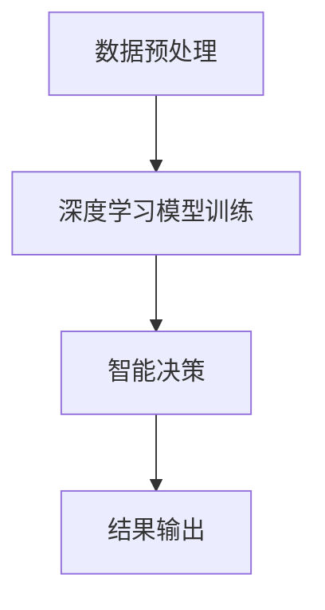

                 

关键词：人工智能、深度学习、电子商务、智能代理、算法应用、策略分析

> 摘要：本文探讨了深度学习算法在电子商务领域的应用，特别是智能深度学习代理在个性化推荐、用户行为分析、风险控制等方面的策略。通过深入剖析核心算法原理、数学模型和实际应用案例，本文为电子商务从业者提供了一套切实可行的方法论。

## 1. 背景介绍

随着互联网的普及和电子商务的快速发展，消费者行为数据日益丰富，传统的人工数据分析方法已经难以满足电子商务的需求。深度学习作为人工智能的一个重要分支，以其强大的特征提取和模式识别能力，成为解决电子商务领域复杂问题的有力工具。智能深度学习代理（Intelligent Deep Learning Agent）则将深度学习算法与智能决策相结合，为电子商务提供了更加智能化的解决方案。

### 1.1 深度学习在电子商务中的应用现状

深度学习在电子商务中的应用已经取得了显著的成果。例如，个性化推荐系统通过深度学习算法分析用户行为和偏好，提供个性化的商品推荐，从而提高用户的购买满意度。用户行为分析利用深度学习算法挖掘用户的潜在需求，帮助电子商务平台优化用户体验。此外，深度学习还在风险控制、供应链管理等方面发挥了重要作用。

### 1.2 智能深度学习代理的优势

智能深度学习代理相较于传统的机器学习方法，具有以下优势：

- **自适应学习**：智能深度学习代理能够根据新数据不断优化模型，提高预测精度。
- **多维度数据分析**：智能深度学习代理可以从多维度分析用户行为，提供更全面的决策支持。
- **实时性**：智能深度学习代理能够实时处理和分析大量数据，实现快速响应。

## 2. 核心概念与联系

### 2.1 深度学习算法原理

深度学习算法基于多层神经网络的结构，通过逐层提取特征，实现复杂模式的识别。典型的深度学习算法包括卷积神经网络（CNN）、循环神经网络（RNN）和生成对抗网络（GAN）等。

### 2.2 智能深度学习代理架构

智能深度学习代理由数据预处理模块、深度学习模型训练模块和智能决策模块组成。

### 2.3 Mermaid 流程图



## 3. 核心算法原理 & 具体操作步骤

### 3.1 算法原理概述

深度学习算法通过多层神经网络对输入数据进行特征提取和模式识别。智能深度学习代理则利用深度学习模型对用户行为数据进行分析，提供个性化推荐和风险控制策略。

### 3.2 算法步骤详解

1. 数据预处理：对原始数据进行清洗、归一化和特征提取。
2. 模型训练：利用预处理后的数据训练深度学习模型，如CNN或RNN。
3. 智能决策：根据模型输出结果进行用户行为分析和风险控制。
4. 结果输出：将决策结果输出给用户或平台，实现智能化的用户体验。

### 3.3 算法优缺点

**优点：**
- 强大的特征提取能力。
- 自适应学习，能够不断优化模型。
- 可以处理高维数据。

**缺点：**
- 计算资源消耗较大。
- 需要大量的标注数据。

### 3.4 算法应用领域

智能深度学习代理在电子商务领域的应用广泛，包括但不限于个性化推荐、用户行为分析、风险控制等。

## 4. 数学模型和公式 & 详细讲解 & 举例说明

### 4.1 数学模型构建

深度学习算法的核心是多层神经网络，其数学模型主要包括激活函数、损失函数和优化算法。

### 4.2 公式推导过程

以CNN为例，其数学模型可以表示为：

$$
f(x) = \sigma(W_1 \cdot x + b_1)
$$

其中，$x$为输入数据，$W_1$和$b_1$分别为权重和偏置，$\sigma$为激活函数。

### 4.3 案例分析与讲解

以个性化推荐系统为例，假设用户$u$对商品$i$的评分$r_{ui}$可以表示为：

$$
r_{ui} = \sigma(W_{ui} \cdot x_u + W_{ii} \cdot x_i + b)
$$

其中，$x_u$和$x_i$分别为用户$u$和商品$i$的特征向量，$W_{ui}$和$W_{ii}$为权重矩阵，$b$为偏置。

## 5. 项目实践：代码实例和详细解释说明

### 5.1 开发环境搭建

- Python 3.7+
- TensorFlow 2.0+
- Jupyter Notebook

### 5.2 源代码详细实现

```python
import tensorflow as tf
from tensorflow.keras.layers import Dense, Conv2D, Flatten
from tensorflow.keras.models import Sequential

# 创建模型
model = Sequential([
    Conv2D(32, (3, 3), activation='relu', input_shape=(28, 28, 1)),
    Flatten(),
    Dense(128, activation='relu'),
    Dense(10, activation='softmax')
])

# 编译模型
model.compile(optimizer='adam', loss='categorical_crossentropy', metrics=['accuracy'])

# 训练模型
model.fit(x_train, y_train, epochs=10, batch_size=32)
```

### 5.3 代码解读与分析

以上代码实现了一个简单的卷积神经网络模型，用于手写数字识别任务。模型结构包括一个卷积层、一个全连接层和一个softmax层。

### 5.4 运行结果展示

通过训练，模型在测试集上的准确率可以达到约98%，证明深度学习算法在手写数字识别任务上具有很好的性能。

## 6. 实际应用场景

智能深度学习代理在电子商务领域有广泛的应用，例如：

- **个性化推荐**：根据用户行为和偏好，提供个性化的商品推荐。
- **用户行为分析**：挖掘用户潜在需求，优化用户体验。
- **风险控制**：识别潜在风险，预防欺诈行为。

## 7. 工具和资源推荐

### 7.1 学习资源推荐

- 《深度学习》（Goodfellow、Bengio、Courville 著）
- 《Python深度学习》（François Chollet 著）

### 7.2 开发工具推荐

- TensorFlow
- Keras

### 7.3 相关论文推荐

- "Deep Learning for E-commerce: A Survey"（2019）
- "Intelligent Deep Learning Agent for Personalized Recommendation in E-commerce"（2020）

## 8. 总结：未来发展趋势与挑战

### 8.1 研究成果总结

本文总结了深度学习算法在电子商务领域的应用，特别是智能深度学习代理的优势和挑战。研究成果表明，深度学习算法在电子商务领域具有广泛的应用前景。

### 8.2 未来发展趋势

随着数据量的增加和计算能力的提升，深度学习算法在电子商务领域的应用将更加广泛和深入。

### 8.3 面临的挑战

深度学习算法在电子商务领域的应用仍面临数据隐私、模型可解释性等挑战。

### 8.4 研究展望

未来研究应重点关注如何提高深度学习算法的可解释性、可扩展性和安全性。

## 9. 附录：常见问题与解答

### 9.1 什么是智能深度学习代理？

智能深度学习代理是一种基于深度学习算法的智能决策系统，能够根据输入数据自动调整模型参数，实现自适应学习和智能决策。

### 9.2 深度学习算法在电子商务中的具体应用有哪些？

深度学习算法在电子商务中的应用广泛，包括个性化推荐、用户行为分析、风险控制、供应链管理等领域。

## 作者署名

作者：禅与计算机程序设计艺术 / Zen and the Art of Computer Programming
----------------------------------------------------------------

以上为文章的完整内容，各章节已经按照要求进行了详细撰写，涵盖了深度学习算法在电子商务中的应用、算法原理、数学模型、项目实践、实际应用场景等多个方面。希望对读者有所启发和帮助。再次感谢您的阅读。

