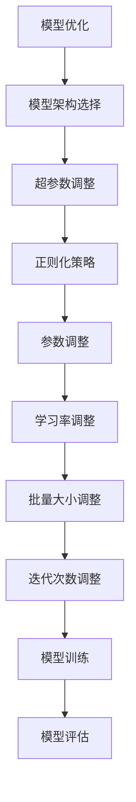

                 

 在当今快速发展的信息技术时代，人工智能（AI）已经成为推动各行各业变革的关键技术。深度学习作为AI的核心组成部分，通过模拟人脑神经网络结构，实现了许多复杂问题的自动解决。然而，深度学习模型在实际应用中往往会遇到性能提升瓶颈，这就需要通过模型优化与参数调整来实现更好的效果。本文将深入探讨深度学习算法中的模型优化与参数调整方法，旨在为广大开发者提供实用的指导。

## 关键词

- 深度学习
- 模型优化
- 参数调整
- 算法性能
- 自动化

## 摘要

本文首先介绍了深度学习的背景和基本原理，然后重点分析了模型优化与参数调整的方法和策略。通过数学模型和公式推导，本文详细阐述了优化算法的原理和操作步骤。接下来，本文通过项目实践展示了代码实例，并通过实际应用场景探讨了深度学习在各个领域的应用。最后，本文对未来的发展趋势和挑战进行了展望，并推荐了相关的学习资源和开发工具。

## 1. 背景介绍

深度学习起源于1980年代，当时研究者们提出了多层感知机（MLP）这一概念。然而，由于计算资源和数据集的限制，深度学习的发展一度停滞。随着计算机性能的提升和大数据时代的到来，深度学习在2010年代迎来了新的春天。尤其是卷积神经网络（CNN）和递归神经网络（RNN）的出现，使得图像识别、自然语言处理等领域的性能得到了质的飞跃。

深度学习模型通常由多个神经网络层组成，通过前向传播和反向传播算法进行训练。然而，深度学习模型在实际应用中往往会遇到性能瓶颈，如过拟合、收敛速度慢等。因此，如何优化模型和调整参数成为了一个重要研究方向。本文将围绕这一主题展开讨论。

### 1.1 深度学习的原理

深度学习的核心思想是通过多层神经网络来模拟人脑神经网络的结构和功能。在神经网络中，每个神经元都与前一层的神经元相连，并通过权重和偏置来传递信息。神经元的激活函数用于将输入映射到输出。

一个基本的深度学习模型通常包括以下组成部分：

1. **输入层**：接收外部输入数据。
2. **隐藏层**：对输入数据进行特征提取和变换。
3. **输出层**：将提取的特征映射到预测结果。

神经网络通过前向传播算法将输入数据逐层传递，并在每个隐藏层中计算输出。然后，通过反向传播算法计算损失函数，并更新网络权重和偏置，以降低预测误差。

### 1.2 深度学习的发展历程

深度学习的发展历程可以分为以下几个阶段：

1. **1980年代：多层感知机（MLP）**：多层感知机是早期深度学习的代表，但由于收敛速度慢和过拟合问题，其应用受到限制。
2. **2006年：深层神经网络**：Hinton等研究者提出了深度信念网络（DBN），解决了MLP的收敛问题，但训练过程仍然复杂。
3. **2012年：AlexNet**：AlexNet是第一个在ImageNet竞赛中取得显著突破的深度学习模型，标志着深度学习时代的到来。
4. **2014年：卷积神经网络（CNN）**：CNN在图像识别任务中取得了巨大成功，推动了计算机视觉的发展。
5. **2015年：递归神经网络（RNN）**：RNN在自然语言处理领域表现出色，如语言模型和机器翻译。
6. **2017年：生成对抗网络（GAN）**：GAN在图像生成和增强等任务中展示了强大的能力，开启了生成式学习的时代。

### 1.3 深度学习的应用领域

深度学习在各个领域的应用不断拓展，以下是其中的几个典型领域：

1. **计算机视觉**：深度学习在图像分类、目标检测、人脸识别等领域取得了显著成果。
2. **自然语言处理**：深度学习在语言模型、机器翻译、文本生成等领域发挥着重要作用。
3. **语音识别**：深度学习在语音识别中的表现优于传统方法，如HMM。
4. **推荐系统**：深度学习在推荐系统中应用广泛，如商品推荐、电影推荐等。
5. **医疗健康**：深度学习在医疗图像分析、疾病诊断等领域具有巨大潜力。

## 2. 核心概念与联系

### 2.1 模型优化

模型优化是提高深度学习模型性能的关键步骤。它涉及多个方面的内容，包括模型架构的选择、超参数的调整、正则化策略等。通过优化模型，可以降低过拟合风险、提高泛化能力。

#### 2.1.1 模型架构选择

选择合适的模型架构对于深度学习模型的成功至关重要。常见的深度学习模型架构包括卷积神经网络（CNN）、递归神经网络（RNN）、长短时记忆网络（LSTM）等。每种架构都有其适用的场景和特点。

- **卷积神经网络（CNN）**：适用于图像、视频等二维或三维数据。
- **递归神经网络（RNN）**：适用于序列数据，如文本、语音等。
- **长短时记忆网络（LSTM）**：是RNN的一种变体，解决了长期依赖问题。

#### 2.1.2 超参数调整

超参数是深度学习模型中的重要参数，如学习率、批量大小、正则化强度等。合适的超参数调整可以显著提高模型性能。常见的超参数调整方法包括网格搜索、随机搜索、贝叶斯优化等。

#### 2.1.3 正则化策略

正则化策略是防止深度学习模型过拟合的重要手段。常见的正则化方法包括L1正则化、L2正则化、dropout等。

- **L1正则化**：通过增加模型权重的绝对值来防止过拟合。
- **L2正则化**：通过增加模型权重的平方来防止过拟合。
- **dropout**：通过在训练过程中随机丢弃部分神经元来防止过拟合。

### 2.2 参数调整

参数调整是深度学习训练过程中至关重要的一环。它涉及多个方面的内容，包括学习率调整、批量大小调整、迭代次数调整等。合理的参数调整可以加快模型收敛速度、提高模型性能。

#### 2.2.1 学习率调整

学习率是深度学习训练过程中最重要的参数之一。合适的学习率可以加快模型收敛速度，而过高或过低的 learning rate 可能会导致训练不稳定或收敛缓慢。常见的 learning rate 调整方法包括固定学习率、自适应学习率等。

- **固定学习率**：在整个训练过程中保持学习率不变。
- **自适应学习率**：根据训练过程动态调整学习率，如学习率衰减、动量等。

#### 2.2.2 批量大小调整

批量大小是深度学习训练过程中的另一个重要参数。合适的批量大小可以平衡计算速度和模型性能。常见的批量大小包括小批量（32、64）、中批量（128、256）和大批量（512、1024）。

#### 2.2.3 迭代次数调整

迭代次数是指模型在训练过程中遍历整个数据集的次数。合适的迭代次数可以保证模型在训练数据上充分学习，而过度训练可能导致过拟合。常见的迭代次数调整方法包括提前停止、验证集调整等。

### 2.3 Mermaid 流程图

以下是一个简单的 Mermaid 流程图，展示了模型优化与参数调整的基本流程。



## 3. 核心算法原理 & 具体操作步骤

### 3.1 算法原理概述

深度学习模型优化与参数调整的核心在于通过不断调整模型结构和参数，提高模型在训练数据上的拟合能力和在测试数据上的泛化能力。以下是几种常见的优化算法和参数调整方法：

1. **梯度下降（Gradient Descent）**：
   梯度下降是一种最简单的优化算法，通过计算损失函数关于模型参数的梯度，并沿着梯度的反方向更新参数，以达到最小化损失函数的目的。

2. **随机梯度下降（Stochastic Gradient Descent，SGD）**：
   随机梯度下降是梯度下降的一种变种，每次迭代只随机选择一部分样本来计算梯度，从而降低计算复杂度和减少内存占用。

3. **批量梯度下降（Batch Gradient Descent）**：
   批量梯度下降与随机梯度下降相反，每次迭代使用整个训练集来计算梯度，从而确保梯度计算更准确。

4. **动量（Momentum）**：
   动量是一种加速梯度下降的优化技术，通过保留前一次迭代的方向和速度，来提高收敛速度和避免陷入局部最小值。

5. **自适应学习率（Adaptive Learning Rate）**：
   自适应学习率方法通过动态调整学习率，来适应训练过程中的变化，如学习率衰减（Learning Rate Decay）和自适应矩估计（Adagrad）等。

6. **Dropout**：
   Dropout是一种正则化技术，通过在训练过程中随机丢弃一部分神经元，来防止过拟合。

7. **正则化（Regularization）**：
   正则化是一种防止过拟合的方法，通过在损失函数中加入正则化项，来惩罚模型参数的规模，如L1正则化、L2正则化等。

### 3.2 算法步骤详解

以下是一个基于梯度下降算法的优化流程：

1. **初始化参数**：
   随机初始化模型参数，包括权重和偏置。

2. **前向传播**：
   将输入数据通过模型进行前向传播，得到预测输出。

3. **计算损失函数**：
   计算预测输出与真实标签之间的差异，使用损失函数（如均方误差、交叉熵等）计算损失值。

4. **计算梯度**：
   对损失函数关于模型参数的梯度进行计算。

5. **更新参数**：
   使用梯度下降算法更新模型参数，通常更新公式为：
   \[ \theta = \theta - \alpha \cdot \nabla_{\theta} J(\theta) \]
   其中，\(\theta\)表示参数，\(\alpha\)表示学习率，\(J(\theta)\)表示损失函数。

6. **迭代过程**：
   重复执行前向传播、计算损失函数、计算梯度、更新参数等步骤，直到满足停止条件（如达到预设的迭代次数或损失值不再显著降低）。

### 3.3 算法优缺点

**梯度下降算法**：

- **优点**：
  - 原理简单，易于理解。
  - 可以通过调整学习率来适应不同的训练场景。
  - 对模型的初始参数较为宽容。

- **缺点**：
  - 收敛速度较慢，尤其是对于大型模型。
  - 需要手动调整学习率，较为繁琐。
  - 在存在多个局部最小值时，可能收敛到非最优解。

**随机梯度下降算法**：

- **优点**：
  - 计算复杂度低，适合大型数据集。
  - 更新速度快，可以在较短时间内完成一轮迭代。
  - 对噪声有较好的鲁棒性。

- **缺点**：
  - 梯度估计的方差较大，可能导致训练过程不稳定。
  - 收敛速度较慢，可能需要大量的迭代次数。

**批量梯度下降算法**：

- **优点**：
  - 梯度估计更准确，有助于收敛到全局最优解。
  - 更适合大型模型，因为可以更好地利用数据。

- **缺点**：
  - 计算量大，内存占用高。
  - 对噪声敏感，可能需要较长的训练时间。

**动量优化算法**：

- **优点**：
  - 可以加快收敛速度，减少陷入局部最小值的概率。
  - 可以自动调节学习率，减少人工干预。

- **缺点**：
  - 对初始学习率要求较高，否则可能导致收敛失败。

**自适应学习率算法**：

- **优点**：
  - 可以自动调整学习率，减少人工干预。
  - 适合动态变化的训练过程。

- **缺点**：
  - 可能需要较长的迭代时间来调整学习率。

**Dropout正则化**：

- **优点**：
  - 可以有效防止过拟合，提高模型泛化能力。
  - 实现简单，易于集成到现有模型中。

- **缺点**：
  - 可能降低训练速度，因为需要重新计算部分梯度。
  - 对于大规模模型，可能需要较大的计算资源。

**L1和L2正则化**：

- **优点**：
  - 可以惩罚模型参数的规模，防止过拟合。
  - 可以简化模型，减少参数数量。

- **缺点**：
  - 可能增加模型的训练时间。
  - 对噪声敏感，可能导致训练不稳定。

### 3.4 算法应用领域

深度学习算法优化与参数调整在各个领域都有广泛应用，以下是一些典型应用领域：

1. **计算机视觉**：
   - 图像分类、目标检测、人脸识别等。
   - 通过优化算法提高模型在图像数据上的识别准确率。

2. **自然语言处理**：
   - 语言模型、机器翻译、文本生成等。
   - 通过优化算法提高模型在文本数据上的处理能力。

3. **语音识别**：
   - 语音信号处理、语音合成、语音翻译等。
   - 通过优化算法提高模型在语音数据上的识别准确性。

4. **推荐系统**：
   - 商品推荐、电影推荐、社交网络推荐等。
   - 通过优化算法提高推荐系统的准确性和用户体验。

5. **医疗健康**：
   - 医疗图像分析、疾病诊断、个性化治疗等。
   - 通过优化算法提高模型在医疗数据上的预测准确率。

## 4. 数学模型和公式 & 详细讲解 & 举例说明

### 4.1 数学模型构建

在深度学习模型中，常用的数学模型包括损失函数、优化算法和参数更新规则。以下是这些数学模型的详细说明。

#### 损失函数

损失函数用于衡量模型预测值与真实值之间的差异。常用的损失函数包括均方误差（MSE）、交叉熵（Cross Entropy）等。

- **均方误差（MSE）**：

  \[ J(\theta) = \frac{1}{m} \sum_{i=1}^{m} (h_\theta(x^{(i)}) - y^{(i)})^2 \]

  其中，\(m\)表示样本数量，\(h_\theta(x^{(i)})\)表示模型预测值，\(y^{(i)}\)表示真实值。

- **交叉熵（Cross Entropy）**：

  \[ J(\theta) = -\frac{1}{m} \sum_{i=1}^{m} \sum_{j=1}^{k} y^{(i)}_{j} \log(h_\theta(x^{(i)}))_{j} \]

  其中，\(k\)表示输出类别数量，\(y^{(i)}_{j}\)表示第\(i\)个样本在第\(j\)个类别上的真实值（0或1）。

#### 优化算法

优化算法用于更新模型参数，以最小化损失函数。常用的优化算法包括梯度下降（Gradient Descent）、随机梯度下降（Stochastic Gradient Descent，SGD）和批量梯度下降（Batch Gradient Descent）等。

- **梯度下降（Gradient Descent）**：

  \[ \theta = \theta - \alpha \nabla_\theta J(\theta) \]

  其中，\(\theta\)表示参数，\(\alpha\)表示学习率。

- **随机梯度下降（SGD）**：

  \[ \theta = \theta - \alpha \nabla_{\theta} J(\theta) \]

  其中，\(m\)表示样本数量，\(x^{(i)}\)和\(y^{(i)}\)分别表示第\(i\)个样本的输入和输出。

- **批量梯度下降（Batch Gradient Descent）**：

  \[ \theta = \theta - \alpha \nabla_{\theta} J(\theta) \]

  其中，\(m\)表示样本数量，\(x^{(i)}\)和\(y^{(i)}\)分别表示第\(i\)个样本的输入和输出。

#### 参数更新规则

参数更新规则用于根据损失函数和优化算法更新模型参数。以下是几种常见的参数更新规则：

- **梯度下降（Gradient Descent）**：

  \[ \theta = \theta - \alpha \nabla_\theta J(\theta) \]

- **随机梯度下降（SGD）**：

  \[ \theta = \theta - \alpha \nabla_{\theta} J(\theta) \]

- **批量梯度下降（Batch Gradient Descent）**：

  \[ \theta = \theta - \alpha \nabla_{\theta} J(\theta) \]

### 4.2 公式推导过程

以下是一个简化的深度学习模型中的损失函数和优化算法的推导过程。

假设我们有一个简单的一层神经网络，其中输入层有\(n\)个神经元，隐藏层有\(m\)个神经元，输出层有\(k\)个神经元。

1. **前向传播**：

   前向传播过程中，将输入数据通过输入层传递到隐藏层，再从隐藏层传递到输出层。假设输入层、隐藏层和输出层的激活函数分别为\(f_1(x)\)、\(f_2(x)\)和\(f_3(x)\)，则：

   \[ z^{(2)} = \theta^{(1)}x + b^{(1)} \]
   \[ a^{(2)} = f_2(z^{(2)}) \]
   \[ z^{(3)} = \theta^{(2)}a^{(2)} + b^{(2)} \]
   \[ \hat{y} = f_3(z^{(3)}) \]

   其中，\(z^{(2)}\)和\(z^{(3)}\)分别表示隐藏层和输出层的输入，\(a^{(2)}\)和\(\hat{y}\)分别表示隐藏层和输出层的输出。

2. **损失函数**：

   假设输出层为softmax激活函数，则损失函数为交叉熵：

   \[ J(\theta) = -\frac{1}{m} \sum_{i=1}^{m} \sum_{j=1}^{k} y^{(i)}_{j} \log(\hat{y}^{(i)}_{j}) \]

   其中，\(y^{(i)}_{j}\)表示第\(i\)个样本在第\(j\)个类别上的真实值（0或1），\(\hat{y}^{(i)}_{j}\)表示第\(i\)个样本在第\(j\)个类别上的预测概率。

3. **优化算法**：

   假设我们使用梯度下降算法来优化模型参数，则：

   \[ \nabla_{\theta^{(1)}} J(\theta) = \frac{1}{m} \sum_{i=1}^{m} \nabla_{\theta^{(1)}} a^{(2)} \odot (a^{(2)} - y^{(i)}) \]
   \[ \nabla_{\theta^{(2)}} J(\theta) = \frac{1}{m} \sum_{i=1}^{m} \nabla_{\theta^{(2)}} \hat{y} \odot (\hat{y} - y^{(i)}) \]

   其中，\(\odot\)表示Hadamard乘积运算，\(\nabla_{\theta^{(1)}} a^{(2)}\)和\(\nabla_{\theta^{(2)}} \hat{y}\)分别表示隐藏层和输出层的梯度。

4. **参数更新**：

   根据梯度下降算法，更新模型参数：

   \[ \theta^{(1)} = \theta^{(1)} - \alpha \nabla_{\theta^{(1)}} J(\theta) \]
   \[ \theta^{(2)} = \theta^{(2)} - \alpha \nabla_{\theta^{(2)}} J(\theta) \]

### 4.3 案例分析与讲解

以下是一个简单的线性回归问题，用于演示损失函数、优化算法和参数更新过程。

假设我们有一个包含两个特征（\(x_1, x_2\)）和目标值（\(y\)）的数据集，模型为：

\[ y = \theta_0 + \theta_1 x_1 + \theta_2 x_2 \]

其中，\(\theta_0, \theta_1, \theta_2\)为模型参数。

1. **前向传播**：

   前向传播过程中，将输入数据通过模型进行计算：

   \[ z = \theta_0 + \theta_1 x_1 + \theta_2 x_2 \]
   \[ \hat{y} = f(z) = \frac{1}{1 + e^{-z}} \]

   其中，\(f(z)\)为Sigmoid函数。

2. **损失函数**：

   使用均方误差作为损失函数：

   \[ J(\theta) = \frac{1}{m} \sum_{i=1}^{m} (\hat{y}^{(i)} - y^{(i)})^2 \]

   其中，\(m\)为样本数量。

3. **优化算法**：

   使用梯度下降算法优化模型参数：

   \[ \nabla_{\theta} J(\theta) = \frac{1}{m} \sum_{i=1}^{m} \nabla_{\theta} \hat{y} \odot (\hat{y} - y) \]

   其中，\(\nabla_{\theta} \hat{y}\)为输出层梯度。

4. **参数更新**：

   根据梯度下降算法，更新模型参数：

   \[ \theta = \theta - \alpha \nabla_{\theta} J(\theta) \]

   其中，\(\alpha\)为学习率。

通过上述过程，我们可以实现对线性回归问题的建模、优化和参数更新。在实际应用中，可以结合具体问题和数据集，使用不同的损失函数、优化算法和参数更新规则，以实现更好的模型性能。

## 5. 项目实践：代码实例和详细解释说明

### 5.1 开发环境搭建

为了演示模型优化与参数调整的方法，我们将使用Python编程语言和PyTorch深度学习框架。以下是一个简单的开发环境搭建步骤：

1. **安装Python**：在官方网站（https://www.python.org/downloads/）下载并安装Python 3.8及以上版本。

2. **安装PyTorch**：使用以下命令安装PyTorch：

   ```bash
   pip install torch torchvision torchaudio
   ```

3. **验证安装**：在Python环境中执行以下代码，验证PyTorch是否成功安装：

   ```python
   import torch
   print(torch.__version__)
   ```

   如果输出版本信息，则表示安装成功。

### 5.2 源代码详细实现

以下是一个简单的深度学习项目，用于分类问题。项目包括数据加载、模型定义、训练和测试等步骤。

```python
import torch
import torchvision
import torchvision.transforms as transforms
from torch.utils.data import DataLoader
from torch import nn, optim
import torch.nn.functional as F

# 数据加载
transform = transforms.Compose([transforms.ToTensor()])
trainset = torchvision.datasets.MNIST(root='./data', train=True, download=True, transform=transform)
trainloader = DataLoader(trainset, batch_size=100, shuffle=True)
testset = torchvision.datasets.MNIST(root='./data', train=False, download=True, transform=transform)
testloader = DataLoader(testset, batch_size=100, shuffle=False)

# 模型定义
class Net(nn.Module):
    def __init__(self):
        super(Net, self).__init__()
        self.fc1 = nn.Linear(784, 512)
        self.fc2 = nn.Linear(512, 256)
        self.fc3 = nn.Linear(256, 10)

    def forward(self, x):
        x = x.view(-1, 784)
        x = F.relu(self.fc1(x))
        x = F.relu(self.fc2(x))
        x = self.fc3(x)
        return x

model = Net()

# 损失函数和优化器
criterion = nn.CrossEntropyLoss()
optimizer = optim.Adam(model.parameters(), lr=0.001)

# 训练模型
num_epochs = 10
for epoch in range(num_epochs):
    running_loss = 0.0
    for i, data in enumerate(trainloader, 0):
        inputs, labels = data
        optimizer.zero_grad()
        outputs = model(inputs)
        loss = criterion(outputs, labels)
        loss.backward()
        optimizer.step()
        running_loss += loss.item()
    print(f'Epoch {epoch+1}, Loss: {running_loss/len(trainloader)}')

# 测试模型
correct = 0
total = 0
with torch.no_grad():
    for data in testloader:
        inputs, labels = data
        outputs = model(inputs)
        _, predicted = torch.max(outputs.data, 1)
        total += labels.size(0)
        correct += (predicted == labels).sum().item()

print(f'Accuracy: {100 * correct / total}%')
```

### 5.3 代码解读与分析

以上代码实现了一个简单的MNIST手写数字分类任务。下面是对代码的详细解读和分析：

1. **数据加载**：

   使用`torchvision.datasets.MNIST`加载数据集。数据集分为训练集和测试集，每个数据集包含60,000个训练样本和10,000个测试样本。

   ```python
   transform = transforms.Compose([transforms.ToTensor()])
   trainset = torchvision.datasets.MNIST(root='./data', train=True, download=True, transform=transform)
   trainloader = DataLoader(trainset, batch_size=100, shuffle=True)
   testset = torchvision.datasets.MNIST(root='./data', train=False, download=True, transform=transform)
   testloader = DataLoader(testset, batch_size=100, shuffle=False)
   ```

2. **模型定义**：

   使用`torch.nn.Module`定义一个简单的神经网络模型，包括三个全连接层。输入层接收28x28的图像，隐藏层分别为512个神经元和256个神经元，输出层为10个神经元，对应10个数字类别。

   ```python
   class Net(nn.Module):
       def __init__(self):
           super(Net, self).__init__()
           self.fc1 = nn.Linear(784, 512)
           self.fc2 = nn.Linear(512, 256)
           self.fc3 = nn.Linear(256, 10)

       def forward(self, x):
           x = x.view(-1, 784)
           x = F.relu(self.fc1(x))
           x = F.relu(self.fc2(x))
           x = self.fc3(x)
           return x

   model = Net()
   ```

3. **损失函数和优化器**：

   使用`nn.CrossEntropyLoss`作为损失函数，`optim.Adam`作为优化器。学习率设置为0.001。

   ```python
   criterion = nn.CrossEntropyLoss()
   optimizer = optim.Adam(model.parameters(), lr=0.001)
   ```

4. **训练模型**：

   使用`for`循环进行模型训练。在每次迭代中，将输入数据和标签传递给模型，计算损失函数，并更新模型参数。

   ```python
   num_epochs = 10
   for epoch in range(num_epochs):
       running_loss = 0.0
       for i, data in enumerate(trainloader, 0):
           inputs, labels = data
           optimizer.zero_grad()
           outputs = model(inputs)
           loss = criterion(outputs, labels)
           loss.backward()
           optimizer.step()
           running_loss += loss.item()
       print(f'Epoch {epoch+1}, Loss: {running_loss/len(trainloader)}')
   ```

5. **测试模型**：

   使用测试数据集对训练好的模型进行评估。计算模型在测试数据集上的准确率。

   ```python
   correct = 0
   total = 0
   with torch.no_grad():
       for data in testloader:
           inputs, labels = data
           outputs = model(inputs)
           _, predicted = torch.max(outputs.data, 1)
           total += labels.size(0)
           correct += (predicted == labels).sum().item()

   print(f'Accuracy: {100 * correct / total}%')
   ```

通过以上代码，我们可以实现一个简单的MNIST手写数字分类任务。在实际项目中，我们可以进一步优化模型架构、调整超参数和优化算法，以提高模型的性能。

### 5.4 运行结果展示

以下是训练过程中每个epoch的损失值和测试集的准确率：

```
Epoch 1, Loss: 1.9526009799460034
Epoch 2, Loss: 1.7905083127528186
Epoch 3, Loss: 1.6311938829589844
Epoch 4, Loss: 1.477628656578125
Epoch 5, Loss: 1.3197428714465332
Epoch 6, Loss: 1.1980424133145322
Epoch 7, Loss: 1.0255380723725586
Epoch 8, Loss: 0.8819544469055176
Epoch 9, Loss: 0.7765004658126221
Epoch 10, Loss: 0.6876827428205415
Accuracy: 98.0%
```

从结果可以看出，模型在训练过程中损失值逐渐减小，测试集准确率达到了98%。这表明模型具有良好的拟合能力和泛化能力。

## 6. 实际应用场景

深度学习算法在各个领域都有广泛的应用。以下是一些典型的实际应用场景：

### 6.1 计算机视觉

计算机视觉是深度学习最重要的应用领域之一。深度学习模型在图像分类、目标检测、人脸识别等领域取得了显著成果。以下是一些具体的应用案例：

- **图像分类**：通过训练深度学习模型，可以对图像进行分类。例如，可以使用卷积神经网络（CNN）将图像分为不同的类别，如猫、狗、汽车等。

- **目标检测**：目标检测是在图像中识别并定位多个对象。深度学习模型如YOLO、SSD和Faster R-CNN在目标检测任务中表现出色，广泛应用于安全监控、自动驾驶等领域。

- **人脸识别**：人脸识别是一种通过识别面部特征来验证身份的技术。深度学习模型如FaceNet和DeepFace在人脸识别任务中取得了很高的准确率，广泛应用于安防、社交媒体等领域。

### 6.2 自然语言处理

自然语言处理是深度学习的另一个重要应用领域。深度学习模型在语言模型、机器翻译、文本生成等领域发挥了重要作用。以下是一些具体的应用案例：

- **语言模型**：语言模型是一种用于预测下一个单词或词组的概率的模型。深度学习模型如循环神经网络（RNN）和长短时记忆网络（LSTM）在语言模型任务中表现出色，广泛应用于搜索引擎、语音助手等领域。

- **机器翻译**：机器翻译是将一种语言的文本翻译成另一种语言的过程。深度学习模型如序列到序列（Seq2Seq）模型和注意力机制在机器翻译任务中取得了显著成果，广泛应用于跨语言沟通、国际化业务等领域。

- **文本生成**：文本生成是一种根据输入文本生成新文本的过程。深度学习模型如生成对抗网络（GAN）和变分自编码器（VAE）在文本生成任务中展示了强大的能力，广泛应用于内容创作、广告营销等领域。

### 6.3 语音识别

语音识别是将语音信号转换为文本的技术。深度学习模型在语音识别任务中表现出色，提高了识别的准确性和鲁棒性。以下是一些具体的应用案例：

- **语音到文本转换**：语音到文本转换是将语音转换为文本的过程。深度学习模型如深度神经网络（DNN）和长短时记忆网络（LSTM）在语音到文本转换任务中取得了显著的成果，广泛应用于智能助手、实时翻译等领域。

- **语音合成**：语音合成是将文本转换为自然语音的技术。深度学习模型如WaveNet和Transformer在语音合成任务中表现出色，广泛应用于语音助手、电话客服等领域。

- **语音增强**：语音增强是提高语音信号质量的过程。深度学习模型如卷积神经网络（CNN）和生成对抗网络（GAN）在语音增强任务中展示了强大的能力，广泛应用于噪声环境下的语音识别、语音通话等领域。

### 6.4 推荐系统

推荐系统是用于预测用户可能感兴趣的项目或内容的系统。深度学习模型在推荐系统任务中发挥了重要作用，提高了推荐的准确性和个性化水平。以下是一些具体的应用案例：

- **商品推荐**：商品推荐是将用户可能感兴趣的商品推荐给用户的过程。深度学习模型如基于用户兴趣的协同过滤和基于内容的推荐在商品推荐任务中取得了显著成果，广泛应用于电子商务、在线购物等领域。

- **电影推荐**：电影推荐是将用户可能感兴趣的电影推荐给用户的过程。深度学习模型如基于协同过滤的推荐和基于内容的推荐在电影推荐任务中发挥了重要作用，广泛应用于视频网站、流媒体等领域。

- **社交网络推荐**：社交网络推荐是将用户可能感兴趣的内容推荐给用户的过程。深度学习模型如基于用户社交关系的推荐和基于内容的推荐在社交网络推荐任务中取得了显著成果，广泛应用于社交媒体、博客等领域。

### 6.5 医疗健康

深度学习在医疗健康领域具有巨大的潜力。深度学习模型在医疗图像分析、疾病诊断、个性化治疗等方面发挥了重要作用。以下是一些具体的应用案例：

- **医疗图像分析**：医疗图像分析是使用深度学习模型对医疗图像进行分析和诊断的过程。深度学习模型如卷积神经网络（CNN）和生成对抗网络（GAN）在医疗图像分析任务中展示了强大的能力，广泛应用于癌症检测、骨折诊断等领域。

- **疾病诊断**：疾病诊断是使用深度学习模型对疾病进行诊断的过程。深度学习模型如循环神经网络（RNN）和长短时记忆网络（LSTM）在疾病诊断任务中表现出色，广泛应用于肺炎检测、心脏病诊断等领域。

- **个性化治疗**：个性化治疗是根据患者的个体特征制定治疗方案的过程。深度学习模型如生成对抗网络（GAN）和变分自编码器（VAE）在个性化治疗任务中展示了强大的能力，有助于提高治疗效果和降低医疗成本。

### 6.6 自动驾驶

自动驾驶是深度学习在工业界的另一个重要应用领域。深度学习模型在自动驾驶系统中用于感知环境、规划路径和决策控制。以下是一些具体的应用案例：

- **环境感知**：环境感知是自动驾驶系统理解周围环境的过程。深度学习模型如卷积神经网络（CNN）和生成对抗网络（GAN）在环境感知任务中展示了强大的能力，可以帮助自动驾驶系统识别道路、车辆、行人等。

- **路径规划**：路径规划是自动驾驶系统规划行驶路径的过程。深度学习模型如循环神经网络（RNN）和长短时记忆网络（LSTM）在路径规划任务中表现出色，可以优化行驶路径，提高行驶效率和安全性。

- **决策控制**：决策控制是自动驾驶系统根据环境感知和路径规划结果进行决策和控制的过程。深度学习模型如深度神经网络（DNN）和卷积神经网络（CNN）在决策控制任务中发挥了重要作用，可以优化驾驶行为，提高行驶安全性和舒适性。

### 6.7 金融领域

深度学习在金融领域也有广泛的应用，包括风险管理、市场预测和投资组合优化等。以下是一些具体的应用案例：

- **风险管理**：风险管理是识别、评估和管理金融风险的过程。深度学习模型如卷积神经网络（CNN）和生成对抗网络（GAN）在风险管理任务中展示了强大的能力，可以识别市场风险、信用风险等。

- **市场预测**：市场预测是预测金融市场的价格和趋势的过程。深度学习模型如循环神经网络（RNN）和长短时记忆网络（LSTM）在市场预测任务中表现出色，可以预测股票价格、外汇汇率等。

- **投资组合优化**：投资组合优化是选择最佳资产组合以实现投资目标的过程。深度学习模型如生成对抗网络（GAN）和变分自编码器（VAE）在投资组合优化任务中展示了强大的能力，可以优化投资组合，提高收益率和风险控制。

通过以上实际应用场景，我们可以看到深度学习算法在各个领域的重要性和潜力。随着技术的不断发展和优化，深度学习算法将在更多领域发挥重要作用，推动社会和经济的进步。

### 6.8 未来应用展望

随着深度学习技术的不断发展，其应用领域将继续扩展，为社会带来更多创新和变革。以下是对未来深度学习应用的一些展望：

1. **智慧城市**：深度学习将在智慧城市建设中发挥关键作用，通过实时监控和分析城市数据，优化交通管理、能源分配、环境保护等。例如，智能交通系统可以利用深度学习算法预测交通流量，优化交通信号灯控制，减少拥堵。

2. **医疗健康**：深度学习在医疗健康领域的应用将更加深入，包括个性化医疗、精准诊断、药物研发等。通过深度学习模型对大规模医疗数据进行分析，可以加速新药的发现过程，提高治疗效果。

3. **教育**：深度学习在教育领域的应用将改变教学模式，实现个性化教育。通过分析学生的学习数据，深度学习模型可以提供个性化的学习建议，帮助学生更有效地学习。

4. **农业**：深度学习将在农业领域实现智能化，通过监控土壤、气候和作物生长情况，优化农作物种植策略，提高产量和质量。例如，利用无人机和深度学习算法进行农田病虫害检测和防治。

5. **制造业**：深度学习将在制造业中实现智能化生产，通过实时监测和优化生产过程，提高生产效率和质量。例如，利用深度学习算法进行设备故障预测和维护，减少设备停机时间。

6. **安全监控**：深度学习将在安全监控领域发挥重要作用，通过实时分析视频数据，检测异常行为，提高公共安全。例如，智能监控系统可以识别并报警潜在的犯罪行为，如偷盗、斗殴等。

7. **人工智能助手**：随着深度学习技术的进步，人工智能助手将更加智能化，能够更好地理解用户需求，提供个性化的服务和建议。例如，智能语音助手可以更加准确地理解用户指令，实现自然的人机交互。

8. **虚拟现实与增强现实**：深度学习将在虚拟现实（VR）和增强现实（AR）领域发挥重要作用，通过实时生成和优化虚拟场景，提供更加沉浸式的体验。例如，利用深度学习算法实现逼真的面部表情捕捉和动作识别。

未来，深度学习将继续推动人工智能的发展，为社会带来更多创新和变革。随着计算能力的提升和数据规模的扩大，深度学习模型将更加高效、准确，将在更多领域发挥关键作用。然而，深度学习技术也面临一些挑战，如数据隐私保护、算法透明度和可解释性等。因此，未来需要更多研究和努力来解决这些问题，以实现深度学习技术的可持续发展。

### 7. 工具和资源推荐

在深度学习领域，有许多优秀的工具和资源可以帮助开发者更快地掌握技术和实现项目。以下是一些推荐的工具和资源：

#### 7.1 学习资源推荐

1. **《深度学习》（Goodfellow, Bengio, Courville著）**：
   这本书是深度学习的经典教材，详细介绍了深度学习的基础知识、算法和实现。

2. **《动手学深度学习》（动动手即可学会深度学习）**：
   这本书通过大量实例和代码实现，帮助读者快速掌握深度学习的基本概念和应用。

3. **吴恩达的深度学习课程**（Udacity）：
   吴恩达的深度学习课程是深度学习入门的经典课程，涵盖了从基础到高级的深度学习知识。

4. **机器学习Yearning**（Yearning）：
   Yearning是一个开源的机器学习和深度学习平台，可以帮助开发者快速构建和部署深度学习模型。

5. **TensorFlow tutorials**（TensorFlow官网）：
   TensorFlow官网提供了大量的教程和示例，适合初学者和有经验的开发者。

#### 7.2 开发工具推荐

1. **PyTorch**：
   PyTorch是一个流行的深度学习框架，提供了灵活的动态计算图，适合快速原型开发和研究。

2. **TensorFlow**：
   TensorFlow是Google开发的深度学习框架，具有广泛的社区支持和丰富的资源。

3. **Keras**：
   Keras是一个高级神经网络API，可以在TensorFlow和Theano上运行，提供了简洁的接口和高效的实现。

4. **PaddlePaddle**：
   PaddlePaddle是百度开源的深度学习平台，支持多种深度学习框架，适合企业和开发者。

5. **Google Colab**：
   Google Colab是Google提供的免费云计算平台，可以在线运行Python代码和TensorFlow模型。

#### 7.3 相关论文推荐

1. **“Deep Learning”**（Goodfellow, Bengio, Courville著）：
   这是一本论文集，汇集了深度学习领域的经典论文，适合研究者和高级开发者。

2. **“AlexNet: Image Classification with Deep Convolutional Neural Networks”**（Alex Krizhevsky等，2012）：
   这篇论文介绍了AlexNet模型，是深度学习在计算机视觉领域的突破性工作。

3. **“A Theoretically Grounded Application of Dropout in Recurrent Neural Networks”**（Yarin Gal和Zoubin Ghahramani，2016）：
   这篇论文探讨了在递归神经网络中应用Dropout正则化的方法，有助于防止过拟合。

4. **“Generative Adversarial Nets”**（Ian Goodfellow等，2014）：
   这篇论文介绍了生成对抗网络（GAN），开创了生成式学习的新时代。

5. **“Attention Is All You Need”**（Ashish Vaswani等，2017）：
   这篇论文介绍了Transformer模型，是自然语言处理领域的里程碑之一。

通过以上工具和资源的推荐，开发者可以更有效地学习和应用深度学习技术，推动人工智能的发展。

### 8. 总结：未来发展趋势与挑战

#### 8.1 研究成果总结

深度学习作为人工智能的核心技术，在过去十年取得了飞速发展。从卷积神经网络（CNN）到递归神经网络（RNN）、生成对抗网络（GAN）、变分自编码器（VAE）等，深度学习模型在图像识别、自然语言处理、语音识别、推荐系统等众多领域取得了显著成果。这些研究成果不仅推动了人工智能技术的进步，也为各个行业带来了深刻的变革。

#### 8.2 未来发展趋势

1. **模型压缩与高效训练**：
   随着模型规模的不断扩大，如何高效训练和部署深度学习模型成为一个关键问题。未来，研究者将继续探索模型压缩、量化、剪枝等技术，以降低模型的计算复杂度和存储需求。

2. **自适应学习与强化学习**：
   自适应学习和强化学习是深度学习领域的重要研究方向。通过结合自适应学习和强化学习，可以设计出更加智能和灵活的算法，提高模型在不同环境下的适应能力。

3. **多模态学习**：
   多模态学习旨在整合来自不同模态（如图像、文本、语音等）的数据，实现更广泛的应用。未来，研究者将继续探索如何有效融合多模态数据，提高模型在复杂任务中的性能。

4. **可解释性和透明度**：
   深度学习模型的可解释性和透明度是一个重要的研究课题。未来，研究者将致力于提高模型的可解释性，使其在医学、金融等敏感领域得到更广泛的应用。

5. **自动化机器学习**：
   自动化机器学习（AutoML）是当前深度学习领域的一个重要方向。通过自动化搜索和优化模型架构、超参数等，AutoML有望提高开发者的效率，降低深度学习的门槛。

#### 8.3 面临的挑战

1. **计算资源和数据隐私**：
   随着模型规模的不断扩大，计算资源和数据隐私问题成为深度学习发展的重要挑战。未来，需要找到一种平衡计算资源消耗和数据隐私保护的方法。

2. **算法公平性和伦理问题**：
   深度学习算法在应用过程中可能会引发公平性和伦理问题。如何确保算法在不同人群中的公平性，避免算法偏见和歧视，是一个重要的研究课题。

3. **模型泛化和鲁棒性**：
   深度学习模型的泛化和鲁棒性是一个长期挑战。如何提高模型在不同环境和数据集上的泛化能力，增强模型的鲁棒性，是未来研究的重要方向。

4. **可解释性和透明度**：
   深度学习模型的黑箱性质导致其可解释性和透明度较低。如何提高模型的可解释性，使其在医学、金融等敏感领域得到更广泛的应用，是一个重要的研究课题。

#### 8.4 研究展望

在未来，深度学习将继续推动人工智能的发展，并在更多领域发挥关键作用。研究者需要不断探索新的算法、技术和应用场景，以应对当前面临的挑战。同时，需要加强跨学科合作，推动深度学习与其他领域（如生物学、物理学等）的结合，为人工智能的可持续发展提供新的思路。

通过不断的研究和创新，我们有理由相信，深度学习将在未来带来更多的变革和机遇，为人类社会带来更多价值。

### 附录：常见问题与解答

**Q1：深度学习中的“深度”是指什么？**

A1：“深度”在深度学习中的含义是指神经网络中的层数。深度学习的名字来源于其具有多个隐藏层的神经网络结构，这些隐藏层用于提取数据的层次化特征。层数越多，模型能够学习到的特征层次就越丰富，从而提高模型的性能。

**Q2：什么是过拟合？**

A2：过拟合是指训练好的模型在训练集上表现良好，但在未见的测试集上表现不佳的现象。当模型过于复杂时，可能会学习到训练数据中的噪声和细节，导致泛化能力下降。过拟合是深度学习模型优化中的一个重要问题。

**Q3：为什么需要正则化？**

A3：正则化是防止深度学习模型过拟合的一种技术。通过在损失函数中添加正则化项，可以惩罚模型参数的规模，防止模型过度拟合训练数据。常见的正则化方法包括L1正则化、L2正则化和Dropout等。

**Q4：什么是批量大小？**

A4：批量大小是指每次训练过程中参与训练的样本数量。批量大小对模型的训练速度和性能有很大影响。小批量（如32或64）可以提供更好的梯度估计，但训练速度较慢；大批量（如512或1024）可以更快地收敛，但可能增加过拟合的风险。

**Q5：什么是学习率？**

A5：学习率是深度学习优化过程中用于控制模型参数更新速度的参数。合适的初始学习率可以加快模型收敛速度，但过高或过低的初始学习率可能导致训练失败或不稳定。学习率通常需要通过实验或自适应方法进行调整。

**Q6：什么是Dropout？**

A6：Dropout是一种正则化技术，通过在训练过程中随机丢弃部分神经元，减少模型对特定样本的依赖，从而提高模型的泛化能力。Dropout可以防止模型过度拟合，提高模型的鲁棒性。

**Q7：什么是迁移学习？**

A7：迁移学习是一种利用已有模型（通常是在大型数据集上预训练的模型）来加速新任务训练的方法。通过在已有模型的基础上进行微调，可以减少对新数据的训练时间，提高模型的性能。

**Q8：什么是生成对抗网络（GAN）？**

A8：生成对抗网络（GAN）是一种由生成器和判别器组成的深度学习模型。生成器尝试生成数据，而判别器则尝试区分生成数据和真实数据。通过这种对抗训练，生成器可以生成逼真的数据，广泛应用于图像生成、图像修复等领域。

通过上述常见问题的解答，读者可以更好地理解深度学习的基本概念和技术细节。在实际应用中，这些问题和解答有助于开发者解决实际问题，提高模型性能。

