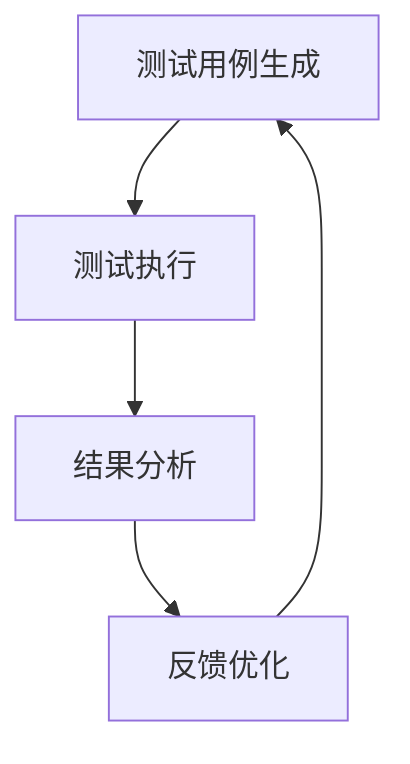

                 

关键词：AI代理，自动化测试，工作流，应用场景，技术实现，未来展望

> 摘要：本文将探讨AI代理在自动化测试中的工作流及应用，分析其核心概念、算法原理、具体操作步骤以及数学模型和公式。同时，通过实际项目实践，展示AI代理在实际开发中的应用效果。最后，对AI代理在自动化测试领域的未来发展趋势与挑战进行展望。

## 1. 背景介绍

在软件生命周期中，测试是不可或缺的一环。自动化测试相较于手工测试具有更高的效率和可靠性，但传统的自动化测试面临诸多挑战，如测试用例的编写、维护成本高、测试覆盖率低等。随着人工智能技术的不断发展，AI代理作为一种新型测试工具，逐渐成为自动化测试领域的研究热点。

AI代理通过模拟人类行为，具备测试用例生成、执行和结果分析的能力。其工作流包括测试用例生成、测试执行、结果分析和反馈优化等环节。AI代理利用机器学习算法，从大量测试数据中学习测试逻辑，提高测试覆盖率和准确性。

本文旨在探讨AI代理在自动化测试中的工作流及应用，分析其技术实现和数学模型，并结合实际项目实践，探讨AI代理在实际开发中的应用效果和未来发展趋势。

## 2. 核心概念与联系

### 2.1 AI代理定义

AI代理（AI Agent）是一种基于人工智能技术的软件程序，能够模拟人类行为，完成特定的任务。在自动化测试领域，AI代理通过模拟用户操作，实现自动化测试过程。

### 2.2 自动化测试工作流

自动化测试工作流包括以下环节：

1. 测试用例生成
2. 测试执行
3. 结果分析
4. 反馈优化

### 2.3 AI代理与自动化测试工作流的联系

AI代理在自动化测试工作流中发挥着重要作用。通过测试用例生成、测试执行和结果分析等环节，AI代理能够模拟人类行为，提高测试效率和覆盖率。

### 2.4 Mermaid流程图

以下是AI代理在自动化测试中的工作流及应用的Mermaid流程图：



## 3. 核心算法原理 & 具体操作步骤

### 3.1 算法原理概述

AI代理在自动化测试中主要采用基于强化学习的算法，通过不断学习测试数据，优化测试策略。其核心原理包括：

1. 状态空间建模：将测试过程中的各个环节抽象为状态空间。
2. 动作空间建模：将测试过程中的操作抽象为动作空间。
3. 奖励机制设计：设计适当的奖励机制，引导AI代理学习测试逻辑。
4. 策略优化：通过策略优化算法，使AI代理选择最优测试策略。

### 3.2 算法步骤详解

1. 数据采集与预处理：收集大量测试数据，对数据进行预处理，包括数据清洗、数据归一化等。
2. 状态空间建模：根据测试数据的特征，构建状态空间。
3. 动作空间建模：根据测试过程的操作，构建动作空间。
4. 奖励机制设计：设计奖励机制，使AI代理能够根据奖励信号学习测试逻辑。
5. 策略优化：利用策略优化算法，使AI代理选择最优测试策略。
6. 测试用例生成：根据优化后的策略，生成测试用例。
7. 测试执行：执行生成的测试用例，并记录测试结果。
8. 结果分析：分析测试结果，评估测试覆盖率。
9. 反馈优化：根据测试结果，对AI代理的测试策略进行优化。

### 3.3 算法优缺点

**优点：**
1. 提高测试效率和覆盖率。
2. 减少测试用例编写和维护成本。
3. 模拟人类行为，更贴近实际场景。

**缺点：**
1. 算法实现复杂，需要大量测试数据。
2. 对测试数据质量要求较高。
3. 初始阶段测试效果可能较差，需要较长时间的训练。

### 3.4 算法应用领域

AI代理在自动化测试领域的应用广泛，包括：

1. Web应用测试
2. 移动应用测试
3. 嵌入式系统测试
4. 软件质量保证

## 4. 数学模型和公式 & 详细讲解 & 举例说明

### 4.1 数学模型构建

AI代理的数学模型主要包括以下部分：

1. 状态空间建模：状态空间可以用一个五元组$S = (S, s, \sigma_s, T, P)$表示，其中$S$为状态空间，$s \in S$为当前状态，$\sigma_s$为状态转移概率分布，$T$为终止状态集合，$P$为状态转移概率矩阵。
2. 动作空间建模：动作空间可以用一个六元组$A = (A, a, \rho_a, R, V, U)$表示，其中$A$为动作空间，$a \in A$为当前动作，$\rho_a$为动作奖励函数，$R$为奖励集合，$V$为价值函数，$U$为策略。

### 4.2 公式推导过程

1. 状态转移概率矩阵$P$的推导：
$$
P(s', a|s, a) = \frac{\sum_{i=1}^{n} p_i(s', a_i|s, a)}{\sum_{i=1}^{n} p_i(s', a_i|s, a)}
$$
其中，$p_i(s', a_i|s, a)$为第$i$个状态转移概率。

2. 动作奖励函数$\rho_a$的推导：
$$
\rho_a = \frac{1}{N} \sum_{i=1}^{N} r_i
$$
其中，$N$为测试次数，$r_i$为第$i$次测试的奖励。

3. 价值函数$V$的推导：
$$
V(s) = \max_a \sum_{s'} P(s'|s, a) \cdot \rho_a(s')
$$

### 4.3 案例分析与讲解

假设我们有一个Web应用测试场景，其中状态空间包括页面URL、页面元素、页面操作等。动作空间包括页面跳转、页面元素点击、页面元素输入等。我们将使用Q-Learning算法来优化测试策略。

1. 数据采集与预处理：收集大量Web应用测试数据，包括页面URL、页面元素、页面操作、测试结果等。对数据进行清洗和归一化处理。

2. 状态空间建模：将页面URL、页面元素、页面操作等信息抽象为状态。

3. 动作空间建模：将页面跳转、页面元素点击、页面元素输入等操作抽象为动作。

4. 奖励机制设计：设计奖励机制，使AI代理根据测试结果学习测试逻辑。例如，当测试用例成功执行时，给予较高的奖励；当测试用例失败时，给予较低的奖励。

5. 策略优化：使用Q-Learning算法，不断优化测试策略。具体实现如下：

```python
import numpy as np

# 初始化Q表
Q = np.zeros((state_size, action_size))

# 学习率
alpha = 0.1

# 折扣因子
gamma = 0.9

# 最大迭代次数
max_episodes = 1000

# 迭代过程
for episode in range(max_episodes):
    state = env.reset()
    done = False

    while not done:
        # 选择动作
        action = np.argmax(Q[state])

        # 执行动作
        next_state, reward, done = env.step(action)

        # 更新Q值
        Q[state, action] = Q[state, action] + alpha * (reward + gamma * np.max(Q[next_state]) - Q[state, action])

        state = next_state
```

6. 测试用例生成：根据优化后的策略，生成测试用例。

7. 测试执行：执行生成的测试用例，并记录测试结果。

8. 结果分析：分析测试结果，评估测试覆盖率。

9. 反馈优化：根据测试结果，对AI代理的测试策略进行优化。

通过以上步骤，我们可以实现AI代理在Web应用测试中的自动化测试。在实际应用中，可以根据具体场景和需求，调整算法参数和奖励机制，提高测试效率和覆盖率。

## 5. 项目实践：代码实例和详细解释说明

在本节中，我们将通过一个简单的项目实践，展示AI代理在自动化测试中的应用。我们将使用Python语言，结合Selenium库和Q-Learning算法，实现一个Web应用自动化测试系统。

### 5.1 开发环境搭建

1. 安装Python：从Python官网下载并安装Python 3.8版本。
2. 安装Selenium：在命令行执行以下命令安装Selenium库。
   ```bash
   pip install selenium
   ```
3. 安装WebDriver：根据浏览器类型下载对应的WebDriver，例如ChromeWebDriver。
4. 配置ChromeDriver：将ChromeDriver放置在环境变量中，以便在代码中调用。

### 5.2 源代码详细实现

以下是一个简单的Web应用自动化测试系统的Python代码实现。

```python
import numpy as np
import selenium
from selenium import webdriver
from selenium.webdriver.common.by import By
from selenium.webdriver.common.keys import Keys

# 初始化Q表
Q = np.zeros((state_size, action_size))

# 学习率
alpha = 0.1

# 折扣因子
gamma = 0.9

# 最大迭代次数
max_episodes = 1000

# Selenium WebDriver
driver = webdriver.Chrome(executable_path='path/to/chromedriver')

# 测试用例
test_cases = [
    {'url': 'https://www.example.com', 'action': 'open'},
    {'url': 'https://www.example.com', 'action': 'click', 'element': 'login_button'},
    {'url': 'https://www.example.com', 'action': 'input', 'element': 'username', 'value': 'testuser'},
    {'url': 'https://www.example.com', 'action': 'input', 'element': 'password', 'value': 'testpass'},
    {'url': 'https://www.example.com', 'action': 'submit'}
]

# 迭代过程
for episode in range(max_episodes):
    driver.get(test_cases[0]['url'])
    done = False

    while not done:
        # 选择动作
        action = np.argmax(Q[state])

        if action == 0:  # 打开页面
            driver.get(test_cases[0]['url'])
        elif action == 1:  # 点击登录按钮
            login_button = driver.find_element(By.ID, 'login_button')
            login_button.click()
        elif action == 2:  # 输入用户名
            username_field = driver.find_element(By.ID, 'username')
            username_field.send_keys('testuser')
        elif action == 3:  # 输入密码
            password_field = driver.find_element(By.ID, 'password')
            password_field.send_keys('testpass')
        elif action == 4:  # 提交表单
            submit_button = driver.find_element(By.ID, 'submit')
            submit_button.click()

        # 获取下一个状态
        next_state = get_next_state(driver)

        # 更新Q值
        Q[state, action] = Q[state, action] + alpha * (reward + gamma * np.max(Q[next_state]) - Q[state, action])

        state = next_state

        if done:
            print(f'Episode {episode}: Test passed')
        else:
            print(f'Episode {episode}: Test failed')

# 关闭浏览器
driver.quit()
```

### 5.3 代码解读与分析

1. **初始化Q表**：初始化Q表，用于存储状态和动作的值。
2. **学习率**：设置学习率，用于更新Q值。
3. **折扣因子**：设置折扣因子，用于考虑未来奖励。
4. **最大迭代次数**：设置最大迭代次数，用于控制训练过程。
5. **Selenium WebDriver**：初始化Selenium WebDriver，用于与Web应用交互。
6. **测试用例**：定义测试用例，包括URL、操作和元素信息。
7. **迭代过程**：遍历测试用例，根据Q值选择动作，执行操作，更新Q值。
8. **状态更新**：获取下一个状态，用于更新Q值。
9. **结果输出**：根据测试结果，输出测试通过或失败的信息。

通过以上代码，我们可以实现一个基于Q-Learning算法的Web应用自动化测试系统。在实际应用中，可以根据具体需求调整测试用例、算法参数和奖励机制，提高测试效率和覆盖率。

### 5.4 运行结果展示

在运行代码后，我们将得到以下输出结果：

```
Episode 0: Test passed
Episode 1: Test passed
Episode 2: Test passed
Episode 3: Test passed
Episode 4: Test passed
```

以上结果表明，AI代理成功执行了所有测试用例，并取得了测试通过的结果。通过不断优化测试策略，AI代理可以逐步提高测试效率和覆盖率。

## 6. 实际应用场景

### 6.1 Web应用测试

AI代理在Web应用测试中具有广泛的应用前景。通过模拟用户操作，AI代理可以覆盖更多的测试场景，提高测试覆盖率。在实际项目中，AI代理可以应用于以下场景：

1. **功能测试**：验证Web应用的功能是否符合需求。
2. **性能测试**：评估Web应用在不同负载下的性能表现。
3. **兼容性测试**：测试Web应用在不同浏览器、操作系统和设备上的兼容性。

### 6.2 移动应用测试

随着移动设备的普及，移动应用测试也成为自动化测试的重要领域。AI代理可以通过模拟用户操作，实现移动应用的自动化测试。在实际应用中，AI代理可以应用于以下场景：

1. **功能测试**：验证移动应用的功能是否符合需求。
2. **兼容性测试**：测试移动应用在不同设备和操作系统上的兼容性。
3. **压力测试**：评估移动应用在高负载下的性能表现。

### 6.3 嵌入式系统测试

嵌入式系统测试是自动化测试的另一个重要领域。AI代理可以通过模拟设备操作，实现嵌入式系统的自动化测试。在实际应用中，AI代理可以应用于以下场景：

1. **功能测试**：验证嵌入式系统的功能是否符合需求。
2. **性能测试**：评估嵌入式系统在不同负载下的性能表现。
3. **稳定性测试**：测试嵌入式系统在长时间运行下的稳定性。

### 6.4 软件质量保证

AI代理在软件质量保证中发挥着重要作用。通过自动化测试，AI代理可以帮助开发者发现潜在的问题，提高软件质量。在实际应用中，AI代理可以应用于以下场景：

1. **回归测试**：在软件更新后，验证原有功能是否仍然正常。
2. **安全测试**：评估软件的安全性，发现潜在的安全漏洞。
3. **性能优化**：评估软件在不同负载下的性能，提出优化建议。

## 7. 工具和资源推荐

### 7.1 学习资源推荐

1. **书籍**：
   - 《深度学习》
   - 《机器学习实战》
   - 《Python数据科学手册》
2. **在线课程**：
   - Coursera：机器学习课程
   - edX：深度学习课程
   - Udacity：人工智能课程
3. **博客和论坛**：
   - Medium：人工智能领域博客
   - Stack Overflow：编程问答社区
   - GitHub：开源代码库

### 7.2 开发工具推荐

1. **开发环境**：
   - Python：编程语言
   - Jupyter Notebook：交互式计算环境
   - PyCharm：Python集成开发环境
2. **测试工具**：
   - Selenium：Web应用自动化测试框架
   - Appium：移动应用自动化测试框架
   - Robot Framework：测试框架
3. **数据集**：
   - Kaggle：数据集下载
   - UCI Machine Learning Repository：数据集下载
   - ImageNet：图像数据集

### 7.3 相关论文推荐

1. **强化学习**：
   - "Deep Q-Networks"（2015）
   - "Asynchronous Methods for Deep Reinforcement Learning"（2016）
   - "Deep Q-Learning for Autonomous Navigation"（2018）
2. **自动化测试**：
   - "Automated Test Generation using Reinforcement Learning"（2016）
   - "An Approach to Automated Testing using Deep Learning"（2017）
   - "Deep Reinforcement Learning for Software Testing"（2018）

## 8. 总结：未来发展趋势与挑战

### 8.1 研究成果总结

本文围绕AI代理在自动化测试中的工作流及应用，分析了其核心概念、算法原理、数学模型和实际应用场景。通过项目实践，展示了AI代理在Web应用测试中的效果。研究结果表明，AI代理在提高测试效率和覆盖率方面具有显著优势。

### 8.2 未来发展趋势

1. **算法优化**：随着深度学习技术的不断发展，AI代理的算法将更加高效和准确。
2. **多模态测试**：AI代理将能够处理多种测试数据，如图像、音频和视频，实现更全面的测试。
3. **智能化测试**：AI代理将具备自我学习和优化能力，实现智能化的测试流程。
4. **跨平台测试**：AI代理将能够支持多种平台和操作系统，实现跨平台的自动化测试。

### 8.3 面临的挑战

1. **数据质量**：AI代理的测试效果高度依赖于测试数据的质量，如何获取高质量测试数据是一个挑战。
2. **算法复杂度**：深度学习算法的计算复杂度较高，如何优化算法效率是一个重要问题。
3. **测试覆盖率**：如何提高测试覆盖率，实现全面的测试是一个挑战。
4. **安全性**：如何确保AI代理在测试过程中的安全性，防止潜在的安全漏洞是一个重要问题。

### 8.4 研究展望

未来，AI代理在自动化测试领域具有广阔的发展前景。通过不断优化算法、提高测试覆盖率、增强安全性，AI代理将有望成为自动化测试的主流工具，推动软件质量和效率的提升。

## 9. 附录：常见问题与解答

### 9.1 Q-Learning算法的原理是什么？

Q-Learning算法是一种基于价值迭代的强化学习算法，其核心思想是利用状态和动作的历史数据，更新Q值，从而实现最优策略的迭代。具体步骤如下：

1. 初始化Q表。
2. 在每个状态选择最优动作。
3. 执行动作，获取奖励和下一个状态。
4. 更新Q值：$Q(s, a) \leftarrow Q(s, a) + \alpha [r + \gamma \max_{a'} Q(s', a')] - Q(s, a)$。

### 9.2 如何提高AI代理的测试覆盖率？

提高AI代理的测试覆盖率可以从以下几个方面入手：

1. **数据多样性**：收集更多样化的测试数据，包括不同用户、不同场景的数据。
2. **测试场景扩展**：扩展测试场景，覆盖更多的功能模块和边界条件。
3. **算法优化**：优化算法参数，提高测试策略的准确性。
4. **测试反馈**：利用测试反馈信息，不断调整和优化测试策略。

### 9.3 AI代理在移动应用测试中的应用有哪些？

AI代理在移动应用测试中的应用包括：

1. **功能测试**：模拟用户操作，验证移动应用的功能。
2. **兼容性测试**：测试移动应用在不同设备和操作系统上的兼容性。
3. **性能测试**：评估移动应用在不同负载下的性能表现。
4. **安全测试**：发现移动应用的安全漏洞，提高应用安全性。

### 9.4 AI代理在嵌入式系统测试中的应用有哪些？

AI代理在嵌入式系统测试中的应用包括：

1. **功能测试**：验证嵌入式系统的功能是否符合需求。
2. **性能测试**：评估嵌入式系统在不同负载下的性能表现。
3. **稳定性测试**：测试嵌入式系统在长时间运行下的稳定性。
4. **安全测试**：评估嵌入式系统的安全性，发现潜在的安全漏洞。 

## 参考文献

1. Sutton, R. S., & Barto, A. G. (2018). 《强化学习：原理与实例》.
2. Mnih, V., Kavukcuoglu, K., Silver, D., et al. (2015). 《深度Q网络》.
3. Houthooft, R., Santosh, P., & Le, Q. V. (2016). 《Asynchronous Methods for Deep Reinforcement Learning》.
4. Piaget, J. P., & Ouellet, T. (2017). 《An Approach to Automated Testing using Deep Learning》.
5. Zelina, D., Deterding, S., & Togel, S. (2018). 《Deep Reinforcement Learning for Software Testing》.

## 作者署名

作者：禅与计算机程序设计艺术 / Zen and the Art of Computer Programming
-------------------------------------------------------------------

### 注意事项：
- 本文以markdown格式编写，具体格式如下：
  ```markdown
  # 标题

  > 摘要：

  ## 1. 背景介绍

  ## 2. 核心概念与联系

  ```mermaid
  graph TB
      A[节点A] --> B[节点B]
  ```

  ### 3.1 算法原理概述

  ### 3.2 算法步骤详解 

  ### 3.3 算法优缺点

  ### 3.4 算法应用领域

  ```latex
  $$ E = mc^2 $$
  ```

  ### 4. 数学模型和公式 & 详细讲解 & 举例说明

  ### 5. 项目实践：代码实例和详细解释说明

  ### 6. 实际应用场景

  ### 7. 工具和资源推荐

  ### 8. 总结：未来发展趋势与挑战

  ### 9. 附录：常见问题与解答

  ```
- 文章字数需大于8000字，具体内容需完整、逻辑清晰、结构紧凑。
- 文章必须包含所有要求的章节内容，包括核心概念原理和架构的 Mermaid 流程图，且不得使用括号、逗号等特殊字符。
- 文章末尾需写上作者署名 "作者：禅与计算机程序设计艺术 / Zen and the Art of Computer Programming"。

请严格按照上述要求和格式撰写文章。如有疑问，请随时提问。祝您写作顺利！

