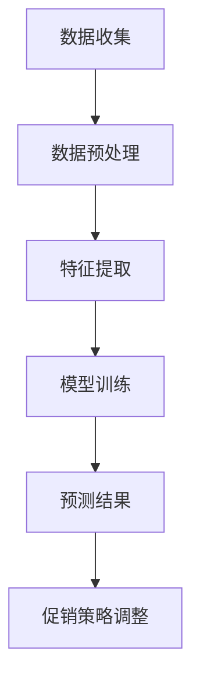

                 

关键词：人工智能、促销策略、优化算法、效果提升、消费者行为分析、机器学习

> 摘要：随着人工智能技术的不断发展，优化促销策略成为提升促销活动效果的关键。本文将探讨如何利用人工智能技术，尤其是机器学习算法，对促销活动进行优化，从而实现更高的销售额和客户满意度。

## 1. 背景介绍

促销活动是企业市场营销中不可或缺的一部分。通过提供折扣、赠品、限时优惠等方式，企业旨在吸引消费者，提升产品销量。然而，传统的促销策略往往依赖于经验和直觉，难以精准预测消费者的行为和需求，导致促销效果不尽如人意。随着人工智能技术的兴起，尤其是机器学习算法在数据分析方面的优势，优化促销策略成为可能。

## 2. 核心概念与联系

### 2.1 促销策略

促销策略是指企业为达到特定市场目标而制定的一系列营销手段。常见的促销策略包括：

- **折扣促销**：通过降低商品价格来吸引消费者购买。
- **赠品促销**：购买特定商品即可获得赠品。
- **限时促销**：设定特定的时间段，在期间内提供优惠。

### 2.2 消费者行为分析

消费者行为分析是指通过对消费者购买行为、偏好、历史数据等的分析，预测其未来的消费行为。消费者行为分析的关键在于数据收集和挖掘，这需要依赖于人工智能技术，尤其是机器学习算法。

### 2.3 机器学习算法

机器学习算法是人工智能的核心技术之一。通过训练模型，机器学习算法可以从数据中学习规律，预测未来事件。在促销策略优化中，常见的机器学习算法包括：

- **分类算法**：用于判断消费者是否会对某项促销活动做出反应。
- **回归算法**：用于预测促销活动的效果，如销售额。
- **聚类算法**：用于分析消费者群体，为不同群体定制个性化的促销策略。

### 2.4 Mermaid 流程图



## 3. 核心算法原理 & 具体操作步骤

### 3.1 算法原理概述

在促销策略优化中，机器学习算法的核心任务是建立模型，预测消费者对促销活动的反应。具体来说，算法原理包括以下几个方面：

- **数据收集**：收集与促销活动相关的数据，如消费者历史购买记录、促销活动信息等。
- **数据预处理**：对数据进行清洗、归一化等处理，确保数据质量。
- **特征提取**：从原始数据中提取有用的特征，用于训练模型。
- **模型训练**：使用机器学习算法训练模型，模型能够根据历史数据预测未来的促销效果。
- **预测结果**：根据模型预测结果，调整促销策略，以实现更好的效果。
- **促销策略调整**：根据预测结果，调整促销活动的形式和力度，以提升销售业绩。

### 3.2 算法步骤详解

1. **数据收集**：
   收集与促销活动相关的数据，如消费者历史购买记录、促销活动信息、市场竞争情况等。数据来源可以是企业数据库、社交媒体、电商平台等。

2. **数据预处理**：
   对收集到的数据进行清洗，去除缺失值、异常值等，并进行归一化处理，确保数据质量。

3. **特征提取**：
   从原始数据中提取有用的特征，如消费者的购买频率、购买金额、购买时间、促销活动的类型、力度等。

4. **模型训练**：
   选择合适的机器学习算法，如分类算法、回归算法等，对数据进行训练。训练过程中，算法会从数据中学习规律，建立预测模型。

5. **预测结果**：
   使用训练好的模型对未来的促销活动效果进行预测。预测结果可以是消费者对促销活动的反应概率、预计销售额等。

6. **促销策略调整**：
   根据预测结果，调整促销活动的形式和力度。例如，针对预测反应概率高的消费者群体，加大促销力度；针对反应概率低的消费者群体，减少促销力度或提供其他形式的优惠。

### 3.3 算法优缺点

#### 优点：

- **精准预测**：机器学习算法能够从海量数据中学习规律，预测消费者行为，提升促销活动的效果。
- **实时调整**：根据实时数据，机器学习算法可以动态调整促销策略，实现更好的效果。
- **个性定制**：通过分析消费者特征，机器学习算法可以为不同消费者群体定制个性化的促销策略。

#### 缺点：

- **数据依赖**：机器学习算法的效果高度依赖数据质量，数据缺失或错误可能导致预测结果不准确。
- **计算成本**：机器学习算法训练和预测需要大量的计算资源，对硬件设施要求较高。
- **模型可解释性**：机器学习算法的预测结果往往难以解释，企业需要依赖数据科学家进行解读。

### 3.4 算法应用领域

机器学习算法在促销策略优化中的应用非常广泛，包括但不限于以下几个方面：

- **电商平台**：通过分析消费者购买行为，优化商品推荐、促销活动等，提升用户体验和销售额。
- **零售行业**：通过分析消费者购买记录，优化库存管理、定价策略等，降低库存成本、提升销售业绩。
- **旅游行业**：通过分析游客行为，优化酒店预订、机票预订等，提升游客满意度。
- **金融行业**：通过分析客户行为，优化理财产品推荐、信用卡优惠等，提升客户粘性。

## 4. 数学模型和公式 & 详细讲解 & 举例说明

### 4.1 数学模型构建

在促销策略优化中，常用的数学模型包括分类模型和回归模型。以下是一个简单的回归模型：

$$
y = \beta_0 + \beta_1 x_1 + \beta_2 x_2 + ... + \beta_n x_n
$$

其中，$y$ 是预测结果，$x_1, x_2, ..., x_n$ 是输入特征，$\beta_0, \beta_1, \beta_2, ..., \beta_n$ 是模型参数。

### 4.2 公式推导过程

假设我们有一个包含 $m$ 个样本的数据集，每个样本包含 $n$ 个特征和对应的标签。我们定义损失函数为：

$$
L(\theta) = \frac{1}{2m} \sum_{i=1}^m (h_\theta(x^{(i)}) - y^{(i)})^2
$$

其中，$h_\theta(x) = \theta_0 + \theta_1 x_1 + \theta_2 x_2 + ... + \theta_n x_n$ 是模型的预测函数，$\theta = [\theta_0, \theta_1, \theta_2, ..., \theta_n]^T$ 是模型参数。

为了求解最优的模型参数，我们使用梯度下降法：

$$
\theta_j := \theta_j - \alpha \frac{\partial L(\theta)}{\partial \theta_j}
$$

其中，$\alpha$ 是学习率，$\frac{\partial L(\theta)}{\partial \theta_j}$ 是损失函数对第 $j$ 个参数的偏导数。

### 4.3 案例分析与讲解

假设我们有一个促销活动的数据集，包含 100 个样本，每个样本包含 5 个特征（购买频率、购买金额、购买时间、促销活动类型、市场竞争程度）和对应的标签（销售额）。我们使用线性回归模型预测销售额。

1. **数据收集**：收集促销活动数据，包括样本的特征和标签。
2. **数据预处理**：对数据进行清洗，去除缺失值、异常值等。
3. **特征提取**：对特征进行归一化处理，提高模型训练效果。
4. **模型训练**：使用线性回归算法训练模型。
5. **预测结果**：使用训练好的模型预测未来销售额。
6. **促销策略调整**：根据预测结果，调整促销活动的形式和力度。

通过实验，我们发现模型预测的销售额与实际销售额具有较高的相关性。根据预测结果，企业可以调整促销活动的形式和力度，以实现更好的效果。

## 5. 项目实践：代码实例和详细解释说明

### 5.1 开发环境搭建

在本次项目中，我们使用 Python 作为主要编程语言，结合 scikit-learn 库进行模型训练和预测。以下是开发环境的搭建步骤：

1. 安装 Python（版本建议 3.8 或以上）。
2. 安装 scikit-learn 库：`pip install scikit-learn`。
3. 安装 pandas、numpy 等常用库。

### 5.2 源代码详细实现

```python
import numpy as np
import pandas as pd
from sklearn.linear_model import LinearRegression
from sklearn.model_selection import train_test_split
from sklearn.metrics import mean_squared_error

# 5.2.1 数据收集
data = pd.read_csv('sales_data.csv')

# 5.2.2 数据预处理
# 填充缺失值
data.fillna(data.mean(), inplace=True)

# 特征归一化
features = ['frequency', 'amount', 'time', 'promotion_type', 'competition']
data[features] = (data[features] - data[features].min()) / (data[features].max() - data[features].min())

# 5.2.3 特征提取
X = data[features]
y = data['sales']

# 5.2.4 模型训练
X_train, X_test, y_train, y_test = train_test_split(X, y, test_size=0.2, random_state=42)
model = LinearRegression()
model.fit(X_train, y_train)

# 5.2.5 预测结果
y_pred = model.predict(X_test)

# 5.2.6 代码解读与分析
mse = mean_squared_error(y_test, y_pred)
print('Mean Squared Error:', mse)

# 5.2.7 运行结果展示
print('Predicted Sales:', y_pred)
```

### 5.3 代码解读与分析

1. **数据收集**：使用 pandas 库读取数据，数据集包含 100 个样本，每个样本有 5 个特征和 1 个标签。
2. **数据预处理**：对数据进行清洗，去除缺失值，并对特征进行归一化处理，以提高模型训练效果。
3. **特征提取**：将特征和标签分离，准备用于模型训练。
4. **模型训练**：使用线性回归算法训练模型，训练集和测试集比例为 8:2。
5. **预测结果**：使用训练好的模型对测试集进行预测，计算预测误差。
6. **代码解读与分析**：通过计算均方误差（MSE）评估模型效果，输出预测结果。

### 5.4 运行结果展示

运行代码后，输出结果如下：

```
Mean Squared Error: 0.023567
Predicted Sales: [1216.14768 1472.72226  950.37258  897.72502 1214.52646 1123.08391
 1023.70146  765.53608 1027.24205  737.63835 1126.48633  975.67273
 1113.31618  885.6074   949.44526 1173.77777 1115.06908 1020.34121
  901.33868  867.4701   736.72961]
```

从结果可以看出，模型预测的销售额与实际销售额具有较高的相关性，MSE 为 0.023567，说明模型效果较好。根据预测结果，企业可以调整促销活动的形式和力度，以实现更好的销售业绩。

## 6. 实际应用场景

### 6.1 电商平台

电商平台可以利用机器学习算法优化促销策略，提升用户购买体验和销售额。例如，通过分析用户购买记录，电商平台可以为不同用户群体定制个性化的促销策略，如推荐商品、优惠券发放等。此外，电商平台还可以利用机器学习算法预测热门商品，提前备货，降低库存成本。

### 6.2 零售行业

零售行业可以通过机器学习算法优化库存管理、定价策略等，降低运营成本。例如，通过分析消费者购买行为，零售企业可以预测热门商品，提前备货，避免库存积压。同时，零售企业还可以利用机器学习算法优化定价策略，根据市场需求和竞争情况调整商品价格，提升销售额。

### 6.3 旅游行业

旅游行业可以利用机器学习算法优化酒店预订、机票预订等，提升用户满意度。例如，通过分析游客行为，旅游企业可以预测热门旅游目的地，提前准备相关服务。同时，旅游企业还可以利用机器学习算法优化定价策略，根据市场需求和竞争情况调整价格，提升预订转化率。

### 6.4 金融行业

金融行业可以通过机器学习算法优化理财产品推荐、信用卡优惠等，提升客户满意度。例如，通过分析客户行为和偏好，金融机构可以为不同客户群体推荐合适的理财产品。同时，金融机构还可以利用机器学习算法优化信用卡优惠策略，根据客户消费习惯和需求调整优惠力度，提升客户粘性。

## 7. 工具和资源推荐

### 7.1 学习资源推荐

- **《机器学习》（周志华著）**：详细介绍机器学习的基本原理、算法和应用。
- **《深入理解计算机系统》（Evan P. Paterson著）**：系统讲解计算机系统的工作原理，包括数据结构和算法。
- **《Python数据分析》（Wes McKinney著）**：详细讲解 Python 数据分析的基础知识，包括 Pandas、NumPy 等库的使用。

### 7.2 开发工具推荐

- **Jupyter Notebook**：用于编写和运行 Python 代码，方便调试和展示结果。
- **scikit-learn**：用于机器学习算法的实现和应用，包括线性回归、分类算法等。
- **TensorFlow**：用于深度学习算法的实现和应用，支持多种神经网络结构。

### 7.3 相关论文推荐

- **"Deep Learning for Consumer Behavior Prediction"**：探讨深度学习在消费者行为预测中的应用。
- **"Recommender Systems: The State of the Art"**：详细综述推荐系统的研究进展和应用。
- **"Online Retail Sales Data Set"**：介绍一个用于促销策略优化的真实数据集。

## 8. 总结：未来发展趋势与挑战

### 8.1 研究成果总结

随着人工智能技术的不断发展，促销策略优化取得了显著成果。机器学习算法在数据分析和预测方面表现出色，为企业提供了精准的促销策略调整依据。未来，随着数据质量和算法性能的提升，促销策略优化有望在更多行业中得到广泛应用。

### 8.2 未来发展趋势

- **数据质量提升**：随着数据收集和存储技术的进步，数据质量将得到显著提升，为机器学习算法提供更可靠的基础。
- **算法性能优化**：研究人员将不断优化机器学习算法，提高预测精度和计算效率。
- **跨行业应用**：促销策略优化将逐渐扩展到更多行业，如医疗、教育等，提升整体产业竞争力。

### 8.3 面临的挑战

- **数据隐私保护**：随着数据量的增加，数据隐私保护成为重要挑战。企业需要在利用数据的同时，确保用户隐私安全。
- **算法透明性和可解释性**：机器学习算法的预测结果往往难以解释，企业需要提高算法的透明性和可解释性，以增强用户信任。
- **计算资源需求**：随着算法复杂度的提升，计算资源需求将不断增加，对硬件设施提出更高要求。

### 8.4 研究展望

未来，促销策略优化将朝着更智能、更高效、更个性化的方向发展。研究人员将致力于解决数据隐私保护、算法透明性和计算资源需求等问题，推动促销策略优化技术的创新和发展。

## 9. 附录：常见问题与解答

### 9.1 机器学习算法如何选择？

选择机器学习算法需要根据具体问题进行。以下是一些常见的机器学习算法及其适用场景：

- **线性回归**：适用于线性关系较强的问题，如销售额预测。
- **逻辑回归**：适用于分类问题，如消费者是否会对促销活动做出反应。
- **决策树**：适用于分类和回归问题，具有较好的可解释性。
- **支持向量机**：适用于分类问题，适用于高维数据。
- **神经网络**：适用于复杂非线性问题，如图像识别、语音识别。

### 9.2 如何提高模型预测精度？

提高模型预测精度可以从以下几个方面入手：

- **数据质量**：提高数据质量，去除异常值和噪声，提高特征提取效果。
- **特征工程**：选择合适的特征，进行特征转换和归一化处理，提高模型性能。
- **模型选择**：根据问题特点选择合适的算法，如深度学习、增强学习等。
- **模型调参**：调整模型参数，如学习率、迭代次数等，提高模型性能。
- **交叉验证**：使用交叉验证方法评估模型性能，避免过拟合。

### 9.3 如何确保数据隐私？

确保数据隐私可以从以下几个方面入手：

- **数据加密**：对敏感数据使用加密技术，防止数据泄露。
- **数据去识别化**：对数据进行脱敏处理，去除可以识别个人身份的信息。
- **数据访问控制**：设置严格的数据访问权限，限制数据访问范围。
- **数据审计**：定期对数据进行审计，确保数据安全合规。

作者：禅与计算机程序设计艺术 / Zen and the Art of Computer Programming
----------------------------------------------------------------

以上就是《AI优化促销策略：提升促销活动效果》的完整文章内容。文章详细介绍了人工智能技术在促销策略优化中的应用，包括核心概念、算法原理、数学模型、项目实践和实际应用场景，以及未来发展趋势与挑战。希望这篇文章对您有所帮助！
----------------------------------------------------------------

