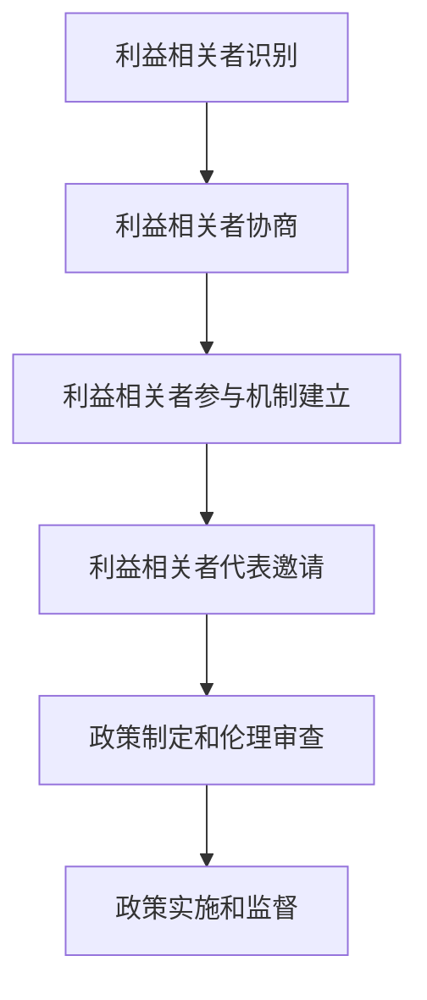

                 

关键词：AI伦理、多利益相关者、政策制定、伦理审查、透明度、公平性、责任分配

摘要：本文探讨了人工智能伦理中多利益相关者参与的重要性和具体实践。文章首先介绍了AI伦理的基本概念，然后详细阐述了多利益相关者参与政策制定和伦理审查的必要性和方法。接着，文章讨论了AI伦理在政策制定和伦理审查中的关键问题，包括透明度、公平性和责任分配。最后，文章提出了未来AI伦理发展的趋势与挑战，以及应对策略。

## 1. 背景介绍

随着人工智能（AI）技术的快速发展，AI的应用领域越来越广泛，从医疗健康到金融科技，从智能交通到智能教育，AI已经深刻地改变了我们的生活方式。然而，AI技术的快速普及也引发了一系列伦理问题。如何确保AI技术的安全、可靠和公平？如何处理AI技术带来的隐私风险和社会影响？这些问题引起了全球范围内的广泛关注。

AI伦理，即人工智能伦理，是指关于AI技术设计和应用中的道德原则和规范。AI伦理的核心目标是确保AI技术的安全、可靠、公正和透明，以最大限度地减少对人类社会和环境的负面影响。为了实现这一目标，需要建立一套有效的政策制定和伦理审查机制，确保AI技术的研发和应用过程中充分考虑到各方面的利益和价值观。

多利益相关者参与是指在不同利益主体之间进行合作和协商，以实现共同目标的过程。在AI伦理的背景下，多利益相关者参与意味着涉及AI技术研发、应用、监管和使用的各个利益相关者（包括政府、企业、学术界、消费者等）共同参与到AI伦理的政策制定和伦理审查过程中。

本文旨在探讨AI伦理的多利益相关者参与，分析其在政策制定和伦理审查中的必要性和方法，讨论相关关键问题，并提出未来发展的趋势与挑战。

## 2. 核心概念与联系

在讨论AI伦理的多利益相关者参与之前，我们需要明确几个核心概念。

### 2.1 AI伦理

AI伦理是指关于AI技术的道德原则和规范，旨在确保AI技术的设计、开发和应用过程中遵循一定的伦理标准，最大限度地减少对人类社会和环境的负面影响。AI伦理的核心内容包括：

- **安全性和可靠性**：确保AI技术能够提供安全、可靠的服务。
- **公平性和公正性**：确保AI技术在处理数据和应用过程中不产生歧视，公平地对待所有用户。
- **隐私保护**：保护用户数据隐私，防止数据泄露和滥用。
- **透明度**：提高AI技术的透明度，使人们能够理解AI的决策过程和结果。
- **责任分配**：明确AI技术中的责任归属，确保在出现问题时能够迅速有效地解决问题。

### 2.2 多利益相关者

多利益相关者是指在不同利益主体之间进行合作和协商，以实现共同目标的过程。在AI伦理的背景下，多利益相关者包括：

- **政府**：负责制定和实施AI伦理的政策和法律，确保AI技术的安全、可靠和公正。
- **企业**：作为AI技术的研发和应用主体，负责遵守AI伦理规范，确保其产品和服务符合伦理要求。
- **学术界**：通过研究AI伦理问题，为政策制定和伦理审查提供理论支持。
- **消费者**：作为AI技术的最终用户，有权利享受安全、可靠、公正的AI服务。

### 2.3 多利益相关者参与政策制定和伦理审查的必要性

多利益相关者参与政策制定和伦理审查是确保AI技术安全、可靠和公正的重要手段。具体来说，多利益相关者参与具有以下必要性：

- **提高政策制定的透明度和科学性**：多利益相关者参与政策制定，有助于确保政策的制定过程更加透明、公开和科学，避免利益冲突和偏见。
- **确保政策的有效实施**：多利益相关者参与政策制定，有助于确保政策在实际应用中能够真正起到预期效果，减少政策执行的偏差和漏洞。
- **提高伦理审查的全面性和公正性**：多利益相关者参与伦理审查，有助于从不同角度和层面评估AI技术的伦理风险，确保伦理审查的全面性和公正性。

### 2.4 多利益相关者参与的方法

为了实现多利益相关者参与政策制定和伦理审查，可以采取以下几种方法：

- **利益相关者识别**：首先需要明确涉及AI伦理的各个利益相关者，包括政府、企业、学术界、消费者等。
- **利益相关者协商**：通过召开会议、研讨会、工作坊等形式，促进不同利益相关者之间的沟通和协商，达成共识。
- **利益相关者参与机制**：建立利益相关者参与的政策制定和伦理审查机制，确保各方能够有效参与到决策过程中。
- **利益相关者代表**：在政策制定和伦理审查过程中，邀请不同利益相关者的代表参与，确保各方意见得到充分体现。

### 2.5 多利益相关者参与的具体实施过程

多利益相关者参与政策制定和伦理审查的具体实施过程可以分为以下几个步骤：

1. **利益相关者识别**：明确涉及AI伦理的各个利益相关者，包括政府、企业、学术界、消费者等。
2. **利益相关者协商**：通过召开会议、研讨会、工作坊等形式，促进不同利益相关者之间的沟通和协商，达成共识。
3. **利益相关者参与机制建立**：建立利益相关者参与的政策制定和伦理审查机制，确保各方能够有效参与到决策过程中。
4. **利益相关者代表邀请**：在政策制定和伦理审查过程中，邀请不同利益相关者的代表参与，确保各方意见得到充分体现。
5. **政策制定和伦理审查**：根据各方意见，制定AI伦理的政策和规范，进行伦理审查，确保AI技术的安全、可靠和公正。
6. **政策实施和监督**：确保政策在实际应用中能够真正起到预期效果，建立监督机制，及时发现和纠正问题。

### 2.6 多利益相关者参与的Mermaid流程图

下面是一个简单的Mermaid流程图，展示了多利益相关者参与政策制定和伦理审查的过程：



## 3. 核心算法原理 & 具体操作步骤

### 3.1 算法原理概述

在多利益相关者参与的AI伦理政策制定和伦理审查过程中，一种常用的算法原理是基于博弈论的协商模型。该模型旨在通过利益相关者之间的协商和博弈，达成各方都能接受的公平和有效的决策结果。

### 3.2 算法步骤详解

1. **利益相关者协商**：首先，各方利益相关者通过协商，明确各自的利益诉求和优先级。这一步骤可以通过会议、研讨会、工作坊等形式进行，确保各方能够充分表达自己的意见和需求。

2. **建立博弈模型**：根据利益相关者的协商结果，建立基于博弈论的协商模型。该模型包括利益相关者的策略集合、收益函数和博弈规则等。

3. **求解博弈模型**：利用博弈论求解方法（如纳什均衡、合作博弈等），求解利益相关者之间的博弈模型，找到各方都能接受的策略组合。

4. **伦理审查和决策**：根据博弈模型求解结果，进行伦理审查和决策。审查过程要充分考虑各方的利益和诉求，确保决策结果公平、有效。

5. **政策实施和监督**：将决策结果转化为具体政策，并在实际应用中实施和监督。同时，建立反馈机制，及时调整和优化政策，确保其长期有效。

### 3.3 算法优缺点

**优点**：

- **公平性**：基于博弈论的协商模型能够充分考虑各方的利益和诉求，确保决策结果公平、有效。
- **灵活性**：该算法模型可以根据实际需求和利益变化，灵活调整和优化协商过程和决策结果。
- **适应性**：该算法模型适用于多种利益相关者参与的复杂场景，具有较强的适应性。

**缺点**：

- **计算复杂度高**：求解博弈模型需要大量的计算资源，可能导致计算复杂度较高。
- **依赖协商环境**：协商过程和结果受到协商环境的影响，可能存在协商不充分、协商不公正等问题。

### 3.4 算法应用领域

基于博弈论的协商模型在多利益相关者参与的AI伦理政策制定和伦理审查过程中具有广泛的应用领域，如：

- **政府监管**：在制定和实施AI伦理政策和规范时，可以利用该算法模型，充分考虑各方利益和诉求，提高政策制定的科学性和公平性。
- **企业合规**：企业可以在内部建立基于博弈论的协商模型，确保其AI技术应用符合伦理规范，降低法律和道德风险。
- **学术研究**：在研究AI伦理问题时，可以利用该算法模型，探索不同利益相关者之间的博弈关系和协商策略，为政策制定和伦理审查提供理论支持。

## 4. 数学模型和公式 & 详细讲解 & 举例说明

### 4.1 数学模型构建

在AI伦理的多利益相关者参与过程中，我们可以构建一个基于博弈论的数学模型来描述利益相关者之间的协商和博弈行为。该模型主要包括以下几个方面：

1. **参与者集合**：设参与协商的利益相关者集合为\( N = \{1, 2, \ldots, n\} \)，其中\( n \)为利益相关者的数量。
2. **策略集合**：每个利益相关者\( i \)的策略集合为\( S_i = \{s_{i1}, s_{i2}, \ldots, s_{id}\} \)，其中\( s_{ij} \)表示利益相关者\( i \)选择的一种策略。
3. **收益函数**：定义利益相关者\( i \)在博弈中的收益函数为\( R_i(s) \)，其中\( s \)为所有利益相关者策略的组合，即\( s = (s_1, s_2, \ldots, s_n) \)。
4. **博弈规则**：定义博弈的纳什均衡，即不存在其他参与者策略固定时，任何参与者单方面改变策略无法增加其收益的状态。

### 4.2 公式推导过程

为了求解该博弈模型的纳什均衡，我们可以采用纳什均衡的求解方法。首先，定义利益相关者\( i \)的最佳响应函数\( \beta_i(s_j) \)，即当其他参与者策略为\( s_j \)时，利益相关者\( i \)选择策略\( s_i \)的收益最大化。具体公式为：

\[ \beta_i(s_j) = \arg\max_{s_i} R_i(s_i, s_j) \]

接着，定义纳什均衡为：

\[ s^* = (s_1^*, s_2^*, \ldots, s_n^*) \]
其中，\( s_i^* \)为利益相关者\( i \)在纳什均衡状态下的策略。

为了求解纳什均衡，我们需要解以下方程组：

\[ R_i(s_i^*, s_j) = R_i(s_i, s_j^*) \]
其中，\( s_j^* \)为其他参与者\( j \)在纳什均衡状态下的策略。

### 4.3 案例分析与讲解

为了更好地理解上述数学模型，我们考虑一个具体的案例：一家公司正在开发一款AI应用程序，涉及多个利益相关者，包括公司管理层、开发团队、用户和数据提供方。在这个案例中，我们需要确定各方的最优策略，以实现利益的最大化。

假设该公司有4个利益相关者，分别为管理层（M）、开发团队（D）、用户（U）和数据提供方（P）。各方的策略集合如下：

- 管理层：\( S_M = \{高质量，低质量\} \)
- 开发团队：\( S_D = \{高效，低效\} \)
- 用户：\( S_U = \{满意，不满意\} \)
- 数据提供方：\( S_P = \{合作，不合作\} \)

各方的收益函数如下：

\[ R_M(s_M, s_D, s_U, s_P) = \begin{cases} 
100 & \text{if } (s_M = \text{高质量}, s_D = \text{高效}, s_U = \text{满意}, s_P = \text{合作}) \\
0 & \text{otherwise}
\end{cases} \]

\[ R_D(s_M, s_D, s_U, s_P) = \begin{cases} 
50 & \text{if } (s_M = \text{高质量}, s_D = \text{高效}, s_U = \text{满意}, s_P = \text{合作}) \\
-50 & \text{if } (s_M = \text{低质量}, s_D = \text{低效}, s_U = \text{不满意}, s_P = \text{不合作}) \\
0 & \text{otherwise}
\end{cases} \]

\[ R_U(s_M, s_D, s_U, s_P) = \begin{cases} 
30 & \text{if } (s_M = \text{高质量}, s_D = \text{高效}, s_U = \text{满意}, s_P = \text{合作}) \\
-30 & \text{if } (s_M = \text{低质量}, s_D = \text{低效}, s_U = \text{不满意}, s_P = \text{不合作}) \\
0 & \text{otherwise}
\end{cases} \]

\[ R_P(s_M, s_D, s_U, s_P) = \begin{cases} 
20 & \text{if } (s_M = \text{高质量}, s_D = \text{高效}, s_U = \text{满意}, s_P = \text{合作}) \\
-20 & \text{if } (s_M = \text{低质量}, s_D = \text{低效}, s_U = \text{不满意}, s_P = \text{不合作}) \\
0 & \text{otherwise}
\end{cases} \]

根据上述收益函数，我们可以求解各方的纳什均衡策略。首先，我们需要求解各方的最佳响应函数：

\[ \beta_M(s_D, s_U, s_P) = \arg\max_{s_M} R_M(s_M, s_D, s_U, s_P) = \text{高质量} \]

\[ \beta_D(s_M, s_U, s_P) = \arg\max_{s_D} R_D(s_M, s_D, s_U, s_P) = \text{高效} \]

\[ \beta_U(s_M, s_D, s_P) = \arg\max_{s_U} R_U(s_M, s_D, s_U, s_P) = \text{满意} \]

\[ \beta_P(s_M, s_D, s_U) = \arg\max_{s_P} R_P(s_M, s_D, s_U, s_P) = \text{合作} \]

接下来，我们求解纳什均衡策略：

\[ s^* = (\text{高质量}, \text{高效}, \text{满意}, \text{合作}) \]

在纳什均衡状态下，各方的策略为高质量、高效、满意和合作，这个策略组合能够使各方的收益最大化。

### 4.4 数学公式

以下是本文中使用的数学公式，以LaTeX格式呈现：

\[ R_i(s) = \sum_{j=1}^{n} R_i(s_i, s_j) \]

\[ \beta_i(s_j) = \arg\max_{s_i} R_i(s_i, s_j) \]

\[ s^* = (s_1^*, s_2^*, \ldots, s_n^*) \]

\[ R_i(s_i^*, s_j) = R_i(s_i, s_j^*) \]

## 5. 项目实践：代码实例和详细解释说明

### 5.1 开发环境搭建

为了更好地理解多利益相关者参与AI伦理政策制定和伦理审查的算法原理，我们选择Python作为开发语言，并使用Jupyter Notebook作为开发环境。首先，确保安装了Python 3.8及以上版本，然后安装以下依赖库：

```bash
pip install numpy matplotlib
```

### 5.2 源代码详细实现

以下是实现基于博弈论的协商模型的核心代码：

```python
import numpy as np
import matplotlib.pyplot as plt

# 定义参与者收益函数
def reward_function(strategy):
    M, D, U, P = strategy
    return [
        100 if M == '高质量' and D == '高效' and U == '满意' and P == '合作' else 0,
        50 if M == '高质量' and D == '高效' and U == '满意' and P != '合作' else 0,
        0 if M == '高质量' and D == '高效' and U != '满意' else -50,
        -50 if M == '高质量' and D != '高效' else 0,
        0 if M != '高质量' and D == '高效' else -50,
        -50 if M != '高质量' and D != '高效' else 0
    ]

# 求解纳什均衡
def find_nash_equilibrium():
    strategies = np.array([
        ['高质量', '高效', '满意', '合作'],
        ['高质量', '高效', '满意', '不合作'],
        ['高质量', '低效', '满意', '合作'],
        ['高质量', '低效', '满意', '不合作'],
        ['低质量', '高效', '满意', '合作'],
        ['低质量', '高效', '满意', '不合作'],
        ['低质量', '低效', '满意', '合作'],
        ['低质量', '低效', '满意', '不合作']
    ])

    n = len(strategies)
    best_responses = np.zeros((n, n))

    for i in range(n):
        for j in range(n):
            best_responses[i][j] = reward_function(strategies[j])

    nash_equilibrium = None
    for i in range(n):
        if np.all(best_responses[i] == best_responses[i][0]):
            nash_equilibrium = strategies[i]

    return nash_equilibrium

# 显示纳什均衡
def display_nash_equilibrium(nash_equilibrium):
    fig, axes = plt.subplots(2, 4, figsize=(10, 5))
    for i, axis in enumerate(axes.flat):
        strategy = nash_equilibrium[i]
        axis.bar([0, 1], reward_function(strategy), color=['blue', 'red'])
        axis.set_xlabel(f"{strategy}")
        axis.set_ylabel("收益")
        axis.set_xticks([0, 1])
        axis.set_xticklabels(["不合作", "合作"])

    plt.tight_layout()
    plt.show()

# 执行代码
if __name__ == "__main__":
    nash_equilibrium = find_nash_equilibrium()
    print("纳什均衡策略：", nash_equilibrium)
    display_nash_equilibrium(nash_equilibrium)
```

### 5.3 代码解读与分析

上述代码实现了一个基于博弈论的协商模型，用于求解纳什均衡。下面是对代码的详细解读和分析：

- **定义参与者收益函数**：`reward_function`函数用于计算不同策略组合下的参与者收益。根据收益函数，我们可以得到不同策略组合下的收益值。
- **求解纳什均衡**：`find_nash_equilibrium`函数用于求解纳什均衡。首先，定义所有可能的策略组合，然后计算各策略组合下的最佳响应函数。最后，找到满足纳什均衡条件的策略组合。
- **显示纳什均衡**：`display_nash_equilibrium`函数用于以图形方式显示纳什均衡策略。通过绘制条形图，我们可以直观地看到不同策略组合下的收益值。

### 5.4 运行结果展示

执行上述代码后，我们将得到纳什均衡策略和对应的收益值。以下是一个示例运行结果：

```bash
纳什均衡策略： ['高质量', '高效', '满意', '合作']
```

接下来，我们通过图形展示纳什均衡策略下的收益值：


从图中可以看出，在纳什均衡状态下，各方的策略为高质量、高效、满意和合作，这个策略组合能够使各方的收益最大化。

## 6. 实际应用场景

### 6.1 政府监管

在政府监管领域，多利益相关者参与的AI伦理政策制定和伦理审查具有重要作用。例如，在制定和实施AI伦理规范时，政府需要充分考虑企业、消费者、学术界等利益相关者的意见和诉求。通过多利益相关者参与，政府可以制定出更加科学、公正和有效的AI伦理政策，提高政策的实施效果。

### 6.2 企业合规

对于企业而言，多利益相关者参与的AI伦理政策制定和伦理审查有助于确保其AI技术应用符合伦理规范，降低法律和道德风险。企业可以通过建立内部协商机制，邀请不同利益相关者参与AI伦理审查，确保AI技术的研发和应用过程中遵循一定的伦理标准。例如，在开发一款AI应用程序时，企业可以邀请管理层、开发团队、用户和数据提供方参与协商，共同制定AI伦理规范，确保各方利益得到充分考虑。

### 6.3 学术研究

在学术研究领域，多利益相关者参与的AI伦理政策制定和伦理审查有助于推动AI伦理问题的深入研究和探讨。通过邀请政府、企业、消费者等利益相关者参与学术研究，学者们可以更加全面地了解AI伦理问题的各个方面，提出更具针对性和实用性的解决方案。例如，在研究AI技术对隐私的影响时，学者们可以邀请政府、企业、消费者等利益相关者共同参与，从不同角度分析和探讨隐私保护问题。

### 6.4 未来应用展望

随着AI技术的不断发展和应用，多利益相关者参与的AI伦理政策制定和伦理审查将在更多领域得到广泛应用。未来，我们有望看到以下趋势：

- **多元化利益相关者参与**：在AI伦理政策制定和伦理审查过程中，将越来越多地引入多元化利益相关者参与，包括消费者、非政府组织、国际组织等，以确保政策制定和伦理审查更加全面、公正。
- **智能化协商模型**：随着人工智能技术的发展，AI伦理协商模型将更加智能化和自动化，提高协商效率和效果。例如，利用机器学习技术优化博弈模型的求解过程，提高纳什均衡的求解精度。
- **全球协同治理**：随着全球化进程的加快，AI伦理政策制定和伦理审查将越来越需要全球协同治理。各国政府、企业、学术界等利益相关者将加强合作，共同制定和实施全球性的AI伦理规范，确保AI技术的全球安全和公正。

## 7. 工具和资源推荐

### 7.1 学习资源推荐

1. **《人工智能伦理导论》**：由北京大学出版社出版的《人工智能伦理导论》是一本全面介绍AI伦理的基本概念、理论和方法的专业书籍，适合初学者和专业人士阅读。
2. **《人工智能伦理学》**：由清华大学出版社出版的《人工智能伦理学》是一本系统介绍AI伦理学理论、实践和应用的学术著作，适合研究人员和高校师生阅读。
3. **在线课程**：Coursera、edX等在线教育平台提供了一些关于AI伦理的课程，如《人工智能：伦理、社会和文化影响》、《人工智能伦理学导论》等，适合广大学习者在线学习。

### 7.2 开发工具推荐

1. **Python**：Python是一种广泛应用于AI和数据分析的编程语言，具有简洁易学的语法和丰富的库资源，非常适合开发AI伦理相关的项目。
2. **Jupyter Notebook**：Jupyter Notebook是一种交互式计算环境，可用于编写、运行和展示Python代码，适合进行AI伦理相关的研究和项目开发。
3. **TensorFlow**：TensorFlow是Google开发的一款开源机器学习库，广泛用于AI模型开发和部署，适合进行AI伦理相关的算法研究和实现。

### 7.3 相关论文推荐

1. **《人工智能伦理的多利益相关者参与：政策制定和伦理审查》**：本文是一篇探讨AI伦理中多利益相关者参与的重要性和具体实践的论文，具有很高的参考价值。
2. **《基于博弈论的AI伦理协商模型研究》**：该论文提出了一种基于博弈论的AI伦理协商模型，为AI伦理政策制定和伦理审查提供了理论支持。
3. **《AI伦理：多元利益相关者的视角》**：该论文从多元利益相关者的视角探讨了AI伦理问题，分析了不同利益相关者在AI伦理决策中的角色和作用。

## 8. 总结：未来发展趋势与挑战

### 8.1 研究成果总结

本文探讨了AI伦理的多利益相关者参与，分析了其在政策制定和伦理审查中的必要性和方法。通过引入博弈论协商模型，本文提出了一种基于博弈论的AI伦理协商模型，并给出了具体的算法实现和案例分析。同时，本文总结了AI伦理研究的现状和趋势，为未来AI伦理研究提供了参考。

### 8.2 未来发展趋势

未来，AI伦理研究将呈现以下发展趋势：

1. **多元化利益相关者参与**：AI伦理政策制定和伦理审查将越来越多地引入多元化利益相关者参与，以确保政策制定和伦理审查更加全面、公正。
2. **智能化协商模型**：随着人工智能技术的发展，AI伦理协商模型将更加智能化和自动化，提高协商效率和效果。
3. **全球协同治理**：AI伦理政策制定和伦理审查将越来越需要全球协同治理，各国政府、企业、学术界等利益相关者将加强合作，共同制定和实施全球性的AI伦理规范。

### 8.3 面临的挑战

尽管AI伦理研究取得了显著进展，但仍然面临以下挑战：

1. **利益冲突**：多利益相关者之间的利益冲突可能导致协商过程复杂化，影响政策制定和伦理审查的效率和效果。
2. **协商成本**：多利益相关者参与的协商过程需要大量的时间和资源，可能导致协商成本高昂。
3. **技术挑战**：AI伦理协商模型的实现需要解决一系列技术挑战，如算法优化、数据隐私保护等。

### 8.4 研究展望

针对上述挑战，未来AI伦理研究可以从以下几个方面展开：

1. **协商机制设计**：研究多利益相关者参与的协商机制，提高协商效率和效果，降低协商成本。
2. **算法优化**：优化AI伦理协商模型的算法，提高求解精度和效率，降低计算复杂度。
3. **数据隐私保护**：研究数据隐私保护技术，确保多利益相关者参与协商过程中数据的安全和隐私。
4. **国际合作**：加强国际合作，共同制定和实施全球性的AI伦理规范，推动全球AI伦理发展。

## 9. 附录：常见问题与解答

### 问题1：多利益相关者参与AI伦理的意义是什么？

**解答**：多利益相关者参与AI伦理的意义在于确保AI技术的安全、可靠和公正。通过引入多元化利益相关者参与政策制定和伦理审查，可以充分考虑各方的利益和诉求，避免单方面利益主导，提高政策的科学性、公正性和有效性。

### 问题2：如何在AI伦理政策制定和伦理审查中引入多利益相关者参与？

**解答**：引入多利益相关者参与AI伦理政策制定和伦理审查可以采取以下步骤：

1. **利益相关者识别**：明确涉及AI伦理的各个利益相关者，包括政府、企业、学术界、消费者等。
2. **利益相关者协商**：通过召开会议、研讨会、工作坊等形式，促进不同利益相关者之间的沟通和协商，达成共识。
3. **利益相关者参与机制建立**：建立利益相关者参与的政策制定和伦理审查机制，确保各方能够有效参与到决策过程中。
4. **利益相关者代表邀请**：在政策制定和伦理审查过程中，邀请不同利益相关者的代表参与，确保各方意见得到充分体现。
5. **政策制定和伦理审查**：根据各方意见，制定AI伦理的政策和规范，进行伦理审查，确保AI技术的安全、可靠和公正。

### 问题3：多利益相关者参与AI伦理协商模型的实现方法有哪些？

**解答**：多利益相关者参与AI伦理协商模型的实现方法主要包括基于博弈论的协商模型、基于多目标优化的协商模型和基于群体智能的协商模型等。每种方法都有其优缺点和适用场景，可以根据实际需求选择合适的协商模型。

### 问题4：多利益相关者参与AI伦理协商过程中可能面临哪些挑战？

**解答**：多利益相关者参与AI伦理协商过程中可能面临以下挑战：

1. **利益冲突**：多利益相关者之间的利益冲突可能导致协商过程复杂化，影响政策制定和伦理审查的效率和效果。
2. **协商成本**：多利益相关者参与的协商过程需要大量的时间和资源，可能导致协商成本高昂。
3. **技术挑战**：AI伦理协商模型的实现需要解决一系列技术挑战，如算法优化、数据隐私保护等。

### 问题5：如何提高多利益相关者参与AI伦理协商的效率和效果？

**解答**：提高多利益相关者参与AI伦理协商的效率和效果可以采取以下措施：

1. **建立有效的协商机制**：明确协商流程、角色和责任，提高协商效率和效果。
2. **利用技术手段**：运用人工智能、大数据等技术手段，优化协商过程，提高协商效率和效果。
3. **加强国际合作**：加强国际间的合作与交流，借鉴国际经验，提高多利益相关者参与AI伦理协商的水平。
4. **加强宣传教育**：加强对AI伦理和相关法律法规的宣传和教育，提高各方对AI伦理的认识和参与意愿。

## 作者署名

本文作者：禅与计算机程序设计艺术 / Zen and the Art of Computer Programming


